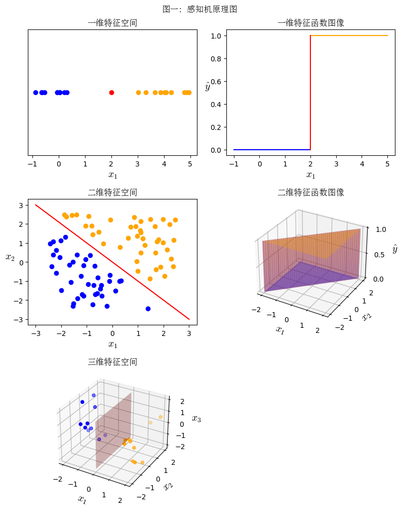

# 重构 MLP (DNN) 神经网络知识体系

[TOC]

最近重温了一下 MLP (DNN) 神经网络相关的知识, 想通了一些问题, 特此总结一下, 非常适合作为 2024 年的第一篇博客。

## 一、感知机算法

### 1.1 推理过程

感知机算法 ([perceptron](https://en.wikipedia.org/wiki/Perceptron)) 是神经网络算法的基础, 一个感知机相当于一个神经元。需要注意的是, 这个算法不是用来解决回归问题的, 而是用来解决 **二分类问题** 的。

我们用向量 $\bold{x}$ 表示样本特征, 标量 $y$ 表示样本类别。对于二分类问题来说, 我们用 **正类** (阳性) 和 **负类** (阴性) 作为类别的名称, 对应 $y$ 的值是 $1$ 和 $0$。因此, $y$ 的取值只有两个。

我们假设二分类问题在样本空间中 **线性可分**, 即可以用一个 **线性结构体** 来区分两个类别。我们可以用下图 (图一) 来理解这句话的含义。

观察图一左侧的三个图片。其中, 蓝色点表示 负类 样本, 橙色点表示 正类 样本, 红色表示 线性结构体。如果向量 $\bold{x}$ 是一维向量, 那么特征空间就是一个数轴, 对应线性结构体是一个点; 如果向量 $\bold{x}$ 是二维向量, 那么特征空间就是一个平面, 对应线性结构体是一条直线; 如果向量 $\bold{x}$ 是三维向量, 那么特征空间就是三维空间, 对应线性结构体是一个平面; 如果向量 $\bold{x}$ 的维度更高, 我们就无法想象了, 只能根据之前的情况进行合理推理了。

我们用 $\bold{w} \cdot \bold{x} + b = 0$ 来表示分割正负样本的线性结构体, 也被称作 **分割超平面**。高中学过线性规划应该知道, 对于样本 $\bold{x}_1$ 和 $\bold{x}_2$ 来说, 如果 $\bold{w} \cdot \bold{x}_1 + b \gt 0$ 且 $\bold{w} \cdot \bold{x}_2 + b \lt 0$, 那么样本 $\bold{x}_1$ 和 $\bold{x}_2$ 应该在 **分割超平面** 的两侧。也就是说, 我们可以根据 $\bold{w} \cdot \bold{x} + b$ 的值判断向量 $\bold{x}$ 所处的位置。

感知机算法就是要寻找分割超平面。因此, 向量 $\bold{w}$ 和 标量 $b$ 就是感知机的参数。我们将模型输出的类别记作 $\hat{y}$, 那么:

$$
\hat{y} = \sigma (\bold{w} \cdot \bold{x} + b) \tag{1.1}
$$

其中:

$$
\sigma (z) = \begin{cases}1 & z \gt 0 \\ 0 & z \le 0\end{cases} \tag{1.2}
$$

图一中右侧的图片就是就是公式 $(1.1)$ 的函数值图像。注意特征空间和函数图像之间的区别!!! 整个推理过程如下图 (图二) 所示:

那么, 我们怎么去寻找这个 **分割超平面** 呢?

### 1.2 训练过程

首先, 初始化向量 $\bold{w}$ 和标量 $b$ 的值为 $0$。

接下来, 不断遍历训练集中的每一个样本, 进行如下的操作:

如果预测正确 (即 $\hat{y} = y$), 那么模型参数不更新, 如果预测错误 (即 $\hat{y} \ne y$), 模型参数的更新方式如下:

$$
\bold{w} \gets \begin{cases}
    \bold{w} + \bold{x} & \text{if $\hat{y} = 0$ and $y = 1$} \\
    \bold{w} - \bold{x} & \text{if $\hat{y} = 1$ and $y = 0$} \\
\end{cases} \tag{1.3}
$$

$$
b \gets \begin{cases}
    b + 1 & \text{if $\hat{y} = 0$ and $y = 1$} \\
    b - 1 & \text{if $\hat{y} = 1$ and $y = 0$} \\
\end{cases} \tag{1.4}
$$

直到训练集中的样本都预测正确 (更合理的是: 验证集正确率达到某一阈值, 或者达到最大迭代次数)。

我们可以用数学的方式证明, 如果 正类 和 负类 之间是 线性可分 的, 那么在有限步数内, 通过上述方式, 一定能找到 分割超平面。

我们设 $z = \bold{w} \cdot \bold{x} + b$, 也就是说 $\hat{y} = \sigma (z)$, 那么, 我们可以直观的理解:

对于 false negative (预测错误且预测负类, 假阴性) 来说, $z$ 值明显偏小了, 更新时需要增大 $z$ 值。此时, 将 $\bold{w} = \bold{w} + \bold{x}$ 和 $b = b + 1$ 代入 $z$ 式中, 可以发现 $z$ 值一定增加。

对于 false positive (预测错误且预测正类, 假阳性) 来说, $z$ 值明显偏大了, 更新时需要减小 $z$ 值。此时, 将 $\bold{w} = \bold{w} - \bold{x}$ 和 $b = b - 1$ 代入 $z$ 式中, 可以发现 $z$ 值一定减小。

如果你了解 SGD 和 反向传播算法, 我们可以认为:

$$
\frac{\partial \mathrm{loss}}{\partial z} = \hat{y} - y = \begin{cases}
    -1 & \text{if $\hat{y} = 0$ and $y = 1$} \\
    1  & \text{if $\hat{y} = 1$ and $y = 0$} \\
    0  & \text{otherwise}
\end{cases} \tag{1.5}
$$

然后计算 loss 关于 $\bold{w}$ 和 $b$ 的梯度, 再更新即可。此时, 学习率 (lr) 为 1 且批大小 (batch_size) 为 1。

网上很多教程, 都是直接给 loss 公式, 默认公式 $(1.2)$ 中 $\sigma(x)$ 求导值为 1, 这是不合理的。实际上, $\sigma(x)$ 在零点不可导, 在非零点导数值为 0。因此我直接跳过了这一步骤, 直接给出公式 $(1.5)$, 这样更加合理。

还有, 网上很多教程不是用分段函数来描述公式 $(1.2)$, $(1.3)$ 和 $(1.4)$, 而是用一个公式来描述, 这简直就是天坑!!! 个人认为, 数学公式应该尽量易读!!!

### 1.3 和逻辑回归的关系

逻辑回归算法 ([logistic regression](https://en.wikipedia.org/wiki/Logistic_regression)) 可以看作是 感知机算法 的改进! 主要的改进点有两个:

(a) 公式 $(1.2)$ 有另外一个名字, 叫 **单位阶跃函数** ([unit step function](https://en.wikipedia.org/wiki/Heaviside_step_function))。在逻辑回归中, 图二的输出层不是单位阶跃函数, 而是 [sigmoid 函数](https://en.wikipedia.org/wiki/Sigmoid_function), 即 $\hat{y} = \mathrm{sigmoid} (z)$。sigmoid 函数可以理解为单位阶跃函数的光滑近似函数, 其在 -4 到 4 之间光滑。其导函数图像和 标准正态分布图像 相似, 在 -4 到 4 这个区间内导数值不为 0, 其它区间内导数都为 0, 在零点导数值最大, 为 0.25。具体见下图 (图三):

(b) 逻辑回归使用 交叉熵 作为 loss 函数, 而不像感知机那样, 没有 loss 函数。使用 交叉熵 loss 和 sigmoid 函数有很大关系, 最终得到 loss 关于 $z$ 的导数是 $\hat{y} - y$，和公式 $(1.5)$ 相似! 有问题可以参考我之前的 [文章](https://zhuanlan.zhihu.com/p/668156356) 的第五部分。

如果使用 SGD 算法进行训练, 设 $lr$ 是学习率, 如果 batch_size 为 1, 那么公式 $(1.3)$ 和 $(1.4)$ 变成:

$$
\bold{w} \gets \bold{w} - lr \cdot (\hat{y} - y) \cdot \bold{x} \tag{1.6}
$$

$$
b \gets b - lr \cdot (\hat{y} - y) \tag{1.7}
$$

如果 batch_size 不为 1, 我们用 $n$ 表示, 那么公式 $(1.6)$ 和 $(1.7)$ 变成:

$$
\bold{w} \gets \bold{w} - lr \cdot \frac1n \cdot \sum_{i=1}^n \bigg [ (\hat{y}_i - y_i) \cdot \bold{x}_i \bigg ]
\tag{1.8}
$$

$$
b \gets b - lr \cdot \frac1n \cdot \sum_{i=1}^n (\hat{y}_i - y_i) \tag{1.9}
$$

当然, 逻辑回归有其它训练方式, 并不一定要用 SGD, 具体的可以参考 [sklearn 接口文档](https://scikit-learn.org/stable/modules/generated/sklearn.linear_model.LogisticRegression.html)。

### 1.4 思考

观察公式 $(1.3)$, 我们是直接用向量 $\bold{x}$ 来更新向量 $\bold{w}$。也就是说, 感知机模型对于样本特征的分布非常敏感, 需要预先进行 异常值检测 和 z-score 标准化。否则, 在迭代过程中, 向量 $\bold{w}$ 的更新幅度可能会非常大, 导致训练不稳定。

公式 $(1.6)$ 到 $(1.9)$ 不仅仅适用于 逻辑回归, 也适用于 线性回归。对于 线性回归 来说, 不需要 $\sigma$ 函数, 也就是说 $\hat{y} = z$。可以看出这些算法的相似性。

感知机算法的前提是 正类 和 负类 线性可分。1969 年, 有人提出其解决不了 XOR 问题。举例来说, 假设样本空间是二维的, 第一象限和第三象限是正类, 第二象限和第四象限是负类, 此时感知机算法就无能为力了。

如何解决上述问题呢? 答案是用多个感知机, 而非单个感知机。

## 二、多层感知机

### 2.1 简介

多层感知机 (multi-layer perceptron, MLP) 是最简单的神经网络了。需要注意的是, 感知机算法 是用来解决 二分类问题 的, 而 MLP 是用来构建任意函数的。两者处理的问题是不同的!!!

MLP 主要由 隐藏层 和 输出层 构成, 大致的流程图如下 (图四):

输出层永远只有一层, 其就是 线性回归模型。如果在后面加上一个 sigmoid 函数, 那么就是 逻辑回归模型。

隐藏层则是由多个感知机构成的。从上图可以看出, 我们将所有 感知机 的输出作为 线性回归模型 的输入。在神经网络中, 我们将 感知机 称为 **神经元** (neuron), 将 $\sigma$ 函数称为 **激活函数** (activation function)。

在感知机算法中, 激活函数 就是 单位阶跃函数。但是, 在 神经网络 中, 激活函数的选择就很丰富了, 可以是 sigmoid 函数, tanh 函数, ReLU 函数, Leaky ReLU 函数等等。

和输出层不同的是, 隐藏层的个数是没有限制的。一般情况下, 如果只有一个隐藏层, 那么就是 **浅层网络** (shallow networks), 如果隐藏层的数量大于或者等于 2, 那么就是 **深层网络** (deep networks)。

神经网络的层数 是一个非常坑的概念, 不同地方的数法都不一致。一般情况下, MLP 的层数等于隐藏层数加输出层数。也就是说, MLP 至少有两层, **浅层网络** 的层数为 2, 而 **深层网络** 的层数大于 2。

### 2.2 通用近似定理

通用近似定理 ([Universal Approximation Theorem](https://en.wikipedia.org/wiki/Universal_approximation_theorem)) 是说, 使用 **浅层网络** 就可以近似 "构建" 任意函数了。

证明这个定理涉及到很多数学知识, 我在网上发现别人写的一个 [可视化解释博客](http://neuralnetworksanddeeplearning.com/chap4.html), 这里做一个总结。

在微积分中, 我们是怎么研究任意函数的呢? 我们将 定义域 划分成无数个 **小区间**, 每一个 **小区间** 内用一个多项式函数来近似。最简单的, 我们可以用 **常数函数** 来近似, 如下图 (图五) 所示:

我们将 分段常数函数 称为 **阶跃函数** ([step function](https://en.wikipedia.org/wiki/Step_function)), 也就是图五的红色部分。只要 **小区间** 足够的小, 那么我们就可以用 **阶跃函数** 来近似任意的函数。我们可以认为, 这是 零阶微分。如果我们用 线性函数 来近似每一个 **小区间** 内的函数, 那么就是 **一阶微分**, 更高阶的参考泰勒公式。

我们假设 MLP 的输入只有一个元素 $x$, 激活函数是 **单位阶跃函数**, 隐藏层有 $n$ 个神经元, 此时的流程图如下 (图六):

由于激活函数是 **单位阶跃函数**, 那么输入 $x$ 和隐藏层输出 $a$ 之间一定是 "单步" 的阶跃函数, 函数图像只有两种:

观察上图, 可以看出, 函数值在 $x = -\frac{b^h}{w^h}$ 处发生 "阶跃" (变化), "阶跃值" (变化值) 为 $\pm 1$。

隐藏层有 $n$ 个神经元, 就意味着有 $n$ 个 "单步" 阶跃函数。输出层的权重 $w^o$ 实际上就是改变 "阶跃" 的幅度, "阶跃值" 是 $\pm w^o$。最终, 将 $n$ 个 "单步" 阶跃函数求和, 就可以得到如 图五 所示的 "多步" 阶跃函数。

也就是说, 最终 $x$ 和 $\hat{y}$ 之间的关系是 阶跃函数, 最多进行 $n$ 次 "阶跃"。如果 $n$ 趋于无穷大, 那么就可以近似任意函数了。

这样, 我们就能理解, 为什么公式 $(1.2)$ 叫 **单位阶跃函数** 了, 函数值只进行一次 "阶跃" (变化), 发生在 $x = 0$ 处, 并且 "阶跃值" (变换值) 为 $1$。

需要注意的是, 隐藏测的参数 $b^h$ 非常重要, 其值不能为 0, 否则隐藏层所有的 "单步" 阶跃函数都在 $x = 0$ 处 "阶跃", 最终无法构成一个 "多步" 的阶跃函数。而输出层的参数 $b^o$ 则是可有可无的, 仅仅起到 锦上添花 的作用。

sigmoid 函数是 单位阶跃函数 的光滑近似函数, tanh 函数则是 [sign 函数](https://en.wikipedia.org/wiki/Sign_function) 的光滑近似函数, 两者是相似的。我们可以按照上述方式来理解。

每一个 **小区间** 除了用常数函数来 "近似", 还可以用线性函数来 "近似"。[ReLU 函数](https://en.wikipedia.org/wiki/Rectifier_(neural_networks)) 就是用线性函数来近似的, $x$ 和 $\hat{y}$ 之间的函数图像如下 (图八):

简单来说, 我们设单个 **线性函数** 为 $z = w^h \cdot x + b^h$, 其与 $x$ 轴的交点是 $x = -\frac{b^h}{w^h}$。ReLU 可以理解为只保留线性函数 $x > -\frac{b^h}{w^h}$ 的部分。$w^o$ 仅仅是改变线性函数的斜率。

特别强调一下, 无论是 单位阶跃函数, 还是 ReLU 函数, 隐藏层的 bias 参数非常重要! 而输出层的 bias 参数则是可有可无的。正是因为此, GPT2 模型中的分类层是没有 bias 参数。

### 2.3 浅层网络的反向传播

阅读这一部分前建议先阅读我之前的两篇博客: [深度学习与梯度](https://zhuanlan.zhihu.com/p/668156356) 和 [反向传播算法实现](https://zhuanlan.zhihu.com/p/673963942)。

我们可以认为, 反向传播包含两个过程: 首先, 求 loss 关于每一层输入的梯度; 然后, 求 loss 关于模型参数的梯度。

loss 关于每一层输入的梯度可以用 **计算图** 形象的表示出来, 如下图 (图九) 所示:

在图九中, 我们将单个 隐藏层 拆成了两层: 线性层 和 激活层。图中的每一个 "方框" 表示一个数字。图中的 "实线" 表示乘法, 并且有 "权重", "方框" 中的数字会和 "实线" 的 "权重" 相乘。图中的 "虚线" 表示特殊运算, 比方说 激活函数 $\sigma$。

在图九的反向计算图中, 只有 "实线", 没有 "虚线", 这是因为我们使用一个小区间内的 线性函数 来近似整个 MLP 函数, 更多的内容参考 多元链式求导法则。

在介绍完输入的梯度后, 我们来看看模型参数的梯度。这里使用图九的符号系统, 直接列公式了:

$$
\frac{\partial \mathrm{loss}}{\partial \bold{w}^o} = \frac{\partial \mathrm{loss}}{\partial \hat{y}} \cdot \bold{a} = (\hat{y} - y) \cdot \bold{a}
\tag{2.1}
$$

$$
\frac{\partial \mathrm{loss}}{\partial b^o} = \frac{\partial \mathrm{loss}}{\partial \hat{y}} \cdot 1 = (\hat{y} - y)
\tag{2.2}
$$

$$
\frac{\partial \mathrm{loss}}{\partial \bold{w}^h_1} = \frac{\partial \mathrm{loss}}{\partial z_1} \cdot \bold{x}
\tag{2.3}
$$

$$
\frac{\partial \mathrm{loss}}{\partial \bold{w}^h_2} = \frac{\partial \mathrm{loss}}{\partial z_2} \cdot \bold{x}
\tag{2.4}
$$

$$
\frac{\partial \mathrm{loss}}{\partial \bold{b}^h} = \frac{\partial \mathrm{loss}}{\partial \bold{z}}
\tag{2.5}
$$

如果有多个样本, 那么和公式 $(1.8)$ 以及 $(1.9)$ 一样, 变成求和的形式, 此时公式 $(2.3)$ 到 $(2.5)$ 变成:

$$
\frac{\partial \mathrm{loss}}{\partial \bold{w}^h_1} = \sum_k \frac{\partial \mathrm{loss}}{\partial z_1^{(k)}} \cdot \bold{x}^{(k)}
\tag{2.6}
$$

$$
\frac{\partial \mathrm{loss}}{\partial \bold{w}^h_2} = \sum_k \frac{\partial \mathrm{loss}}{\partial z_2^{(k)}} \cdot \bold{x}^{(k)}
\tag{2.7}
$$

$$
\frac{\partial \mathrm{loss}}{\partial \bold{b}^h} = \sum_k \frac{\partial \mathrm{loss}}{\partial \bold{z}^{(k)}}
\tag{2.8}
$$

其中, 上标 $\enspace^{(k)}$ 表示样本索引。在线性层中:

(a) 对于一个线性函数来说, bias ($b^h$) 的梯度等于每一个样本输出值 ($z$) 的梯度求和;

(b) 对于一个线性函数来说, weight ($\bold{w}^h$) 的梯度等于每一个样本输出值 ($z$) 的梯度值乘以输入值 ($\bold{x}$), 再求和;

(c) 对于一个样本来说, 输入值 ($\bold{x}$) 的梯度等于每一个线性函数输出值 ($z$) 的梯度乘以其 weight ($\bold{w}^h$), 再求和。

如果你理解上述内容, 那么 **梯度累加** ([Gradient Accumulation](https://huggingface.co/docs/accelerate/usage_guides/gradient_accumulation)) 应该就不难理解了。

结合 2.2 节和 2.3 节, 我们可以发现, 模型参数的初始化非常重要。如果一开始隐藏层的线性函数都是一样的, 那么会出现什么问题呢? 所有参数的梯度是一致的! 这样导致的结果就是: 每一次迭代后, 所有隐藏层的线性函数依旧是一样的。MLP 网络之所以能够运转, 依靠的是隐藏层线性函数的 "差异性"。如果没有, 不仅无法拟合任意函数, 训练过程将毫无意义。关于 模型参数初始化 的内容, 打算单独写一篇博客介绍。

从一系列公式中, 我们可以看出, 线性层权重的梯度和输入的数据 $\bold{x}$ 息息相关, 这也是为什么有人说大型的神经网络就是在 "背样本", 并不是在学习数据的特征。当然, 目前也没有什么特别好的理论支持。

### 2.4 深层网络的意义

上面说过, 浅层网络就能拟合任意的函数了, 为什么还要深层网络呢?

一种观点是, 深层网络的函数表达能力比浅层网络强。这种观点主要参考了 [Shallow vs. Deep Sum-Product Networks](https://proceedings.neurips.cc/paper/2011/file/8e6b42f1644ecb1327dc03ab345e618b-Paper.pdf) 和 [Benefits of depth in neural networks](https://arxiv.org/abs/1602.04485) 两篇论文。

更具体地说法是, 如果 深层网络 和 浅层网络 具有相同的函数拟合能力, 当 深层网络 的深度线性增加时, 浅层网络 的宽度需要呈指数倍的增加。

解释一下上面这句话中的一些名词, "函数拟合能力" 指的是能够拟合的最复杂的函数。深层网络的 "深度" 指的就是 "层数"。浅层网络的 "宽度" 指的就是隐藏层 "神经元" 的个数。

我是这么理解这句话的含义:

首先要强调一点, 和浅层网络不一样的是, 深层网络一定不能用 单位阶跃函数 作为激活函数。如果第一个隐藏层的输出只有 0 或者 1, 那么第二个隐藏层根本无法拟合复杂的函数。sigmoid 函数和 tanh 函数能够缓和这个问题, 但依旧不是最优选择。因此, 从 AlexNet 开始, 大部分神经网络都采用 ReLU 以及其改进作为 激活函数。

如果使用 ReLU 激活函数, 我们可以用 2.2 节中所说的 **小区间** 最大个数来表示 "函数拟合能力"。假设一个隐藏层有 $N$ 个神经元, 那么最多有 $N$ 个 **小区间**, 每一个 **小区间** 内用一个线性函数来近似。如果有两个隐藏层, 每一个隐藏层有 $N$ 个神经元, 那么最多有 $N^2$ 个 **小区间**。以此类推, 如果有 $L$ 个隐藏层, 那么最多有 $N^L$ 个 **小区间**。正好印证上面的观点。

上面的说法仅仅是我自己的观点, 没有经过严格的证明, 并不一定正确哈。

李宏毅教授在其 2016 年的 [课程](https://www.youtube.com/watch?v=XsC9byQkUH8) 上的解释是: 深层网络可以将样本特征 "模块化"。简单来说, 在深层网络中, 靠前面隐藏层 学习到的样本特征能够被 靠后面隐藏层 利用。而对于浅层网络来说, 相同的样本特征 需要被学习多次 才能达到和深层网络一样的效果。

那么, 深度网络有什么缺点呢? 那就是难训练。我们从图九可以看出, 在反向过程中, 除了线性层有加法外, 其它的层都是以 **乘法** 为主。此时, 可能会出现下面两种情况:

(1) 梯度值在 连乘 的过程中越来越小。如果整个训练过程中, 靠前面的层参数梯度几乎可以忽略, 那么会出现什么问题? 答案是, 和初始状态相比, 参数基本没有更新。也就意味着, 靠前面的层仅仅起到映射特征的作用, 是可有可无的。此时, "深度" 就失去了意义。

(2) 梯度值在 连乘 的过程中越来越大。此时, 神经网络参数的更新幅度非常大。在训练的前期, 这没有特别大的问题。但是, 在训练的后期, 按照 SGD 算法的思路, 梯度值应该非常小, 不断在 local minima 附近震荡。如果梯度值过大, 那么训练就会不稳定, 每一次迭代后函数差别特别大, 这不是我们想要的。

有很多工作都是用来 "缓解" 上述问题的, 比方说 残差结构 (ResNet), BatchNorm 等等。

MLP 仅仅是神经网络的一种, 除此之外, 还有 CNN, RNN 和 Transformers 架构。我们在构建神经网络时, 往往是这些架构配合的使用。在 LeNet-5, AlexNet, VGG 等经典的架构中, 排除掉 CNN 相关的层, 最终是一个三层的 MLP (两个隐藏层)。在 Transformers 架构中, 编码器和解码器都是 Attention 模块 和 浅层 MLP 模块交叉进行的。在 NLP 中, 很多模型最后的 分类层 也仅仅是 浅层的 MLP。

我了解的模型不是特别多, 但是从上面可以发现规律, 一般不会单纯的叠 MLP 网络的深度, 而是配合其它的网络来叠 深度。在 CNN 中, 多个卷积层可以起到 感受野叠加 的作用。至于 Transformers, OpenAI 在设计 GPT-3 时, 更多是增加模型的 "宽度", 而不是 "深度"。

目前, 为什么要进行 "深度学习" (deep learning), 而不是 "宽度学习" (broad learning), 没有像 2.2 节 通用近似定理 那样非常强的理论。单纯的 "深度" 和 "宽度" 都不是最优选项, 要两者适中才是最好的。

## 三、引用

+ [神经网络的深度与宽度](https://zhuanlan.zhihu.com/p/464403406)
+ [为什么神经网络走向了“深度”，而不是“广度”的方向，深度网络相比于广度网络的优势在哪里？](https://www.zhihu.com/question/528184564)
+ [CHAPTER 4 A visual proof that neural nets can compute any function](http://neuralnetworksanddeeplearning.com/chap4.html)
+ [1.17. Neural network models (supervised)](https://scikit-learn.org/stable/modules/neural_networks_supervised.html)
+ [Target Prediction using Single-layer Perceptron and Multilayer Perceptron](https://medium.com/nerd-for-tech/flux-prediction-using-single-layer-perceptron-and-multilayer-perceptron-cf82c1341c33)
+ [Why Deep Learning?](https://speech.ee.ntu.edu.tw/~tlkagk/courses/ML_2016/Lecture/Why%20deep%20(v2).pdf)
+ [ML Lecture 11: Why Deep?](https://www.youtube.com/watch?v=XsC9byQkUH8)
+ [Artificial neuron](https://en.wikipedia.org/wiki/Artificial_neuron)
