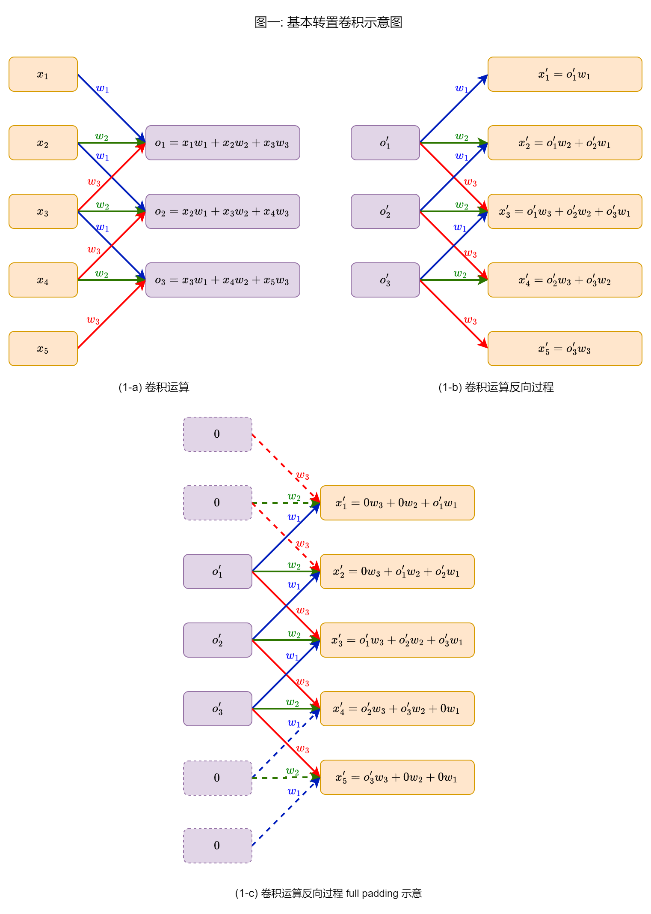
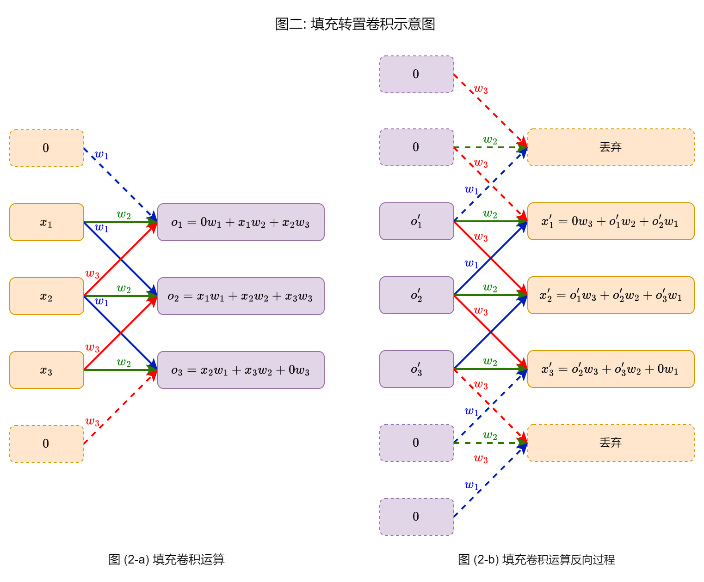
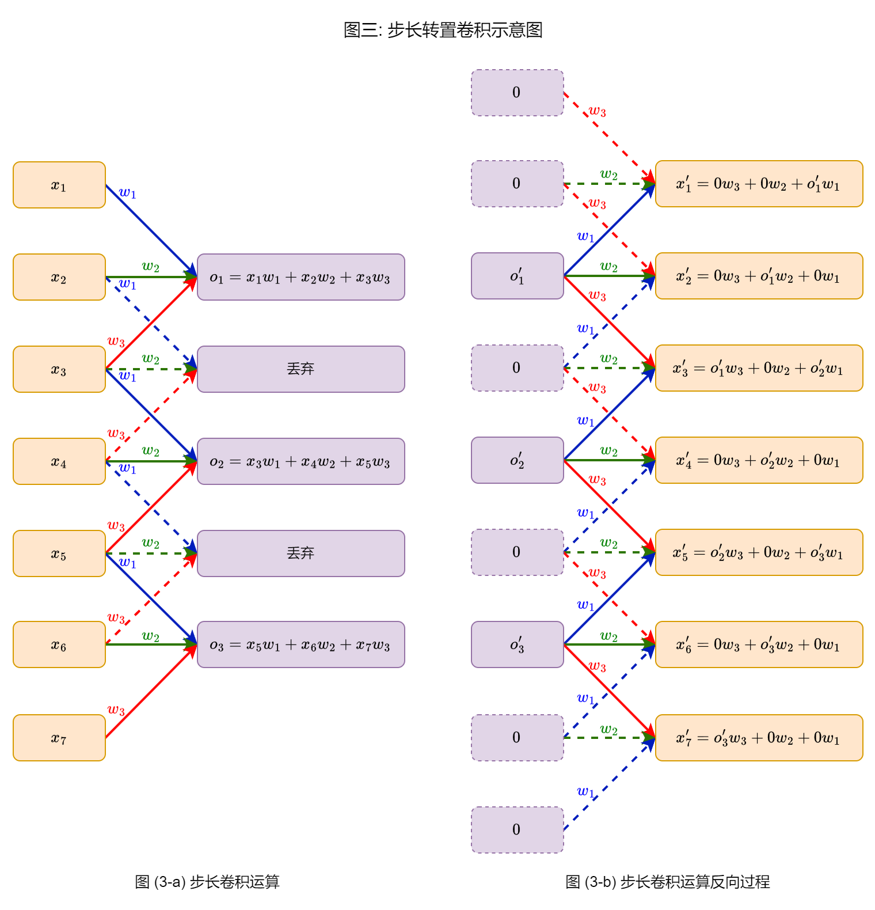
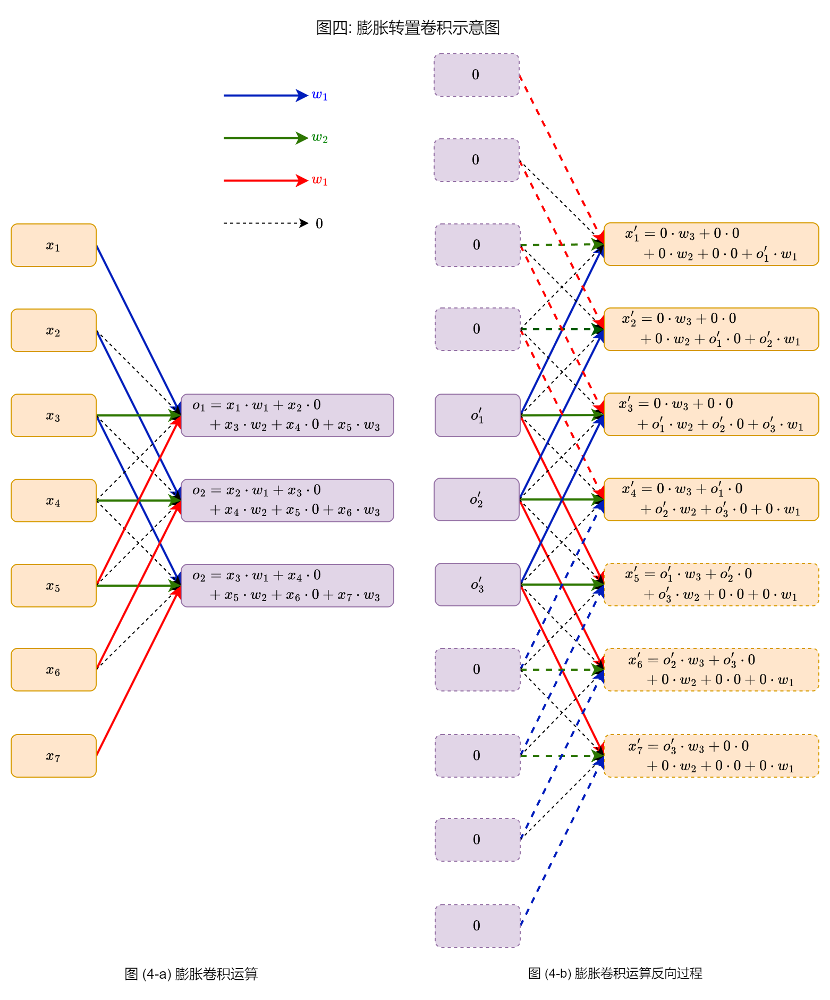
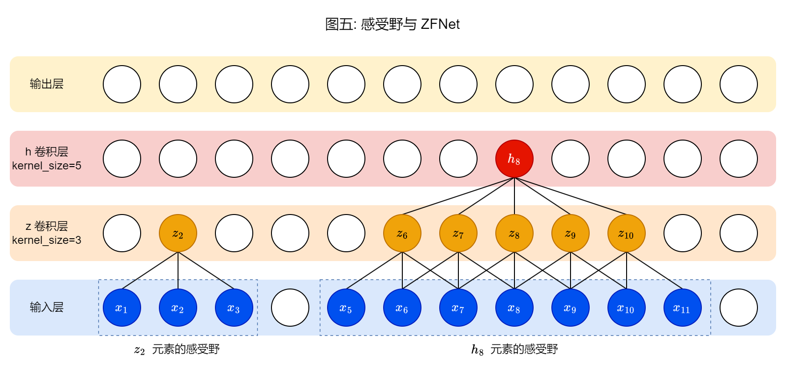

# 转置卷积 (反卷积) 与 CNN 可视化

[TOC]

## 一、简介

本文承接 [详解卷积层和池化层](https://zhuanlan.zhihu.com/p/672187467) 博客, 来介绍一下 转置卷积 (反卷积) 相关的操作, 以及 CNN 可视化的一些内容。

### 1.1 引言

在深度学习中, **卷积层** (Convolutional Layer) 的本质就是以 **窗口区域** (Receptive Field) 为单位的 **全连接层** (Fully Connected Layer)。在不考虑 bias 参数的情况下, 其等价于 **信号处理领域** 中多个 **互相关运算** ([cross-correlation](https://en.wikipedia.org/wiki/Cross-correlation)) 的融合。互相关运算 有一个非常通俗, 易于理解的名称: **滑窗点乘** (sliding dot product)。

在信号处理领域中, 有专门的 **卷积运算** ([convolution](https://en.wikipedia.org/wiki/Convolution)), 和 互相关运算 相似但不相同。并且, 其是有 **逆运算** (inverse operator) 的, 我们称为 **反卷积运算** ([deconvolution](https://en.wikipedia.org/wiki/Deconvolution))。其作用是, 根据卷积后的信号, 以及 卷积核 (filter), 求卷积前原始的信号。如果想了解相关内容, 可以参考 [scipy.signal.deconvolve](https://docs.scipy.org/doc/scipy/reference/generated/scipy.signal.deconvolve.html) 相关资料。

本文要介绍的运算等价于: 卷积层反向过程的计算方式; 或者说, 反向传播过程中, 卷积层输入梯度的计算方式。在不同的论文中, 它的叫法都不相同, 包括但不限于: 转置卷积 (transposed convolution), 反卷积 (deconvolution), 上采样卷积 (up-convolution), 小数步长卷积 (fractional-strided convolutions)。其中, 比较出名的是前两种叫法, 本文后续统一使用 **转置卷积** 这个称呼。

需要注意的是, 转置卷积 虽然也被称为 反卷积, 但是和 信号处理领域 的 反卷积运算 毫无关系! 我们不是在尝试恢复 输入信号, 而是在求 卷积层输入特征图 的梯度。

### 1.2 应用领域

在 PyTorch 中, 关于转置卷积的 [文档](https://pytorch.org/docs/stable/generated/torch.nn.ConvTranspose1d.html) 都引用了 [Deconvolutional Networks](https://www.matthewzeiler.com/mattzeiler/deconvolutionalnetworks.pdf) 这篇论文。其和之后的 [Adaptive Deconvolutional Networks for Mid and High Level Feature Learning](https://www.matthewzeiler.com/mattzeiler/adaptivedeconvolutional.pdf) 论文属于同一系列的工作。它们是早期的 图像无监督表征学习, 采用 sparse coding 相关技术。我对 sparse coding 技术几乎不了解, 如果你对此感兴趣, 可以参考这个 [回答](https://www.zhihu.com/question/43609045/answer/132235276) 去理解这两篇论文。

目前, 转置卷积 主要用于 图像分割 (semantic / instance segmentation) 和 图片生成 (image generation) 等领域, 这些领域的特点是需要进行图片尺寸大小的预测。转置卷积层 在其中充当 上采样 ([upsampling](https://en.wikipedia.org/wiki/Upsampling)) 的角色, 和 卷积层 构成 "对称" 的结构。

在图片生成领域, [GAN](https://arxiv.org/abs/1406.2661) 可以说是非常经典的工作, 原始论文 Figure 2 的 `d)` 图就是采用 卷积判别器 + 转置卷积生成器 的网络架构, 但是效果和 全连接网络架构 (旁边的 `c)` 图) 差不多。之后的 [DCGAN](https://arxiv.org/abs/1511.06434) 沿着这一思路, 对网络架构进行了大量的调整, 取得了非常好的效果。在 图像分割 领域, [FCN](https://arxiv.org/abs/1411.4038) 和 [U-Net](https://arxiv.org/abs/1505.04597) 都是非常经典的工作, 它们也使用了 转置卷积层。目前, 扩散模型 + U-Net 是 图片生成领域 的主流方案。由此可以看出, 转置卷积层 的重要性。

除此之外, 转置卷积也常用于 CNN 可视化的工作, 最经典的论文就是 [Visualizing and Understanding Convolutional Networks](https://arxiv.org/abs/1311.2901), 我们称其为 **ZFNet**。本文最后会介绍如何用 转置卷积 进行 CNN 可视化。

### 1.3 "转置" 的含义

在 [重构全连接神经网络知识体系](https://zhuanlan.zhihu.com/p/676212963) 这篇博客中, 我们详细分析了线性层反向传播的过程。这里, 我们用公式来描述一下:

设输入向量为 $\bold{x}$, 输出向量为 $\bold{o}$, loss 关于输出向量的梯度是 $\bold{o}^{\prime}$, loss 关于输入向量的梯度是 $\bold{x}^{\prime}$, 它们都是列向量。线性层权重为 $W$, 每一个 行向量 表示一个线性函数。那么, 在不考虑 bias 参数的情况下, 我们可以得到:

$$ \bold{o} = W \cdot \bold{x} \tag{1.1} $$

$$ \bold{x}^{\prime} = W^{\mathsf{T}} \cdot \bold{o}^{\prime} \tag{1.2} $$

其中, 公式 $(1.1)$ 是线性层的前向过程, 公式 $(1.2)$ 是线性层的反向过程。不理解的参考 [博客](https://zhuanlan.zhihu.com/p/676212963) 中 图九 部分的相关内容。

观察公式 $(1.1)$ 和 $(1.2)$, 可以发现, 我们对 参数矩阵 进行了 "转置" 操作。而 卷积层 就是以 窗口区域 为单位的 全连接层, 其反向过程也会有一样的特点。

本博客介绍的运算和公式 $(1.2)$ 是一样的, 只是从 线性层 变成了 卷积层。这也是为什么我们将其称作 "转置卷积"。

如果从这一角度继续介绍下去, 就变成了介绍 卷积层 常规的实现方式: im2col + gemm。网上有很多相关的教程, 这里就不从这个角度来介绍了。

本文延续 [详解卷积层和池化层](https://zhuanlan.zhihu.com/p/672187467) 这篇博客中的内容, 以 向量 为单位, 用图示的方式, 介绍 转置卷积层 的计算方式, 以及和 卷积层 之间的联系, 方便大家理解。

在本文后续内容中, 单输入和输出通道的 一维卷积 ([Conv1d](https://pytorch.org/docs/stable/generated/torch.nn.Conv1d.html)) 统称为 **向量卷积**, 与之相对应的是 **向量转置卷积**。单输入和输出通道的 二维卷积 ([Conv2d](https://pytorch.org/docs/stable/generated/torch.nn.Conv2d.html)) 统称为 **矩阵卷积**, 与之相对应的是 **矩阵转置卷积**。

下面, 让我们先看看 向量转置卷积 的运算过程。

## 二、向量转置卷积

### 2.1 基本转置卷积

早期的神经网络喜欢用 Graph 数据结构来介绍 全连接层 的计算方式, 并推导 互相关运算 的计算方式。本文也采用这种方式, 参考 [博客](https://zhuanlan.zhihu.com/p/676212963) 中的 **图九**, 来介绍 转置卷积。

我们知道, 反向传播算法是用来求解 loss 关于模型参数的梯度。但是 "反向传播" 这个名字实际上表述的是求解 loss 关于每一层输入的梯度。而 转置卷积 的运算方式 和 反向传播时 卷积层输入梯度 的求解方式是一样的。因此, 我们可以这么说, 转置卷积运算 就是 卷积运算 的反向过程。

卷积运算的反向过程和线性层是相似的, 我们可以用 下图 中的 图 (1-a) 和 (1-b) 来表示:



在图一中, 我们设 向量 $\bold{x}$ 是输入向量, 向量 $\bold{w}$ 是卷积核向量, 向量 $\bold{o}$ 是输出向量, 向量 $\bold{o}^{\prime}$ 是输出的梯度向量, 向量 $\bold{x}^{\prime}$ 是输入的梯度向量。

图 (1-a) 就是 向量卷积运算 的示意图, 相同颜色的 **边** (edge) 权重是一样的, 这很好理解。相对应的, 图 (1-b) 就是 向量卷积运算 的反向过程, 也就是 转置卷积运算 的方式。对于线性运算而言, 反向过程 和 前向过程 **边** (edge) 的权重是不变的。

我们用 $n_x$, $n_w$ 和 $n_o$ 分别表示向量 $\bold{x}$, $\bold{w}$ 和 $\bold{o}$ 的元素个数, 那么:

$$ n_o = n_x - n_w + 1 \tag{2.1} $$

$$ n_x = n_o + n_w - 1 \tag{2.2} $$

公式 $(2.1)$ 是针对前向过程的, 公式 $(2.2)$ 是针对反向过程的。观察图 (1-b), 我们可以发现, 输出向量两端参与运算的元素个数是不相同的, 这样很难进行 向量化编程。怎么办呢? 答案是使用 padding, 如图 (1-c) 所示。

在图 (1-c) 中, 我们在输入向量 $\bold{x}$ 的两端各补充了两个 0, 虚线相当于 "辅助线", 起到 "辅助" 向量化编程的作用。观察图 (1-c), 我们不难发现:

**基本转置卷积运算** 等价于 kernel "翻转" (filp) 的 **full padding 卷积运算**。

上面的结论非常重要, 一定要理解! 由此, 我们可以得到结论: 转置卷积运算 是特殊的 卷积运算。或者说, 我们可以用 卷积运算 实现 转置卷积运算。

需要注意的是, 当我们用 卷积运算 实现 转置卷积运算 时, 始终对 kernel 进行 "翻转" 操作, 而不是 "转置" 操作。"转置卷积" 中的 "转置" 不是体现在这里, 而是体现在 im2col + gemm 运算过程中 (也就是公式 $(1.2)$), 本文对此暂不进行讨论。如果对 "翻转" 操作不了解, 可以参考 [torch.flip](https://pytorch.org/docs/stable/generated/torch.flip.html) 函数。

### 2.2 填充转置卷积

填充 是 卷积运算 中非常重要的一个概念, 有三种经典的 填充 方式: valid padding, same padding 和 full padding。忘记的可以参考 [博客](https://zhuanlan.zhihu.com/p/672187467) 中 2.2 节的内容。



图 (2-a) 就是有填充的 卷积运算 示意图。需要注意的是, 虽然我们一般认为 padding 处是参与运算的, 但是从本质上来说, 其并没有参与运算, 仅仅起到 "辅助" 运算的作用, 因此我们用 "虚线" 来表示, 而非 "实线"。整个过程可以描述为: (1) 在输入向量的左右 "添加" 填充值; (2) 进行 基本卷积运算。

那么, 其反向过程是什么样子的呢? 我们可以描述成: (1) 进行 基本转置卷积运算, (2) 在输出向量的左右 "删除" 填充值的部分。整个过程如图 (2-b) 所示, 也就是说:

**基本转置卷积运算** 等价于 kernel "翻转" 的 **full padding 卷积运算**, 而 **带 padding 的转置卷积运算** 就是在 **基本转置卷积运算** 的输出向量两端 **删除** 元素。

如果我们用 $p$ 表示填充数, 那么填充卷积输出维度的计算公式是:

$$ n_o = (n_x + 2 p) - n_w + 1 \tag{2.3} $$

填充转置卷积输出维度的计算公式是:

$$ n_x = (n_o + n_w - 1) - 2 p \tag{2.4} $$

在图 (2-b) 中, 向量 $o^{\prime}$ 最上面和最下面的填充值是不需要的, 可以忽略。同时, full padding 卷积运算 其实就是 $n_w - 1$ 填充卷积运算。因此, 我们还可以这样描述:

$n_p$ 填充的转置卷积运算 等价于 kernel "翻转" 的 $n_w - 1 - n_p$ 填充的卷积运算。

我们知道, 基本的卷积运算 就是 valid padding 卷积运算。更进一步, 我们可以得到以下结论:

+ **valid padding 卷积运算** 的反向过程等价于 kernel "翻转" 的 **full padding 卷积运算**
+ **same padding 卷积运算** 的反向过程等价于 kernel "翻转" 的 **same padding 卷积运算**
+ **full padding 卷积运算** 的反向过程等价于 kernel "翻转" 的 **valid padding 卷积运算**

至此, 你应该对 卷积层求导 有一个大致的概念了。

### 2.3 步长转置卷积

在 2.1 和 2.2 节中, 对于 转置卷积运算, 我们可以找到一个等价的 卷积运算, 没有 "新的操作"。但是, 从 2.3 节开始, 原始的卷积运算没有办法满足我们的需求, 需要 "新的操作"。

对于 基本的卷积运算 而言, 虽然输出向量的元素个数小于输入向量的元素个数, 但是不会相差特别大。我们可以通过 padding 操作来增加输出向量元素个数, 因此算不上真正意义的 "下采样"。

如果我们希望用 卷积运算 实现 "下采样", 一般使用的是 步长卷积运算。如果卷积运算的步长是 $s$, 我们可以粗略的认为: 将向量的维度缩小 $s$ 倍。

原始 步长卷积计算方式 很难解释其反向过程, 我们可以用下图 (3-a) 的形式来描述:



步长卷积原本的意思是 "跳过" 一些窗口, 我们可以认为是将这些运算结果 "丢弃" 掉了。那么, 在反向过程中, 我们将所有 "丢弃" 掉的部分用 $0$ 进行 "占位", 如图 (3-b) 所示。这样, 我们就可以用 基本卷积运算 来实现 步长转置卷积 了。这个想法和 2.2 节的 padding 是相似的。由此, 我们可以得到结论:

$s$ 步长转置卷积运算过程: 首先, 在输入向量的每两个元素之间插入 $s - 1$ 个零元素, 然后进行 基础转置卷积运算。

我们知道, 步长卷积输出维度的计算公式是:

$$
n_o = \left \lfloor \frac{n_x - n_w}{s} \right \rfloor + 1 \tag{2.5}
$$

步长转置卷积的输出维度计算公式如下:

$$
n_x = (n_o - 1) \cdot s + n_w \tag{2.6}
$$

配合图 (3-b) 和上面的说明, 公式 $(2.6)$ 非常容易理解。

公式 $(2.6)$ 是建立在 $(n_x - n_w)$ 除以 $s$ 是整数的情况, 我们在设计神经网络时, 一般都要遵循这样的原则。但是如果真除不尽怎么办呢? PyTorch 在 [ConvTranspose1d](https://pytorch.org/docs/stable/generated/torch.nn.ConvTranspose1d.html) 中给出的方案是 output_padding 参数, 我们用 $op$ 表示。

观察图 (3-b), 我们在 $o^{\prime}_1$ 和 $o^{\prime}_2$ 后面添加了 $s - 1$ 个 $0$, 在 $o^{\prime}_3$ 后面没有添加任何 $0$。图示中 $o^{\prime}_3$ 最后的两个 $0$ 是用于 full padding 的, 具体见图 (1-c)。而 output padding 的含义就是在 $o^{\prime}_3$ 后面添加 $op$ 个 $0$。如果算上 full padding 添加的 $0$, $o^{\prime}_3$ 后面应该有 $op + n_w - 1$ 个 $0$。

$op$ 的含义就是 步长卷积 因为除不尽丢弃的 窗口 个数, 其值一定小于 $s$。在反向过程中计算公式也非常简单:

$$
op = s \cdot \left ( \frac{n_x - n_k}{s} - \left \lfloor \frac{n_x - n_k}{s} \right \rfloor \right ) \tag{2.7}
$$

如果考虑 $op$, 那么公式 $(2.6)$ 变成:

$$
n_x = (n_o - 1) \cdot s + op + n_k \tag{2.8}
$$

观察公式 $(2.6)$, 我们可以发现, 在转置卷积中, 相较于输入向量的维度, 输出向量的维度扩大了约 $s$ 倍。换一种说法, 输出向量的维度缩小了约 $1 / s$ 倍。本节最开始说过, 步长卷积运算会成倍的缩小输入尺寸。而步长转置卷积会成倍的放大输入尺寸。因此, [DCGAN](https://arxiv.org/abs/1511.06434) 将 转置卷积 称为 小数步长卷积 (fractional-strided convolutions)。

### 2.4 膨胀转置卷积

最后, 我们来说一说 空洞 / 膨胀 (dilation) 转置卷积。步长卷积 的含义是 "跳着" 选取窗口, 膨胀卷积 的含义是在一个窗口内 "跳着" 选取元素。我们可以将 "跳着" 这一操作理解成带 step 的 for 循环。因此 **"跳着" 选取** 这一操作会产生 **成倍增加** 或者 **成倍减小** 的效果。

对于膨胀卷积来说, 我们可以认为是成倍增加 卷积核向量 的大小。如果用 $d$ 表示膨胀率, 那么 卷积核 的大小就是 $d \cdot (n_k - 1) + 1$。我们可以将所有 "跳过" 的元素值和输出值相连, 连线的权重值为 $0$, 如下图 (4-a) 所示:



图 (4-b) 表示的就是 膨胀转置卷积的运算过程。由于 kernel 的大小从 $3$ 变成了 $5$, 因此我们需要在两端补充 $4$ 个零, 导致图片有点大, 不过还是很容易理解的。

那么, 我们怎么用 基本卷积 实现 膨胀转置卷积 呢? 答案依旧是 补零! 我们在 卷积核向量 每两个元素之间添加 $d - 1$ 个零就可以了。

此时, 膨胀卷积 输出维度 的计算公式如下:

$$
\begin{align*}
    n_o &= n_x - [d \cdot (n_w - 1) + 1] + 1 \\
    &= n_x - d \cdot (n_w - 1)
\tag{2.9}
\end{align*}
$$

膨胀转置卷积 输出维度 的计算公式如下:

$$
\begin{align*}
    n_x &= n_o + [d \cdot (n_w - 1) + 1] - 1 \\
        &= n_o + d \cdot (n_w - 1)
\tag{2.10}
\end{align*}
$$

### 2.5 代码实现

我们将公式 $(2.4)$, $(2.8)$ 和 $(2.10)$ 合并在一起, 就可以得到完成的 转置卷积 输出维度的计算公式:

$$
n_x = (n_o - 1) \cdot s + op + [d \cdot (n_w - 1) + 1] - 2p \tag{2.11}
$$

本来想用 NumPy / PyTorch 向量化编程范式实现的。但是, 在 NumPy / PyTorch 的向量中添加元素太麻烦了, 导致代码的可读性非常差, 出现了很多意义不明的内容。最后, 就直接用 list 实现了, 简洁明了, 代码如下:

```python
def vector_tconv(
        vector: list, kernel: list, padding: int = 0,
        stride: int = 1, dilation: int = 1, output_padding: int = 0, 
    ) -> list:

    assert len(vector) >= len(kernel)
    assert output_padding < stride or output_padding < dilation

    # step1: 在 vector 每两个元素之间添加 stride - 1 个零
    new_vector = []
    for idx, element in enumerate(vector):
        new_vector.append(element)
        if idx != len(vector) - 1:
            new_vector.extend([0 for _ in range(stride - 1)])
        else:
            new_vector.extend([0 for _ in range(output_padding)])

    # step2: 在 kernel 每两个元素之间添加 dilation - 1 个零
    new_kernel = []
    for idx, element in enumerate(kernel):
        new_kernel.append(element)
        if idx != len(kernel) - 1:
            new_kernel.extend([0 for _ in range(dilation - 1)])

    # step3: 对 vector 进行 full padding 操作
    fp_part = [0 for _ in range(len(new_kernel) - 1)]
    new_vector = fp_part + new_vector + fp_part

    # step4: 对 kernel 进行 "翻转" 操作
    new_kernel = list(reversed(new_kernel))

    # step5: 进行基本卷积运算
    result = []
    for start_idx in range(len(new_vector) - len(new_kernel) + 1):
        end_idx = start_idx + len(new_kernel)
        sub_vector = new_vector[start_idx:end_idx]
        result.append(sum(
            [ele1 * ele2 for ele1, ele2 in zip(sub_vector, new_kernel)]
        ))

    # step6: 删除两端多余的元素
    if padding != 0:
        result = result[padding:-padding]

    return result 
```

本章节都是以 向量转置卷积 为视角进行介绍的, 如果你想感性的了解 矩阵转置卷积, 可以参考: [conv_arithmetic](https://github.com/vdumoulin/conv_arithmetic) 项目中的 "Transposed convolution animations" 部分, 或者 [A guide to convolution arithmetic for deep learning](https://arxiv.org/abs/1603.07285) 这篇综述。

在本章节的所有示意图中, 转置卷积运算 的输入向量都是 卷积运算输出的梯度向量。当其作为 转置卷积层 时, 输入就是图片的特征图, 并且还有 bias 参数, 其广泛应用于 图片生成 和 图像分割 任务的网络架构中。至此, 你应该对 转置卷积运算 有一个大致的印象了。

## 三、ZFNet 与 CNN 可视化

### 3.1 ZFNet 简介

本章节介绍的 CNN 可视化方式出自 [Matthew Zeiler](https://www.matthewzeiler.com/) 于 2014 年在 ECCV 会议上发表的论文: [Visualizing and Understanding Convolutional Networks](https://arxiv.org/abs/1311.2901)。这篇论文非常经典, 是 2013 年 ImageNet 图像分类比赛的冠军, 目前 [Google Scholar](https://scholar.google.com/citations?user=a2KklUoAAAAJ) 上的引用量超过两万, 可以说非常夸张。由于作者没有给自己的工作起名字, 其它学者就帮他取了一个名字: **ZFNet** (两位作者姓氏的首字母)。Matthew 在发表完成这篇论文后, 就去创业了, 目前是 [Clarifai](https://www.clarifai.com/) 公司的创始人兼 CEO, 貌似没有再发表论文了。

[ZFNet](https://arxiv.org/abs/1311.2901) 的工作可以看作是 2012 年 ImageNet 图像分类比赛冠军 [AlexNet](https://proceedings.neurips.cc/paper_files/paper/2012/file/c399862d3b9d6b76c8436e924a68c45b-Paper.pdf) 的延续, 和其一脉相承的是 2014 年 ImageNet 图片分类比赛的亚军: [VGG](https://arxiv.org/abs/1409.1556)。由于 ZFNet 对网络架构没有过多的调整, 因此不如这两篇文章出名。

因此, 本文介绍的 CNN 可视化方法仅限于早期的 CNN 神经网络, 主要就是上面提及的 AlexNet 和 VGG 网络。在这之后, CNN 网络发生了很大的变化: GoogLeNet 用 Inception 结构 (多个不同尺度的卷积运算) 增加 CNN 网络的 "宽度", 而 ResNet 用 残差结构 增加 CNN 网络的 "深度"。它们两分别是 2014 年和 2015 年 ImageNet 图像分类比赛的冠军! ZFNet 可视化工作没有办法适应这些网络架构的变化。

更进一步说明, ZFNet 可视化工作主要是针对 "卷积层 + ReLU 激活层 + 最大池化层" 这种形式的网络, 如果涉及到 Inception 结构, 残差结构, [Batch Normalization](https://arxiv.org/abs/1502.03167) 等其它内容, 就没有办法处理了。

### 3.2 CNN 可视化工作简介

本章所说的 CNN 可视化主要使用的是 [plt.imshow](https://matplotlib.org/stable/api/_as_gen/matplotlib.pyplot.imshow.html) 函数, 其能够可视化的图片有两种:

(1) 一种是 热力图 ([heatmap](https://en.wikipedia.org/wiki/Heat_map)), 其输入是一个矩阵 (二维数组), 我们将矩阵中的 **数值** 对应到颜色的 **强弱** 上。一般情况下, 在处理过程中, 我们会将矩阵中的最大值对应到最亮的颜色, 矩阵的最小值对应到最暗的颜色, 其它的颜色采用 渐变 的方式。因此, 数值越大的位置颜色越亮。使用 `plt.colorbar()` 可以查看 **数值大小** 和 **颜色强弱** 的对应关系表。可以用下面的代码来验证效果:

```python
plt.imshow(np.random.randn(50, 50))  # randn: 均值为 0, 方差为 1 的正态分布
plt.colorbar()
```

一般情况下, 我们所说的 特征图 (feature map) 可视化, 就是采用了这种方式。对于一个 [Conv2d](https://pytorch.org/docs/stable/generated/torch.nn.Conv2d.html) 来说, 其有 out_channels 个特征图, 每一个特征图都是一个矩阵, 我们可以用热力图的方式可视化出来, 看看特征图中的数值构成了什么样的纹理信息。那么, 一共可以画出 out_channels 个图片出来, 我们可以借助此来分析每一个 kernel 都学习到了什么样的信息。实现代码如下:

```python
def visualize_feature_maps(feature_maps: Tensor):
    from torchvision.utils import make_grid
    assert feature_maps.ndim == 3  # [num_fm, h_fm, w_fm]

    with torch.no_grad():
        pics = make_grid(
            feature_maps.unsqueeze(1), 
            nrow=int(np.sqrt(feature_maps.size(0))), 
            normalize=True, scale_each=True,
            padding=1,
        )

    # 对于单通道的图片, make_grid 函数会转成三通道的图片, 并且三个通道数值是一样的
    # print(pics.shape, torch.all(pics[0] == pics[1]), torch.all(pics[0] == pics[2]))
    plt.imshow(pics[0].detach().numpy())
    plt.axis("off")
```

但是, 这种方式存在一个很大的问题: 一般情况下, 低层 (靠近输入层) 的特征图尺寸大, 展示效果好; 而高层 (靠近输出层) 的特征图尺寸小, 展示效果不好。因此, 这种方式很难分析高层的 kernel 学习到了什么信息。

我们知道, 除了 热力图 是矩阵外, 灰度图 也是矩阵。那么, 怎么用 `plt.imshow` 展示 灰度图 呢? 答案是将 `cmap` 参数设置成 `"gray"`。可以用下面的代码来验证效果:

```python
plt.imshow(np.random.rand(500, 500), cmap="gray")  # rand: 0-1 之间均匀分布
```

(2) 另一种是 RGB 图, 此时输入的是 `[h_img, w_img, 3]` 大小的三维数组。可以用下面的代码来验证效果:

```python
plt.imshow(np.ramdom.rand(100, 100, 3))  # rand: 0-1 之间均匀分布
```

此时, 对三维数组中的元素取值范围是有要求: 如果是整形 (int) 的, 取值范围是 [0, 255]; 如果是 浮点 (float), 取值范围在 [0, 1]。和上面不同的是, 如果有数值在取值范围外, 会进行 [clip](https://numpy.org/doc/stable/reference/generated/numpy.clip.html) 操作。可以用下面的代码来验证效果, 最终看到的应该是全黑的图片:

```python
plt.imshow(-np.random.rand(100, 100, 3))  # rand: 0-1 之间均匀分布
```

对于 CNN 网络来说, 其输入一般是 RGB 图像, 因此第一个 [Conv2d](https://pytorch.org/docs/stable/generated/torch.nn.Conv2d.html) 的 in_channels 一定是 3, 也就是说其 kernel 的大小一定是 `[h_kernel, w_kernel, 3]`。那么, 我们可以将其当作 RGB 图像, 用 `plt.imshow` 展示出来。一共可以画出 out_channels 个图片。[AlexNet](https://proceedings.neurips.cc/paper_files/paper/2012/file/c399862d3b9d6b76c8436e924a68c45b-Paper.pdf) 中的 Figure 3 就是这么画出来的。需要注意的是, 此时需要对每一个 kernel 进行 [min-max 标准化](https://en.wikipedia.org/wiki/Feature_scaling), 将所有的元素映射到 [0, 1] 范围内, 不然会触发 [clip](https://numpy.org/doc/stable/reference/generated/numpy.clip.html) 操作。实现代码如下:

```python
def visualize_kernels(conv_layer: nn.Conv2d):
    from torchvision.utils import make_grid
    assert conv_layer.in_channels == 3

    with torch.no_grad():
        pics = make_grid(
            conv_layer.weight, 
            nrow=int(np.sqrt(conv_layer.out_channels)), 
            normalize=True, scale_each=True, padding=1
        )

    plt.imshow(pics.permute(1, 2, 0).detach().numpy())
    plt.axis("off")
```

这种方式的问题很明显, 除了第一个卷积层, 其它卷积层的 out_channels 都大于 3, 没有办法进行可视化操作。

### 3.3 ZFNet 中的 CNN 可视化

在 3.2 节中, 我们介绍了两种可视化的方式: 特征图可视化 和 kernel 可视化。前者只对靠近输入层的卷积层可视化效果好, 后者只能可视化第一个卷积层。那么, 我们怎么可视化靠后的卷积层呢? ZFNet 提出了一种较好的可视化方式。

我们可以借助 **感受野** (Receptive Field) 的概念来理解 ZFNet 可视化的方式。在之前 [详解卷积层和池化层](https://zhuanlan.zhihu.com/p/672187467) 的博客中, 我对于 感受野 的描述是有偏差的。感受野 的含义是: 在 CNN 网络中, 特征图 (feature map) 上的一个元素值 对应到 输入层 (图片) 上的区域。我们可以用下图 (图五) 来理解。



图五展示的是一个三层的卷积神经网络, 一共有两个 same padding 卷积层, kernel 大小分别是 3 和 5。

在 z 卷积层中, kernel_size 为 3, 一个元素由 3 个输入层的元素参与计算得到, 因此 z 卷积层的 感受野 大小是 3。举例来说, $z_2$ 元素是 $x_1$, $x_2$ 和 $x_3$ 由三个元素计算得到的, 因此, $z_2$ 的感受野就是从 $x_1$ 到 $x_3$ 这个区域。

在 h 卷积层中, kernel_size 为 5, 一个元素由 5 个 z 卷积层的元素参与计算得到, 而这 5 个元素仅需要 7 个输入层元素就可以得到, 因此 h 卷积层的 感受野 大小是 7。举例来说, $h_8$ 元素的 感受野 就是 $x_5$ 到 $x_{11}$ 这一区域。

ZFNet 的思想就是, 利用转置卷积, 将特征图中的某一个元素值映射回 输入层 (图像) 的像素空间中。以图五为例, 假如我们想知道 $h_8$ 这个元素值的含义, 那么我们可以将其 映射 (投影) 回 输入层 的像素空间中, 可视化出来, 看一看其数值能展现出什么样的图案, 和感受野有什么样的对应关系。

卷积运算 可以理解为 滑窗点乘, 特征值越大, 表示 窗口区域 和 kernel 的相关性越高。因此, 我们一般选取特征图中最大的元素值, 将其映射回 输入层 的像素空间中。

那么应该如何 "映射" 呢? 具体的过程如下:

1. 准备一张图片, 论文中是从 ImageNet 验证集中选取的图片
2. 从 AlexNet / VGG 网络中选取需要可视化的 **卷积层** 以及 **特征图**
3. 前向计算 **卷积层** 的特征图, 并记录 [MaxPool2d](https://pytorch.org/docs/stable/generated/torch.nn.MaxPool2d.html) 的 indices (论文中称为 "switch" 变量)
4. 计算特征图的最大值, 并构建 "映射" 计算的输入张量: 最大值的位置为 1, 其余部分全为 0
5. 开始 "映射" 计算, 从 **卷积层** 开始反向遍历每一个网络层:
    + 如果是 [Conv2d](https://pytorch.org/docs/stable/generated/torch.nn.Conv2d.html), 转换成对应的 [ConvTranspose2d](https://pytorch.org/docs/stable/generated/torch.nn.ConvTranspose2d.html), 进行计算
    + 如果是 [MaxPool2d](https://pytorch.org/docs/stable/generated/torch.nn.MaxPool2d.html), 转换成对应的 [MaxUnpool2d](https://pytorch.org/docs/stable/generated/torch.nn.MaxUnpool2d.html), 进行计算
    + 如果是 [ReLU](https://pytorch.org/docs/stable/generated/torch.nn.ReLU.html), 依旧使用 [ReLU](https://pytorch.org/docs/stable/generated/torch.nn.ReLU.html), 进行计算
6. 将 "映射" 计算得到的结果进行 min-max 标准化, 然后用 [plt.imshow](https://matplotlib.org/stable/api/_as_gen/matplotlib.pyplot.imshow.html) 函数进行可视化

核心代码如下:

```python
@torch.no_grad()
def cal_vis_data(img: Tensor, submodel: nn.Sequential, fm_index: int = None) -> tuple[Tensor, int]:

    # ## step1: 前向计算
    assert img.ndim == 3 and img.size(0) == 3  # [3, h_img, w_img]
    indices_stack = []  # append 和 pop() 的组合就是 stack (FILO); append 和 pop(0) 的组合就是 queue (FIFO)
    output = img 

    for layer in submodel:
        if isinstance(layer, nn.Conv2d):
            assert layer.dilation == (1, 1)
            output = layer.forward(output)
        elif isinstance(layer, nn.ReLU):
            output = layer.forward(output)
        elif isinstance(layer, nn.MaxPool2d):
            layer.return_indices = True
            output, indices = layer.forward(output)
            indices_stack.append(indices)
            layer.return_indices = False
        else:
            raise NotImplementedError
    
    # ## step2: 构建反向输入
    if fm_index is None:
        fm_index = torch.argmax(
            torch.max(output.flatten(-2, -1), axis=-1).values
        ).item()

    max_pos = np.unravel_index(  # torch 中居然没有 unravel_index 函数
        indices=torch.argmax(output[fm_index]).detach().numpy(),
        shape=output[fm_index].shape
    )
    r_output = torch.zeros_like(output)
    r_output[fm_index][max_pos] = 1.

    # ## step3: 反向计算
    for layer in reversed(submodel):
        if isinstance(layer, nn.Conv2d):
            r_layer = nn.ConvTranspose2d(
                in_channels=layer.out_channels, out_channels=layer.in_channels, 
                kernel_size=layer.kernel_size, stride=layer.stride,
                padding=layer.padding, bias=False
            )
            r_layer.weight.data.copy_(layer.weight.data)
            r_output = r_layer.forward(r_output)
        elif isinstance(layer, nn.ReLU):
            r_layer = nn.ReLU()
            r_output = r_layer.forward(r_output)
        elif isinstance(layer, nn.MaxPool2d):
            r_layer = nn.MaxUnpool2d(
                kernel_size=layer.kernel_size,
                stride=layer.stride, padding=layer.padding
            )
            r_output = r_layer.forward(r_output, indices=indices_stack.pop())

    return r_output, fm_index
```

作者将 "映射" 计算使用的网络称为 "反卷积网络"。如果你熟悉 反向过程 的话, 会发现除了 [ReLU](https://pytorch.org/docs/stable/generated/torch.nn.ReLU.html) 外, "映射" 计算 中其它的部分和 反向过程计算 是一致的, 我们甚至于可以将代码改成下面的样式:

```python
class RevisedReLU(torch.autograd.Function):
    @staticmethod
    def forward(ctx, input):
        return torch.relu(input)
    
    @staticmethod
    def backward(ctx, grad_output):
        return torch.relu(grad_output)


def cal_vis_data_grad_ver(img: Tensor, submodel: nn.Sequential, fm_index: int = None) -> tuple[Tensor, int]:
    for param in submodel.parameters():
        param.requires_grad = False

    assert img.ndim == 3 and img.size(0) == 3
    output = img = nn.Parameter(img)

    for layer in submodel:
        if isinstance(layer, nn.ReLU):
            output = RevisedReLU.apply(output)
        else:
            output = layer(output)

    if fm_index is None:
        fm_index = torch.argmax(
            torch.max(output.flatten(-2, -1), axis=-1).values
        ).item()

    output[fm_index].max().backward()
    return img.grad.detach(), fm_index
```

你或许会好奇, 为什么可以这样进行可视化, 然而作者在论文中并没有给出原因, 仅仅展示了其效果好, 因此此方法的局限性还是非常大的。

观察图五, 我们不难发现, 最终可视化的图片只有 特征图最大值处的感受野 有内容, 其它部分数值都是 0。因此, 我们可以将 可视化的图片 和 感受野 进行直接的对比, 看看卷积层究竟学习到了什么样子的信息。

[ZFNet](https://arxiv.org/abs/1311.2901) 论文的 Figure 2 是非常经典的图片。

对于 Layer 1, 作者一共可视化了 9 个 kernel, 每一个 kernel 用 3.2 节所说的方式可视化出来, 得到 Layer 1 的上图。对于每一个 kernel, 作者选取了 9 张图片, 前向计算得到特征图, 然后将 最大特征值 对应的 感受野 展示出来, 得到 Layer 1 的下图。Layer 1 下图是 九宫格 套 九宫格 的形式, 内层九宫格对应 9 张图片, 外层九宫格对应 9 个 kernel。

对于 Layer 2, 作者一共可视化了 16 个 kernel。对于每一个 kernel, 作者选取了 9 张图片, 前向计算得到特征图, 然后将 最大特征值 用上述方法 "映射" 回输入像素空间中, 得到 Layer 2 的左图, 并将 最大特征值 对应的 感受野 展示出来, 得到 Layer 2 的右图。两张图都是 网格 套 网格 的形式, 内层 网格 对应 9 张图片, 外层 网络 对应 16 个 kernel。

Layer 3-5 和 Layer 2 的方式是一样的, 只是可视化 kernel 的数量发生了变化。至此, ZFNet 可视化方式就介绍完成了。

## 四、总结与引用

### 4.1 总结

本文详细介绍了 转置卷积, 以及 ZFNet 中 CNN 可视化相关的工作。

ZFNet 可以说是我的一个心结, 这个心结总算是打开了。这篇论文方法写的并不是很清楚, 同时 Figure 1 的架构图画的具有一定的误导性, 理解起来还是有些难度的。

对于 转置卷积 来说, 我们从 "计算方式" 入手, 也就是 "卷积层的反向过程", 说明它是 特殊的卷积层, 可以和 卷积层 形成 "对称" 的网络结构, 主要用于 图像生成和分割 任务。但是, 它不像 卷积层 那样有非常明确的数学意义。

在本文中, 需要区分 "逆运算" 和 "反向运算" 的区别。"逆运算" 是根据 输出 推导 输入; "反向运算" 是将 计算方式 "反过来"。转置卷积 属于 后者。

个人认为, CNN 架构将 滑窗算法 玩到了极致。一开始, 从 padding, stride 再到 dilation。在本文中, 转置卷积 可以理解为 滑窗算法 的反向过程。而在 目标检测 中, 其有更加多样的玩法, enjoy yourself!

### 4.2 其它引用

+ GitHub: [VisualizingCNN](https://github.com/huybery/VisualizingCNN)
+ Blog: [Back Propagation in Dilated Convolution Layer](https://www.adityaagrawal.net/blog/deep_learning/bprop_dilated_conv)
