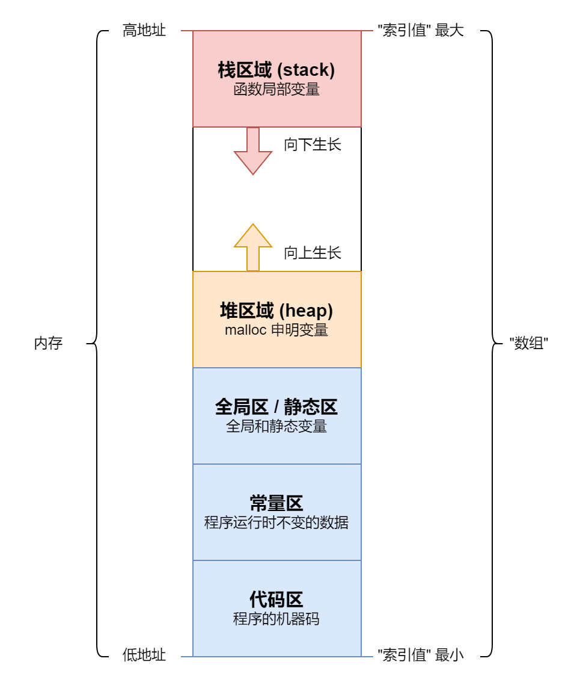
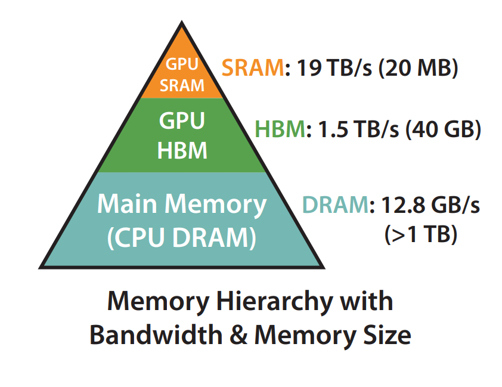
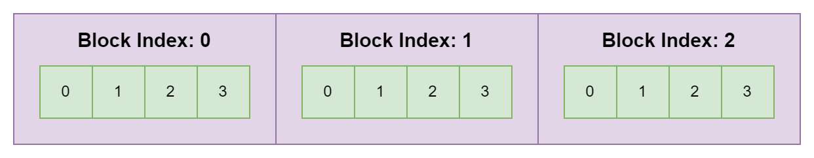
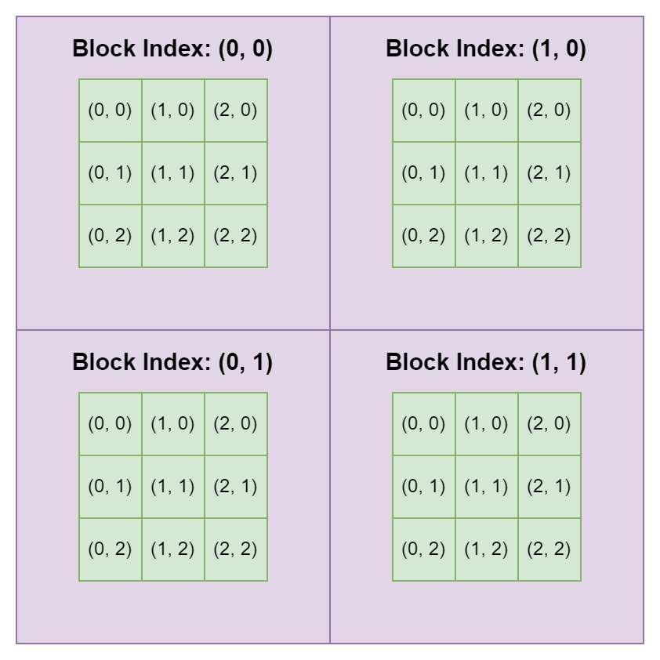
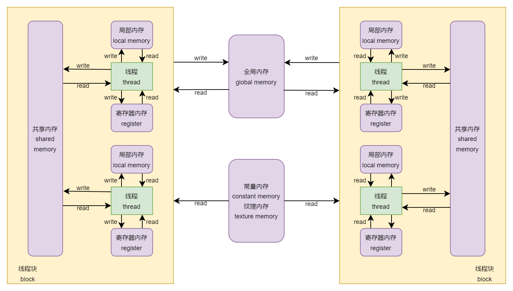

# GPU 与 CUDA 简介

[TOC]

&nbsp;

最近在看一些 LLM 推理优化的算法, 发现缺乏一些基础的 GPU 和 CUDA 知识。本文简单介绍一下相关知识, 并将一些计算机的基础知识串在一起, 构成相对完整的知识体系。

## 一、计算机基础知识

我们知道, 一台 电脑 主要由四部分组成: **CPU** ([Central Processing Unit](https://en.wikipedia.org/wiki/Central_processing_unit)), **内存** ([Main Memory](https://en.wikipedia.org/wiki/Computer_memory)), **硬盘** ([Data Storage](https://en.wikipedia.org/wiki/Computer_data_storage)) 和 **IO 设备** (Input / Output Device)。

### 1.1 硬盘 与 IO 设备

**IO 设备** 的种类是最多的, 包括 **键盘** ([keyboard](https://en.wikipedia.org/wiki/Computer_keyboard)), **鼠标** ([mouse](https://en.wikipedia.org/wiki/Computer_mouse)), **手柄** ([game controller](https://en.wikipedia.org/wiki/Game_controller)), **显示器** ([monitor](https://en.wikipedia.org/wiki/Computer_monitor)), **声卡** ([sound card](https://en.wikipedia.org/wiki/Sound_card)), **网卡** ([network inference controller](https://en.wikipedia.org/wiki/Network_interface_controller)) 等等。我们常说的 **驱动** ([device driver](https://en.wikipedia.org/wiki/Device_driver)) 就是使得这些 设备 可以在电脑上正常运行的 **程序**, 常见的有: 声卡驱动, 网卡驱动, 打印机驱动, 鼠标驱动 等等。

**硬盘** 就是我们存储数据的地方, 常见的类型有: **光盘** CD ([compact disc](https://en.wikipedia.org/wiki/Compact_disc)), **闪存** ([flash memory](https://en.wikipedia.org/wiki/Flash_memory)), **机械硬盘** HDD ([hard disk drive](https://en.wikipedia.org/wiki/Hard_disk_drive)), **固态硬盘** SSD ([solid-state drive](https://en.wikipedia.org/wiki/Solid-state_drive)) 等等。

**光盘** 一般是 只读 的, 即电脑只能读取光盘中的内容, 不能写入。如果要写入, 则需要其它设备辅助。我们将写入的过程称为 **刻录** ([authoring](https://en.wikipedia.org/wiki/Optical_disc_authoring))。因此, 光盘也被称为 ROM ([read-only memory](https://en.wikipedia.org/wiki/Read-only_memory))。

我们平常使用的 **U 盘** ([USB flash drive](https://en.wikipedia.org/wiki/USB_flash_drive)), 各种 **存储卡** ([memory card](https://en.wikipedia.org/wiki/Memory_card)), 以及 固态硬盘 SSD 都属于 **闪存**。相较于 固态硬盘 HDD, 其具有 读写速度快, 功耗低, 价格贵等特点。

### 1.2 CPU 与 内存

学过 计算机组成原理 的应该知道, **CPU** 主要由 **控制单元** CU ([Control Unit](https://en.wikipedia.org/wiki/Control_unit)) 和 **运算单元** ALU ([Arithmetic Logic Unit](https://en.wikipedia.org/wiki/Arithmetic_logic_unit)) 构成。

**控制单元** (CU) 的主要功能有:

+ 读取、分析 和 执行 机器码 (machine code) 形式的指令
+ 操控电脑的其它组件, 包括但不限于:
  + 输入和输出设备的控制
  + 内存和硬盘数据的读写
  + 调用 运算单元 (ALU) 进行计算
+ 处理异常情况和特殊请求

也就是说, 虽然 CU 和 ALU 都在 CPU 中, 但是真正起控制作用的是 CU。

在 CPU 中, 除了 CU 和 ALU 外, 还有 **存储单元**, 主要包括 **寄存器** ([register](https://en.wikipedia.org/wiki/Processor_register)) 和 **多级缓存** ([cache](https://en.wikipedia.org/wiki/CPU_cache))。只有当数据在特定的 寄存器 时, ALU 才能进行计算, 如果不在, 就需要从 内存 中拉取数据。然而, 拉取数据的速度是十分缓慢的, 因此, 我们需要 多级缓存, 将常用的数据放在缓存中, 可以减少访问 内存 的次数。

一般情况下, 电脑中的 多级缓存 是用 SRAM ([static random-access memory](https://en.wikipedia.org/wiki/Static_random-access_memory)) 构建的, 内存 是用 DRAM ([dynamic random-access memory](https://en.wikipedia.org/wiki/Dynamic_random-access_memory)) 构建的。因此, 很多时候, 我们会用 **SRAM** 代指 多级缓存, **DRAM** 代指 内存。

上面所说的 CPU 是 计算机组成原理 中所说的 CPU, 现在基本采用 前端解码 + 后端执行 的架构, 并不会有一个专门的模块叫 CU。同时, 我们可以将上述内容理解为一个 **CPU core**。现在的 CPU 一般都是 多核 的, 也就是说是由多个上述架构构成的, 我们称之为 **multicore CPU**。

在计算机中, 一般用 **时钟周期** (clock cycle) 作为计时单位, 一个 运算指令 一般在几个 时钟周期 内就可以完成, 而从内存中加载数据, 则需要几百个 时钟周期。在设计指令集时, 一条指令对应的 时钟周期 一般是确定下来的。

那么, 时钟周期 和 现实中的时分秒 怎么转换呢? 答案是看 CPU 的 **主频** (frequency)。它的单位是 Hz (赫兹), 表示 一秒内的周期数。比方说, `2.20GHz` 表示的就是一秒内有 $2.2 \times 10^9$ 个周期, 那么一个周期对应 $\frac{1}{2.2 \times 10^9}$ 秒。不同型号的 CPU 对应的主频是不相同的, 主频越高, 一个 时钟周期 就越短, 对应的运行效率也就越高。

除此之外, 内存 也有 **主频** 的概念, 其会影响 内存 的读写速度。但影响读写速度的不仅仅是 内存主频, 还有 **内存时序** ([memory timings](https://en.wikipedia.org/wiki/Memory_timings))。一般情况下, 我们是直接看 读写速度 的, 内存时序 有 3-5 个参数, 不易比较。

### 1.3 并行 与 并发

在高性能计算中, 有两种策略: **并发计算** ([concurrent computing](https://en.wikipedia.org/wiki/Concurrent_computing)) 和 **并行计算** ([parallel computing](https://en.wikipedia.org/wiki/Parallel_computing))。

所谓 **并发**, 指的是同一个时间点有多个任务需要处理, 但是只有一个工人, 应该按照什么样的方式在最短的时间内完成这些任务。一般情况下, 我们会用一个 数组/序列/列表 来记录 多个任务。这是一个 **调度系统** 的问题, 常用的方式有: 先来先处理 (queue), 后来先处理 (stack), 执行时间短的先处理 等等。在 Node.js 中, 我们会接触到 "异步编程" 这一概念, 其就是 并发编程, 主要用于解决 **IO 密集型** ([I/O-bound](https://en.wikipedia.org/wiki/I/O_bound)) 的任务, 而 **计算密集型** ([CPU-bound](https://en.wikipedia.org/wiki/CPU-bound)) 的任务就束手无策了。

怎么 解决 计算密集型 的问题呢? 答案是 **并行** 计算。所谓 **并行**, 也是同一个时间点有多个任务需要处理, 不过现在有多个工人, 而非单个工人, 怎么在最短的时间内完成这些任务。这好像也是一个 **调度系统** 的问题, 但是 **并行** 更加强调 工人的数量。如果 工人的数量 越多, 那么我们说机器的 并行能力 越高。

我们常常说, CPU 的配置是 "八核十六线程" 的。其中, "核心数" 指的是 **并行** 能力, "线程数" 指的是 **并发** 能力。在一些科普视频中, 将 CPU 比喻成 "工厂", "核心数" 比喻成 "工人数", "线程数" 比喻成 "传送带数量", 我觉得非常生动形象。

需要注意的是, CPU 中的 线程 和 操作系统 中的 线程 是两个概念! 在 CPU 中, "线程" 可以理解为工艺的改进, 或者说 调度策略 的改进。一个 CPU 核有两个线程, 指的是一个 CPU 核可以 "模拟" 出两个 CPU 核的效率。因此, 我们有时会将 **CPU 线程** 称为 **逻辑核** (logical core) 或者 **逻辑处理器** (logic processor), 相对应的, **CPU 核** 称为 **物理核** (physical core)。

在 操作系统 中, **线程** 和 **进程** 是一组概念。不同的进程之间 内存资源 是独立的, 而一个进程的不同线程之间 内存资源 是共享的。从更加科学的角度来说, **线程** 和 **子进程** 之间是 "平等地位"。

一个 进程 可以有多个 子进程, 子进程 会继承 父进程 的一些变量, 但是 不能访问和修改 父进程 的内存。同样, 父进程 也不能访问和修改 子进程 的内存。两者之间需要通过 **进程间通信** IPC ([inter-process communication](https://en.wikipedia.org/wiki/Inter-process_communication)) 实现数据传输。

而一个 进程 的多个 线程 之间是共用内存的。不同的线程可以同时 访问 和 修改 同一个内存区域, 这对于 程序员 的要求就提高了。在编写代码时, 一定要关注调用的函数是否是 **线程安全** ([thread safety](https://en.wikipedia.org/wiki/Thread_safety)), 否则很容易出现问题。

我们在进行 并行/并发 运算时, 有两种编程范式: **多线程编程** 和 **多进程编程**。在遇到耗时的问题时, 我们首先需要将一个 任务 拆解成多个不同的 子任务, 并且保证这些 子任务 的执行是不需要考虑先后顺序的。然后, 我们就可以启动多个 线程/子进程 去执行这些任务。最后, 我们需要等待 子任务 的完成, 并将 子任务 的结果汇总。

**子进程** 和 **线程** 之间的区别在于内存的隔离程度: 子进程的隔离程度高, 代码不易出错, 但是计算机消耗的资源多; 线程的隔离程度低, 代码极易出错, 但是计算机消耗的资源少。至于 子进程/线程 怎么在 CPU 上运转, 那是 操作系统 和 CPU 调度的问题了。我们写的 多进程 或者 多线程 代码, 具体是 并发执行, 还是 并行执行, 只有到真正执行的时候才能确定。

### 1.4 编译器

上面说过, CPU 只能识别和执行 **机器码**, 不能识别和执行其它形式的代码。在计算机中, 程序 的本质就是一串 **机器码**, 而 运行程序 就是让 操作系统 分配内存, 读取 **机器码** 到内存中, 发出信号让 CPU 执行相对应的 机器码。

但是 机器码 的可读性非常低, 程序员很难直接写机器码。一般情况下, 程序员使用 高级语言 写代码, 再通过 **编译器** 转换成 **机器码**。

也就是说, **编译器** 的本质是 **代码转换器**, 其作用是将一种形式的代码转换成另外一种形式的代码。需要注意的是, 程序的 编译 和 运行 是可以在不同机器上完成的, 比方说, 你可以在 Windows 7 下 编译 一个程序, 在 Windows 10 下运行。只是程序的测试会比较繁琐。一般情况下, 软件安装主要的工作是 下载 和 解压 运行程序所需的资源, 不涉及到 编译, 编译 的过程都事先完成了。

此时, 你可能会产生一个疑问, **编译器** 也是程序, 它是怎么产生的呢? 答案是用旧版的 **编译器** 生成: 我们按照 "旧版本" 代码规范写代码, 然后使用 "旧版本" 编译器编译并运行, 生成一个新的编译器, 它可以编译 "新版本" 的代码。我们将这样的过程称为 **自举** (bootstrapping)。这个和上面所说的内容是一致的。那么第一个 **编译器** 是怎么诞生的呢? 答案是手动编译, 即手写 **机器码**。

因此, 如果你自己想 build (包含 编译 和 运行) 一个 gcc 编译器, 需要一个旧版本的 gcc 编译器。从零开始编译 gcc 可以参考 [知乎回答](https://www.zhihu.com/question/280089090/answer/2721015687)。除了 gcc 外, 常见的 C/C++ 语言编译器包括: llvm, msvc, clang 等等。

和 web 开发, CPU 设计一样, 编译器的设计也是分 前端 和 后端 的, 前端 主要负责代码解析以及优化, 生成 **中间代码** (比方说 **汇编代码**), 而 后端 则主要负责将 **中间代码** 转换成 **机器码**。编译器后端 和 计算机硬件 之间是相互绑定的, 一般也改变不了, 很多编译器的优化都集中在了 前端。

### 1.5 堆 与 栈

**堆** (heap) 和 **栈** (stack, 和 "站" 同音) 这两个概念在 **数据结构** 和 **程序内存** 中的含义是不相同的, 千万不能弄混淆。

在 **数据结构** 中, **栈** (stack) 和 **队列** (queue) 是一组概念, 前者是 **FILO** (First In Last Out), 后者是 **FIFO** (First In First Out), 这些很容易理解。

在 **数据结构** 中, **堆** (heap) 是一种特殊的 **完全二叉树**, 主要用于 [堆排序](https://en.wikipedia.org/wiki/Heapsort) (heap sort)。

在 **程序内存** 中, **栈** (stack) 是由程序自动分配和释放的, 主要用于存放函数的参数值, 局部变量等等内容。在部分操作系统上, 程序员可以用 `alloca` 函数主动分配, 但是不推荐使用。

在 **程序内存** 中, **堆** (heap) 是由程序员用 `malloc` 函数主动分配的内存。内存释放有两种方式: (1) 由程序员用 `free` 函数主动释放; (2) 程序结束时自动释放。

栈区域 和 栈数据结构 的思想是相似的, 都是采用 FILO 的方式。举例来说, 假设我们在 `main` 函数中调用了 `add` 函数, 此时肯定是先申明 `main` 函数变量的内存, 再申明 `add` 函数变量的内存。由于 `add` 函数是先调用完成的, 那么肯定是先释放 `add` 函数的内存, 再释放 `main` 函数的内存。这样恰好符合 FILO 的思想。

在栈数据结构中, 我们将第一个入栈的元素位置称为 **栈底**, 最后一个入栈的元素位置称为 **栈顶**。也就是说, **栈底** 是一个固定的位置, 不会随着元素的增加或者减少而改变。而 **栈顶** 的位置是一直在变动的。在 Python 中, 如果我们用 `list` 的 `append(item)` 和 `pop()` 方法来模拟栈数据结构, 那么 **栈底** 始终是数组的第一个位置, 对应索引值是 `0`。当有元素入栈时, **栈顶** "索引值" 会增加; 当有元素出栈时, **栈顶** "索引值" 会减小。

我们可以将计算机的 **内存** 看成是一个 "字节数组", 那么 **内存地址** 就是 "数组索引", **高地址** 表示 "数组索引值大", **低地址** 表示 "数组索引值小"。C 语言中的 "指针", 其实就是 **内存地址**, 或者说 "字节数组的索引值"。C 语言编程最大的特点就是需要和 "索引" 打交道, 而 Python 的特点则是将 "索引" 的概念尽可能地隐藏起来。

一般情况下, 我们会将一个程序占用的内存分成五部分: 代码区, 常量区, 全局区, 堆区域 和 栈区域。我们可以用下图来理解:



在上图中, 代码区的内存地址最小, 常量区其次, 全局区再次, 然后就是 堆区域。**堆区域** 由 malloc 分配内存, 后申请的地址大于先申请的地址。而 **栈区域** 则是从内存地址最大处开始分配, 后申请的地址小于先申请的地址。堆区域 和 栈区域 的内存增长是 "相向而行" 的, 如果相遇, 程序内存就会报错, 无法继续执行。

如果在 Java 中, 创建的对象一般放在 堆区域 中, 而函数调用的信息放在 栈区域 中。因此, 如果你使用 递归 导致了过多的函数调用, 栈区域 内存不够, 会报 `StackOverflowError`。如果创建过多的 对象, 导致 堆区域 内存不够, 会报 `OutOfMemoryError`。

当然, 上面的设计并不绝对。在一些系统架构中, 会在 SRAM, 也就是 多级缓存 中, 分一块区域作为 **栈区域**, 这样可以加速程序对于 函数局部变量 的访问。

## 二、GPU 基础知识

### 2.1 GPU 是 计算设备

GPU 的全称是 Graphics Processing Unit, 翻译成中文是 图形处理单元。我们一般会将 GPU 和 CPU 进行类比, 认为两者是同等地位的, 因为两者的名字只相差一个单词。这样的想法是错误的。

GPU 和上面所说的 **IO 设备** 一样, 属于 **外接设备**, 有时我们也称其为 **计算设备**。和其它设备一样, 在安装完成 GPU 后, 我们需要安装 **显卡驱动**, 才能保证程序的正常运行。所有的外接设备统一由 CPU 调控, GPU 自然也不例外。只有当 CPU 向 GPU 发出指令信号时, GPU 才会执行, 其它阶段都是不执行的。

在硬件架构上, GPU 等价于 CPU + 内存, 可以进行独立的计算。我们可以将 GPU 理解为一个半成品的电脑, 只有 CPU 和 内存, 没有 硬盘, 也没有操作系统。

因此, 在 GPU 编程时, 我们将 计算机 称为 **主机** (host), 而 GPU 称为 **设备** (device)。主机 向 设备 发出信号, 设备开始进行运算, 主机 不用等待 设备 运行完成, 可以去执行其它的指令。两者之间是 "异步执行" 的关系。

至此, 你应该对 GPU 有一个明确的定位了, 它是一个 外接计算设备! 下面让我们看看 GPU 的硬件架构。

### 2.2 GPU 的 执行单元 是 流多处理器

我们知道, CPU Core 指的是一个完整的传统 CPU, 它是基本的执行单元。而在 GPU 中, 基本的执行单元是 **流多处理器** SM (streaming multiprocessor)。一个 CPU Core 在一个时间点只能执行 1 个任务, 而一个 SM 在一个时间点最多可以执行 32 个任务。因此, SM 的并行能力是 CPU Core 的 32 倍。

在 SM 中, 我们将实际的 运算单元 称为 **CUDA Core**。一个 SM 中包含多个 CUDA Core, 因此可以并行执行多个任务。我们可以用 [CUDA 编程指南](https://docs.nvidia.com/cuda/cuda-c-programming-guide/index.html) 中的图来理解 CPU 和 GPU 之间的差异:


上图的左边是 CPU 的示例图, 绿色的方框表示的是 运算单元, 我们称为 Core。黄色的方框是 控制单元, 我们称为 Control。Core, Control 和 紫色的 L1 Cache 一起共同构成一个 **CPU Core**。四个 **CPU Core** 和 L2 Cache, L3 Cache 一起构成一个完整的 多核 CPU。橙色的 DRAM 表示计算机的 内存。

上图的右边是 GPU 的示例图, 每一个绿色的方框表示一个 运算单元 **CUDA core**。一行有 16 个 CUDA core, 和最左边的黄色 Control, 紫色 L1 Cache 一起构成一个 **SM**。一共有 12 行, 也就是 12 个 SM。12 个 SM 和 L2 Cache, DRAM 一起构成完整的 GPU。

需要注意的是, 在 CPU 中, 是一个控制单元配一个运算单元; 而在 GPU 中, 一个控制单元配多个运算单元。这样设计, GPU 的并行效率是远远高于 CPU, 但是 分支预测 能力远远弱于 CPU。换言之, 如果你在 GPU 程序中添加过多的 if 条件判断, 那么运行速度会远远低于 CPU。我们需要在合适的地方用合适的工具!

提醒一下, 在 GPU 中, 和 CPU Core 对等的概念是 SM, 不是 CUDA Core。同时, 在 GPU 的概念中, Core 始终表示的是 运算单元。

一般情况下, 我们认为一个 CUDA Core 由一个 整形运算单元 ALU 和一个 浮点运算单元 FPU 构成。但是在专业的计算卡中, 运算单元 Core 有更细致的分类方式, 一般分成四类: FP64 Core, FP32 Core, INT32 Core 和 Tensor Core。

下图是 [Volta GV100](https://developer.nvidia.com/blog/inside-volta/) 架构中的 SM 示意图:


在上图中, 一个 SM 被分成了四块, 每一块有 8 个 FP64 Core, 16 个 INT32 Core, 16 个 FP32 Core 和 2 个 Tensor Core。那么, 一个 SM 有 32 个 FP64 Core, 64 个 INT32 Core, 64 个 FP32 Core 以及 16 个 Tensor Core。

在这里, 已经没有明确的 CUDA Core 概念了。我们可以认为, 一个 FP32 Core 和一个 INT32 Core 构成一个 CUDA Core。也就是说, 上图中一个 SM 一共有 64 个 CUDA Core。

### 2.3 GPU 产品 和 架构

英伟达很喜欢用 科学家 的名字给 产品 和 架构 命名, 同时这些名字连续性并不是很好。在了解 GPU 的过程中, 一定要区分 **产品** (product) 和 **架构** (architecture) 这两个概念。

GPU 产品 主要是面向 消费者 的。比方说, GeForce 系列是面向游戏玩家的产品, Quadro 系列产品主要用于高精度科学计算, Tesla 系列产品主要用于 深度学习领域。除此之外, 还有 Tegra 系列, Jetson 系列, DGX 系列, 等等。

在游戏领域, 英伟达一直延续着系列的名称, 比方说, GeForce GTX 1080, GeForce GTX 1660, GeForce RTX 2080, GeForce RTX 3090, GeForce RTX 4090 等等。

GPU 架构 指的是 GPU 的底层设计, 主要是面向 开发者 的。一般情况下, 相同架构不同产品的 GPU 具有 相同的参数, 比方说: SM 中的 CUDA Core 数量, L1/L2 Cache 的大小, 等等。

GPU 架构也是用 科学家 的名字命名的, 包括但不限于: Tesla, Fermi, Kepler, Maxwell, Pascal, Volta, Turing, Ampere, Ada Lovelace, Hopper, Blackwell 等等。开发者 在 编写 GPU 程序时, 是不需要关注 GPU 产品名的, 而是应该关注 GPU 架构名。可以理解为, 英伟达为开发者进行了一层封装, 方便开发者进行开发。

需要注意的是, Tesla 产品 和 Tesla 架构是两个概念。Tesla 架构是英伟达 GPU 的第一代架构, 现在基本不用了; 而 Tesla 产品 一般是指用于 深度学习 的 显卡。不过有意思的是, 英伟达发布的显卡放弃了 Tesla 系列, 转而变成 DGX 数据中心系列, 并且直接使用 NVIDIA 前缀!

目前用于 深度学习 领域的 专业显卡 主要有: V100, A100 和 H100。其中, V100 原本属于 Tesla 系列, 现在归为 DGX 系列, 而 A100 和 H100 都属于 DGX 系列。

V100 使用的是 [Volta 伏特架构](https://developer.nvidia.com/blog/inside-volta/), 2.2 节的图三就是 V100 GPU 中的 SM 示意图。其包含了 80 个 SM, 也就是说, 有 $80 \times 64 = 5120$ 个 CUDA Core。相较于之前的 GPU, V100 首次引入了 Tensor Core 的概念, 可以更加高效的进行 矩阵运算。

A100 使用的是 [Ampere 安培架构](https://developer.nvidia.com/blog/nvidia-ampere-architecture-in-depth/)。目前应该是使用最广泛的 GPU 型号了。其 SM 示意图和 V100 是相似的, 一共包含 108 个 SM, 也就是说, 有 $108 \times 64 = 6912$ 个 CUDA Core。在这一代架构中, 英伟达发明了 TensorFloat-32 数据类型, 在 Tensor Core 中支持相关类型的运算。

H100 使用的是 [Hopper 霍珀架构](https://developer.nvidia.com/blog/nvidia-hopper-architecture-in-depth/)。其包含 132 个 SM, 每一个 SM 中有 128 个 CUDA Core, 一共有 $132 \times 128 = 16896$ 个 CUDA Core。同时, 也对 Tensor Core 的效率进行了改进, 是目前性能最高的 GPU。

据悉, 2024 年 3 月 25 日, 英伟达 要发布 B100 GPU, 其使用的是 Blackwell 布莱克威尔架构, 让我们拭目以待。

在开发者开发程序时, 如果使用 架构名称, 也是非常麻烦的。为了方面开发者, 英伟达 还提出了 **计算能力** (Compute Capability) 的概念。**计算能力** 指的不是 GPU 的运算性能, 而是 GPU 架构的版本号。因此, 一定要注意, 高的 **计算能力** 不一定有高的 运算性能! 英伟达官网提供了不同 GPU 产品 对应的 **计算能力** 表, 具体见: [Your GPU Compute Capability](https://developer.nvidia.com/cuda-gpus)。因此, 在开发程序时, 我们可以忽略 架构 的名称了。

### 2.4 GPU 内存

GPU 作为 外接设备, 其和 电脑 一样, 是有 **内存层级** ([memory hierarchy](https://en.wikipedia.org/wiki/Memory_hierarchy)) 的。按照从高到低, 依次是: **寄存器文件** (register file), **L1 Cache**, **L2 Cache** 以及 **DRAM**。这在 2.2 节的图二已经有所展示。

其中, 寄存器文件 和 L1 Cache 属于 **片上内存** (on-chip memory), 其存在于 SM 上面; 而 L2 Cache 和 DRAM 属于 **片外内存** (off-chip memory), 其存在于 SM 之外。

一般情况下, 寄存器文件 只有 64 KB 的大小, 其离 CUDA Core 的距离最近, 访问速度最快。每一个任务在执行前, 都需要事先分配一定数量的寄存器。在执行过程中, 每一个任务只能访问分配到的 寄存器文件, 其它的 寄存器文件 是不能访问的。

L1 Cache 也存在于 SM 之上, 一般情况下有 128 KB。在一个 SM 上执行的所有 任务 都可以访问 L1 Cache, 但是不同 SM 上执行的 任务 不能相互访问 L1 Cache。

L2 Cache 和 GPU DRAM 则是所有 SM 上的任务都可以访问的。其中, L2 Cache 一般有 20 MB 至 40 MB, 而 GPU DRAM 就是我们通常所说的 **显存**, 不同的 GPU 产品 显存大小 不一样。比方说, GeFore RTX 4090 有 24 GB, 而 A100 有 40 GB 和 80 GB 的版本。

更多相关的内容会在第三章继续介绍。

GPU DRAM 和 主机的 DRAM 是通过 PCIe 总线相连, 我们可以将主机内存的数据拷贝到 GPU 内存中, 也可以将 GPU 内存的数据拷贝到主机内存中。不过, 这个过程是相当缓慢的。

多块相同型号的 GPU 还可以通过 NVLink 或者 NVSwitch 拼接成一块 GPU。

需要注意的是, GPU 的 DRAM 还有另外一个名称: HBM (High Bandwidth Memory)。不同文章中的说法不同。

我们可以用 [Flash-Attention](https://arxiv.org/abs/2205.14135) 中的图片作为 内存层级 的示意图:



在上图中, GPU SRAM 指的是 GPU 的 L1/L2 Cache, 它们使用 SRAM 制作的, 访问速度也是最快的。GPU HBM 就是 GPU 的内存, 或者说是 GPU DRAM, 其访问速度仅次于 GPU SRAM。再下一层就是 CPU DRAM, 即主机内存, 通过 PCIe 总线和 GPU HBM 相连, 访问速度非常缓慢。

至此, 你应该对 GPU 硬件有一个大致的印象了。那么, 我们怎么在 GPU 上编程呢?

## 三、CUDA 基础知识

### 3.1 CUDA 是 通用并行计算平台 和 编程模型

英伟达官方对于 **CUDA** (Compute Unified Device Architecture) 的定义是: 通用的并行计算平台 和 编程模型。这里的 "通用" 主要指的是可以适配 英伟达的各种产品。当然, 现在也有其它厂商做显卡, 并尝试适配 CUDA。

在我们给电脑接入 GPU 这个外接设备后, 首先要做的事情就是安装 **显卡驱动**。只有安装上驱动后, 才能保证程序的运行。在安装上驱动后, 我们就可以使用 `nvidia-smi` 指令查看显卡的运行状况了。还可以通过 `nvidia-smi -q` 查看显卡的基本信息。

如果你是普通的玩家用户, 安装完成 **显卡驱动** 就可以了。但是, 如果你是开发者, 那么就需要安装 **CUDA Toolkit**, 其内部包含了 **nvcc** 编译器和 **Nvidia Nsight** 工具集。在 **Nvidia Nsight** 中, 包含有 CUDA 开发的 IDE, 程序性能分析工具等等。

CUDA 的主要开发语言是 C/C++, 虽然有 Python 接口, 但是极其不好用。在编写完成程序后, 我们需要用 **nvcc 编译器** 转换成可执行的 字节码。需要注意的是, **nvcc 编译器** 的参数和 gcc 编译器的参数很像, 如果你熟悉 gcc 编译器的话, nvcc 编译器上手难度并不高。

**CUDA Toolkit** 中除了有上述工具外, 还有很多数学运算库, 比方说 线性代数库 cuBLAS, 傅里叶变换库 cuFFT 等等, 这些库可以帮助我们快速的进行运算。

如果你需要训练或者部署 深度学习 相关的模型, 还需要安装 **cuDNN**, 它仅仅是一个库, 和 cuBLAS, cuFFT 是同等级别的。英伟达完全可以将 cuDNN 放在 CUDA Toolkit 中, 但是他可能为了强迫 深度学习 研究者买他们的专业卡, 故意这么做的。不仅如此, 下载 cuDNN 需要登陆账号, 而下载 CUDA Toolkit 则不需要登陆账号。同时, 安装 cuDNN 的过程就是将几个文件复制到 CUDA Toolkit 文件夹下, 不需要干什么额外的事情。

需要注意的是, 我们通常所说的安装 CUDA, 就是安装 **CUDA Toolkit**。不过, 现在很多东西都简化了。目前, 在最新的 PyTorch 安装包中, 会自动包含 CUDA 相关的库文件, 不需要自己单独安装了。只需要安装 **显卡驱动** 即可。

CUDA 的 API 主要分成两部分: driver API 和 runtime API。driver API 是在安装完成 **显卡驱动** 就有的 API, 其可以对 GPU 资源做细粒度的控制, 开发难度较高。而 runtime API 是安装完成 **CUDA Toolkit** 后才有的 API, 其是对 driver API 的封装, 无法对 GPU 资源进行细粒度的控制, 但是对开发者非常友好。

除此之外, CUDA 中还有很多其它 API 库, 比方说 Math API, cuRAND, 以及上面提到的 cuBLAS, cuFFT, cuDNN 等等内容。

### 3.2 CUDA 编程基础

一般情况下, 我们都是使用 C/C++ 进行 CUDA 编程的。在 C 语言中, 我们知道有 **修饰符** (declaration specifier), 用于修饰 变量 或者 函数, 包括但不限于 `const`, `static`, `volatile`, `extern` 等等, 比方说:

```C
static const char *message = "Hello, C Language World!";
```

在 CUDA 中, 会定义很多新的 **修饰符**, 主要用于修饰函数, 一般是以 双下划线 开始, 并以 双下划线 结束, 因此不要感到奇怪。

在 CUDA 中, 我们申明的函数有两种, 一种是在 **主机** 上运行的函数, 一种是在 **设备** 上运行的函数。在 **主机** 上运行的函数需要用 `__host__` 来修饰, 在 **设备** 上运行的函数需要用 `__device__` 来修饰, 具体看下面的例子:

```C
// 没有修饰, 默认是 主机函数, 只能在主机上调用
const char * typeName(int) {return "int";}
// 用 __device__ 修饰, 属于 设备函数, 只能在设备上调用 
__device__ const char * typeName(unsigned int) {return "unsigned int";}
// 用 __host__ 修饰, 属于主机函数, 只能在主机上调用
__host__ const char * typeName(long) {return "long";}
// 同时用 __device__ 和 __host__ 修饰, 既是 主机函数, 又是 设备函数, 主机和设备上都可以调用
__host__ __device__ const char * typeName(unsigned long) {return "unsigned long";}
```

在 C 语言中, 我们一般使用 `malloc`, `memcpy`, `memset`, `free` 四个函数来 分配内存, 拷贝内存, 初始化内存 和 释放内存。而在 CUDA 中, 我们也有对应的函数, 分别是 `cudaMalloc`, `cudaMemcpy`, `cudaMemset` 和 `cudaFree`。这四个函数都是 **主机函数**。

在 C 语言中, 由于历史原因, 变量命名方式没有严格的规范, 大家都是 能简写 就 简写。比方说, `malloc` 的全称应该是 memory allocate。在 CUDA 编程中, 变量名严格采用 **驼峰命名法**, 而非 下划线命名法, 这一点需要注意。

同时, CUDA 延续了 C 语言的传统, 计算结果采用 "指针传参" 的形式, 而非 "函数返回" 的形式。而错误信息采用 "函数返回" 的形式, 而非 "异常抛出" 的形式。这一点也是要注意的。

下面是一个简单的 CUDA 代码:

```C
int main(void) {  // main 函数一定是 主机函数, 也是程序的入口函数
    const int arraySize = 512;
    size_t arrayMemorySize = arraySize * sizeof(float);

    // 使用 malloc 在主机上申请内存
    float *hostArray = NULL;
    hostArray = (float *) malloc(arrayMemorySize);
    if (hostArray == NULL) {
        printf("Failed to allocate host memory!");
        exit(-1);
    }

    // 使用 memset 将 hostArray 数组全部初始化为 0
    memset(hostArray, 0.0f, arrayMemorySize);

    // 使用 cudaMalloc 在设备上申请内存
    // 注意 malloc 和 cudaMalloc 之间的区别
    float *deviceArray = NULL;
    if (cudaMalloc((float **) &deviceArray, arrayMemorySize) != cudaSuccess || deviceArray == NULL) {
        logError("Failed to allocate device memory!");
        free(hostArray);
        exit(-1);
    }

    // 使用 memset / cudaMemset 对数组进行初始化
    memset(hostArray, 0.0f, arrayMemorySize);
    cudaMemset(deviceArray, 0.0f, arrayMemorySize);

    // hostArray 随机赋值
    srand(666);  // srand: 设置随机种子
    for (int i = 0; i < arraySize; i++) {
        // rand() 函数生成 0 到 RAND_MAX 之间的一个随机整数, 和 0xFF (255) 之间进行 "按位与" 运算, 保证整数小于 255
        // 然后强转成 float 类型, 再除以 10, 最后的值一定是 0 到 25.5 之间的浮点数!
        hostArray[i] = (float)(rand() & 0xFF) / 10.0f;
    }

    // 使用 memcpy 将数据从 hostArray 拷贝到 deviceArray 上
    cudaMemcpy(deviceArray, hostArray, arrayMemorySize, cudaMemcpyHostToDevice);

    // 使用 memcpy 将数据从 deviceArray 拷贝带 hostArray 上
    cudaMemcpy(hostArray, deviceArray, arrayMemorySize, cudaMemcpyDeviceToHost);

    // 使用 free / cudaFree 释放内存
    free(hostArray);
    cudaFree(deviceArray);

    return 0;
}
```

上面就是一个简单的 CUDA 程序了, 如果你熟悉 C 语言, 这里的代码就很容易理解了。C 语言中的 "函数返回" 形式的报错方式很难去 debug, 虽然可以使用 `__FILE__` 和 `__LINE__` 宏, 不过还是很麻烦。

### 3.3 CUDA 线程模型

在 CUDA 编程中, 其核心就是要理解 **线程模型**。这里 "线程" 的概念和操作系统中 "线程" 的概念是类似的, 和 CPU 中 "线程" 的概念是不同的。

在我们进行 **多线程编程** 时, 需要将一个 耗时的任务 拆分成许多个 小任务, 且这些 小任务 的执行是没有时序要求的。我们将 小任务 用一个函数实现, 每一个 小任务 由一个 线程 完成。

在 CUDA 编程中, 我们将 "小任务函数" 称之为 **核函数** (kernel), 用 `__global__` 修饰符修饰。下面就是一个简单的 **核函数**:

```C
__global__ void hello_world_kernel() {
    printf("hello, cuda world!\n");
}
```

核函数 是实际在 显卡 上运行的函数。因此, 在核函数中, 只能调用 设备函数, 不能调用 主机函数。换言之, 在 核函数 中调用的函数必须用 `__device__` 修饰符修饰。

在 **多线程编程** 中, 我们需要使用 for 循环依次启动每一个 线程, 并且 线程的索引 需要作为 函数参数 传递给 "小任务函数"。而在 CUDA 编程中, 我们可以使用更加简洁的方式来启动 线程, 并且可以使用 内建变量 获取 线程的索引。这些东西就构成了 CUDA 的 **线程模型**。

在 CUDA 编程中, 线程结构 是嵌套关系的, 多个 **线程** (thread) 构成 **线程块** (block), 多个 **线程块** (block) 构成 **网格** (grid)。大体上的示意图如下:



在上图中, 一个绿色的方框表示一个 **线程**, 一个紫色的方框表示一个 **线程块**。在 **核函数** 中我们可以通过 内建变量 `blockIdx` 获得当前 "小任务" 的 **线程块** 索引, `threadIdx` 获得当前 "小任务" 的 **线程** 索引; `gridDim` 获取 **线程块** 数量, `blockDim` 获取一个 **线程块** 中 **线程** 的数量。代码如下:

```C
__global__ void hello_thread_kernel() {
    const unsigned int block_index = blockIdx.x;
    const unsigned int thread_index = threadIdx.x;
    const unsigned int global_index = thread_index + block_index * blockDim.x;

    printf(
        "hello, cuda world from No. %d block with No. %d thread, and the global index is %d!\n",
        block_index, thread_index, global_index
    );
}
```

我们可以在 main 函数中, 用如下的方式启动 多线程:

```C
// 2 个 block, 每一个 block 1024 个 thread
hello_thread_kernel<<<2, 1024>>>();
```

上面的语法应该是 CUDA 中自定义的语法。"三尖括号" 中的第一个数字表示的是 **线程块** 数量, 在 **核函数** 中可以通过 `gridDim` 获得; 第二个数字表示的是 每一个 **线程块** 中 **线程** 的数量, 在 **核函数** 中可以通过 `blockDim` 获得。需要注意的是, 在 CUDA 编程中, 一次最多启动 `INT_MAX` 个 **线程块**, 每一个 **线程块** 最多 `1024` 个线程。超过的话程序无法执行。"圆括号" 中放的是 **核函数** 的参数, 这里没有参数, 因此是空。一般情况下, **核函数** 是没有返回值的, 计算结果是通过 "指针传参" 的形式进行的。下面是一个例子:

```C
__global__ void add_kernel(float *arrayInput1, float *arrayInput2, float *arrayOutput, const int arraySize) {
    const int thread_index = threadIdx.x;
    const int block_index = blockIdx.x;
    const int index = thread_index + block_index * blockDim.x;

    if (index < arraySize) {  // 防止 内存溢出
        arrayOutput[index] = arrayInput1[index] + arrayInput2[index];  // 结果保存在 arrayOutput
    }
}
```

在 2.1 节中, 我们说过 主机 和 设备 之间是 "异步执行" 的关系。在启动 核函数 之后, 主机程序可以选择执行其它内容, 也可以选择等待。如果选择等待, 可以调用 `cudaDeviceSynchronize` 函数。

CUDA 程序在执行的过程中, 会将一个 block 分配给一个 SM 执行。而 SM 在执行一个 block 时, 会将 block 中的所有线程以 32 个为一组进行切分, 每次执行一组线程, 我们将这一组线程称为 **线程束** (warp)。 换言之, 真正 并行执行 的是一个 warp。

如果一个 block 中的 线程 数量不是 32 的倍数, 不足的部分也会构成一个 warp。假设现在一个 block 中有 65 个线程, 那么会被分成 3 个 warp。前两个 warp 中有 32 个线程, 最后一个 warp 中只有 1 个线程。因此, 我们在设计程序时, 因尽量保证每一个 block 中的线程数是 32 的倍数!

关于 warp, 还有一点需要注意。那就是如果你的 **核函数** 中包含 if 判断语句, 应该尽量保证相邻的 32 个线程内的判断结果是一致的! GPU 中的 SM 没有复杂的分支预测能力, 一个 warp 中的指令应该尽可能地保持一致。如果一个 warp 中的线程包含两种指令, 此时 SM 会分开执行, 不会并行执行, 运行时间会大幅度增加。我们称其为 **线程束分化** (warp-divergence)。在 **核函数** 中, `warpSize` 也是 内建变量, 一般为 32, 在较老的机器上是 16。我们在编程时, 一定要避免 **线程束分化** 的问题!

在现代 CPU 中, 是支持诸如 [AVX2](https://en.wikipedia.org/wiki/Advanced_Vector_Extensions) 指令集的, 可以快速的进行 向量 运算。我们一般将其称为 [SIMD](https://en.wikipedia.org/wiki/Single_instruction,_multiple_data) (single instruction multiple data), 即一条指令可以进行多个数据的运算。

英伟达 则说其 GPU 产品是 [SIMT](https://en.wikipedia.org/wiki/Single_instruction,_multiple_threads) (single instruction multiple threads)。其含义是, 一条指令可以同时执行多次。根据上面 warp 的概念, 在一个 SM 中, 一条指令最多可以同时执行 32 次。

也就是说, SIMD 是在硬件层面上支持 向量化运算, 而 SIMT 是一条指令可以同时执行多次。注意两者之间的区别。

### 3.4 CUDA 多维线程模型

实际上, grid 和 block 并不一定是一个一维数组, 还可以是 二维数组 或者 三维数组。下图是 grid 和 block 是 二维数组 时的示意图:



在 核函数 中, `gridDim`, `blockIdx`, `blockDim`, `threadIdx` 都是 `dim3` 类型的对象。在 `dim3` 类型的对象中, 有 `x`, `y` 和 `z` 三个属性值, 分别代表了三个维度! 这三个属性值都是 `unsigned int` 类型的。我们可以用下面的方式启动 多线程:

```C
kernel_func<<<dim3(2, 3, 4), dim3(5, 6)>>>();
```

在上述代码中, grid 是一个三维数组, 而 block 是一个二维数组。需要注意的是, 此时, 在所有的 线程 中, `threadIdx.z` 的值永远是 $0$, `blockDim.z` 的值永远是 $1$。

需要注意的是, 无论是 几维数组, 在计算机中永远是 一维数组! CUDA 在设计之初主要是支持 图形计算 的, 而一张图片就是 三维数组, 因此 线程模型 最高是 三维。如果你有更高维度的需求, 可以都用 一维线程模型 实现。关于 高维数组 如何用 一维数组, 后续有机会我们再介绍。

### 3.5 CUDA 内存管理

2.4 节所说的 GPU 内存主要是从硬件的角度来说, 下面, 我们从软件开发的角度来谈一谈内存。

一个线程在执行时, 其内存分成两部分: 寄存器内存 (register) 和 本地内存 (local memory)。在现在的 GPU 中, 一个 SM 上有 64KB 的寄存器文件, 这些 寄存器文件 主要用于 线程的执行, warp 的分配 等等。一般情况下, 一个线程最多可以分配到 255 个寄存器。同时, 上面提到的 核函数 内建变量 `blockDim`, `threadIdx`, `warpSize` 也都存在寄存器中。因此, 对于一个线程来说, 寄存器属于稀缺资源。

如果 SM 中的 寄存器内存 不够用, 比方说单个 寄存器内存 超过 255 Bytes, 或者单个 SM 执行的 block 和 warp 数量过多, 需要的 寄存器内存 超过了 64 KB, 都会导致 寄存器内存溢出。可能溢出到 L1 Cache 中, 也可能溢出到 L2 Cache 中, 甚至有可能溢出到 HBM 中。我们将溢出部分的内存称为 **本地内存** (local memory)。当发生寄存器溢出时, 程序的运行效率会降低。但是, 如果 寄存器内存 真的不够用, 那也是没有办法的事情。一般情况下, 一个 线程 拥有最大 512 KB 的 **本地内存** 大小。

在计算的过程中, 如果每一个 线程 都从 HBM 中加载数据, 那么是异常缓慢的。因此, 在 CUDA 中, 有 **共享内存** (shared memory) 的概念。**共享内存** 存在于 L1 Cache 之上, 属于 **片上内存**, 一个 block 中所有的 线程 都可以访问, 其它 block 中的 线程 不能访问。其作用是, 如果一个 block 中使用的数据是 相同 的, 那么可以预先加载到 **共享内存** 中, 以减少访问 HBM 的次数。

需要注意的是, **共享内存** 存在于 L1 Cache 之上, 而 **本地内存** 不一定在 L1 Cache 之上, 还有可能在 L2 Cache 或者 HBM 之上。因此, 当发生 寄存器内存溢出 时, **本地内存** 的访问速度是慢于 **共享内存** 的。同时, **共享内存** 也是稀缺资源。因为 L1 Cache 只有 128KB, **共享内存** 的空间也不会很大, 一般只有 100KB 左右。同时, SM 在进行 线程 分配时, 也是需要 L1 Cache 的。因此, 过大的 **共享内存** 分配会导致 线程 分配效率的下降, 从而导致运行效率的降低。合理的内存分配至关重要!

下面是使用共享内存的一个例子:

```C
#define BLOCK_SIZE 64

__global__ void shared_mem_demo_kernel(float *arrayInput) {
    const int thread_index = threadIdx.x;
    const int block_index = blockIdx.x;
    const int index = thread_index + block_index * blockDim.x;

    // 静态共享内存, 在编译时就需要指定完成大小
    // 下面的 共享内存 申明指令, 应该在 SM 接收到 block 后, 就开始分配内存
    // 不会等到执行 线程 时再分配 (因此数组大小不能在运行时决定)
    __shared__ float subArray[BLOCK_SIZE];

    subArray[thread_index] = arrayInput[index];
    // __syncthreads: 等待一个 block 中所有的线程都执行到统一的位置, 再继续往下执行
    // 这样, 上述代码的作用就是一个线程加载一个数字
    __syncthreads();

    // 每一个线程, 都进行打印输出
    for(int i = 0; i < BLOCK_SIZE; i++) {
        printf("No. %d block with No. %d thread: %0.2f\n", block_index, thread_index, subArray[i]);
    }
}
```

需要注意的是, 虽然 `subArray` 变量是在 核函数 中声明的, 但是实际上应该在 SM 分配线程时就已经分配了, 不会等到 线程执行 时再分配! 这一点一定要注意!

总结一下, 上面介绍了三种 内存: **寄存器内存**, **本地内存** 和 **共享内存**。其中, 寄存器内存 和 本地内存 是一个 线程 内可见, 而 共享内存 是一个 block 内可见。寄存器内存一定在 寄存器文件 中, 共享内存 一般在 L1 Cache 中, 而 本地内存 可以在 GPU 的任意内存架构中。

除了刚刚所说的, 还有三种内存, 他们是所有 block 可见的, 任意的 线程 都可以读取其中的内容。他们分别是 **常量内存**, **纹理内存** 和 **全局内存**, 它们都存在于 HBM 中。

**全局内存** 和 程序内存 中 **堆** (heap) 的概念是相似的, 生命周期 和 程序 是一致的, 不会随着 线程 (函数) 的执行而产生或者消失, 需要 开发者 主动 申请 和 释放。在 3.2 节我们已经展示了如何使用 全局内存。

**常量内存** 和 **全局内存** 是相似的, 区别主要在于: (1) 常量内存 是 **只读内存**, 即 **线程** 只能 读取 数据, 不能 写入 数据; (2) 常量内存 虽然存在于 HBM 中, 但是会 "缓存" 在 L1 Cache 中, 因此访问速度很快。

**常量内存** 的空间是非常小的, 一般只有 64KB, 且不能在 主机函数 以及 核函数 中声明, 必须在 **函数外** 声明, 并通过 `__constant__` 修饰符修饰, 比方说: `__constant__ float coef[100];` 。

需要额外说明的是, **常量内存** 只是在 设备端 不能写入, 但是在 主机端 我们还是可以写入的。在主机函数中, 我们可以通过 `cudaMemcpyToSymbol` 函数给其赋值。

3.2 节所说的内存属于 **动态全局内存**, 使用 `cudaMalloc` 和 `cudaFree` 申明 和 释放 内存。在 CUDA 中, 还有 **静态全局内存**, 其也是在 **函数外** 声明的, 并通过 `__device__` 修饰符修饰, 比方说: `__device__ float vec[100];`。在 主机函数 中, 我们可以通过 `cudaMemcpyToSymbol` 和 `cudaMemcpyFromSymbol` 传递数据; 在 设备函数 以及 核函数 中, 我们可以直接使用这些变量。

至此, 我们对 CUDA 内存管理有了基本的了解。我们可以通过下图更加直观的了解 CUDA 的内存管理层级:



如果你学习过 计算机组成原理, 应该知道, 在 CPU 中, L1 Cache 和 L2 Cache 设计的初衷是: "缓存" 从 DRAM 中加载的数据。然而, 在 GPU 中, 这有所不同:

在 GPU 中, 默认情况下, 从 HBM 中加载的数据不会 "缓存" 在 L1 Cache 中, 只会 "缓存" 在 L2 Cache 中。L1 Cache 的主要用于 共享内存, 以及其它数据的缓存, 比方说 常量内存 和 纹理内存。

在 GPU 中, L2 Cache 的主要作用是 "缓存" 从 HBM 中加载的数据。也就是说, 当 线程 从 HBM 中拉取数据时, 只会在 L2 Cache 中 "缓存", 不会在 L1 Cache 中 "缓存"。我们将这样的缓存称为 "二级缓存"。

但是, 我们可以对其进行设置。通过 `cudaDeviceProp::globalL1CacheSupported` 查询是否支持 "一级缓存"。如果支持, 在编译时, 设置 `-Xptxas -dlcm=ca` 或者 `-Xptxas -fscm=ca`, 就可以开启 "一级缓存" 了, 此时从 HBM 中加载的数据会在 L1 Cache 中进行缓存。

也就是说, L1 Cache 的作用有两个: (1) 共享内存; (2) 数据缓存, 主要是 常量内存 和 纹理内存 的缓存, 也可以是 HBM 的 "一级缓存"。那么, 这两部分的大小怎么分配呢?

以 计算能力 8.9 的 GPU 为例, 其包含 128 KB 的 L1 Cache, 我们最多可以分 100 KB 的空间作为 共享内存, 剩余的空间用于数据的 "缓存"。我们可以通过 `cudaFuncSetAttribute` 函数进行设置。需要注意的是, 不同 计算能力 的 GPU, 它们的 L1 Cache 大小, 以及 共享内存 大小都是不一样的, 不能一概而论。

### 3.6 nvcc 编译

CUDA 程序使用的是 nvcc 编译器, 其参数和 gcc 编译器很像。比方说, 当我们编译 C 语言程序时, 使用的指令如下:

```shell
gcc hello_world.c -o hello_world.exe
```

而编译 CUDA 程序时, 使用的指令如下:

```shell
nvcc hello_world.cu -o hello_world.exe
```

nvcc 也可以和 CMake 配合使用, 可以说是完美的嵌入 C/C++ 的生态之中。

nvcc 在编译时, 会将代码进行分离, 分成两部分: **主机代码** 和 **设备代码**。**主机代码** 的编译和 gcc 是一样的, 而 **设备代码** 在编译时, 会先转换成 PTX (Parallel Thread Execution) 伪汇编代码, 再将 PTX 代码编译成 cubin 形式的目标代码。

在 nvcc 编译中, 包含两种 **计算能力** 架构: **虚拟架构** 和 **真实架构**。在 2.3 节中说过, **计算能力** 就是 GPU 架构的 "版本号", 而 **虚拟架构** 指的是 cu 文件转换成 PTX 文件所使用的 "版本号", 而 **真实架构** 指的是 PTX 文件生成 cubin 文件所使用的 "版本号"。

我们在编译时, 可以像下面这样指定两个 "版本号":

```shell
nvcc hello_world.cu -o hello_world.exe -arch=compute_61 -code=sm_89
```

在上述指令中, **虚拟架构** 通过 `-arch=compute_XY` 指定, 其中 `XY` 就是 "版本号", 因此这里的 **虚拟架构** 是 61。同理, **真实架构** 通过 `-code=sm_XY` 指定, 其中 `XY` 就是 "版本号", 因此这里的 **真实架构** 是 89。

切记, **虚拟架构** 的 "版本号" 一定要小于等于 **真实架构** 的 "版本号", 这和 CUDA 的兼容性有很大关系。原则上, CUDA 后版本都是支持前版本的。因此, 我们在进行编译时, **虚拟架构** 的 "版本号" 应该尽可能地小, 保证代码的兼容性高, 而 **真实架构** 的 "版本号" 应该尽可能地大, 以取得最大的性能。

如果编译的程序需要支持多个版本, 可以采用下面的方式:

```shell
nvcc hello_world.cu -o hello_world.exe  \
    -gencode=arch=compute_50,code=sm_50 \
    -gencode=arch=compute_61,code=sm_61 \
    -gencode=arch=compute_89,code=sm_89 
```

注意, 如果不指定, nvcc 会使用默认的 **虚拟架构** 和 **真实架构**。更多相关的内容, 可以参考: [NVIDIA CUDA Compiler Driver NVCC](https://docs.nvidia.com/cuda/cuda-compiler-driver-nvcc/index.html) 和 [Parallel Thread Execution ISA](https://docs.nvidia.com/cuda/parallel-thread-execution/index.html) 文档。

## 四、总结与引用

### 4.1 总结

最近感概, 计算机知识体系 和 数学知识体系 相差真的很多。

在 计算机知识体系 中, 我们会 "抽象" 出很多概念来, 帮助读者理解 计算机 的运作方式。但是, 真实的运作方式是什么样的, 并不会告诉读者。或者说, 计算机内部的实现方式非常多, 也无法事无巨细的都告诉读者。他们只要保证, 这些 "抽象" 出来的概念可以帮助读者 "使用" 计算机即可。同时, 很多硬件厂商为了吸引用户, 提出了千奇百怪的概念, 令人无所适从。

本文说所的内容, 基本上都是 "大众版本", 至于内部真实的实现方式, 就无从得知了。有些时候, 编译器会做大量的 "优化", 编写的代码并不一定会按照文档中说的那样执行, 只能自己去 "踩坑" 了。

在 数学知识体系 中, 都是有一说一, 有二说二。但问题是, 很多情况下, 没有任何的 "类比", 让人很难理解其思想。而在 深度学习 中的数学, 更多地只是作为辅助, 并以 实验 为导向。大部分论文的故事都是: 我根据某某数学思想, 认为应该怎样去做, 但是无法实现, 于是就进行了 "简化", 然后进行了 "实验", 最终发现效果不错。

不同行业有不同行业处理问题的方式, 其实也没有什么好吐槽的, 这里只是写出来, 希望后来者能够更快地去适应吧。

### 4.2 未提及引用

+ [英伟达产品系列分类、架构、数据中心GPU所有型号及参数汇总（附国内外部分GPU对比）](https://www.zhihu.com/tardis/zm/art/671412359)
+ [理解C语言中几个常见修饰符](https://www.cnblogs.com/liwei0526vip/p/8620595.html)
+ [一文读懂堆与栈的区别](https://dablelv.blog.csdn.net/article/details/80849966)
+ [CUDA编程基础入门系列](https://www.bilibili.com/video/BV1sM4y1x7of/)
