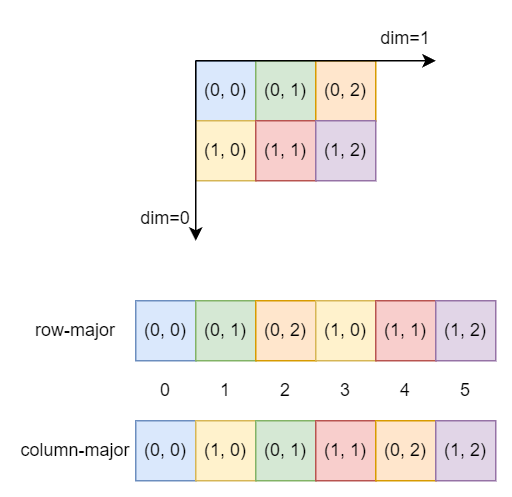
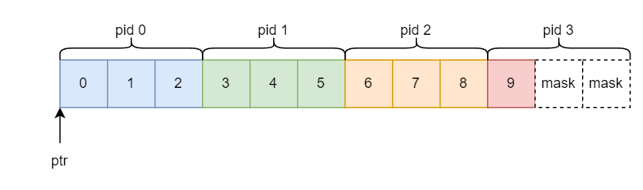
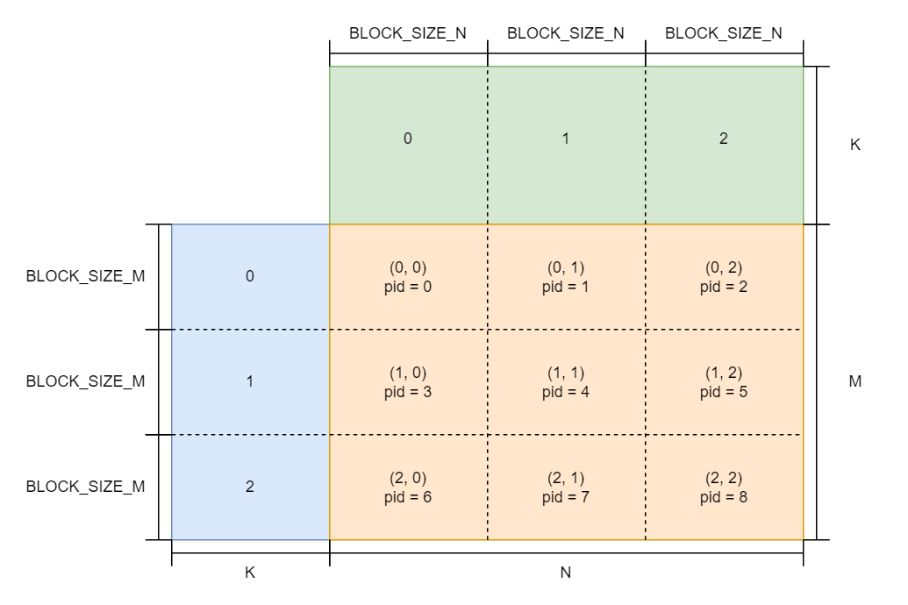
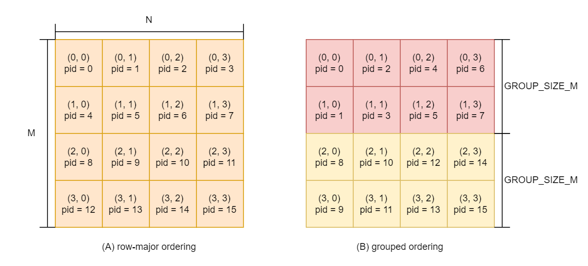
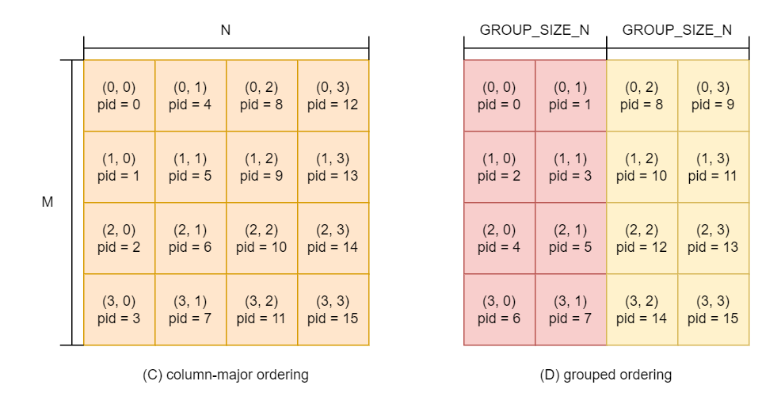

# OpenAI Triton 入门

[TOC]

## 一、简介

本文在之前博客 [GPU 与 CUDA 简介](https://zhuanlan.zhihu.com/p/686772546) 的基础上, 简单介绍一下 [OpenAI Triton](https://github.com/openai/triton) 相关的知识, 为之后了解一些底层算法做铺垫。

作为 开发者, 我们在看到新的英语单词时, 应该先去了解一下其原本的含义, 不然和别人交流时容易出现问题。在西方神话中, [Triton](https://en.wikipedia.org/wiki/Triton_(mythology)) 是一个半神, 他是海神波塞冬的孩子, 半人半鱼的模样。在天文学中, [Triton](https://en.wikipedia.org/wiki/Triton_(moon)) 是海王星 (Neptune) 最大的卫星。这是这个单词最常见的两个含义。

在深度学习中, 有两个项目都命名成 Triton: 一个是英伟达开源的推理框架 [Triton Inference Server](https://github.com/triton-inference-server); 另一个就是本文的主角: OpenAI 开源的 AI 编译器 Triton。

### 1.1 编译简介

我们知道, 编译器的本质就是代码转换器。我们一般将 开发者 写的代码称为 **编程语言** ([programming language](https://en.wikipedia.org/wiki/Programming_language))。**编程语言** 分为两种: 一种是 GPL ([general-purpose language](https://en.wikipedia.org/wiki/General-purpose_language)), 可以进行通用领域的开发, 常见的有 C/C++, Java, Python 等等; 另一种是 DSL ([domain-specific language](https://en.wikipedia.org/wiki/Domain-specific_language)), 只能针对特定领域进行开发。DSL 的语法一般是不完善的, 会依附于某个 GPL 之上, 方便进行扩展。

我们一般将 计算机 可以识别运行的代码称为 **机器码**, 而编译器的工作就是将 **编程语言** 转换成 **机器码**。当然, 这个过程是非常繁琐的, 需要兼容各式各样的硬件设备, 编译器也不会一步将 **编程语言** 转换成 **机器码**, 而是需要经过多个步骤 (多层抽象)。我们将每一步得到的代码称为 **中间表示** ([Intermediate representation](https://en.wikipedia.org/wiki/Intermediate_representation)), 简称 IR。整个转换过程是: **编程语言** (GPL/DSL) → **中间表示** → **机器码**。

Triton 属于 AI 编译器, 其提供的 **编程语言** 是针对深度学习领域算子融合的, 因此被称为 DSL。从 [论文](https://www.eecs.harvard.edu/~htk/publication/2019-mapl-tillet-kung-cox.pdf) 中可以看出, 早期 Triton 提供的 DSL 是基于 C/C++ 语言; 而现在则是基于 Python 语言, 进一步降低开发门槛。同时, Triton 现在和 PyTorch 生态相互融合:

+ Triton 的官方实现目前只支持融合 PyTorch 算子
+ [torch.compile](https://pytorch.org/docs/stable/torch.compiler.html) 的 TorchInductor 后端中 CUDA 部分是基于 Triton 开发的

Triton 采用 [just-in-time](https://en.wikipedia.org/wiki/Just-in-time_compilation) 机制进行编译。如果一个函数被 `triton.jit` 装饰器装饰, 那么在运行时会先编译成机器码, 然后再执行。我们将被 `triton.jit` 装饰的函数称为 **核函数**。和其它函数不同, **核函数** 必须按照 Triton 提供的 DSL 进行编写, 否则无法编译通过。这样, Triton DSL 就完美地融入 Python 生态圈中, 在 **快速开发** 和 **高效运行** 之间找到了平衡点 (trade-off)。

Triton 的编译过程如下:

+ 将 **核函数** 解析成 AST (抽象语法树)
+ 根据 AST 生成 Triton IR 代码
+ 将 Triton IR 代码转换成 Triton GPU IR 代码
+ 将 Triton GPU IR 代码转换成 LLVM IR 代码
+ 使用 [LLVM](https://github.com/llvm/llvm-project), 将 LLVM IR 代码转换成 PTX 代码
+ 使用 [ptxas](https://docs.nvidia.com/cuda/parallel-thread-execution/index.html), 将 PTX 代码转换成 cubin 机器码

我们将 Triton IR, Triton GPU IR 和 LLVM IR 分别简称为 ttir, ttgir 和 llir。其中, ttir 和 ttgir 是 Triton 项目中自己定义的 **中间表示**, llir 则是 [LLVM](https://github.com/llvm/llvm-project) 项目的 **中间表示**。Triton 库在编译时会集成 LLVM 相关的内容, 但不会集成 ptxas 相关的内容。因此, 在使用 Triton 时, 环境变量中一定要有 ptxas 路径!

同时, 在 Triton 2.0+ 中, 作者使用 MLIR (Multi-Level Intermediate Representation) 重写了后端。MLIR 一开始是 Google TensorFlow 项目的一部分, 主要用于统一 AI 编译器范式。现在, 这个项目转到了 LLVM 项目中继续发展。更多相关内容可以参考 [MLIR 项目主页](https://mlir.llvm.org/) 和 [TensorFlow MLIR 项目主页](https://www.tensorflow.org/mlir)。

从上面可以看出, 整个编译过程不涉及到 CUDA 代码转换, 而是多层 **中间表示** 的转换, 最终得到 cubin 机器码。因此, 我们可以认为, Triton 和 CUDA 是同一层次的概念, 但是适用的范围不同: 前者是针对深度学习领域的 GPU 计算, 而后者是针对通用领域的 GPU 计算。同时, Triton 中的 编程模型 和 CUDA 中的 编程模型 不是严格的对应关系。如果你长期从事 AI 编译的工作, 对 PTX 非常熟悉, 那么学习 Triton 就非常简单了。如果和我一样不是, 那么就慢慢学习吧。

Triton 的 [官方文档](https://triton-lang.org/main/index.html) 中没有详细说明其 编程模型, 同时网上关于 Triton 的资料非常少, 大部分都是复制官方 Tutorial 的代码或者编译后的 IR 代码。本文主要是自己探索总结出来的 Triton 内容, 属于初学, 如果有问题, 欢迎指正。

### 1.2 安装简介

Triton 目前只支持 Linux 系统下的 CUDA 架构 7.0+ 的设备。他们也在开发其它设备的后端, 比方说 CPU 等等。期待后续硬件生态完善的 Triton 库。如果你使用的是 Windows 电脑, 可以在 WSL 上进行安装, 亲测是没有问题的。

Triton 库在编译时已经将 LLVM 集成了, 因此只需要保证系统环境中有 C++ 编译器即可。有些系统安装完成后只有 gcc 编译器, 没有 g++ 编译器, 此时需要手动安装一下。

现在安装 PyTorch 2.0+ 的版本, 都会自带 CUDA 环境, 不需要再单独安装 CUDA Toolkit 了。在 PyTorch 2.0+ 版本正确安装的前提下, 我们可以直接用 pip 安装 `nvidia-cuda-nvcc-cu11`, 找到 ptxas 程序的路径, 设置成 `TRITON_PTXAS_PATH` 环境变量即可, 就像下面这样:

```python
import os 

os.environ["TRITON_PTXAS_PATH"] = "~/miniconda3/envs/torch2/lib/python3.10/site-packages/nvidia/cuda_nvcc/bin/ptxas"
```

更多内容可以参考: [issues 119054](https://github.com/pytorch/pytorch/issues/119054)。当然, 你也可以自己配置完整的 CUDA Toolkit 环境。现在, 我们就可以开始使用 Triton 库了。

## 二、多维数组 基础知识

在了解 Triton 的编程模型之前, 我们先了解一下 多维数组 相关的知识。

### 2.1 坐标索引 与 全局索引

多维数组 (multi-dimensional array) 指的是多层 **嵌套** 的数组。需要注意的是, 在这里, "维度" 是有歧义的, 一个是 **嵌套** 的层级, 一个是各级 **嵌套** 的元素个数。一般情况下, 数组的维度指的是前者, 也就是 **嵌套** 的层级数。

在 深度学习 领域, 我们一般将 多维数组 称为 张量 (tensor), 两者是一个概念。同时, 向量 和 一维数组 是等价的; 矩阵 和 二维数组 是等价的。需要注意的是, 向量的维度指的是向量中元素的个数, 而数组的维度一般指 **嵌套** 的层级数。

为了避免歧义, NumPy 中取消了 "维度" 的概念, 将数组的维度称为 **轴** (axis), 向量的维度称为 **shape**。而在 PyTorch 中, "维度" 指的是数组的维度, 而向量的维度称为 **size** 或者 **shape**。本文的表述方式和 PyTorch 保持一致。

我们可以将计算机的内存理解为 "字节数组", 内存地址 就是 "字节数组" 的索引。对于内存而言, 其只能是 "一维数组", 不能是 "多维数组"。因此, 无论张量的维度如何, 最终都要转换成 "一维数组" 存储在内存中。

对于一个张量而言, 其有多少个维度, 元素的索引就由多少个数字构成。由于这种表示方式和 "坐标" 非常相似, 我们将其称为 **坐标索引**。同时, 我们将元素在 "一维数组" 中的索引称为 **全局索引**。需要注意的是, **坐标索引** 和 **全局索引** 只是本文引入的概念, 方便表述使用的。

当我们想获取数组中某一个 "元素值" 时, 需要将 **坐标索引** 转换成 **全局索引**, 然后将数组首元素的内存地址和 **全局索引** 相加, 就可以获得 "元素值" 的内存地址了。因此, 多维数组 的一个核心问题是: **坐标索引** 和 **全局索引** 之间的转换。

### 2.2 数组的 order

我们在将 多维数组 转化成 一维数组 时, 一般有两种方式, C order 和 F order。

在 NumPy 中, 其对 C order 的定义是: 当 **全局索引** 增加时, **坐标索引** 的最后一个值变化最快, 第一个值变化最慢。这样的说法有些抽象, 举例来说, 对于一个 shape 是 `[2, 2, 2]` 的三维数组来说:

+ **坐标索引** `[0, 0, 0]` 对应 **全局索引** 为 `0`
+ **坐标索引** `[0, 0, 1]` 对应 **全局索引** 为 `1`
+ **坐标索引** `[0, 1, 0]` 对应 **全局索引** 为 `2`
+ **坐标索引** `[0, 1, 1]` 对应 **全局索引** 为 `3`
+ **坐标索引** `[1, 0, 0]` 对应 **全局索引** 为 `4`
+ **坐标索引** `[1, 0, 1]` 对应 **全局索引** 为 `5`
+ **坐标索引** `[1, 1, 0]` 对应 **全局索引** 为 `6`
+ **坐标索引** `[1, 1, 1]` 对应 **全局索引** 为 `7`

在 NumPy 中, 其对 F order 的定义是: 当 **全局索引** 增加时, **坐标索引** 的第一个值变化最快, 最后一个值变化最慢。举例来说, 对于一个 shape 是 `[2, 2, 2]` 的三维数组来说:

+ **坐标索引** `[0, 0, 0]` 对应 **全局索引** 为 `0`
+ **坐标索引** `[1, 0, 0]` 对应 **全局索引** 为 `1`
+ **坐标索引** `[0, 1, 0]` 对应 **全局索引** 为 `2`
+ **坐标索引** `[1, 1, 0]` 对应 **全局索引** 为 `3`
+ **坐标索引** `[0, 0, 1]` 对应 **全局索引** 为 `4`
+ **坐标索引** `[1, 0, 1]` 对应 **全局索引** 为 `5`
+ **坐标索引** `[0, 1, 1]` 对应 **全局索引** 为 `6`
+ **坐标索引** `[1, 1, 1]` 对应 **全局索引** 为 `7`

简单来说, C order 就是将嵌套的最内层挨个放在一起, 由最内层到最外层, F order 则是反过来。不同的 order, **坐标索引** 和 **全局索引** 转换的方式不同。

### 2.3 二维数组 简介

二维数组 是我们平时用的最多的数据结构, 在不同的场景下, 其两个维度都会被赋予不同的含义, 这里简单总结一下。

对于 矩阵 来说, **坐标索引** 一般采用 "先行后列" 的方式。举例来说, **坐标索引** `[3, 4]` 表示第三行第四列。那么, 我们可以将其理解为 "行向量嵌套", 即认为 **坐标索引** 的第一个值表示 "行向量" 的索引值, 第二个值表示行向量中 "元素" 的索引值。在这种背景下, C order 也被称为 row-major order, 即行向量中的元素挨个放在一起; F order 也被称为 column-major order, 即列向量中的元素挨个放在一起。我们可以用下图来辅助理解:



在数据库中, 二维表结构也是非常常见的。一般情况下, 一行表示一条 "记录", 一列表示一个 "字段", 因此 "行数据库" 表示将 "记录" 挨个存储, 添加新的 "记录" 比较方便; "列数据库" 表示将 "字段" 挨个存储, 添加新的字段比较方便。pandas 中的 `DataFrame` 也是这么设计的, 我们可以将其理解为 内存数据库, 他们的原理都是相似的。

对于 单通道的图片 而言, 我们一般用 "高" 和 "宽" 来表示。其中, "高" 对应矩阵中的 "行数", "宽" 对应矩阵中的 "列数"。在传统的图片处理中, 我们一般采用 "先列后行" (先宽后高) 的方式来表示像素的 **坐标索引**。举例来说, **坐标索引** `[3, 4]` 表示第三列第四行。也正是因为此, 图片的分辨率一般使用 "宽x高" 的方式进行表述。这种坐标系统和矩阵的坐标系统是相反的。在深度学习中, 我们并不习惯这样的表示方式, 因此会 "转置" 成和 矩阵 一样的表示方式, 方便我们理解。

对于 矩阵 来说, "行数" 一般有三种表述方式: num_rows, col_size, height; 对应 "列数" 也有三种表述方式: num_cols, row_size, width。不同的表述方式只是表述的主体不同罢了。

简单总结一下, 对于 矩阵 来说, 其有两种构建 **坐标索引** 的方式: "先行后列" 和 "先列后行"; 同时 **坐标索引** 转换成 **全局索引** 也有两种方式: row-major/C order 和 column-major/F order。

### 2.4 数组的 stride

一般情况下, 我们使用 **stride** 将 **坐标索引** 转换成 **全局索引**。对于 多维数组 而言, 每一个维度都有一个 stride 值, 其含义是: 当这个维度的 **坐标索引** 值增加 1 时, **全局索引** 的增加量。

举例来说, 对于 shape 是 `[num_rows, num_cols]` 的矩阵而言:

(1) 如果是 row-major 的矩阵, 那么 **坐标索引** `[i, j]` 转换成 **全局索引** 就是 `i * num_cols + j`。

+ 当第 0 维度的 **坐标索引** 值增加 1 时, **全局索引** 增加 `num_cols`
+ 当第 1 维度的 **坐标索引** 值增加 1 时, **全局索引** 增加 `1`

那么, 我们可以认为此时矩阵的 stride 就是 `[num_cols, 1]`。

(2) 如果是 column-major 的矩阵, 那么 **坐标索引** `[i, j]` 转换成 **全局索引** 就是 `i + j * num_rows`。

+ 当第 0 维度的 **坐标索引** 值增加 1 时, **全局索引** 增加 `1`
+ 当第 1 维度的 **坐标索引** 值增加 1 时, **全局索引** 增加 `num_rows`

那么, 我们可以认为此时矩阵的 stride 就是 `[1, num_rows]`。

同理, 对于 shape 是 `[C, H, W]` 的三维数组而言:

(1) 如果其是 C order 的, 那么 **索引** `[i, j, k]` 转换成 **全局索引** 就是 `i * H * W + j * W + k`

+ 当第 0 维度的 **坐标索引** 值增加 1 时, **全局索引** 增加 `H * W`
+ 当第 1 维度的 **坐标索引** 值增加 1 时, **全局索引** 增加 `W`
+ 当第 1 维度的 **坐标索引** 值增加 1 时, **全局索引** 增加 `1`

因此, 对应的 stride 就是 `[H * W, W, 1]`。

(2) 如果其是 F order 的, 那么 **索引** `[i, j, k]` 转换成 **全局索引** 就是 `i + j * C + k * C * H`

+ 当第 0 维度的 **坐标索引** 值增加 1 时, **全局索引** 增加 `1`
+ 当第 1 维度的 **坐标索引** 值增加 1 时, **全局索引** 增加 `C`
+ 当第 1 维度的 **坐标索引** 值增加 1 时, **全局索引** 增加 `C * H`

因此, 对应的 stride 就是 `[1, C, C * H]`。

也就是说, 我们只需要将 **坐标索引** 和 stride 之间进行 "对应位置相乘再求和", 就可以得到 **全局索引**, 这个过程和 向量点乘 是类似的。在有 stride 的情况下, 我们不用在意 多维数组 的 order, 直接用其就可以求得 **全局索引** 值。

stride 的用处不仅仅可以帮助我们转换索引值, 还可以帮助我们进行 维度的变换 和 slicing。

我们知道, 转置矩阵就是交换矩阵的第 0 维和第 1 维。我们用 `mat` 表示原来的矩阵, 用 `t_mat` 表示转置矩阵, 那么: `mat[i, j] = t_mat[j, i]`。我们在不改变内存 "一维数组" 数据的情况下, 怎么表示转置后的矩阵呢? 答案是 stride 也跟着变换。如果是 row-major 的矩阵, 那么 stride 是 `[num_cols, 1]`, 转置矩阵 的 stride 就是 `[1, num_cols]`。这样, `mat[i, j]` 的 **全局索引** 和 `t_mat[j, i]` 的 **全局索引** 就保持一致了, 我们就不需要改变内存数据了。

更一般的, 当我们用 [swapaxes](https://numpy.org/doc/stable/reference/generated/numpy.swapaxes.html) / [transpose](https://pytorch.org/docs/stable/generated/torch.transpose.html), [moveaxis](https://numpy.org/doc/stable/reference/generated/numpy.moveaxis.html) / [movedim](https://pytorch.org/docs/stable/generated/torch.movedim.html), [transpose](https://numpy.org/doc/stable/reference/generated/numpy.transpose.html) / [permute](https://pytorch.org/docs/stable/generated/torch.permute.html) 改变 多维数组 的维度位置时, stride 也跟着改变位置即可。也就是说, stride 和 数组的维度 是相互绑定的关系! 这样, 我们就不需要重构内存 "一维数组" 中的数据了, 非常方便!

同时, slicing 操作也不需要改变内存 "一维数组" 中的数据。我们设 `mat` 是一个矩阵, 那么对于 `mat[start_i:end_i:step_i, start_j:end_j:step_j]`, 我们只需要做如下的改变:

+ 将起始元素的位置从 `[0, 0]` 变成 `[start_i, start_j]`
+ 将 `mat` 的 **shape** 改成 `[(end_i - start_i) // step_i, (end_j - start_j) // step_j]`
+ 将 `mat` 的 **stride** 分别乘以 `step_i` 和 `step_j`

从上面可以看出, 无论是 维度的变换, 还是 slicing 操作, 我们都不需要开辟一个新的内存空间, 只要创造一个新的数组对象即可。我们将这种新的数组对象称为 **view**。

对于 多维数组 而言, 如果其所有的元素在内存 "一维数组" 中是连续的, 我们称为 **连续数组** (contiguous array)。比方说, 对于 row-major 连续矩阵 `mat` 来说, `mat[1:3, :]` 是 **连续数组**, 因为第一个行向量后面紧跟着是第二个行向量。但是, `mat[:, 1:3]` 则不是 **连续数组**, 因为第一个行向量后面不是紧跟着第二个行向量。

至此, 你应该对 多维数组 有一个大致的了解。下面, 让我们跟着官方的三个 Tutorial 来了解 Triton 的编程模型。

## 三、教程一: 向量逐位相加

### 3.1 核心思想

我们知道, 一次完整的运算包括两部分: "数据的加载与存储" 以及 "实际计算"。一般情况下, "数据的加载与存储" 消耗的时间是 "实际计算" 的几倍之多, 这个问题对于 GPU 来说更加严重。

在 CUDA 编程模型中, L1 Cache 属于片上内存, 其用于存放常用的数据, 包括 **共享内存**, 常量内存 和 纹理内存。而 L2 Cache 属于片外内存, 其主要用于 HBM 中数据的缓存。

目前, 很多底层算子的优化都是将计算进行分块处理, 将数据预先加载到 **共享内存** 中, 尽可能地减少从 HBM 中加载数据的次数。虽然 "实际计算" 的时间会增加, 但是整体的运算时间会减少。同时, "实际计算" 和 "数据加载与存储" 之间可以 "异步处理", 进一步增加运算的效率。

在 CUDA 编程中, 这样的优化有一个专门的名词: tiling。tile 的含义是 "瓦片"。在 CS 中, 其和 bucket, segment, block, grid, cluster, group, part 等等单词的含义相似, 表示一部分, 一块或者是一组元素。不同领域会选择不同的词语, 按照惯例来就好, 没有必要较真。Triton 的 [论文](https://www.eecs.harvard.edu/~htk/publication/2019-mapl-tillet-kung-cox.pdf) 中则称自己是 "tiled neural network computations", 即 "分块神经网络计算"。

在 Triton 中, 没有了 CUDA 中的 grid, block 和 thread 等概念, 出现了 programs 的概念。programs 和 grid (blocks) 概念很相似。在 CUDA 中, **核函数** 是针对一个 thread 而言的, 开发者可以精准的控制每一个 thread 的执行; 而在 Triton 中, **核函数** 是针对一个 program 而言的, 开发者则使用类似于 NumPy 的 **向量化编程** 方式来写代码。至于一个 program 怎么对应到多个 thread 上, 那是 Triton 编译器做的事情, 和开发者这无关。Triton 的 [论文](https://www.eecs.harvard.edu/~htk/publication/2019-mapl-tillet-kung-cox.pdf) 中称这种方式为 single-threaded 编程。

下面, 让我们一步步来看, 如何用 Triton 实现两个相同 size 向量的逐位相加。

### 3.2 核函数编写

首先, 导入必要的包, 代码如下:

```python
import torch
from torch import Tensor 

import triton  # 只能用于 主机函数 
import triton.language as tl  # 只能用于 核函数
```

需要说明的是:

+ Triton 目前官方只支持 PyTorch 算子融合, 所以 `torch` 包必须导入
+ 在 **核函数** 中, 我们只能使用 `tl` 中提供的函数, 或者被 `triton.jit` 装饰的函数, 其它函数都不能调用
+ 在 **核函数** 之外, 不能使用 `tl` 中提供的函数, 可以使用 `triton` 提供的函数

然后, 就是 **核函数** 的代码:

```python
@triton.jit
def _vector_add_kernel(
        a_ptr, b_ptr, c_ptr, M,        # c = a + b, 其中, a, b 和 c 的 shape 都是 [M, ]
        stride_a, stride_b, stride_c,  # a, b, c 向量的 stride
        BLOCK_SIZE: tl.constexpr       # meta 参数
):
    """ 每一个 program 处理 [BLOCK_SIZE, ] 大小的数据 """

    # pid: 当前 program 的索引值
    pid = tl.program_id(axis=0)

    # offsets: 当前 program 需要处理元素的 坐标索引
    offsets = pid * BLOCK_SIZE + tl.arange(0, BLOCK_SIZE)

    # ptrs: 当前 program 需要处理元素的内存地址
    a_ptrs = a_ptr + offsets * stride_a
    b_ptrs = b_ptr + offsets * stride_b 
    
    # 加载数据并计算
    a = tl.load(a_ptrs, mask=offsets < M, other=0.0)
    b = tl.load(b_ptrs, mask=offsets < M, other=0.0)
    c = a + b 

    # 保存数据
    c_ptrs = c_ptr + offsets * stride_c
    tl.store(c_ptrs, c, mask=offsets < M)
```

目前, Triton 的 **核函数** 参数类型只支持: `Tensor`, `int`, `float`, `str` 和 `tl.constexpr`; 不能传入其它类型, 比如 `list`, `tuple`, 自定义的对象 等等。这样导致的结果就是 **核函数** 的参数非常多, 有时甚至多到离谱。

Triton 编译器会将 `Tensor` 参数转换成 多维数组 首元素的 "指针"。比方说, 如果传入的是 `float32` 类型的 `Tensor`, 那么就会解析成 C 语言中的 `float *` 类型。在上述代码中, `a_ptr`, `b_ptr` 和 `c_ptr` 传入的就是 `Tensor`, 在 **核函数** 中当作首元素的 "指针" 即可。

如果一个参数的 type hint 是 `tl.constexpr`, 那么这个参数就是 meta 参数。meta 参数要求: 必须是 2 的幂, 也就是 2, 4, 8, 16, 32, 64, 128, 256, 512, 1024, 2048, 4096, 8192, 16384, 32678, 65536 等等。meta 参数和数据的加载息息相关, 直接影响计算的性能, 后面会说明为什么。在这里, `BLOCK_SIZE` 就是 meta 参数。

Triton 中 programs 的概念和 CUDA 中 grid 的概念是相似的, 其是一个 **三维数组**。在 CUDA 中, 我们通过 `blockIdx.x`, `blockIdx.y` 和 `blockIdx.z` 来获取一个 block 的 **坐标索引**; 而在 Triton 中, 我们通过 `tl.program_id(axis=0)`, `tl.program_id(axis=1)` 和 `tl.program_id(axis=2)` 来获取一个 program 的 **坐标索引**。

设向量的 size 是 `M`, 现在对向量进行分 block 操作。注意, 这里就是单纯的分 block, 和 CUDA 中线程模型的 block 完全没有关系。每个 block 有 `BLOCK_SIZE` 个元素, 那么一共有 `ceil(M / BLOCK_size)` 个 block。每一个 program 负责一个 block 的数据。我们可以用下图来辅助理解:



在上述代码中, `a` 和 `b` 是输入张量, `c` 是输出张量。Triton 采用和 C/C++ 一样的编程风格, 需要先将 输出张量 的内存预先分配好。在主机函数中, 我们会用 `torch.empty` 开辟输出张量 `c` 的内存空间。单个 program 需要做的事情是: 从 `a` 张量和 `b` 张量中加载 `BLOCK_SIZE` 个元素, 并进行逐位相加, 存储到 `c` 张量中。

`tl.arange` 和 `torch.arange` 是一样的, 返回一个向量。`pid * BLOCK_SIZE` 就是当前 program 处理的 block 首元素的 **坐标索引**。 因此, `offsets` 就是 block 中每一个元素的 **坐标索引**。**坐标索引** 乘以 stride 就是 **全局索引**, 和 `ptr` 相加就是元素的 "指针"。那么, `a_ptrs`, `b_ptrs` 和 `c_ptrs` 就是 block 中所有元素的 "指针"。

`tl.load` 负责从 HBM 中加载数据, 加载到 共享内存 或者 本地内存 中。具体加载到哪由 Triton 编译器控制。需要注意的是, 加载数组的个数必须是 2 的幂。这个限制和 meta 参数的要求是一致的, 也正是因为此, meta 参数主要用于计算 `offsets`。如果 `M` 不能被 `BLOCK_SIZE` 整除, 那么最后一组就需要设置 `mask` 和 `other` 参数。`mask` 参数表示当前位置是否需要加载, `other` 参数表示空缺位置的填充值。

实际的计算过程只有一行代码: `c = a + b`。`tl.store` 负责将计算结果存储到 HBM 中, 和 `tl.load` 是相互对应的操作。

和 CUDA 编程相比, 整个过程突出一个 **向量化编程**。和 NumPy 不同的是, 这里要自己手动计算 "指针"!

### 3.3 主机函数编写

在开发完成 **核函数** 后, 让我们看看如何启动 **核函数**, 代码如下:

```python
def vector_add(
        input1: Tensor, input2: Tensor, block_size: int = 1024,
        print_ir: bool = False, ir_type: str = "llir", print_meta: bool = False
) -> Tensor:

    assert input1.is_cuda and input2.is_cuda
    assert input1.ndim == 1 and input2.ndim == 1 and input1.size(0) == input2.size(0)

    vector_size = input1.size(0)
    output = torch.zeros_like(input1)

    block_size = triton.next_power_of_2(block_size)
    num_programs = triton.cdiv(vector_size, block_size)
    programs_shape = (num_programs, )

    compiled_kernel: triton.compiler.CompiledKernel = _vector_add_kernel[(programs_size, )](
        input1, input2, output, vector_size, input1.stride(0), input2.stride(0), output.stride(0), block_size 
    )

    if print_ir:
        print("Triton GPU IR codes of add kernel are shown below:", )
        print(compiled_kernel.asm[ir_type])
        print()

    if print_meta:
        print("The meta parameters of add kernel are shown below:",)

        while True:  # 等待程序运行完成
            if isinstance(compiled_kernel.metadata, dict):
                print(json.dumps(compiled_kernel.metadata, ensure_ascii=False, indent=4, skipkeys=True))
                break 
    
    return output 
```

首先, Triton 提供了两个非常实用的函数: `next_power_of_2(n)` 返回大于 `n` 最小 2 的幂; `cdiv(x, y)` 等价于 `ceil(x / y)`。它们可以帮助我们高效的计算 meta 参数值, 以及 programs 的 shape 值。

其次, 就是 **核函数** 的启动方式为: `kernel_func[programs_shape_tuple](*args)`, 这个明显是仿照 CUDA 核函数的启动方式设计的。需要注意的是, 中括号中必须是元组, 不能是单个数字!

之前说过, 在 Triton 中, **核函数** 采用 JIT 编译方式。当 **核函数** 启动完成后, 编译也就完成了。一般情况下, 编译的过程只会发生在第一次调用时, 或者 meta 参数值发生变化时。其它时候, **核函数** 都不会进行编译。

**核函数** 启动完成后, 会返回的 `CompiledKernel` 对象。这个对象中包含编译后的信息: `asm` 属性包含了编译后的 **中间表示** 代码以及 机器码, 包括: ttir, ttgir, llir, ptx 以及 cubin; `metadata` 属性包含编译的其它一些信息。

需要注意的是, **核函数** 启动完成, 只代表其编译完成, 并向 GPU 发送了计算指令, 不能说明 GPU 计算完成 (这和 PyTorch 的设计思路是相似的)。

### 3.4 autotune

刚刚说过, meta 参数会影响 **核函数** 运行的效率。除了我们自己用 `tl.constexpr` 定义的参数外, 还有一些预设的 meta 参数。这些预设的 meta 参数不能作为 **核函数** 的参数, 同时也没有 2 的幂要求。Triton 官方文档没有明确的说明, 这里简单介绍三个常用的:

(1) `num_stages`: 按照官方 [discussion 512](https://github.com/openai/triton/discussions/512) 和 [issue 2077](https://github.com/openai/triton/issues/2077) 中的说法, 在 安培架构 (8.0+) 中, 英伟达引入了新的 异步拷贝 (asynchronous copy) 指令。Triton 编译器根据这些指令会将 核函数 中的 for 循环 "流水线" 化, 而 `num_stages` 指的就是 "流水线" 的深度。

我是这么理解的: 如果 for 循环中有 "数据加载" 和 "计算" 两个任务, 那么在第一次循环 "数据加载" 任务结束时, 我们就可以开始下一次循环的 "数据加载" 任务, 而不用等到第一次循环 "计算" 任务结束时, 再开始下一次循环的 "数据加载" 任务。而 num_stages 指的就是 数据预加载 的最大深度: 即某一次循环 "数据加载" 任务结束后, 最多提前加载 `num_stages` 次循环的数据 (这和 "流水线" 的概念是相似的)。

从测试效果来看, `num_stages` 没有 2 的幂限制, 只要是正整数就行。

(2) `num_warps`: 一个 thread block 中的 thread warp 的数量, Triton 中设置必须是 2 的幂。由于一个 thread warp 固定是 32 个 thread, 而一个 thread block 最多有 1024 个 thread, 因此 `num_warps` 的数量最大是 32!

在 CUDA 编程中, 我们不能手动设置 thread warp 的数量, 但是在 Triton 中却可以设置, 这一点需要注意。

(3) `num_ctas`: CTA (Cooperative Thread Array) 是 thread block 线程块 的另一种称呼。在 9.0+ 的架构中, CUDA 线程模型引入了 thread cluster 的概念, 此时完整的 **线程模型** 架构是: grid → thread block cluster → thread block / CTA → thread warp → thread。`num_ctas` 表示的就是一个 block cluster 中有多少个 thread block。这个只有在 H100 及以上的显卡才能设置, RTX 4090 是 8.9 的架构, 也无法使用。

那么, 我们应该如何选择最优的 meta 参数组合呢? Triton 官方提供了 autotune 的功能, 可以帮助我们自动寻找最优的 meta 参数组合。示例代码如下:

```python
def find_best_meta_params(vector_size):
    can_block_size = [2 ** i for i in range(0, 14)]  # [1, 8192] 之间所有 2 的幂
    can_num_warps = [2 ** i for i in range(0, 6)]  # [1, 32] 之间所有 2 的幂
    can_num_stages = [3, 4, 5]

    configs = []
    for block_size, num_warps, num_stages in product(can_block_size, can_num_warps, can_num_stages):
        configs.append(
            triton.Config({"BLOCK_SIZE": block_size}, num_warps=num_warps, num_stages=num_stages)
        )

    _autotune_vector_add_kernel = triton.autotune(
        configs=configs,  # 所有可能的 meta 参数配置
        key=["M", ]  # 当 M 发生变化时, 自动寻找, 如果不发生变化, 保持不变
    )(_vector_add_kernel)

    input1 = torch.randn(vector_size, ).cuda()
    input2 = torch.randn(vector_size, ).cuda()
    output = torch.empty_like(input1)

    def cal_programs_shape(meta):
        num_programs = triton.cdiv(vector_size, meta["BLOCK_SIZE"])
        return (num_programs, )

    _autotune_vector_add_kernel[cal_programs_shape](
        input1, input2, output, vector_size, 
        input1.stride(0), input2.stride(0), output.stride(0)
    )

    print(f"Best config of meta parameters for num_elements={vector_size} are shown below: ",)
    print(_autotune_vector_add_kernel.best_config)
```

需要说明的有:

首先, Triton [官方教程](https://triton-lang.org/main/getting-started/tutorials/index.html) 采用 装饰器 的写法, 那个写法太吓人了。我们知道, Python 装饰器本质就是 "函数调用"。那么, 我们完全可以采取上述策略来简化代码。autotune 的本质就是在 **核函数** 外面套一层, 然后在编译时遍历所有的 候选 meta 参数组合 `configs`, 寻找运行时间最短的 meta 参数组合, 并记录下来。

其次, **核函数** 在 meta 参数发生变化时才会重新编译。而在 autotune 中, 凡是在 `configs` 中配置的 meta 参数都不用作为 **核函数** 的入参。除此之外, 增加了 `key` 参数: 当 `key` 参数发生变化时, 就会重新编译。在上述代码中, 我们将 `M` 设置成 `key` 参数了。

接着, autotune 机制导致编译的过程非常地慢。如果 `configs` 中配置较多的话, 第一次调用会巨慢无比。因此, 我们可以在测试阶段用 autotune 找到最佳 meta 参数组合, 然后直接在代码中写死, 以减少程序的启动时间。

最后, 在启动 **核函数** 时, 我们不一定采用 "元组" 的方式告诉程序 programs 的 shape, 也可以采用 "函数" 的形式。在上面的代码中, 我们就是通过 `cal_programs_shape` 函数告诉程序 programs 的 shape, 其入参是 meta 参数字典, 返回值是 "元组"!

至此, 你应该对 Triton 有一个大致的认知了。Triton 还提供了测试性能 (benchmark) 的工具, 和本文的关系不大, 这里就不介绍了。有兴趣的可以自行看 [官方教程](https://triton-lang.org/main/getting-started/tutorials/index.html)。

## 四、教程二: softmax 运算

### 4.1 基本思想

这里, 我们需要做的事情是: 对矩阵的每一个 "行向量" 进行 softmax 运算。

softmax 运算用数学公式表示如下: 设输入向量为 $\bold{x}$, 其可以表示为:

$$
\bold{x} = \begin{bmatrix} x_1 & x_2 & \cdots & x_n \end{bmatrix} \tag{4.1.1}
$$

同时, 设向量 $\bold{x}^{\prime}$ 为

$$
\bold{x}^{\prime} = \begin{bmatrix}
    x_1 - \max(\bold{x}) & x_2 - \max(\bold{x}) & \cdots & x_n - \max(\bold{x})
\end{bmatrix} \tag{4.1.2}
$$

那么, softmax 的计算公式如下:

$$
\mathrm{softmax} (\bold{x}) = \mathrm{softmax} (\bold{x}^{\prime}) = \begin{bmatrix}
    \frac{\exp(x_1^{\prime})}{\mathrm{sum}({\bold{x}^{\prime}})} &
    \frac{\exp(x_2^{\prime})}{\mathrm{sum}({\bold{x}^{\prime}})} &
    \cdots &
    \frac{\exp(x_n^{\prime})}{\mathrm{sum}({\bold{x}^{\prime}})}
\end{bmatrix}
\tag{4.1.3}
$$

用 PyTorch 的实现方式如下:

```python
def native_row_softmax(input: Tensor):
    assert input.ndim == 2
    output = input - input.max(dim=1, keepdim=True)[0]
    output = torch.exp(output)
    output = output / output.sum(dim=1, keepdim=True)
    return output 
```

这样的实现有什么问题呢? 那就是从 HBM 中加载数据的次数过多。PyTorch 作为一个通用的计算框架, 每一步的计算结果都会存储到 HBM 中。这样, 你有几次 PyTorch 操作, 就有多少次数据加载。在上面的实现中, 有 `max`, `sub`, `exp`, `sum` 和 `div` 五个操作, 那么就意味着需要从 HBM 中加载和存储 5 次数据。同时, GPU 只在加载数据时进行缓存, 存储数据时不进行缓存, 那么在这里缓存功能是无用的。因此, 这样计算的效率非常低!

那么, 应该如何解决这样的问题呢? 如果使用 CUDA, 我们可以让一个线程块处理一个 行向量, 预先将行向量数据加载到 **共享内存** 中, 五步计算完成后再存储到 HBM 中。这样的工作被称为 **算子融合**, 其核心思想是: 减少从 HBM 中加载和存储数据的次数。

但是, 这样做也是有问题的。**共享内存** 的大小是有限的, 如果放不下一个 行向量 应该怎么办呢? OneFlow 在其 [博客](https://zhuanlan.zhihu.com/p/341059988) 中给出的解决方案是:

1. 如果向量的元素个数小于 1024, 那么一个 warp 处理一个向量, 此时效率最高;
2. 如果向量的元素个数在 1024 到 4096 之间, 那么将向量预先加载到 **共享内存** 中, 一个 thread block 处理一个向量, 处理完成后再存储到 HBM 中;
3. 如果向量的元素个数大于 4096, 依旧是一个 thread block 处理一个向量, 只是会将中间的计算结果保存到 HBM 中, 和上面 PyTorch 代码的情况差不多。

在 Triton 中, 应该采用了类似的策略, 只是变成了 Triton 编译器自动优化。下面让我们看看如何用 Triton 实现。

### 4.2 代码编写

```python
@triton.autotune(configs=[triton.Config({}, num_warps=2 ** i) for i in range(0, 6)], key=["BLOCK_SIZE_N"])
@triton.jit 
def _row_softmax_kernel(
        # output = row_softmax(input), input 和 output 的 shape 都是 [M, N]
        input_ptr, output_ptr, M: int, N: int, 
        stride_input_m: int, stride_input_n: int, stride_output_m: int, stride_output_n: int, 
        BLOCK_SIZE_N: tl.constexpr,  # BLOCK_SIZE_N = triton.next_power_of_2(N)
    ):

    # 一个 program 处理一个 行向量, 因此 pid 就是元素的 "行坐标索引"
    pid = tl.program_id(axis=0)

    # 计算元素的 "列坐标索引"
    offsets_n = tl.arange(0, BLOCK_SIZE_N)

    # 计算元素的 input "指针"
    input_ptrs = input_ptr + (pid * stride_input_m + offsets_n * stride_input_n)
    mask = offsets_n < N

    # 加载数据
    vector = tl.load(input_ptrs, mask=mask, other=-float("inf"))

    # 计算
    vector = vector - tl.max(vector)
    vector = tl.exp(vector)
    vector = vector / tl.sum(vector)

    # 计算元素的 output "指针"
    output_ptrs = output_ptr + (pid * stride_output_m + offsets_n * stride_output_n)

    # 存储数据到 HBM 中
    tl.store(output_ptrs, vector, mask=mask)
```

首先, 核心思想是一个 program 处理一个 行向量。我们用 `M` 和 `N` 分别表示 行向量的个数 以及 行向量中元素的个数。那么, 一共需要启动 `M` 个 program。

一个 program 需要处理的就是一个行向量中的所有元素。因此, 这些元素的 "行坐标索引" 就是 `pid`。元素的 "列坐标索引" 是 `offsets_n`。

需要注意的是, 正常情况下我们只需要加载 `N` 个元素, 但是 `tl.load` 函数加载的元素个数必须是 2 的幂, 这也是 `BLOCK_SIZE_N` 参数存在的意义。在主机函数中, 我们需要将 `BLOCK_SIZE_N` 设置成 `triton.next_power_of_2(N)`。

这时, 你获取会有疑问, `tl.load` 函数加载的数据量有最大值吗? 有, 是 $2^{20}$, 百万级别的, 可以通过 `tl.TRITON_MAX_TENSOR_NUMEL` 变量查看。如果数据的类型是 `float`, 那么一共需要 4MB 的内存, 这个数字远远大于 **共享内存** 的大小。根据推测, Triton 编译器应该是采用了和 4.1 节所说的一样的策略。如果你将 `N` 的值设置的非常大, 那么会发现: 运算时间异常地长, 同时 GPU 使用率异常地低, 机器就像卡住了一样。这是因为和 HBM 交互过多导致的。

产生上述问题的原因是: 我们没有办法将单个向量的 softmax 运算拆分成多个 子运算。虽然没有办法拆分, 但是还是可以优化的, 相关的内容可能在后续的博客中介绍。

有了 **坐标索引** 后, 我们就可以计算 "指针" `input_ptrs` 和 `output_ptrs`。如果理解了 3.2 节的内容, 剩下的就没有什么难理解的了。

主机函数的编写非常简单, 这里直接给出代码, 不做分析了。

```python
def triton_softmax(input: Tensor):
    assert input.ndim == 2

    M, N = input.shape 
    BLOCK_SIZE_N = triton.next_power_of_2(N)
    assert BLOCK_SIZE_N < tl.TRITON_MAX_TENSOR_NUMEL

    output = torch.empty_like(input)

    _row_softmax_kernel[(M, )](
        input, output, M, N, 
        input.stride(0), input.stride(1), output.stride(0), output.stride(1), 
        BLOCK_SIZE_N
    )

    return output 
```

## 五、教程三: 矩阵乘法 matmul

### 5.1 基本思想

这里我们实现的是一个非常经典的并行计算问题: 矩阵乘法 (matrix multiplication)。

我们设 左矩阵 的 shape 是 `[M, K]`, 右矩阵 的 shape 是 `[K, N]`, 那么一共要进行 $M \times N$ 次 向量点乘 的运算。一次 向量点乘 运算有 $K$ 次乘法和 $K - 1$ 次加法。所以, 矩阵乘法包含 $M \times N \times K$ 次乘法运算和 $M \times N \times (K - 1)$ 次加法运算。

我们可以认为, 左矩阵 中有 $M$ 个向量, 右矩阵 中有 $N$ 个向量, 向量的 size 都是 $K$。那么, 常见的分块方式有两种:

一种是沿着左矩阵的 $M$ 维度或者右矩阵的 $N$ 维度进行拆分, 将矩阵分成多个 "向量组", 每一个 "向量组" 分别进行 矩阵乘法, 最终结果 concat 在一起。

一种是 **同时** 沿着左矩阵和右矩阵的 $K$ 维度进行拆分, 将向量拆成多个 "子向量", 最终结果 add 在一起。这种想法的核心在于: 向量点乘 可以拆分成多个 子向量点乘 后求和。

那么, 我们怎么根据上述思想进行高效的 矩阵乘法 运算呢? 示意图如下:



在上面的图中, 蓝色方框表示 左矩阵, 绿色方框表示 右矩阵, 橙色方框表示 结果矩阵。左矩阵第 0 个 block 和右矩阵第 0 个 block 相乘后得到结果矩阵第 (0, 0) 个 block。我们让一个 program 处理计算得到结果矩阵的一个 block, 即一个 program 进行 `[BLOCK_SIZE_M, K]` 和 `[K, BLOCK_SIZE_N]` 的矩阵乘法。

在上面的方案中, 我们只对 $M$ 和 $N$ 维度进行拆分, 那么如何对 $K$ 维度进行拆分呢? 答案是 for 循环。

我们在 共享内存 中先初始化一个 `[BLOCK_SIZE_M, BLOCK_SIZE_N]` 的空间, 赋值为 0, 记作 `results`。然后, 每一次循环时加载 `[BLOCK_SIZE_M, BLOCK_SIZE_K]` 和 `[BLOCK_SIZE_K, BLOCK_SIZE_N]` 的数据到 共享内存 中, 进行 矩阵乘法 运算, 将运算结果和 `results` 相加即可。

这样, 整体的思路就有了。下面, 让我们看看如何用 Triton 实现。

### 5.2 代码编写

```python
@triton.jit
def _matmul_kernel(
        # c = a @ b, 其中, a 的 shape 是 [M, K], b 的 shape 是 [K, N], c 的 shape 的 [M, N]
        a_ptr, b_ptr, c_ptr, M, N, K, 
        # a, b, c 三个矩阵不同维度的 stride 值
        stride_am, stride_ak, stride_bk, stride_bn, stride_cm, stride_cn, 
        # meta 参数, 必须是 2 的幂
        BLOCK_SIZE_M: tl.constexpr, BLOCK_SIZE_N: tl.constexpr, BLOCK_SIZE_K: tl.constexpr
):

    # ## step1: 对矩阵 a 和 b 进行分块
    # 一个 program 只负责计算 [BLOCK_SIZE_M, K] @ [K, BLOCK_SIZE_N] = [BLOCK_SIZE_M, BLOCK_SIZE_N],
    # 那么一共有 ceil(M / BLOCK_SIZE_M) * ceil(N / BLOCK_SIZE_N) 个 program
    # 我们记作 (num_programs_m, num_programs_n)
    pid = tl.program_id(axis=0)
    num_programs_m = tl.cdiv(M, BLOCK_SIZE_M)
    num_programs_n = tl.cdiv(N, BLOCK_SIZE_N)

    # program: 全局索引 pid, 坐标索引 (pid_m, pid_n), shape 为 [num_programs_m, num_programs_n], row-major
    # 则: pid = pid_m * num_programs_n + pid_n 
    pid_m = pid // num_programs_n
    pid_n = pid % num_programs_n

    # ## step2: 采用 向量化编程 的方式计算 坐标索引 (offsets)
    offsets_m = pid_m * BLOCK_SIZE_M + tl.arange(0, BLOCK_SIZE_M)
    offsets_n = pid_n * BLOCK_SIZE_N + tl.arange(0, BLOCK_SIZE_N)
    offsets_k = tl.arange(0, BLOCK_SIZE_K)

    # ## step3: 采用 向量化编程 的方式计算 指针 (ptrs)
    # 接下来, 我们需要进行进一步的分块, 采用 for 循环的方式, 
    # 每一次循环计算 [BLOCK_SIZE_M, BLOCK_SIZE_K] @ [BLOCK_SIZE_K, BLOCK_SIZE_N], 然后结果相加即可。
    # 那么, 这里的 a_ptrs 是第一个 [BLOCK_SIZE_M, BLOCK_SIZE_K], 后续的再移动即可
    # 同理, 这里的 b_ptrs 是第一个 [BLOCK_SIZE_K, BLOCK_SIZE_N], 后续的再移动即可
    a_ptrs = a_ptr + (offsets_m[:, None] * stride_am + offsets_k[None, :] * stride_ak)
    b_ptrs = b_ptr + (offsets_k[:, None] * stride_bk + offsets_n[None, :] * stride_bn)

    # ## step4: 循环计算
    c = tl.zeros((BLOCK_SIZE_M, BLOCK_SIZE_N), dtype=tl.float32)
    for i in range(0, tl.cdiv(K, BLOCK_SIZE_K)):
        a_masks = (offsets_k[None, :] < K - i * BLOCK_SIZE_K) & (offsets_m[:, None] < M)
        a = tl.load(a_ptrs, mask=a_masks, other=0.0)

        b_masks = (offsets_k[:, None] < K - i * BLOCK_SIZE_K) & (offsets_n[None, :] < N)
        b = tl.load(b_ptrs, mask=b_masks, other=0.0)

        c += tl.dot(a, b, allow_tf32=False)
        # c += tl.sum(a[:, None, :] * tl.trans(b)[None, :, :], axis=2)  # 可以运行, 但是编译时间特别长

        a_ptrs += BLOCK_SIZE_K * stride_ak
        b_ptrs += BLOCK_SIZE_K * stride_bk
    
    # ## step5: 存储
    c_ptrs = c_ptr + (offsets_m[:, None] * stride_cm + offsets_n[None, :] * stride_cn)
    c_masks = (offsets_m[:, None] < M) & (offsets_n[None, :] < N)
    tl.store(c_ptrs, c, c_masks)
```

在 **核函数** 中, 我们分别将 左矩阵, 右矩阵 和 结果矩阵 记作 `a`, `b` 和 `c`。`stride_am` 表示 `a` 矩阵在 `M` 维度上的 stride, `stride_ak` 表示 `a` 矩阵在 `K` 维度上的 stride, 以此类推。

首先, 如图三所示, pid 是 program 的 **全局索引**, 我们需要转换成 **坐标索引** `(pid_m, pid_n)` 的形式, 转换方式在代码和注释中表述的很清楚了, 这里就不说明了。

然后, 我们需要计算 block 中每一个元素的 **坐标索引** 值。`offsets_m`, `offsets_n`, `offsets_k` 分别是 $M$, $N$, $K$ 三个维度的 **坐标索引** 值, 它们都是向量。

接下来, 我们需要计算 block 中每一个元素的指针。注意, 这里的 block 是以 矩阵 的形式呈现的, 因此 `a_ptrs`, `b_ptrs` 以及 `c_ptrs` 也是以 矩阵 的形式呈现的。在上述代码中, `offsets[:, None]` 构建的是列向量, `offsets[None, :]` 构建的是行向量, 两个相加会触发 broadcast 机制, 构成 矩阵。

需要注意的是, `a_ptrs` 仅仅是一个 `[BLOCK_SIZE_M, BLOCK_SIZE_K]` 的 矩阵, 后续通过 `a_ptrs += BLOCK_SIZE_K * stride_ak` 进行移动。`b_ptrs` 也是如此。

还需要注意的是 `masks` 的计算, 其和 `ptrs` 是一样 shape 的矩阵, 用于表示元素是否需要被加载, 不需要加载的用 `0.0` 表示。

最后就是加载数据、计算以及存储。需要注意的是 `tl.dot` 函数, 其计算结果保存在共享内存中, `BLOCK_SIZE` 值过大会报 共享内存 错误。但是, `BLOCK_SIZE` 不能小于 16, 如果设置成 8 这个函数就会报错。还有, 如果你 GPU 的架构在 8.0 以下, 那么 `allow_tf32` 必须要设置成 False, 否则也会报错。

主机函数 也非常简单, 没有什么需要特别说明的:

```python
def matmul(input1: Tensor, input2: Tensor) -> Tensor:

    assert input1.is_cuda and input2.is_cuda, "only supported for cuda device."
    assert input1.size(1) == input2.size(0), "the shape of two matrices are mismatched."

    M, K = input1.shape 
    K, N = input2.shape 

    output = torch.empty((M, N), device=input1.device)

    def cal_programs_shape(meta):
        num_pid_m = triton.cdiv(M, meta["BLOCK_SIZE_M"])
        num_pid_n = triton.cdiv(N, meta["BLOCK_SIZE_N"])
        num_pid = num_pid_m * num_pid_n
        return (num_pid, )  # 返回的一定要是元组, 不能是数字
    
    _matmul_kernel[cal_programs_shape](
        input1, input2, output, M, N, K, 
        input1.stride(0), input1.stride(1), input2.stride(0), input2.stride(1), output.stride(0), output.stride(1),
        BLOCK_SIZE_M=64, BLOCK_SIZE_N=64, BLOCK_SIZE_K=64
    )

    return output 
```

### 5.3 L2 缓存优化

从图三 和 5.2 节中我们可以看出, 这里的 program 也是有 **坐标索引** 和 **全局索引** 的, 我们需要将 **全局索引** `pid` 转换成 **坐标索引** `(pid_m, pid_n)`。我们可以直接通过 结果矩阵 的分块来查看两种索引, 如下图 (A) 所示:



当我们从 HBM 中加载数据时, GPU 默认只使用 L2 Cache 区域进行缓存。如果数据存在于 L2 Cache 中, GPU 就不用从 HBM 中再加载数据了, 此时我们称为 "命中"。那么, 有没有什么办法可以提高 L2 Cache 的命中率呢? 答案是采用上图 (B) 的 **全局索引** 构建方式。

在上图中, 图 (A) 和 图 (B) 采用相同的 **坐标索引** 系统, 只是 **全局索引** 系统的构建不相同。在图 (B) 中, 我们对 programs 沿着 $M$ 维度进行了分组, 单组内采用 column-major 的方式构建索引。那么, 为什么图 (B) 中的方式可以增加 L2 Cache 的命中率呢?

在图 (A) 中, 计算完成 pid 0 至 3 四个 program 需要加载 5 次数据, 其中左矩阵 1 次, 右矩阵 4 次 (不考虑按照 $K$ 维度进行切分)。

那么, 如果换成图 (B) 的方案, 计算完成 pid 0 至 3 四个 program 只需要加载 4 次数据, 其中左矩阵 2 次, 右矩阵 2 次。

如果 L2 Cache 的大小只能缓存 4 次 "数据加载", 那么明显图 (B) 的方案比图 (A) 要优秀。

此时, 你可能要问了, program 一定是按照 pid 从小到大启动的吗? L2 Cache 缓存的 "数据加载" 次数怎么计算? 我目前没有找到很好的答案, 只能通过实验来验证。按照 Triton 官方文档中的说法, 经过试验, 在 A100 上, 图 (B) 的方案会比图 (A) 快 10%, 还是相当可观的。

那么, 如何用代码实现图 (B) 所示的 **全局索引** 转 **坐标索引** 呢? 此时, 我们需要增加一个新的 meta 参数 `GROUP_SIZE_M`, 然后将上面 matmul **核函数** 中 `pid_m` 和 `pid_n` 的计算方式改为:

```python
# 一个 program 只负责计算 [BLOCK_SIZE_M, K] @ [K, BLOCK_SIZE_N] = [BLOCK_SIZE_M, BLOCK_SIZE_N],
# 那么一共有 ceil(M / BLOCK_SIZE_M) * ceil(N / BLOCK_SIZE_N) 个 program
# 我们记作 (num_programs_m, num_programs_n)
pid = tl.program_id(axis=0)
num_programs_m = tl.cdiv(M, BLOCK_SIZE_M)
num_programs_n = tl.cdiv(N, BLOCK_SIZE_N)

# 现在, 我们沿着 M 维度进行分组, 将多个 block 分入一组中, 那么每一组有 GROUP_SIZE_M * num_programs_n 个 block
num_programs_in_group = GROUP_SIZE_M * num_programs_n
group_id = pid // num_programs_in_group  # 当前 program 所在 group 的 id
first_pid_m = group_id * GROUP_SIZE_M  # 当前 group 第一个 program 的 M 维度索引
group_size_m = min(num_programs_m - first_pid_m, GROUP_SIZE_M)  # 修正最后一组的 group_size_m

# 第 0 组: pid = pid_n * group_size_m + pid_m
# 其它组: pid = pid_n * group_size_m + (pid_m - first_pid_m) + (num_programs_in_group * group_id)
# 那么: pid - (num_programs_in_group * group_id) = pid * group_size_m + (pid_m - first_pid_m)
pid = pid - num_programs_in_group * group_id
pid_m = pid % group_size_m + first_pid_m
pid_n = pid // group_size_m
```

借助注释和图 (B) 应该很容易理解。一般情况下, 我们会将 `GROUP_SIZE_M` 的值设置成 `8`。

除了图 (A) 中 row-major 的构建方式, 还有 column-major 的构建方式。其对应的分组 **全局索引** 构建方式如下图:



代码实现和上面是相似的。至此, 你应该对 矩阵乘法 的优化有一个大概的认知了。

## 六、总结 与 引用

### 6.1 总结

本文简单的介绍了 OpenAI Triton 相关的知识, 包括 编译流程 和 编程模型 相关的内容。其主要用于 PyTorch 框架的算子融合。相较于 CUDA, 其采用 block 层级的编程方式, 使用 向量化编程 的方式计算元素 "指针"。一个 block 如何对应到多个 thread 则是编译器需要做的事情, 开发者 无法直接进行控制。整个思路是非常清晰的。

除此之外, 本文简单的构建了 多维数组 的知识体系: 坐标索引 和 全局索引。使用这两个概念, 我们很容易就可以理解 order, stride 以及 matmul 的 L2 Cache 优化方式, 感觉非常的有意义。

个人感觉, 在本文中, OpenAI Triton 和 多维数组 的知识是对半分的状态。在写这篇文章时, 我还想将 多维数组 的知识独立出来。后来想了想, 我并没有构建完整的 多维数组 知识体系, 目前介绍的内容都是依附在 OpenAI Triton 上的, 就放弃了。

其实 多维数组 的问题纠缠了我很长时间。不知道为什么, 很少有人单独将 多维数组 索引的概念单独拿出来介绍。同时, 我之前太过于追求完美, 追求一般性质的东西了。很多时候, 我们只需要想清楚 "特殊情况" 即可, 更加通用的情况需要一步一步地走, 不能一蹴而就。感觉这是我接触 多维数组 概念以来, 想的最透彻的一次。

在计算机的抽象概念中, 有很多 "套娃" 的概念。多维数组 就是其中之一。如果你过分追求 "通用情况", 很可能就会陷入其中, 无法自拔。除此之外, 不同计算机概念中名词喜欢混用。在本文中, block 仅仅表示 "分块", 和 CUDA 线程模型中的 block 没有直接关系。因此, 在提及 CUDA 中的 block 时, 我都会表述成 thread block。本来想吐槽的, 后来想了一想, 如果让我来起名字, 我也不知道起什么名字。在计算机中, 分组/分块 是常见的操作, 如果每一种 分组/分块 都起一个名字, 那也是非常糟糕的。

目前, 对我来说, 描述世界规律的语言有三种: 自然语言, 数学语言 和 代码语言。三者之间是相互依存的, 不是互相独立的。在学习时, 需要 文字描述 和 代码 一起看, 才能真正理解其含义。如果你主要是通过代码理解概念的, 建议写一篇博客, 像本文这样, 会有不一样的感觉的。

网上很多人说 Triton 的门槛很高, 其实是 Triton 本身的问题: 官方文档的文字介绍内容过少, 生态不健全, bug 多, 有些莫名其妙的限制等等。希望未来 Triton 能够更好的发展!

### 6.2 引用

+ [Understanding the Triton Tutorials Part 1](https://isamu-website.medium.com/understanding-the-triton-tutorials-part-1-6191b59ba4c)
+ [Triton-Puzzles](https://github.com/srush/Triton-Puzzles)
+ [如何入门 OpenAI Triton 编程?](https://www.zhihu.com/question/622685131/answer/3217107882)
+ [谈谈对OpenAI Triton的一些理解](https://zhuanlan.zhihu.com/p/613244988)
+ [OpenAI/Triton MLIR 第一章: Triton DSL](https://zhuanlan.zhihu.com/p/628394465)
+ [OpenAI Triton 入门教程](https://zhuanlan.zhihu.com/p/684473453)
