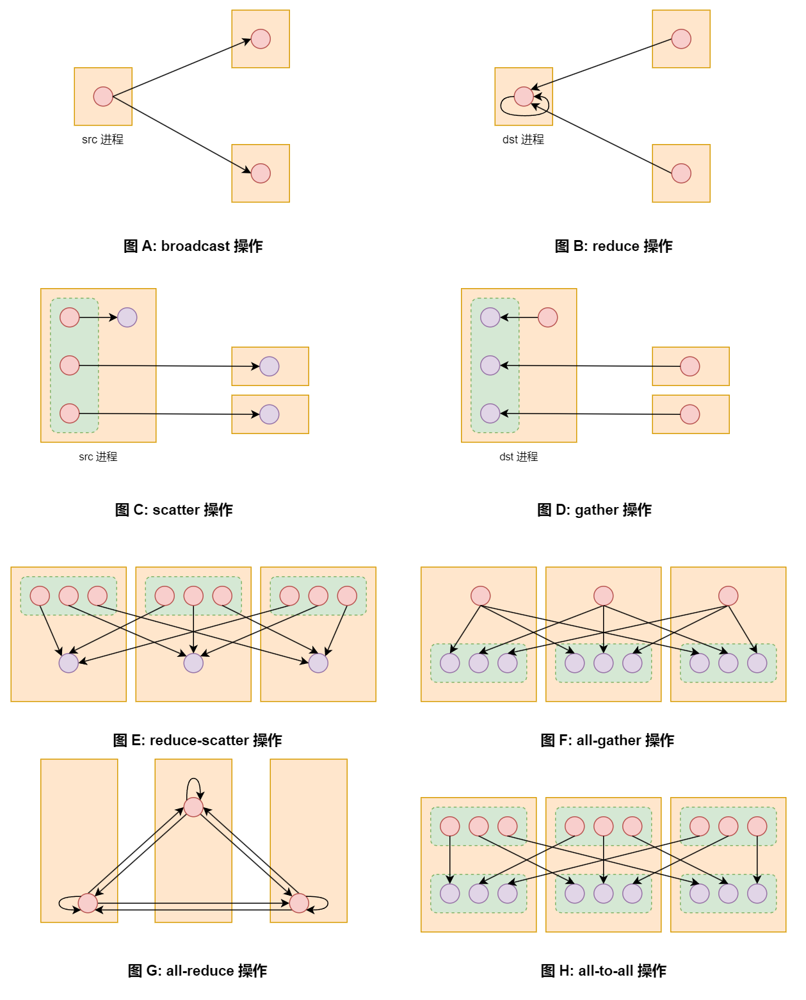
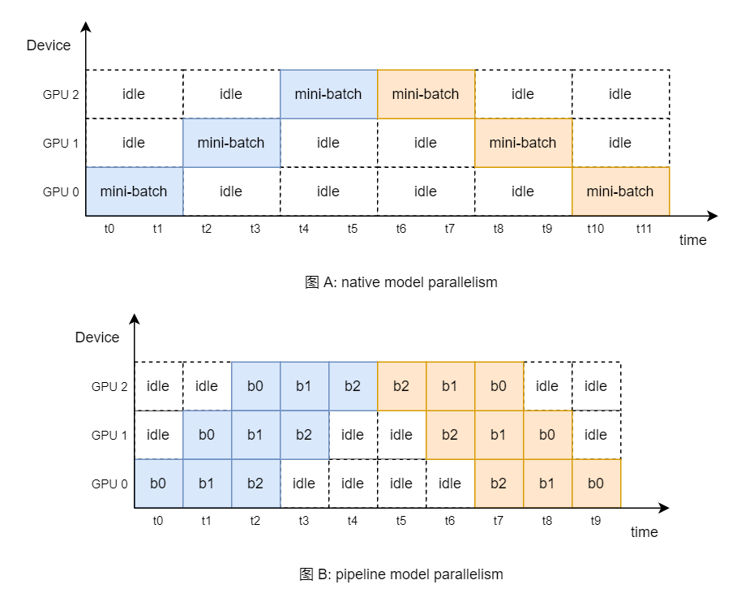
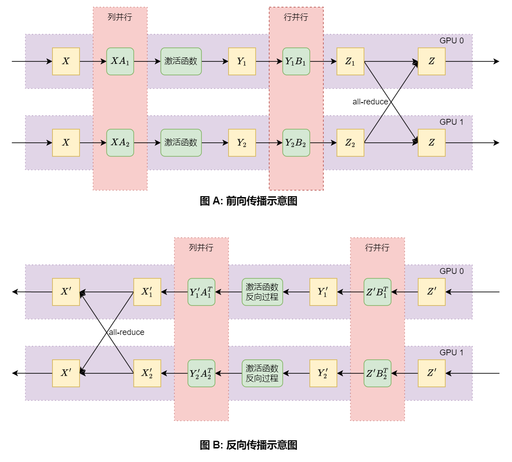
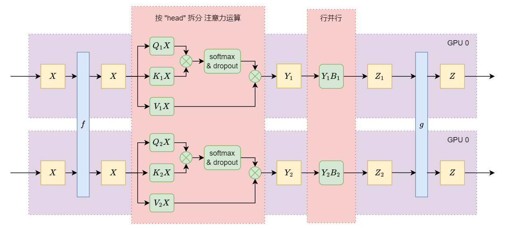
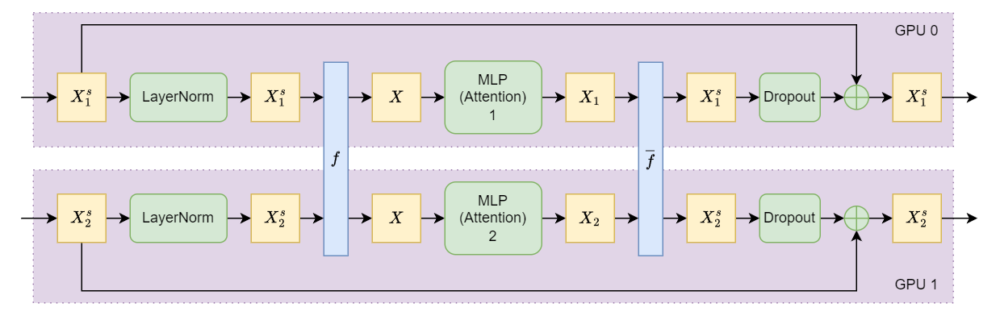

# 分布式训练 简介

[TOC]

## 一、背景介绍

目前, 深度学习 处于 "大模型时代", 就算是最小的模型, 也有 60 - 70 亿的参数量。OpenAI 的 GPT-3 有 1,750 亿的参数量, Google 的 PaLM 有 5,200 亿的参数量, Switch Transformer 则有 1.6 万亿的参数量。在这种情况下, 大模型必须采取 多机多卡, 也就是 分布式 的方式进行训练。本文简单介绍一下 分布式训练 相关的知识。

### 1.1 分布式计算

分布式训练 属于 分布式计算 的一部分。而 分布式计算 主要解决的问题是: 如何在有限的 "资源" 内进行大规模数据计算? (有限的 "资源" 主要指有限的时间和内存)。目前主流的框架是 Jeff Dean 于 2004 年提出 [MapReduce](https://static.googleusercontent.com/media/research.google.com/zh-CN//archive/mapreduce-osdi04.pdf) 架构。Hadoop 和 Spark 的 分布式计算 部分都是基于此实现的。

同时, 分布式训练 并不是 "大模型时代" 才有的需求, 在 统计机器学习 时期, 就已经有相关的需求了。

在 统计机器学习 时期, 特征工程 是非常重要的一个任务, 其直接决定了模型预测的效果。一些算法, 比如说 结构化感知机, 稀疏逻辑回归 等等, 可以构建大量的 输入特征。在训练数据量较大, 或者统计假设宽泛的情况下, 输入特征 的个数可以达到 $10^9$ (十亿) ~ $10^{12}$ (万亿) 的规模。

举例来说, 对于 中文 NLP 任务, 如果我们构建 1-gram 模型, 只有几千个输入特征 (单字成特征, 常用的汉字只有 2000 多个); 如果我们构建 2-gram 模型, 可能就有十万级别的输入特征; 如果我们构建 4-gram, 甚至 5-gram, 就可能达到 千万级别 甚至 上亿 的输入特征 (当然, 这不绝对, 和数据集的大小, 以及 最低词频 和 最高词频 的设置有关系)。

一般情况下, 单个 输入特征 有 1 - 3 个模型参数, 那么我们可以认为 模型参数 和 输入特征 是同等规模的。因此, 此时的模型参数量是非常巨大的。虽然我们构建了大量的 输入特征, 但是单个样本的 输入特征 并不是很多 (或者说单个样本特征值绝大部分为 0), 因此我们可以采用 稀疏化策略 (KV 架构), 那么 计算量非常的小。

总结一下, 在 统计机器学习 时期, 分布式训练 的背景是: 训练数据量大, 模型的参数量大, 单个样本的计算量小。在这种情况下, 诞生了很多工作。比较出名的有 李沐 大佬在 2014 年提出的第三代 [Parameter Server](https://www.cs.cmu.edu/~muli/file/parameter_server_osdi14.pdf), 他成功用约十万个 CPU Core 训练了百亿参数量的 LDA 模型。其开源的 [ps-lite](https://github.com/dmlc/ps-lite) 也广泛用于很多大厂的推荐系统中。

而在 深度学习 领域, 早期有 Jeff Dean 于 2012 年提出的 [DistBelief](https://proceedings.neurips.cc/paper_files/paper/2012/file/6aca97005c68f1206823815f66102863-Paper.pdf) 分布式架构, 其是 TensorFlow 的前身。然而, 在当时, 分布式计算 并不是 深度学习 最迫切的需求, 因此 DistBelief 一直都不是很出名。深度学习 真正迫切的需求是: GPU 加速计算。直到 "大模型时代" 的到来。

在 "大模型时代", 模型的规模至少也是 十亿 级别的 (6B/7B 的模型), 和大型的统计模型参数量是相当的。但是, 我们的需求发生了很大的变化, 那就是单个样本的计算量非常之大, 大到需要用 GPU 才能完成。同时, 每一个 GPU 的显存是有限的, 一般是 80GB 或者 192GB。本文主要是介绍这种情况下的 分布式训练 策略。

### 1.2 梯度检查点 & 梯度累加

节约显存的技术主要有三种: **梯度检查点** (gradient checkpointing), **梯度累加** (gradient accumulation) 和 **混合精度训练** (Mixed Precision Training)。这三种方式在 大模型时代 也是经常用的技术, 一般和 分布式训练 配合使用。前两种方式和本文的关联性较大, 这里重点介绍一下。

首先, 需要说明的是, 在深度学习中, checkpoint 主要指的是在训练过程中保存的模型状态, 方便我们选取最优的模型, 以及恢复训练。这对于大模型的训练非常重要, 分布式 checkpoint 可以参考 [torch.distributed.checkpoint](https://pytorch.org/docs/stable/distributed.checkpoint.html) 文档。

然后, **梯度检查点** (gradient checkpointing) 是一个模型训练的技巧, 和刚刚所说的 checkpoint 没有关系。它还有另外两个名称: 激活值检查点 (activation checkpointing) 和 激活值重算 (activation recomputation)。

在进行模型训练时, 显存消耗分为几个部分: 模型参数, 参数梯度值, 优化器状态 (动量 和 方差) 以及 **激活值**。其中, 绝大部分的显存都被 **激活值** 占用了。**激活值** 主要用于反向传播时 梯度的计算, 在梯度计算完成后, 就可以丢弃了。其占用的空间和 batch_size 的大小, 算子融合程度 都有关系。**梯度检查点** 就是用来解决 **激活值** 显存占用过大的问题。

我们可以将模型的任意部分 $m$ 用 [torch.utils.checkpoint](https://pytorch.org/docs/stable/checkpoint.html) 封装。这样, 在前向传播时, $m$ 部分的 **激活值** 都不会保存, 和 `torch.no_grad()` 模式下运行的没有区别。在反向传播时, 我们会重新计算 $m$ 部分的 **激活值**, 再进行 $m$ 部分参数梯度值的计算, 这样就可以节省相当大的显存空间。

需要注意的是, 在前向传播时, 我们需要额外保存一个东西: RNG (random number generator) 状态, 以保证前向传播和反向传播时 Dropout 层 mask 的位置相同。相较于 $m$ 部分的 **激活值**, RNG 状态占用的内存可以忽略不计。

在 Transformer 架构中, 一个 Layer 由一个 Attention 层加一个 MLP 层构成。一般情况下, 我们对每一个 Layer 进行 **梯度检查点** 的封装。其虽然可以节省大量的显存, 但是会大幅度增加运算时间。于是, nvidia 在其 [论文](https://arxiv.org/abs/2205.05198) 中提出两种方式:

一种是 selective activation checkpointing。作者通过大量的分析发现, 在 Transformer 中, **attention 运算** 部分的 **激活值** 占用的显存大, 同时计算速度快。因此, 我们可以不对每一个 Layer 设置 **梯度检查点**, 仅仅对 **attention 运算** 部分设置 **梯度检查点**, 这样可以在 运算时间 和 显存占用 上取得平衡点。

一种是 skip activation checkpointing, 即在显存允许的情况下, 部分 layer 不设置 **梯度检查点**。

需要注意的是, 一般情况下, 上面两种方式不会混用。

除此之外, 还有 CPU offloading 策略, 即将 **激活值** 保存到 主机内存 中, 而非 设备内存 中。

常见的大模型训练框架, 如 DeepSpeed, Megatron-LM, 基本上都有针对 **梯度检查点** 的优化, 甚至于还会优化 PyTorch 的内存管理。

接下来是 **梯度累加**, 其原理在 [重构 MLP (DNN) 神经网络知识体系](https://zhuanlan.zhihu.com/p/676212963) 中说过, 即 不同样本 的 模型参数梯度 是 **取平均** 的关系。我们可以在计算 loss 时直接除以样本个数, 也可以分开计算每一个样本的 模型参数梯度, 再取平均。在 PyTorch 中, 如果进行多次反向传播, 模型参数的梯度会叠加在一起。

这样, 我们可以将一个大的 mini-batch 拆成 $k$ 个 macro-batch, 每一个 macro-batch 在分别进行前向传播和反向传播运算。当 $k$ 次反向传播运算完成后, 再更新参数。这样和直接用 mini-batch 效果是一致的。需要注意的是, 每一个 macro-batch 计算出来的 loss 值要除以 $k$。

**梯度累加** 可以有效的减少显存的消耗, 尤其是 **激活值** 部分的显存 (因为 batch_size 降低了), 但是训练时间会大幅度地增加。**梯度累加** 的原理一定要理解, 后面的 **数据并行** 和 **流水线并行** 使用了相同的原理。

最后需要说明的是, **梯度检查点** 和 `BatchNorm` 配合使用是有问题的。在 PyTorch 中, `BatchNorm` 的 `running_mean` 和 `running_var` 是在 forward 阶段就更新的, 这意味着, 如果使用 **梯度检查点** 进行封装, `running_mean` 和 `running_var` 会更新两次, 具体可以看 [Checkpoint with BatchNorm running averages](https://discuss.pytorch.org/t/checkpoint-with-batchnorm-running-averages/17738)。解决办法是: **梯度检查点** 封装的模块中不要包含 `BatchNorm` 层。

不仅如此, **梯度累加** 和 `BatchNorm` 配合使用也是有问题的, 那就是没有办法统计整个 mini-batch 的 `mean` 和 `var`。这是一个无解的问题, 我们只能让 macro-batch 中的样本尽可能地多 (或者说 $k$ 值尽可能地小), 以缓解这一问题。

本文主要针对的是 Transformer 架构, 其使用 `LayerNorm`, 因此 `BatchNorm` 的问题不在考虑范围内, 这里仅仅是提醒。

## 二、PyTorch 分布式简介

### 2.1 整体概述

在 AI 分布式系统中, 一般情况下是一个 GPU 设备对应一个 进程。在一个 计算机节点 上, 如果有 8 个 GPU 设备, 那么我们就启动 8 个进程, 每一个进程负责一个 GPU 设备。因此, 在后文中, GPU 设备和 进程 的概念可能会混合使用。

在这种情况下, 进程间通信 ([IPC](https://en.wikipedia.org/wiki/Inter-process_communication)) 是一件非常重要的事情。需要注意的是, 在这里, 我们需要的不仅仅是简单的两个进程间的通信, 而是高效的多个进程间的通信, 我们一般成为 **集合通信** (collective communication)。在并行计算领域, 我们一般使用 [MPI](https://en.wikipedia.org/wiki/Message_Passing_Interface) (消息传递接口 / Message Passing Interface) 标准 来实现 **集合通信**。MPI 定义了一系列 通信操作, 以及实现这些操作高效的算法。

PyTorch 框架使用的 多进程库 就是 Python 原生的 多进程库 `multiprocessing`, 并对其进行了一定程度的修改, 封装在 `torch.multiprocessing` 中, 接口都是差不多的, 可以直接套用。同时, PyTorch 用 C++ 自己实现了一套 **集合通信** 的库, 称为 `c10d`, 主要使用 [Gloo](https://github.com/facebookincubator/gloo) 和 [NCCL](https://github.com/NVIDIA/nccl) 作为后端。Gloo 主要用于 CPU 之间的数据传输, NCCL 主要用于 GPU 之间的数据传输。

`c10d` 库的相关内容都封装在 `torch.distributed` 中, 后文中我们简称为 `dist`。下面我们来介绍一下里面的相关概念:

我们将需要相互通信的所有进程称为 **进程组** (Process Group), 一个 **进程组** 中的进程数称为 **world_size**, **进程组** 中每一个进程的 ID 值 (或者说 索引值) 称为 **rank**, 每一个进程在 计算机节点 上的 ID 值称为 **local_rank**。

在 PyTorch 中, 我们用 `dist.init_process_group` 将所有的进程都放入默认的进程组中, 再用 `dist.new_group` 创建局部进程组, 用于小范围进程之间的通信。这两个函数都会同步所有的进程, 即保证所有进程都执行到此处再往下执行。

多进程的启动方式有很多, 可以人工手动启动多进程, 或者用 shell 脚本批量启动多进程, 或者由 Python 程序主动启动多个 子进程, 等等。启动多进程最主要的事情就是设置 (分配) 不同进程的 **rank** 和 **local_rank** 值, 这是一个相对重复的工作。如果你使用的不是 集群系统, 一般情况下, 不同机器上的程序由人手动启动, 单个机器上的不同进程使用 PyTorch 提供的 [torchrun](https://pytorch.org/docs/stable/elastic/run.html) 指令启动。

PyTorch 提供的 启动多进程 的方式也是一直在变化的, 从最初的 `Process` 对象, 到 `spawn` 方式, 再到 `torch.distributed.launch`, 最后到现在的 `torchrun`, 慢慢地从 复杂 到 简单。如果你感兴趣, 可以几种方式都尝试对比一下, 这里就不详细介绍了。

我们可以针对不同的进程写不同的代码, 但是这样的过程过于繁琐。一般情况下, 我们都是所有进程共享同一份代码的。此时, 如果我们需要不同的进程执行不同的代码, 应该怎么办呢? 答案是根据进程的 **rank** 和 **local_rank** 值进行 `if` 语句的判断。PyTorch 提供了 `dist.get_rank()` 和 `int(os.environ["LOCAL_RANK"])`, 可以在任何地方方便地查询进程的 **rank** 值和 **local_rank** 值。同时, 也提供了 `dist.barrier()` 函数, 可以确保所有进程都进行到此处再往下执行。

除此之外, PyTorch 还提供了 `dist.get_world_size()` 函数, 可以方便地查询进程组中有多少个进程。

### 2.2 集合通信操作

下面, 让我们来看看 PyTorch 中提供的集合通信的操作, 主要的有八种:

**(1)** broadcast(tensor, src)

将 tensor 从 src 进程 发送给 进程组中的 其它进程。

示例代码如下:

```python
tensor = torch.randn(3, 4)
dist.broadcast(tensor, src=0)
```

一开始, 每一个进程都用 `torch.randn` 创建了一个随机的张量 `tensor`, 他们各不相同。调用 `dist.broadcast` 方法, rank 0 进程中的 `tensor` 张量发送给其它进程的 `tensor` 张量。最终, 后所有进程的 `tensor` 张量都和 rank 0 进程中的一致了。

**(2)** all_reduce(tensor, op)

将所有进程的 tensor 进行 reduce 操作, 结果保存在所有进程中。op 表示具体的 reduce 操作, 包括 sum, max, min, avg 等等。

示例代码如下:

```python
tensor = torch.randn(3, 4)
dist.all_reduce(tensor, op=dist.ReduceOp.SUM)
```

一开始, 每一个进程都用 `torch.randn` 创建了一个随机的张量 `tensor`, 他们各不相同。调用 `dist.all_reduce` 方法, 将所有进程中的 `tensor` 逐位相加, 最终所有进程的 `tensor` 都是一致的。

all-reduce 操作是分布式运算中很出名的操作, 经典的实现算法包括: ring all-reduce 和 tree all-reduce。有兴趣的可以去搜索相关的概念。

**(3)** reduce(tensor, dst, op)

将所有进程的 tensor 进行 reduce 操作, 结果保存在 dst 进程中。op 表示具体的 reduce 操作, 包括 sum, max, min, avg 等等。

示例代码如下:

```python
tensor = torch.randn(3, 4)
dist.reduce(tensor, dst=0, op=dist.ReduceOp.MAX)
```

一开始, 每一个进程都用 `torch.randn` 创建了一个随机的张量 `tensor`, 他们各不相同。调用 `dist.reduce` 方法, 将所有进程中的 `tensor` 逐位取最大值, 结果保存在 rank 0 进程中。需要注意的是, 除了 rank 0 外, 其它进程的 `tensor` 是不可以再使用的, 因为值发生了变化 (和 `reduce` 具体实现的方式有关系)。

**(4)** all_gather(tensor_list, tensor)

将所有进程的 tensor 收集起来, 按照进程的 rank 顺序, 存放在 tensor_list 中, 结果保存在每一个进程中。需要注意的是, tensor_list 中的张量个数必须和 world_size 是一致的, 每一个张量的 shape 必须和 tensor 的 shape 是一致的。

示例代码如下:

```python
tensor = torch.ones(2) * (dist.get_rank() + 1) 
tensor_list = [torch.zeros(2) for _ in range(dist.get_world_size())]

dist.all_gather(tensor_list, tensor)
```

**(5)** gather(tensor, gather_list, dst)

将所有进程的 tensor 收集起来, 按照进程的 rank 顺序, 存放在 gather_list 中, 结果保存在 dst 进程中。需要注意的是, tensor_list 中的张量个数必须和 world_size 是一致的, 每一个张量的 shape 必须和 tensor 的 shape 是一致的。还需要注意, 除了 dst 进程外, 其它进程的 gather_list 必须为 None, 否则会报错。

示例代码如下:

```python
DST_RANK = 0

tensor = torch.ones(2) * (dist.get_rank() + 1) 
gather_list = [torch.zeros(2) for _ in range(dist.get_world_size())]

if dist.get_rank() == DST_RANK:
    dist.gather(tensor, gather_list, dst=DST_RANK)
else:
    dist.gather(tensor, None, dst=DST_RANK)
```

**(6)** scatter(tensor, scatter_list, src):

将 src 进程中的 scatter_list 分发给其它进程, 存放在 tensor 中, 分发顺序和进程的 rank 顺序保存一致。需要注意的是, scatter_list 中的张量个数必须和 world_size 是一致的, 每一个张量的 shape 必须和 tensor 的 shape 是一致的。还需要注意, 除了 src 进程外, 其它进程的 scatter_list 必须为 None, 否则会报错。

示例代码如下:

```python
SRC_RANK = 0

tensor = torch.zeros(2)
scatter_list = [torch.ones(2) * (i + 1) for i in range(dist.get_world_size())]

if dist.get_rank() == SRC_RANK:
    dist.scatter(tensor, scatter_list, src=SRC_RANK)
else:
    dist.scatter(tensor, None, src=SRC_RANK)
```

**(7)** reduce_scatter(output, input_list, op)

将 input_list 中的每一个张量进行进程间的 reduce 操作, 再分发给每一个进程的 output 张量中。input_list 中的张量个数和 world_size 是一致的, 每一个张量的 shape 必须和 output 的 shape 一致。

示例代码如下:

```python
output = torch.zeros(2, 3).to(device)
input_list = [torch.randn(2, 3).to(device) for _ in range(dist.get_world_size())]

dist.reduce_scatter(output, input_list, op=dist.ReduceOp.AVG)
```

经过 reduce-scatter 后, 每一个进程中的 output 张量对应 input_list 中一个张量 reduce 操作后的结果。我们可以将其理解为 for 循环的 reduce, 因此上述代码等价于:

```python
input_list = [torch.randn(2, 3).to(device) for _ in range(dist.get_world_size())]

for dst, tensor in enumerate(input_list):
    tensor = tensor.clone()
    dist.reduce(tensor, dst=dst, op=dist.ReduceOp.AVG)
    if dist.get_rank() == dst:
        output = tensor 
```

**(8)** all_to_all(output_tensor_list, input_tensor_list)

将所有进程中 input_tensor_list 的第一个张量都保存在 rank 0 进程的 output_tensor_list 中; 将所有进程中 input_tensor_list 的第二个张量都保存在 rank 1 进程的 output_tensor_list 中, 以此类推。input_tensor_list 和 output_tensor_list 中的张量个数和 world_size 是一致的。

示例代码如下:

```python

input_tensor_list = [torch.randn(2, 3).to(device) for _ in range(dist.get_world_size())]
output_tensor_list = [torch.zeros(2, 3).to(device) for _ in range(dist.get_world_size())]

dist.all_to_all(output_tensor_list, input_tensor_list)
```

all-to-all 操作可以理解为 for 循环的 gather, 因此上述代码等价于:

```python
input_tensor_list = [torch.randn(5).to(device) for _ in range(world_size)]

for dst, tensor in enumerate(input_tensor_list):
    tensor = tensor.clone()

    if dist.get_rank() == dst:
        gather_list = [torch.zeros(5).to(device) for _ in range(world_size)]
        dist.gather(tensor, gather_list, dst=dst)
        output_tensor_list = gather_list
    else:
        dist.gather(tensor, None, dst=dst)
```

总结一下, 八种操作核心的有四种: broadcast, reduce, scatter 和 gather。其中, reduce 又扩展出两种: all-reduce 和 reduce-scatter; gather 又扩展出两种: all-gather 和 all-to-all。我们可以用下图辅助理解:



在上图中, 圆圈表示的是 张量, 红色的圆圈表示已有的张量, 紫色的圆圈表示新创建的张量, 绿色的圆角虚线方框表示列表, 橙色的方框表示进程。如果一个张量只有单个指向箭头, 那么属于张量的 copy 操作; 如果一个张量有多个指向箭头, 那就是 多个张量 reduce 成一个 张量。

这八种操作是支持反向传播的。同时, PyTorch 还对它们进行了额外的封装, 存在于 `dist.nn.functional` 中, 使用起来更加方便。如果你对 反向传播 熟悉的话, 观察上图, 应该就能得到: broadcast 和 reduce 之间互为 反向运算; scatter 和 gather 之间互为 反向运算; all-gather 和 reduce-scatter 之间互为 反向运算; all-reduce 和其本身互为 反向运算; all-to-all 和其本身互为 反向运算。

上面所说的八种操作都是可以指定具体的进程组的, 通过 group 参数指定。同时, 也是支持 **异步**, 指定 `async_op=True`, 此时返回 `Work` 对象, 我们调用 `Work` 对象的 `wait()` 方法, 就可以确保计算完成了。

**集合通信** 的一个特点是: 所有进程的代码几乎都是相同的。在上面, 除了 gather 和 scatter 操作, 其它操作所有进程的代码相同, 不需要进行 **rank** 值的判断。gather/scatter 操作 dst/src 进程和其它进程相比只有一个参数的差别。

因此, 在阅读 分布式训练 的代码时, 需要注意, 是一个进程组在执行相关的代码, 而不是简单的顺序执行!

### 2.3 点到点通信

除了 **集合通信** 外, 还有 **点到点通信**, 即两个进程之间的通信。和 **集合通信** 不同的是, **点到点通信** 不同进程之间的代码相差较大, 控制力度也更高。当然, 你可以基于 **点到点通信** 来实现 **集合通信**。

在 **点到点通信** 中, `dist.send` 和 `dist.recv` 是一组操作。src 进程调用 `dist.send` 方法, dst 进程调用 `dist.recv` 方法, 这样数据就可以从 src 进程发送到 dst 进程中。如果希望是异步操作, 则使用 `dist.isend` 和 `dist.irecv` 方法。如果希望进行批量的点到点数据传输, 可以使用 `dist.P2POp` 和 `dist.batch_isend_irecv` 方法实现。

在 分布式系统 中, 我们经常会有这样的需求: main 进程向 worker 进程发送计算任务, worker 进程执行完成后再汇总到 main 进程上。[RPC](https://en.wikipedia.org/wiki/Remote_procedure_call) (Remote Procedure Call) 协议就是实现这样的需求的: main 进程让 worker 进程运行某一个函数, 并将函数的参数发送给 worker 进程; worker 进程执行完成后, 将计算结果发送给 main 进程。整个过程和调用本地函数差不多, IPC 相关的内容都被封装在 底层 了。

RPC 属于典型的 **点到点通信**, 即 main 进程和 worker 进程之间的通信。PyTorch 中实现了 RPC 协议, 封装在 `dist.rpc` 中, 使用 [tensorpipe](https://github.com/pytorch/tensorpipe) 作为其后端。然而, 很可惜的是, 目前 PyTorch 中 RPC 的部分几乎处于没有人维护的状态, tensorpipe 项目也停止了更新, 关于 RPC 部分的教程也已经过时了。不知道为什么会变成这样, 希望之后 PyTorch 团队能重新开始维护相关内容吧。

## 三、数据并行

多卡训练的关键是将一个 大的计算任务 拆分成多个 小的计算任务。那么, 最简单的拆分方式是: 沿着 batch 的维度进行拆分。如果我们有 $k$ 个 GPU 设备, 那么我们可以将一个 mini-batch 拆分成 $k$ 个 macro-batch, 每一个 GPU 设备处理一个 macro-batch, 然后将不同 GPU 设备计算出来的梯度取平均即可。这种思想和 1.2 节所说的 **梯度累加** 是一致的。

在 PyTorch 中, 作者提供了两种数据并行的方式, 一种是 **多线程数据并行** [DataParallel](https://pytorch.org/docs/stable/generated/torch.nn.DataParallel.html), 我们简称为 DP; 一种是 **多进程数据并行** [DistributedDataParallel](https://pytorch.org/docs/stable/generated/torch.nn.parallel.DistributedDataParallel.html), 我们简称为 DDP。和其它分布式内容不同的是, DP 和 DDP 存在于 `torch.nn.parallel` 目录夹下, 不存在于 `torch.distributed` 目录夹下。

我们知道, 线程是进程中的概念, 我们无法跨机器使用线程, 而分布式的核心就是要跨机器。因此在分布式运算中, 我们主要研究的是 多进程并行, 而 非多线程并行。在这里, DP 仅仅适用于 **单机多卡** 的情况, 而 **多机多卡** 的情况下必须使用 DDP。

相较于 DDP, DP 的优点是: 代码的修改程度低, 使用的灵活性高。但是, DP 有一个致命的缺点: 在模型训练的过程中, DP 的数据传输量比 DDP 多一倍。因此, 官方文档给出的建议是: **单机多卡** 的情况下使用 DDP, 而非 DP。

为了知识体系的完整性, 这里 DP 和 DDP 都会介绍。下面, 让我们来看看这两种方式:

### 3.1 多线程数据并行 DP

DP 采用的是 Python 中原生的线程库 [threading](https://docs.python.org/3/library/threading.html) 实现的, 并且封装成 `nn.DataParallel` 类, 属于 `nn.Module` 的子类。使用起来非常简单, 我们只需要将神经网络用 `nn.DataParallel` 封装起来就可以了, 其它的代码基本上不需要修改。同时, DP 的灵活性也很高, 我们可以对任意部分的神经网络 $m$ 用 `nn.DataParallel` 封装, 此时并行化的部分只有 $m$。

在 DP 中, 我们需要将一个 GPU 设置为 **主设备**, 然后 模型参数 和 输入张量 都加载到 **主设备** 中, 剩下的工作都由 `nn.DataParallel` 完成。下面, 让我们看看 DP 的实现方式。

DP 前向传播的思路如下:

1. 将 模型参数 从 主设备 上 broadcast 到 其它设备 上
2. 将 输入张量 从 主设备 上 scatter 到 其它设备 上
3. 使用 多线程 的方式进行并行化运算
4. 将 每一个设备 上的计算结果 gather 到 主设备 上, 得到 输出张量

从上面可以看出, 得到的 输出张量 在 主设备 之上, 我们可以让 输出张量 参与后续的计算 (比方说 loss 值计算)。

DP 反向传播的思路如下:

1. 将 输出梯度张量 从 主设备 scatter 到 其它设备 上
2. 使用 多线程 的方式进行并行化运算 (计算图中隐式实现的)
3. 将 每一个设备 上的计算结果 gather 到 主设备 上, 得到 输入梯度张量
4. 将 模型参数梯度 从 其它设备 上 reduce-add 到 主设备 上

上述过程完成后, 模型的参数梯度都在 **主设备** 上, 我们只需要更新 **主设备** 的模型参数。下一次迭代时, 模型参数还是由 **主设备** 往其它设备上 broadcast, 整个思路非常的清晰。

需要注意的是, DP 中的 broadcast, scatter, gather, reduce-add 操作不能使用 `dist` 中的操作, 它们的实现位于 `torch.nn.parallel._functions` 中, 有兴趣的可以自行查看。

### 3.2 多进程数据并行 DDP

DP 的通信量主要集中在模型参数的 broadcast 和模型参数梯度的 reduce-add 上面 (激活值 的通信可以忽略不计), 这个量是非常巨大的。同时, DP 的 GPU 使用率不高, 在 参数更新 阶段, 除了 **主设备** 之外, 其它设备都处于空置状态。

DDP 采用多进程的方式, 增加了 GPU 的使用率, 减少了数据的通信量。整体的思路如下:

1. 假设我们有 $k$ 张 GPU 设备, 那么我们就启动 $k$ 个进程, 每一个进程都初始化一份参数模型, 放在对应的 GPU 设备上, 并保证所有进程的 模型参数 是一致的。
2. 每一个进程读取不同的 macro-batch 数据, 进行前向传播和反向传播, 计算各自的梯度。
3. 对所有进程的 模型参数梯度 进行 all-reduce 操作, 取平均值。这样, 所有进程的 模型参数梯度 是一致的。
4. 每一个进程进行参数更新, 由于初始的模型参数是一致的, 模型参数梯度也是一致的, 那么更新完成后所有进程的 模型参数 也应该是一致的。
5. 反复执行 2 - 4 步, 直至收敛。

可以看出, 在一次迭代中, DDP 的数据通信只有第 4 步的 参数梯度 all-reduce 操作, 不需要再进行 模型参数 的 broadcast 操作, 大大降低了数据通信的成本。同时, 每一个 GPU 都会进行 前向传播, 反向传播, 参数更新 的操作, 没有空置状态。我们可以这样说, 相较于 DP, 我们让每一个 GPU 进行重复的 参数更新 操作, 减少了 模型参数 broadcast 这一次通信操作! 这样做的好处是 并行效率 大幅度提高。也正是因为此, PyTorch 官方不推荐使用 DP, 建议一律都使用 DDP。

在实现时, 需要对原始代码做以下的更改:

1. 模型中有 可训练参数 的部分必须用 `DistributedDataParallel` 类封装, 其主要有两个作用:
    + 在初始化时, 模型参数会从 rank 0 进程 broadcast 到其它进程中, 以确保所有进程的模型参数相同
    + 在每一次迭代的过程中, 反向传播后, 会自动进行 模型参数梯度 的 all-reduce 操作
2. 模型中有 `BatchNorm` 层的, 都需要转换成 `SyncBatchNorm` 层, 统计量会自动同步
3. 数据加载需要 `DistributedSampler` 采样器, 确保在一个 epoch 内不同进程不会读取到相同的数据
4. 每一个 epoch 开始之前, 需要调用 sampler 的 `set_epoch` 方法, 确保每一个 epoch 的随机数种子不一致

整体来说, 上述的改动量并不是很大。真正麻烦的是某些操作只能由单个进程完成, 比方说: 下载数据集, 保存模型, 保存 checkpoint, 测试验证集的效果, 输出日志 等等。在写 DDP 代码时, 这些才是需要想清楚的内容。

最后, 说一点额外的话题, 不了解的可以忽略。我最初了解 DDP 不是因为 大模型, 而是因为 **对比学习**。

在 **对比学习** 中, 我们一般采用 InfoNCE Loss 的方式来训练模型。此时, 我们希望 batch_size 越大越好, 很多工作里面设置成 4096 或者 8192, 有一些工作甚至还设置成 16384。对于大 batch_size 来说, DDP 是一种很好的训练方式, 何凯明的 [MoCo](https://github.com/facebookresearch/moco) 就是基于此实现的。

和一般模型不同的是: 在计算 loss 之前, 我们需要将所有 **样本向量** all-gather 到每一个 GPU 设备中。如果使用 queue 作为负样本, all-gather **样本向量** 时不需要梯度; 如果使用 batch 中的其它样本作为负样本, all-gather **样本向量** 时需要梯度。在理解 **对比学习** 的前提下, 这个可以说是最简单的 模型并行 了。

### 3.3 ZeRO 数据并行

DDP 的问题是, 每一个 GPU 设备都需要进行相同的 参数更新 操作, 这是一个 冗余 的操作。有没有办法减少 冗余 的操作呢? 微软 提出的 [ZeRO](https://arxiv.org/abs/1910.02054) 就是来解决这一问题的, 其包含三种优化策略, 我们分别称为 stage1, stage2 和 stage3。下面, 让我们来看看这三种策略。

整体的思想如下: 由于我们有 $k$ 个 GPU 设备, 我们可以将模型参数分成 $k$ 份, 每个 GPU 设备负责一部分的模型参数更新, 更新完成后对模型参数进行 all-gather 操作, 同步到所有 GPU 设备中即可。

stage1 策略流程如下:

1. 假设我们有 $k$ 张 GPU 设备, 那么我们就启动 $k$ 个进程, 每一个进程都初始化一份参数模型, 放在对应的 GPU 设备上, 并保证所有进程的 模型参数 是一致的
2. 我们将模型参数也分成 $k$ 份, 每一个进程负责其中一份参数的更新
3. 每一个进程读取不同的 macro-batch 数据, 进行前向传播和反向传播, 计算各自的 模型参数梯度
4. 我们对 模型参数梯度 进行 reduce-scatter 操作, 分发到不同的 GPU 设备中
5. 每一个进程 只更新 一部分 模型参数
6. 更新完成后, all-gather 所有进程的模型参数, 此时所有进程的模型参数应该是一致的
7. 重复 3 - 6 步, 直至收敛

从上面可以看出, 一个进程只负责一部分模型参数的更新, 这样更新时的计算量变小了, 运算时间也就缩短了。同时, 每一个 GPU 设备只需要存储和其相关的 模型参数 优化器状态, 不需要存储整个 模型参数 优化器状态, 那么可以节约相当一部分显存。

如果对整体流程还有疑问的话, 可以参考 [视频](https://www.microsoft.com/en-us/research/video/zero-fastest-bert-increasing-the-scale-and-speed-of-deep-learning-training-in-deepspeed/) 的 31:10 - 33:45 部分, 里面包含演示动画。

和 DDP 相比, 计算量降低, 显存降低, 但是通信量上升了。一个 all-reduce 通信操作变成了 reduce-scatter 和 all-gather 通信操作。此时, 并行效率是否提升 和 模型的大小 以及 硬件设施 有很大关系, 并不容易做比较。

stage1 已经做到了模型参数的零冗余更新, 但是还有优化空间, 那就是 stage2。

相较于 stage1, stage2 的核心思想是: 让 反向传播过程 和 reduce-scatter 通信操作异步执行! 整体的流程如下:

1. 假设我们有 $k$ 张 GPU 设备, 那么我们就启动 $k$ 个进程, 每一个进程都初始化一份参数模型, 放在对应的 GPU 设备上, 并保证所有进程的 模型参数 是一致的
2. 我们将模型参数也分成 $k$ 份, 每一个进程负责其中一份参数的更新
3. 每一个进程读取不同的 macro-batch 数据, 进行前向传播, 计算 loss
4. 在反向传播时, 我们先计算第 $k$ 部分模型参数的梯度
5. 将 $k$ 部分模型参数梯度 reduce 到 $k$ 设备上, 并异步计算 $k-1$ 部分的模型参数梯度
6. 两个任务完成后, 除了第 $k$ 个 GPU 设备, 其它设备释放第 $k$ 部分 模型参数梯度 的内存
7. 重复执行 5 - 6 步, 完成反向传播运算后, 每一个 GPU 设备都有对应的模型参数梯度
8. 每一个进程 只更新 一部分 模型参数
9. 更新完成后, all-gather 所有进程的模型参数, 此时所有进程的模型参数应该是一致的
10. 重复 3 - 10 步, 直至收敛

从上面可以看出, stage2 将 反向传播过程 拆分成 $k$ 部分, 同时将 reduce-scatter 操作也拆成 $k$ 个 reduce 操作。这样, 我们就可以异步执行了。理论上说, 通信量没有增加, 并行效率 提高了很多。

stage3 是一个极致省显存的策略, 我们将模型分成 $k$ 份后, 每个 GPU 设备只存储其中一份模型参数, 其它的模型参数都不存储。在前向传播时, 如果需要的模型参数没有, 就从其它地方拉取相关的模型参数, 进行计算, 计算完成后就释放内存, 主打一个 "即用即取"。反向传播 和 参数更新 的部分和 stage2 是一致的。

如果对此有疑问, 可以参考这个 [视频](https://www.youtube.com/watch?v=by86GQhKgKQ), 其完成的展示了 混合精度训练, 梯度检查点 和 ZeRO stage3 三种技术混用后的训练动画, 不过有些过于繁琐了。

ZeRO 的核心思想是每个 GPU 设备维护一部分的模型参数。微软官方的说法是, stage1 拆分了 优化器状态, stage2 进一步拆分了 梯度, 而 stage3 更进一步拆分了 模型参数。从 stage1 到 stage3, 拆分的内容越来越多, 显存消耗越来越少, 是一个递进的关系。

一般情况下, 我们只会使用 stage1 或者 stage2 进行模型训练, 不会使用 stage3 进行模型训练。因为 stage3 的通信量增加的太多了。PyTorch 中专门针对 stage3 实现了 [FSDP](https://pytorch.org/docs/stable/fsdp.html), 有兴趣的可以了解一下。

需要注意的是, stage2 的思想和一些经典的算法思想是相似的, 一定要理解! 在条件允许的情况下, 我们可以将 ZeRO stage2 作为 数据并行 的最优方案。

## 四、模型并行 (一) "横着" 分块

在不考虑 ZeRO stage3 的情况下, 数据并行的最低要求是模型参数能加载到单张 GPU 设备中。

GPT-3 有 $175 \times 10^9$ 个参数, 假设我们使用 FP16 加载到内存中 (也就是说一个参数占两个字节), 那么需要 $350 \times 10^9$ 个字节, 也就是 350 GB 的显存空间。然而, 一个 A100 显卡才 80GB 的显存空间, 即使是最新的 B200 显卡也才 192GB。更不用说还需要空间存放 梯度值, 优化器状态 和 激活值。

在这种情况下, 我们只能选择 ZeRO stage3, 或者采取 **模型并行** 的方式。

**模型并行** 是对 整个模型 进行切分, 放在不同的 GPU 设备, 以方便进行分布式训练。那么, 我们应该如何切分模型呢?

需要注意的是, 不同的模型架构切分方式不一样, 下面所说的主要针对 Transformer 架构的模型, 不一定适用于其它架构的模型。

### 4.1 流水线并行 Pipeline Parallelism

对模型最简单的切分方式是按照层切分, 不同层之间按照顺序执行, 即当前层的输入是前一层的输出。在 Transformer 架构中, 我们可以按照 Transformer Layer 进行切分, 一个 Transformer Layer 包含一个 Attention Layer 和一个 MLP Layer。

假设我们有 $k$ 个 GPU 设备, 并且模型有 $k$ 层, 那么我们可以将一层放在一个 GPU 设备中。前向传播时从前往后依次执行, 反向传播时从后往前依次执行, 最后所有的 GPU 设备一起更新模型参数。网上很多博客将其称为 native model parallelism。

但是这种方式存在一个致命的问题, 那就是 GPU 的使用率非常低: 在 前向传播 和 反向传播 中, 当一个 GPU 在运行时, 剩下的 $k - 1$ 个 GPU 处于空置状态, 不进行计算。幸运地是, 参数更新可以并行计算, 即所有 GPU 设备在同一个时刻一起更新参数。

我们希望增加 前向传播 和 反向传播 时并行计算程度, 那么应该怎么优化呢? [GPipe](https://arxiv.org/abs/1811.06965) 中提出了 **流水线并行** (pipeline parallelism), 使用 **数据并行** 的策略增加并行计算的程度。

我们将一个 mini-batch 拆分成 $k$ 个 macro-batch。然后运算过程如下:

+ t0 时刻: macro-batch 0 在 GPU 0 上计算
+ t1 时刻: macro-batch 0 在 GPU 1 上计算, macro-batch 1 在 GPU 0 上计算
+ t2 时刻: macro-batch 0 在 GPU 2 上计算, macro-batch 1 在 GPU 1 上计算, macro-batch 2 在 GPU 0 上计算

一直这样计算下去, 直到所有 macro-batch 前向传播完成。然后使用同样的方式进行 反向传播 的计算, 计算完成后再开始更新参数。

整个过程就像工厂里的流水线一样, 如果对工厂里的流水线不了解, 可以参考 [动画](https://www.bilibili.com/video/BV1Bw41117Us/)。也正是因为此, 我们将这种方式称为 **流水线并行**。我们可以用下图辅助理解:



在上图中, 蓝色方框 表示前向传播, 橙色方框 表示反向传播, 白色虚线方框 表示空置状态, 没有进行任何运算。

观察上图, 我们很容易得到结论:

对于 native 模型并行 来说, 如果一个 mini-batch 在一个 GPU 上的运行时间是 $T_{mini}$, 那么每一个 GPU 的空置时间是 $2 (k - 1) \cdot T_{mini}$ ; 整体的运行时间是 $2 k \cdot T_{mini}$ 。

对于 **流水线并行** 来说, 如果一个 macro-batch 在一个 GPU 上的运行时间是 $T_{macro}$, 那么每一个 GPU 的空置时间是 $2 (k - 1) \cdot T_{macro}$ ; 整体的运行时间是 $2 (2k - 1) \cdot T_{macro}$ 。

也就是说, $T_{mini}$ 比 $T_{macro}$ 至少要大 $\frac{2k - 1}{k}$ 倍, **流水线并行** 才比 native 模型并行快。更宽泛地说, macro-batch 的运行速度至少要比 mini-batch 快一倍, **流水线并行** 才是有意义的。

GPU 非常擅长并行计算, 如果 mini-batch 的运行速度和 macro-batch 是相当的, 那么 **流水线并行** 的设置是没有意义的, 这一点非常重要。

## 五、模型并行 (二) "竖着" 分块

如果模型 按层切分模型, 无论使用何种策略, 那么 GPU 一定会有空置时间, 分布式训练 的并行化程度低。那么有没有其它切分方法呢? 如果我们将 按层切分模型 称为 "横着" 切模型, 那么我们可以 "竖着" 切模型吗? NVIDIA 在其 [论文](https://arxiv.org/abs/1909.08053) 和 [论文](https://arxiv.org/abs/2205.05198) 中分别提出了 **张量并行** (Tensor Parallelism) 和 **序列并行** (Sequence Parallelism), 实现了 "竖着" 切 Transformer 模型, 大大地提升了 分布式训练 的 并行化程度!

下面, 让我们来看看如何 "竖着" 切 Transformer 模型。

### 5.1 线性层切分方式

我们知道, 在不考虑 bias 的情况下, [线性层](https://pytorch.org/docs/stable/generated/torch.nn.Linear.html) 的计算公式是 $Y = X A$。其中, $A$ 是权重矩阵, 其 shape 是 `[in_features, out_features]`; $X$ 是 输入矩阵, 其 shape 是 `[batch_size, in_features]`。

**数据并行** 就是沿着矩阵 $X$ 的 batch_size 维度进行拆分。而 **模型并行** 则是要对矩阵 $A$ 进行拆分。根据 **矩阵乘法** ([Matrix multiplication](https://en.wikipedia.org/wiki/Matrix_multiplication)) 的原理, 一共有两种拆分方式:

一种是 **列并行线性层**, 即按列拆分矩阵 $A$, 或者说沿着 out_features 维度拆分。如果有 $k$ 个 GPU 设备, 那么就拆分成 $k$ 块, 我们记作:

$$
A = \begin{bmatrix} A_1 & A_2 & \cdots & A_k \end{bmatrix} \tag{5.1.1}
$$

此时, $Y = X A$ 就变成了:

$$
Y = \begin{bmatrix} X A_1 & X A_2 & \cdots & X A_k \end{bmatrix} \tag{5.1.2}
$$

另一种是 **行并行线性层**, 即按行拆分矩阵 $A$, 或者说沿着 in_features 维度拆分。如果有 $k$ 个 GPU 设备, 那么就拆分成 $k$ 块, 我们记作:

$$
\begin{bmatrix} A_1 \\ A_2 \\ \vdots \\ A_k \end{bmatrix} \tag{5.1.3}
$$

此时 输入矩阵 $X$ 也需要拆分成 $k$ 块, 我们记作:

$$
\begin{bmatrix} X_1 & X_2 & \cdots & X_k \end{bmatrix} \tag{5.1.4}
$$

那么, 我们可以得到:

$$
Y = X_1 A_1 + X_2 A_2 + \cdots + X_k A_k \tag{5.1.5}
$$

总结一下, **列并行线性层** 不需要对矩阵 $X$ 进行切分, 最终结果是 concat 到一起的; **行并行线性层** 需要对矩阵 $X$ 进行切分, 最终结果是 add 到一起的。

### 5.2 MLP 层切分方式

我们知道, MLP 层主要由 线性层 + 激活函数 + 线性层 构成。那么, 我们可以用下图的方式进行模型模型:



在上图中, 我们假设有两个 GPU, 分别是 GPU 0 和 GPU 1。一开始时, 输入张量 $X$ 在两个 GPU 设备上都存在。那么, 我们可以将 MLP 的第一个线性层用 **列并行** 的方式放在两个 GPU 设备上; 将 MLP 的第二个线性层用 **行并行** 的方式放在两个 GPU 设备上。

在前向传播时, 由于一开始 输入张量 $X$ 就存在于两个 GPU 设备上, 在进行 **列并行** 前不需要进行 broadcast 通信操作了, 直接计算就可以了。激活函数是对单个元素进行的操作, 同时没有任何参数, 因此可以和 **列并行线性层** 放在一起运算。

正常情况下, 在进行完成上述操作后, 我们需要一次 all-gather 通信将 **列并行** 的计算结果合并在一起。但是接下来是 **行并行线性层**, 需要对 输入张量 进行 scatter 操作, 两个过程正好抵消了。我们接着进行 **行并行** 计算, 计算完成后再 all-reduce 相加到一起, 作为 MLP 层的 输出张量。

一开始 输入张量 存在于两个 GPU 设备上, 计算完成后 输出张量 也存在于两个 GPU 设备上, 整个过程只用了一次 all-reduce 通信操作, 可以说非常巧妙。

反向过程则正好相反, 此时 **行并行线性层** 不需要 all-reduce 操作, **列并行线性层** 需要 all-reduce 操作。上图中已经完整的展示了计算过程。

### 5.3 Attention 层切分方式

我们知道, Attention 层由 Attention 运算 + 线性层 构成。

Attention 运算有一种非常简单的切分方式, 那就是按照 "head" 进行切分。如果有两个 GPU, 那么我们就将 "head" 分成两组, 一组放在 GPU 0 上, 一组放在 GPU 1 上, 计算完成后 concat 到一起就可以了。

有没有发现, 这种切分方式和 **列并行线性层** 的切分方式有一点非常相似: 不同 GPU 计算的结果需要 concat 在一起。由于 Attention 运算后面接着一个线性层, 那么我们可以采用 5.2 的策略, 对 Attention 层进行切分, 图示如下:



在上图中, 输入矩阵 $X$ 和 输出矩阵 $Z$ 都是存在于两个 GPU 设备上的。

$f$ 和 $g$ 表示通信操作, 前向传播 时, $f$ 是 identity 操作 (输入 和 输出 相同), $g$ 是 all-reduce 操作; 反向传播 时, $f$ 是 all-reduce 操作, $g$ 是 identity 操作。因此, 前向计算过程也是只用到了一次 all-reduce 通信操作。

### 5.4 张量并行 Tensor Parallelism

假设我们有两个 GPU 设备, 那么我们可以将 Transformer 架构中所有的 MLP 层和 Attention 层按照 5.2 节和 5.3 节所说的方式进行 "切分", 一部分放在 GPU 0 上, 一部分放在 GPU 1 上。对于不能切分的层, 比方说 `LayerNorm`, 就放在两个 GPU 设备上, 确保它们的参数在初始时刻是一致, 由两个 GPU 共同维护。

在前向传播开始时, 我们直接将 输入张量 放置到两个 GPU 设备中。前向传播 完成时, 两个 GPU 设备中的 loss 值应该是一致的。此时, 直接开始反向传播。反向传播完成后, 两个 GPU 设备中未拆分层的 参数梯度 是一致的。

我们将这种并行计算的策略称为 **张量并行**。相较于第四章中的 按层切分, **张量并行** 增加了 GPU 之间的通信, 同时也增加了 GPU 的计算效率。如果模型中有 12 个 Transformer Layer, 那么就有 24 次 all-reduce 通信。但是通信的内容主要是 **激活值**, 不涉及到 参数, 效率还是非常高的。

需要注意的是:

首先, 在 张量并行 的过程中, 我们必须保证不同 GPU 设备的随机数种子是一致的, 否则 `Dropout` 层出来的结果会不一致, 这不是我们想要的;

其次, 线性层的 bias 需要强调一下。在 **列并行线性层** 中, 我们直接拆分 bias 即可, 没有什么好说的。在 **行并行线性层** 中, bias 必须在 all-reduce 操作完成后再进行计算。因此, 我们会将 **行并行线性层** 的 bias 作为不可切分的参数来处理, 即所有 GPU 中维护相同的参数 (和 `LayerNorm` 层是一样的)。

然后, 关于 `Embedding` 层, 我们可以像 **列并行线性层** 那样拆分, 增加一次 all-reduce 操作; 也可以像 `LayerNorm` 层一样, 所有 GPU 维护相同的参数。最后的 词表分类层 也是一样的。需要注意的是, 在之前的语言模型中 (比方说 BERT 和 GPT-1), 输入 `Embedding` 层和输出 词表分类层 之间是共享参数的, 在现在的语言模型中一般都不共享了。

最后, 在 张量并行 中, 所有 GPU 共同维护的参数都是 冗余 的, 计算也是 冗余 的, 目前没有比较好的解决方案。不过问题不是特别地大, 因为冗余量都比较低。

### 5.5 序列并行 Sequence Parallelism

梯度检查点 虽然可以大幅度地降低 显存消耗, 但是却增加了 训练时间。在显存充足的情况下, 我们是不希望使用 梯度检查点 策略的。那么, 有没有什么办法可以降低 **张量并行** 时 **激活值** 的显存消耗呢? 英伟达 提出了 **序列并行** 策略。

和 **张量并行** 相比, **序列并行** 并没有改变模型参数在 GPU 上的分布, 而是将 输入张量 进行切分。如果 输入张量 的维度是 `[batch_size, seq_len, hidden_size]`, 那么我们就沿着 `seq_len` 的维度进行拆分, 整体的示意图如下:



在上图中, $X$ 表示计算过程中的输入和输出。$X_1$ 和 $X_2$ 表示 并行化 MLP / Attention 层的计算结果, 需要相加在一起。$X_1^s$ 和 $X_2^s$ 表示将 $X$ 沿着 `seq_len` 拆分成的两个张量。

$f$ 和 $\overline{f}$ 互为 反向运算, 其中 $f$ 前向传播是 all-gather 操作, 反向传播是 reduce-scatter 操作; $\overline{f}$ 前向传播是 reduce-scatter 操作, 反向传播是 all-gather 操作。

一开始, 输入张量 $X$ 的维度是 `[batch_size, seq_len, hidden_size]`, 我们拆分成两个 `[batch_size, seq_len // 2, hidden_size]` 张量, 分别放在两个 GPU 中。

在经过 MLP / Attention 层时我们时, 我们进行 all-gather 操作, 确保两个 GPU 中的 $X$ 是一致的。对于计算结果, 我们采取 reduce-scatter 操作, 确保 $X$ 依旧是按照 `seq_len` 维度进行拆分的。

其它计算层, 比方说 LayerNorm, Dropout, Add 等等, 不需要其它 GPU 中的数据, 直接计算就可以了。配合上图, 应该很容易理解。这样, 一个 GPU 只需要维护一半的激活值就可以了, 计算效率, 显存使用率都有大幅度提升。

和之前的一样, `LayerNorm` 层的参数还是由两个 GPU 共同维护。不过现在不用保证 Dropout 层 mask 的位置是一致的了, 也就不用设置随机数种子了。

按照论文中的说法, 一个 all-reduce 通信操作 等价于 一个 all-gather 通信操作和一个 reduce-scatter 通信操作, 因此通信量没有上升。

其实, 仔细想想, 将 输入张量 $X$ 沿着 batch_size 的维度进行切分也是可以的 ~~(不过这样就不容易起名字了)~~。整体的思路还是非常巧妙地。

## 六、总结 和 引用

### 6.1 总结

本文主要介绍了 DDP 数据并行, ZeRO 数据并行, 流水线并行, 张量并行 和 序列并行 五种 Transformer 架构的并行策略。目前主流的大模型框架, 如 DeepSpeed 和 Megatron-LM, 都是多种策略混合使用, 一般的思路是:

一个 Transformer Layer 内部使用 张量并行 和 序列并行; 不同 Transformer Layer 之间使用 流水线并行; 同时在整个模型的外面再套一层数据并行。

这种方式也被称为 3D parallelism, 是以 Transformer 架构为中心的 分布式训练框架 的基础。当然, 不光这些策略, 训练框架中还会集成 半精度训练, 梯度检查点, 梯度累加, CPU Offloading 等等内容。目前, 分布式训练框架 在不断完善, GPU 等硬件设施也在不断发展, 不知道 大模型 最终会走向何方。

### 6.2 引用

Papers:

+ [Training Deep Nets with Sublinear Memory Cost](https://arxiv.org/abs/1604.06174)
+ [Scaling Distributed Machine Learning with the Parameter Server](https://www.cs.cmu.edu/~muli/file/parameter_server_osdi14.pdf)
+ [Pathways: Asynchronous Distributed Dataflow for ML](https://arxiv.org/abs/2203.12533)
+ [GPipe: Efficient Training of Giant Neural Networks using Pipeline Parallelism](https://arxiv.org/abs/1811.06965)
+ [PipeDream: Fast and Efficient Pipeline Parallel DNN Training](https://arxiv.org/abs/1806.03377)
+ [Megatron-LM: Training Multi-Billion Parameter Language Models Using Model Parallelism](https://arxiv.org/abs/1909.08053)
+ [Efficient Large-Scale Language Model Training on GPU Clusters Using Megatron-LM](https://arxiv.org/abs/2104.04473)
+ [Reducing Activation Recomputation in Large Transformer Models](https://arxiv.org/abs/2205.05198)
+ [ZeRO: Memory Optimizations Toward Training Trillion Parameter Models](https://arxiv.org/abs/1910.02054)

Projects:

+ [torchgpipe](https://github.com/kakaobrain/torchgpipe)
+ [fairscale](https://github.com/facebookresearch/fairscale)
+ [DeepSpeed](https://github.com/microsoft/DeepSpeed)
+ [Megatron-LM](https://github.com/NVIDIA/Megatron-LM)
+ [Pai-Megatron-Patch](https://github.com/alibaba/Pai-Megatron-Patch)

Videos:

+ [ZeRO & Fastest BERT: Increasing the scale and speed of deep learning training in DeepSpeed](https://www.microsoft.com/en-us/research/video/zero-fastest-bert-increasing-the-scale-and-speed-of-deep-learning-training-in-deepspeed/)
+ [参数服务器（Parameter Server）逐段精读【论文精读】](https://www.bilibili.com/video/BV1YA4y197G8/)
+ [Pathways 论文精读【论文精读】](https://www.bilibili.com/video/BV1xB4y1m7Xi/)
+ [GPipe论文精读【论文精读】](https://www.bilibili.com/video/BV1v34y1E7zu/)
+ [Megatron LM 论文精读【论文精读】](https://www.bilibili.com/video/BV1nB4y1R7Yz/)
+ [Zero 论文精读【论文精读】](https://www.bilibili.com/video/BV1tY411g7ZT/)

PyTorch Tutorials:

+ [PyTorch Distributed Overview](https://pytorch.org/tutorials/beginner/dist_overview.html)
+ [Getting Started with Distributed Data Parallel](https://pytorch.org/tutorials/intermediate/ddp_tutorial.html)
+ [Getting Started with Distributed RPC Framework](https://pytorch.org/tutorials/intermediate/rpc_tutorial.html)
+ [Single-Machine Model Parallel Best Practices](https://pytorch.org/tutorials/intermediate/model_parallel_tutorial.html)
+ [Distributed Pipeline Parallelism Using RPC](https://pytorch.org/tutorials/intermediate/dist_pipeline_parallel_tutorial.html)
+ [Implementing a Parameter Server Using Distributed RPC Framework](https://pytorch.org/tutorials/intermediate/rpc_param_server_tutorial.html)
+ [Getting Started with Fully Sharded Data Parallel(FSDP)](https://pytorch.org/tutorials/intermediate/FSDP_tutorial.html)

Other Blogs:

+ [一文读懂「Parameter Server」的分布式机器学习训练原理](https://zhuanlan.zhihu.com/p/82116922)
+ [Model Parallelism](https://huggingface.co/docs/transformers/v4.18.0/en/parallelism)
