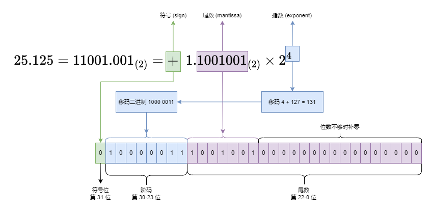

# 数学漫谈 (一) 十进制与二进制数字系统

[TOC]

我们知道, 在计算机中, 所有数字都是以二进制的形式存在的。我们在编程时使用的是十进制数字, 编译器会将其解析成二进制数字。程序执行时所有的数字都是以二进制的形式参与运算, 最终转换成十进制数字输出。因此, 我们必须对二进制数字有一定的认知。在介绍二进制数字之前, 我们先回顾一下十进制数字相关的知识。

## 一、十进制数字系统

### 1.1 整数相关概念

首先, 为了 "计数" (counting), 我们引入了 **自然数** (natural number) 以及 **加法** (addition), 同时约定了 "逢十进一"。比方说: 12 个苹果加上 18 个苹果等于 30 个苹果。

在有了加法后, 我们引入 **减法** (subtraction) 作为加法的 "逆运算"。比方说, 30 个苹果减去 18 个苹果等于 12 个苹果。并约定 被减数 (minuend) - 减数 (subtrahend) = 差值 (difference)。

此时会产生一个问题, 那就是当 被减数 小于 减数 时应该怎么办? 为了解决这一问题, 我们引入了 **负整数** (negative integer)。一般情况下, 我们将 负整数 看成是 正整数 相反的 "方向", "状态", "动作" 等等。比方说:

+ 动作: `+18` 表示往仓库中存放 18 个苹果, `-12` 表示从仓库中取出 12 个苹果
+ 状态: `+300` 表示你拥有 300 元, `-200` 表示你负债 200 元
+ 方向: `+2` 表示向左移动两个单位, `-5` 表示向右移动五个单位

自然数 (零 和 正整数) 和 负整数 放在一起, 就构成了 **整数** (integer)。我们将所有的 整数 从小到大排列, 构成一个 数轴 (number line)。那么 加法 是将点往 数轴 的右边移动, 减法 是将点往 数轴 的左边移动。

---

为了 "简化" 加法运算, 我们引入了 **乘法** (multiplication)。乘法最基本的含义是多个相同的数字相加, 比方说: $(-5) \times 3 = (-5) + (-5) + (-5)$。但是这样会存在一个问题, 那就是两数相乘, 其中有一个数表示 "数量", 必须是 自然数。如果是两个 负整数 相乘呢?

从小老师就告诉我们 "负负得正", 即两个负数相乘得到的是正数, 可这是为什么呢? 实际上这是通过 乘法分配律 (distributive property) 推导出来的。设 $x$ 和 $y$ 是正整数, 那么 $-x$ 和 $-y$ 是负整数, 则:

$$
\begin{align*}
(-x) \times (-y) &= (-x) \times (-y) + x \times ((-y) + y) \\
&= (-x) \times (-y) + x \times (-y) + x \times y \\
&= ((-x) + x) \times (-y) + x \times y \\
&= x \times y
\end{align*}
$$

换言之, 如果希望 "负数乘负数" 也满足 乘法分配律, 那么其结果必须是正数, 我们一般将其作为一个 约定俗成 的规定。其实仔细想一想, 在日常生活中, 我们很少会将两个负数相乘。当然, 强行套用是能套进去的, 但是多多少少会有一些奇怪, 比方说:

+ 我给你三张 20 元钞票：$(+3) × (+20) = +60$ 元
+ 我给你三笔 20 元债务：$(+3) × (−20) = −60$ 元
+ 我从你那里拿走三张 20 元钞票：$(−3) × (+20) = −60$ 元
+ 我从你那里拿走三笔 20 元债务：$(−3) × (−20) = +60$ 元

关于 整数乘法 的研究非常多, 主要有: (1) 因数 (factor) / 约数 (divisor) 与 倍数 (multiple); (2) 质数 / 素数 (prime number) 与 合数 (composite number); (3) 质因数 (prime factor) 等等。著名的 [哥德巴赫猜想](https://en.wikipedia.org/wiki/Goldbach%27s_conjecture) (Goldbach's conjecture) 就是关于 素数 的研究, 即 "任意一个大于 2 的偶数, 都可表示成两个素数之和"。

在有了乘法后, 我们引入 **除法** (division) 作为乘法的逆运算。对于整数除法来说, 会产生一个新的问题: 不能整除, 或者说 商 (quotient) 不是整数。这个问题有两种解决方案: 一种是引入 **余数** (remainder) 的概念; 另一种是使用 **分数** (fraction) 作为除法的运算结果。

我们设 $x \div y = m \cdots n$, 其中 $x$ 是被除数 (dividend), $y$ 是除数 (divisor), $m$ 是商 (quotient), $n$ 是余数 (remainder)。那么, 我们可以得到方程 $m \times y + n = x$, 其中 $m$ 要求尽可能地大, 也就是说 $n$ 的取值范围在 $[0, y - 1]$ 之间。

分数主要的内容有: 为了方便将分数化成 最简形式 (lowest term), 我们引入了 最大公约数 (greatest common divisor) 的概念; 为了方便进行 分数加法, 我们引入了 最小公倍数 (lowest common multiple) 的概念。

除法中还有一个问题: 除数 不能为 $0$, 其原因很简单: 我们可以从 $x \times a = y$ 推导出 $y \div a = x$。当 $a = 0$ 时, 我们可以得到 $x \times 0 = 0$, 此时你只能推导出 $0 \div 0 = x$。也就是说, 当你从乘法推导除法运算时, 若 除数 为零, 被除数 没有非零的可能。同时, $0$ 除以 $0$ 可以得到任意数, 这样的运算是没有意义的。因此, 我们规定除法中除数不能为 $0$。

一般情况下, 我们使用 [长乘法](https://en.wikipedia.org/wiki/Multiplication_algorithm) (long multiplication) 和 [长除法](https://en.wikipedia.org/wiki/Long_division) (Long division) 进行任意数字的乘除法计算。示例如下:


长乘法 的核心思想是 "拆", 即将其中一个 乘数 按位 "拆" 分。上面的过程完全可以写成 $31 \times 21 = 31 \times 1 + 31 \times 20 = 31 + 620 = 651$, 其中 620 的 0 被省略了。长除法的核心思想是 "凑": 我们在 被除数 的每一位上凑一个最接近其的、且是 除数 倍数的数字, 然后取 差值 继续 "凑"。

---

为了简化乘法, 我们引入了 **乘方** 的概念。$a^n$ 表示 $n$ 个 $a$ 相乘。对于 $b = a ^ n$ 而言, 我们将 $a$ 称为 **底数** (base), $n$ 称为 **指数** (exponent), $b$ 称为 **幂** (power)。同底数幂运算法则如下:

+ $a^m \times a^n = a^{m+n}$
+ $a^m \div a^n = a^{m-n}$
+ $(a^m)^n = (a^n)^m = a^{mn}$

乘方运算 和 加法运算 以及 乘法运算 不同, 不满足 交换律, 即 $a^n \not ={n^a}$。此时就产生了两种 逆运算: **开方** 和 **对数** 运算。对于 $b = a ^ n$ 而言, 开方运算是 $a = \sqrt[n]{b}$, 即根据 幂 和 指数 求 底数; 对数运算是 $n = \log_a{b}$, 即根据 幂 和 底数 求 指数。

引入开方运算有很大的问题: 对于 $a = \sqrt[n]{b}$, 当 开偶次方 ($n$ 为偶数) 时, 若 $b > 0$, 那么运算结果会有两个值; 若 $b < 0$, 则没有办法计算, 需要引入了 虚数 (imaginary number) 的概念。

为了让 开偶次方 和 开奇次方 一致, 我们一般限制 $b \ge 0$。同时, 如果开方结果有两个, 我们只保留大于零的结果, 丢弃小于零的结果, 也就是说 $a \ge 0$。在这样的前提下, 我们将 指数位 $n$ 从 正整数 扩展到 零, 负整数 和 分数:

(1) $a^0 = 1$。原因如下: 我们期望 $a^0$ 满足幂运算法则, 那么 $a^n = a^{n+0} = a^n \times a^0$, 此时 $a^0$ 只能等于 1。这个思路和 "负负得正" 的思路是一致的。除此之外, 还有一种理解方式: 加法 的基数是 0, 乘法的基数为 1, 因此当有 0 个 $a$ 相乘时, 得到的结果为 $1$。

(2) $a^{-n} = \frac{1}{a^{n}}$。这样定义也是为了满足幂运算法则: $1 = a^0 = a^{n + (-n)} = a^n \times a^{-n}$; 等式两边同时除以 $a^n$ 即可得到定义式。

(3) $a^{\frac{1}{n}} = \sqrt[n]{a}$。这样定义也是为了满足幂运算: $a = a^{\frac{1}{n}\times n} = (a^{\frac{1}{n}})^n$; 等式两边同时开 $n$ 次方即可得到定义式。

至此, 指数为可以是整数和分数了, 需要说明的有两点:

第一点, 对于 $a^n$ 而言, 当底数 $a = 0$ 时, 那么运算结果一定 0; 当指数 $n = 0$ 时, 运算结果一定为 1。那么, $0^0$ 结果是 $0$ 还是 $1$ 呢? 一般情况下, 我们认为 $0^0$ 属于未定义, 即不能进行运算; 而在编程语言中, 此时一般会输出 $1$。

第二点, 第 (3) 条运算规则将 开方 和 乘方 运算统一了, 此时可以得到 $b^{\frac{m}{n}} = \sqrt[n]{b^m} = (\sqrt[n]{b})^m$。

为了进行区分, 我个人将乘方运算分为 "正整数乘方" 和 "实数乘方"。"正整数乘方" 的 指数位 $n$ 只能是正整数, 底数 $a$ 可以为任意实数, 运算结果 $b$ 也是任意实数, 开方运算是其逆运算。"实数乘方" 的 指数位 $n$ 是任意实数, 底数 $a$ 和运算结果 $b$ 必须是 非负数 (大于等于零), 对数运算是其逆运算。

我们一般探讨的 对数运算 $\log_a{b}$ 是 "实数乘方" 的逆运算, 也就是说 $a$ 和 $b$ 都必须大于等于 0。不仅如此, $a$ 不能等于 0 和 1, $b$ 不能等于 0。其原因和 除数 不能为 0 是一样的: 0 的任意次方为 0; 1 的任意次方为 1; 任意数的 0 次方为 1。三者都无法构建 逆运算。对数运算法则是直接根据幂运算法则来的, 即:

+ $\log_a{(m \times n)} = \log_a{m} + \log_a{n}$
+ $\log_a{(m \div n)} = \log_a{m} - \log_a{n}$
+ $\log_a{b^m} = \log_a{b} \times m$
+ $\log_a{\sqrt[m]{b}} = \log_a{b} \div m$

除此之外, 还有一个 换底公式: $\log_a{b} = \frac{\log_k{b}}{\log_k{a}}$。

"实数乘方" 和 对数运算 的意义是将 幂的乘除乘方开方 映射成 指数位的加减乘除。在实际应用时, 底数并不是很重要, 一般取 $e$, $2$ 或者是 $10$ 即可。

和本节内容相关的基本函数有三个: (1) 幂函数 $y = x^a$; (2) 指数函数 $y = a^x$; (3) 对数函数 $y = \log_a x$。这三个函数对 $a$ 的取值范围有限制: 在幂函数中, $a$ 一般为正整数, 也就是上面所说的 "正整数乘方", 比方说 $y = x^2$, $y = x^3$ 等等; 在 指数函数 和 对数函数 中, 我们直接限制 $a > 0$ 且 $a \not = 1$, 也就是上面所说的 "实数乘方", 比方说 $y = e^x, y = \ln{x}$。

### 1.2 小数相关概念

分数有一个问题, 那就是和 整数 系统不互相融合。于是, 我们就需要 **小数** 的概念了。那么, 什么是 小数 呢? 或者说如何去定义 小数 呢?

小数的英文是 Decimal fractions, 直译过来就是 十进制分数。常见的定义方式是: 小数是一种特殊的分数, 其分母是 10 的幂, 或者说 $10^n$, 其中 $n$ 是小数的位数, 也就是一个自然数。

举例来说, $\frac{1}{2} = \frac{5}{10}$, 那么我们可以将 $\frac{1}{2}$ 记作 $0.5$; $\frac{1}{4} = \frac{25}{100}$, 那么我们可以将 $\frac{1}{4}$ 记作 $0.25$。

显然, 不是所有的分数分母都可以转化为 10 的幂, 比方说 $\frac{1}{3}$, 它们只能转换成 循环小数 (repeating decimal), 即 $0.\dot{3}$。

分数 和 小数 之间有如下的关系:

对于一个分数来说, 如果其 最简形式 分母 的 "质因数" 只有 2 和 5, 那么其对应的小数一定是 有限小数 (terminating decimal); 如果其 最简形式 分母 的 "质因数" 包含 2 和 5 以外的其它数字, 比方说 3, 7 等等, 那么其对应的小数一定是 循环小数 (repeating decimal)。反过来, 所有的 有限小数 和 循环小数 都可以转换成分数。此时, 你可能好奇为什么 循环小数 可以表示成分数, 这个可以通过 **等比数列极限** 的方式来理解。

对于 $0.8\dot{3}$ 而言, 我们可以将其拆成 $0.8 + 0.03 + 0.003 + 0.0003 + \cdots$, 排除第一项 $0.8$ 后, 我们将后面的内容可以看成是首项为 $0.03$, 公比是 $0.1$ 的 等比数列 求和。根据等比数列的求和公式, 我们可以得到:

$$
0.8\dot{3} = 0.8 + \lim_{n \to \infty} \frac{0.03 \times (1 - 0.1^n)}{1 - 0.1}
$$

当 $n \to \infty$ 时, $0.1^n = 0$, 那么 $0.8\dot{3} = \frac{4}{5} + \frac{3}{90} = \frac{5}{6}$。整个过程的核心是理解极限。实际上, 对于等比数列求和来说, 当 $n \to \infty$ 时, 若公比大于 1, 那么数列之和一定是发散的 (指数爆炸); 若公比在 0 到 1 之间, 那么数列之和一定收敛于某一个数字。一个 循环小数 就对应 一个公比在 0 - 1 之间的 等比数列 极限。

我看到网上有人争辩, $0.\dot{9}$ 应该小于 1 还是等于 1。答案很明确是 **等于**。我们可以用 数列极限 的方式来证明, 过程和上面一样: 我们可以将其理解为首项是 0.9, 公比为 0.1 的等比数列之和, 那么:

$$
0.\dot{9} = \lim_{n \to \infty} \frac{0.9 \times (1 - 0.1^n)}{1 - 0.1} = 1
$$

更一般地, 对于任意一个 **有限小数**, 我们都可以找到和其相等的 **循环小数**, 它们的 "循环部分" 都是 9。比方说, $2.5 = 2.4\dot{9}$, $0.835 = 0.834\dot{9}$。这是一个反直觉的结论, 更多相关内容, 可以参考 [0.999...](https://en.wikipedia.org/wiki/0.999...)。

### 1.3 总结与感悟

从上面你应该可以发现规律, 我们探索数字的大致过程是从 "定义" 到 "运算法则" 再到 "定义"。比方说, 对于乘方运算, 我们先定义 指数位 是正整数的 乘方运算 以及其逆运算 开方运算, 接着研究 幂运算法则, 最后根据 幂运算法则 定义 指数位 是负数和分数的乘方运算。

那么, 我们能说 $3^{0.5}$ 是 0.5 个 3 相乘吗? 显然不能, 0.5 个 3 相乘和 $\sqrt{3}$ 之间有什么关系呢? 显然没有。对于现实生活中的问题, 数字是有取值范围的, 当超出了取值范围后, 就是没有意义的。我们说 $a^n$ 是 $n$ 个 $a$ 相乘, 其前提是 $n$ 必须是自然数; 如果 $n$ 不是自然数, 那么就不能这样类比, 因为没有意义。

负负得正 也是同理, 有时候 "硬套" 会让人感觉很奇怪。其实, 在日常生活中, 我们很少会用到负数。负数 主要的含义是 "反方向", 我们用自然语言表述会更加方便。比方说, "较去年同期增长 -15%" 完全可以说成 "较去年同期减少 15%"。同时在很多问题中, 两个 方向 是远远不够用的。

用 负数 表示 "大小" 的情况就更少了, 主要体现在 摄氏温度 上。之所以会定义负温度, 是因为我们无法测量 "最低温度"。从统计学角度来说, 其不属于 等比尺度 (ratio scale) 的范畴。等比尺度 的含义是可以讨论 倍数, 然而我们不能说 $20\mathrm{^\circ C}$ 是 $-20\mathrm{^\circ C}$ 的 $-1$ 倍, 这显然是不合理的。

绝大部分 "度量" 都是等比尺度, 因为 "真零" 的含义是 "没有", 在定义它们时我们定义好单位量即可。比方说, 在定义 长度, 面积, 体积, 质量 时, 我们定义好 一米, 一平方米, 一立方米, 一克即可, 无需考虑过多。而对于像 时间和温度 这类概念, "真零" 的含义是 "最小值"。也就是说, "等比尺度" 要求 "度量" 不存在小于零的情况。

负数的主要应用场景还是在 数学、物理等专业领域中, 比方说 笛卡尔坐标系, 函数的最优化 等等。因此, 我们不需要过份纠结为什么 负负得正。

---

我们能不能基于 乘方 定义更高阶的运算呢? 答案是可以的: 对于实数 $a$ 和自然数 $b$, 我们定义 $a \odot b$ 为对 $a$ 进行 $a$ 次方操作 $b$。这种运算方式被称为 超乘方。在此基础上, 我们甚至可以定义任意阶的运算, 具体可以参考 超运算。

数学中很多概念都是在 逆运算 的过程中产生的, 比方说 负数, 分数, 虚数 等等。同时不是所有的运算都是 可逆的, 比方说 除数为零, 负数开偶次方, 底数为 0 或者 1 的对数运算 等等。从 加法, 乘法 到 乘方, 其逆运算越来越复杂, 不可逆的情况也越来越多。如果要研究 超乘方 和 超运算 的逆运算, 就非常地困难了。

我在前两节刻意回避了一个概念: 无理数 (irrational number, 不可比数)。这个概念和 极限 以及 微积分 的关联性很强, 所以就没有介绍了。

小数 这个概念让 整数系统 和 分数系统 相互融合, 可以统一使用 长乘法 和 长除法 进行数字运算, 方便我们比较数字的大小, 辅助我们理解 无理数 和 数轴连续 等相关概念。

但是 小数系统 并不完美, 像 $\frac{1}{3}$ 这样的分数只能变换成 循环小数, 而 循环小数 和 整数系统 的计算并不相容, 我们很难对 循环小数 进行 长乘法 运算。那么怎么办? 答案是 "截断", 近似到某一个 有限小数 上, 这样就可以进行计算了。那么, 对于 小数 而言, "计算精度" 是一个不可避免的话题。世界上 万千事物, 很多都是 不完美 的, 但是我们不能因为其 不完全 而停止对这个世界的 探索!

至此, 你应该回忆起大部分相关知识点了, 并对数字系统有一个更加宏观地认知。

## 二、二进制数字 简介

我们知道, 计算机中的数字是以 二进制 的形式存在的。那么, 什么是 二进制数字 呢?

二进制数字 和 十进制数字 定义是相似的, 只是我们约定 "逢二进一", 此时数字只由 0 和 1 组成, 比方说 $1110.101_{(2)}$。那么, 如何将 二进制数字 和 十进制数字 之间如何互转呢?

### 2.1 十进制数字 和 二进制数字 互转

对于任意的十进制数字, 我们可以使用 10 的乘方形式来表示, 比方说:

$$
14.625 = 1 \times 10^1 + 4 \times 10^0 + 6 \times 10^{-1} + 2 \times 10^{-2} + 5 \times 10^{-3}
$$

那么, 二进制数字也可以使用 2 的乘法形式来表示, 并借助此转换成十进制数字:

$$
1110.101_{(2)} = 1 \times 2^3 + 1 \times 2^2 + 1 \times 2^1 + 0 \times 2^0 + 1 \times 2^{-1} + 0 \times 2^{-2} + 1 \times 2^{-3} = 14.625
$$

---

十进制数字转二进制也可以像上面这样转换, 但是前提是我们要非常熟悉二进制运算才行。然而, 我们熟悉的只有十进制运算, 因此我们通常采取下面的方式:

对于 十进制整数 而言, 当我们除以 10 后, 余数 就是最低位的数字。比方说, $3456 \div 10 = 345 \cdots 6$。那么, 对于 3456 这个数字而言, 最低位就是 6。

你或许会觉得上面的结论是显而易见的, 但是其可以帮助我们将 十进制整数 转换成 二进制整数: 将 十进制整数 不断除以 2, 保留 商 作为 后续的运算值, 直到 商 是 0 为止。最后将 余数 倒序组合, 就是 二进制整数。整数 14 转换成二进制过程:

$$
\begin{align*}
    14 \div 2 &= 7 \cdots 0 \\
     7 \div 2 &= 3 \cdots 1 \\
     3 \div 2 &= 1 \cdots 1 \\
     1 \div 2 &= 0 \cdots 1
\end{align*}
$$

我们将 余数 倒序组合就是 $1110_{(2)}$。

对于 十进制小数 而言, 当我们乘以 10 后, 小数点往右移动一位, 此时的 整数部分 就是最高位的数字。比方说, $0.3456 \times 10 = 3.456$。那么, 对于 0.3456 这个数字而言, 最高位就是 3。

同理, 我们可以用上面的结论将 十进制小数 转换成 二进制小数: 将 十进制小数 不断乘以 2, 保留 小数部分 作为 后续的运算值, 直到 小数部分 是 0 为止。最后将 整数部分 正序组合, 就是二进制小数。小数 0.625 转换成二进制的过程如下:

$$
\begin{align*}
    0.625 \times 2 &= 1.25 \\
    0.25  \times 2 &= 0.5 \\
    0.5   \times 2 &= 1.0
\end{align*}
$$

我们将 整数部分 正序排列, 就是 $0.101_{(2)}$。

结合上面两步, 我们就可以将 14.625 转换成二进制数字: $1110.101_{(2)}$。简单来说, 十进制转二进制, 整数部分使用除二的方式来获取每一位, 小数部分使用乘二的方式来获取每一位。

---

上述过程可以用于任意进制的换算, 比方说 七进制 转 九进制。但是我们既不熟悉 七进制 的运算方式, 也不熟悉 九进制 的运算方式。那么, 我们可以用 十进制 作为桥梁, 即 七进制 转 十进制 转 九进制 来完成目标。进制转换的一个核心思想是: 一定要把运算控制在我们熟悉的进制下!

### 2.2 二进制小数特征

我们在 1.2 节说过, 十进制小数 是分母为 $10^n$ 的特殊分数。同时, 如果其 最简形式分数 的 分母 中包含除 2 和 5 以外的 质因数, 那么其一定是 循环小数。

上述结论同样适用于 二进制小数: 二进制小数 是分母为 $2^n$ 的特殊分数。如果其 最简形式分数 的 分母 中包含除 2 以外的 质因数, 那么其一定是 循环小数。也就是说, 像 0.5, 0.25, 0.375 这样数字转换成 二进制小数 时是有限小数; 像 0.1, 0.2 这样的数字转换成 二进制小数 时是 循环小数。你可以用 2.1 中介绍的运算方式验证: $0.1 = 0.0 \dot{0} \dot{0} \dot{1} \dot{1}_{(2)}$。

也就是说, 二进制有限小数 一定可以转换成 十进制有限小数; 而 十进制有限小数 不一定能够转换成 二进制有限小数。一般情况下, 二进制有限小数 的 十进制形式 以 25 或者 75 结尾的居多。

在计算机中, 所有 小数 都是以 "二进制有限小数" 的形式存在的。如果遇到 循环小数 和 无理数, 那么会近似到某一个 有限小数 上。这也解释了为什么 0.1 + 0.2 不等于 0.3。这三个数字的二进制形式都是 循环小数, 相加时会存在一定性质的误差。也就是说, 我们一般不用 `==` 来判断两个 小数 相等, 而是根据 差值的绝对值 小于 `epsilon` 来判断 (`epsilon` 一般取值为 $10^{-7}$)。

在 Python 中, `**` 表示乘方运算, 同时支持负数的乘方运算。需要注意的是, 当 底数 为负数, 指数 为小数时, 运算结果一定为 复数。这显然不符合数学定义。

举例来说, `(-2.5) ** 0.2` 是对 -2.5 开五次方, 得到的结果应该是一个 "负数", 但是计算机会输出 "复数"。

原因是: 0.2 会转换成相近的 "二进制有限小数", 而 "二进制有限小数" 对应分数的分母一定是偶数, 最终会变成开偶数次方, 得到的运算结果是 "复数"。这显然不是我们想要的! 因此一定要慎用此功能。

需要注意的是, 上面的异常情况仅限于 底数是负数 且 指数是小数 的情况。如果指数是整数, 则没有问题。举例来说, `(-2.5) ** 3.0` 计算是符合预期的, 得到的结果是 -15.625。

相较于 整数, 小数 是没有完美表示方式的。在实际度量和计算中, 小数的 "四舍五入" 属于常规操作。在绝大多数情况下, 计算机小数的精度误差都是可以接受的。在极个别情况下, 如果需要精确计算, 分数 可能是更好的选择。但是计算机硬件层面是不支持 分数 运算的, 需要自行开发满足需求的分数类。

---

至此, 你应该对 二进制数字 有一个初步的认知了。

在 计算机硬件体系 中, 二进制数字 的存在形式主要有两种: **整形** 和 **浮点数**, 分别用来存储 **整数** 和 **有限小数**。其它类型在 硬件层面 是不支持的, 需要在 软件层面 (代码层面) 实现, 不在本文的讨论范围内了。

在计算机的磁盘和内存中, 存储的最小单位是 **比特** (bit)。每一个 比特 只能有两种状态, 我们用 0 和 1 表示。也正是因为此, 我们需要将 数字 化成 二进制的形式进行存储: 二进制的一位数字对应磁盘中的一个比特。我们将 十进制数字 转换成 计算机中二进制数字 的过程称为 **编码**。

在这种情况下, 正整数 和 零 是最容易编码的, 二进制数字 是什么样子的, 就怎么存储。那么, 负数 和 小数 如何进行编码呢? 第三章主要介绍 整数 (包含 负整数) 的编码方式, 第四章主要介绍 小数 的编码方式。下面, 让我们开始吧 ~

## 三、整形类型

### 3.1 类型概述

整形类型 的核心思想非常简单: 将 整数 转换成 二进制形式, 磁盘中每一个 bit 存储一位。常见的存储 bit 数有: 8, 16, 32 和 64; 它们分别对应: 1, 2, 4 和 8 个字节; 我们一般用 int8, int16, int32 和 int64 来表示。在 C 语言中的类型 (包含 `stdint.h`) 如下:

+ int8: `int8_t`, `char`
+ int16: `int16_t`, `short`
+ int32: `int32_t`, `int`, `long`
+ int64: `int64_t`, `long`, `long long`

需要说明的是:

(1) 在一些编译器中, `long` 和 `int` 一样表示 int32, `long long` 表示 int64; 而在另一些编译器中, `long` 和 `long long` 一样表示 int64。正常情况下, `int` 类型足够我们使用了, 如果要使用其它类型, 建议使用 `stdint.h` 中的类型 (`int8_t`, `int16_t`, `int32_t`, `int64_t`)。

(2) 在 C 语言中, `char` 类型既可以当作 字符 类型, 也可以当作 整数 类型。更一般地, 一个字符在内存中就是一个整数。在很多编译器中, `wchar_t` (宽字符) 对应的是 `short` 或者 `int` 类型。

同时, 上面的类型还有 有符号 (`signed`) 和 无符号 (`unsigned`) 之分。无符号整数 只能表示 零 和 正整数, 有符号整数 则能够表示 负数, 零 和 正整数。一般情况下, 上面的类型都是有符号的, 无符号的需要在前面加上 `u` 或者 `unsigned`, 比方说 `uint32_t`, `unsigned int` 等等。对于有符号的整数而言, 最高位是符号位: 0 表示正数 1 表示负数。

上述类型的取值范围如下表:

| 类型 | 类型(C/C++) | 最小值(准确版) | 最小值(粗略版) | 最大值(准确版) | 最大值(粗略版) |
|:--:|:--:|:--:|:--:|:--:|:--:|
|int8|signed char|$-2^{7}$|-128|$2^7-1$|127|
|uint8|unsigned char|$0$|0|$2^8-1$|255|
|int16|signed short|$-2^{15}$|-32768|$2^{15}-1$|32767|
|uint16|unsigned short|$0$|0|$2^{16}-1$|65535|
|int32|signed int|$-2^{31}$|约负21.5亿|$2^{31}-1$|约21.5亿|
|uint32|unsigned int|$0$|0|$2^{32}-1$|约43亿|
|int64|signed long|$-2^{63}$|约负九百万 万亿|$2^{63}-1$|约 九百万 万亿 ($9.2 \times 10^{18}$)|
|uint64|unsigned long|$0$|0|$2^{64}-1$|约 一千八百万 万亿 ($1.8 \times 10^{19}$) |

备注: 目前, 兆 有三种含义: 百万 ($10^6$), 万亿 ($10^{12}$) 和 万万亿 ($10^{16}$)。这里为了避免歧义, 就使用 万万亿, 没有使用 兆 这个单位。

在除 C/C++ 的高级语言中, 对上述功能进行了简化。比方说:

在 Java 中, 整形没有 `unsigned` 类型, 只有 `signed` 类型。int8, int16, int32 和 int64 分别对应 `byte`, `short`, `int` 和 `long` 四种类型, 并且提供了 `java.lang.Byte`, `java.lang.Short`, `java.lang.Integer` 和 `java.lang.Long` 四个封装类。大数运算则使用 `java.math.BigInteger` 类即可。

在 Python 中, 类型是隐式的, 会根据数值的大小自动调整 整形 的类型, 并且默认支持 整形 的大数运算。当然, 这样的 "自动调整" 是有代价的, 那就是运行缓慢。如果想要控制类型, 那么就需要使用 NumPy 或者 PyTorch 等科学计算库。

至此, 你应该对 整形类型 有一个大致的了解。实际上, 对于 有符号整数 而言, 负整数是以 补码 的形式存在的。下面, 让我们看看相关的内容。

### 3.2 整形加法的周期性 与 负整数的补码

首先, 让我们看看 unsigned 正整数 加法计算的周期性。

从上面我们可以看出, 计算机表示整数是有范围的。一般情况下, 在运算过程中, 所有数字都是相同类型的。比方说, 对于 uint8 类型的加法而言, 两个 加数 以及 计算结果 都是 uint8 类型的。

在 C 语言中, 如果让 uint8 类型和 uint16 类型相加, 那么会先将 uint8 类型转换成 uint16 类型之后再进行计算, 即位数少的类型会自动转换成位数多的类型。如果让两个 uint8 类型的数字相加, 结果保存在 uint32 变量中, 那么相当于将 uint8 类型的运算结果强制转换成 uint32。

在 整形类型 的计算中, 如果计算结果超过其可以表示的最大值时, 只会保留相应的位数。我们将这种情况称为 **溢出** (overflow)。举例来说, 对于 uint8 类型而言, 其能够表示最大的整数是 255。那么, 255 + 1 的结果是什么呢? 计算机会自动将 计算结果 中将超过 8 位的数字全部丢弃掉。256 至少需要 9 位数字才能表示, 去掉最高位后剩余 8 位都是 0, 因此答案是 0。

如下图所示, 我们可以将 uint8 类型数轴的首尾相连, 构成一个时钟型的结构。这样, 整形的加减法运算和三角函数一样, 具有周期性。对于 uint8 而言, 周期为 256, 即 $a + 256 = a$。更一般地, 如果 unsigned 整形的 bit 位数为 $n$, 那么周期为 $2^n$, 即 $a + 2^n = a$。


接下来让我们看看 signed 整形的 负整数编码 问题。最简单的表示负数的方式: 用 最高位 表示符号, 0 代表正数, 1 代表负数, 剩余位以 二进制 形式呈现。我们将这种方式称为 **原码** (sign magnitude)。此时, uint8 下的 128 对应 int8 的 -0; uint8 下的 129 对应 int8 的 -1; 以此类推, uint8 下的 255 对应 int8 下的 -127。具体参考下图:


**原码** 表示有一个问题, 那就是无法和 unsigned 整形的 加法 相互兼容, 我们需要根据 符号位 (最高位) 去调整运算过程。为了解决这一问题, 我们可以使用 **反码** (ones' complement) 和 **补码** (two's complement)。负整数的编码方式如下:

负整数的 反码 是其绝对值 原码 的每一位 取反 (0 变成 1, 1 变成 0), 或者说每一位用 1 减去原码值。这个过程属于 按位运算。补码则是在 反码 的基础上 加一, 属于 加法运算。

举例来说: 求 `-32` int8 类型补码的过程如下:

+ `32` 的原码: `0010 0000`
+ `-32` 的反码: `1101 1111`
+ `-32` 的补码: `1110 0000`

零 和 正整数 的 原码, 反码 以及 补码 是一致的。计算机中使用的整形编码方式是 补码。如上图所示, int8 类型的 -128 对应 uint8 类型的 128, int8 类型的 -1 对应 uint8 类型的 255。如果我们将整形加法的第一个加数理解为 "数轴上的点", 第二个加数理解为 "点的移动距离", 那么我们可以得到下面的计算过程:

$$-3_{(int8)} + 1 = 253_{(uint8)} + 1 = 254_{(uint8)} = -2_{(int8)}$$

如果是 -4 + 10, 由于 unsigned 整形计算的周期性, 其正好等于 6。也就是说, 我们利用 unsigned 类型加法运算的 溢出 特性, 完成了 signed 类型的负整数运算, 整个过程可以说非常巧妙。也正是因为此, 在 C 语言中, int8 类型的运算会出现 127 + 1 = -128 的情况。在高级语言中, 会对 数值运算 进行一定程度的溢出检测, 而 C 语言是没有的。

观察补码, 我们可以发现: 负整数的补码 最高位一定是 1, 这和 负整数的原码 是一致的。

此时, 你可能会想, 负整数的补码 如何进行 乘除运算 呢? 相关内容参考 [Booth's multiplication algorithm](https://en.wikipedia.org/wiki/Booth%27s_multiplication_algorithm), 这里不过多介绍了。

### 3.3 位运算

对于整形类型, 除了常见的 加减乘除 运算外, 还有 **位运算**, 即对二进制的每一位进行运算。常见的有 **位移运算** 和 **按位与或非**。

位移运算:

+ 左移 `<<`: 单个二进制数, 向左移动位数, 低位补零
+ 无符号右移 `>>>`: 单个二进制数, 向右移动位数, 高位补零
+ 右移 `>>`: 单个二进制数, 向右移动位数, 如果最高位是 1, 则高位补一; 如果最高位是 0, 则高位补零

注: 我们默认二进制的高位在左边, 低位在右边。同时, 左移 $n$ 位等价于乘以 $2^n$, 右移 $n$ 位等价于 "整除" (忽略余数) $2^n$。为了和负数的补码兼容, 在 右移运算 中, 如果最高位是 1 则补 1, 这样 负数 的右移也有 "整除" 特性了。

---

按位与或非:

+ 按位与 `&`: 两个二进制数, 同位数字都是 1, 运算结果为 1, 否则为 0
+ 按位或 `|`: 两个二进制数, 同位数字只要有一个是 1, 运算结果为 1, 否则为 0
+ 按位取反 `~`: 单个二进制数, 每一位取反, 1 变成 0, 0 变成 1
+ 按位异或 `^`: 两个二进制数, 同位数字相同, 运算结果为 0; 否则为 1

需要注意的是, 一定要区分清楚 **逻辑与或非** 和 **按位与或非**:

+ 在 C 语言中, **逻辑与或非** 符号是: `&&`, `||` 和 `!`, 在 Python 中则是 `and`, `or` 和 `not`
+ 在 C 语言和 Python 中, **按位与或非** 的符号是一致的, 对应: `&`, `|` 和 `~`
+ C 语言和 Python 中都有符号重载, 只能重载 **按位运算符**, 不能重载 **逻辑运算符**
+ 对于布尔类型的变量来说, **按位与或非** 和 **逻辑与或非** 运算结果是一致的, 这导致很多人将两者混用
+ 在 Python 中, **逻辑与或非** (`and`, `or` 和 `not`) 会隐式调用 `bool` 函数

正是因为以上的特性, 在使用 Pandas 时, 只能写 `df[(df.a == 1) & (df.b == 2)]`, 不能写 `df[(df.a == 1) and (df.b == 2)]`, 同时必须加括号, 不能够写成 `df[df.a == 1 & df.b == 2]`。

位运算也有很多特性, 比方说在之前 [博客](https://zhuanlan.zhihu.com/p/17821898772) 中提到的: 任何数字 和 `0` 进行 异或运算, 得到的是其本身; 任何数字 和 `1 << n` ($n$ 表示整形的位数) 进行 异或运算, 相当于 按位取反运算。也就是说, `a ^ 0 = 0`, `a ^ (-1) = ~a = -a - 1`。

在 C 语言中, 是不能够直接操作一个 bytes 中 bit 值的。但是我们可以通过 位运算 间接实现。比方说:

+ 将 `int8` 类型的第四个 bit 赋值为 1: `a |= (1 << 3)`
+ 将 `int8` 类型的第四个 bit 赋值为 0: `a &= ~(1 << 3)`
+ 将 `int8` 类型的第四个 bit 取反: `a ^= (1 << 3)`
+ 取 `int8` 类型第四个 bit 的值: `(a >> 3) & 1`

在嵌入式开发中, 内存是非常稀缺的资源, 但是却有大量的 "状态变量"。这些 "状态变量" 用一个 byte 存储太浪费空间了, 我们一般按照 bit 分配空间, 即将多个 "状态变量" 压入一个 byte 中存储。此时, 位运算 就能够大显身手了。但是, 在 内存 充足的情况下不建议这样操作, 代码的可读性太差了。

---

同时, 位运算 都有对应的 电路实现, 这涉及到 数字电路 相关的知识。我们可以借助 位运算 实现整数的加减乘除四则运算。下面, 让我们看看如何用 位运算 实现 整形加法。

整形加法的原理就是我们小学学习的 **竖式计算**, 即一位一位地相加, 进位 (carry) 值代入到下一位的计算中。那么, 我们怎么实现单个 bit 位的计算呢? 这就涉及到两个功能模块: 半加器 (half adder) 和 全加器 (full adder)。

半加器的主要功能就是求两个 1 bit 数字之和, 其输入是两个 1 bit 的数字 $a$ 和 $b$, 输出也是两个 1 bit 的数字 $c$ 和 $s$。其中, $s$ 的全称是 sum, 表示两位的 和; $c$ 的全称是 carry, 表示的是 进位。由于 $a$ 和 $b$ 的取值范围是 0 或者 1, 我们可以列出所有的运算情况:

|输入 $a$|输入 $b$|输出 $c$|输出 $s$|
|:--:|:--:|:--:|:--:|
|0|0|0|0|
|0|1|0|1|
|1|0|0|1|
|1|1|1|1|

观察上表, 我们可以发现: `c = a & b`, `s = a | b`。这样, 我们就可以用位运算的逻辑门电路实现半加器了。

全加器的主要功能是求三个 1 bit 数字之和, 其输入是两个 1 bit 数字 $a$, $b$ 和 $c_{in}$, 输出是两个 1 bit 数字 $c_{out}$ 和 $s$。$c_{in}$ 和 $c_{out}$ 都是 carry 的意思, 前者是上一位运算输出的进位值, 后者是当前位输出的进位值。我们可以和上面一样, 列出全加器的所有运算情况, 然后观察表格, 得到 $c_{out}$ 和 $s$ 的位运算公式, 然后转换成对应的电路实现即可。全加器的所有运算情况:

|输入 $a$|输入 $b$|输出 $c_{in}$|输出 $c_{out}$|输出 $s$|
|:--:|:--:|:--:|:--:|:--:|
|0|0|0|0|0|
|0|0|1|0|1|
|0|1|0|0|1|
|0|1|1|1|0|
|1|0|0|0|1|
|1|0|1|1|0|
|1|1|0|1|0|
|1|1|1|1|1|

观察上表, 我们可以发现, 输入的三个数字有奇数个 1, $s$ 的值为 1; 输入的三个数字有偶数个 1, $s$ 的值为 0。那么, 我们用位运算表示是 `s = a ^ b ^ c_in`。$c_{out}$ 的位运算表示则比较麻烦, 这里直接给出结果: `c_out = (a | b) & (b | c_in) & (a | c_in) = (a & b) | ((a ^ b) & c_in)`。

对于 int32 类型的加法, 我们只需要将 1 个 半加器 和 31 个 全加器 组合起来, 最后输出的 carry 进位丢弃掉即可。我们可以这样说, 整形加法 的底层逻辑是 位运算, 而 位运算 和 数字电路 有直接的对应关系。这样, 你对计算机体系有一个更深的理解。

### 3.4 十六进制整数

在编写代码的时候, 我们可能想直接用 二进制 来表示整数, 而不是用 十进制 来表示整数。比方说, 我们知道 int32 最大值的二进制样式是: 最高位为 0, 剩余 31 位是 1。但是, 如果我们直接在代码中直接用 二进制 表示, 写起来麻烦, 读起来也费劲。有没有办法方便地表示 二进制 数字呢? 有, 那就是 十六进制 (hexadecimal)。

二进制数字 和 十六进制数字 之间可以非常方便地转换。二进制数字 每四位对应 十六进制 的一位数字。比方说, 将 二进制数字 `11010110` 转换成十六进制的方式如下:

首先, 从低位到高位, 每四个数字为一组: `1101 0110`。然后将每一组数字转换成十六进制的数字, `0110` 对应 `6`, `1101` 对应 `D`。最后组成起来即可, 此时十六进制的数字是 `D6`。

我们可以用下面的方式来验证, 对于 `1101` 这一组而言:

$$
\begin{align*}
    1101 \enspace 0000_{(2)} &= 1 \times 2^7 + 1 \times 2^6 + 0 \times 2^5 + 1 \times 2^4 \\
    &= 2^4 \times (1 \times 2^3 + 1 \times 2^2 + 0 \times 2^1 + 1 \times 2^0) \\
    &= 16 \times 13 \\
    &= 16^1 \times D_{(16)}
\end{align*}
$$

同理, 对于 `0110` 这一组而言:

$$
\begin{align*}
    0110_{(2)} &= 0 \times 2^3 + 1 \times 2^2 + 1 \times 2^1 + 0 \times 2^0 \\
    &= 6 \\
    &= 16^0 \times 6_{(16)}
\end{align*}
$$

回到一开的问题上, 对于 int32 的最大值, 其 最高四位 一定是 `0111`, 对应的十六进制是 `7`; 剩下的每一组都是 `1111`, 对应的十六进制是 `f`。那么, int32 最大值用 十六进制 表示就是 `7fffffff`。相较于 32 个 0 和 1 而言, 十六进制 的可读性是更高的。

更一般的, 我们可以让 二进制 和 $2^n$ 进制之间建立起联系 ($n$ 是 二进制一组中的位数)。比方说, 二进制数字 每三位对应 八进制 (octal) 的一位数字。

一般情况下, 一个字节对应 8 个比特, 那么在十六进制下, 我们可以用 两位数 来表示一个字节, 非常方便。相较而言, 八进制 就没有优势了。因此, 我们在编程时, 都会使用 十六进制 来代替 二进制 数字。这一点非常重要。

在 C 语言中, 整数常量的前缀表示进制: `0x` 或 `0X` 表示十六进制; `0` 表示八进制; `0b` 表示二进制; 不带前缀则默认表示十进制。注意: 我们不能为了对齐随意在常量前面增加 0 值, 这样的数字会变成 八进制, 这一点非常地坑!!!

整数常量的后缀表示类型: `U` 表示 unsigned; `L` 表示 int64。后缀可以是大写，也可以是小写，U 和 L 的顺序任意。如果不加, 默认是 int32。注意: 整形常量不能够是 int8 或者 int16。

还有一点需要注意, 在 C 语言中, 所有 整形常量 都是以 unsigned 形式取值的。比方说, `int a = 0xffffffff;`, 那么此时变量 `a` 的值是 `-1`; 如果是 `int a = -0xffffffff;`, 那么此时变量 `a` 的值是 `1`。这也符合我们上面说的 负数补码 形式。那么, 我们可以用 `0x80000000` 表示 int32 类型的最小值。

---

至此, 你应该对 整形类型有一个大致地了解。最后补充一个不太相关的知识: 我们常说的 big endian 和 little endian 是多个 "字节" 在内存中的排列方式, 和 "比特" 无关。big endian 是多个 "字节" 正序放入 "内存数组" 中, little endian 是多个 "字节" 倒序放入 "内存数组" 中。需要注意的是, 一个 "字节" 内部 "比特" 的顺序是不变的, 都是正序放入 "内存数组" 中。我们可以用下面的代码检测 CPU 是 big endian 还是 little endian:

```C
#include <stdio.h>

void main() {
    short x = 0x1122;
    char x0 = ((char*) &x)[0]; // 低地址单元
    char x1 = ((char*) &x)[1]; // 高地址单元
    if(x0 == 0x11) {
        printf("Big-endian\n");
    } else if (x0 == 0x22) {
        printf("Little-endian\n");
    }
}
```

在上面的代码中, 变量 `x` 的第一个字节是 `0x11`, 第二个字节是 `0x22`。如果是 big endian, 那么其在内存中先是 `0x11` 然后才是 `0x22`; 如果是 little endian, 那么其在内存中先是 `0x22` 然后才是 `0x11`。但是无论如何, 一个字节内部比特的顺序是不会变的。

无论是 位移运算 还是 按位与或非运算, 都不需要考虑 big endian 和 little endian 的问题, 编译器会帮助我们处理好相关问题。换言之, 这个不属于 位运算 这一层的 "抽象" 内容。

很多时候, 数据的 "逻辑表示方式", 内存中存在方式 以及 磁盘中的样式, 很可能都不一样。我们在学习相关内容时, 一定要分清楚知识所处的层级, 不然容易将概念全部混淆在一起。

## 四、浮点类型

在计算机中, 所有的小数都是以 有限小数 的形式存在的。如果遇到 循环小数 或者 无理数, 那么需要 "近似" 到某一个 有限小数 上。有限小数 常用的表示有两种: 一种是 **定点数**, 另一种则是 **浮点数**。

**定点数** 就是我们平常使用的数字, 比方说 "25.125"。我们在存储时, 需要指定多少个 bit 用于存储整数部分, 多少个 bit 用于存储小数部分。对于 定点数 而言, 我们通常说的 "精度" 指 小数点后的位数。

但是现在我们一般使用另一种表示方式: **浮点数**。下面, 让我们来看看 浮点数 的相关内容。至于 定点数 为什么很少用, 后文再进行介绍。

### 4.1 浮点数的表示方法

**浮点数** (floating-point numbers) 就是我们平常说的 科学记数法 (scientific notation), 比方说 $3.5 \times 10^6$。其中, $3.5$ 的部分被称为 significand (有效数字), $10$ 被称为 base (底数), $6$ 被称为 exponent (指数)。我们规定, 有效数字的取值范围是 `[1.0, 10.0)`; 底数 部分由 "进制" 决定, 必须是 10; 指数 必须是 整数。

也就是说, 如果我们要 存储 浮点数, 只需要存储 有效数字 和 指数值 即可。对于 浮点数 而言, 我们通常说的 "精度" 指有效数字的位数。

---

上面所说的是十进制的情况。在目前的计算机系统中, 我们使用的是 二进制浮点数 的表示方法, 遵守 [IEEE 754](https://en.wikipedia.org/wiki/IEEE_754) 标准。常用的存储方式有 32-bit 和 64-bit 两种形式。以 32-bit 为例:

+ 第 31 位是符号位, 0 表示正数, 1 表示负数
+ 第 30 - 23 位是阶码位, 一共 8 位, 用于存储 指数值
+ 第 22 - 0 位是尾数位, 一共 23 位, 用于存储 有效数字

下面, 我们以 25.125 为例, 看看其 32-bit 浮点数的形式:

(1) 使用 2.1 节所说的方式, 将 25.125 转换成二进制数: $1 1001.001_{(2)}$。

(2) 转换成标准的科学记数法, 转换后是 $1.1001 \enspace 001_{(2)} \times 2^4$。此时, 有效数字 是 $1.1001 \enspace 001_{(2)}$, 指数值 是 $4$。

(3) 将 指数值 转换成 二进制编码 的形式。我们知道, 指数值 一定是 整数, 那么在这里需要将这个 整数 编码成 8 位二进制数。

在 3.2 节中, 我们使用 补码 的方式来编码整数。而这里我们则采用 **移码** (offset binary) 的编码方式: 将 指数值 直接加上 127, 转换成对应的二进制整数即可。现在的 指数值 是 4, 加上 127 就是 131, 那么其编码后的数字就是: 1000 0011。在汉语中, 我们一般将编码后的数字称为 **阶码**。

也就是说, 阶码值 = 指数值 + 127。我们将 127 称为 **指数偏移**。阶码值 的取值范围 在 `[0, 255]`, 指数值 的取值范围 在 `[-127, 128]` 之间。一般情况下, 如果二进制的位数为 $n$, 那么 指数偏移 的值就是 $2^{n-1} - 1$。额外提醒一下, 移码 和 补码 的表示数字的范围是不同的, 前者是 $[-2^n, 2^n-1]$, 后者是 $[-2^n + 1, 2^n]$。对于 移码 (阶码) 而言, 如果最高位是 0, 那么代表的数字就是 负整数 或者 零; 如果最高位是 1, 那么代表的数字就是 正整数。

(4) 将 有效数字 转换成 二进制编码 的形式。无论如何, 对于二进制的科学记数法来说, 有效数字 的取值必须在 `[1.0, 2.0)` 之间, 也就是说 小数点 前面的数字必定是 1, 或者说整数部分必定是 1。那么, 我们只需要存储 小数部分 即可。在汉语中, 一般将 二进制有效数字 的 小数部分 称为 尾数 (mantissa)。在这个例子中, 尾数的编码是 1001 001, 不够的位数补零即可。

需要注意的是, 这仅仅是 二进制有效数字 才有的特性, 如果是 三进制有效数字, 整数部分 可以是 1 或者 2, 我们就不能省略不存储了。额外提醒一下, 在英语中, 尾数 (mantissa) 指的是 有效数字, 而非 有效数字 的小数部分。不知道为什么会产生这些差异。

(5) 符号位的编码方式: 0 为正数 1 为负数。25.125 显然是正数, 那么符号位就是 0。额外提醒一下, 浮点数的符号位 和 阶码的符号位 含义是相反的。

(6) 最后, 我们将 符号位, 阶码位 和 尾数位 拼接起来, 就可以构成了 32 位的浮点数。从 高位 到 低位依次是: 0 1000 0011 1001 0010 0000 0000 0000 000。

下图可以更直观地表现出 浮点数 的编码方式:



我们可以用下面的代码来验证上述结果:

```python
import struct 

def advance_bin(value: int, num_bits: int) -> str:
    res = bin(value)[2:]
    res = '0' * (num_bits - len(res)) + res 
    return res 

for byte_num in list(struct.pack('>f', 25.125)):
    print(advance_bin(byte_num, 8), end=" ")

print()
```

---

上面所说的是常规的 浮点数。根据 阶码值 的不同, 我们可以将浮点数分为四类:

第一类是 [规约数](https://en.wikipedia.org/wiki/Normal_number_(computing)) (normal number), 也就是上面介绍的浮点数。其规定 阶码 (offset) 的取值在 `[1, 254]` 之间, 指数 (exponent) 的取值在 `[-126, 127]` 之间, 有效数字 的取值在 `[1, 2)` 之间。我们可以用如下的形式表示:

$$
\mathrm{1.mantissa_{(2)} \times 2^{exponent}} = \mathrm{1.mantissa_{(2)} \times 2^{offset-127}}
$$

那么, 此时 最小的正规约数是 $1.\underbrace{000 \cdots 0}_{23} \times 2^{-126} \approx 1.18 \times 10^{-38}$, 最大的正规约数是 $1.\underbrace{111 \cdots 1}_{23} \times 2^{127} \approx 3.4 \times 10^{38}$。

第二类是 [非规约数](https://en.wikipedia.org/wiki/Subnormal_number) (subnormal number), 阶码值 为 -127, 尾数部分不全为零, 主要是用于表示非常接近零的数字。

在 规约数 中, 由于 有效数字的整数部分 一定是 1, 我们就省略不存储了。而在 非规约数 中, 我们认为 有效数字的整数部分 是 0, 此时就不是标准的 科学记数法 了。需要注意的是, 此时的 指数值 是 -126, 不是 -127, 这一点非常重要!!! 我们可以用下面的形式表示:

$$
\mathrm{0.mantissa_{(2)} \times 2^{-126}}
$$

也就是说, 当阶码值等于 0 时, 并不满足 移码 的编码方式。我们可以将 非规约数 理解为借助 尾数 增加 指数 的值, 最多可以增加到 -126 - 23 = -149, $2^{-150}$ 会直接存储成 0。那么, 此时 正浮点数 的最小值是 $0.\underbrace{000 \cdots 0}_{22}1 \times 2^{-126} = 2^{-149} \approx 1.40 \times 10^{-45}$。如果运算结果是 $2^{-150}$, 会直接被认定成 0。

第三类是 零值, 此时 阶码 值为 0, 尾数部分全为零, 符号位 可以是 0, 也可以是 1。也就是说, 在浮点数系统中, 有两个数字表示零, 我们一般称为 正零 和 负零, 这两个数会被认定成相等。

第四类是 特殊值, 此时 阶码 值为 255, 用于表示 `inf` (无穷大) 和 `nan` (非数字)。

如果尾数部分全为零, 那就是 `inf` (无穷大)。两个 `inf` 会被判定相等, 同时 `inf` 有正负之分, `inf` 和 `-inf` 会判定为不相等。一般情况下, 在 计算机体系 中, 非零数字 除以 零 得到的结果是 `inf`; $\log(0.0)$ 的运算结果是 `-inf`。

如果尾数部分不全为零, 那就是 `nan` (非数字)。和 `inf` 不同, `nan` 的表示方式不唯一, 两个 `nan` 数字也会判定为不相等。`nan` 数字的符号位是任意的, 因为区分 正 `nan` 和 负 `nan` 没有意义。一般情况下, 在 计算机体系 中, 零 除以 零 得到的结果是 `nan`。

---

从上面可以看出, 指数爆炸 的问题是由于 阶码位数 太少导致的。对于 32 位浮点数来说, $2^{128}$ 就已经达到 正数 的上限了, 对应 $e^{88.7}$ 和 $10^{38.5}$。也就是说, 当我们输入 `exp` 函数的值大于 88.7, 得到的运算结果就是 `inf`, 我们将这种情况称为 overflow。

同理, 对于 32 位浮点数来说, 正数的下限是 $2^{-149}$, 对应 $10^{-44.85}$ 和 $e^{-103.28}$。也就是说, 输入 `exp` 函数的值小于约 -103.28 时, 得到的结果就是 0, 我们将这种情况称为 underflow。

还有一点需要说明的, 浮点数表示系统是基于指数系统建立的, 也就意味着在 `(0, 1)` 之间可以表示数字的个数和 `(1, +∞)` 之间是相当的。在 `(0, 1)` 之间, 我们可以表示 $2^{23} \times 126$ 个 **规约数** 和 $2^{23} - 1$ 个 `(0, 1)` 个 **非规约数**。在 `[1, +∞)` 范围内, 我们可以表示 $2^{23} \times 127 - 1$ 个 **规约数**。

至此, 你应该对 32 位浮点数有一个大致的了解。

### 4.2 浮点数有效位数分析

根据前面所说, 我们知道, int32 能够表示的最大值是 $2^{31} - 1 \approx 2.1 \times 10^{9}$, 而 32 位浮点数可以表示的最大值约位 $3.4 \times 10^{38}$。同样是 32 位的空间, 两者可表示的最大值差了 29 个数量级。这是为什么呢?

对于 浮点数 来说, 一个核心的内容是: 有效数字的位数。对于 32-bit 浮点数来说, 其有 23-bit 尾数位, 那么最多有 24 位二进制有效数字, 超过这个范围计算就会不准确。

比方说, $1 \times 2^{24}$ 一共有 25 个二进制有效数字, 那么此时会发生什么呢? 那就是 $2^{24}$ 和 $2^{24} + 1$ 是相等的, 我们可以用下面的代码来测试:

```python
import numpy as np 

a = np.array(2 ** 24, dtype=np.float32)
print(a + 1 == a)
```

此时, 浮点数的精度只能到 十位。因此, 一般情况下, 我们将 $2^{24} - 1$ 称为 **最大安全整数**, 这是浮点数精度到 个位 的最大整数。我们可以发现, $2^{24} - 1$ 是要小于 int32 的最大值 $2^{31} - 1$。这也回答了我们本节开头提到的问题。

更一般地, 当两个 浮点数 进行 加减运算 时, 如果 指数值 相差大于 $23$, 那么结果一定等于其中一个数字。举例来说, 对于 $a + 2^{-50}$ 这样的运算:

+ 如果 $a$ 的 指数值 在 -27 到 -73 之间时, 数值会发生变化
+ 如果 $a$ 的 指数值 小于 -73, 那么结果永远等于 $2^{-50}$
+ 如果 $a$ 的 指数值 大于 -27, 那么结果永远等于 $a$

也就是说, 只要 浮点数 运算的两方 指数值 是 "相当地", 那么运算就成立。在一些微观的研究领域 (比方说 细胞), 所有运算数字的 指数值 可能都在 -80 左右, 那么此时 浮点数 运算是合理的; 在一些非常宏观的研究领域 (比方说 天文), 我们只要求数量级正确即可, 所有运算数字的 指数值 可能都在 80 左右, 那么此时 浮点数 运算也是合理的; 而在我们日常的应用中, 最大安全整数 内的数字一般足够我们使用了。当然, 这里是以 32 位浮点数为例子进行介绍的。在很多场景下, 我们默认使用 64 位浮点数, 其 指数值 范围更大, 有效位数 更多, 能够胜任更多的场景。

现在我们可以将 浮点数 和 定点数 进行比较了。定点数的优势是 计算精确, 即在进行加减法时不需要保证两个数字的数量级是 "相当的"。其缺点是, 表示数字的范围有限。比方说, 对于 32 位定点数, 即使全用来表示小数的位数, 那么能够表示的最小正数是 $2^{-32}$, 不可能表示 $2^{-50}$ 这样的数字。

你可能会觉得 小数精度 是一个非常大的问题。实际上, 只要使用 小数 体系, 那么 四舍五入 就是不可避免的事情。我们甚至连 三分之一 这样的数字都无法精确表示 (循环小数 是很难参与运算的, 还不如直接用 分数)。度量的误差可就更大了。因此, 只要在 合理范围 内, 精度问题都不是特别大。

那么, 浮点数不能胜任什么样的场景? 那就是 "大数精度" 问题。比方说, 整数部分几十亿, 同时还要保证小数点后 15 位的精度。这种情况下, 就只能使用 定点数 了。一般情况下, 计算机硬件只提供 浮点数 运算, 定点数 是 代码层面 的实现。

最后再讨论一个问题: 我们如何估算 32 位浮点数 十进制的有效位数呢? 我们可以用 最大安全整数 进行估算。我们知道, 32 位浮点数 二进制的有效位数 是 24 位, 最大安全整数 是 $2^{24} - 1 = 16777215$, 一共有 8 位有效数字。也就是说, 十进制下 七位有效数字 一定是没问题的, 小部分 八位有效数字 也是可以的。

我们可以用 $\log_{10}{(2^n - 1)}$ 来衡量十进制有效位数, 其中 $n$ 是二进制有效位数。对于 32 位浮点数而言, 其值约等于 7.2, 也就是说七位有效数字一定是没问题的, 和上面的结论是一致的。后面会使用这种度量方式。

### 4.3 浮点数类型

在 IEEE 754 标准中, 定义了 16 位, 32 位 和 64 位浮点数, 分别对应 C 语言中的 `half`, `float` 和 `double` 类型, 我们一般简写为 FP16, FP32 和 FP64。下面, 让我们来对比一下这三种类型:

| | 16-bit 浮点数 | 32-bit 浮点数 | 64-bit 浮点数 |
|:--:|:--:|:--:|:--:|
| 符号位数 |  1 |  1 |  1 |
| 阶码位数 |  5 |  8 | 11 |
| 尾数位数 | 10 | 23 | 52 |
| 指数偏移 | 15 | 127 | 1023 |
| **规约数** 指数范围 | [-14, 15] | [-126, 127] | [-1022, 1023] |
| **非规约数** 指数值 | -14 | -126 | -1022 |
| 最大安全整数 (准确版) | $2^{11} - 1$ | $2^{24} - 1$ | $2^{53} - 1$ |
| 最大安全整数 (模糊版) | 2047 | 约一千六百万 | 约九千万亿 |
| 有效数字位数 (二进制) | 11 | 24 | 53 |
| 有效数字位数 (十进制) | 3.31 | 7.22 | 15.95 |
| 正 **规约数** 取值范围 | $[2^{-14}, 2^{16})$ | $[2^{-126}, 2^{128})$ | $[2^{-1022}, 2^{1024})$ |
| 正 **非规约数** 取值范围| $[2^{-24}, 2^{-14})$ | $[2^{-149}, 2^{-126})$ | $[2^{-1074}, 2^{-1022})$ |

从上面可以看出, 64 位浮点数的精度非常高, 基本上足够我们使用了。在一般的 C 语言编译器中, 只提供了 `float` 和 `double` 两种类型。如果需要使用 `half` 类型, 需要额外的支持, 比方说 `cuda_fp16.h`。

关于 浮点数 在硬件层面的 加减乘除 运算, 涉及到的内容非常之多, 这里就不介绍了。

### 4.4 其它浮点数类型

深度学习领域对于计算的精度要求不高, 一般默认使用 FP32 类型。同时, 为了加快计算速度, 节约显存, 人们在不断探索 低精度 计算 和 存储。同时, 有一些类型会在 IEEE 754 标准上进行小幅度修改。下面, 让我们看看这些类型:

NVIDIA 在 安培架构 (8.0+) 的 GPU 中引入了 [TensorFloat32](https://en.wikipedia.org/wiki/TensorFloat-32) (简称 TF32) 类型。其和 FP32 类型占用的内存空间是一致的, 但是将尾数位从 23 位降低到了 10 位, 和 FP16 保持一致。这样, TF32 实际上只需要 19 位的内存空间就可以了。我们可以这样理解: TF32 在内存空间中还是以 FP32 的形式存在的, 只是在进行计算时只进行 10 位尾数的运算, 后面 13 位尾数忽略不计。这样, 就可以大幅度提升计算效率了。

FP16 类型的问题是可表示数字的范围太小了, 最大值为 $65504 \approx e^{11.10}$。也就是说, 当输入 `exp` 函数的值大于 11.10, 得到的结果就是 `inf`。为了改善这一问题, Google Brain 提出了 [bfloat16](https://en.wikipedia.org/wiki/Bfloat16_floating-point_format) (简称 BF16) 类型, 和 FP32 一样使用 8 位来存储阶码。

BF16 类型的优点是: 可表示数的范围和 FP32 差不多; 缺点是: 精度下降太多了。此时尾码的位数是 7 位, 最大安全整数也只有 255。如果 BF16 的精度能满足要求, 不会对模型性能产生较大影响, 那么也是一个不错的选择。

我们可以用下表来对比一下 FP32, BF16, TF32 和 FP16 这四种类型:

| | FP32 | BF16 | TF32 | FP16 |
|:--:|:--:|:--:|:--:|:--:|
| 阶码位数 |  8 |  8 |  8 |  5 |
| 尾数位数 | 23 |  7 | 10 | 10 |
| 指数偏移 | 127 | 127 | 127 | 15 |
| 规约数 指数 取值范围 | $[-126, 127]$ | $[-126, 127]$ | $[-126, 127]$ | $[-14, 15]$ |
| 非规约数 指数值 | -126 | -126 | -126 | -14 |
| 最大安全整数 | 16777215 | 255 | 2047 | 2047 |
| 最大可表示数字 (模糊版) | $3.4 \times 10^{38}$ | $3.4 \times 10^{38}$ | $3.4 \times 10^{38}$ | 65504 |
| 有效数字位数 (十进制) | 7.2 | 2.4 | 3.3 | 3.3 |

除了 FP16 之外, 有些人还提出了 [FP8](https://onnx.ai/onnx/technical/float8.html) 数据类型, 尝试进一步探索极限。无论怎样编码, 16 位的浮点数还可以表示约 65536 个不同的数字。而 8 位浮点数只能表示约 256 个不同的数字了。

FP8 分为 E5M2 和 E4M3 两种形式。E5M2 指的是 5 位 阶码 2 位 尾数, E4M3 指的是 4 位 阶码 3 位 尾数。

其中, E5M2 完全按照上面所说的标准 IEEE 754 设计的, 阶码 位数和 FP16 是一致的。尾数位 只有两位, 最大安全整数是 7。我们一般称为 `float8_e5m2`。

E4M3 则对原本 IEEE 754 中特殊值部分的编码进行了修改: 当 阶码值 等于 15 时, 如果 尾数位 不全是 1, 那么按照 规约数 的方式进行编码; 如果 尾数位 全是 1, 那么则表示 `nan`。此时, 没有 `inf` 值, 直接并入了 `nan` 中, 并且只有一个数字表示 `nan` (在不考虑符号位的情况下)。我们一般称为 `float8_e4m3fn`, 其中 `fn` 的含义是只有 `nan` 没有 `inf` 的意思。这样的操作让 E4M3 的最大值从 240 增加到 448, 非常巧妙。

在这之后, GraphCore 又提出了两种新类型: `float8_e5m2fnuz` 和 `float8_e4m3fnuz`。在 E5M2 和 E4M3FN 中, 如果考虑符号位, 我们用两个编码表示 0, 两个编码表示 `nan`。那么, 我们可以调整编码方式, 只用一个编码表示 0 一个编码表示 `nan` 吗? 这就是 `uz` 的含义。我们对原本的 IEEE 754 进行以下的调整: (1) 用 正零 表示 零, 负零 表示 `nan`; (2) 将 指数 的取值范围左移一个单位。其它的内容均保持不变。

四种类型的对比如下表:

| | E5M2 | E4M3FN | E5M2FNUZ | E4M3FNUZ |
|:--:|:--:|:--:|:--:|:--:|
| 阶码位数 | 5 | 4 | 5 | 4|
| 尾数位数 | 2 | 3 | 2 | 3|
| 指数偏移 | 15 | 7 | 16 | 8 |
| 规约数 指数 取值范围 | $[-14, 15]$ | $[-6, 8]$ | $[-15, 15]$ | $[-7, 7]$ |
| 非规约数 指数值 | -14 | -6 | -15 | -7 |
| INF (编码) | $S.11111.00$ | - | - | - |
| NAN (编码) | $S.11111.\{01, 10, 11\}$| $S.1111.111$ | $1.00000.00$ | $1.0000.000$ |
| 零值 (编码) | $S.00000.00$| $S.0000.000$ | $0.00000.00$ | $0.0000.000$ |
| 最大数 (编码) | $S.11110.11$| $S.1111.110$ | $S.11111.11$ | $S.1111.111$ |
| 最大数 (数值) | $\plusmn 57344$ | $\plusmn 448$ | $\plusmn 57344$ | $\plusmn 240$ |
| 最小数 (编码) | $S.00000.01$ | $S.0000.001$ | $S.00000.01$ | $S.0000.001$ |
| 最小数 (数值) | $\plusmn 2^{-16}$ | $\plusmn 2^{-9}$ | $\plusmn 2^{-17}$ | $\plusmn 2^{-10}$ |

从上面可以看出, `fn` 和 `fnuz` 两种编码方式核心思想都是: 腾出 特殊值编码。区别在于: `fn` 将腾出的 阶码值 给正指数, 增加最大值的边界; 而 `fnuz` 将腾出的 阶码值 给负指数。个人认为, `fn` 的编码方式更好。

如果为了追求极限, 我们还可以尝试 [FP4](https://onnx.ai/onnx/technical/float4.html) 编码。它只有 E2M1 这一种编码方式: 2 位阶码 1 位尾数。由于位数太少, 我们直接取消了 特殊值 编码, 即没有 `inf` 和 `nan` 编码。此时, 规约数 指数的取值范围是 $[0, 2]$, 非规约数 指数值是 0, 指数偏移是 1。

由于 FP4 只能表示 16 个数字, 我们甚至可以将它们都列出来:

| 编码值 | 实际数值 |
|:--:|:--:|
| $S.00.0$ | 0 |
| $S.00.1$ | $\plusmn 0.5$ |
| $S.01.0$ | $\plusmn 1$ |
| $S.01.1$ | $\plusmn 1.5$ |
| $S.10.0$ | $\plusmn 2$ |
| $S.10.1$ | $\plusmn 3$ |
| $S.11.0$ | $\plusmn 4$ |
| $S.11.1$ | $\plusmn 6$ |

至此, 你应该对浮点数有一个较为全面的认知了。目前, 关于 FP8 和 FP4 类型的运算还处在 "探索" 阶段, 更多地是将其作为 "内存存储" 的方式。在需要计算时, 会转换成更高精度的数字。这样做的好处是可以节约 内存/显存; 缺点是增加计算时间。属于 以时间换空间 的做法。

## 五、总结 和 未提及引用

### 5.1 总结 与 感想

这篇文章本来是想写 模型量化 的, 最后却不小心写成了 数字系统 的总结文章。在这个过程中, 我一直在思考, 什么是 数学?

在上 初高中 时, 可能是 几何学 给的错觉, 我一直认为数学属于 自然学科。现在想一想, 数学并不是自然界中真实存在的东西, 而是一门逻辑性很强的, 关于数字的 **语言**。我们使用的 自然语言 (汉语, 英语 等等) 有一个缺陷: 没有办法精确地表示 大小, 程度 这些概念, 只能用 "很", "非常", "一点" 等程度副词来粗略地表示, 需要谈话双方建立起一些共识才行。而使用 数字语言 就可以解决这一问题。

自然学科 可以理解为: 尝试用 数学语言 来描述这个世界, 或者说用 数学工具 来探索这个世界。目前大火的 LLM 就是尝试寻找一个 函数 来描述 自然语言 的概率分布, 相关内容可以参考我之前的 [博客](https://zhuanlan.zhihu.com/p/30105154418)。

数学 一般分为 "探索阶段" 和 "严谨证明" 两个部分。一般情况下, "探索阶段" 是按照 定义 → 特性 (运算方式) → 扩展定义 的方式往下走; 而 "严谨证明" 则可能是先将 运算方式 定义出来, 然后探讨满足这些 运算方式 的概念需要满足什么样子的条件。"严谨证明" 可以帮助我们确定 概念 的合理性以及使用范围, 但并不一定能够帮助我们 "直观地" (感性地) 理解概念。

举例来说, 你或许会有疑问: 为什么长方形的面积是 长 乘以 宽? "严谨证明" 的方式是: 我们先探索 面积 这个概念需要满足什么样子的特性 (比方说要具有 "可加性", "非负性" 等等), 再去思考应该如何去定义面积。"探索阶段" 的方式则是: 定义 单位正方形 的面积为 1, 数 大长方形 由 多少个 单位正方形 构成。

还有一个更经典的例子是: 极限的 Epsilon-Delta 定义, 这里就不过多展开了。

另一方面, 知识 是分 "层级" 的。在不同的 "层级" 上, 内容是不同的。比方说, "整形计算" 至少有以下的 "层级": 十进制整数加法 → 二进制整数加法 → 位运算 → 数字电路。我们在哪个 "层级" 就学习相关内容即可, 不要过度思考 底层 的内容。

---

在现实生活中, 我们会遇到很多 "不完美" 的事物。此时我们应该怎么做?

+ (A) 知道它是不完美的之后就放弃了解, 甚至于放弃做这件事情;
+ (B) 了解它不能胜任的情况, 胆大心思 地使用, 遇到 不能胜任的情况 时再去寻找其它解决方案;
+ (C) 研究 "不完美" 的原因, 并尝试进行改进, 让它更加 "完美";

当然, 这个问题是没有答案的, 全看你个人的选择。如果你选择 (A), 那么有可能最终什么事情都做不成, 因为这个世界上 "完美" 的东西少之又少。同时, (A) 选项有时也可以帮助我们避开一些 "大坑", 万事不绝对。

当我们遇到 新事物 时, 应该首先了解其能够解决哪些问题, 而不应该过份关注它的 "缺陷"。我之前就是太关注事物的缺点, 导致很多事情最终都 不了了之。

---

我人生的一大遗憾是没有在 高中 毕业的时候想清楚本文第一部分的内容, 没有理解上面这些道理。有些事情, 非经历不能理解, 这也许是古人说 "三十而立" 的原因吧。比较庆幸的事情是, 我从两年前开始写博客了, 这件事让我强制进行知识的 "融汇贯通", 否则我可能永远想不明白这些事情。

既然想通了一些事情, 那么就要有所行动。我计划开一个新的系列: 数学漫谈, 重新回顾一下数学中的概念。本文就作为第一期, 至于下一期什么时候更新: 待定。如果你能看到这里, 那么我们就是 有缘 了。

### 5.2 未提及引用

+ [Compiler Explorer](https://godbolt.org/)
+ [Why is negative times negative = positive?](https://math.stackexchange.com/questions/9933/why-is-negative-times-negative-positive)
+ [Proof that every repeating decimal is rational](https://math.stackexchange.com/questions/198810/proof-that-every-repeating-decimal-is-rational)
+ [0.999...](https://en.wikipedia.org/wiki/0.999...)
+ [0.1 + 0.2 不等于 0.3 ？这是为什么？一篇讲清楚！！！](https://www.runoob.com/w3cnote/010203.html)
