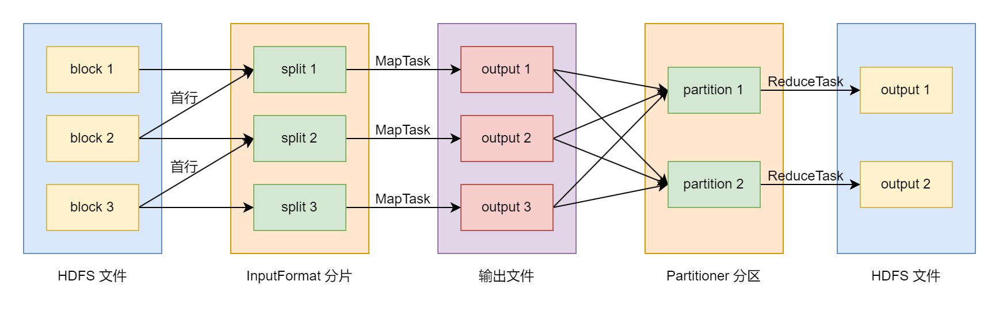
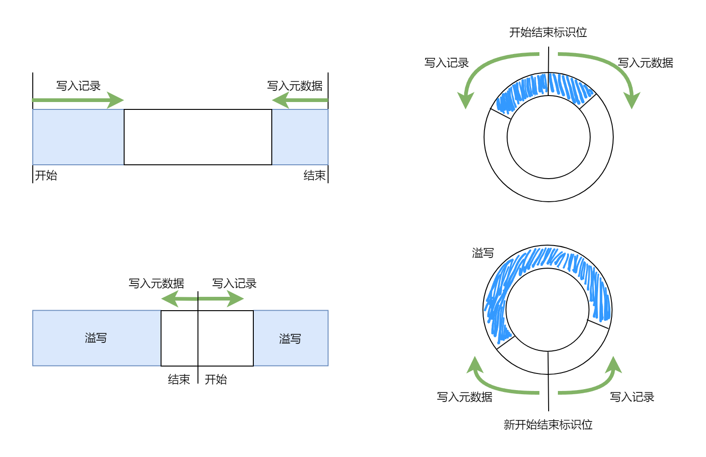

# Hadoop 和 MapReduce 简介

[TOC]

## 一、引言

### 1.1 大数据 引言

随着 移动互联网业务 以及 各行各业信息化项目 的不断发展, 我们日常的生活已经离不开计算机设备了。在这个过程会产生大规模的数据, 例如: 大型互联网平台 (电商平台, 影音平台, 社交媒体平台) 的业务数据; 银行金融业的交易理财数据; 政务系统的人口库和法人库; 大型企业的 CRM, ERP, Billing 以及供应链管理系统; 制造业工厂的生产数据; 文本搜索引擎 等等。

我们将分析处理大规模数据称为 **大数据** (big data)。从广义上来说, 大数据 技术指的是从海量的高增长, 多类别, 低信息密度的数据中挖掘出高质量的信息。从狭义上来说, 大数据 技术指的是用 "分布式技术" 处理海量的数据。

当业务系统的数据量非常大时, 我们不能将数据都 "集中" 在一台计算机设备上进行存储和计算, 而会将数据 "分布" 在多台计算机设备上。这样可以降低存储风险, 提高运算效率。因此, "分布式技术" 指的是用 "多台" 计算机设备进行数据的存储和计算。

**集群** (cluster) 指的是 一组 (多台) 相互独立的计算机, 利用高速通信网络相连, 协同对外提供服务的系统。集群中的单台计算机称为 **节点** (node), 所有节点之间可以彼此通信, 协同向用户提供服务。当用户请求集群系统时, 集群给用户的感觉就是一个单独的服务器。因此我们可以说, 大数据技术就是使用集群进行大规模数据的存储和计算。

那么, 对于 大数据集群 来说, 每一个节点运行什么 进程 (程序) 呢? 不同 节点 之间的 进程 如何通讯呢? 这些都由 "大数据框架" 来决定。

### 1.2 Hadoop 引言

目前主流的 "大数据框架" 是 **Hadoop**, 其由 Doug Cutting 于 2006 年在雅虎正式发布并开源, 可以说是元老级别的框架了。Hadoop 框架由三个 组件 (部分) 组成, 分别是:

+ **HDFS** (Hadoop Distributed File System): 分布式文件系统
+ **YARN** (Yet Another Resource Negotiator): 分布式资源调度系统
+ **MapReduce**: 分布式计算系统

其中, HDFS 组件是用于进行 分布式数据存储, YARN 组件用于进行 分布式数据计算, 而 MapReduce 组件则是基于 YARN 实现的一个 分布式计算 框架。

在 Hadoop 2.0 版本之前, 只有两个组件: HDFS 和 MapReduce。其中, HDFS 组件是基于谷歌的论文 [The Google File System](https://research.google/pubs/the-google-file-system/) 实现的, 用于大规模数据的存储; MapReduce 组件是基于谷歌的另一篇论文 [MapReduce: Simplified Data Processing on Large Clusters](https://research.google/pubs/mapreduce-simplified-data-processing-on-large-clusters/) 实现的, 用于大规模数据的计算。

然而, 在 Hadoop 2.0 版本之后, 从原本的 MapReduce 组件中拆分出来了 YARN 组件和新的 MapReduce 组件。YARN 组件只负责分布式运算的资源调度, 我们可以基于 YARN 组件实现各式各样的 分布式计算框架, 新的 MapReduce 组件就是其中之一。除此之外, Spark 和 Flink 都有基于 YARN 组件实现的版本。可以这么说, YARN 组件很大程度上巩固了 Hadoop 在大数据软件生态圈的地位。

下面, 我们简单了解一下大数据软件生态圈:

**HBase** 是基于谷歌论文 [Bigtable: A Distributed Storage System for Structured Data](https://research.google.com/archive/bigtable.html) 和 Hadoop 实现的 NoSQL (Not Only SQL) 的 KV 型数据库。**Hive** 则是基于 Hadoop 实现的 大规模结构化数据管理 系统, 其基于 MapReduce 组件提供了类 SQL 编程范式, 让用户可以使用 SQL 管理和分析大规模结构化数据。

**Spark** 和 **Flink** 是分布式内存计算框架。Hadoop 的 MapReduce 组件在计算过程中会涉及到大量的硬盘 IO 操作, 其特点是 内存消耗低, 计算速度慢。而 Spark 和 Flink 主要在内存中进行计算, 他们的特点是 内存消耗大, 计算速度快。这是两类计算框架最大的区别。Spark 和 Flink 都可以在 Hadoop 的 YARN 集群上运行, 很好地兼容了 Hadoop 框架。两者的区别在于, Spark 更加擅长机器学习, 提供了 `MLlib` 库; 而 Flink 则更加擅长实时流计算。

至此, 你应该对 大数据软件生态圈 有一个大致的印象了。

Hadoop 是基于 Java 开发的, 同时 Java 是跨平台的, 那么理论上来说 Hadoop 应该是一个跨平台的框架, 可以在各种系统中运行。但是, 一般情况下, 我们默认 Hadoop 的运行环境是 Linux 系统。如果在 Windows 环境下运行, 需要额外添加 [winutils](https://github.com/cdarlint/winutils) 相关内容, 不然会报错。

不仅如此, Hadoop 的很多设计都是借鉴 Linux 系统的。如果你熟悉 Linux 系统, 那么学习 Hadoop 会简单很多。也正是因为此, 网上很多大数据课程会前置 Linux 操作的相关内容。

本文主要介绍 Hadoop 的相关概念, 为后续学习其他的大数据框架打好基础。下面, 就让我们开始吧 ~

### 1.3 核心思想

Hadoop 框架的核心设计思想有两个: 一个是 **主从架构** (Master-Slave Architecture), 一个是 **分治法** (divide and conquer)。

在 **主从架构** 中, 我们可以将运行的进程分为三类:

+ **从进程** (slave / worker): 实际干活的进程
+ **主进程** (master): 负责管理从进程, 对用户提供相关服务
+ 辅助进程: 辅助 主进程 和 从进程 的运行

其中, **主进程** 和 **从进程** 是整个架构的核心, Hadoop 三大组件的运行方式都采用了这种结构。

**分治法** 则是将一个 大任务 分解成若干个互不影响的 小任务, 然后让这些 小任务 并行执行, 得到结果。

上述的描述非常地抽象, 下面让我们具体看一看 Hadoop 是如何使用这两个思想来解决问题的。

## 二、HDFS 组件介绍

### 2.1 简介

HDFS 的全称是 Hadoop Distributed File System, 翻译过来就是 Hadoop 分布式文件系统。主要用途是 "分布式数据存储"。

当服务器的硬盘空间不够用时, 一般情况下, 我们首先想到的是给服务器挂载一个新的硬盘。除此之外, 还有另一种方案: 将文件拆成多个部分, 每一个部分存储在不同的服务器中, 这就是 "分布式数据存储" 的核心思想。

我们将文件拆成的每一个 "部分" 称为 **block**。block 的大小是可以调节的, 默认情况下是 128 MB。如果文件的大小是 1 GB, 那么我们会将文件拆分成 $1024 \div 128 = 8$ 个 block, 每个 block 存储在不同的服务器节点上。如果文件大小不能整除, 多出来的部分单独作为一个 block。

不仅如此, HDFS 还提供了文件备份的功能。默认情况下, 一个文件会存储三次, 也就是说有两个备份。如果一个文件被分成 8 个 block, 那么实际上会存储 $3 \times 8 = 24$ 个 block。HDFS 会保证同一个 block 存储在不同的服务器节点之上, 以保证数据的安全性和可靠性: 当某个服务器节点出现故障时, 其它服务器节点上的数据还可以使用。

那么, 在这种场景下, 集群中大部分节点的功能是存储数据。我们将这些节点称为 **从节点**。很明显, 对于数据存储这个任务而言, 一个 **从节点** 上只要运行一个进程, 完成用户的数据存储需求即可。我们给这些进程起一个名字: **DataNode**。

除此之外, 我们还需要另一个进程, 其负责管理文件 block 存储到哪些 **从节点** 上, 这些进程的名称是 **NameNode** 主进程。一般情况下, 一个 HDFS 集群中, 活跃的 NameNode 主进程只有一个。我们将运行 NameNode 主进程的节点称为 **主节点**。

很明显, 在 HDFS 集群中, 主从架构主要由 NameNode 和 DataNode 组成。

我们知道, 无论是 Windows 的 NTFS 文件系统, 还是 Linux 的 EXT4 文件系统, 文件都是以 树状/层次化 的形式进行管理的, 我们将文件所在的层级称为 **文件目录** (directory) 或者 **文件夹** (folder)。举例来说, 如果一个文件的路径是: `/data/model/bert.ckpt`, 那么 `/data/model` 就是 文件目录, `bert.ckpt` 就是文件名。

HDFS 组件提供了 Linux 的 EXT4 相似的文件管理方式, 包括但不限于: 层级目录管理, 用户和用户组设置, 权限管理, 客户端 (shell) 指令 等等。NameNode 主进程 的一个重要功能就是维护这样一个文件系统。

不仅如此, HDFS 组件还提供了类似 FTP 的通讯协议。比方说: `hdfs://192.168.0.1:8020/test-dir/test-file.txt` 的含义如下:

+ `hdfs://` 是协议名称
+ `192.168.0.1` 是 NameNode 主节点服务器
+ `8020` 是 客户端 和 NameNode 之间的通讯端口
+ `/test-dir/test-file.txt` 表示文件在 HDFS 上的路径
+ `/test-dir/` 是文件目录
+ `test-file.txt` 是文件名称。

在 1.1 节中, 我们说过, 集群设计的一个特点是: 让用户感觉不到多个服务器的存在。因此, 客户端 和 HDFS 集群的每一次交互都要先通过 NameNode 主进程。下面, 我们来了解一下 客户端 存储文件到 HDFS 集群的流程, 看看 NameNode 和 DataNode 分别做了哪些事情:

1. 客户端 向 NameNode 发送上传数据的请求
2. NameNode 审核权限, 判断存储路径是否合法, 确定 DataNode 剩余硬盘空间, 如果条件不满足, 向 客户端 返回异常
3. NameNode 计算文件存储所需要的 block 数, 确定 block 存储的 DataNode, 返回给 **客户端**
4. 我们假设 block_a 需要存储在 datanode_1, datanode_2 和 datanode_3 三个节点上
5. 客户端将 block_a 的数据发送给 datanode_1
6. datanode_1 在接收到数据后, 本地存一份, 并发送给 datanode_2
7. datanode_2 在接收到数据后, 本地存一份, 并发送给 datanode_3
8. datanode_3 在接收到数据后, 本地存储一份, 然后将确认信息返回给 datanode_2
9. datanode_2 将确认信息返回给 datanode_1, datanode_1 将确认信息返回给 客户端
10. 对于文件的每一个 block 块, 执行 4 - 9 步, 直至完成
11. 写入完成后, 客户端 将信息发送给 NameNode, NameNode 做元数据记录工作

需要注意的是, NameNode 不负责数据的传输和写入, 只负责 管理 DataNode 和 维护 HDFS 文件系统。客户端是直接向 DataNode 写入数据的, 不通过 NameNode 转发, 同时数据备份是在 DataNode 之间传输完成的。

客户端 从 HDFS 集群中读取数据的过程则相对简单, 流程如下:

1. 客户端 向 NameNode 申请读取某文件
2. NameNode 判断文件是否存在, 审核权限, 返回存储文件 block 的 DataNode 列表
3. 客户端 拿到列表后依次找 DataNode 读取数据

至此, 你应该对 HDFS 有一个大致的了解了。如果我们将 EXT4 文件系统分为 "前端" (层级目录管理, 用户 和 用户组 设置, 权限管理 等等) 和 "后端" (数据在磁盘中的存储方式, 如 superblock, group descriptor, block bitmap, inode bitmap, inode table 等等概念) 两部分的话, 那么 HDFS 拥有和 EXT4 相似的 "前端", 而后端则变成了 "分布式文件存储"。

总结一下, 在 HDFS 主从架构中, 两类进程的主要功能有:

+ NameNode: 和客户端之间进行交互, 维护 HDFS 文件系统, 记录每一个文件 block 存储在哪些 子节点 上
+ DataNode: 负责将数据存储到 从节点 上, 记录每一个文件 block 对应的本地文件路径

那么, 在 HDFS 中有辅助进程吗? 答案是有的: SecondaryNameNode, 帮助 NameNode 主节点 "管理" HDFS 文件系统。在 NameNode 中, 我们将 维护 HDFS 文件系统的数据称为 **元数据**, 其主要由两个文件构成: `edits` 和 `fsimage`。`edits` 文件是一个流水账文件, 记录 HDFS 中的每一次操作。当操作数量非常多时, `edits` 文件的数据量会非常大, 这样不利于文件系统的维护。因此, 我们每隔一段时间需要对 `edits` 文件进行合并和压缩。合并和压缩后的文件就是 `fsimage`, 这个过程由 SecondaryNameNode 完成。

### 2.2 NameNode 内存消耗

从上面可以看出, DataNode 的主要功能是存储数据, 因此 硬盘 空间越大越好。而 NameNode 的主要功能是管理 DataNode 和维护 HDFS 文件系统, 我们期望其 内存 越大越好。那么, 我们如何估算 NameNode 内存消耗呢? 下面是业界内的 "经验规则":

NameNode 主节点中 1 GB 的内存可以管理一百万个 文件 block 的元数据。

下面, 让我们根据上面的 "经验规则" 举一个具体的例子:

假设现在有 200 个 DataNode 从节点, 每一个节点能够存储 24 TB 的数据量。我们配置的 HDFS 集群每一个文件会存储 3 份, 同时文件 block 大小是 128 MB。需要注意的是, 这里的 128 MB 表示的是文件 block 的最大值。假设集群中存储的文件 block 都达到了最大值 128 MB, 也就是说, 没有小于 128 MB 的文件 block, 那么此时一共可以存储 $\frac{200 \times 24 \times 10^6}{128 \times 3} = 12.5 \times 10^6$ 个文件 block。我们知道, 一百万 ($10^6$) 个文件 block 对应 1 GB 的 NameNode 主节点内存, 那么此时 NameNode 主节点上至少需要约 12.5 GB 的内存。

需要注意的是, 12.5 GB 是最小的内存要求。实际在使用时, 我们不可能保证每一个文件 block 都是 128 MB, 也就是说能够存储的文件 block 是更多的, NameNode 需要的内存也是更多的。

我们对于 "小文件" 的定义是 文件大小 远远小于 block 的大小。也就是说, 在你存储 "小文件" 时, 一个文件对应一个 block 块。当你在 HDFS 集群中存储大量小文件时, 虽然硬盘空间是足够的, 但是 NameNode 主节点的内存很容易爆炸。因此我们说, HDFS 是针对 "大文件" 设计的系统, 如果有大量的 "小文件", 建议想办法合并压缩成一个 "大文件"。

如果 HDFS 集群上已经有很多 "小文件" 了, 可以使用 Hadoop 提供的 [Archives](https://hadoop.apache.org/docs/current/hadoop-archives/HadoopArchives.html) 工具对它们进行 "打包"。

额外补充一下, NameNode 主节点的数量也是可以有多个, 其分为 "纵向" 和 "横向" 两个扩展方式:

我们在使用 HDFS 集群时, 无法保证 NameNode 一定不会出问题, 此时我们可以使用 [zookeeper](https://zookeeper.apache.org/) 部署几个 "备用" (standby) 的 NameNode。当 "活跃" (active) 的 NameNode 出现问题无法运行时, "备用" 的某一个 NameNode 会变成 "活跃" 状态, 接管整个 HDFS 集群。我们将这种称为 "高可用" (High Availability), 也称为 "纵向" 的扩展方式。

如果 HDFS 的 DataNode 过多, 那么对 NameNode 的压力也是非常大的。按照上面的例子, 如果现在有 5000 个 DataNode, 那么 NameNode 至少要 $\frac{5000}{200} \times 12.5 = 312.5 \mathrm{GB}$ 的内存, 这对于单个节点压力有些大。HDFS 提供了 [联邦机制](https://hadoop.apache.org/docs/current/hadoop-project-dist/hadoop-hdfs/Federation.html), 让多个 NameNode "共同" 管理 HDFS 集群。我们将其称为 "横向" 的扩展方式。下面, 我们简单介绍一下 HDFS 联邦相关的内容。

我们知道, 在 Windows 的 NTFS 中, 文件路径包含一个 磁盘 (设备/驱动器) 名称。比方说: `D:/home/working/hadoop/notes.md`, 其中: `D` 是磁盘名称, `/home/working/hadoop` 是文件目录名称, `notes.md` 是文件名称。而在 Linux 的 EXT4 中, 磁盘 会 "挂载" 到一个具体的文件夹之上, 如果这个文件夹是 `/D`, 那么此时的文件路径是 `/D/home/working/hadoop/notes.md`。HDFS 采用了相似的策略来管理多个 NameNode, 此时 `D` 不是 磁盘名称, 也不是 挂载的文件夹, 而是 namespace。

在 HDFS 联邦中, 我们可以配置多个 NameNode 主节点, 并且给每一个 NameNode 起一个 namespace 名称。对于每一个 NameNode 而言, 其 namespace 必须是文件目录的前缀。举例来说, 如果一个 NameNode 主节点的 namespace 是 `projects`, 那么其管理的文件目录开头必须是 `/projects/`, 否则会报错。

然后, 所有的 NameNode 管理的 DataNode 从节点是共享的, 或者说 DataNode 从节点需要向所有的 NameNode 主节点进行注册。也就是说, 对于 `/projects/bert-cls/main.py` 这个文件而言, 数据依然存储在集群的某些从节点中, 只是其 元数据 存储在 `projects` 这个 NameNode 上。这和我们一般的认知是不同的: 在 NTFS 文件系统中, 不同的磁盘名称会区分不同的存储空间; 而在 HDFS 中, 不同的 namespace 区分不同的 namenode 元数据 管理。由于集群中的 DataNode 由多个 NameNode 管理, 我们称其为 "联邦"。

举例来说, 假设现在集群中需要部署两个 NameNode 主节点, IP 地址是 `192.168.0.1` 和 `192.168.0.2`, namespace 分别是 `projects` 和 `data`。那么, 此时集群中文件的通讯地址前缀必须是 `hdfs://192.168.0.1:8020/projects/` 或者 `hdfs://192.168.0.2:8020/data/`。如果你向 `192.168.0.2` 节点上请求 `/projects/` 下的文件, 也就是通讯前缀是 `hdfs://192.168.0.2:8020/projects/`, 那么 NameNode 就会返回错误信息, 无法识别。

这样使用起来会非常麻烦, 我们需要将 NameNode 主机名称和 namespace 对应起来才可以。HDFS 组件提供了 [ViewFS](https://hadoop.apache.org/docs/current/hadoop-project-dist/hadoop-hdfs/ViewFs.html), 其是 客户端 侧的映射表, 可以自动帮助我们完成映射。至此, 你应该对 HDFS 的 NameNode 有一个大致的了解了。

## 三、YARN 组件介绍

### 3.1 YARN 集群的 "主从架构"

YARN 的全称是 Yet Another Resource Negotiator, 翻译过来是 新一代资源调度系统。这里的 "新一代" 是相较于 Hadoop 2 之前的版本而言的。需要注意的是, 在 JavaScript 中, 也有 [yarn](https://yarnpkg.com/) 名词, 其表示的是 包管理器 (package manager)。两者除了名称相同外没有任何关系, 不要弄混淆了。

这里的 "资源" 指的是 "计算机硬件资源", 包括 CPU, 内存, 硬盘 IO, 网络 IO 等等。YARN 组件的主要功能是管理集群节点的 CPU 和 内存 资源, 并将这些资源抽象成一个新的概念: **容器** (container)。我们可以这样理解: **容器** 内包含计算机的 CPU 资源和内存资源, 可以供单个进程使用。

YARN 集群的主要作用是进行分布式运算。我们可以这样理解整个流程: **客户端** 将 **计算任务** 提交给 YARN 集群, YARN 集群进行分布式计算, 计算完成后将结果返回给客户端。我们将这里的 **计算任务** 称为 **Application** 或者 **Job**。

一个 计算任务 能够进行 分布式运算 的前提是它可以拆分成多个互不影响的 **子任务**, 我们将 **子任务** 称为 **Task**。也就是说, 一个 Job 由多个 Task 组成。在 YARN 集群中, 所有的 Task 都是以单个 **进程** 的方式运行的。

Task 进程在运行的过程中需要消耗 "资源", 那么 YARN 集群是怎么给 Task 分配具体的运行 "资源" 的呢? 答案是通过 **容器**。我们可以这样说, 所有的 Task 都是在 容器 中运行的。

那么, 我们进一步明确 YARN 集群的功能: 将集群中每一个节点上的 "资源" 划分成多个 容器, 当有 客户端 提交 Job 时, 给每一个 Task 分配对应的 容器 运行程序。

YARN 集群的运行主要依靠两种节点: 一个是 **从节点**, 也就是 Task 实际执行的节点; 一个是 **主节点**, 其主要功能是给每一个 Task 分配具体的执行 **从节点**。我们将 **主节点** 上运行的进程称为 **ResourceManager**, 将 **从节点** 上运行的进程称为 **NodeManager**, 这两类进程的功能如下:

+ ResourceManager: 和 客户端 之间进行交互, 负责 Job 的调度管理, 给每一个 Task 分配具体的执行从节点
+ NodeManager: 将 从节点 的 "资源" 划分成多个容器, 在容器中启动 Task 进程, 并监控 Task 进程是否执行完成

和 HDFS 一样, 在 YARN 集群中, 活跃的 主节点 只有一个, 每一个 从节点 也只需要运行一个 NodeManager 进程即可。那么, 当我们同时部署 HDFS 和 YARN 集群时, 怎么进行 节点 分配呢?

一般情况下, 我们采取的方式是 "计算向数据移动"。举例来说, 假设运行某一个 Task, 其需要用到的文件 block 在从节点 `node1` 上有数据。那么, ResourceManager 会优先将这个 Task 分配给 `node1` 运行。如果 `node1` 上的资源都被占用了, 再考虑分配给其它 从节点 运行。这样, 可以最小化网络 IO 的消耗。

也就是说, 一般情况下, HDFS 集群和 YARN 集群是共享 从节点 的。如果一个集群中有 20 个节点, 那么我们会分配 1 个节点作为 HDFS 集群的主节点, 运行 NameNode 进程, 再分配 1 个节点作为 YARN 集群的主节点, 运行 ResourceManager 进程, 剩下的 18 个节点作为 从节点, 同时运行 DataNode 进程和 NodeManager 进程。这样, 一个最简单的 Hadoop 部署方式就完成了。

上面这种部署方式在 业界 有一个专门的名词: "存算一体"。除此之外, 还有 "存算分离", 即 HDFS 集群和 YARN 集群的 从节点 是分开的, 这样的好处是两个集群互不影响, 缺点是对网络 IO 的要求非常高。

### 3.2 "计算资源" 的真实含义

在上一节中, 我们了解了 YARN 组件的基础概念, 并将 "计算机硬件资源" 简单地抽象成 "容器" 的概念。这一节我们来具体地了解一下 YARN 是如何管理集群的 CPU 和 内存 资源的。

先明确一点, YARN 集群不会给 Task 程序 "估算" CPU 和 内存 消耗, 而是根据 客户端 提交的配置来分配资源。如果 Task 在运行的过程中内存消耗超出了配置的大小, 那么就会报错, 最终导致 Job 执行失败。

一般情况下, 开发者是很难精准地控制程序运行的 CPU 资源, 比方说, 程序在第几个 CPU Core 上运行, 运行时具体占用几个 CPU Core 等等。这些内容是由 CPU 自身的调度策略 和 操作系统的调度策略 共同决定的。开发者通常能做到的事情有:

+ 编写 "多进程/多线程" 代码, 此时能够控制的仅仅是 进程/线程 的数量
+ 运行程序时, 通过 `nice` 或者 `renice` 指令调整程序的 "优先级"

既然程序层面很难控制 CPU 资源, YARN 组件提出了一个新的概念: **vcore** (virtual CPU core)。虽然它的名字中有 CPU Core 的字样, 但是其实和 CPU Core 之间没有任何关系, 我们可以将其理解为 "并发能力" 的描述, 属于手动配置的内容。如果给一个 从节点 配置了 100 个 vcore, 那么就意味这这个 从节点 最多同时启动 100 个 "容器" 运行 Task 进程。至于这个 从节点 上实际有多少个 CPU Core, YARN 组件完全不关心; 这 100 个 Task 进程如何在 CPU 上的执行, 由 操作系统 决定, YARN 组件不会进行干涉。

客户端在提交 Job 时, 会配置运行一个 Task 需要的 vcore 数量, 默认值为 1。需要注意的是, 一般情况下, 占用 1 个 vcore 的 Task 和 2 个 vcore 的 Task 运行时是 "平等" 的关系。给 Task 配置更多的 vcore 只会阻止 ResourceManager 给 从节点 分配更多的 Task 程序, 并不能保证其一定能运行地更快, 占用更多的 CPU 资源。

在某些场景下, 我们期望 vcore 数量和 从节点 实际的 CPU 资源能够 "强相关"。YARN 组件也提供了相关 [功能](https://hadoop.apache.org/docs/current/hadoop-yarn/hadoop-yarn-site/NodeManagerCgroups.html), 使用 [CGroups](https://www.kernel.org/doc/html/latest/admin-guide/cgroup-v1/cgroups.html) 将 vcore 数量和 CPU 使用率 "强相关", 确保占用更多 vcore 的 Task 进程能有更多的 CPU 使用率。

了解完成 CPU 资源后, 我们看看 YARN 组件是如何管理 内存 资源的。根据 [文档](https://hadoop.apache.org/docs/current/hadoop-yarn/hadoop-yarn-site/NodeManagerCGroupsMemory.html) 中的说法, 主要有两种策略:

+ polling 策略: NodeManager 每隔一段时间检查一遍所有的 Task 进程, 如果超出了配置的内存限制, 就将其 kill 掉
+ cgroups 策略: NodeManager 通过 cgroups 管理 Task 进程的内存, 其分为 strict/hard 和 elastic/soft 两种方式

YARN 组件默认采用 polling 策略, 其有一个潜在的风险, 那就是 NodeManager 无法及时 kill 掉使用超出内存限制的 Task 进程, 会有一定的延迟。在极端情况下, 会导致 从节点 崩溃掉。使用 CGroups 就不会存在这样的问题。

至此, 你应该对 YARN 组件中的 "容器" 有一个大致的了解, 它是一个抽象的概念。我们通常说, NodeManager 启动 "容器" 来运行 Task 程序。实际上就是, NodeManager 启动新的 进程 执行 Task 程序, 并进行如上所说的限制。需要注意的是, 一个 "容器" 对应一个独立的 JVM 进程, 并不是 NodeManager 内部的线程。

如果你对 YARN 组件实现的 "容器" 不满意, 可以将其替换成 Docker 容器。也就是说, 我们可以在 Docker 容器中运行 Task 程序, 更多内容可以参考 [文档](https://hadoop.apache.org/docs/current/hadoop-yarn/hadoop-yarn-site/DockerContainers.html)。

Linux 中的 CGroups 是一个强大的工具, 它可以限制程序运行的 CPU 使用率, 内存消耗, 磁盘 IO 等等内容。其涉及到很多 Linux 内核的知识, 本文就没有介绍了。额外补充一点, Docker 容器的实现也是基于 CGroups 的。

### 3.3 Job 调度器

上一节主要介绍了 NodeManager 如何管理 从节点 上的 CPU 和 内存 资源。下面, 让我们来看看 ResourceManager 如果管理整个集群上的 CPU 和 内存 资源。

在默认情况下, YARN 集群认为所有的 从节点 硬件架构是相同的, 有 8 个 vcore 和 8 GB 的内存。此时, 我们只需要保证每一个 从节点 上 物理内存 和 虚拟内存 (swap) 大小之和 大于 8 GB 即可。如果客户端在提交 Job 时没有配置 Task 的资源消耗, YARN 集群默认一个 Task 消耗 1 个 vcore 和 1 GB 的内存。

那么, 当 ResourceManager 有一组 Job 需要执行时, 这些 Job 是按照什么顺序执行的呢? 这就涉及到另一个话题: 调度器 (scheduler) 了。

最经典的调度策略就是 FIFO (First In First Out) 了。ResourceManager 将所有的 Job 放入 "队列" 数据结构中。如果集群中有剩余的计算资源, 那么 ResourceManager 就会从 "队列" 中取出下一个 Job, 分配 从节点 执行 Task 程序。此时, 先提交的 Job 就会先执行, 按照提交顺序一个一个往下执行, 和我们日常生活中的 "排队" 是相似的。

需要注意的是, 当 ResourceManager 给某一个 Job 分配完成计算资源后, 如果集群中还有剩余的计算资源, 那么它不会等待当前的 Job 执行完成后再去给下一个 Job 分配资源执行, 而是直接给下一个 Job 分配计算资源。此时, 两个 Job 是 "并行" 运算的! 因此在这里, 我们不能够说 FIFO 策略是 "串行" 策略。

我们将占用的计算资源很少, 运行速度很快的 Job 称为 "小任务"; 与之相对的 "大任务" 就是占用的计算资源多, 运行速度较慢的 Job。按照上面 FIFO 的策略, 可能会出现下面的问题:

在提交某一个 "小任务" 时, 如果前面有一些 "大任务", 占用了全部的计算资源, 那么 "小任务" 要一直等待, 直到前面的 "大任务" 执行完成才能开始运行, 此时执行时间会特别长。换言之, "小任务" 执行时间长不是其本身的原因, 而是排队等待造成的结果。因此, 我们常说, FIFO 策略对 "小任务" 不友好; 或者说, FIFO 策略有可能会产生 Job 等待执行时间过长的问题。

如何解决这一问题呢? 方式有很多, 比方说: 给每一个 Job 设置一个最大使用资源阈值, 当 Job 达到这个阈值后, 不再给它分配资源了, 而是给后续的 Job 分配资源去执行。YARN 中提供了以下两种策略:

一种是 "多队列" 策略。我们预先设定多个 "队列", 并为每一个 "队列" 设定一个计算资源阈值, 称为 **capacity**。每一个 "队列" 中所有 Job 使用的计算资源总和不能超过 capacity。假设我们设置了 5 个队列, 每一个 "队列" 的 capacity 都是集群总资源的 20%, 且每一个 "队列" 中都有 Job, 那么此时集群中至少有 5 个 Job 在同时运行。ResourceManager 会将新提交的 Job 放入 "最空闲" 的 "队列" 中, 以保证这个这个 Job 能够尽快执行。需要说明一点, 这里的 "最空闲" 指的是 "队列" 中 Job 占用资源最少, 而不是执行时间最短 (我们很难衡量 Job 的执行时间)。这样, 我们通过 "队列" 的阈值实现了对 Job 占用资源的限制。

这里说一个非常坑的地方。在默认配置中, ResourceManager 只会根据 "内存" 来计算 Job 使用的计算资源, 并默认所有的 Task 只占用一个 vcore。此时, 客户端 提交的 vcore 数量配置是无效的。我们用下面的例子看看 ResourceManager 如何计算 Job 消耗的计算资源: 如果一个 Job 有 20 个 Task, 每一个 Task 需要 1 GB 的内存, 那么这个 Job 所需的计算资源就是 20 GB; 如果集群中所有 从节点 的 "内存" 资源之和是 200 GB, 某一个 "队列" 的 capacity 为 20%, 那么这个 "队列" 中所有 Job 占用的 "内存" 之和不能超过 $200 \times 0.2 = 40$ GB。

当然, YARN 集群中提供了配置 (DominantResourceCalculator), 会同时根据 vcore 和 "内存" 来计算 Job 使用的计算资源, 此时 客户端 提交的 vcore 数量配置才会生效。那么, 此时是如何计算资源消耗的呢, 我们来看下面的例子:

假设集群中一共有 100 个从节点, 每一个 从节点 有 32 GB 的 "内存" 和 8 个 vcore。那么, 集群一共有 3200 GB "内存" 和 800 vcore 的计算资源。现在有一个 Job, 一共有 10 个 Task, 每一个 Task 需要消耗 2 个 vcore 和 4 GB 的内存, 那么其需要消耗多少的计算资源呢? 首先, 我们计算 Job 所需内存 占 集群总内存 的 百分比: $4 \times 10 \div 3200 = 1.25 \%$; 然后, 我们计算 Job 所需 vcore 占 集群总 vcore 的百分比: $2 \times 10 \div 800 = 2.5 \%$; 最后, 我们比较两者的大小, 发现 vcore 的值更大, 那么我们说这个 Job 是计算密集型的, 所需要的计算资源为 2.5。

简单来说, DominantResourceCalculator 将 "内存" 和 vcore 两种资源都转化为百分比, 然后取较大的哪一个作为 Job 的计算资源。相比较而言, 这种方式更加合理。

另一种是 "公平" 策略。其核心思想是所有的 Job "均分" 集群中的计算资源。如果现在有 10 个 Job 需要执行, 那么给每一个 Job 分配集群总资源的 10%, 让所有的 Job 都 "并行" 执行, 忽略 Job 提交的先后顺序。也正是因为此, 我们称其为 "公平"。

当然, 上面的 "均分" 方式是有缺陷的, 那就是某些 Job 使用的计算资源可能不到 10%, 这样会造成资源的浪费。我们实际上使用的是 最大-最小公平分配算法 (max-min fairness), 整体的流程如下:

1. 我们设一共有 $n$ 个 Job, 集群的总计算资源为 $S$
2. 对每一个 Job, 计算其完成执行需要消耗的总资源, 然后从小到大排序, 排序完成后记作 $p_1, p_2, \cdots, p_n$
3. 按照均分的思想, 此时每一个 Job 应该分得 $\frac{S}{n}$ 的资源, 我们比较其和 $p_1$ 的大小
4. 如果 $\frac{S}{n}$ 大于 $p_1$, 那么流程结束, 每一个 Job 分得 $\frac{S}{n}$ 计算资源
5. 如果 $\frac{S}{n}$ 小于 $p_1$, 那么第一个 Job 分得的计算资源就是 $p_1$, 计算剩余 Job 能够使用的计算资源
6. 按照均分的思想, 此时剩下的 Job 应该分得 $\frac{S - p_1}{n - 1}$ 的资源, 我们比较其和 $p_2$ 的大小
7. 如果 $\frac{S - p_1}{n - 1}$ 大于 $p_2$, 那么流程结束, 剩下每一个 Job 分得 $\frac{S - p_1}{n - 1}$ 计算资源
8. 如果 $\frac{S - p_1}{n - 1}$ 小于 $p_1$, 那么第二个 Job 分得的计算资源就是 $p_2$, 计算剩余 Job 能够使用的计算资源
9. 重复执行 6 - 8 步, 直至遍历完成所有的 Job

整体的思想很简单, 我们优先给资源占比小的 Job 分配资源, 每一次分配完成后将剩下的资源再 "均分"。整个方案可以看作是 "均分" 方案的扩展。

那么, 当有客户端提交新的 Job 时, 集群的计算资源都已经被占满了, 此时新的 Job 如何执行呢? 答案是需要等待, 当有 Task 进程运行完成时, ResourceManager 会优先给新的 Job 分配资源。举例来说, 现在有两个特别消耗资源的 Job, 整个集群给他们运行都不够用。我们将这两个记作 Job1 和 Job2。当 Job1 提交给集群时, 集群内部没有其它 Job 在执行, 那么整个集群资源都被这个 Job 占用了。当 Job2 提交给集群时, 按照 "均分" 的思想, 每一个 Job 应该占用 50% 的计算资源。此时, 集群内所有的容器都在执行 Job1 的 Task 程序。当有 Task 程序执行完成后, ResourceManager 不会把容器分配给 Job1, 而是会分配给 Job2, 直到 Job1 和 Job2 各占一半的计算资源后, ResourceManager 才会给 Job1 继续分配容器执行。我们可以看出, 整个过程是动态调整的。

和 "多队列" 策略一样, "公平" 策略默认也是只使用 "内存" 来计算 Job 消耗的集群资源。如果我们同时考虑 vcore 和 "内存" 两种资源, 那么如何进行 "均分" 呢? 这就涉及到另一个算法: DRF ([Dominant Resource Fairness](https://static.usenix.org/event/nsdi11/tech/full_papers/Ghodsi.pdf)), 这里就不过多介绍了。YARN 集群是支持 DRF 算法的。

在 YARN 组件中, "多队列" 策略对应 **容量调度器** ([Capacity Scheduler](https://hadoop.apache.org/docs/current/hadoop-yarn/hadoop-yarn-site/CapacityScheduler.html)), "公平" 策略对应 **公平调度器** ([Fair Scheduler](https://hadoop.apache.org/docs/current/hadoop-yarn/hadoop-yarn-site/FairScheduler.html))。YARN 组件默认使用前者。

在这两个 调度器 中, 有两个概念: (1) 用户 (user), 有时也称为 租户 (tenant) 或者 组织 (organization); (2) 队列 (Queue), 这里所说的 队列 和上面所说的 队列 有所不同, 为了进行区分, 后文使用 Queue 表示 调度器 中的 队列。

对于 容量调度器 而言, 我们需要配置多个 Queue 以及他们的 capacity, 同时为每一个用户配置其可以使用的 Queue。当用户提交 Job 时, 调度器 会将其放入可以使用的 "最空闲" 的 Queue 中等待执行。同时, Queue 支持 树状层次化的管理方式; capacity 也支持 弹性调整 (elasticity), 即: 当集群资源有富裕时, 当前 Queue 消耗的计算资源可以超过 capacity 的限制, 如果其它 Queue 需要使用时还没有执行完成, 就直接 kill 掉超出限制部分的 Task 进程, 由 ResourceManager 安排重新执行。

对于 公平调度器 而言, Queue 仅仅是延用了 容量调度器 的说法, 我们可以将其理解为是一个 Job 列表。当用户提交 Job 时, 可以指定提交给哪一个 Queue, 如果没指定, 则按照 规则 (queuePlacementPolicy) 来确定。这里的 Queue 也可以设定 capacity, 但是不是为了 "并发" 执行, 而是为了限制 用户 能够使用的计算资源。对于单个 Queue, 我们还可以配置 调度策略 (schedulingPolicy), 包括 FIFO, Fair 和 DRF。其中, Fair 就是我们上面说的 "公平" 策略, 也是默认的策略。

至此, 你应该对 YARN 集群 ResourceManager 中的 调度器 有一个大致的了解了。

### 3.4 计算框架的 "主从架构"

对于 分布式计算 而言, 其有两套 "主从架构", 一套是 3.1 节介绍的 资源分配 "主从架构", 也就是 ResourceManager 和 NodeManager; 一套是本节要介绍的 实际计算 "主从架构": ApplicationMaster 和 Task。

在 3.1 节中, 我们说 "容器" 中运行的是 Task 进程。实际上除了 Task 进程外, 还有另外一种进程, 它就是 ApplicationMaster, 负责管理所有的 Task 进程。很明显, 此时 ApplicationMaster 进程是 "主进程", Task 进程是 "从进程"。

和 分布式存储 "主从架构" (NameNode & DataNode) 以及 资源分配 "主从架构" (ResourceManager & NodeManager) 不同, 实际计算 "主从架构" (ApplicationMaster 和 Task) 中没有 主节点 和 从节点 的概念了。因为这里的 "主从架构" 不再是以 节点 功能进行划分, 而是 Job 的 子任务 进行划分。

下面, 让我们看看 客户端 提交 Job 到 YARN 集群后整理的执行流程:

1. 客户端向 ResourceManager 发送运行请求, ResourceManager 返回一个新的 Job 执行 ID 以及 YARN 集群的一些配置信息
2. 客户端根据返回的 YARN 集群配置信息完善 Job 配置信息, 并将 Job 运行代码和配置文件等内容提交到 HDFS 集群上
3. 客户端正式向 ResourceManager 提交 Job, 请求执行
4. ResourceManager 分配一个从节点, 由 NodeManager 分配 容器 运行 ApplicationMaster 进程
5. ApplicationMaster 进程初始化 Job 运行参数, 确定 Task 子任务的数量
6. ApplicationMaster 向 ResourceManager 请求运行 Task 子任务
7. ResourceManager 通过 调度器 给每一个 Task 分配执行的 子节点, 由 NodeManager 分配 容器 运行 Task 进程
8. ApplicationMaster 监控所有 Task 进程的运行情况, 如果运行失败, 向 ResourceManager 申请重新分配子节点运行
9. 客户端每隔一段时间向 ApplicationMaster 查询 Job 执行的情况
10. 所有 Task 子任务执行完成后, ApplicationMaster 向客户端返回结果, 然后 NodeManager 释放 ApplicationMaster 进程

从上面可以看出, ApplicationMaster 进程非常重要, 其负责向 ResourceManager 申请运行 Task 进程的资源, 监控 Task 进程的执行情况, 同时向客户端返回执行情况和结果。

在 Hadoop 2 之前的版本, 是没有 YARN 组件的, 只有 MapReduce 组件。此时, 分布式运算的 "主从架构" 角色是 JobTracker 和 TaskTracker。JobTracker 相当于现在的 ResourceManager 和 ApplicationMaster 两个角色, TaskTracker 相当于现在的 NodeManager 角色。很明显, 当提交给集群的 Job 过多时, JobTracker 的压力非常大: 响应客户端的速度慢, 内存占用过多, 程序可能崩溃。

而在 Hadoop 2 以后的版本中, MapReduce 组件的定位变成了 计算框架, 其向用户提供了: (1) YARN 集群的客户端; (2) 分布式运算的编程模型。也就是说, 我们现在使用 Hadoop 进行分布式运算的流程是:

1. 部署 HDFS 集群和 YARN 集群
2. 按照 MapReduce "编程模型" 编写分布式计算代码
3. 使用 MapReduce 提供的 YARN 集群客户端提交 Job, 等待运行完成

如果 分布式运算 的输入是 大规模数据, 那么数据要先上传到 HDFS 集群中; 如果 分布式运算 的输出是 大规模数据, 那么运算结果也会保存在 HDFS 集群中。这样, 我们对 Hadoop 集群架构有一个大致的了解了。

## 四、MapReduce 简介

本章介绍 Hadoop 三大组件的最后一个: MapReduce 组件。在 3.4 节中, 我们已经给其一个非常明确的定位: 计算框架。现在, 让我们看看 MapReduce 的 运行原理 以及 编程模型。

### 4.1 编程模型

在 MapReduce 中, 所有的 "记录" 都是以 **二元组** 的形式呈现的。这里的 "记录" 可以是一段文本, 一张图片, 机器学习中的一个 "样本" 等等。我们将 **二元组** 的第一个元素称为 key, 第二个元素称为 value。

需要注意的是, 这里所说的 key & value 和我们平常使用的 mapping 数据结构 是完全不同的概念。常见的 mapping 数据结构有: Java 中的 `TreeMap` 和 `HashMap`, Python 中的 `dict` 等等。在这些数据结构中, key 值在集合中是唯一的, 不能够重复。而在 MapReduce 中, key 值是没有唯一性的限制, 我们可以简单认定它是 "二元组" 中第一个元素的称呼。

MapReduce 中只提供了两种运算方式: map 和 reduce。简单地说, map 运算就是逐条 "记录" 地去处理, 而 reduce 运算则是将 key 值相同的 "记录" 汇聚在一起进行处理。下面, 让我们来看看一个具体的例子:

假设我们现在要对一个大型的语料库进行 词频统计, 即统计每一个词语出现的次数。那么, 我们应该怎么做呢? 如果不采用 分布式运算 的方式, 我们可以用如下的 Python 脚本实现:

```python
import regex as re 

def tokenize(sentence: str) -> list[str]:
    return re.compile(r'\s+').split(sentence.strip())  # 根据 空白字符 进行分词

count_dict = dict()

with open('corpus.txt', 'r', encoding='utf-8') as reader:
    sentences = reader.readlines()

for sentence in sentences:
    words = tokenize(sentence)
    for word in words:
        count = count_dict.get(word, 0)
        count_dict[word] = count + 1
```

上述的思想很简单, 就是对句子进行分词, 然后用 `dict` 统计即可。那么, 如果要改成 分布式计算, 应该怎么做呢?

首先, 我们假设语料库是一个大型的文件, 其存储在 HDFS 集群中, 一行就是一个 "句子"。

然后, 我们采用 map 运算对每一个 "句子" 进行分词操作。此时: 输入 "记录" 的主体是 "句子", 我们设定输入 "记录" 的 key 是 "句子" 在文件中的 "行号", value 就是 "句子" 本身。而输出 "记录" 的主体就不再是 "句子" 了, 而是 "词语"。我们设定输出 "记录" 的 key 是 "词语" 本身, value 是 `1`。

最后, 我们采用 reduce 运算, 将相同 "词语" (key 值) 的 value 值加在一起, 就是我们需要的词语在预料库中出现次数。此时, 输入和输出的主体都是 "词语", 我们设定 key 是 "词语" 本身, value 是 "词语" 的频数。

下面, 我们结合代码来理解一下整个过程。Map 运算的代码如下:

```java
public static class TokenizerMapper extends Mapper<LongWritable, Text, Text, IntWritable>{
    private final static IntWritable one = new IntWritable(1);
    private Text word = new Text();

    @Override
    public void map(
            LongWritable key, Text value,  // 输入的单条 "记录"
            Context context                // 文件流
        ) throws IOException, InterruptedException {

        StringTokenizer itr = new StringTokenizer(value.toString());  // 分词
        while (itr.hasMoreTokens()) {
            word.set(itr.nextToken());
            context.write(word, one);  // 输出 "记录"
        }
    }
}
```

MapReduce 框架是采用 Java 进行编程的。我们实现 map 运算就是要实现一个 `Mapper` 类的子类, 在这里是 `TokenizerMapper`。在实现 `Mapper` 类的子类时, 最主要的事情就是重写 `map` 方法, 其功能是处理单个 "记录"。MapReduce 框架会自动帮助我们读取文件, 遍历每一个 "记录", 然后调用这里的 `map` 函数。

需要注意的是, 在 `map` 函数中, 输入 "记录" 是通过函数传递的, 而输出 "记录" 是直接写入到文本中的。我们可以将代码中的 `context` 对象简单理解为 文件流, 所有的 "记录" 都是通过其 `write` 方法实现输出的。此时, 你可能注意到了, 输出 "记录" 的数量可以是任意的, 没有必要和输入 "记录" 的数量相同。也正是因为此, 输入 和 输出 "记录" 的主体才能发生变化, 从 "句子" 变成了 "词语", 这提供了非常大的灵活性!

MapReduce 框架对 "记录" key 和 value 的类型进行了额外的封装, `int`, `long`, `float`, `double`, `String` 和 `null` 分别对应 `IntWritable`, `LongWritable`, `FloatWritable`, `DoubleWritable`, `Text`, `NullWritable` 类。它们都继承自 `WritableComparable` 类。如果你想自定义类型, 那么也要实现这个类的子类。

从 `Mapper` 后面指定的泛型可以看出, 这里输入 "记录" 的 key 类型是 `long`, value 类型是 `String`; 输出 "记录" 的 key 类型是 `String`, value 类型是 `int`。

这样, map 阶段代码就编写完成了, 其主要作用就是分词。下面, 让我们看看 reduce 阶段的代码:

```java
public static class IntSumReducer extends Reducer<Text, IntWritable, Text, IntWritable> {
    private IntWritable result = new IntWritable();

    @Override
    public void reduce(
            Text key, Iterable<IntWritable> values,  // 输入 "记录"
            Context context                          // 文件流
        ) throws IOException, InterruptedException {

        int sum = 0;
        for (IntWritable val: values) {
            sum += val.get();
        }
        result.set(sum);
        context.write(key, result);  // 输出 "记录"
    }
}
```

我们实现 reduce 运算就是要实现一个 `Reducer` 类的子类, 在这里是 `IntSumReducer`。在实现 `Reducer` 类的子类时, 最主要的事情就是重写 `reduce` 方法。和 `map` 函数不同的是, 这里的 `reduce` 函数处理的是 key 值相同的所有 "记录"。因此, 这里函数传入的 values 是一个可迭代对象。

map 运算完成后, MapReduce 框架会自动把相同 key 值的 "记录" 合并在一起, 然后传递给 `reduce` 函数处理。在这里, map 运算输出的 key 值是 "词语" 本身, value 值是 `1`。MapReduce 会自动将相同的 "词语" 聚合起来, 传入 `reduce` 函数中。在 `reduce` 函数中, 我们将所有的 `1` 相加, 就是 "词语" 的频数。

此时, 你可能会有疑问, 我们在 `reduce` 函数中直接计数, 也就是看 `values` 中有多少个元素不就可以了吗。为什么还要采用 求和 的方式呢? 这个问题在后面的 4.3 节中会进行解释。

和 `map` 函数一样, `reduce` 函数也是通过 `context.write` 方法输出 "记录" 的。也就是说, reduce 运算输出的内容也是非常灵活的!

至此, 你应该对 MapReduce 框架有一个大致的了解了。下面, 让我们看看 MapReduce 运算具体的执行流程。

### 4.2 split 和 partition

MapReduce 框架有非常严格的限制: 一个 Job 只有两种组成形式: (1) 一个 map 运算后接一个 reduce 运算; (2) 单个 map 运算。如果你的计算内容需要多个 map 运算或者 reduce 运算, 那么就需要构建多个 Job 才能完成。

分布式运算的核心思想是 "分而治之", 也就是将一个整体的事物分成多个部分。在 HDFS 中, 我们将一个文件分成多个 block 进行存储; 在 YARN 中, 我们将一个 Job (计算任务) 分成多个 Task (子任务) 进行计算。

在 MapReduce 框架中, 一共有两种 Task 子任务。我们将进行 map 运算的 Task 称为 MapTask, 进行 reduce 运算的 Task 称为 ReduceTask。

map 运算的执行方式大概是: 将文件中所有的 "记录" 分成若干组, 每一组由一个 MapTask 负责运算。单个 MapTask 进程迭代一组内的每一条 "记录", 传入 4.1 节实现的 `map` 函数, 最后将结果输出到文件中。此时, 有几个 MapTask 就有几个输出文件。我们给一组 "记录" 起一个名称: **split**。也就是说, 一个 MapTask 处理一个 split 的数据, split 的数量和 MapTask 的数据是相同的。

如果我们将传入 `map` 函数的数据称为 "最小处理单元", 那么 map 运算的 "最小处理单元" 就是单个 "记录"。同理, reduce 运算的 "最小处理单元" 是 key 值相同的所有 "记录"。

reduce 运算的执行方式大概是: 读取 map 运算输出的文件, 将 key 值相同的 "记录" 汇聚在一起, 构建 "最小处理单元", 然后对 "最小处理单元" 进行分组。一个 ReduceTask 进程负责一组的运算, 也就是迭代每一个 "最小处理单元", 传入 `reduce` 函数中进行运算, 计算结果存储在文件中。我们给一组 "最小处理单元" 起一个名字: **Partition**。也就是说, 一个 ReduceTask 处理一个 Partition 的数据, Partition 的数量 和 ReduceTask 的数量是相同的。

我们可以这样说, split 和 partition 都是一组 "最小处理单元", 只是 "最小处理单元" 的含义不同: 前者是单个 "记录", 后者是 key 值相同的所有 "记录"。那么, 此时会产生一个问题: MapReduce 框架内部是如何划分 split 和 partition 的呢?

split 的划分是在数据读取时进行的, 由 `InputFormat` 类控制。它有两个重要的子类: `FileInputFormat` 和 `DBInputFormat`, 分别负责 文件 和 数据库 数据的读取。默认情况下, 会使用 `FileInputFormat` 的子类: `TextInputFormat`。

`FileInputFormat` 是根据文件 block 大小确定 split 大小的。默认情况下, 文件 block 大小等于 split 大小, 此时一个 MapTask 处理一个文件 block 的数据。MapReduce 框架一个比较麻烦的地方是, 我们不能直接控制 split 的数量, 只能通过参数 `SPLIT_MAXSIZE` 和 `SPLIT_MINSIZE` 间接控制, 规则如下:

1. 如果你希望一个 MapTask 处理多个文件 block, 也就是说一个 split 对应多个文件 block, 那么就设置 `SPLIT_MINSIZE` 参数。举例来说, 当你把 `SPLIT_MINSIZE` 设置为 block 大小的两倍时, 那么一个 split 对应两个文件 block。
2. 如果你希望多个 MapTask 处理一个文件 block, 也就是说一个文件 block 对应多个 split, 那么就设置 `SPLIT_MAXSIZE` 参数。举例来说, 当你把 `SPLIT_MAXSIZE` 设置为 block 大小的一半时, 那么一个 split 对应两个文件 block。
3. 当 `SPLIT_MINSIZE` 的值小于文件 block 大小时, 设置无效; 当 `SPLIT_MAXSIZE` 的值大于文件 block 大小时, 设置无效; 两个参数同时设置时, 以 `SPLIT_MINSIZE` 为准。

在 `TextInputFormat` 中, 一行对应一个 "记录", 其中 key 值为当前行首字符的 "偏移量" (offset), value 值为当前行的所有内容。此时, 会有一个问题: 文件 block 不是按照行进行划分的, 一行内容有可能会被划分到两个文件 block 中。`TextInputFormat` 给出的解决办法是:

MapTask 在读取文件 block 时, 除了第一个 block 外, 其它的都是从第二行开始读取, 第一行的内容交给上一个 MapTask 进程来处理。也就是说, 在默认情况下, 虽然是一个 MapTask 进程处理一个 block, 但是实际上会涉及到两个 block。这样就可以解决单行被切断的问题了。

从上面可以发现, MapTask 进程的数量主要由文件 block 的数量决定。与之不同的是, ReduceTask 的数量是我们手动设置的, 写在配置文件中, 默认值为 1。也就是说, partition 的数量非常好控制, 直接设置 `NUM_REDUCES` 参数即可。

partition 的划分由 `Partitioner` 类控制, 其作用非常直接: 根据 key 值计算 partition 的索引值。默认情况下使用 `HashPartitioner` 子类, 也就是用 key 的 hash 值来确定 partition 索引值, 代码只有一行: `(key.hashCode() & Integer.MAX_VALUE) % numReduceTasks`, 含义如下:

+ `key.hashCode()` 返回一个 `int` 类型的整数, 可能是正数, 也可能是负数
+ 和 `Integer.MAX_VALUE` 进行 "按位与运算" 后, 得到的一定是一个正数 (注意, 这不是取绝对值)
+ 将上一步运算结果和 `numReduceTasks` 进行 "取模运算", 得到的值一定在 `[0, numReduceTasks)` 之间, 作为索引值

我们可以用下图来理解上述内容:



在写 MapReduce 代码时, 我们需要考虑的一个问题是: **数据倾斜**。其含义是: 当 map 运算输出的相同 key 值过多时, 会导致大量的数据挤压到同一个 ReduceTask 中, 这样运算会非常慢。

自定义 `Partitioner` 是缓解 **数据倾斜** 的办法之一。比方说, 如果某一个 key 值的 "记录" 数量过多, 我们可以专门设置一个 ReduceTask 用来进行这一个 key 值的计算, 其它的 key 值分配给剩余的 ReduceTask。因此, 我们需要根据数据自身的特点合理设计 `Partitioner` 类。

### 4.3 运行原理

在介绍完成上面的内容后, 下面让我们来看看 MapReduce 完整的计算流程。

MapReduce 客户端和 YARN 集群之间的交互过程在 3.4 节已经说过了。需要说明的两点是: 首先, split 切片的数量的计算不是在 MapTask 中进行的, 而是在 客户端 或者 ApplicationMaster 中进行的; 其次, ApplicationMaster 是先申请 MapTask 的计算资源, 在 MapTask 执行完成的数量达到 5% 时, 才会去申请 ReduceTask 的计算资源。

我们可以将一个 MapTask 的执行分成三部分: 输入, 计算 和 输出。输入 和 计算 的部分在前两节中已经介绍过了, 就是读取 split 数据, 然后转换成 "二元组" 的形式传递给 `map` 函数进行计算。那么, MapTask 是如何输出的呢?

当你在 `map` 函数中调用 `context.write` 方法时, 数据会先写入 内存数组 中, 我们给 内存数组 起一个名字: "环形缓冲区"。默认情况下, "环形缓冲区" 的大小有 100 MB, 当使用的内存达到总内存的 80% 时, 就会发生 "溢写" (spill)。"溢写" 的含义是将 "环形缓冲区" 中的 "记录" 写入到磁盘文件中。此时, 发生几次 "溢写" 就会有几个文件。最后, 再将所有的 "溢写" 的文件合并成一个大文件, 做为 MapTask 的输出文件。

下面, 我们更具体地解释一下上述过程, 以及相关的概念。

"环形缓冲区" 的本质就是一个字节数组。我们在写入一个新的 "记录" 时, 会同时从左右两端向中间写入数据。我们从左往右写入 "记录" 序列化后的数据, 从右往左写入 "记录" 的元数据。一个 "记录" 的元数据由四个整数 (`int`) 组成: (1) key 在内存数组的起始位置; (2) value 在内存数组的起始位置; (3) value 在内存数组的结束位置; (4) 当前 "记录" 的 partition 索引值 (由 4.2 节所说的 `Partitioner` 类计算得到)。虽然序列化后 "记录" 占用的空间大小不确定, 但是元数据的大小是固定的 4 个整形 32 个字节。也就是说, 我们可以利用元数据快速读取 "记录" 数据。

由于 字节数据 是从两端向中间写的, 我们将数组的头和尾在逻辑上相连, 那么就构成了一个圆。也正是因为此, 我们称其为 "环形缓冲区"。我们将相连处称为 "起始结束标识位" (这个名字是我自己起的, 不是官方的名称)。

当 "环形缓冲区" 使用的空间达到 80% 时, 就会发生 "溢写", 将数据写入到文件中。此时, 我们会在剩下 20% 的空间内找一个位置, 作为 字节数据 新的 "起始结束标识位", 向数组中写入数据。这也解释了为什么我们要将数组变成逻辑上的环形。我们可以用下图来理解这样一个过程:



也就是说, "溢写" 和 map 运算可以同时进行, 由不同的线程执行。如果写入速度非常快, 剩下 20% 的 "环形缓冲区" 都被占满了, "溢写" 还没有结束, 那么 map 运算就会发生阻塞。此时, 我们可以通过调整 "环形缓冲区" 的大小 (默认 100MB) 和 "溢写" 触发阈值 (默认 80%) 来缓解这一问题。

在 "溢写" 的过程中, 我们要对 "记录" 按照 partition 索引进行存储, 同时对分到同一个 partition 内的数据进行排序。排序的主要功能是帮助 ReduceTask 进行快速检索。如果设置了 Combiner, 那么还要进行 combine 运算。

什么是 combine 运算呢? 它就是一个小型的 reduce 运算, 也就是将一个文件内所有相同 key 的 "记录" 聚合起来进行计算。和 reduce 运算不同的是, 它要求输入 key & value 类型和输出 key & value 类型是相同的, 否则无法继续进行 reduce 运算。实现 combine 运算的方式和 reduce 运算是一样的, 就是实现 4.1 节所说的 `Reducer` 类的子类, 我们给这个类起另外一个名字: Combiner。

举例来说, 在 4.1 节的 词频统计 案例中, 我们可以将 Combiner 类直接设置成 `IntSumReducer`, 那么统计词频就变成分阶段的过程了。这也回答了 4.1 节中的疑问: 为什么我们要将 values 中的所有数字相加, 而不是统计 values 中的元素个数。

只要 combine 运算输出的 "记录" 比原本的 "记录" 少, 那么就可以大大减轻后续 reduce 运算的压力。因此, 设置 Combiner 也是缓解 **数据倾斜** 的方式之一。

在上述过程中, 每触发一次 "溢写", 就会产生一个新的文件。最后, 我们需要将所有的 "溢写" 文件合并 (merge) 成一个文件。合并就是单纯的将多个文件中的 "记录" 放在一起, 当然也要保证一个 partition 内的 "记录" 是有序的, 因此也有排序的过程。如果你设置了 Combiner, 同时 "溢写" 的文件数大于或者等于 3, 那么还会进行 combine 运算。

官方将上述输出过程称为 sort 阶段, 应该是认为 排序 是最重要的一个环节。至此, 你应该对 MapTask 的执行流程有一个大致的了解了。下面让我们看一看 ReduceTask 的执行流程。

reduce 运算要等到所有的 MapTask 都执行完成了才能开始。在此之前, ReduceTask 会从每一个 MapTask 输出的文件中 "抓取" (fetch) 对应 partition 上的数据。默认情况下, 会启动 5 个线程进行抓取。也就是说, ReduceTask 最多同时抓取 5 个 MapTask 输出的文件数据。"抓取" 完成后保存成磁盘文件, 也就是说, 此时有多少个 MapTask 就有多少个文件。我们将这个过程称为 fetch 阶段或者 copy 阶段。

接下来, 我们需要将多个文件合并成一个文件, 作为 reduce 运算的输入。默认情况下, 一次最多合并 10 个文件。如果 MapTask 的数量超过 10 个, 那么每 10 个文件会合成一个新文件, 存入磁盘中。同时, 最后一次合并文件时, 数据不会存储到磁盘中, 而是直接存储到内存中, 作为后续 reduce 运算的输入。不仅如此, MapReduce 框架还会尽量减少磁盘开销, 让最后一次合并文件的数量尽可能地接近 10。假设现在有 20 个文件, 我们记作 $f_1, f_2, \cdots, f_{20}$。MapReduce 框架在合并文件时, 会将 $f_1$ 到 $f_{10}$ 合并成一个文件, 记作 $c_1$; $f_{11}$ 到 $f_{12}$ 合并成一个文件, 记作 $c_2$; 然后将 $c_1$, $c_2$ 和 $f_{13}$ 到 $f_{20}$ 这 10 个文件合并在一起, 放入内存中, 给接下来的 reduce 运算使用。

当然, 在合并文件的过程中, 还要进行排序, 必须要保证最终得到的文件内容是有序的。如果设置了 Combiner, 那么就会进行 combine 运算, 尽可能减小最终 ReduceTask 的压力。我们将这个过程称为 merge 阶段或者 sort 阶段。

Hadoop 官方将 ReduceTask 中的 fetch 阶段和 merge 阶段统称为 shuffle 阶段。而在网上的一些教程中, 将 MapTask 的 sort 阶段 (整个输出过程), ReduceTask 的 fetch 阶段 和 merge 阶段放在一起, 统称为 shuffle 阶段。无论怎么划分, shuffle 的含义是将相同 key 的 "记录" 归结到同一个 ReduceTask 中。这个名称给人奇怪的感觉, 一般情况下, shuffle 的含义是 打乱, 这里应该叫 unshuffle 才对, 这个问题就不纠结了。

在文件合并完成后, reduce 运算才正式开始。其执行的方式如下:

现在所有的 "记录" 都已经排序好了。ReduceTask 遍历每一条 "记录", 使用 "分组比较器" 比较相邻 "记录" 的 key 是否相同, 如果不同则暂停, 将之前所有的 "记录" 整合好传入 `reduce` 函数中。`reduce` 函数执行完成后, 继续迭代 "记录", 找到下一个不同的 key 值, 再调用 `reduce` 函数。一直持续下去, 直至迭代完成。从这里可以看出, 为什么前面一直在执着地排序了。

需要注意地是, 在 MapReduce 框架中, 我们可以设置 "分组比较器" 和 "排序比较器"。上述过程中, 所有进行 "记录" 排序的地方 ("溢写" 和 文件合并) 都采用 "排序比较器", 而在进行 reduce 运算和 combine 运算时, 则使用 "分组比较器" 按照上述方式对 "记录" 进行分组。换言之, "分组比较器" 只会用于判断两条 "记录" 的 key 值是否相同, 不会用于排序。

此时, 我们可以利用 MapReduce 框架中的 排序 特性来帮助我们做一些极值的统计, 比方说 最大值 或者 topN 的统计。同时, "分组比较器" 的判定条件可以比 "排序比较器" 弱一些, 这样可以帮助我们做更多地事情。需要注意的是, "分组比较器" 的判定条件不能比 "排序比较器" 强, 否则相同的 key 有可能分不到一组中传递给 `reduce` 函数。

"分组比较器" 和 "排序比较器" 主要用于 自定义 key 类的情况。这也意味着, 我们可以让属性值不同的对象判定为相等。这里说明一个点, 在 `reduce` 函数中, 当我们迭代 `values` 的过程中, MapReduce 框架不会返回新的 `value` 对象给我们, 而是用 Java 中的 set 特性不断修改 `key` 和 `value` 的属性值。这样做的目的是为了省内存。因此, 在迭代 `values` 的过程中, `key` 的属性值是会不断变化的; 如果你需要将 `values` 转换成列表, 那么就需要自己 `new` 一个对象。

在 reduce 运算过程中, 所有传入 `context.write` 方法的 "记录" 都会写入到数据库或者 HDFS 文件中。写入的过程由 `OutputFormat` 类控制。默认情况下使用 `TextOutputFormat` 按行输出到文件中, 每一行的格式都是 key + 分隔符 + value, 默认分隔符是 `\t`。

一个 ReduceTask 对应一个文件, 最终会存储在 HDFS 上的输出文件夹下。在这个文件夹中, 会有一个名字是 `_SUCCESS` 的空文件, 标识任务执行成功。每一个 ReduceTask 输出的文件名格式是 `part-r-%05d`。在 MapReduce 框架中, 各个 Job 之间的扭转实际上是以 文件夹 为单位的。`FileInputFormat` 会读取输入文件夹内所有的文件, 如果是空文件, 则忽略不处理。也就是说, reduce 运算输出的文件夹完全可以作为其它 Job 的输入文件夹。

此时, 你可能会吐槽, 2.2 节才说过的, HDFS 不适合存储小文件, 结果这里就出来了 `_SUCCESS` 这种空文件。只能说, 这是权衡利弊之后的选择吧, 使用 HDFS 集群时也要定期清理这种空文件。至此, 整个 ReduceTask 的执行过程就介绍完成了。

额外提醒一点, 在整个运算过程中, 只有最终的输出文件会存储到 HDFS 集群中, 其它过程产生的文件都存储在运行 Task 的节点之上, 属于本地文件, 不会存到 HDFS 集群中。

如果 Job 中没有 reduce 运算, 只有 map 运算, 那么 map 运算的结果会直接写入到 HDFS 输出文件夹的文件中。此时, 文件夹中依然会有 `_SUCCESS` 空文件, MapTask 输出的文件名格式是 `part-m-%05d`, 也是由 `OutputFormat` 控制。额外提醒一点, 此时的 MapTask 没有溢写, 分区, 排序, combine 运算这些过程了。

### 4.4 驱动类

你可能会有疑问, 我们为什么要这么详细介绍 MapReduce 组件的计算过程, 我们直接按照 4.1 节所说的 编程模型 进行编程不就好了吗?

这么详细地介绍是为了能够更好地配置 Job 运行参数。MapReduce 在其 [官方文档](https://hadoop.apache.org/docs/current/hadoop-mapreduce-client/hadoop-mapreduce-client-core/mapred-default.xml) 中提供了 223 个配置项 (实际上, 能够配置的内容更多)。如果没有上述地讲解, 很多配置项都不知道是做什么的。

下面, 我们给 4.1 节词频统计案例写一个驱动类, 感受一下 配置参数 的魅力:

```java
public class WordCount {
    public static void main(String[] args) throws Exception {
        Job job = Job.getInstance(new Configuration(), "word count");
        job.setJarByClass(WordCount.class);

        /* 设置本地运行, 主要用于测试 */
        // 使用 local 模式启动, 而不是 yarn 模式启动
        job.getConfiguration().set("mapreduce.framework.name", "local");
        // 使用本地文件系统, 而不是 HDFS 文件系统
        job.getConfiguration().set("fs.defaultFS", "file:///");

        /* 设置文件输入类 */
        job.setInputFormatClass(TextInputFormat.class);
        /* 设置输入文件夹 */
        Path inputFilePath = new Path("./inputs/word_count/");
        FileInputFormat.addInputPath(job, inputFilePath);

        /* split (MapTask) 数量设置 */
        /* 在源码中, splitSize 的计算方式是: Math.max(minSize, Math.min(maxSize, blockSize)) */
        // 如果输入文件的 block_size 是 128 MB, 一个 block 对应两个 split, 设置方式如下:
        // FileInputFormat.setMaxInputSplitSize(job, 64 * 1024 * 1024);
        // 如果输入文件的 block_size 是 128 MB, 两个 block 对应一个 split, 设置方式如下:
        // FileInputFormat.setMinInputSplitSize(job, 256 * 1024 * 1024);

        /* 设置 Mapper 类 */
        job.setMapperClass(TokenizerMapper.class);
        job.setMapOutputKeyClass(Text.class);
        job.setMapOutputValueClass(IntWritable.class);
        /* 设置 Combiner 类 */
        job.setCombinerClass(IntSumReducer.class);
        /* 设置 Partitioner 类 */
        job.setPartitionerClass(HashPartitioner.class);
        /* 设置 partition (ReduceTask) 的数量, 默认值为 1 */
        job.setNumReduceTasks(2);
        /* 设置 Reducer 类 */
        job.setReducerClass(IntSumReducer.class);
        job.setOutputKeyClass(Text.class);
        job.setOutputValueClass(IntWritable.class);

        /* 输出相关设置 */
        Path outputDirPath = new Path("./outputs/word_count/");
        // 如果输出文件夹存在, 则删除 (否则程序会报错)
        FileSystem fs = outputDirPath.getFileSystem(job.getConfiguration());
        if (fs.exists(outputDirPath)) {
            fs.delete(outputDirPath, true);
        }
        FileOutputFormat.setOutputPath(job, outputDirPath);
        // 设置输出的分隔符, 默认为 '\t'
        job.getConfiguration().set("mapred.textoutputformat.separator", "\t");

        /* 设置 Map 和 Reduce 运算的相关参数 */
        // MapTask 执行的内存限制, 默认为 1 GB
        job.getConfiguration().set("mapreduce.map.memory.mb", "1024");
        // MapTask 执行的 vcore 数量, 默认为 1, 需要 YARN 集群开启相关设置才有效
        job.getConfiguration().set("mapreduce.map.cpu.vcores", "1");
        // ReduceTask 执行的内存限制, 默认为 1 GB
        job.getConfiguration().set("mapreduce.reduce.memory.mb", "1024");
        // ReduceTask 执行的 vcore 数量, 默认为 1, 需要 YARN 集群开启相关设置才有效
        job.getConfiguration().set("mapreduce.reduce.cpu.vcores", "1");
        // 圆形缓冲区的大小, 默认 100 MB
        job.getConfiguration().set("mapreduce.task.io.sort.mb", "100");
        // 溢写触发阈值, 默认 80%
        job.getConfiguration().set("mapreduce.map.sort.spill.percent", "0.80");
        // MapTask 最多的 "溢写" 文件数, 超过了则 MapTask 执行失败, 默认为 -1, 表示无限制
        job.getConfiguration().set("mapreduce.task.spill.files.count.limit", "-1");
        // "溢写" 文件达到多少时, 会进行 combine 运算, 默认为 3
        job.getConfiguration().set("mapreduce.map.combine.minspills", "3");
        // 一次合并最多和几个文件, 默认值为 10
        job.getConfiguration().set("mapreduce.task.io.sort.factor", "10");
        // ReduceTask 最多同时抓取的文件数, 默认值为 5
        job.getConfiguration().set("mapreduce.reduce.shuffle.parallelcopies", "5");
        // 设置排序比较器
        job.setSortComparatorClass(Text.Comparator.class);
        // 设置分组比较器
        job.setGroupingComparatorClass(Text.Comparator.class);

        // 提交作业, 等待运行结束
        System.exit(job.waitForCompletion(true) ? 0 : 1);
    }
}
```

将 4.1 节和本节的代码合并起来就是一个完整的 MapReduce Job 的代码了。MapReduce 代码有两种运行方式, 一种是提交给 YARN 集群运行, 一种是本地 local 运行。local 运行方式主要用于本地开发, 验证代码的正确性。上面的驱动类配置的就是 local 运行方式。

至此, 你应该对 MapReduce 组件有一个大致的了解。

### 4.5 Hadoop Streaming

如果你在网上看到使用 Python 进行 MapReduce 编程的文章, 比方说这篇 [博客](https://www.cnblogs.com/kaituorensheng/p/3826114.html), 那都是用 Hadoop 官方提供的 [streaming](https://hadoop.apache.org/docs/current/hadoop-streaming/HadoopStreaming.html) 工具实现的。本节简单介绍一下 Hadoop Streaming 工具。

Hadoop Streaming 将 map 运算和 reduce 运算转换成两个可执行的程序, 我们将这两个程序称为 mapper 程序和 reducer 程序。在 Linux 环境下, 最简单的可执行程序就是 Shell 脚本了。当然, 你也可以选择用 C/C++, Rust, Python 等语言进行开发。因此, Hadoop Streaming 提供了语言的扩展性。

官方对于这个工具的维护并不是很积极。目前, 在 Hadoop 项目中存在两套 MapReduce 组件的 API: 一套是 Hadoop 2.0 以后的 API (`org.apache.hadoop.mapreduce`), 一套是兼容 Hadoop 2.0 之前的 API (`org.apache.hadoop.mapred`)。我们在 4.1 节和 4.4 节中介绍的都是前者, 而 Hadoop Streaming 工具的实现则是采用后者。这里作为扩展, 看一看它的实现方式:

Hadoop Streaming 就是一个独立的 MapReduce Job, 只是在标准的 map 运算和 reduce 运算中添加了一些内容。

首先, 还是由 `InputFormat` 类控制输入文件的读取, 为每一个 MapTask 明确 split 的范围。

然后, MapTask 读取 split 的数据, 并将所有 "记录" 按照 `key + sep + value + "\n"` 的样式拼接在一起, 输出到本地文件中, 我们将这个文件记作 `fin`。接下来, 执行 mapper 程序, 并将程序的输入流指定为 `fin` 文件。等待 reducer 程序运行完成, 然后 按行 读取 mapper 程序的输出流, 根据 `sep` 进行拆分, 获取到输出 "记录" 的 key & value。

也就是说, MapTask 和 mapper 程序之间是通过 输入流 和 输出流 来传递数据的。那么 Mapper 程序要做的事情是就是按行读取 "记录", 进行处理, 再输出 "记录"。那么, 4.1 的词频统计的 Mapper 程序用 Python 实现如下:

```python
def main_mapper(in_sep: str = "\t", out_sep: str = "\t"):
    tokenize = re.compile(r"\s+").split 

    in_records = iter(sys.stdin)
    for in_record in in_records:
        in_key, in_value = in_record.split(in_sep, 1)
        offset, sentence = int(in_key), in_value
        words = tokenize(sentence.strip())
        for word in words:
            out_key, out_value = word, 1
            out_record = f"{out_key}{out_sep}{out_value}"
            sys.stdout.write(f"{out_record}\n")
```

在完成上述内容后, MapTask 就需要对输出 "记录" 进行 分区 (partition) 和 排序 的工作。同时, ReduceTask 也开始了 shuffle (fetch 和 merge) 工作。接下来, ReduceTask 做的事情和 MapTask 很像: 读取 partition 数据, 并将所有 "记录" 按照 `key + sep + value + "\n"` 的样式拼接在一起, 输出到本地文件中, 我们将这个文件记作 `fin`。紧接着, 执行 reducer 程序, 并将程序的输入流指定为 `fin` 文件。等待 reducer 程序运行完成后, 按行 读取程序的输出流, 根据 `sep` 进行拆分, 获取到输出 "记录" 的 key & value。

也就是说, 在这里 ReduceTask 不再对 partition 中的数据按 key 进行分组操作, 这个操作需要由 reducer 程序自己完成。在 reducer 程序中, 输入的所有 "记录" 都是排序好的, 我们只需要判断前后两个记录是否相同就行。此时, 4.1 的词频统计的 Reducer 程序用 Python 实现如下:

```python
def main_reducer(in_sep: str = "\t", out_sep: str = "\t"):
    cur_word, cur_count = None, None
    in_records = iter(sys.stdin)

    for in_record in in_records:
        in_key, in_value = in_record.split(in_sep, 1)
        word, count = in_key, int(in_value)
        if word == cur_word:
            cur_count += count 
            continue
        if cur_word is not None:  # 初始化的时候, cur_word 是 None, 需要过滤掉
            out_key, out_value = cur_word, cur_count
            out_record = f"{out_key}{out_sep}{out_value}"
            sys.stdout.write(f"{out_record}\n")
        cur_word = word
        cur_count = count 

    if cur_word is not None:
        out_key, out_value = cur_word, cur_count
        out_record = f"{out_key}{out_sep}{out_value}"
        sys.stdout.write(f"{out_record}\n")
```

ReduceTask 拿到输出 "记录" 后, 再根据 `OutputFormat` 类进行输出。这样, 整个 Job 就运行完成了。除此之外, 你还可以实现 Combiner 程序, Hadoop Streaming 会将 Job 中的 combine 运算都替换成 Combiner 程序, 方式和 reducer 程序是一样的。

需要注意的点有两个:

首先, 如果你想自定义 Partitioner 类或者 InputFormat 类, 还是需要用 Java 开发, 同时必须使用旧版的 MapReduce 框架的 API, 用新版的会报错, 无法执行。

其次, Hadoop Streaming 运行时有 `stream.map.input.ignoreKey` 参数, 表示当 MapTask 往 Mapper 程序的输入流中写入数据时, 是否忽略输入 "记录" 的 key 值。如果忽略, 那么一行就是一个 value, 不再需要拼接。默认情况下, 如果 `InputFormat` 为 `TextInputFormat`, 参数值为 true, 否则为 false。本文按照参数值为 false 来实现的 mapper 程序, 因此会有 `offset` 内容。其他博客基本都是按照参数值为 true 来写的, 注意区别。

至此, 你应该对 Hadoop Streaming 有一个大致的了解了。

## 五、总结 和 引用

### 5.1 总结

本文简单介绍了 Hadoop 框架中的 HDFS 组件和 YARN 组件, 并较为详细地介绍了 MapReduce 组件。和之前介绍 [OpenAI Triton](https://zhuanlan.zhihu.com/p/697626885) 不同, 本文的侧重点在于框架的运行逻辑, 而非编程本身, 主要原因是: 我们需要配置 Hadoop 运行参数。

Hadoop 框架提供了大量的配置参数, 如果不清楚 Hadoop 的运行原理, 我们无法知道这些参数配置的意义。在 4.4 节我们已经感受过了 MapReduce Job 参数配置的魅力了。实际上, 在部署 HDFS 集群和 YARN 集群时, 有更多的参数需要配置, 每一个都可以写一篇这么长的文章。不仅如此, Hadoop 还提供了集群压力测试工具, 都是值得学习和研究的部分。由于本人更关注 "如何计算" 的问题, 就没有深究这些内容了。以后如果有机会再来深究吧。

网上有很多阅读 Hadoop 源码的博客, 其主要原因是官方文档对于配置参数的介绍并不是很详细, 有很多内容需要我们看源码才能了解。当然, 我们不用每一行代码都看, 只要知道大体上的流程以及配置参数的含义即可。

MapReduce 编程思想非常简单: map 运算就是逐个 "记录" 去处理; reduce 运算就是将相同 key 值的 "记录" 合并在一起进行处理。框架设计的一个核心思想是: 采用 **排序** 的方式实现 key 的分组。

目前, 很少有企业直接用 MapReduce 框架进行开发了, 主要原因有两个: 一个是除了 map 和 reduce 算子之外, 没有提供其它更高级的算子; 另一个是运算过程中涉及到过多的磁盘 IO 操作 (主要在 "溢写" 和 文件合并 的过程中), 运行效率非常地低。无论如何, 作为元老级别的框架, 我们还是要学习一下它的思想的。

### 5.2 未提及引用

HDFS 组件部分:

+ [HDFS文件上传流程](https://www.cnblogs.com/kyle-blog/p/14213575.html)
+ [Everything You’ve Wanted to Know About HDFS Federation](https://www.thomashenson.com/everything-about-hdfs-federation/)

YARN 组件部分:

+ [linux服务器的物理CPU，CPU核数，逻辑CPU及Hadoop的Vcore](https://blog.csdn.net/helloxiaozhe/article/details/115795949)
+ [让你彻底搞明白YARN资源分配](https://zhuanlan.zhihu.com/p/335881182)
+ [大数据架构师一定要弄清楚Fair Scheduler和Capacity Scheduler调度器](https://blog.csdn.net/qq_26442553/article/details/117284107)
+ [yarn资源调度器DefaultResourceCalculator与DominantResourceCalculator原理和区别](https://www.jianshu.com/p/43e4b2d7ffc1)
+ [Yarn调度器和调度算法(FIFO、容量调度器 与 公平调度器)](https://blog.csdn.net/FunnyPrince_/article/details/120244552)
+ [A deep dive into YARN CGroups - Hadoop Dev](https://www.ibm.com/support/pages/deep-dive-yarn-cgroups-hadoop-dev)

MapReduce 组件部分:

+ [Hadoop5-Mapreduce shuffle及优化](https://www.jianshu.com/p/d903dca59aac)
