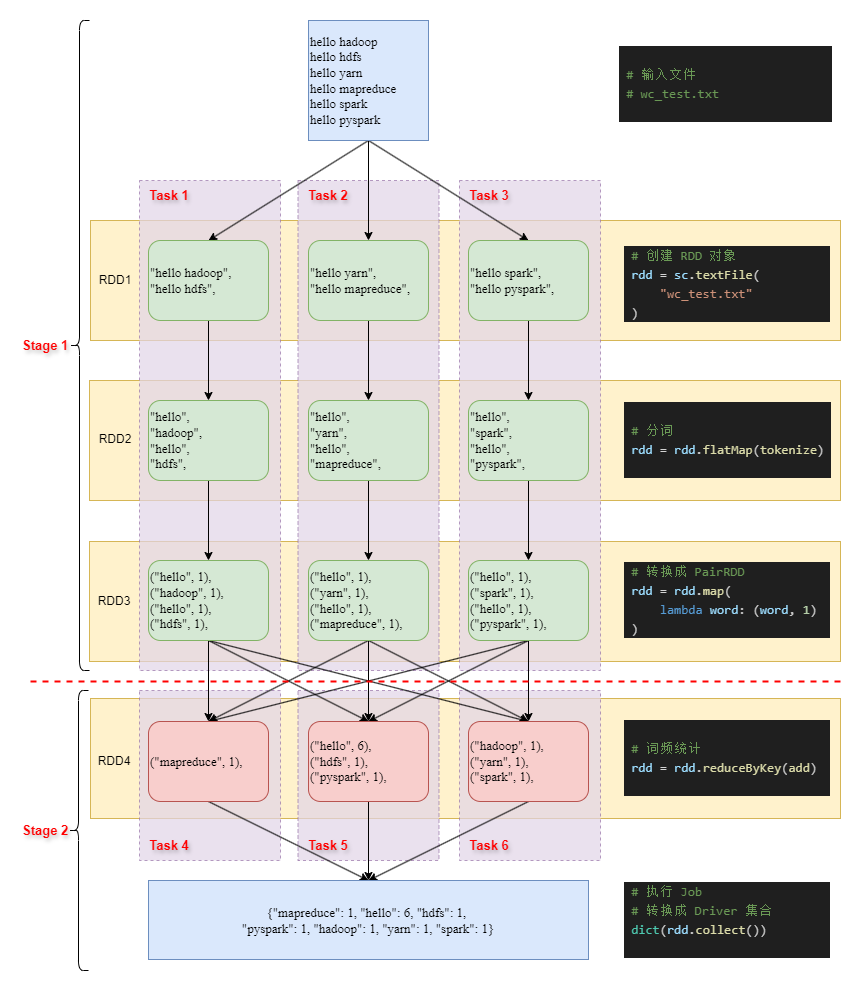
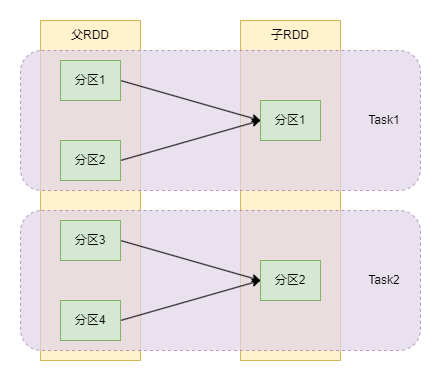
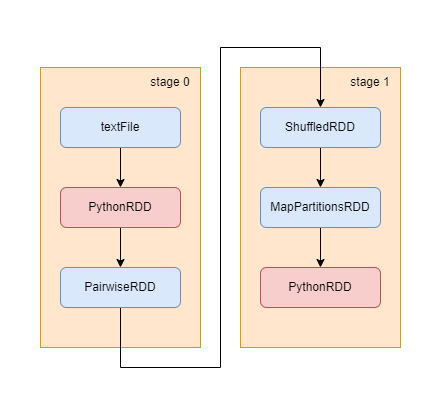

# PySpark RDD 简介

[TOC]

## 一、Spark 简介

在上一篇博客 [Hadoop 简介](https://zhuanlan.zhihu.com/p/919744848) 中, 我们对 "大数据" 这一领域有了初步的认识。本文承接上文, 介绍目前大数据领域热门的分布式计算引擎: Spark。

2009 年, [Matei Zaharia](https://people.eecs.berkeley.edu/~matei/) 大佬在 加州大学伯克利分校 (UC Berkeley) 读博期间开启了 [Spark](https://spark.apache.org/) 项目, 并于 2010 年开源。

2013 年, 创始人团队将这个项目捐献给 Apache 基金会, 并合伙成立了 [Databricks](https://www.databricks.com/) 公司。这家公司以 Spark 为基础, 向客户提供大数据云服务。我们在学习 Spark 的过程中, 除了官方文档外, 还可以参考他们的 [云服务文档](https://docs.databricks.com/en/index.html)。

我们可以在 [Spark Research](https://spark.apache.org/research.html) 页面上查看和 Spark 项目相关的论文, 这里面大部分论文都有 [Matei Zaharia](https://scholar.google.com/citations?user=I1EvjZsAAAAJ) 大佬的署名。在这一系列的论文中, 最出名的是 [Resilient Distributed Datasets](https://www.usenix.org/system/files/conference/nsdi12/nsdi12-final138.pdf), 也是本文重点介绍的内容之一。

接下来, 让我们来看看 Spark 中有哪些内容, 以及可以提供什么样子的计算能力。

### 1.1 Spark 模块

目前, Spark 框架主要包括五个模块, 分别是 SparkCore, SparkSQL, Structured Streaming, MLlib 和 GraphX。下面, 让我们简单了解一下它们的主要功能。

SparkCore 模块是 Spark 框架的运行的基础, 其它四个模块都是基于其开发的。其提供的 **数据集合抽象** 是 `RDD`, 我们可以简单将其理解为分布式的 `list` 列表。在 SparkCore 中, 所有的数据都是以 RDD 为核心进行扭转的。

SparkSQL 模块则是基于 SparkCore 模块提供 结构化数据 (二维表结构) 处理的能力。其定位和 Pandas 相似, 不提供 库表管理 (数据存储) 相关的功能, 只提供 数据计算 的能力。SparkSQL 和 Pandas 提供的 **数据集合抽象** 名称都是 `DataFrame`, 但是两者的功能相差非常大。Spark 在 3.3 版本正是推出了 [Pandas API on Spark](https://spark.apache.org/pandas-on-spark/), 可以直接使用部分 Pandas 算子来操作数据, 非常方便。

除此之外, SparkSQL 还支持使用 SQL 语言来操作 `DataFrame` 对象, 同时原生支持从 [Hive](https://spark.apache.org/docs/latest/sql-data-sources-hive-tables.html) 数据的读写, 弥补了没有库表管理功能的缺陷。对于其它数据库, SparkSQL 支持使用 [JDBC](https://spark.apache.org/docs/latest/sql-data-sources-jdbc.html) 来读写数据。额外说明一点, 一般数据中台的 "SparkSQL 脚本" 指的是用 SparkSQL 模块提供的 SQL 语言来操作 Hive 库中的数据, 整个过程将 `DataFrame` 的概念隐藏了起来。此时用户只能够写 SQL 语句, 可以满足大部分数据开发的需求, 但是对算法开发的限制较大。

`DataFrame` 是以 `RDD` 为基础开发的, 提供了更加高级方便的二维表结构算子。目前, 很多以 Spark 为基础开发的库都使用 `DataFrame` 对象, 官方也在不断增强 SparkSQL 模块的功能。因此, 我们可以将 SparkCore 和 SparkSQL 都作为 Spark 的 "基础模块", 剩下的三个模块作为 Spark 的 "领域模块"。Structured Streaming, MLlib 和 GraphX 分别对应 "实时流式计算", "机器学习" 和 "图计算" 三个专业领域。额外说明一点, 在图计算领域, 除了官方的 GraphX 模块外, 还可以考虑第三方库 [GraphFrames](https://github.com/graphframes/graphframes), 其更加简单易用。

Spark 项目是在不断发展的, 很多内容在发展的过程中被弃用了, 由新的内容取而代之。目前被弃用的主要有三个:

+ SparkSQL 模块的前身 Shark 项目
+ Structured Streaming 模块的前身 Spark Streaming 模块
+ `DataFrame` 的前身 `SchemaRDD`

至此, 你应该对 Spark 的模块组成, 以及它们的定位有一个大致的了解了。由于 SparkSQL 涉及的内容过多, 计划在后续的博客中介绍, 本文主要介绍 SparkCore 中相关的内容。

### 1.3 Spark 编程语言

Spark 主要使用 Scala 语言开发的, 并额外提供了 Java, Python 和 R 语言的 API。

Scala 语言是基于 Java 语言开发的, 其和 Java 程序一样运行在 JVM 虚拟机之上。我们可以这样认为, Scala 语言和 Java 语言的 "前端" 不同, "后端" 是一致的。相较于 Java, Scala 语言额外提供了 "函数式编程" 和 "交互式编程" 的能力, 让用户可以更加快捷方便地进行编程。

不仅如此, Scala 程序和 Java 程序一样, 可以编译打包成 `jar` 文件, 然后通过 `java -jar` 指令来运行。也就是说, 将 Scala 代码编译打包成 `jar` 文件后, 我们就不需要配置 Scala 运行环境了, 只要有 Java 运行环境即可, 非常方便。因此, 虽然 Spark 是用 Scala 语言开发的, 但是可以完美契合以 Java 为主的大数据软件生态圈。

Spark 在 Python 和 R 语言中对应的模块名称分别是 PySpark 和 SparkR。本文后续的内容主要以 PySpark 为基础来进行介绍。

需要注意的是, 官方计划从 Spark 4.0 的版本开始弃用 SparkR 模块, 也就是弃用 R 语言的 API 接口。Databricks 在其 [文档](https://docs.databricks.com/en/sparkr/overview.html) 中建议使用第三方库 [sparklyr](https://github.com/sparklyr/sparklyr)。对于以 R 语言为主语言的人来说建议直接学习 sparklyr 库。

额外说明一点, 在 Scala/Java 的 API 中, SparkSQL 模块除了 `DataFrame` 数据抽象外, 还有 `Dataset` 数据抽象。由于本文以 PySpark 为主, 在上一部分就没有说明了。

## 二、Spark 部署架构

Spark 的部署方式主要有五种: local, Standalone, YARN, kubernetes (K8S) 以及 Mesos。其中, Mesos 部署方式已经被弃用, K8S 部署方式涉及到很多额外的知识, 本文就不进行介绍了。下面, 让我们来看看其它的三种模式。

首先申明一点, 本章主要介绍的是 Spark 框架本体, 因此除非特别提及, 默认地运行环境都是 Java/Scala。

### 2.1 Spark on YARN

在 [Hadoop 简介](https://zhuanlan.zhihu.com/p/919744848) 中, 我们已经介绍了 YARN 有两个层面的 "主从架构":

+ "资源分配" 的主从架构: ResourceManager 和 NodeManager
+ "实际计算" 的主从架构: ApplicationMaster 和 Task

在本文的后续内容中, 我使用 RM, NM 和 AM 来代指 ResourceManager, NodeManager 和 ApplicationMaster。

YARN 组件作为通用的 分布式计算资源分配 框架, 其提供了统一的编程范式。当新的 "计算框架" 想在 YARN 集群上运行时, 只需要实现 AM 和 Task 部分的逻辑即可, 不需要再去实现 "资源分配" 相关的内容了。同时, 当 客户端 向 YARN 集群提交作业时, 可以附带运行所需的 jar 文件, 其中包括 AM 和 Task 的运行代码。

也就是说, 新的 "计算框架" 想在 YARN 集群上运行, 需要实现 AM, Task 以及 客户端 部分的代码, 并编译成 jar 文件。客户端在与 YARN 集群交互时, 提交这些 jar 文件即可。我们不需要在每一个 NM 从节点 上部署 "计算框架" 的运行代码, 非常方便。

需要注意的是, 在 HDFS 集群中, 客户端 只需要有 NameNode 的通讯地址 (hdfs://192.168.0.1:8020/) 就可以交互了。而在 YARN 集群中, 客户端 必须要有完整的集群配置文件才能够进行交互。

因此, 如果我们想在 YARN 集群上运行 Spark 作业, 只需要找一个能和集群通讯的计算机作为 客户端 节点, 然后在上面安装 Spark 运行环境, 拷贝集群的配置文件, 添加 `HADOOP_CONF_DIR` 或者 `YARN_CONF_DIR` 环境变量到 `~/.bashrc` 或者 `conf/spark-env.sh` 中即可。整个过程都是在 客户端 节点上完成的, 不需要修改 YARN 集群中的任何内容, 非常方便。

需要注意的是, 虽然 Spark 源码主要使用 Scala 语言编写的, 但是其可以编译打包成 jar 文件。因此, 运行 Spark 程序是不需要 Scala 运行环境的。如果你需要使用 Scala 语言来编写 Spark 代码, 那么只需要在 客户端 节点上部署 Scala 运行环境即可, 不需要在集群内部的节点上安装任何内容。

### 2.2 Driver & Executor

在 Spark 中, "实际计算" 是另外一套 "主从架构": 我们将 主进程 称为 Driver, 从进程 称为 Executor。Driver 进程主要负责整体的调度, Executor 进程负责具体的计算工作。

Driver 进程有两种模式, 一种是 client 模式, 一种是 cluster 模式。在 client 模式下, Driver 进程 和 客户端 进程是一致的; 在 cluster 模式下, Driver 进程和 AM 进程是一致的。

下面, 让我们看一看 client 模式下 Spark on YARN 整体的启动过程:

1. Driver (客户端) 向 RM 发送请求, 申请启动 AM 进程
2. RM 分配一个从节点, 通知对应的 NM 启动 "容器" 运行 AM 进程
3. AM 进程和 Driver (客户端) 之间进行通讯, 确定启动 Executor (Task) 的数量以及所需的计算资源
4. AM 进程向 RM 发送请求, RM 分配从节点, 通知对应的 NM 启动 "容器" 运行 Executor (Task)
5. Executor (Task) 进程启动后会直接和 Driver (客户端) 之间进行通讯, 我们将这一过程称为 "反向注册"
6. 作业执行由 Driver (客户端) 和 Executor (Task) 之间配合完成

从上面的过程中, 我们可以发现, AM 进程的作用就是启动 Executor, 因此也被称为 ExecutorLaucher。

cluster 模式下 Spark on YARN 整体的启动过程如下:

1. 客户端向 RM 发送请求, 申请启动 AM 进程
2. RM 分配一个从节点, 通知对应的 NM 启动 "容器" 运行 Driver (AM) 进程
3. Driver (AM) 进程和客户端之间进行通讯, 确定启动 Executor (Task) 的数量以及所需的计算资源
4. Driver (AM) 进程向 RM 发送请求, RM 分配从节点, 通知对应的 NM 启动 "容器" 运行 Executor (Task)
5. Executor (Task) 进程启动后会和 Driver (AM) 之间进行通讯, 我们将这一过程称为 "反向注册"
6. 作业执行由 Driver (AM) 和 Executor (Task) 之间配合完成

从上面可以看出, 整个运行过程和 MapReduce 的运行过程是相似的, 我们可以简单理解为: 只是将 AM 和 Task 进程改了一个名称。

client 模式的优势在于可以进行 "交互式编程", 因为此时 Driver 端的输出都在客户端进程上。而在 cluster 模式下, Driver 端的输出都在 AM 进程上, 此时更加适合数据产品开发完成后的部署运行。

除此之外, 两者对于通讯的要求是不一样的。在 client 模式下, 客户端 节点需要和 YARN 集群中的所有节点都能通讯, 我们可以将 客户端 节点视为集群的一部分。而在 cluster 模式下, 客户端 节点只需要和 RM 之间进行通讯即可。

在 Spark 程序运行时, 我们可以设置 `num-executors`, `executor-memory`, `executor-cores` 来控制 executor 的数量, 单个 executor 消耗的内存以及 CPU Core 数量。但是, 这些参数不一定会完全生效, 他会受 YARN 集群的配置, Spark 本身的限制, 以及 YARN 集群剩余资源等因素的影响。

### 2.3 Standalone Mode

Spark 框架内部也实现了一套独立的, 不依赖于其它框架的 "计算资源分配" 集群, 我们一般称其为 Spark 集群。

Spark 集群的定位和 YARN 集群是相似的, 都是用来分配计算资源的。在 Spark 集群中, "主从架构" 的名称是 Master 和 Worker。其中, Master 角色对应 YARN 中的 ResourceManager 角色, Worker 角色对应 YARN 中的 NodeManager 角色。

Spark 集群依赖的 "分布式文件系统" 集群依旧是 HDFS。其支持和 HDFS 集群共享节点 (存算一体), 也支持和 HDFS 集群分开部署 (存算分离)。

Spark 集群 "实际计算" 的 "主从架构" 依然是 Driver 和 Executor。同时, Driver 进程的运行也有两种模式: cluster 和 client。此时, 没有 ApplicationMaster (ExecutorLaucher) 的概念在里面了。

对于 client 模式而言, Driver 进程就是 客户端 进程, 其可以直接向 Master 进程申请计算资源, 不需要通过 AM 进程再转一道了。对于 cluster 模式而言, Driver 进程运行在集群内部的节点中, 我们可以认为其是一种特殊的 Executor 进程。

我们将 Spark 作业提交给 Spark 集群的场景称为 Standalone Mode (Standalone 的含义是 "独立运作的")。但是, Spark 集群的完善程度没有 YARN 集群高。比方说, 在 "作业调度" 方面, Spark 集群目前仅支持 FIFO 策略, 不支持 Capacity 和 Fair 策略。因此, 大部分云平台使用的都是 YARN 集群而非 Spark 集群。

需要注意的是, 在 2.1 节中我们说过, YARN 集群没有通讯地址。但是, Spark 集群提供了通讯地址, 默认的通讯地址为: `spark://192.168.0.1:7077`。

### 2.4 Local Mode

和 MapReduce 框架一样, Spark 框架也提供了 本地模式 (Local Mode), 方便我们学习 Spark 框架, 开发 和 调试 Spark 程序。本文后续的代码主要也是以 本地模式 来运行的。

本地模式 是以 "单进程多线程" 的形式运行的, 此时 Master, Worker 和 Driver 角色都由 "单进程" 本身来承担。这样, 我们在执行程序时就不用额外启动其它程序了, 非常方便。

需要注意的是, 在 本地模式 中是没有 Executor 角色的。所有 Executor 角色做的事情都是由 Driver 角色完成的。因此, 我们会说, Driver 是一种特殊的 Executor。

### 2.5 运行 Spark 程序

通过上面的介绍, 你应该对 Spark 的部署架构有了一个初步的认识。下面, 让我们看一看如何运行 Spark 程序。

首先, 我们可以从 [官网](https://spark.apache.org/downloads.html) 或者 [清华源](https://mirrors.tuna.tsinghua.edu.cn/apache/spark/) 下载 Spark 程序的压缩包。目前最新版是 3.5.3, 那么我们可以选择 `spark-3.5.3-bin-hadoop3-scala2.13.tgz` 进行下载。下载完成后用 `tar -zxvf` 进行解压, 文件夹重命名成 `spark` 即可。我们假设文件夹的绝对路径是 `/home/huser/spark`。简单解释一下这个路径下文件夹的含义:

+ `bin` 文件夹中主要是 Spark 的客户端脚本
+ `sbin` 文件夹中主要是启动 Spark 集群的脚本
+ `conf` 文件夹是 Spark 程序的配置文件, 包括客户端配置和集群配置
+ `examples` 文件夹是示例程序
+ `data` 文件夹是示例程序用到的数据
+ `jars` 文件夹包含了 Spark 程序运行所需的 jar 文件
+ `python` 文件夹就是 PySpark 包的内容

在 `bin` 文件夹中, 常用的客户端有 `spark-submit`, `spark-shell` 和 `pyspark`; 它们的作用分别是 "作业提交", "scala 交互编程客户端" 和 "Python 交互编程客户端"。

接下来, 我们使用 `spark-submit` 客户端, 采用 本地模式 来运行 Spark 程序:

```shell
export SPARK_HOME=/home/huser/spark

$SPARK_HOME/bin/spark-submit \
    --master local[*] \
    $SPARK_HOME/examples/src/main/python/pi.py 10
```

在这里, `--master` 后面是 Master URL (Uniform Resource Locator), 其用来标识 Spark 程序的运行模式:

如果是 本地模式 (Local Mode), 那么 master URL 就是 `local[*]`。其中, 方括号中的数字用来标识 Driver 启用的线程数: `local[4]` 表示启用 4 个线程; `local[*]` 表示启用的线程数等于 CPU Core 的数量。

如果使用 Spark 集群 (Standalone Mode), 那么 master URL 就是 Spark 集群的通讯地址, 例如: `spark://192.168.0.1:7077/`。

如果使用 YARN 集群 (Spark on YARN), 那么 master URL 就是 `yarn`。程序会通过环境变量 `HADOOP_CONF_DIR` 或者 `YARN_CONF_DIR` 来获取集群配置文件, 向集群提交作业。下面是 YARN 集群提交作业的示例指令:

```shell
export SPARK_HOME=/home/huser/spark
export HADOOP_CONF_DIR=/home/huser/hadoop/etc/hadoop

$SPARK_HOME/bin/spark-submit \
    --master yarn \
    --deploy-mode client \
    --num-executors 10 \
    --executor-memory 20G \
    --executor-cores 4 \
    $SPARK_HOME/examples/src/main/python/pi.py 10
```

其中, `deploy-mode` 表示 Driver 的运行方式, 可以是 `client` 或者 `cluster`。`num-executors`, `executor-memory` 和 `executor-cores` 分别表示启动 Executor 的数量, 单个 Executor 的内存大小和 CPU Core 数量。需要注意的是, 这些参数不一定会生效, 和 YARN 集群的配置有很大关系。

### 2.6 PySpark 安装

至此, 你应该对 Spark 有一个初步的认识了。后文主要以 PySpark 下的 Local Mode 为基础进行介绍, 因此这里需要先介绍一下 PySpark 的安装方式。关于 PySpark 的运行方式会在第三章之后进行介绍。

首先, 我们的开发环境是 Linux 系统。如果是 Windows 系统, 建议安装 WSL2 虚拟机进行操作。

然后确保电脑上已经安装了 Java 和 Python 运行环境。Java 可以直接用 `sudo apt install openjdk-11-jdk` 指令安装, Python 则建议用 conda 创建独立的环境。

创建完成后, 可以直接使用 `pip install pyspark` 进行安装。安装完成后, 内部已经有运行所需的 jar 文件了, 我们再无需下载任何东西, 直接就可以运行, 非常方便。

下面, 就让我们开始 SparkCore 模块的学习吧 ~

## 三、RDD 概述 (一)

### 3.1 Spark 执行层级

RDD 的全称是 Resilient Distributed Dataset, 翻译过来就是 弹性分布式数据集。我们可以简单将其理解为分布式的 Python `list` 结构。也就是说, RDD 是一个数据集合, 它的数据分布在多个集群节点中。

既然是分布式数据集合, 那么 **数据分块** 是一个永恒的话题了。在 MapReduce 框架中, 我们用 **split (分片)** 表示 MapTask 输入的 "数据块" 名称, 用 **partition (分区)** 表示 ReduceTask 输入的 "数据块" 名称。

在 RDD 中, 我们统一用 **partition (分区**) 表示 "数据块" 的名称: 一个 RDD 数据集合中包含多个分区, 每一个分区中又包含多个元素。分区是有 "索引值" 的, 因此 RDD 是一个有序集合, 不会因为分布式而变成无序集合。

在 MapReduce 框架中, 元素必须以 **二元组** 的形式进行扭转, 其中第一个值称为 key, 第二个值称为 value。而在 Spark 框架中则没有这个限制, 元素可以是单个存在的, 也可以以二元组的形式存在。我们将元素是二元组的 RDD 称为 **PairRDD**, **PairwiseRDD** 或者 **KV-RDD**。

对于 PairRDD 而言, 其可以有 **分区函数** (partitioner), 也可以没有。分区函数的入参是 key, 出参是一个整数。这个整数和 "总分区数" 进行取模运算, 得到的结果就是当前元素的分区索引值。

需要注意的是, 不是所有的 PairRDD 都有 **分区函数**。一般情况下, 我们只在需要对数据进行 "重新分区" 时, 才会设置 分区函数。也就是说, 如果 PairRDD 有分区函数, 那么 key 值相同的元素一定在同一个分区内。这在 **多元运算** (多个 RDD 交互的运算) 中非常有用, 可以简化运算量。具体内容后面再介绍。

Spark 和 MapReduce 框架有一个非常大的区别: 在 MapReduce 框架中, 一个数据块 (split/partition) 对应一个 Task 进程; 而在 Spark 框架中, 一个数据块 (partition) 对应的是 Executor 进程中的一个 线程, 我们将这个线程称为 Task 线程。也就是说, 在 MapReduce 和 Spark 框架中, Task 表示的含义是相同的, 即处理一个数据块中的数据; 但是 Task 执行的层级不同, 前者是进程后者是线程。MapReduce 框架的 Task 进程和 Spark 中的 Executor 进程执行层级是相同的。

同时, 在 Spark 中, Executor 进程没有 Map 和 Reduce 之分, 取而代之的是需要对一个 Job 划分多个 Stage。当我们需要对 RDD 中的元素进行 "类 reduce" 运算时, 就会划分 Stage, 确保不同 Task 线程的执行进度相同。关于 Stage 的划分, 后续会更具体地介绍。

因此, 两个框架执行方式的区别是:

在 MapReduce 框架中, 我们可以 "分批" 启动 Task 进程: 假设 YARN 集群最多能同时启动 50 个进程, 一个 Job 需要启动 100 个 Task 进程, 那么就先启动 50 个进程, 当有进程执行完成后, 再逐个启动剩余进程。

而在 Spark 框架中, 我们需要在一开始就启动所有的 Executor 进程。如果用户启动程序时设置的 `num-executors` 为 100, 而 YARN 集群最多只能同时启动 50 个进程, 那么最终也只会启动 50 个 Executor。

那么, 按照 Spark 框架的方式, 我们启动程序时可以执行多个 Job, 不需要执行一次 Job 就向 YARN 集群申请一次资源。因此, Spark 框架在 Job 之上又增加了一个层级: Application。也就是说, 在 MapReduce 和 Spark 框架中, Job 表示的含义是相同的, 即一次执行任务; 但是执行层级不同, Spark 中的 Application 和 MapReduce 中的 Job 执行层级是相同的。

总结一下, 在 Spark 中, 一共有四个执行层级: Application, Job, Stage 和 Task。当我们启动 Spark 程序时, 客户端会和 YARN 集群交互, 启动所有的 Executor 进程, 完成 Application 的创建; 然后, 一个 Application 进程中可以包含若干个 Job; 在执行单个 Job 的过程中, Spark 内部会划分多个 Stage, 单个 Stage 内 RDD 某一分区的数据会分配给某个 Executor, Executor 启动 Task 线程来执行。

### 3.2 SparkContext

Spark 程序的编程入口是 `SparkContext` 对象。当我们创建 `SparkContext` 对象时, 程序内部会自动和集群进行交互, 完成 Application 的创建。大致的代码如下:

```python
from pyspark import SparkConf, SparkContext, RDD 

conf = SparkConf()
conf.setMaster("local[*]").setAppName("Learn-SparkCore")
conf.set("spark.ui.enabled", "true")  # 是否启动 WEB 监控页面
conf.set("spark.eventLog.enabled", "false")  # 是否将 WEB 监控页面的内容保存到文件中

with SparkContext(conf=conf) as sc:
    pass 
```

在 PySpark 中, 我们统一使用 `sc` 来表示 `SparkContext` 类的对象。除了上面的方式外, 你也可以用 `bin` 文件夹下的 PySpark 客户端直接进入交互式编程环境。具体的指令如下:

```shell
export SPARK_HOME=/home/huser/spark
export PYSPARK_DRIVER_PYTHON=ipython

$SPARK_HOME/bin/pyspark \
    --master local[*] \
    --name Learn-SparkCore \
    --conf spark.ui.enabled=true \
    --conf spark.eventLog.enabled=false
```

进入 Python 交互式命令行之后, `sc` 对象已经帮助我们初始化好了, 可以直接使用即可。此时, 你可以打开本地的 `http://localhost:4040/` 页面, 看到 Application 的 WEB 监控页面。

`sc` 对象最主要的作用就是用来创建 RDD 对象。其支持下列的创建方式:

+ Driver 端集合: `parallelize` 和 `range`
+ UTF-8 文件: `textFile` 和 `wholeTextFiles`
+ 二进制文件: `binaryFiles` 和 `binaryRecords`
+ Python 序列化文件: `pickleFile`
+ MapReduce 序列化文件: `sequenceFile`, `newAPIHadoopFile`, `newAPIHadoopRDD`, `hadoopFile` 和 `hadoopRDD`

这里简单介绍两个 API:

第一个是 `parallelize` API, 可以将 Driver 端的集合转换成 RDD 对象, 例如: `rdd = sc.parallelize(range(10), numSlices=3)`。其中, `numSlices` 参数表示分区数。

第二个是 `textFile` API, 可以将一个文件转换成 RDD 对象, 一行文本对应一个元素。需要注意的是, Spark 仅支持 UTF-8 编码的文本。如果是其它编码的文本, 需要先想办法转换成 UTF-8, 否则无法读取。

Spark 支持的文件 URI 有两种:

+ HDFS 集群系统的文件
+ Node 端本地文件, 即所有的从节点上都有该文件, 并且文件路径都相同

一般情况下, 第一种适合大数据云服务场景, 采用 Spark on YARN 的运行方式; 第二种适合运行单个大型 Application 的情况, 采用 Standalone Mode 运行方式。之前介绍的 [分布式训练](https://zhuanlan.zhihu.com/p/693812824) 就是采用第二种方式。

### 3.3 DAG 图

RDD 的算子根据其功能的不同可以分为两类: **转换算子** (transformation) 和 **行动算子** (action)。它们的作用如下:

RDD 对象是由 `sc` 的 API 创建的。当你调用 RDD 的 转换算子 时, 会返回一个新的 RDD 对象, 此时不会触发 "实际计算", 只会构建 "行动计划"。当你调用 RDD 的 行动算子 时, 就会触发 "实际计算", 返回计算结果。"行动计划" 在程序中是以 **DAG** (Directed Acyclic Graph, 有向无环图) 的形式来呈现的。同时, 调用行动算子时触发的 "实际计算" 对应一个 Job。

我们将上述方式称为 **懒加载** (Lazy Initialization), 即 RDD 中的元素只有到 "实际计算" 时才会加载到内存中, 这是 RDD 和 Python 的 `list` 对象最大的不同。也正因为此, 我们说 RDD 中的对象是 **不可变的** (immutable), 也就是不能用 `rdd[i]` 的方式来改变集合中的元素。

下面, 让我们来看看如何用 Spark 来实现单词计数的功能:

```python
from operator import add 

def tokenize(line: str) -> list[str]:
    return line.strip().split()

# 读取文件数据, 创建 RDD 对象
rdd = sc.textFile("wc_test.txt", minPartitions=3)
# 分词
rdd = rdd.flatMap(tokenize)
# 转换成 PairRDD
rdd = rdd.map(lambda word: (word, 1))
# 词频统计
rdd = rdd.reduceByKey(add)
# 执行 Job, 结果汇聚到 Driver 端
dict(rdd.collect())
```

在上述代码中, `sc.textFile` 是用来创建 RDD 对象的; `flatMap`, `map` 和 `reduceByKey` 都属于 转换算子, 主要作用是构建 DAG 图; `collect` 是 执行算子, 调用时会执行 Job, 并返回计算结果。我们可以用下图来表示上述代表的逻辑 DAG 图:



从图一你可能隐约感受到, 整个执行逻辑和 MapReduce 的单词计数类似: Stage 1 对应的就是 MapReduce 框架的 map 运算, Stage 2 对应的就是 MapReduce 框架的 reduce 运算。很多时候, 不同框架的运行逻辑是相似的, 但是 "实现方式" 和 "编程模型" 相差非常大。

除了通过 `sc` 创建的 RDD 对象外, 其它的 RDD 对象都是通过 转换算子 得到的。比方说, 在图一中, RDD2 是由 RDD1 转换得到的, 那么我们就称 RDD1 和 RDD2 之间有 **依赖关系** (Dependency) 或者 **血缘关系** (Lineage); RDD1 是 "血缘关系" 中的 **父 RDD**, RDD2 是 "血缘关系" 中的 **子 RDD**。那么, 我们可以将 **依赖关系** 分为两类:

窄依赖 (Narrow Dependency): 父 RDD 中一个分区内的数据完全到子 RDD 中的一个分区内。比方说, 图一中的 RDD1 和 RDD2 之间, 以及 RDD2 和 RDD3 之间都是 窄依赖。

宽依赖 (Wide Dependency): 父 RDD 中一个分区的数据分散到多个 子 RDD 的分区中。比方说, 图一中的 RDD3 和 RDD4 之间就是 宽依赖。

区分 宽窄依赖 的作用是划分 Job 的 Stage 以及 Task:

对于 窄依赖 而言, 一个分区只需要等待其所有上游分区运算完成后就可以计算了; 而对于 宽依赖 而言, 子 RDD 的计算必须等到 父 RDD 所有分区都运行完成才能进行。因此, 我们划分 Job 的 Stage 是根据 宽窄依赖 来划分的: 如果两个 RDD 之间是 宽依赖, 就划分 Stage; 反之如果两个 RDD 之间是 窄依赖, 则不划分 Stage。

在图一的 Stage 1 中, 一条路径上所有的分区可以直接计算, 不用等待其它分区的数据, 那么我们可以将这条路径划分给一个 Task 线程来执行。这样, Stage 1 最终需要 3 个 Task 线程就可以执行完成了; 这 3 个线程之间独立运行, 互不影响。同理, Stage 2 也需要 3 个 Task 线程。最终, 整个 Job 启动了 6 个线程进行计算。

### 3.4 迭代器

对于海量数据而言, 我们很难将全部数据都加载到内存中, 常见的处理办法是构建 "文件流" 对象, 读取一行数据处理一行数据, 这样就可以避免内存不足的问题了。我们一般将这种结构称为 **迭代器**。下面是使用 Python 的 迭代器 对象实现的 "单词计数" 代码:

```python
from itertools import chain 
from collections import Counter 

def tokenize(line: str) -> list[str]:
    return line.strip().split()

with open("wc_test.txt", "r", encoding="utf-8") as lines:
    # words 只是一个迭代器, 不涉及数据加载
    words = chain.from_iterable(map(tokenize, lines))
    # 加载数据, 并进行统计
    counter = Counter(words)

print(counter)
```

从上面可以看出, `lines` 和 `words` 都是 `Iterable` 对象。在 `words` 对象创建完成后, 数据并不会加载到内存中。在调用 `Counter(words)` 时, 数据才会从文件中逐行加载。`counter` 对象创建完成后, `words` 迭代器就不能再使用了。`lines` 对象是文件流, 可以通过 `lines.seek(0)` 来重置迭代器继续使用。

我们可以将 迭代器 对象当作是 "功能性最差" 的一种 数据集合。迭代器 只能正向迭代一次, 再次迭代就要重新构建了。同时, 我们没有办法预先知道 迭代器 的元素个数, 只能在完成一次迭代后才可以知道。

虽然之前我们说 RDD 可以简单理解为分布式的 `list`, 但是实际上和 RDD 最相似的 数据集合 是 迭代器。我们在编写代码时, 应该将 RDD 理解为 **分布式迭代器**, 每一个分区对应一个 迭代器, 我们只能够 "正向迭代一次"。如果我们需要迭代多次, 那么只能构建多个 Job。这一点非常重要。

### 3.5 总结

网上很多教程会引用 RDD 源码的注释, 说明 RDD 有五大特性:

(1) A list of partitions

这很好理解, 无论什么分布式计算框架, 都需要对数据进行分块。在 Spark 中, 我们将 数据块 称为 partition (分区)。

(2) A function for computing each split

我们可以将 RDD 理解为 "分布式迭代器", 每一个分区可以理解为 "子迭代器"。那么, 这里的函数指的是作用于 "子迭代器" 之上的函数, 其入参是 上游迭代器, 返回新的迭代器。

(3) A list of dependencies on other RDDs

除了通过 `sc` 对象创建的 RDD 之外, 其余所有的 RDD 都要通过 转换算子 才能得到。这样, RDD 之间一定有 "依赖关系" 或者 "血缘关系"。"依赖关系" 可以分为 宽依赖 和 窄依赖, 我们可以根据其来给 Job 划分 Stage 和 Task。

(4) Optionally, a Partitioner for key-value RDDs (e.g. to say that the RDD is hash-partitioned)

PairRDD 只有在 "重新分区" 时才会去设置 "分区函数" (partitioner), 其它时候都是没有 "分区函数" 的。因此, 如果一个 PairRDD 有分区函数, 那么 key 值相同的元素都在一个分区内。

(5) Optionally, a list of preferred locations to compute each split on (e.g. block locations for an HDFS file)

这个特性继承自 Hadoop, 如果 `sc.textFile` 读取的文件是 HDFS 文件, 那么 Spark 会将 文件块 "就近" 分配给 Executor 中的 Task 线程执行。

第五个不在本文的介绍范围内, 最主要是理解前四个。至此, 你应该对 DAG 图有一个大致的了解了。这个章节的概念有一些多, 下面让我们来看看 PySpark 中的算子, 加强对这些概念的理解。

## 四、RDD 算子分类

### 4.1 数据转换 (10)

"数据转换" 算子指的是将 RDD 中的数据转换成 "Driver 端集合" 或者 "存储到文件" 中, 这些算子都属于 **行动算子**。

将 RDD 数据转换成 Driver 端集合的有三个算子: `toLocalIterator`, `collect` 和 `collectAsMap`; 它们对应的 python 集合分别是 `Iterator`, `List` 和 `Dict`。在这三个算子中, 只有 `collectAsMap` 要求 RDD 必须是 PairRDD, 其它的是普通 RDD 即可。

和文件存储相关的有七个算子, 其中五个和 Hadoop MapReduce 框架相关, 它们分别是: `saveAsSequenceFile`, `saveAsHadoopDataset`, `saveAsNewAPIHadoopDataset`, `saveAsHadoopFile` 和 `saveAsNewAPIHadoopFile`。需要注意的是, 在 MapReduce 中数据是以 二元组 的形式存在的, 因此这些 API 要求必须是 PairRDD, 否则无法保存。

除此之外, 另两个算子是 `saveAsPickleFile` 和 `saveAsTextFile`。它们分别对应 python 的 pickle 文件 和 utf-8 文本文件。这里就没有 PairRDD 的限制了。这些算子和 `SparkContext` 对象创建 RDD 的 API 是相互对应的。我们将 `saveAS` 前缀去掉之后就是读取相应数据的 API 名称了。

RDD 的文件输出方式和 MapReduce 的方式是一致的, 即一个 "分区" 对应一个 "输出文件"。输出文件的名称是 `part-{i:05d}`, 其中 `i` 是 分区 的索引值。我们需要传入的是一个 文件路径, 所有的输出文件都在此路径下。除此之外, 还会在文件路径下生成空文件 `_SUCCESS`, 用于标识程序运行成功。

### 4.2 单分区运算 (5)

"单分区运算" 指的是运算过程仅仅涉及到一个分区内的数据, 不涉及到其它分区的数据。这些算子大多是 **转换算子**, 核心 API 是 `mapPartitionsWithIndex`。3.3 节 单词计数 例子的 stage1 用这个算子的实现方式如下:

```python
import operator
from typing import * 

def map_generator(split: int, iterator: Iterator[str]):  # 生成器
    for line in iterator:
        words = line.strip().split()
        for word in words:
            yield (word, 1)

rdd = sc.textFile("wc_test.txt", minPartitions=3)
pair_rdd = rdd.mapPartitionsWithIndex(map_generator)
pair_rdd.reduceByKey(operator.add).collectAsMap()

def map_func(split: int, iterator: Iterator[str]):  # 普通函数
    results = []
    for line in iterator:
        words = line.strip().split()
        results.extend([(word, 1) for word in words])
    return results
```

在上面的代码中, `map_generator` 的第一个参数是 `split`, 表示分区索引值; 第二个参数 `iterator` 表示的是迭代器。需要注意的是, 在编写代码时, 强烈建议使用 "生成器" 而非 "普通函数"。你可以使用 `map_func` 来代替 `map_generator`, 但是如果数据量过大, 会有 "爆内存" 的风险。

除此之外, 还有以下一些算子:

(1) `mapPartitions`: 功能和 `mapPartitionsWithIndex` 一样, 只是 "入参函数" 没有分区索引值了。

(2) `glom`: 将分区数据从 "迭代器" 的形式转换成 list 形式。和上面的 `map_func` 一样, 有 "爆内存" 的风险。

举例来说, 我们可以通过其查看不同分区有哪些元素:

```python
sc.range(9, numSlices=2).glom().collect()
```

(3) `pipe`: 和 Hadoop Streaming 的使用思路差不多, 将一个分区的数据作为 "Shell 程序" 的 "输入流", 并读取 "输出流" 中的数据构建 迭代器 对象。需要注意的是, 最终得到的 RDD 元素是 `str` 类型。

举例来说, 我们知道 `wc -l` 指令可以统计输入文件的行数, 那么我们可以用下面的方式来统计每一个分区的元素个数:

```python
sc.range(0, 10, numSlices=3).pipe("wc -l").collect()
```

(4) `foreachPartition`: 这是五个算子中唯一一个 **行动算子**, 其功能和 `mapPartitions` 差不多, 只是没有数据返回。其经常用于数据存储, 比方说将数据从 RDD 中存储到 MySQL, Redis 等数据库中。

上述四个算子的实现都是 "直接或者间接" 调用了 `mapPartitionsWithIndex` 算子, 因此我们说其是核心 API。

### 4.3 单元素运算 (12)

"单元素运算" 指的是运算过程仅仅涉及到元素本身。这类算子大部分也是 **转换算子**, 大体上可以分为三类:

(一) 最常用的两个算子是 `map` 和 `flatMap`。`map` 算子是对 RDD 中的元素逐个处理, 输入和输出之间的元素是 "一对一" 的。而 `flatMap` 则是在 `map` 基础上增加一个 "解嵌套" 的步骤, 输入和输出之间的元素是 "一对多" 的关系。在 3.4 节的 "单词计数" 示例代码中, 我们就是用 `flatMap` 分词结果合成一个 RDD 的。

(二) 可以作为 `map` 和 `flatMap` 算子的衍生算子, 它们的入参也是函数, 同时可以轻松借助这两个函数实现。它们分别是: `filter`, `keyBy`, `mapValues` 和 `flatMapValues`。

`filter` 的作用是过滤, 和 Python 的 `filter` 用法是一致的, 只保留 "输入函数" 返回为 `True` 的结果。`keyBy` 则是创建 PairRDD 的算子, "输入函数" 的返回值作为 key。`mapValues` 和 `flatMapValues` 则是针对 PairRDD 设计的算子, 函数仅仅作用于 二元组 的 value。下面是示例代码:

```python
# 保留 RDD 中所有的偶数, 筛选掉奇数
sc.range(0, 10).filter(lambda x: x % 2 == 0).collect()
# 每一个单词根据其首字母添加 key 值
sc.parallelize(["apple", "beef", "cat"]).keyBy(lambda word: word[0].upper()).collect()
# 将每一种水果的价格翻倍
sc.parallelize(
    [("apple", 4), ("banana", 5), ("orange", 6), ("peer", 7)]
).mapValues(lambda price: price * 2).collect()
# 将每一种水果的价格翻倍, 保留原来的价格
sc.parallelize(
    [("apple", 4), ("banana", 5), ("orange", 6), ("peer", 7)]
).flatMapValues(lambda price: [price, price * 2]).collect()
```

除了上面的算子之外, 还有一个 `foreach` 算子, 它属于 **行动算子**, RDD 中的元素逐个处理, 没有返回值。一般情况下很少使用这个算子。如果需要将 RDD 数据保存到数据库中, 建议使用 `foreachPartition` 算子。

(三) 第三类算子也是可以轻松用 `map` 实现的算子, 只是入参没有函数了。它们分别是: `keys`, `values`, `lookup`, `zipWithIndex`, `zipWithUniqueId`。下面, 让我们来看看这些算子:

(1) `keys` 和 `values` 是针对 PairRDD 的 **转换算子**, 前者返回 PairRDD 的 key, 后者返回 PairRDD 的 value。这两个算子很好理解, 不需要过多说明什么。

(2) `lookup` 算子是针对 PairRDD 的 **行动算子**。给定 key, 寻找 PairRDD 中所有的 value。下面是示例代码:

```python
# 寻找所有以 A 开头的单词
rdd = sc.parallelize(["apple", "beef", "cat", "abandon", "balance"], numSlices=3)
rdd.keyBy(lambda word: word[0].upper()).lookup("A")
```

如果你去看这个函数的源码, 会发现一个细节:

在 PySpark 中, SparkContext 对象有一个 API: `runJob`, 它可以指定分区索引, 让此次 Job 的最后一个 Stage 只执行部分分区, 不用所有分区都执行。如果是 "已分区" 的 PairRDD, 当你调用 `lookup` 方法时, Spark 只会执行 key 值所在的那一个分区, 其它分区都不执行。这属于性能上的小优化吧。

(3) `zipWithIndex` 和 `zipWithUniqueId` 算子: 给 RDD 中每一个元素都添加一个整形索引值, 索引值作为 value。示例代码如下:

```python
sc.parallelize("ABCDEFG", numSlices=2).zipWithIndex().collect()
sc.parallelize("ABCDEFG", numSlices=2).zipWithUniqueId().collect()
```

需要注意的是: `zipWithIndex` 产生的是标准的 "偏移量索引", 当 RDD 的分区数大于 1 时, 就需要预先知道每一个分区的元素个数, 否则无法生成 索引。因此, 虽然这个算子是 **转换算子**, 但是 Spark 在构建 DAG 的过程中会自行调用 **行动算子**。这一点一定要注意, 如果触发的 Job 过多, 或者当前 Job 的执行链条过长, 都会导致最终的运行时间特别长。

为了避免这个问题, 就有了 `zipWithUniqueId` 算子。这个算子生成的 "索引值" 不再是 "偏移量索引" 了, 而是另一套规则:

在 RDD 中, 我们是知道其有多少个分区的, 假设为 $n$。那么, 我们可以将每一个分区的第一个元素按照 $0, 1, 2, \cdots, n-1$ 的方式设置索引; 每一个分区的第二个元素按照 $n, n+1, n+2, \cdots, 2n-1$ 的方式设置索引; 每一个分区的第三个元素按照 $2n, 2n+1, 2n+2, \cdots, 3n-1$ 的方式来设置索引, 以此类推。或者换一种说法, 第一个分区的元素按照 $0, n, 2n, \cdots$ 的方式设置索引; 第二个分区的元素按照 $1, n+1, 2n+1, \cdots$ 的方式设置索引; 第三个分区的元素按照 $2, n+2, 2n+2, \cdots$ 的方式来设置索引, 以此类推。

如果 $k$ 是分区的索引值, $i$ 是元素所在分区的索引值, 那么该元素的最终索引值为: $i \cdot n + k$。`zipWithUniqueId` 算子的优势是可以避免触发额外的 Job, 缺点是 "索引值" 不是 "偏移量索引"。

至此, 你应该对 单元素运算 有了一个大致的了解。它们的底层也是直接或者间接调用的 `mapPartitionsWithIndex` 算子。

### 4.4 随机采样类 (4)

随机采样 算子其实也是属于 "单元素运算" 分类的, 但是由于涉及到一些统计学的知识, 这里单独列出来。一共有四个算子: `randomSplit`, `sample`, `sampleByKey` 和 `takeSample`。

我们首先来了解一下 `sample(withReplacement, fraction)` 算子, 其有两种采样方式:

(1) 当 `withReplacement` 参数值为 `False` 时, fraction 表示每一个元素保留的概率, 取值范围在 $[0, 1]$ 之间。采样方式如下: 遍历每一个元素, 从 均匀分布 $U(0, 1)$ 中采样出来一个数 alpha; 若 alpha 比 fraction 小, 则保留该元素, 反之则不保留。

(2) 当 `withReplacement` 参数值为 `True` 时, fraction 表示每一个元素重复采样的期望值, 取值范围大于 $0$ 即可。采样方式如下: 遍历每一个元素, 从 "期望为 fraction 的 **泊松分布**" (Poisson Distribution) 中采样出来一个数 count, 然后生成该元素 count 次。

从 泊松分布 中采样出来的数字一定是 **自然数**, 如果对其不了解的可以用下面的代码查看概率分布图:

```python
from collections import Counter
import matplotlib.pyplot as plt 
from pyspark.rddsampler import RDDSamplerBase

def draw_poisson_dist_pics(means, repeat_nums=100000):
    for mean in means:
        sampler = RDDSamplerBase(...)
        sampler.initRandomGenerator(0)
        results = [sampler.getPoissonSample(mean) for _ in range(repeat_nums)]
        results_count = sorted(Counter(results).items())
        x = [item[0] for item in results_count]
        y = [item[1] for item in results_count]
        plt.plot(x, y)

draw_poisson_dist_pics([1, 3, 5])
```

需要注意的是, RDD 不同分区的随机数种子必须要不一样。设我们传入的随机数种子为 seed, 每一个分区实际的随机数种子等于 seed 和 "分区索引" 按位异或 (xor, $\oplus$) 的结果。

一个重要的结论是: 对于函数 $y = x \oplus a$ (a 为常数) 而言, 自变量 x 与因变量 y 之间是一一对应的关系。比方说, 任意自然数和 0 按位异或后等于其本身。也正是因为此, 才使用 xor 计算分区实际的随机数种子值。

下面来看一下剩下三个算子:

(1) `takeSample(withReplacement, num)`: **行动算子**, 从 RDD 中采样 num 个元素, `withReplacement` 表示每一个元素是否能重复采样。其底层调用的是 `sample` 算子, 会根据 num 和 `rdd.count()` 值计算 fraction 值。也就是说, 其会额外触发一次 Job。根据注释所说, 有 "万分之一" 的概率采样后的元素个数小于 num, 此时会重新进行采样, 直到采样后的元素个数大于 num 为止 (最终会取前 num 个返回)。也就是说, 这个算子有 "万分之一" 的概率触发更多的 Job。

(2) `sampleByKey(withReplacement, fractions)`: 针对 PairRDD 的 **转换算子**。对应统计学中的 **分层采样** (stratified sampling) 的概念: 元素的 key 对应 "层" (类别) 名称, value 对应单个样本。fractions 是一个字典, 采样过程和 `sample` 是一样的, 只是不同 key 值的元素 fraction 值不一致。

(3) `randomSplit(weights)`: 将一个 RDD 随机分成多个 RDD。`weights` 是一个列表, 表示返回的每一个 RDD 元素个数占比权重。如果所有权重值之和不等于 1.0, 会进行标准化, 让权重值之和等于 1.0。采样方式如下:

首先, 需要对权重值进行 "梯度式累加"。假设我们需要分成 3 份, weights 是 [0.2, 0.3, 0.5], 那么 "梯度式累加" 的结果是 [0.0, 0.2, 0.5, 1.0]。

然后, 对 "梯度式累加" 的结果进行 "滑窗" 操作, 窗口大小为 2, 前面的权重值最为 lowerbound, 后面的权重值为 upperbound, 构建多个 RDDRangerSampler 即可。

RDDRangerSampler 采样方式: 遍历每一个元素, 从均匀分布中采样出来一个数 alpha: 如果 alpha 在 lowerBound 和 upperBound 之间, 则保留该元素; 反之则不保留。

这样, 我们只需要将所有 RDDRangerSampler 的随机数种子设置成一样, 就可以实现 RDD 的拆分了, 可以说非常巧妙。需要注意的是, 这个算子并不能保证和 sklearn 中的 `train_test_split` 一样, 返回 RDD 中的元素个数等于 `rdd.count() * weight`。

### 4.5 分区运算 (3)

分区运算 主要指的是调整 RDD 的分区情况, 它们都是 **转换算子**。其核心 API 有两个: `coalesce` 和 `partitionBy`。

(一) `coalesce(numPartitions, shuffle)` 算子的作用是改变 RDD 的分区数, 其有两种方式: shuffle 和 非 shuffle 方式。这里的 shuffle 可以理解为 "是否划分新的 stage"。

在 shuffle 模式下, Spark 会对 RDD 中的数据进行 "重新分区", 并保证每一个分区内的元素个数尽可能相同。此时, 父 RDD 和子 RDD 之间属于 "宽依赖", Spark 会以此为界限划分两个 Stage。此模式适用于 RDD 不同分区的元素个数极其不均衡的状况 (比方说经过 `filter` 算子筛选后一些分区的元素个数特别多, 而另一些分区的元素个数特别少)。

而在 非 shuffle 模式下, `coalesce` 算子只能减少 RDD 的分区个数, 不能增加分区个数。Spark 会将 RDD 中的部分分区合并, 也就是说 父 RDD 一个分区的数据 "完整" 地到子 RDD 的分区中。那么, 此时的 Task 是如何划分的呢? 假设父 RDD 有 4 个分区, 子 RDD 有 2 个分区, 那么此时的逻辑 DAG 图如下:



在 Spark 中, 一个 Stage 内所有相连的 分区 会被划分给同一个 Task 线程执行。在 Spark 的实现中, 每一个阶段的 Task 线程数等于最后一个 RDD 的 分区 数。从图二中我们可以看出, 使用非 shuffle 模式的 `coalesce` 算子会减少整个 Stage 的 Task 线程数。

一般情况下, 不建议使用 非 shuffle 模式下的 `coalesce` 算子。spark 中还有 `repartition` 算子, 其等价于 shuffle 模式下的 `coalesce` 算子。

(二) `partitionBy(numPartitions, partitionFunc)` 算子的作用是根据 key 对 RDD 中的元素重新分区, 将 key 值相同的元素汇聚到一个分区内。这个算子和 MapReduce 框架的 shuffle 过程差不多, 是 PySpark 中唯一一个 PairRDD "重新分区" API。其它涉及到 PairRDD 分区运算的都是直接或者简介调用这个 API 的, 可以说是 PySpark 算子的 "基石"。下面是示例代码:

```python
import string
import random

words = ["".join(random.choice(string.ascii_letters) for _ in range(10)) for _ in range(100)]
sc.parallelize(words, 4).keyBy(lambda word: word[0]).partitionBy(8).glom().collect()
```

如果一个 PairRDD 调用这个算子后, 其就是 "已分区" 的 PairRDD, 并且有 "分区函数", 这是一个很重要的特性。

同时, `partitionBy` API 还针对这个特性进行了优化: 对于一个已分区的 PairRDD, 如果 分区数 以及 分区函数 和传入的参数一致, 那么此时 `partitionBy` 就会失效, 不再进行 "重新分区" 的操作。原因很简单, "重新分区" 的结果和原本是一致的。这个特性一定要理解。

额外提醒一点, 在 Python 中 两个匿名函数是不可能被判定为 相同函数 的, 程序不会根据函数内容判断两个函数是否相同, 只会根据 id 值进行判断。因此, 不建议使用匿名函数作为 partitionFunc 的参数值。

这里需要区分一下 `repartition` 算子和 `partitionBy` 算子: 前者是作用于任意 RDD 的, 作用是平衡 RDD 中各个分区的元素个数; 后者是作用于 PairRDD 的, 作用是根据 key 对 RDD 中的元素进行 "重新分区", 将 key 相同的元素分到同一个分区。

`partitionBy` 算子并不完全等价于 MapReduce 的 shuffle 过程, 其缺少 排序 过程。下面, 让我们看看 排序运算。

### 4.6 排序运算 (3)

排序运算主要有两个核心算子: `repartitionAndSortWithinPartitions` 和 `sortByKey`。

(一) `repartitionAndSortWithinPartitions(numPartitions, partitionFunc, ascending, keyfunc)` 算子就是先对 PairRDD 中的元素 "重新分区", 然后每一个分区内的元素再进行排序。其中, `ascending` 表示 升序 还是 降序, 默认升序; `keyfunc` 和 Python `sorted` 中的 `key` 参数一致, 仅仅作用于 PairRDD 的 key 值之上; `partitionFunc` 和 `partitionFunc` 参数是用于 "重新分区" 的。

需要注意的是, `repartitionAndSortWithinPartitions` 和 `repartition` 的分区对象不同, 前者是 PairRDD, 后者是普通 RDD。个人认为, `repartitionAndSortWithinPartitions` 这个算子叫 `partitionByAndSortWithinPartitions` 更好。

这个算子的功能和 MapReduce 框架中的 reduce 运算很像, 仅仅保证单个分区内的元素有序, 我们可以借助此进行分组。那么, 此时 "单词计数" 的功能可以这样实现:

```python
import operator
import itertools
from typing import * 

def map_func(iterator: Iterator[str]):
    for line in iterator:
        words = line.split()
        yield from map(lambda word: (word, 1), words)

def reduce_func(iterator: Iterator[Tuple[str, int]]):
    for word, items in itertools.groupby(iterator, key=operator.itemgetter(0)):
        count = sum(map(operator.itemgetter(1), items))
        yield (word, count)

rdd = sc.textFile("wc_test.txt", minPartitions=3)
pair_rdd = rdd.mapPartitions(map_func)
pair_rdd = pair_rdd.repartitionAndSortWithinPartitions()  # shuffle 
pair_rdd = pair_rdd.mapPartitions(reduce_func)
pair_rdd.collectAsMap()
```

这里存在一个问题: 排序要求集合的元素都在内存中, 那么如何对迭代器中的元素进行排序呢? 答案是通过 "溢写" (spill), 大致过程如下: 首先, 我们分段读取 迭代器 中的数据, 并对其进行排序, 将结果存入文件中; 然后, 我们用这些文件构建新的迭代器对象, 并使用 `heapq.merge` 将多个 "有序迭代器" 合成一个 "有序迭代器" 即可。上述源码在 `pyspark.shuffle.ExternalSorter` 中, 有兴趣可以自行阅读。需要注意的是, `pyspark.shuffle` 中的 shuffle 含义是 "溢写", `coalesce` 中的 shuffle 的含义是 "划分新的 Stage", 两者的含义不同。

(二) `sortByKey(ascending, numPartitions, keyfunc)` 算子是对 PairRDD 中的元素根据 key 进行排序。其中, `numPartitions` 表示排序后 PairRDD 的分区数。`repartitionAndSortWithinPartitions` 和 `sortByKey` 的区别在于: 前者仅仅保证一个分区内的数据有序, 后者保证 RDD 内所有的元素全局有序。下面, 让我们看看这个算子是怎么实现的:

首先, 当 `numPartitions` 等于 1 时, 内部会调用 `coalesce(1, shuffle=False)`, 将当前 Stage 的 Task 线程数直接设置为 1, 然后进行排序。Task 线程数为 1 意味着程序的并行度为 1, 这点一定要注意!

其次, 当 `numPartitions` 大于 1 时, 内部会先调用 `sample` 算子采样出一定比例元素的 key (`fraction` 的值为 `numPartitions * 20 / rdd.count()`); 然后对采样的结果进行排序, 等距的抽出 `numPartitions - 1` 个元素构建 `rangePartitioner`; 最后用 `partitionBy` 算子进行 "重新分区", 每一个分区内再进行排序即可。

用具体的例子解释一下 `rangePartitioner`: 如果 `numPartitions` 的值为 3, 最终采样出来 60 个 key, 那么在排序后, 将第 20 个 key 和第 40 个 key 作为分界线。如果元素的 key 小于第 20 个 key, 新的分区索引为 0; 如果在第 20 至第 40 个 key 之间, 新的分区索引为 1; 如果大于第 40 个 key, 那么新的分区索引为 2。

整个构思过程非常巧妙。唯一的问题是会额外触发两次 Job: 一次是求 `fraction` 值时需要知道 RDD 中的元素个数, 调用了 `count` 行动算子; 一次是调用 `sample` 算子后需要调用 `collect` 算子获取采样结果 key。

也就是说, 无论如何, `sortByKey` 都是一个费事费力的算子, 执行时间非常的长, 一般情况下不建议使用。当数据量不大时, 建议用 `collect` 算子将结果汇聚到 Driver 端再进行排序。

除此之外, 还有一个 `sortBy(keyfunc, ascending, numPartitions)` 算子。其使用 `keyBy(keyfunc)` 的方式构建 PairRDD, 然后使用 `sortByKey` 算子进行排序, 最后再用 `values` 算子将 PairRDD 转换成普通的 RDD。由于其底层使用的 `sortByKey` 算子, 同样也不建议使用。

### 4.7 聚合运算 (22)

聚合运算 指的是将集合中的数据汇总成一个结果。在 Python 中, 有两个函数是和 聚合运算 相关: `functools.reduce` 和 `itertools.accumulate`。前者返回 聚合运算 的最终结果, 后者返回 聚合运算 每一步的运算结果。我们可以使用 `functools.reduce` 函数非常轻松地 求和, 求积, 计数, 求极值, 求均值 等等, 示例代码如下:

```python
import operator
from functools import reduce 

reduce(operator.add, range(1, 101))  # 求和
reduce(operator.mul, range(1, 11))   # 求积
reduce(lambda c, _: c + 1, range(101, 201, 3), 0)  # 计数
reduce(max, range(1, 101))  # 求最大值
reduce(min, range(1, 101))  # 求最小值

# 求平均数
result = reduce(
    lambda agg, ele: (agg[0] + ele, agg[1] + 1),  # function
    range(1, 101),  # sequence / iterator
    (0, 0)  # initial: (sum, count)
)
mean = result[0] / result[1]
```

从上面代码可以看出: `functools.reduce` 的参数有三个: 二元函数, 数据集合 以及 初始值。在 Spark 中, 也有聚合运算, 功能和其差不多。由于这些函数会明确返回一个结果, 因此都是行动算子。聚合运算的核心算子有三个: `reduce`, `fold`, `aggregate`。

`reduce` 算子的参数只有 二元函数 `f`。其执行过程如下: 先在每一个分区内执行 `functools.reduce`, 然后通过 `collect` 算子将运算结果聚集到 Driver 端, 最后再 Driver 端再次执行 `functools.reduce` 函数, 返回结果。借助这个函数, 我们能够轻松求 RDD 所有元素的和、积、最大值、最小值等等内容。如果 RDD 是 `EmptyRDD`, 则会抛出 `ValueError` 异常。

如果我们不希望 `EmptyRDD` 进行聚合运算时抛出异常该怎么办呢? 答案是使用 `fold` 算子, 其参数有两个: 二元函数 `op` 和 初始值 `zeroValue`。其执行过程和 `reduce` 算子差不多, 只是所有分区和 Driver 端执行的 `functools.reduce` 添加了 初始值 参数。对于 `EmptyRDD`, 我们可以这样避免异常: `sc.emptyRDD().fold(0, operator.add)`。

但是, 无论是 `reduce` 算子还是 `fold` 算子, 都无法实现 "计数" 这个功能。对于同一分区内的数据, 我们需要 "计数"; 但是对于不同分区的 "计数" 结果, 我们需要采取 "求和" 的方式。这时, `aggregate` 算子可以帮助我们实现这一功能, 其有三个参数: 初始值 `zeroValue` 以及两个二元函数 `seqOp` 和 `combOp`。其中, `seqOp` 表示一个分区内数据聚合的方式; `combOp` 表示不同分区计算结果的聚合方式。那么, "计数" 功能的实现方式如下:

```python
sc.range(101, 201, numSlices=4).aggregate(
    zeroValue=0,
    seqOp=lambda c, _: c + 1,
    combOp=lambda c1, c2: c1 + c2
)
```

需要注意的是, 无论是 `fold` 还是 `aggregate`, 初始值 `zeroValue` 不仅会作用于 分区内 (Executor 端) 的 `functools.reduce`, 也会作用于 分区间 (Driver 端) 的 `functools.reduce` 函数。在使用这些函数的时候一定要想清楚这些问题。

借助上面的算子, 我们可以实现一系列 **数值统计类** 的算子, 包括: `sum` (求和), `count` (计数), `max` (最大值), `min` (最小值), `mean` (平均值), `variance` (方差), `stdev` (标准差), `sampleVariance` (样本方差) 和 `sampleStdev` (样本标准差)。同时, Spark 还将这 9 个算子整合成一个完整的算子: `stats`。在这十个算子中, 核心算子是 `mean` 和 `variance`, Spark 中采用了 [Welford's Online Algorithm](https://en.wikipedia.org/wiki/Algorithms_for_calculating_variance) 算法, 有兴趣的可以了解一下。

除此之外, Spark 还提供了 "超时统计类" 算子: `countApprox`, `meanApprox`, `sumApprox`。当计算时间超过 `timeout` 后, 或者有 `confidence` 比例的 Task 执行完成后, 就返回统计结果, 不会等待所有的 Task 都执行完成。目前只提供了这三个算子, 未来不知道会不会增加。

`histogram(buckets)` 算子是用来统计不同区间元素个数的。如果 `buckets` 是一组数字, 则将相邻数字作为区间, 统计每一个区间的数量。比方说 `buckets` 是 `[1, 2, 3, 4]`, 那么此时会统计 RDD 中元素分别在区间 `[1, 2)`, `[2, 3)`, `[3, 4]` 内的数量。需要注意的是, 此时 `buckets` 必须升序排列, 否则会报错。

如果 `buckets` 是单个数字, 那么其含义是最终需要划分的区间数。此时会额外触发一次 Job, 用来计算 RDD 中元素的最大值和最小值。然后根据 最大值, 最小值 以及 区间数 等距的划分区间, 再去统计每一个区间的元素个数。我们可以用返回的结果来画频数分布直方图, 方式如下:

```python
import random 
import matplotlib.pyplot as plt 

collection = [random.normalvariate(mu=5, sigma=3) for _ in range(40_0000)]
rdd = sc.parallelize(collection, 4)
bins, counts = rdd.histogram(buckets=100)
plt.hist(bins[:-1], bins, weights=counts, color="skyblue", edgecolor="black")
```

在上面 "数值统计类" 算子中, 没有计算 中位数 (分位点) 的算子。原因很简单, 那就是求 中位数 需要 "全局排序", 并且没办法 "分而治之"。一般求中位数的思路是 `sortByKey` + `zipWithIndex`, 但是会触发至少 4 次 Job, 执行速度可能会非常慢。

除此之外, 还有五个 聚合运算 相关的算子:

`countByValue` 算子是用来统计 RDD 中每一个元素的个数。虽然算子的名称中有 value 词语, 但是其和 PairRDD 没有关系。其实现思路很简单, 那就是 分区内的元素用 `dict` 对象统计个数, 然后将结果汇聚到 Driver 端, 最后在 Driver 端将多个 `dict` 的结果汇总起来即可。"单词计数" 的功能可以用这个算子实现:

```python
sc.textFile("wc_test.txt", 3).flatMap(lambda line: line.split()).countByValue()
```

`countByKey` 算子是用来统计 PairRDD 中每一个 key 的个数。需要注意的是, `countByValue` 是针对普通 RDD 的, 而 `countByKey` 是针对 PairRDD 的。个人认为, 这里的名称起的不好。

`takeOrdered` 和 `top` 是一组相对的算子: 前者是求 RDD 中 "最小" 的 n 个元素; 后者是求 RDD 中 "最大" 的 n 个元素。两者对应的底层算法是: `heapq.nsmallest` 和 `heapq.nlargest`。

`countApproxDistinct` 算子是用来估算 RDD 中不同元素的个数。需要注意的是, 这里的 Approx 和上面说的 "超时统计类" 没有任何关系。`countApproxDistinct` 对应的底层算法是 [HyperLogLog](https://static.googleusercontent.com/media/research.google.com/zh-CN//pubs/archive/40671.pdf), 有兴趣的读者可以自行了解。

### 4.8 分组聚合运算 (7)

PairRDD 最主要的作用是 "分组", 将 key 值相同的元素放入一组。那么, 每一组内的元素做什么呢? 进行 4.7 节所说的聚合运算。这就是 **分组聚合** 的含义。在 "单词统计" 的例子中, 我们实际上就是对 `words` 进行 分组计数 运算。在 4.7 中, 我们说过 聚合运算 都是 **行动算子**; 而 分组聚合 几乎都是 **转换算子**, 并且内部调用 `partitionBy` 算子进行 "重新分区"。其原因是 RDD 的分组数可能会非常多, 直接聚集到 Driver 端有很大的风险。

那么, 如何对集合进行分组聚合运算呢? 主流的方式有两种: 一种是使用 `dict` 数据结构, 比方说 3.4 节的示例代码; 另一种是使用 排序分组 的方式, 比方说 4.6 节的示例代码。Python 中的 `itertools.groupby`, 以及 MapReduce 框架的 reduce 运算都是使用第二种方式。而 PySpark 主要采用第一种方式实现的。

分组聚合运算的核心算子是 `combineByKey(createCombiner, mergeValue, mergeCombiners, numPartitions, partitionFunc)`。其中, `createCombiner` 是一元函数, 用来创建聚合的初始值; `mergeValue` 是二元函数, 用来进行分区内的聚合运算; `mergeCombiners` 是二元函数, 用来合并不同分区间的聚合结果; `numPartitions` 和 `partitionFunc` 参数是用于 `partitionBy` 算子的。下面是不考虑 "溢写" 情况下的实现方式:

```python
def demo_combineByKey(
        pair_rdd: RDD, createCombiner, mergeValue, mergeCombiners, 
        numPartitions: int = None, partitionFunc = portable_hash
    ):

    def map_func_before_shuffle(iterator):
        result = dict()
        for k, v in iterator:
            if k in result:
                result[k] = mergeValue(result[k], v)
            else:
                result[k] = createCombiner(v)
        yield from result.items()
    
    def map_func_after_shuffle(iterator):
        result = dict()
        for k, v in iterator:
            if k in result:
                result[k] = mergeCombiners(result[k], v)
            else:
                result[k] = v 
        yield from result.items()

    pair_rdd = pair_rdd.mapPartitions(map_func_before_shuffle, preservesPartitioning=True)
    pair_rdd = pair_rdd.partitionBy(numPartitions, partitionFunc)
    pair_rdd = pair_rdd.mapPartitions(map_func_after_shuffle, preservesPartitioning=True)
    return pair_rdd 
```

从上面可以看出, `combineByKey` 的 `createCombiner`, `mergeValue` 和 `mergeCombiners` 入参分别对应 `aggregate` 的 `zeroValue`, `seqOp` 和 `combOp`。只是 `createCombiner` 是一元函数, 而 `zeroValue` 是一个具体的值。使用 `combineByKey` 的好处是, 我们只需要考虑一组内的元素如何聚合即可, 不需要考虑如何分组了。

从某一种角度说, `map`, `aggregate` 和 `combineByKey` 算子是一类算子, 其避免我们手动写循环。它们是分布式运算思想的核心算子, 我们可以将其作为固定的函数式编程范式, 一定一定要理解!

需要注意的是, 在 `combineByKey` 算子的参数中, 有 `numPartitions` 和 `partitionFunc` 两个参数, 其作用是传递给 `partitionBy` 算子的。如果 `pair_rdd` 已分区, 且分区数和分区函数和这两个参数一致, 那么 `partitionBy` 函数不会进行 "重新分区", 也就不会划分新的 Stage, `map_func_after_shuffle` 作用就会失效。因此, 一定要善用这两个参数, 其可以减少 Job 的 Stage 数。

当 RDD 中的分组数非常多时, 将结果存储在 `result` 中可能会造成内存溢出, 此时就需要进行 "溢写"。大致的流程如下:

当程序使用的内存达到限制时, 就会触发单次 "溢写" 操作: 将对 `result` 中的数据根据 key 值进行分区 (默认为 59), 存入到磁盘中, 并释放内存。假设最终触发了 $n$ 次 "溢写", 那么在迭代数据时, 会先将第一个分区内 $n$ 次 "溢写" 的结果加载到内存中, 然后使用 `mergeCombiners` 函数对不同的结果进行合并; 然后依次对剩下的分区执行相同的操作。

我们可以用 `combineByKey` 轻松实现 分组计算方差:

```python
def demo_group_variance(pair_rdd: RDD) -> RDD:
    from pyspark.statcounter import StatCounter

    return pair_rdd.combineByKey(
        createCombiner=lambda v: StatCounter([v, ]),
        mergeValue=lambda c, v: c.merge(v),
        mergeCombiners=lambda c1, c2: c1.mergeStats(c2)
    ).mapValues(lambda c: c.variance())
```

`combineByKey` 算子是功能最完整的 分组聚合 算子了。但是, 有时候我们用不到这么多功能, 简化功能的算子有: `aggregateByKey`, `foldByKey` 和 `reduceByKey`。其中, `aggregateByKey` 将 `createCombiner` 函数简化成 `zeroValue` 值; `foldByKey` 则认为 `mergeValue` 和 `mergeCombiners` 是同一函数; `reduceByKey` 则用迭代器的第一个元素作为 `zeroValue`。下面是这些算子的示例代码:

```python
# 分组计数
pair_rdd.aggregateByKey(zeroValue=0, seqFunc=lambda c, _: c + 1, combFunc=operator.add).collectAsMap()
# 分组求和
pair_rdd.reduceByKey(operator.add).collectAsMap()
# 去重
rdd.map(lambda e: (e, None)).reduceByKey(lambda c, v: None).keys().collect()
```

使用分组的方式进行 "去重" 操作是 SQL 里面的常见操作了, pyspark 中提供了 `distinct` 算子, 实现方式和上面差不多。和 4.7 节的 "聚合运算" 不同, "分组聚合运算" 并没有提供更加高级的算子 (比方说 分组求和, 分组求 topN 等)。

除了 分组聚合算子 之外, Spark 还提供了单独的分组算子: `groupByKey`, 将 key 值相同的 values 以迭代器的形式呈现。需要注意的是, 在 `combineByKey` 中, 我们仅仅需要考虑 组数 过多的问题, 而在 `groupByKey` 中, 我们还需要考虑一组内元素个数过多的问题。此时, 使用 排序分组 会比使用 dict 分组效果好。排序分组 主要体现在 "溢写" 的过程中, 和 4.6 排序运算的处理方式差不多, 具体的代码在 `pyspark.shuffle.ExternalGroupBy` 中。

除了 `groupByKey` 算子外, 还有针对普通 RDD 的 `groupBy` 算子。`groupBy` 算子的入参有 `f` 函数, 根据这个函数的返回值进行分组, 我们可以认为其是 `keyBy(f)` + `groupByKey` 两个算子的组合。

### 4.9 特殊的 聚合/分组聚合 运算 (3)

(一) 特殊的分组聚合运算

在 4.8 节中, 所有的 **分组聚合** 算子都是 转换算子, 最终的运算结果存在于 Executor 上。如果我们希望运算结果存在于 Driver 上, 需要额外调用 `collectAsMap` 行动算子。假设 PairRDD 中的分组数不是很多, 那么我们完全可以将数据传输到 Driver 端后再聚合, 这就是 `reduceByKeyLocally` 算子的想法, 实现代码如下:

```python
def demo_reduceByKeyLocally(rdd: RDD, func: Callable) -> Dict:
    def sequence_func(result: Dict, element: Tuple):
        # 标准的 dict 分组聚合运算
        key, value = element
        if key in result:
            result[key] = func(result[key], value)
        else:
            result[key] = value 
        return result 

    def combine_func(result1: Dict, result2: Dict):
        # 这里将 result2 的结果并入到 result1 中, 然后返回 result1
        for key, value in result2.items():
            if key in result1:
                result1[key] = func(result1[key], value)
            else:
                result1[key] = value
        return result1 
    
    return rdd.aggregate(zeroValue=dict(), seqOp=sequence_func, combOp=combine_func)
```

这样做的好处是不会划分新的 Stage, 执行效率更高; 缺点是当 分组 数过多时, Driver 端会爆内存。比较神奇的是, PySpark 中没有 `combineByKeyLocally` 算子, 如果有需要可以尝试像上面那样实现一个。我们可以将其理解为使用 聚合运算 的方式来实现 分组聚合 运算。其实, 在 4.7 节中的 `countByKey` 和 `countByValue` 也可以算作 分组聚合 运算。

(二) 特殊的聚合运算

在调用 `reduce` 或者 `aggregate` 算子时, 如果 RDD 中的分区数较多且聚合结果很占内存, 那么在汇聚到 Driver 端时有爆内存的风险, 此时就可以替换成 `treeReduce` 和 `treeAggregate` 算子。这两个算子的功能 (返回结果) 和前面两个算子是一样的, 区别在于添加了 `depth` 入参。`depth` 的含义是 建议划分 Stage 的数量。原本 `reduce` 和 `aggregate` 可以理解为 `depth=1` 的情况, 此时只有当前 Stage 本身, 运算结果直接汇聚到 Driver 端; 当 `depth=2` 时, 这两个算子会将多个分区内的数据先在 Executor 端汇聚一次, 然后在 Driver 端再汇聚一次, 这样就有两个 Stage 了。`depth` 的值越大, 在 Executor 端汇聚的次数越多。最终, 会进行 `depth - 1` 次 Executor 端汇聚。当然, `depth` 是一个参考值, 当程序发现新的 Executor 端汇聚没有意义时, 就会停止运行。

整个过程画出 DAG 图就向一颗倒过来的树, 因此被称为 `treeAggregate` 和 `treeReduce`。设 RDD 中有 $n$ 个分区, 树的深度为 $d$, 那么倒数第 $i$ 层的节点数为 $(\sqrt[d]{n})^i$ (根节点为倒数第 0 层)。注意, 这里给的公式仅仅考虑了 $\sqrt[d]{n}$ 为整数的情况。

需要注意的是, 在这两个算子中, 父 RDD 中一个分区内的数据会完全到子 RDD 中, 正常来说是 "窄依赖"。但是, PySpark 在实现时强制使用了 `partitionBy` 算子, 强制划分 Stage, 让其变成了 "宽依赖"。这属于极其特别的情况了。个人认为, 除非 Driver 端的内存很小, 同时 RDD 中的分区数非常大, 否则不太可能会用到这两个算子。这里仅做了解即可。

### 4.10 二元运算 (12)

二元运算 指的是两个 RDD 之间交互的运算。在了解这类算子时, 我们需要关注其分区的处理方式。下面, 让我们来看看这些算子:

首先, 是 `union` 算子, 其作用是将两个 RDD 合并成一个 RDD。其有两种合并方式:

(1) 如果两个 RDD 是已分区的 PairRDD, 且 分区数 和 分区函数 相同, 那么两个 PairRDD 的分区以 "一一对应" 的方式进行合并。举例来说, PairRDD1 的第一个分区会和 PairRDD2 的第一个分区合并。这样, 得到的新 PairRDD 分区数和原本的分区数保持一致。这样做的好处是最终得到的依旧是 "已分区" 的 PairRDD。

(2) 不满足上述情况, 那么就单纯的将两个 RDD 的分区放在一起。如果 RDD1 有 4 个分区, RDD2 有 3 个分区, 那么最终得到的 RDD 就是 7 个分区。整个过程不涉及到任何元素的运算, 更不会对 RDD 中的元素去重。

多元运算 中很多算子的实现方式都是 `union` + `reduceByKey` / `groupByKey` 的方式。下面, 让我们看看这些算子:

(一) 首先, 最出名的就是 join 运算了, 其含义是将两个 PairRDD 中 key 值相同的元素以 "全匹配" (笛卡尔乘积) 的方式进行组合。在 PySpark 中, 一共有四个算子: `join`, `leftOuterJoin`, `rightOuterJoin` 和 `fullOuterJoin`; 分别对应 SQL 中的 inner join, left join, right join 和 full join。join 运算的实现方式就是通过 `union` + `groupByKey` 的方式实现的:

```python
def standard_join(
    pair_rdd1: "RDD[Tuple[K, V]]", pair_rdd2: "RDD[Tuple[K, U]]", 
    mode: str = "inner", numPartitions: int = None, partitionFunc = portable_hash,
) -> "RDD[Tuple[K, Tuple[V, U]]]":

    pair_rdd1 = pair_rdd1.mapValues(lambda value: (1, value))
    pair_rdd2 = pair_rdd2.mapValues(lambda value: (2, value))
    pair_rdd = pair_rdd1.union(pair_rdd2)
    pair_rdd = pair_rdd.groupByKey(numPartitions=numPartitions, partitionFunc=partitionFunc)

    def map_func(iterator):
        buffer1, buffer2 = [], []
        for src, value in iterator:
            if src == 1:
                buffer1.append(value)
                continue
            buffer2.append(value)

        if mode in ("left", "full") and len(buffer1) == 0:
            buffer1.append(None)
        elif mode in ("right", "full") and len(buffer2) == 0:
            buffer2.append(None)

        yield from itertools.product(buffer1, buffer2)

    pair_rdd = pair_rdd.flatMapValues(map_func)
    return pair_rdd 
```

上面代码仅仅是最基础的 join 实现方式。实际上, SQL 的 join 是由各种优化的, 以后有机会再探讨。

需要注意的是, 如果同时满足以下要求, join 运算时不会划分 Stage 的:

+ 输入的两个 PairRDD 已分区, 且分区数和分区函数相同;
+ 传入的 `partitionFunc` 和输入的 PairRDD 的分区函数一致。

前者和 `union` 算子的特性相关, 后者和 `partitionBy` 算子的特性相关。这个特性很重要, 可以很大程度上避免 shuffle 过程的发生。如果两个 PairRDD 在 join 之前数据量适中, 但是 join 之后数据量巨大, 那么我们可以先对 PairRDD 进行分区操作, 再进行 join 运算。

(二) 其次, 是 `cogroup` 算子, 其功能是将两个 PairRDD 中 key 值相同的元素聚合到一起, 我们可以将其理解为两个 PairRDD 的分组运算。其返回的依旧是 PairRDD, 其中 value 是一个二元组, 分别是 PairRDD1 和 PairRDD2 中同一 key 的 value 集合。我们可以使用 `cogroup` 实现上面的 `join` 运算:

```python
rdd1 = sc.parallelize([("a", 1), ("b", 4)])
rdd2 = sc.parallelize([("a", 2), ("a", 3)])
rdd1.cogroup(rdd2).flatMapValues(lambda iterators: itertools.product(*iterators)).collect()
```

除此之外, 还有 `groupWith`, 其功能是将多个 PairRDD 中 key 值相同的元素聚合到一起。我们甚至可以将 `groupByKey`, `cogroup` 和 `groupWith` 三个算子当作是一类算子, 分别对应 一个/两个/多个 PairRDD 的分组操作。

`cogroup` 和 `groupWith` 也是通过 `union` + `groupByKey` 的方式实现的。需要注意的是, 在 PySpark 中, join 运算和多元分组运算都有一个共同的问题, 没有关于 "溢写" 的操作。如果一组内的元素过多, 内存很容易爆炸。

(三) 接下来这类算子是两个集合之间的运算了, 包括 `intersection`, `subtract` 和 `subtractByKey` 三个算子。

`intersection` 算子是求两个 RDD 的交集, 并对结果集进行去重。PySpark 是用 `cogroup` 实现的, 个人认为用 `union` + `reduceByKey` 的方式实现更好:

```python
def intersection(
        rdd1: "RDD[T]", rdd2: "RDD[T]", 
        numPartitions: int = None, partitionFunc = portable_hash
    ) -> "RDD[T]":

    pair_rdd1 = rdd1.map(lambda v: (v, 1))
    pair_rdd2 = rdd2.map(lambda v: (v, 2))
    pair_rdd = pair_rdd1.union(pair_rdd2)
    # 按位运算: 任何数字和其本身 & 运算等于其本身, 同时 1 & 2 = 0
    pair_rdd = pair_rdd.reduceByKey(lambda f1, f2: f1 & f2, numPartitions, partitionFunc)
    # 此时的 pair_rdd 的 value 含义: 0 表示 key 值出现两个 RDD 中
    # 1 表示 key 只在 RDD1 中出现, 2 表示 key 只在 RDD2 中出现
    pair_rdd = pair_rdd.filter(lambda kv: kv[1] == 0)
    return pair_rdd.keys()
```

`subtract` 算子是求两个 RDD 的差集, 并不会对结果进行去重。我们可以将 `rdd1.subtract(rdd2)` 理解为保留没有出现在 rdd2 中 rdd1 的元素。PySpark 也是用 `cogroup` 实现的, 这里也提供一个非 `cogroup` 的实现版本:

```python
def subtract(
        rdd1: "RDD[T]", rdd2: "RDD[T]", 
        numPartitions: int = None, partitionFunc = portable_hash
    ) -> "RDD[T]":

    pair_rdd1 = rdd1.map(lambda v: (v, 1))
    pair_rdd2 = rdd2.map(lambda v: (v, 0))
    pair_rdd = pair_rdd1.union(pair_rdd2)

    pair_rdd = pair_rdd.aggregateByKey(
        zeroValue=(0, 1),  # (count, flag)
        seqFunc=lambda c, f: (c[0] + f, c[1] & f), 
        combFunc=lambda c1, c2: (c1[0] + c2[0], c1[1] & c2[1]),
        numPartitions=numPartitions, partitionFunc=partitionFunc
    )

    def map_func(element):
        key, (count, flag) = element
        if flag == 1:
            yield from itertools.repeat(key, count)

    rdd = pair_rdd.flatMap(map_func)
    return rdd 
```

`subtractByKey` 算子则是求两个 PairRDD 中 key 的差集, 并且不会对结果进行去重。`subtract` 算子是用元素本身去比较, 而 `subtractByKey` 算子则是用元素的 key 去比较, 这是两者之间的区别。

我们可以将 `union` 算子当作是求两个 RDD 的并集, 也归于这一类。这样, 求两个 RDD 的 **交并差** 集都有了。

(四) 特殊算子, 主要有两个: `cartesian` 和 `zip`。这两个都是 转换算子, 和上面的不同, 不会划分 Stage。

`cartesian` 算子就是 笛卡尔乘积 (cartesian product), 其效果和 Python 中的 `itertools.product` 差不多, 就是将两个 RDD 中的元素全配对。上面所说的 join 运算可以理解为 分组笛卡尔乘积 运算。如果 `rdd1` 有 $c_1$ 个元素, `rdd2` 有 $c_2$ 个元素, 那么 `rdd1.cartesian(rdd2)` 有 $c_1 \times c_2$ 个元素。

那么, 这个算子如何实现呢? 答案是对两个 RDD 的分区进行 笛卡尔乘积运算, 每一个分区内再对所有元素进行 笛卡尔乘积运算。假设 `rdd1` 有 $n_1$ 个分区, `rdd2` 有 $n_2$ 个分区, 那么 `rdd1.cartesian(rdd2)` 有 $n_1 \times n_2$ 个分区。`cartesian` 算子不会划分新的 Stage, 如果后续没有改变分区数的运算, 那么这个 Stage 会有 $n_1 \times n_2$ 个 Task。假设 `rdd1` 来源于一个有 $n_1$ 个 block 的 HDFS 文件, 那么这个文件的每一个 block 会被读取 $n_2$ 次。`cartesian` 算子会大量增加 rdd 的分区数以及当前 Stage 的 Task 数, 使用时一定要小心。

`zip` 算子和 Python 中的 `zip` 函数差不多, 即将两个 RDD 中的元素按位一一配对。其要求两个 RDD 的分区数相同, 且每一个分区的元素个数相同, 否则会报错。在实现上, 是将两个 RDD 的分区按位合成一个分区。我们可以用其实现 PairRDD 的构建, 以及两个 RDD 按位相加, 比方说:

```python
rdd1 = sc.range(0, 10, numSlices=4)
rdd2 = sc.range(10, 20, numSlices=4)
rdd1.zip(rdd2).map(sum).collect()
```

### 4.11 其它运算 (3)

最后这三个运算我不知道应该归为哪一类, 就算在其它中, 它们是 `take`, `first` 和 `isEmpty`。这些都属于 **行动算子**。

`take(num)` 算子返回 RDD 中前 `num` 个元素。一般情况下, 我们使用这个算子时, 数据都会在 RDD 中的第一个分区内, 此时用 `sc` 的 `runJob` 方法是最恰当的 (我们在 4.3 节的 `lookup` 方法中提到过)。然而, 当第一个分区内的数据不足 `num` 个时, 就要尝试获取后面分区内的数据了, 此时会触发额外的 Job。因此, 我们在使用此算子时, 应该尽可能保证 `num` 小于第一个分区内的元素个数。

`first` 算子返回 RDD 中的第一个元素, `isEmpty` 算子返回 RDD 是否为空集合, 两者底层调用的都是 `take(1)` 方法。

### 4.12 总结

至此, PySpark 的 RDD 算子我们都过了一遍了。重点强调以下几点:

(一) 我们并不需要刻意地去记 转换算子 和 行动算子, 在编写代码时看算子的返回值即可。一般情况下, 行动算子 大多是 数据转换类 和 聚合运算; 其它的基本上都是 转换算子。

(二) 一定要掌握 `mapPartitionsWithIndex`, `partitionBy`, `coalesce`, `aggregate`, `combineByKey`, `union` 这几个算子以及它们的特性, 它们是其它算子的基石, 也包含了绝大部分 分布式运算 的思想。额外提醒一点, 对于已分区的 PairRDD 优化都集中在 `partitionBy` 和 `union` 两个算子中!!! 除此之外, 还应该掌握 `sortByKey`, `sample`, `cartesian`, `zip` 算子, 它们包含了特殊的运行机制。对于剩下的算子, 熟能生巧 才是王道。

(三) 会触发 shuffle 重新分区的算子主要有: (1) 排序运算; (2) 分组聚合运算 (`reduceByKeyLocally` 除外), (3) 二元运算中的 "多元分组", "join 运算", "集合运算" (`union` 除外)。其它的基本都不会触发。

(四) 对于一些算子而言, 其内部可能会触发额外的 Job, 使用时一定要小心, 他们是: `histogram`, `sortByKey`, `sortBy`, `takeSample`, `zipWithIndex`, `take`, `first` 以及 `isEmpty`。这些算子中, 除了 `histogram` 是求 RDD 的极值, `sortByKey` 是采样构建 `rangePartitioner` 外, 其它都是由于不知道 RDD 中分区元素个数而产生的额外 Job。

(五) PySpark RDD 算子也存在一些问题: (1) 二元运算的 API 不够成熟, 很多算子缺少 `partitionFunc` 入参; (2) 分组聚合运算没有提供 数值统计类 的 API; (3) 分区运算只有 `repartition` 和 `partitionBy` 两种模式, 如果能增加自定义模式就更好了; (4) 少数算子的命名方式不是很合理, 容易产生歧义, 比方说 `countByValue`, `repartitionAndSortWithinPartitions` 等。

有了上面的基础后, 让我们继续来看 RDD 其它的内容。

## 五、RDD 概述 (二)

### 5.1 PySpark 运行方式

我们在前面介绍过, Spark 主要是用 Scala 语言开发的, 其可以和 Java 相互兼容。那么, PySpark 的运行方式是什么样子的呢?

最简单直接的方式是: Driver 端由 Java 和 Python 两个进程组成, 两者之间通过 socket 进行 本地进程间通信。我们在调用 Python 函数时, 通过 [Py4J](https://github.com/py4j/py4j) 转义成 Java/Scala 函数调用, 剩下的任务由 Spark 本体完成即可。这样做的好处是改动非常小。我们甚至不用在集群内部配置任何 Python 环境, 只需要在 客户端 侧配置 Python 环境即可。

但是这样做有一个很大的问题, 那就是不能使用 Python 编写的函数作为算子的参数。比方说对于 PySpark 的 `combineByKey` 算子而言, 我们可以很容易让其和 Java/Scala 中的 `combineByKey` 算子进行关联, 但是很难将 `createCombiner`, `mergeValue` 以及 `mergeCombiners` 参数转义成 JVM 中可以运行的函数, 这样难度太大了。为了方便说明, 在本文后续, 会将 `createCombiner`, `partitionFunc` 等这类函数称为 **算子的函数入参**。

为了解决上述问题, 我们可以让 Executor 端也由 Java 和 Python 两个进程组成。Java 将运行指令传递给 Python 进程, 由 Python 进程负责计算。我们知道, Python 内部存在 GIL, 因此 Python 一般是依赖 多进程 进行并发运算的。也就是说, 在 PySpark 中, Task 不再是以 线程 的形式存在, 而是以 Python 子进程的形式存在。那么, Executor 端的架构如下:

由 Java Executor 启动 Python 守护进程 (pyspark.daemon)。当有 Job 需要执行时, Java Executor 会通知 Python 守护进程 启动 子进程 进行计算。子进程 计算完成后再通过 Python 守护进程传递给 Java Executor, 再由 Java Executor 将结果传递给 Driver 端。

看了上面的架构, 你或许会认为在 PySpark 中, Java/Scala 仅仅起到作业调度和传输数据的作用, 实际计算都是由 Python 完成的。这种想法是错误的。实际上, 在 PySpark 中, 只有 Driver 端是一定采用双进程架构的, Executor 端并不一定采用双进程架构, 因为当数据量大时, 两个进程相互传输数据也是非常慢的操作。一般情况下, SparkCore 模块的 Executor 端是一定采用双进程架构的; 而 SparkSQL 模块则不采用这种架构 (UDF 除外), 直接由 Java Executor 程序运行; 对于 MLlib 而言, 训练部分不采用, 测试部分采用。

那么, 在这种架构下会产生一个严重的问题: 当你在 Driver 端使用 IDE 进行 DEBUG 时, 只会在构建 DAG 的代码间进行跳转, 不会在实际的 执行函数 (**算子的函数入参**) 中跳转。这个问题没有很好的解决办法, 你可以参考官方文档 [Debugging PySpark](https://spark.apache.org/docs/latest/api/python/development/debugging.html) 做一些尝试。

此外, 还有运行环境的问题。和 Scala 不同, 集群的节点是要求安装 Python 环境的。我们可以通过 `PYSPARK_DRIVER_PYTHON` 和 `PYSPARK_PYTHON` "环境变量" 来指定 Driver 端和 Executor 端的 Python 运行路径。如果你需要 Python 的第三方库支持, 或者特定的 Python 版本支持, 而集群内的节点没有, 可以通过 "运行参数" `--archives` 将 Python 运行环境传递给集群, 具体参考官方文档 [Python Package Management](https://spark.apache.org/docs/latest/api/python/user_guide/python_packaging.html); 如果是自己写的 Python 代码文件, 则可以通过 "运行参数" `--py-files` 将文件传输给集群。

我们在之前说过, 开发者很难精准地控制计算机的 CPU 和内存资源。一般情况下, CPU 资源指的是启动多少个 子进程/线程 同时运行; 而内存资源则是由程序轮询检查, 当使用的大小超过限制时, 自行终止运行或者释放内存。也正是因为此, 集群节点才容易崩溃, 我们无法在程序运行之前就知道其最终会占用多少内存。在 PySpark 中, Executor 端的 Python 子进程内存限制可以通过参数 `spark.python.worker.memory` 来实现。

至此, 你应该对 PySpark 的运行方式有一个大致的了解。

### 5.2 广播变量和累加器

阅读完上面的内容, 你可能会有一个疑问, PySpark 如何将 Driver 端的函数发送给 Executor 端呢? 答案是将函数运行的代码, 以及相关的 "非局部变量" 都通过 `pickle` 进行打包。具体的代码在 `pyspark.cloudpickle` 中, 之后有机会再介绍。

在这种机制下, PySpark **算子函数入参** 中的 "非局部变量" 最终都会变成一个 RDD 分区内部的 "局部变量"。比方说, RDD 的元素个数统计也可以这样实现:

```python
def count(rdd: RDD):
    num = 0

    def map_func(iterator):
        nonlocal num 
        for _ in iterator:
            num += 1
        yield num  

    counts = rdd.mapPartitions(map_func).collect()
    return sum(counts)
```

在这里, PySpark 会将 `num` 和 `map_func` 绑定在一起, 发送给每一个 Task 子进程。也就是说, 所有的子进程 `num` 值都为 0, 互不干扰! 这是 Spark 函数式编程的核心思想。

除了上面的情况外, "非局部变量" 更多时候是 "只读变量", 即我们不会修改其内容, 只是读取。这个时候, 如果 只读变量 占的空间非常大, 那么 Driver 端发送给 Executor 端的数据量就非常大。有没有什么解决方案呢? 答案是 "广播变量"。

广播变量 是 只读变量, 可以由 `sc.broadcast` 创建。PySpark 在分发 广播变量 时, 只会给每一个 Executor 发送一份, 并不会给每一个 Task 子进程都发送。我们可以将其作为 只读变量 数据传输的一种优化方式。

除此之外, PySpark 还提供了一种真正意义上的 "非局部变量": 累加器变量。此时, RDD 的元素个数统计实现方式如下:

```python
def count(rdd: RDD):
    num = sc.accumulator(0)

    def map_func(_):
        nonlocal num 
        num += 1

    rdd.foreach(map_func)
    return num.value
```

这里的 `num` 就是 "累加器变量", 其由 `sc.accumulator` 创建。其只能进行加法, 其它的运算都不可以。实现方式很简单, 在 Job 运行完成后, PySpark 内部会自动帮助我们把不同分区的数值加起来。如果我们的 Job 中包含大量的加法统计, 且是跨算子的, 这个变量十分有用。

### 5.3 RDD 缓存

从第三章和第四章我们知道, RDD 中每一个分区的数据都是以 "迭代器" 的形式存在的, 这样的好处是节约内存。但是这样也有一个很严重的问题, 每执行一次 Job 就要重头开始一次。如果 RDD 的执行链条非常长, 然后调用 `sortByKey` 这样的算子再额外触发两次 Job, 这显然是不能接受的。那么, 有没有什么好的解决办法呢? 我们可以将数据缓存在 Executor 侧的内存和节点里。这样, 当我们再次执行 Job 时就不用从头开始执行了。PySpark 一共提供了两种缓存机制: (1) `cache` 和 `persist`; (2) `checkpoint`。

`persist` 缓存是临时缓存, 我们可以将 RDD 的数据缓存在 Executor 侧的 内存 或者 磁盘中, 存储位置由 `storageLevel` 参数决定。当程序关闭时, 或者当我们主动调用 `unpersist` 方法时, 缓存就会释放。在第四章中, 我们了解了一些会触发额外 Job 的算子, 在调用它们之前, 都可以先调用 `persist` 函数进行缓存, 增加运算速度。

`cache` 则是 `persist` 的快捷版, 只能将数据缓存在 内存 中, 内部直接调用的 `persist`。

`checkpoint` 缓存则是永久缓存, 其数据主要是存储在 HDFS 文件系统中, 当程序关闭时数据也不会删除。如果要清除数据, 则需要我们手动去清理。使用方式如下:

```python
sc.setCheckpointDir("hdfs://node1:8020/spark/cp-data/")
rdd = sc.range(100)
rdd.checkpoint()
rdd.count()
print(rdd.getCheckpointFile())  # 数据需要手动删除
```

我们可以将 `checkpoint` 理解为隐式调用了 `saveAsPickleFile`, 只是在进行缓存时不需要我们自己设置文件路径了。

因此, 我们可以将 `persist` 理解为临时缓存, 其不会清除 RDD 的上游的依赖关系, 数据丢失时会重新计算; `checkpoint` 可以理解为永久缓存, 其会清除 RDD 上游的依赖关系, 数据丢失时程序会直接报错。

### 5.4 PySpark DAG 图

在 3.3 节, 我们展示的是 "单词计数" 的逻辑 DAG 图, 而 Spark 监控页面展示的实际 DAG 图如下:



在上图中, 所有的 RDD 都是 Java 侧的 RDD, 并非 Python 侧的 RDD。其中, 蓝色的 RDD 和 Python 没有任何关系, 都是在 Java 中运行的, 只有红色的 RDD 是在 Python 中运行的。

如果你看 PySpark RDD 的源码, 会发现: 当我们调用的算子中不存在任何分区相关的操作时, PySpark 内部实际上是在不断地 "嵌套" `PipelinedRDD` 对象。所有的 单分区运算/单元素运算/聚合运算 最终都会归集到 `mapPartitionsWithIndex`, 而这个算子返回的是 `PipelinedRDD` 对象, 这个对象的 `func` 属性就是 "堆叠" 完成后的 Python 函数。Driver 端往 Executor 端发送的函数实际上就是这个函数。

而对于 `partitionBy` 算子而言, 其会先遍历每一个元素, 根据 `partitionFunc(key) % numPartitions` 计算新分区索引, 然后批量将数据从 Python Executor 传递给 Java Executor, 由 Java Executor 完成数据的传输, 再加载到对应的 Python Executor 中。

因此, 上图中 Stage 0 的 PythonRDD 对应的代码大致逻辑如下:

```python
import struct 
import pickle
import operator 
import itertools

def tokenize(word):
    return word.strip().split()

def combineLocally(iterator, reduce_func):  # 不考虑溢写的实现方式
    result = {}
    for key, value in iterator:
        if key not in result:
            result[key] = value
        else:
            result[key] = reduce_func(result[key], value)
    yield from iter(result.items())

def add_shuffle_key(iterator, partition_func, num_partitions):  # 不考虑批处理的方式
    for key, value in iterator:
        target_partition_idx = partition_func(key) % num_partitions
        yield struct.pack(">q", target_partition_idx)  # long long int (big-endian)
        yield pickle.dumps((key, value))  # 序列化

iterator = open("wc_test.txt", "r", encoding="utf-8")
iterator = itertools.chain.from_iterable(map(tokenize, iterator))
iterator = map(lambda word: (word, 1), iterator)
iterator = combineLocally(iterator, operator.add)
iterator = add_shuffle_key(iterator, partition_func=hash, num_partitions=3)
```

Stage 1 的 PythonRDD 对应的代码大致如下:

```python
def mergeCombiners(iterator, reduce_func):
    result = {}
    for key, value in iterator:
        if key not in result:
            result[key] = value 
        else:
            result[key] = reduce_func(result[key], value)
    yield from iter(result.items())

iterator = ...  # shuffle 后, 并反序列化得到的迭代器
iterator = mergeCombiners(iterator, operator.add)
```

至此, 你应该对监控页面的 DAG 图有一个大致的了解。你可以调用 `union`, `checkpoint`, `persist`, `join`， `partitionBy` + `join` 等 API 后查看一下 DAG 图, 这样可以加深你对这些功能的理解。

## 六、总结

我完全没有想到, 本文花费了近两个月的时间, 洋洋洒洒写了两万多字。写到这里, 我也不想总结什么了, 核心的概念在第三章和第四章的总结部分都说过了, 说说我的感悟吧: 代码其实是一个非常 逻辑化, 抽象化的东西。我们所想的逻辑 和 程序内部执行的逻辑 其实是不同的体系。编程模型很多时候是引导我们如何去解决某一类问题。我们在学习的时候需要融汇贯通, 形成自己的知识体系。

这是我第一次对算子进行分门别类, 感觉收获满满, 如果你读到这里, 也希望有所收获!
