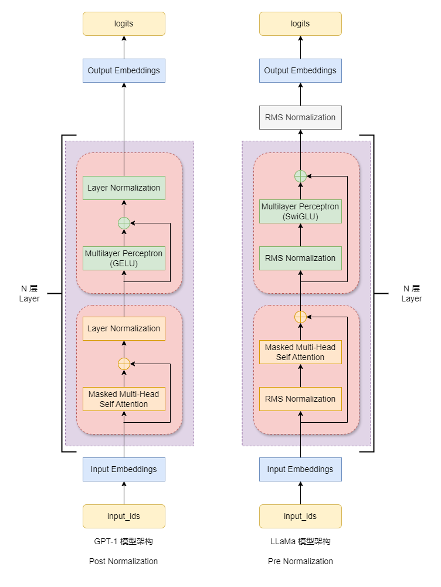
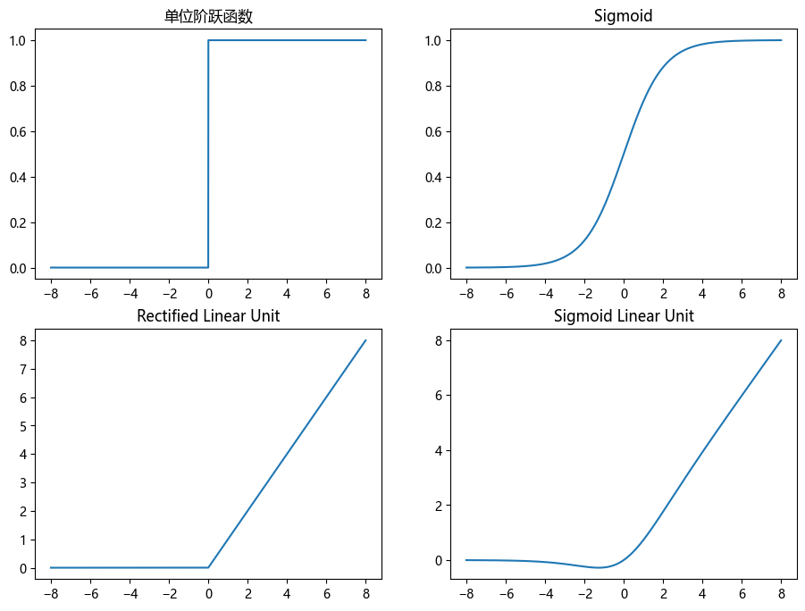
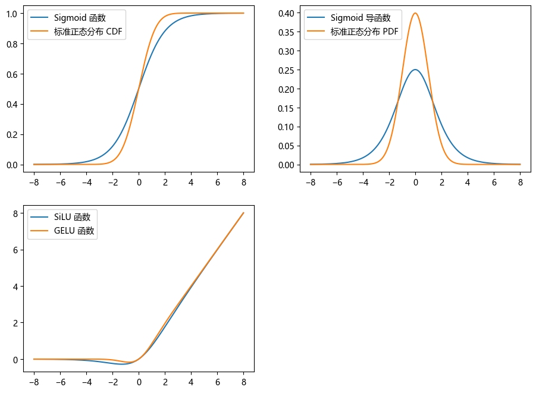
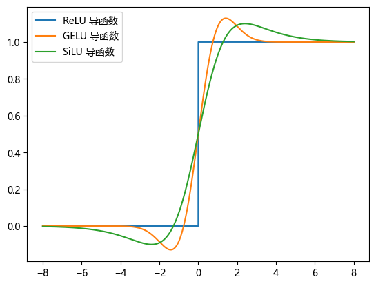

# Decoder-Only LLM 概述

大语言模型 (LLM) 主要由两个概率模型组成: 一个是分词模型, 另一个则是语言模型。目前的主流 分词算法 是 [BBPE](https://arxiv.org/abs/1508.07909), 对此不了解的可以参考我之前写的 [博客](https://zhuanlan.zhihu.com/p/664717335); 主流的 语言模型 是以 [LLaMA](https://arxiv.org/abs/2302.13971) 为代表的 Decoder-Only Transformer 架构。

本文主要是介绍 Decoder-Only LLM 相关内容, 将整个知识体系串起来。下面, 让我们开始吧 ~

[TOC]

## 一、生成式模型推理

### 1.1 概率语言模型

在 自然语言处理 中, 我们一般会将 "句子" 转换成一个由 "词语" 构成的 "序列"。这样, 我们就可以将 NLP 的很多任务转换成 序列问题 了。我们将 "句子" 转换成 "词语序列" 的过程称为 "分词", 相关算法可以参考之前的 [博客](https://zhuanlan.zhihu.com/p/664717335)。在 文本生成 任务中, 我们一般会采用 **概率语言模型**, 其描述如下:

我们假设 "词语序列" 中第 $i$ 个 "词语" 的概率分布只与前 $i-1$ 个 "词语" 有关, 与其之后的 "词语" 无关。设 "词语序列" $s$ 由 $m$ 个 "词语" 组成, 分别为 $w_1, w_2, \cdots, w_m$。根据 [条件概率链式法则](https://en.wikipedia.org/wiki/Chain_rule_(probability)) 公式, 我们可以得到:

$$
\begin{align*}
p(s) &= p(w_1,w_2, \cdots, w_m) \\
&= p(w_1) \cdot p(w_2|w_1) \cdot p(w_3|w_1, w_2) \cdot \cdots \cdot p(w_m| w_1, w_2, \cdots, w_{m-1}) \\
&= \prod_{i=1}^m p(w_i | w_1, w_2, \cdots, w_{i-1})
\end{align*}
\tag{1.1}
$$

需要注意的是, 在公式 $(1.1)$ 中, $p(w_1,w_2, \cdots, w_m)$ 表示的不是 $m$ 个词语共同出现的概率, 而是按照 $w_1, w_2, \cdots, w_m$ 这样的 "顺序" 出现的概率, 或者说是这样的 "序列" 出现的概率。同时, 第二行的条件概率也是有 "顺序" 要求的, 比方说 $p(w_3|w_1,w_2)$ 表示的是在 $w_1w_2$ 之后出现 $w_3$ 的概率, 不包含 $w_2w_1$ 之后出现 $w_3$ 的概率。

更一般地, 对于 [条件概率链式法则](https://en.wikipedia.org/wiki/Chain_rule_(probability)), 如果 联合概率 中的事件没有 "顺序" 要求, 只要共同发生就行, 那么 条件概率 也是没有 "顺序" 要求的; 若 联合概率 中的事件有 "顺序" 要求, 那么 条件概率 也是有 "顺序" 要求的。

我们用 [实验概率](https://en.wikipedia.org/wiki/Empirical_probability) (Empirical probability) 来描述上述过程。假设经过实验后产生了 4 个 事件序列: `AB`, `ABC`, `BAB` 和 `CA`, 那么 $p(A, B)$ 的概率是多少呢? 我们用 $t$ 表示总事件数; $\mathrm{count} (A, B)$ 表示事件 $A$ 后发生事件 $B$ 的次数。由此, 我们可以得到:

$$
p(A, B) = \frac{\mathrm{count} (A, B)}{t} = \frac{3}{10} \tag{1.2}
$$

根据公式 $(1.1)$, 我们知道: $p(A, B) = p(A) \cdot p(B|A)$。我们将等式右边用 实验概率 表示:

$$
p(A) \cdot p(B|A) = \frac{\mathrm{count} (A)}{t} \cdot \frac{\mathrm{count} (A, B)}{\mathrm{count} (A)} = \frac{4}{10} \cdot \frac{3}{4} = \frac{3}{10} \tag{1.3}
$$

在上面的例子中, 一个 "事件" 对应 NLP 任务中的一个 "词语"; 同时 "事件序列" 对应 "词语序列"。

在公式 $(1.1)$ 中, $s$ 是 "词语序列"。那么, 如果 $s$ 是 "句子" 呢? 此时, 我们需要在序列前后添加两个虚拟的 "词语": $b$ 和 $e$, 用于标识 "句子" 的开始和结束。此时公式 $(1.1)$ 变成:

$$
\begin{align*}
p(s) &= p(b,w_1,w_2, \cdots, w_m,e) \\
&= p(w_1|b) \cdot p(w_2|b, w_1) \cdot p(w_3|b, w_1, w_2) \cdot \cdots \cdot p(e|b, w_1, w_2, \cdots, w_m) \\
&= p(w_1|b) \cdot \left [ \prod_{i=1}^m p(w_i | b, w_1, w_2, \cdots, w_{i-1}) \right ] \cdot p(e|b, w_1, w_2, \cdots, w_m)
\end{align*}
\tag{1.4}
$$

在公式 $(1.4)$ 中, $p(w_1 | b)$ 表示的是 $w_1$ 出现在 句首 的概率; $p(e|b, w_1, w_2, \cdots, w_m)$ 表示序列 $b, w_1, w_2, \cdots, w_m$ 出现在 句尾 的概率; $p(b)$ 等于 1, 这里就忽略了。

我们还用 实验概率 来描述一下上述过程。假设实验后产生了 4 个句子: `AB`, `ABC`, `BAB` 和 `CA`。那么很明显, 句子 `AB` 的概率是 $\frac{1}{4}$。我们用 $t$ 表示实验的总 "句子" 数, 则:

$$
\begin{align*}
p(s) &= p(A|b) \cdot p(B|b, A) \cdot p(e|b, A, B) \\
&= \frac{\mathrm{count} (b, A)}{t} \cdot \frac{\mathrm{count} (b, A, B)}{\mathrm{count} (b, A)} \cdot \frac{\mathrm{count}(b, A, B, e)}{\mathrm{count}(b, A, B)} \\
&= \frac{2}{4} \cdot \frac{2}{2} \cdot \frac{1}{2} \\
&= \frac{1}{4}
\end{align*}
 \tag{1.5}
$$

需要注意的是, 在公式 $(1.2)$ 和 $(1.3)$ 中, $t$ 是 语料库 中的总 "词语" 数; 在公式 $(1.5)$ 中, $t$ 是 语料库 中的总 "句子" 数。$s$ 的含义不同, 在实际计算时, 区别很大。

网上很多教程将公式 $(1.1)$ 称为 概率语言模型, 但是实际上公式 $(1.4)$ 才是完整地 概率语言模型。我个人将公式 $(1.1)$ 称为 事件序列 (词语序列) 的 条件概率链式法则, 其广泛应用于很多 序列模型 中, 一定要理解其含义。

那么, 如何计算上面公式的 $p(w_i | w_1, w_2, \cdots, w_{i-1})$ 呢? 通过上面的例子, 我们可以发现, 当一个序列中的 "词语" 数量过多时, 我们很难使用 实验概率 的方式去估算其概率。即使你的语料库非常地大, 也很难找到两个完全相同的 长句子。一般情况下, 有两种解决办法, 一种是 简化假设, 另一种是 函数估算。下面, 让我们来看看这两种方式。

### 1.2 n 元语法

我们一般采用 n-gram 假设的方式来简化上一节所说的 概率语言模型, 即假设第 $i$ 个词的概率分布只与前 $n - 1$ 个词有关, 与其它的词语无关。常见的有 unigram, bigram 和 trigram 三种, 翻译成中文是 一元语法, 二元语法 和 三元语法。一元语法 表示每一个词的概率分布是独立的, 与其它词都没有关系; 二元语法 表示每一个词的概率分布只与前面的一个词相关; 三元语法 表示每一个词的概率分布只与前面的两个词相关。

在有了上面的假设后, 我们可以直接根据 语料库 使用 实验概率 进行估算。比方说, $p(w_1)$ 就是 $w_1$ 在 语料库 中出现的次数 除以 语料库的总词数; $p(w_1|w_2)$ 就是语料库中 $w_2w_1$ 出现的次数 除以 $w_2$ 出现的次数。这种方法也被称为 MLE (Maximum Likelihood Estimation)。

一个常见的应用是 中文分词, 假设我们使用 一元分词 算法。在训练的时候, 我们用已经 人工分词 完成的数据集 统计词频, 计算每一个词单独出现的概率; 在推理时, 我们计算所有切分方式的 路径概率, 取最大的那一个做为分词结果。为了方便 "遍历", 我们需要构建 "树形" 结构, 剪枝成 "词图", 并采用 "维特比算法" 避免重复运算。

相关内容已经超出了本文计划的范畴, 这里就不过多讨论了。额外补充一点, n-gram 假设 和 马尔可夫假设 是有相关性的: 二元语法 (bigram) 对应 (一阶) 马尔可夫链; 三元语法 (trigram) 对应二阶马尔可夫链。

### 1.3 函数估算 与 模型推理

第二种是用函数估算: 函数的输入是前 $m$ 个词语, 输出第 $m + 1$ 个词语的概率分布 (`logits`), 整个函数的功能就是一个词表级别的 Softmax 回归。这种方式常用于 "文本生成" 任务, 这里的 "函数" 一般被称为 "模型"。常见的模型有两类: 单向 RNN 类 和 GPT 类。目前, 我们所说的 大语言模型 就是 GPT 类, 包括 OpenAI 的 GPT 系列, 阿里的 QWen 系列, 脸书的 LLaMA 系列 等等。

一般情况下, 我们将这类模型称为 自回归模型 (autoregressive models) 或者 因果语言模型 (causal language modeling), 其含义是根据 历史序列 推测 未来序列。它们使用的 概率语言模型 (Probabilistic Langauge Models) 是公式 $(1.4)$。需要注意的是, 在这类模型中, 用户至少要有一个 词语 的输入, 即没有办法估算 $p(w_1|b)$ 的概率分布, 只能估算 $p(w_i|b, w_1, w_2, \cdots, w_{i-1})$ 的概率分布。

此时就会产生一个问题, 我们如何根据这样的 "概率函数" 来生成句子呢? 按照原始的想法, 我们需要 "遍历" 所有可能的输出路径, 使用公式 $(1.4)$ 来计算路径概率, 选取概率最大的那一条作为最终输出的句子。我们将这种方式称为 **穷举策略**。假设词表中的词数是 $V$, 生成的句子有 $m$ 个词语, 那么最终有 $V^m$ 种情况。在文本生成任务中, 词表中一般有几万个词语, 即使 $m=2$, 最终的可能性都上亿了, 此时的运算量显然是不能接受的。那么, 我们就需要采取其它的策略。

最简单的就是 **贪心策略**, 即每一步都取 词表概率 最大的那一词语, 不考虑全局最优路径, 具体的代码如下:

```python
import torch 
from torch import Tensor 
from transformers import AutoTokenizer
from transformers.models.qwen2 import Qwen2ForCausalLM

model_name = "deepseek-ai/DeepSeek-R1-Distill-Qwen-1.5B"
max_length = 50

with torch.no_grad(), torch.device("cuda:0"):
    tokenizer = AutoTokenizer.from_pretrained(model_name)
    model = Qwen2ForCausalLM.from_pretrained(model_name).eval()
    eos_token = tokenizer.special_tokens_map['eos_token']
    messages = [{"role": "user", "content": "草莓的英文单词有几个R字母?"}]

    input_ids: Tensor = tokenizer.apply_chat_template(
        messages, return_tensors="pt", add_generation_prompt=True
    )

    for _ in range(max_length):
        logits = model.forward(input_ids, num_logits_to_keep=1).logits.squeeze(1)  # [batch_size, vocab_size]
        output_id = logits.argmax(dim=-1, keepdim=True)  # 贪心策略 [batch_size, 1]
        # output_id = do_sample(logits, temperature=0.7, top_k=50, top_p=0.95)  # 采样策略 [batch_size, 1]
        output_token = tokenizer.decode(output_id.item())

        if output_token != eos_token:
            print(output_token, end="", flush=True) 
        else:
            print()
            break 
        
        input_ids = torch.cat([input_ids, output_id], dim=-1)
```

一般情况下, 我们将生成一个 "词语" 称为一 "步"。"步" 是从 序列问题 (时序问题) 的角度来描述的。贪心策略 的准确描述是: 我们依次生成词语序列, 每一次取 "词表概率分布" 中概率最大的那一个词语。如果生成的句子有 $m$ 个词语, 那么就需要调用 大模型 $m$ 次。这种方式是效率最高的生成方式。

在目前的大模型上, 贪心策略的效果还是不错的, 主要原因是模型的效果好, 每一步都可以做出较为精准的预测。在早期的单向 LSTM 模型时期, 贪心策略的效果就要大打折扣了, 很容易生成重复的序列。那时主流的方式是采取 束搜索 (beam search), 即每一步都保留概率最大的 $k$ 条路径。贪心策略可以当作是 $k = 1$ 的 束搜索。

现在主流的生成方式是 **采样策略**, 即每一步根据词表的概率分布采样出来一个词语。采样过程的示例代码如下:

```python
def do_sample(
        logits: Tensor,  # [batch_size, vocab_size]
        temperature: float = 1.0, top_k: int = None, 
        top_p: float = None, min_tokens_to_keep: int = 1
):
    # ## 1. temperature: 修改词表概率分布的形状
    temperature = max(temperature, 1e-5)  # 最小值为 1e-5, 此时等价于 贪心策略
    logits = logits / temperature

    # ## 2. top_k: 将概率最高的 k 个词语作为候选词
    if top_k is not None:
        top_k = min(top_k, logits.size(-1))  # 当 top_k = 1 时, 等价于 贪心策略
        min_logits = torch.topk(logits, top_k).values[..., -1].unsqueeze(-1)
        indices_to_remove = logits < min_logits
        logits = logits.masked_fill(indices_to_remove, float("-inf"))

    # ## 3. top_p: 将累积概率在 top_p 范围内的词语作为候选词
    # 换言之, 将词表概率从高到低排序, 求累积概率, 保留累积概率低于 top_p 的词语
    if top_p is not None:
        # 将词表概率从低到高排序, 求累积概率, 然后将累积概率低于 1 - top_p 的词语都删除掉
        # 当 top_p = 0 时, 等价于 贪心策略
        sorted_logits, sorted_indices = torch.sort(logits, dim=-1, descending=False)  # 升序排列
        cumulative_probs = sorted_logits.softmax(dim=-1).cumsum(dim=-1)  # 转换成概率, 累加
        sorted_indices_to_remove = cumulative_probs <= (1 - top_p)
        sorted_indices_to_remove[..., -min_tokens_to_keep :] = False  # 至少保留 min_tokens_to_keep 个词语
        indices_to_remove = sorted_indices_to_remove.scatter(1, sorted_indices, sorted_indices_to_remove)
        logits = logits.masked_fill(indices_to_remove, float("-inf"))

    # ## 4. 采样
    probs = torch.softmax(logits, dim=-1)
    # HuggingFace Transformers 实现方式: 多项式分布
    next_tokens = torch.multinomial(probs, num_samples=1)
    # DeepSeek-V3 实现方式: 指数分布
    # next_tokens = probs.div_(torch.empty_like(probs).exponential_(1)).argmax(dim=-1, keepdim=True)

    return next_tokens
```

采样策略主要有三个参数: `temperature`, `top_k` 和 `top_p`。下面, 让我们逐个来看:

第一个参数是 `temperature`, 其是用来修改 词表概率分布 的形状的。我们知道, softmax 是 one-hot argmax 函数的光滑近似函数, 也就是说:

+ 当我们对 logits 乘以大于 1 的数字后, 数值之间的差距会增加, 经过 softmax 函数后 词表概率 分布会趋于 "陡峭"
+ 当我们对 logits 乘以小于 1 的数组后, 数值之间的差距会缩小, 经过 softmax 函数后 词表概率 分布会趋于 "平缓"

从上面的代码可以看出, 我们实际上是用 `logits` 乘以 `1 / temperature`, 也就是说:

+ 当 temperature 取值在 0 至 1 之间时, 词表的概率分布会趋于 "陡峭", 此时生成的文本确定性较高, 适用于非创意类的任务, 比方说 代码生成、数学解题 等等
+ 当 temperature 取值大于 1 时, 词表的概率分布会趋于 "平缓", 此时生成的文本确定性较低, 适用于创意类的任务, 比方说 诗歌创作、小说续写 等等

在 DeepSeek 的官方文档中, 建议:

+ "代码生成/数学解题" 任务的 temperature 取值为 $10^{-5}$, 此时确定性最高, 等价于 贪心策略
+ "数据抽取/分析" 任务的 temperature 取值为 $1$, 此时不修正 词表的概率分布
+ "通用对话" 和 "翻译" 任务的 temperature 取值为 $1.3$
+ "创意类写作/诗歌创作" 任务的 temperature 取值为 $1.5$

后两个参数 `top_k` 和 `top_p` 目的都是: 避免采样到概率非常低的词语。其中, 第二个参数是限制从概率最高的 `top_k` 个词语中采样, 这很容易理解。

第三个参数 `top_p`: 限制从 累积概率 在 `top_p` 范围内的词语中采样。具体的做法是: 将词表概率从高到低排序, 求累积概率, 保留累积概率低于 `top_p` 的词语作为候选词。(实际实现时, 是反过来的, 这样可以多保留一个词语)

举一个具体的例子: 假设模型的输入是 "广州的白云", 模型输出的词表概率为: "机场" 为 0.3, "很蓝" 为 0.5, "下雨" 为 0.02, "像" 为 0.16, 其它词都忽略不计。(注: 广州的机场叫做 白云机场, 还有 广州市白云区。)

那么, 在经过降序排序, 求累积概率分布后, 我们可以得到: "很蓝" 为 0.5, "机场" 为 0.8, "像" 为 0.96, "下雨" 为 0.98, 其它的都忽略不计。如果我们设置 `top_p` 为 0.95, 那么我们就去寻找第一个 累积概率 大于 0.95 的词语, 那就是 "像"。然后舍弃 "像" 之后的所有词语, 此时的候选词有三个: "很蓝", "机场" 和 "像"。最后, 我们根据候选词的概率值进行采样即可。

`top_k` 和 `top_p` 这两个参数是可以一起使用的。一般情况下, 前者取值为 50, 后者取值为 0.95, 你也可以根据自己的应用场景去调整。

至此, 你应该对生成式模型的推理方式有一个大致的了解了。当然, 这不是目前 LLM 推理的最终方案, 还有 KV Cache 优化, 在本文的第五章中会详细介绍。

## 二、LLaMA 模型架构



上图是 GPT-1 和 LLaMA 模型架构的对比图。[GPT-1](https://cdn.openai.com/research-covers/language-unsupervised/language_understanding_paper.pdf) 模型仅仅保留了 [Transformer](https://arxiv.org/abs/1706.03762) 的 Decoder 部分, 删除了 Encoder 部分和 Cross Attention 模块, 我们将其称为 Decoder-Only 架构。整个模型由数个 Decoder Layer 组成, 单个 Decoder Layer 由一个残差 Attention Block 和一个残差 MLP Block 组成。

其中, Attention Block 由 四个线性层 和 一个 Attention 运算 构成。词向量矩阵先进行三次线性层变换, 得到 Query, Key 和 Value 矩阵后, 再进行 Attention 运算得到 Output 矩阵, 最后将 Output 矩阵进行一次线性层变换, 作为 Attention Block 的输出。Attention 运算相关的内容参考第三章的内容。

MLP Block 由 两个线性层 和 一个激活函数 构成。运算方式是对词向量矩阵先进行一次线性层变换, 然后经过激活函数后, 再进行一次线性层变换。对这个过程不了解的可以参考我之前的 [博客](https://zhuanlan.zhihu.com/p/676212963)。一般情况下, 第一个 线性层 会增加 词向量 的维度, 我们称为 Up Projection; 第二个 线性层会恢复词向量的维度, 我们称为 Down Projection。

相较于 GPT-1 模型, 右边的 LLaMA 模型有以下的一些变动:

首先, 借鉴 [GPT-2](https://cdn.openai.com/better-language-models/language_models_are_unsupervised_multitask_learners.pdf) 的模型架构, 将 Normalization 从每一个 残差块 (residual block) 输出的位置移动到输入的位置, 并添加到 shortcut connection 的计算范围内。为了进行区别, 我们将这种方式称为 **Pre-normalization**, 与之相对的 GPT-1 模型的方式称为 **Post-Normalization**。根据苏剑林大佬的 [博客](https://kexue.fm/archives/9009), Pre-Normalization 结构训练收敛的速度快, 但是收敛后的效果不如 Post-Normalization。

其次, 将 LayerNorm 层换成了 RMSNorm 层, 去掉了 Normalization 中 re-centering 部分, 更多内容参考第六章。

接着, 借鉴 PaLM 模型架构, MLP Block 采用 SwiGLU 激活函数, 此时会增加一个线性层, 更多内容参考第七章。

然后, 去除了所有线性层的 bias 参数, 包括 Attention Block 中的四个线性层, MLP Block 中的三个线性层 (采用 GLU 式激活函数会增加一个) 以及 output embedding 线性层。注意, 这里没有设置 task-specific 线性层, 也没有让 input embedding 和 output embedding 权重共享的做法。个人认为, 去除 bias 参数是配合 RMSNorm 层使用的。在 QWen2 模型中, 将 Attention Block 中 Query, Key 和 Value 映射线性层的 bias 参数又添加回去了, 它们主要是参与 Attention 运算的, 对 RMSNorm 层的影响很小。

最后, 借鉴 GPTNeo 模型架构, 使用 RoPE 位置编码。相关内容参考之前我写的 [博客](https://zhuanlan.zhihu.com/p/662790439) 和本文第四章的内容。

至此, 你应该对 LLaMA 的模型架构有一个大致了解。目前很多开源大语言模型都采用了相似的架构, 比方说 [Qwen2](https://arxiv.org/abs/2407.10671) 模型。下面, 让我们来看看模型的细节内容。

## 三、Attention 运算

### 3.1 标准的 Attention 运算

用一句话表述 Attention 运算就是: 对单个 query 向量进行重新编码, 编码后的向量是一组 value 向量的线性组合; 其中, 线性组合的系数由 query 向量和一组 key 向量点乘后, 再经过 softmax 运算后得到。我们将这种运算方式称为 Scaled Dot Product Attention (sdpa), 用公式表示如下:

$$
\bold{o}^{\mathsf{T}} = \mathrm{softmax} (\frac{\bold{q}^{\mathsf{T}} \cdot K^{\mathsf{T}}}{\sqrt{d_k}}) \cdot V \tag{3.1}
$$

实现代码大致如下:

```python
def demo_sdap(
        query: Tensor, key: Tensor, value: Tensor, attn_mask: Tensor, 
        dropout_p: float = 0.0, scale: float = None
) -> Tensor:

    # query: [batch_size, num_heads, num_query_tokens, hidden_size]
    # key / value: [batch_size, num_heads, num_kv_tokens, hidden_size]
    # attn_mask: [batch_size, 1, num_query_tokens, num_kv_tokens]
    num_query_tokens = query.size(-2)  # tgt_len
    num_kv_tokens = key.size(-2)  # src_len

    if scale is None:
        hidden_size = query.size(-1)
        scale = 1. / math.sqrt(hidden_size)

    # ## step2: 计算 attn_scores: [batch_size, num_heads, num_query_tokens, num_kv_tokens]
    attn_scores = torch.matmul(query, key.transpose(-1, -2))
    attn_scores = attn_scores * scale + attn_mask

    # ## step3: 计算 attn_probs: [batch_size, num_heads, num_query_tokens, num_kv_tokens]
    attn_probs = torch.softmax(attn_scores, dim=-1)
    attn_probs = torch.dropout(attn_probs, p=dropout_p, train=True)

    # ## step4: 计算最终输出: [batch_size, num_heads, num_query_tokens, hidden_size]
    output = torch.matmul(attn_probs, value)
    return output 
```

我们知道, 左行向量 和 右矩阵 的乘法有两种理解方式。一种理解方式是: 左行向量 和 右矩阵的列向量 进行点乘, 得到结果行向量的元素值。用公式表示如下:

$$
\bold{q}^{\mathsf{T}} \cdot \begin{bmatrix}
    \bold{k}_1 & \bold{k}_2 & \cdots & \bold{k}_n
\end{bmatrix} = \begin{bmatrix}
    \bold{q}^{\mathsf{T}} \cdot \bold{k}_1 & \bold{q}^{\mathsf{T}} \cdot \bold{k}_2 & \cdots & \bold{q}^{\mathsf{T}} \cdot \bold{k}_n
\end{bmatrix} \tag{3.2}
$$

第二种理解方式是: 右矩阵行向量的线性组合, 其中, 线性组合的系数为 左行向量 的元素值。用公式表示如下:

$$
\begin{bmatrix} a_1 & a_2 & \cdots & a_n \end{bmatrix} \cdot
\begin{bmatrix}\bold{v}_1^{\mathsf{T}} \\ \bold{v}_2^{\mathsf{T}} \\ \vdots \\ \bold{v}_n^{\mathsf{T}}\end{bmatrix}
= a_1 \cdot \bold{v}_1^{\mathsf{T}} + a_2 \cdot \bold{v}_2^{\mathsf{T}} + \cdots + a_n \cdot \bold{v}_n^{\mathsf{T}} \tag{3.3}
$$

在上述代码中, 公式 $(3.2)$ 主要用于 `attn_scores` 的计算, 公式 $(3.3)$ 主要用于 `output` 的计算。那么, 实际上 attention 运算就是由两次矩阵乘法和一次 softmax 运算构成。

之前爆火的 Flash Attention 就是优化上述代码的计算过程, 让其在 GPU 上执行效率更高。PyTorch 2.0+ 中提供了 [torch.nn.functional.scaled_dot_product_attention](https://pytorch.org/docs/stable/generated/torch.nn.functional.scaled_dot_product_attention.html) 函数, 专门用于优化 Attention 的运算过程。目前提供了四种后端, 对其有不同程度的优化:

+ `MATH`: 用 PyTorch 的 C++ API 实现上述代码
+ `FLASH_ATTENTION`: [Flash Attention](https://github.com/Dao-AILab/flash-attention) 的优化方式
+ `EFFICIENT_ATTENTION`: [memory-efficient attention](https://arxiv.org/abs/2112.05682) 的优化方式
+ `CUDNN_ATTENTION`: 使用 cuDNN 提供的 API 接口实现

一般情况下, RoPE 位置编码不作为 Attention 运算的一部分, 而 [Grouped Query Attention](https://arxiv.org/abs/2305.13245) 则包含在 Attention 运算中。除此之外, PyTorch 官方还提出了 [FlexAttention](https://pytorch.org/blog/flexattention/) 的 API, 用于统一不同的 Attention 运算范式。相关的内容非常多, 计划在之后的博客中介绍。

### 3.2 Attention Mask

在 Attention 运算中需要进行两个 mask 操作: 一个是 "序列 mask", 另一个是 "因果 mask"。"序列 mask" 的作用是为了解决多个样本词向量个数不一致的问题, 主要用于 batch inference; "因果 mask" 的作用是保证每一个词向量只与在其之前的词向量进行交互, 不会与在其之后的词向量进行交互。

模型输入的 mask 是 "序列 mask", 其 shape 是 `[batch_size, num_tokens]`, 而 Attention 运算 mask 的 shape 是 `[batch_size, 1, num_query_tokens, num_kv_tokens]`, 融合了 "序列 mask" 和 "因果 mask"。这两个 mask 融合的示例代码如下:

```python
def demo_attn_mask(
        input_ids: Tensor,  # [batch_size, num_query_tokens]
        attention_mask: Tensor = None,  # [batch_size, num_kv_tokens]
        past_seen_tokens: int = 0  # past_key_values 中的 kv 词向量个数
    ) -> Tensor:

    num_query_tokens = input_ids.size(1)
    num_kv_tokens = num_query_tokens + past_seen_tokens

    if attention_mask is not None:
        assert attention_mask.size(-1) == num_kv_tokens
        attn_mask = seq_attn_mask
    else:
        seq_attn_mask = torch.ones(1, num_kv_tokens)
    seq_attn_mask = seq_attn_mask[:, None, None, :].float()  # [batch_size, 1, 1, num_kv_tokens]

    causal_attn_mask = torch.tril(torch.ones(num_query_tokens, num_kv_tokens), diagonal=past_seen_tokens)
    causal_attn_mask = causal_attn_mask[None, None, :, :]  # [1, 1, num_query_tokens, num_key_tokens]

    attn_mask = seq_attn_mask * causal_attn_mask
    attn_mask = -10000. * (1 - attn_mask)

    return attn_mask 
```

在上面的代码中, `past_seen_tokens` 表示 KV Cache 中的词向量个数。相关内容在 第五章 中介绍。

需要注意的是, "序列 mask" 的构建和 padding 方式以及 `position_ids` 的构建是息息相关地。

在目前的 LLM 中, 一般情况下训练采用 right padding, 推理采用 left padding。left padding 的含义是在序列的左边填充, 保证右对齐。right padding 的含义则是在序列的右边填充, 保证左对齐。

在模型训练的过程中, 所有 "填充 token" 的标签都是 -100, 含义是不加入 loss 的计算, 预测什么都是可以的。因此 left padding 和 right padding 都可以。我们一般沿用之前的方式, 采用 right padding。

在模型推理的过程中, 如果采用 left padding, 那么序列的组成是 "填充 tokens" + 模型输入 + 模型输出; 如果采用 right padding, 那么推理时序列的组成是: 模型输入 + "填充 tokens" + 模型输出。显然, 前者更加地合理。当然, 如果你调整好 "序列 mask" 和 `position_ids` 的格式, right padding 也是没有问题的。

在推理过程中使用 left padding 还有一个好处, 那就是不需要额外考虑 `position_ids` 的构建了。目前的大模型基本上都采用 RoPE 相对位置编码, 我们并不需要保证所有 token 的 "绝对位置索引" 都正确, 只要保证 token 之间的 "相对位置" 正确即可。比方说原本的 `position_ids` 是 `[0, 1, 2, 3, 4]`, 现在变成 `[25, 26, 27, 28, 29]` 是完全没问题的。

实际上, 在一次 模型运算 的过程中, `attn_mask` 的运算只要进行一次即可, 因为其适用于所有 Decoder Layer 中的 Attention 运算。在 HuggingFace Transformers 中, 专门提供了 `transformers.modeling_attn_mask_utils` 模块用于计算 `attn_mask` 的计算, 不过封装的过于复杂了。

## 四、RoPE 位置编码

RoPE 相关的内容在之前的 [博客](https://zhuanlan.zhihu.com/p/662790439) 中已经详细介绍过了, 用一句话概括就是: 对 query 和 key 向量进行分组, 每一组是一个二维向量, 然后对这个向量进行 "位置索引" 弧度的旋转, 这样两者在相乘时就包含 **相对位置** 信息。

我们用 $\bold{qk}$ 表示 query 或者 key 向量, $i$ 表示它的 "位置索引", $d$ 表示向量 $\bold{qk}$ 的维度, $r$ 表示向量 $\bold{qk}$ 的维度索引, $\theta_r$ 用于修正不同组的旋转程度, $\odot$ 表示按位乘法, 则计算公式如下:

$$
\mathrm{RoPE}(\bold{qk}_i) =
\begin{bmatrix}
    qk_0 \\ qk_1 \\ qk_2 \\ qk_3 \\ \vdots \\ qk_{d-2} \\ qk_{d-1}
\end{bmatrix} \odot
\begin{bmatrix}
    \cos i\theta_0 \\ \cos i\theta_0 \\ \cos i\theta_2 \\ \cos i\theta_2 \\ \vdots \\ \cos i\theta_{d-2} \\ \cos i\theta_{d-2}
\end{bmatrix} +
\begin{bmatrix}
    -qk_1 \\ qk_0 \\ -qk_3 \\ qk_2 \\ \vdots \\ -qk_{d-1} \\ qk_{d-2}
\end{bmatrix} \odot
\begin{bmatrix}
    \sin i\theta_0 \\ \sin i\theta_0 \\ \sin i\theta_2 \\ \sin i\theta_2 \\ \vdots \\ \sin i\theta_{d-2} \\ \sin i\theta_{d-2}
\end{bmatrix} \tag{4.1}
$$

一般情况下, $\theta_r = 10000^{-r/d}$, 其中 $r \in [0, d)$ 且 $r$ 为偶数。在 LLaMa 架构中, 对 RoPE 的分组方式进行了修改, 让第 $0$ 个元素值和第 $\frac{d}{2}$ 个元素为一组, 第 $1$ 个元素和第 $\frac{d}{2} + 1$ 个元素为一组, 依次类推, 第 $\frac{d}{2} - 1$ 个元素和第 $d - 1$ 个元素为一组。此时的公式如下:

$$
\mathrm{RoPE}(\bold{qk}_i) =
\begin{bmatrix}
    qk_0 \\ qk_1 \\ \vdots \\ qk_{d/2-1} \\ qk_{d/2} \\ qk_{d/2+1} \\ \vdots \\ qk_{d-1}
\end{bmatrix} \odot
\begin{bmatrix}
    \cos i\theta_0 \\ \cos i\theta_2 \\ \vdots \\ \cos i\theta_{d-2} \\ \cos i\theta_0 \\ \cos i\theta_2 \\ \vdots \\ \cos i\theta_{d-2}
\end{bmatrix} +
\begin{bmatrix}
    -qk_{d/2} \\ -qk_{d/2+1} \\ \vdots \\ -qk_{d-1} \\ qk_0 \\ qk_1 \\ \vdots \\ qk_{d/2-1}
\end{bmatrix} \odot
\begin{bmatrix}
    \sin i\theta_0 \\ \sin i\theta_2 \\ \vdots \\ \sin i\theta_{d-2} \\ \sin i\theta_0 \\ \sin i\theta_2 \\ \vdots \\ \sin i\theta_{d-2}
\end{bmatrix} \tag{4.2}
$$

相较于公式 $(4.1)$, 公式 $(4.2)$ 的优势是代码容易实现, 具体的代码如下:

```python
import torch 
from torch import Tensor 

def _compute_default_rope_parameters(base: float = 10000., dim: int = 128) -> Tensor:
    """ 计算 theta 值, 相关代码位于 transformers.modeling_rope_utils 中 """
    inv_freq = 1.0 / (base ** (torch.arange(0, dim, 2).float() / dim))  # theta 
    return inv_freq  # [hidden_size // 2]

def rope_forward(position_ids: Tensor) -> tuple[Tensor, Tensor]:
    """ 计算公式中的 cos(m * theta) 和 sin(m * theta), 相关代码位于 RotaryEmbedding 中  """
    # ## step1: 计算 theta 值, 一般在 __init__ 中预先算好
    inv_freq = _compute_default_rope_parameters()  # theta
    inv_freq = inv_freq[None, :, None].float()  # [1, hidden_size // 2, 1]

    # ## step2: 计算 m * theta 值, 注意这里的分组方式发生了变化
    position_ids = position_ids[:, None, :].float()  # [batch_size, 1, num_tokens]
    freqs = torch.matmul(inv_freq, position_ids).transpose(1, 2)  # [batch_size, num_tokens, hidden_size // 2]
    emb = torch.cat([freqs, freqs], dim=-1)  # [batch_size, num_tokens, hidden_size]

    # ## step3: 取 cos 和 sin 值
    return emb.cos(), emb.sin()  # [batch_size, num_tokens, hidden_size] 

def rotate_half(qk_vec: Tensor):
    """ 将向量的后半部分添加负号, 拼接到前面 """
    hidden_size = qk_vec.size(-1)
    x1 = qk_vec[..., : hidden_size // 2]
    x2 = qk_vec[..., hidden_size // 2 :]
    return torch.cat([-x2, x1], dim=-1)

def apply_rotary_pos_emb(query: Tensor, key: Tensor, position_ids: Tensor, unsqueeze_dim: int = 1):
    """ 对 query 和 key 向量实施旋转变换 """
    cos_table, sin_table = rope_forward(position_ids)
    cos_table = cos_table.unsqueeze(unsqueeze_dim)  # [batch_size, 1, num_tokens, hidden_size]
    sin_table = sin_table.unsqueeze(unsqueeze_dim)  # [batch_size, 1, num_tokens, hidden_size]
    q_embed = (query * cos_table) + (rotate_half(query) * sin_table)
    k_embed = (key * cos_table) + (rotate_half(key) * sin_table)
    return q_embed, k_embed
```

## 五、KV Cache 与 Attention 层

观察第二章的模型架构图, 我们可以发现, 一个样本中词向量之间的交互都集中在 Attention 运算之上; 其它的运算过程 (比方说线性层, 激活函数, LayerNorm 等等) 都只涉及到词向量本身。同时, 在 Attention 运算中, 每一个词向量只与其之前的词向量进行交互, 不会与其之后的词向量进行交互。

我们可以利用上面的特性对 1.3 节介绍的模型推理过程进行优化: 在进行一次模型计算时, 将所有 Attention 运算的 Key 矩阵和 Value 矩阵保存起来, 给后续的步骤使用, 以避免重复地运算。我们将这种优化方式称为 KV Cache。此时, 推理过程变成:

第一步推理时, 用户输入 $m$ 个 token, 我们需要将这 $m$ 个 token 都输入到模型当中, 也就是说, `input_ids` 的 shape 是 `[batch_size, num_input_tokens]`。输出的 `logits` shape 是 `[batch_size, num_input_tokens, vocab_size]`, 我们只保留最后一个词表概率分布即可, 然后根据 贪心策略 或者 采样策略 获得第 $m+1$ 个 token。同时, 在运算的过程中记录每一个 Attention Block 的 Key 矩阵和 Value 矩阵。此时 Attention 运算需要用到 "因果 mask"。

第二步推理时, 我们只需要将第 $m+1$ 个 token 输入到模型当中即可, 之前输入过的 token 就不用再输入了, 也就是说, `input_ids` 的 shape 是 `[batch_size, 1]`。此时的 Attention 运算: Query 是单个词向量; Key 和 Value 都是词向量矩阵, 由 "当前词向量的 key 和 value 形式" 与 "之前保留的 Key 矩阵和 Value 矩阵" 拼接而成。模型输出的 `logits` 也只有第 $m+2$ 步的词表概率分布, 其 shape 为 `[batch_size, vocab_size]`。此时 Attention 运算不再需要 "因果 mask"。

之后的推理过程和第二步类似。关于 KV Cache 的代码都在 Attention Block 中, 不在 Attention 运算之中。Attention Block 的代码大致如下:

```python
class AttentionBlock(nn.Module):
    def __init__(self, hidden_size: int, num_heads: int, attn_dropout: float = 0.0):
        super().__init__()
        self.hidden_size = hidden_size
        self.num_heads = num_heads
        self.head_size = hidden_size // num_heads
        self.scaling = self.head_size ** -0.5
        self.attention_dropout = attn_dropout

        self.q_proj = nn.Linear(hidden_size, hidden_size, bias=True)
        self.k_proj = nn.Linear(hidden_size, hidden_size, bias=True)
        self.v_proj = nn.Linear(hidden_size, hidden_size, bias=True)
        self.o_proj = nn.Linear(hidden_size, hidden_size, bias=False)

    def forward(
            self, hidden_states: Tensor, position_embeddings: tuple[Tensor, Tensor],
            attention_mask: Tensor, past_key_value: tuple[Tensor, Tensor] = None,
        ) -> tuple[Tensor, tuple[Tensor, Tensor]]:

        batch_size, num_tokens, _ = hidden_states.shape 
        hidden_shape = (batch_size, num_tokens, -1, self.head_size) 

        query_states = self.q_proj.forward(hidden_states).view(hidden_shape).transpose(1, 2)
        key_states = self.k_proj.forward(hidden_states).view(hidden_shape).transpose(1, 2)
        value_states = self.v_proj.forward(hidden_states).view(hidden_shape).transpose(1, 2)
        query_states, key_states = apply_rotary_pos_emb(query_states, key_states, position_embeddings)

        if past_key_value is not None:
            # 此时 query_states, key_states 和 value_states 的词向量个数都是 1
            # 相关代码位于 transformers.cache_utils.DynamicCache.update 中
            key_states = torch.cat([past_key_value[0], key_states], dim=-2)
            value_states = torch.cat([past_key_value[1], value_states], dim=-2)

        attn_output = torch.nn.functional.scaled_dot_product_attention(
            query_states, key_states, value_states, attention_mask,
            dropout_p=self.attention_dropout, scale=self.scaling
        )

        attn_output = attn_output.reshape(batch_size, num_tokens, -1).contiguous()
        attn_output = self.o_proj.forward(attn_output)
        return attn_output, (key_states, value_states)
```

从上面的代码中, 我们可以看出, RoPE 和 KV Cache 的内容都在 Attention 运算之外。同时, 存储在 `past_key_values` 中的 Key 矩阵是经过 旋转 的。此时, 可能产生一个潜在的问题: 无法在推理的过程中改变 位置编码 的策略, 比方说从常规的 RoPE 变成 NTK-aware Scaled RoPE。

当模型推理时的序列特别长时, KV Cache 占用的显存空间会特别大, 甚至可能超过模型推理的显存消耗, 因此 KV Cache 也可以视为 "空间换时间" 的策略。如何优化 KV Cache, 让其占用的显存空间少, 也是 Attention 的优化内容之一。

一般情况下, Attention 的推理优化有两个方向: 一个是 Attention 运算本身的优化, 比方说 Flash Attention; 另一个是 KV Cache 优化, 比方说 Multi-head Latent Attention。KV Cache 在优化时一定要注意兼容 RoPE 位置编码, 不然会产生很多问题的。在 HuggingFace Transformers 库中, 专门提供了 `transformers.cache_utils` 模块, 用于 KV Cache 的优化。相关内容计划在后续博客中介绍。

额外说明一点, 3.2 节中的 `past_seen_tokens` 其实就是上述代码的 `past_key_value[0].size(-2)`。在推理的过程中, 如果有 "序列 mask", 那么其 shape 始终是 `[batch_size, num_kv_tokens]`。下面, 让我们看看加入 KV Cache 之后的模型推理过程:

```python
import torch 
from tqdm import tqdm
from torch import Tensor 
from transformers import AutoTokenizer
from transformers.cache_utils import DynamicCache
from transformers.models.qwen2 import Qwen2ForCausalLM

model_name = "deepseek-ai/DeepSeek-R1-Distill-Qwen-1.5B"
max_length = 200

with torch.no_grad(), torch.device("cuda:0"):
    tokenizer = AutoTokenizer.from_pretrained(model_name)
    model = Qwen2ForCausalLM.from_pretrained(model_name).eval()
    eos_token_id: int = model.config.eos_token_id
    messages = [
        [{"role": "user", "content": "草莓的英文单词有几个R字母?"}],
        [{"role": "user", "content": "一加一等于几?"}],
    ]

    inputs: dict[str, Tensor] = tokenizer.apply_chat_template(
        messages, add_generation_prompt=True, 
        padding=True, return_tensors="pt", return_dict=True
    )
    input_ids = inputs["input_ids"]
    attn_mask = inputs["attention_mask"]
    past_key_values = DynamicCache()
    output_ids = []

    for _ in tqdm(range(max_length)):
        outputs = model.forward(
            input_ids=input_ids, attention_mask=attn_mask, 
            past_key_values=past_key_values, num_logits_to_keep=1
        )
        
        logits = outputs.logits.squeeze(1)  # [batch_size, vocab_size]
        past_key_values = outputs.past_key_values
        output_id = logits.argmax(dim=-1, keepdim=True)  # 贪心策略 [batch_size, 1]

        if torch.all(output_id == eos_token_id).item():
            break 

        output_ids.append(output_id)
        input_ids = output_id
        attn_mask = torch.cat([attn_mask, torch.ones_like(output_id)], dim=-1)
    
    output_ids = torch.cat(output_ids, dim=-1)  # [batch_size, num_output_tokens]
    # 将第一个 eos_token_id 之后的所有 token 都标记成 eos_token_id
    output_ids[(output_ids == eos_token_id).cumsum(dim=0).bool()] = eos_token_id
    responses = tokenizer.batch_decode(output_ids, skip_special_tokens=True)

    for response in responses:
        print(response)
        print("===" * 10)
```

在使用 KV Cache 后, 模型的推理速度大致为: 第一步推理特别地慢, 时间和用户输入的 token 长度正相关; 第二步推理是最快的, 之后的推理步骤 KV Cache 越来越大, 速度也越来越慢。我们在开发 AI 应用时, 一般会有特定的提示词模板, 这些模板的内容往往是相同的, 此时我们可以将模板 token 的 KV 矩阵缓存起来, 从而加快推理速度。

至此, 你应该对 Attention 机制有一个详细的认知了。下面, 让我们来看看 LLaMA 架构的其它内容。

## 六、RMSNorm 简介

[BatchNorm](https://arxiv.org/abs/1502.03167) 是对样本向量的每一个特征维度进行 re-scaling 和 re-centering。我们设 $i$ 为样本向量的第 $i$ 个特征维度, $\mu_i$ 和 $\sigma_i$ 分别是训练集内该特征维度的均值和标准差, $w_i$ 和 $b_i$ 是可训练参数, 初始值为 $1$ 和 $0$, 则:

$$
o_i = \frac{x_i - \mu_i}{\sigma_i} \cdot w_i + b_i \tag{6.1}
$$

我们可以理解为让神经网络自己学习一个符合后续运算 标准差 $w_i$ 和 均值 $b_i$。在 CV 领域, 我们主要使用 [BatchNorm2d](https://pytorch.org/docs/stable/generated/torch.nn.BatchNorm2d.html), 将训练集内 所有图片所有像素点 的每一个特征维度 (channel) 进行上述运算。在 NLP 领域, 我们主要使用 [BatchNorm1d](https://pytorch.org/docs/stable/generated/torch.nn.BatchNorm1d.html), 是将训练集内 所有句子所有词向量 的每一个特征维度进行上述运算。

在公式 $(6.1)$ 中, 我们可以将左边的 "减均值除标准差" 称为 Normalization, 右边的 "乘 w 加 b" 称为 Scale and Shift。那么, [LayerNorm](https://arxiv.org/abs/1607.06450) 就是改变左边 Normalization 的方式, 将一个样本向量内所有的特征维度进行 "减均值除标准差"; 右边的 Scale and Shift 保持不变。我们设向量 $\bold{x}$ 为样本向量, $\overline{\bold{x}}$ 为样本向量 $\mathrm{mean}({x})$ 所有特征维度的均值, $\mathrm{std}(\bold{x})$ 为样本向量 $\bold{x}$ 所有特征维度的标准差。向量 $\bold{w}$ 和向量 $\bold{b}$ 是可训练参数, 初始值分别是 全一向量 和 零向量, 维度和样本向量 $\bold{x}$ 保持一致。符号 $\odot$ 表示两个向量的 按位乘法, 则:

$$
\bold{o} = \frac{\bold{x} - \mathrm{mean}({x})}{\mathrm{std}(\bold{x})} \odot \bold{w} + \bold{b} \tag{6.2}
$$

也就是说, LayerNorm 是对整个样本向量进行 Normalization 运算, 然后再对每一个特征维度进行 Scale and Shift 运算。我之前看 LayerNorm 时总感觉怪怪地, 现在才发现问题所在: 公式 $(6.2)$ 中的 $w$ 和 $b$ 应该是标量, 这样一个样本向量内所有特征维度的标准差和均值才能是 $w$ 和 $b$。现在这样 "融合" 的运算方式已经失去这层数学含义了。

[RMSNorm](https://arxiv.org/abs/1910.07467) 则是在公式 $(6.2)$ 的基础上去除掉所有 "减均值" 和 shift 操作。RMS 的全称是 Root Mean Square, 即对一组数先平方, 再取均值后开方。设向量 $\bold{x}$ 的维度为 $n$, 元素值是 $x_1, x_2, \cdots, x_n$, 那么:

$$
\mathrm{RMS}(\bold{x}) = \sqrt{\frac{1}{n} \cdot \sum_{i=1}^{n} x_i^2} \tag{6.3}
$$

标准差可以理解为 偏差 的 RMS 值, 即: $\mathrm{std}(\bold{x}) = \mathrm{RMS}(\bold{x} - \mathrm{mean}(\bold{x}))$。那么, 我们将公式 $(6.2)$ 中 "减均值" 和 shift 操作去除后, 计算公式变成:

$$
\bold{o} = \mathrm{\frac{\bold{x}}{RMS(\bold{x})}} \odot \bold{w} \tag{6.4}
$$

我们可以理解为认定均值为零。一般情况下, 在使用 RMSNorm 时, 会去掉模型架构中所有线性层的 bias 参数。实验表明, 将 LayerNorm 换成 RMSNorm 后, 模型的性能变化不明显, 运算速度会有一定幅度地提升。

## 七、SwiGLU 激活函数

### 7.1 GELU 和 SiLU 激活函数

在 [AlexNet](https://proceedings.neurips.cc/paper_files/paper/2012/file/c399862d3b9d6b76c8436e924a68c45b-Paper.pdf) 出来之后, ReLU 成为了主流的激活函数, 其计算方式是: $\mathrm{ReLU} (x) = \max(0, x)$。在此之后, 有很多关于 ReLU 激活函数的改进方案, 其中一个思路是: 寻找 ReLU 的光滑近似函数。这个思路诞生了 [GELU](https://arxiv.org/abs/1606.08415) 和 SiLU (Swish) 两种激活函数。

ReLU 可以写成: $\mathrm{ReLU} (x) = x \cdot H(x)$, 其中 $H(x)$ 为单位阶跃函数。很明显, 在这个公式中, $x$ 部分是光滑函数, 那么我们只需要将 单位阶跃函数 变成光滑函数即可。在之前的 [博客](https://zhuanlan.zhihu.com/p/676212963) 中我介绍过, sigmoid 函数是最经典的 单位阶跃函数 的光滑函数。此时, 我们就可以构建出 SiLU (Sigmoid Linear Unit) 函数:

$$\mathrm{SiLU} (x) = x \cdot \mathrm{sigmoid}(x) \tag{7.1}$$

它们的图像如下:



那么, 除了 sigmoid 函数之外, 还有没有 单位阶跃函数 的光滑近似函数呢? 在之前的 [博客](https://zhuanlan.zhihu.com/p/676212963) 中, 我还提到过, sigmoid 的导函数和 标准正态分布 的 PDF (概率密度函数) 图像是相似的, 都是 "钟形曲线"。那么, 标准正态分布 的 CDF (累积分布函数) 是 单位阶跃函数 的光滑近似函数吗? 答案是的, 它们的图像如下:



我们用 $\Phi(x)$ 表示标准正态分布的 CDF, 即: $\Phi(x) = P(X \le x)$, 其中 $X \sim \mathcal{N}(0,\, 1)$。观察上图, 我们可以发现, Sigmoid 函数在 -4 到 4 的区间内光滑, 而 CDF 函数在 -2 到 2 的区间内光滑。相较于 Sigmoid 函数, CDF 函数的光滑区间更小, 导函数的取值范围更大。我们将用 CDF 构建出来的激活函数称为 GELU (Gaussian Error Linear Unit):

$$\mathrm{GELU}(x) = x \cdot \Phi(x) \tag{7.2}$$

比较麻烦的是, 标准正态分布的 CDF 函数中包含积分项, 不能完全由初等函数构成, 这样计算会非常不方便。为了解决这一问题, 我们可以用下面两个函数来近似 CDF 函数:

$$
\begin{align*}
    \Phi(x) &\approx 0.5 \cdot \left(1+\mathrm{tanh}\left[\sqrt{2 / \pi} \cdot (x + 0.044715x^3)\right] \right) \\
    &\approx \mathrm{sigmoid}(1.702 x)
\end{align*}
\tag{7.3}
$$

论文中实验显示, GELU 的效果要优于 SiLU 和 ReLU, 在 GPT-1 和 BERT 模型中都使用的 GELU 激活函数。最后, 我们来看看这三个激活函数的导函数图像:



### 7.2 GLU 式激活函数

和上面的激活函数不同, [GLU](https://arxiv.org/abs/1612.08083) (Gated Linear Unit) 的输入有两个值, 公式如下:

$$
\mathrm{GLU}(u, g) = u \cdot \mathrm{sigmoid} (g) \tag{7.4}
$$

在使用 GLU 时, 我们需要对输入 $X$ 矩阵进行两次 线性层, 分别得到 $U$ 和 $G$ 矩阵, 然后输入到公式 $(7.4)$ 中得到结果。一般情况下, 我们会将激活函数前面的线性层也算在内, 此时公式 $(7.4)$ 就变成:

$$
\mathrm{GLU} (X) = (W_u \cdot X + \bold{b_u}) \odot \mathrm{sigmoid} (W_g \cdot X + \bold{b_g}) \tag{7.5}
$$

那么, 这样的运算有什么意义呢? 我们知道, Sigmoid 函数在 0 至 1 之间, 那么我们可以将其理解为 "门", 其输出值 $\mathrm{sigmoid} (g)$ 表示 "门" 打开的大小: 当输出值为 1 时, "门" 就是全开着; 当输出值为 0 时, "门" 就是全关着。输出值和 $u$ 相乘就相当于控制 $u$ 通过 "门" 的程度。也正是因为此, 我们称为 "Gated" Linear Unit。

如果你是初学者, 估计很难接受上面的说法。但是, 深度学习 很多时候是 "先射箭后画靶", 我们认为应该怎么算就怎么算, 剩下的交给优化器去优化, 只要最终地实验效果好就行。如果有条件的话, 就将计算后的结果可视化出来。当然, 计算不是瞎算, 深度学习是以 数学为辅助、实验为导向的学科, 我们需要在两者之间取得平衡。

在这之后, [有人](https://arxiv.org/abs/2002.05202) 提出用 1.3 节介绍的 ReLU, GELU 和 SiLU (Swish) 替换上面公式中的 sigmoid 函数, 分别得到 ReGLU, GEGLU 和 SwiGLU。其中, 最后一个就是 LLaMA 模型使用的激活函数, 其公式如下:

$$
\mathrm{SwiGLU}(u, g) = u \cdot \mathrm{silu} (g) = u \cdot g \cdot \mathrm{sigmoid} (g) \tag{7.6}
$$

这样替换之后就没有上面介绍 "门" 的含义了, 不过只要实验效果好就行。在 LLaMA 和 QWen2 的架构中, MLP 的代码大致如下:

```python
class MLP(nn.Module):
    def __init__(self, hidden_size: int, intermediate_size: int):
        super().__init__()
        self.gate_proj = nn.Linear(self.hidden_size, self.intermediate_size, bias=False)
        self.up_proj = nn.Linear(self.hidden_size, self.intermediate_size, bias=False)
        self.down_proj = nn.Linear(self.intermediate_size, self.hidden_size, bias=False)
        self.act_fn = nn.functional.silu

    def forward(self, x):
        down_proj = self.down_proj(self.act_fn(self.gate_proj(x)) * self.up_proj(x))
        return down_proj
```

至此, 你应该对激活函数 SwiGLU 有一个大致地了解。在第二章中我们说过, 为了配合 RMSNorm, MLP Block 中线性层的 bias 参数都取消了。个人认为, MLP 隐藏层的 bias 参数很重要, 如果去掉会降低模型的表达能力, 而这里采用 GLU 式的激活函数可能就是为了解决这一问题。

## 八、总结

本文较为详细地讲述了 概率语言模型, GPT 式模型推理过程 以及目前主流的 语言模型 架构样式。最后, 附上 HuggingFace Transformers 库中 `Qwen2` 模型精简版的代码。经过测试, 可以在 6GB 的显卡上运行。

```python
import torch  # 2.5.1
from torch.nn import functional as F 
from torch import nn, Tensor
from transformers.models.qwen2 import Qwen2Config  # 4.48.3


class Qwen2RMSNorm(nn.Module):
    def __init__(self, config: Qwen2Config):
        super().__init__()
        self.config = config

        self.weight = nn.Parameter(torch.ones(config.hidden_size))
        self.variance_epsilon = config.rms_norm_eps

    def forward(self, hidden_states: Tensor):
        # 当 mean=0 时, variance 等价于 root mean square (RMS)
        variance = hidden_states.pow(2).mean(-1, keepdim=True)
        hidden_states = hidden_states * torch.rsqrt(variance + self.variance_epsilon)
        return self.weight * hidden_states


class Qwen2MLP(nn.Module):
    def __init__(self, config: Qwen2Config):
        super().__init__()
        self.config = config

        self.gate_proj = nn.Linear(config.hidden_size, config.intermediate_size, bias=False)
        self.up_proj = nn.Linear(config.hidden_size, config.intermediate_size, bias=False)
        self.down_proj = nn.Linear(config.intermediate_size, config.hidden_size, bias=False)

    def forward(self, x: Tensor):
        x = F.silu(self.gate_proj(x)) * self.up_proj(x)  # SwiGLU 激活函数
        x = self.down_proj(x)
        return x 


class Qwen2RotaryEmbedding(nn.Module):
    def __init__(self, config: Qwen2Config):
        super().__init__()
        self.config = config

        base = config.rope_theta
        if hasattr(config, "head_dim"):
            head_size = config.head_dim 
        else:
            head_size = config.hidden_size // config.num_attention_heads

        # 代码位于 transformers.modeling_rope_utils._compute_default_rope_parameters 中
        self.inv_freq = 1.0 / (base ** (torch.arange(0, head_size, 2).float() / head_size))  # theta 

    @torch.no_grad()
    def forward(self, position_ids: Tensor):
        inv_freq_expanded = self.inv_freq[None, :, None]  # [1, head_size // 2, 1]
        position_ids_expanded = position_ids[:, None, :]  # [batch_size, 1, num_tokens]

        freqs = torch.matmul(inv_freq_expanded, position_ids_expanded).transpose(1, 2)  # [batch_size, num_tokens, head_size // 2]
        emb = torch.cat((freqs, freqs), dim=-1)  # 注意: 分组方式改变了 [batch_size, num_tokens, head_size]
        return emb.cos(), emb.sin()


def rotate_half(x: Tensor) -> Tensor:  # 辅助 apply_rotary_pos_emb
    x1 = x[..., : x.shape[-1] // 2]
    x2 = x[..., x.shape[-1] // 2 :]
    return torch.cat((-x2, x1), dim=-1)


def apply_rotary_pos_emb(
        q: Tensor,  # [batch_size, num_heads, num_tokens, head_size]
        k: Tensor,  # [batch_size, num_heads, num_tokens, head_size]
        position_embeddings: tuple[Tensor, Tensor],  # [batch_size, num_tokens, head_size]
        unsqueeze_dim: Tensor = 1
    ) -> tuple[Tensor, Tensor]:

    cos_table, sin_table = position_embeddings
    cos_table = cos_table.unsqueeze(unsqueeze_dim)
    sin_table = sin_table.unsqueeze(unsqueeze_dim)
    q_embed = (q * cos_table) + (rotate_half(q) * sin_table)
    k_embed = (k * cos_table) + (rotate_half(k) * sin_table)
    return q_embed, k_embed


def repeat_kv(hidden_states: Tensor, n_rep: int) -> Tensor:  # 辅助 eager_attention_forward 中的 GQA
    if n_rep == 1:
        return hidden_states

    batch_size, num_kv_heads, num_kv_tokens, head_size = hidden_states.shape
    hidden_states = hidden_states[:, :, None, :, :]
    hidden_states = hidden_states.expand(batch_size, num_kv_heads, n_rep, num_kv_tokens, head_size)
    return hidden_states.reshape(batch_size, num_kv_heads * n_rep, num_kv_tokens, head_size)


def eager_attention_forward(
        query: Tensor,  # [batch_size, num_query_heads, num_query_tokens, head_size]
        key: Tensor,    # [batch_size, num_kv_heads, num_kv_tokens, head_size]
        value: Tensor,  # [batch_size, num_kv_heads, num_kv_tokens, head_size]
        attn_mask: Tensor,  # [batch_size, 1, num_query_tokens, num_kv_tokens]
        scaling: float,
        num_kv_in_group: int = 1,
        dropout: float = 0.0
    ) -> Tensor:

    key_states = repeat_kv(key, num_kv_in_group)
    value_states = repeat_kv(value, num_kv_in_group)

    # [batch_size, num_heads, num_query_tokens, num_key_tokens]
    attn_weights = torch.matmul(query, key_states.transpose(2, 3)) * scaling
    attn_weights = attn_weights + attn_mask[:, :, :, :key_states.size(-2)]

    attn_weights = nn.functional.softmax(attn_weights, dim=-1, dtype=torch.float32).to(query.dtype)
    attn_weights = nn.functional.dropout(attn_weights, p=dropout, training=True)
    attn_output = torch.matmul(attn_weights, value_states)
    attn_output = attn_output.transpose(1, 2).contiguous()

    return attn_output


class Qwen2Attention(nn.Module):
    def __init__(self, config: Qwen2Config):
        super().__init__()
        self.config = config

        self.head_dim = config.hidden_size // config.num_attention_heads  # num_query_heads
        self.num_kv_in_group = config.num_attention_heads // config.num_key_value_heads
        self.scaling = self.head_dim ** -0.5
        self.attention_dropout = config.attention_dropout

        self.q_proj = nn.Linear(config.hidden_size, config.num_attention_heads * self.head_dim, bias=True)
        self.k_proj = nn.Linear(config.hidden_size, config.num_key_value_heads * self.head_dim, bias=True)
        self.v_proj = nn.Linear(config.hidden_size, config.num_key_value_heads * self.head_dim, bias=True)
        self.o_proj = nn.Linear(config.num_attention_heads * self.head_dim, config.hidden_size, bias=False)

    def forward(
            self,
            hidden_states: Tensor,
            position_embeddings: tuple[Tensor, Tensor],
            attention_mask: Tensor,
            past_key_value: tuple[Tensor, Tensor] = None,
        ) -> tuple[Tensor, tuple[Tensor, Tensor]]:

        batch_size, num_tokens, _ = hidden_states.shape 
        hidden_shape = (batch_size, num_tokens, -1, self.head_dim) 

        query_states = self.q_proj.forward(hidden_states).view(hidden_shape).transpose(1, 2)
        key_states = self.k_proj.forward(hidden_states).view(hidden_shape).transpose(1, 2)
        value_states = self.v_proj.forward(hidden_states).view(hidden_shape).transpose(1, 2)

        query_states, key_states = apply_rotary_pos_emb(query_states, key_states, position_embeddings)

        if past_key_value is not None:
            # 相关代码位于 transformers.cache_utils.DynamicCache.update 中
            key_states = torch.cat([past_key_value[0], key_states], dim=-2)
            value_states = torch.cat([past_key_value[1], value_states], dim=-2)

        attn_output = eager_attention_forward(
            query_states, key_states, value_states, attention_mask, self.scaling,
            self.num_kv_in_group, self.attention_dropout
        )

        attn_output = attn_output.reshape(batch_size, num_tokens, -1).contiguous()
        attn_output = self.o_proj.forward(attn_output)
        return attn_output, (key_states, value_states)


class Qwen2DecoderLayer(nn.Module):
    def __init__(self, config: Qwen2Config):
        super().__init__()
        self.hidden_size = config.hidden_size
        self.self_attn = Qwen2Attention(config)
        self.mlp = Qwen2MLP(config)
        self.input_layernorm = Qwen2RMSNorm(config)
        self.post_attention_layernorm = Qwen2RMSNorm(config)

    def forward(
            self,
            hidden_states: Tensor,
            attention_mask: Tensor,
            position_embeddings: tuple[Tensor, Tensor],
            past_key_value: tuple[Tensor, Tensor] = None
        ) -> tuple[Tensor, tuple[Tensor, Tensor]]:

        # Attention Block
        residual = hidden_states
        hidden_states = self.input_layernorm(hidden_states)
        hidden_states, next_past_key_value = self.self_attn.forward(
            hidden_states=hidden_states,
            attention_mask=attention_mask,
            position_embeddings=position_embeddings,
            past_key_value=past_key_value
        )
        hidden_states = residual + hidden_states

        # MLP Block
        residual = hidden_states
        hidden_states = self.post_attention_layernorm(hidden_states)
        hidden_states = self.mlp(hidden_states)
        hidden_states = residual + hidden_states

        return hidden_states, next_past_key_value


class Qwen2Model(nn.Module):
    def __init__(self, config: Qwen2Config):
        super().__init__()
        self.config = config 

        self.embed_tokens = nn.Embedding(config.vocab_size, config.hidden_size, config.pad_token_id)
        self.layers = nn.ModuleList(
            [Qwen2DecoderLayer(config) for _ in range(config.num_hidden_layers)]
        )
        self.norm = Qwen2RMSNorm(config)
        self.rotary_emb = Qwen2RotaryEmbedding(config=config)

    def forward(
            self,
            input_ids: Tensor,  # [batch_size, num_query_tokens]
            attention_mask: Tensor = None,  # [batch_size, num_kv_tokens]
            position_ids: Tensor = None,  # [batch_size, num_query_tokens]
            past_key_values: list[tuple[Tensor, Tensor]] = None,  # [batch_size, num_heads, past_seen_tokens, head_dim]
        ) -> tuple[Tensor, list[tuple[Tensor, Tensor]]]:

        num_query_tokens = input_ids.size(1)
        inputs_embeds: Tensor = self.embed_tokens(input_ids)  # [batch_size, num_query_tokens, hidden_size]

        if past_key_values is None:
            past_seen_tokens = 0
        else:
            past_seen_tokens = past_key_values[0][0].size(-2)
        num_kv_tokens = num_query_tokens + past_seen_tokens

        if position_ids is None:
            cache_position = torch.arange(past_seen_tokens, num_kv_tokens, device=inputs_embeds.device)
            position_ids = cache_position.unsqueeze(0)
        position_embeddings = self.rotary_emb.forward(position_ids.float())

        # 相关代码位于 transformers.modeling_attn_mask_utils 中
        if attention_mask is None:
            attention_mask = torch.ones(1, num_kv_tokens)
        attention_mask = attention_mask[:, None, None, :].float()  # [batch_size, 1, 1, num_kv_tokens]

        causal_attn_mask = torch.tril(torch.ones(num_query_tokens, num_kv_tokens), diagonal=past_seen_tokens)
        causal_attn_mask = causal_attn_mask[None, None, :, :]  # [1, 1, num_query_tokens, num_key_tokens]
        attention_mask = attention_mask * causal_attn_mask
        attention_mask = -10000. * (1 - attention_mask)

        hidden_states = inputs_embeds
        new_past_key_values = []
        
        for idx, decoder_layer in enumerate(self.layers):
            decoder_layer: Qwen2DecoderLayer
            past_key_value = None if past_key_values is None else past_key_values[idx]
            hidden_states, new_past_key_value = decoder_layer.forward(
                hidden_states, attention_mask, position_embeddings, past_key_value
            )
            new_past_key_values.append(new_past_key_value)
        
        hidden_states = self.norm(hidden_states)
        return hidden_states, new_past_key_values


class Qwen2ForCausalLM(nn.Module):
    def __init__(self, config: Qwen2Config):
        super().__init__()
        self.config = config 

        self.model = Qwen2Model(config)
        self.lm_head = nn.Linear(config.hidden_size, config.vocab_size, bias=False)

    def forward(
            self,
            input_ids: Tensor = None,
            attention_mask: Tensor = None,
            position_ids: Tensor = None,
            past_key_values: list[tuple[Tensor, Tensor]] = None,
            num_logits_to_keep: int = 0,
        ) -> tuple[Tensor, list[tuple[Tensor, Tensor]]]:

        hidden_states, past_key_values = self.model.forward(
            input_ids=input_ids, attention_mask=attention_mask, position_ids=position_ids, past_key_values=past_key_values
        )
        logits = self.lm_head(hidden_states[:, -num_logits_to_keep:, :])
        return logits, past_key_values


if __name__ == "__main__":
    import os 
    from transformers import AutoTokenizer
    from safetensors.torch import load_model

    # 模型下载方式:
    # modelscope download --model deepseek-ai/DeepSeek-R1-Distill-Qwen-1.5B -f /model-cache/DeepSeek-R1-Distill-Qwen-1.5B/
    model_path = "/model-cache/DeepSeek-R1-Distill-Qwen-1.5B"

    with torch.no_grad(), torch.device("cuda:0"):
        config = Qwen2Config.from_pretrained(model_path)
        tokenizer = AutoTokenizer.from_pretrained(model_path)

        messages = [{"role": "user", "content": "一加一等于几?"}]
        input_ids: Tensor = tokenizer.apply_chat_template(
            messages, return_tensors="pt", add_generation_prompt=True, padding=True
        )
        past_key_values = None

        test_model = Qwen2ForCausalLM(config).eval()
        load_model(test_model, filename=os.path.join(model_path, "model.safetensors"))

        for _ in range(200):
            logits, past_key_values = test_model.forward(
                input_ids=input_ids, past_key_values=past_key_values, num_logits_to_keep=1
            )
            logits = logits.squeeze(1)

            next_token_id = logits.argmax(-1).item()
            if next_token_id == config.eos_token_id:
                break 
            print(tokenizer.decode(next_token_id), end="", sep="", flush=True)

            input_ids = logits.argmax(-1, keepdims=True)
        
        print()
```
