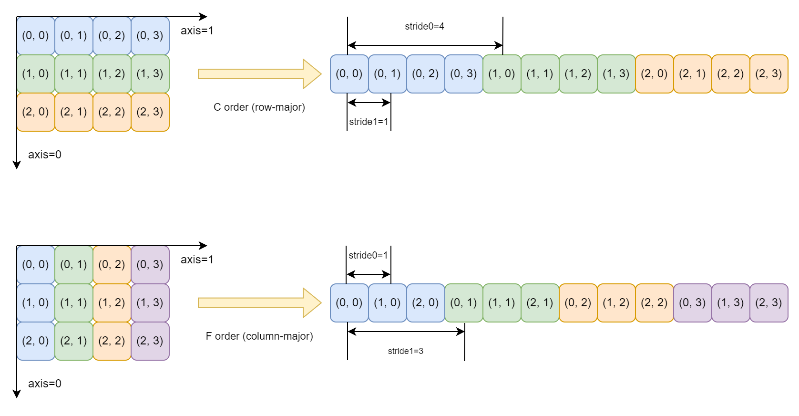

# 数学漫谈 (二) 多维数组 与 NumPy

多维数组是科学计算中一个非常重要且基础的概念。刚入门深度学习时, 这个概念给笔者造成了不小的阻碍。之前介绍 [OpenAI Triton](https://zhuanlan.zhihu.com/p/697626885) 的博客中初步介绍了 多维数组 的概念, 但是没有深入地讲解。

NumPy (Numerical Python) 是 Python 科学计算最基础的库, 其提供了 多维数组 和 向量化编程 (vectorization / [array programming](https://en.wikipedia.org/wiki/Array_programming)) 的概念模型。目前, Python 科学计算的生态圈和 NumPy 都有一定性质的关联。像 SciPy, Matplotlib, pandas, scikit-learn 等库都是基于 NumPy 开发的, 直接使用其提供的 多维数组 对象; 像 PyTorch, JAX 等深度学习框架, 虽然自己实现了 多维数组 对象, 但是大量借鉴了 NumPy 中的概念。

本文以 NumPy 为基础, 相对完整地梳理一下多维数组的相关概念, 尝试将更多知识点串联起来。下面, 让我们开始吧 ~

[TOC]

## 一、初识 多维数组

### 1.1 多层嵌套列表

什么是 多维数组 (multidimensional array) 呢? 这是一个 "套娃" 式的概念: 一维数组是一个列表, 其内部的元素是 "单个数字"; 二维数组也是一个列表, 其内部的元素是 "一维数组"; 三维数组还是一个列表, 其内部的元素是 "二维数组"; 以此类推, $n$ 维数组是一个列表, 其内部的元素是 "$n - 1$ 维数组"。也就是说, 多维数组 就是 **多层嵌套列表** (nested list)。

在 NumPy 中, "单个数字" 被称为 item 或者 scalar (标量)。为了形成递归式定义, 我们约定: 零维数组 就是 item 本身。

---

在 Python 中, 我们用 length 表示一个 `list` 中元素的个数。而在 NumPy 中, 我们则使用 size 表示列表的元素个数。不同嵌套层级的 size 构成的元组被称为 shape。

举例来说, 如果一个四维数组的 shape 是 `(size_0, size_1, size_2, size_3)`, 那么其内部包含 `size_0` 个三维数组; 每一个三维数组由 `size_1` 个二维数组构成; 每一个二维数组内部有 `size_2` 个一维数组; 每一个一维数组由 `size_3` 个 item 组成。那么对于这个四维数组来说, 其一共有 `size_0 * size_1 * size_2 * size_3` 个 item。下图是 shape 为 `(2, 3, 3, 4)` 四维数组的示意图:


一般情况下, 我们会从外往里给不同 "嵌套层级" 的列表编序号。其中, 最里层 (最内层) 列表的元素是 item。那么, 最外层列表是第 0 层列表; 次外层列表是第 1 层列表; 以此类推, 最内层列表是第 $n - 1$ 层列表。此时, 上面 shape 为 `(2, 3, 3, 4)` 的四维数组示意图就变成了如下样式:


对比两个示意图, 我们可以发现: 在四维数组中, 第 0 层列表对应四维数组本身; 第 1 层列表对应三维数组; 第 2 层列表对应二维数组; 第 3 层列表对应一维数组。如果在五维数组中, 四维数组就对应第 1 层列表了。

从上面两张图中, 我们还可以发现: 在四维数组中, 如果要获取单个 item, 那么需要四个列表的索引值。更一般地, 如果我们想获取 $n$ 维数组的 item, 那么我们需要 $n$ 个列表的索引值。这 $n$ 个列表的索引值组成起来称为 **多维索引** (multi-index)。

Python 中的 `list` 对象使用 [zero-based](https://en.wikipedia.org/wiki/Zero-based_numbering) "位置序号" 作为索引值, NumPy 中也是一样。换言之, **多维索引** 由 $n$ 个 "位置序号" 组成。

---

在实际的应用中, 为了清晰地表示 多维数组 的含义, 我们会用 短语 来描述 shape, 或者说给每一层列表起一个 "名字"。

比方说, 在 sklearn 中, 训练集一般是一个二维数组, 我们用 `[n_samples, n_features]` 来表示其 shape。含义是: 第 0 层列表的元素是 单个样本 (sample); 第 1 层列表的元素是 单个特征值 (feature)。在这里, `n` 前缀是 number 的缩写。

在 NLP 中, 我们一般用 `[batch_size, seq_len, hidden_size]` 来表示运算过程的多维数组。其含义是: 第 0 层列表是一个 batch, 其内部的元素是 单个样本; 第 1 层列表是一个 序列 (sequence), 其内部的元素是 单个 token; 第 2 层列表是 隐藏层 (hidden layer) 的输出, 其内部的元素是 单个神经元 (neuron)。

一般情况下, 如果我们站在 "元素" 的视角来描述不同层列表的含义, 那么我们会加上 `number` 前缀 (简写成 `num` 或者 `n`)。如果我们站在 "集合" 的视角来描述不同层列表的含义, 那么我们会加上 `size` 或者 `length` (简写成 `len`) 后缀。

在上面的例子中, sklearn 的训练集数组是站在 "元素" 的视角描述的; NLP 数组是站在 "集合" 的视角描述的。这两种描述方式是可以互相转换的, 比方说 NLP 数组可以用 "元素" 的视角来描述: `[num_samples, num_tokens, num_neurons]`。至于我们应该用哪一种, 按照行业惯例来就行。

在有了名字后, 我们就可以很方便地理解代码了。比方说, 如果数组 `a` 是 sklearn 中的训练集, 那么 `a[0, 0]` 的含义就是第 0 个样本的第 0 个特征; `a[10, 5]` 的含义就是第 10 个样本的第 5 个特征。

### 1.2 空间网格

[空间网格](https://en.wikipedia.org/wiki/Regular_grid) 指的是由 单位正方形 或者 单位立方体 构成的几何体。下图是不同维度网格的示意图:


图 (i) 是 一维网格, 和 一维空间 (直线) 的概念相互对应, 内部的元素应该是 单位线段, 这里用 单位正方形 表示了。

图 (ii) 是 二维网格, 和 二维空间 (平面) 的概念相互对应, 内部的元素是 单位正方形。二维网格 是我们画图的常用工具, 比方说 [网格纸](https://en.wikipedia.org/wiki/Graph_paper), 各种画图软件的 网格线 等等。

图 (iii) 是 三维网格, 和 三维空间 的概念相互对应, 内部的元素是 单位正方体。魔方 是一个非常经典的三维网格益智游戏。

对于更高维度的网格, 人类就无法感知了。

---

如果我们将上述 空间网格 中的 单位正方形 或者 单位正方体 替换成 item, 那么构成的数据结构 就是 多维数组。此时, 空间维度 和 数组维度 的概念就可以对应上了。

那么, 我们如何对 空间网格 建立 坐标系 (coordinate system) 呢? 由于 多维数组 的索引值是 0-based "位置序号", 那么 坐标系 的原点必须在 空间网格 的边界顶点上。对于 二维网格 来说, 我们可以建立如下图所示的八种坐标系:


在上图中, 图 (a) 是线性代数中 **矩阵** (matrix) 使用的网格坐标系, 也是我们最常用的网格坐标系。在 NumPy 中, 如果你 `print` 数组, 也是按照图 (a) 的方式输出的。其中, 第 0 个 坐标轴 (axis) 是垂直向下的, 第 1 个坐标轴 (axis) 是水平向右的。

图 (f) 的坐标系和 笛卡尔坐标系 的 第一象限 非常相似。其中, 第 0 个坐标轴 是水平向右的, 和 $x$ 轴对应; 第 1 个坐标轴 是垂直向上的, 和 $y$ 轴对应。

在 CV 领域, 图像数据就是以 二维网格 的形式存在的, 我们将单个网格称为 像素 (pixel)。举例来说, [灰度图](https://en.wikipedia.org/wiki/Grayscale) (grayscale image) 的一个像素由一个数字构成, 数字的取值范围在 $[0, 1]$ 之间, 含义是 亮度 (light), 0 表示纯黑, 1 表示纯白。一般情况下, 图像数据采用图 (a) 所示的坐标系, 和矩阵坐标系保持一致。但也有例外, 比方说 [PIL](https://github.com/python-pillow/Pillow) 则采用图 (e) 所示的坐标系。

对于 三维网格 来说, 其有八个顶点, 每一个顶点坐标轴有三种排列方式, 那么一共有 $3 \times 8 = 24$ 种坐标系构建方式。下图是其中一种构建方式:


在 三维网格 中, 也有类似 像素 (pixel) 的概念, 我们称之为 [体素](https://en.wikipedia.org/wiki/Voxel) (voxel)。一个体素就是上图中的一个 单位正方体。至于更高维度的空间网格, 已经超出了人类的认知范围了, 这里就不讨论了。

在有了上述坐标系后, 我们可以将 空间网格 和 多维索引 关联起来了: 每一个单位正方体对应一个 item, 这个 item 在数组中的位置由 坐标值 决定。

---

在实际应用中, 空间网格 和 多层内嵌数组 的概念建议分开。举例来说, 在 CV 领域, 数据是以四维数组的形式来扭转的, 其 shape 是 `[batch_size, num_channels, img_height, img_width]`。这里的四维数组无论按按照 四维网格 还是 四层嵌套 来理解都是不合理的, 最合理的理解方式是 三层嵌套 + 二维网格: 第 0 层列表是一个 batch, 内部的元素是单张图片; 第 1 层列表的元素是单个 颜色通道 (channel) / 特征图 (feature map); 第 2 至 3 层列表共同构成 二维空间网格, 其中第 2 层对应垂直方向的坐标轴, 第 3 层对应水平方向的坐标轴。这样描述后就清晰易懂了, 不过有一个小缺陷: 没有描述 二维空间网格 坐标原点的位置。

### 1.3 维度 与 多维索引

那么, 多维数组的维度指的是什么呢? **维度** (dimension) 这个词语和 length 以及 size 一样, 用来描述事物的 "数量"。根据 1.1 节的内容, 数组维度最简单的理解方式是: 嵌套列表总的层级数。

从 1.2 节中我们可以发现, 这个概念是从 "空间" 的概念借鉴过来的。我们知道, [空间的维度](https://en.wikipedia.org/wiki/Dimension) 指的是描述一个 "点" 位置所需的最少坐标轴数, 我们将这些坐标值构成的元组称为 **向量**。也正是因为此, 我们将向量中的元素个数称为 向量的维度。

从上面可以看出, 多维数组 中的 item 对应 "空间" 中的 "点"。在 "空间" 中, 我们用 "向量" 描述 "点" 的位置。而在 多维数组 中, 我们用 多维索引 描述 item 的位置。也就是说, "空间" 中的 "向量" 对应 多维数组 中的 多维索引。那么, 数组的维度 可以定义为: 获取单个 item 所需要的 "列表索引" 个数。

需要注意的是, 多维数组 和 "空间" 的研究对象不同: "空间" 中 "点" 本身并不重要, 重要的是其所在的位置, 也就是研究的对象是 向量; 而 多维数组 中, 我们的研究对象是 item, 多维索引 仅仅起到辅助研究的作用。也正是因为此, 网上大部分的教程都不会强调 多维索引 的概念。

根据上述介绍, 我们可以总结出如下的关系对应表:

|空间|多维数组|
|:--:|:--:|
|点|item|
|直线|一维数组 (向量)|
|平面|二维数组 (矩阵)|
|向量 (描述点的位置)|多维索引 (描述 item 的位置)|
|维度: 描述一个点位置所需的最少坐标轴数|维度: 获取单个 item 所需要的列表索引个数|

需要注意的是, 在正常语境之中, 维度 的含义是 数量, 我们不会使用 "单个维度" 这样的表述。但是在 多维数组 中, 开发者们并没有找到合适的词语来描述多维数组的层级, 因此会使用 "第 $i$ 个维度" 来描述第 $i$ 层嵌套列表 (从最外层往里数)。本文为了避免歧义, 就不采用这样的表述了。

---

在一个 "空间" 中, 任意一 "点" 相邻的 "点" 有无穷多个, 因此我们能够画出无穷多条 "直线"。但是, 在多维数组中, 和一个 item 相邻的 item 数量是有限的: 在一维数组中, 和一个 item 相邻的 item 最多有 $3^1 - 1 = 2$ 个; 在二维数组中, 和一个 item 相邻的 item 至多有 $3^2 - 1 = 8$ 个, 在三维数组中, 和一个 item 相邻的 item 至多有 $3^3 - 1 = 26$ 个。也正是因为此, 多维数组 中由相邻 item 构成的 一维数组 数量是有限的。举例来说, 在二维数组中, 大体上可以构成如下四个方向的 一维数组:


在线性代数中, 这四个方向我们都会研究。图 (i) 对应矩阵的 行向量; 图 (ii) 对应矩阵的 列向量; 图 (iii) 一般只研究最中间的向量, 被称为矩阵的 主对角线 (main diagonal); 图 (iv) 一般也只研究最中间的向量, 被称为矩阵的 反对角线 (anti diagonal)。需要注意的是, 在正方形中, 对角线的长度肯定是要大于边长的; 但是在 方阵 (square matrix) 中, 主对角线 和 反对角线 上元素的个数 和 行向量 / 列向量 元素个数是相同的。这里有些反直觉, 特别拿出来说明一下。

在 "空间" 的概念中, 坐标轴 就是一个有向 "直线", 我们使用 $x$, $y$, $z$ 字母表示不同的轴。在 多维数组 中, 坐标轴 就是一个有向的 一维数组, 我们使用 "数字编号" 表示不同的轴。在 多维索引 中, 我们从左往右给 坐标轴 编序号: 最左边的是第 0 个坐标轴, 次左边的是第 1 个坐标轴, 以此类推, 最右边的是第 $n - 1$ 个坐标轴。这样, 恰好和数组嵌套层级的序号对应上。

在上图中, 对于 shape 是 $(m, n)$ 的二维数组而言, 第 0 个坐标轴是由 $(0, 0), (1, 0), (2, 0), \cdots, (m, 0)$ 这些 item 构成的 一维数组; 第 1 个坐标轴是由 $(0, 0), (0, 1), (0, 2), \cdots, (0, n)$ 这些 item 构成的一维数组。换言之, 对于矩阵而言, 第 0 个坐标轴是第一个列向量, 第 1 个坐标轴是第一个行向量。

一般情况下, 在线性代数中, 矩阵 (二维数组) 足够我们研究 高维空间 了。更高维的数组主要用于 映射 运算, 比方说 矩阵关于矩阵求导。额外提醒一点, 行 和 列 是 二维空间网格 中的概念, 三维空间网格 中没有相关的概念, 千万不要硬套。

### 1.4 C order & F order 迭代

在计算机领域, "遍历" 是一个永恒的话题。那么, 我们怎么 "遍历" 一个多维数组所有的 "多维索引" 呢? 最简单的方式就是用 循环嵌套, 几维数组就用几层循环嵌套。然而, 这种方式有一个致命的缺点: 无法实现任意维度的 "遍历"。怎么办呢? 我们需要构建 "图" 数据结构: 数组的每一层嵌套列表作为 "树" 的一层, 单个结点 对应 一个列表, 结点的子结点 对应 列表的元素。此时, 我们构建的数据结构如下图所示:


接下来, 我们可以用 DFS 实现所有路径的遍历即可。具体的代码如下:

```python
def gen_corder_index(shape: tuple[int, ...]):
    ndim = len(shape)
    stack = []

    # 递归的深度最大值是 ndim + 1; NumPy 中 ndim 最大值为 64, 不用担心递归深度的问题
    def _recursion(depth):
        if len(stack) == ndim:
            yield tuple(stack)
            return 

        for i in range(shape[depth]):
            stack.append(i)
            yield from _recursion(depth + 1)
            stack.pop(-1)  # LIFO
    
    yield from _recursion(0)
```

假设 多维数组 的 shape 是 `[2, 2, 2]`, 那么遍历的结果是: `(0, 0, 0)`, `(0, 0, 1)`, `(0, 1, 0)`, `(0, 1, 1)`, `(1, 0, 0)`, `(1, 0, 1)`, `(1, 1, 0)` 和 `(1, 1, 1)`。观察上述结果, 我们不难发现, 第 $n-1$ 个索引 (最内层的索引) 最先变化, 依次向外, 第 $0$ 个索引 (最外层的索引) 最后变化。我们将这样的迭代方式称为 C order 迭代。

除了上述遍历方式之外, 还有一种遍历方式: F order 迭代。此时, 第 $0$ 个索引 (最外层的索引) 最先变化, 依次向里, 第 $n-1$ 个索引 (最内层的索引) 最后变化。如果 多维数组 的 shape 是 `[2, 2, 2]`, 那么遍历结果就是: `(0, 0, 0)`, `(1, 0, 0)`, `(0, 1, 0)`, `(1, 1, 0)`, `(0, 0, 1)`, `(1, 0, 1)`, `(0, 1, 1)` 和 `(1, 1, 1)`。实现方式和上面类似, 我们需要反过来构建 "图" 数据结构:


接下来, 我们可以使用 DFS 实现遍历了。需要注意的是, 此时 `stack` 中列表索引的顺序和上面的反着的。具体的实现代码如下:

```python
def gen_forder_index(shape: tuple[int, ...]):
    ndim = len(shape)
    stack = []

    def _recursion(depth):
        if len(stack) == ndim:
            yield tuple(reversed(stack))
            return 

        for i in range(shape[depth]):
            stack.append(i)  # stack.insert(0, i)
            yield from _recursion(depth - 1)
            stack.pop(-1)  # stack.pop(0)
    
    yield from _recursion(ndim - 1)
```

一般情况下, 我们按照 C order 迭代方式即可。NumPy 中专门提供了 `np.ndindex` API, 功能和上面 `gen_corder_index` 是一样的。但是, 在个别场景下, 会使用到 F order 迭代方式, 这个我们后续再讨论。

同时, 我们也可以借助 `np.ndindex` 实现 F order 迭代, 方式如下: `[midx[::-1] for midx in np.ndindex(shape[::-1])]`。其想法很简单, F order 是从 外层列表 到 内层列表 的方式遍历数组, C order 是从 内层列表 到 外层列表 的方式遍历数组。那么, 我们只需要将 shape 倒序输入 `np.ndindex` 中, 再将生成的 多维索引 倒序输出即可。

### 1.5 全局索引 与 strides

那么, 多维数组在内存中如何存在呢?

我们知道, 在 C 语言的编程模型中, 内存 被抽象成了 "字节数组", 指针就是 "字节数组" 的索引值。"字节数组" 可以理解为由 byte 构成的 "一维数组"。NumPy 在创建多维数组时, 会先用 shape 计算多维数组所需的内存空间, 然后用 `malloc` 申请内存空间, 最终获取到的 数据指针 就是 多维数组 首元素在内存中的 地址。

那么, 多维数组 中的 item 在内存中是如何排列的呢? 常见的方式有两种: C order 内存布局 和 F order 内存布局。前者是按照 C order 迭代方式来构建的, 后者是按照 F order 迭代方式来构建的。下图展示了 二维数组 的两种布局方式:



在上图中, 右侧的 一维数组 就是 "字节数组" 的一部分, 也就是我们使用 `malloc` 申请的内存空间。因此, 我们可以说 多维数组 在内存中是以 "一维数组" 的形式存在的。

从上图还可以看出, 如果我们将 二维数组 当作 矩阵, 那么 C order 就是 矩阵 的 行向量 挨个排列, 因此也被称为 row-major; F order 就是 矩阵 的 列向量 挨个排列, 因此也被称为 column-major。

我们将 item 关于多维数组 "指针" (首元素地址) 的偏移量称为 **全局索引**。此时就产生了一个新问题: 多维索引 如何转化成 全局索引 呢? 答案是通过 **strides**。

在 多维数组 中, 每一层列表都有一个 stride 值, 其含义是: 该层列表的索引值增加 1 时, 全局索引的增加量。以上图中的 二维数组 为例: 对于 C order 内存布局来说, 当第 0 层列表的索引增加 1 时, 全局索引的增加量为 4; 当第 1 层列表的索引值增加 1 时, 全局索引的增加量为 1; 也就是说, 此时 二维数组 的 strides 是 `(4, 1)`。对于 F order 内存布局来说, 当第 0 层列表的索引值增加 1 时, 全局索引的增加量为 1; 当第 1 层列表的索引值增加 1 时, 全局索引的增加量为 3; 也就是说, 此时 二维数组 的 strides 是 `(1, 3)`。

在有了 strides 之后, 我们将 多维索引 和 strides 进行 "点乘" (对应位置相乘再求和), 就可以得到 全局索引 了。以上图中的 二维数组 为例, 对于 C order 内存布局, strides 是 `(4, 1)`, 那么 多维索引 `(2, 1)` 转换成 全局索引 就是: `4 * 2 + 1 * 1 = 9`; 对于 F order 内存布局, strides 是 `(1, 3)`, 那么 多维索引 `(2, 1)` 转换成 全局索引 就是 `1 * 2 + 3 * 1 = 5`。

更加生动的解释是: strides 是 每一层列表 的 "单步步长", 或者说 每一层列表 的 "全局索引变化率"。将 多维索引 转换成 全局索引 后, 我们就可以获取到 item 了, 方式如下: `item = *(data_ptr + global_index)`。从这里可以看出, strides 的重要性。

那么, 我们如何计算 C order 和 F order 内存布局的 strides 呢?

观察上图我们可以发现, 在 C order 内存布局中: 第 $n-1$ 层 (最内层) 列表的 stride 是 1; 第 $n-2$ 层 (次内层) 列表的 stride 是第 $n - 1$ 层列表的 size; 第 $n-3$ 层列表的 stride 是 $n - 1$ 层列表 size 和 $n - 2$ 层列表 size 的乘积。以此类推, 我们可以得到:

$$
\begin{align*}
    \mathrm{strides} (i) &= \mathrm{strides} (i+1) \times \mathrm{shape} (i+1) \\
    &= \prod_{j=i+1}^{n-1} \mathrm{shape}(j)
\end{align*}
\tag{1.5.1}
$$

F order 内存布局则是反过来: 第 0 层 (最外层) 列表的 stride 是 1; 第 1 层 (次外层) 列表的 stride 是第 0 层列表的 size; 第 2 层列表的 stride 是第 0 层列表 size 和第 1 层列表 size 的乘积。以此类推, 我们可以得到:

$$
\begin{align*}
    \mathrm{strides} (i) &= \mathrm{strides} (i - 1) \times \mathrm{shape} (i-1) \\
    &= \prod_{j=0}^{i-1} \mathrm{shape} (j)
\end{align*}
\tag{1.5.2}
$$

代码实现方式如下:

```python
def cal_strides_by_shape(shape: tuple[int, ...], order: str = "c") -> tuple[int, ...]:
    # numpy/_core/src/multiarray/ctors.c ==> _array_fill_strides
    strides = []
    for i in range(len(shape)):
        # NumPy 中的 strides 还需要乘以 itemsize, 这里为了方便就省略了
        if order == "c":
            # e.g. (3, 5, 10) ==> (50, 10, 1)
            strides.append(math.prod(shape[i+1:]))
        elif order == "f":
            # e.g. (3, 5, 10) ==> (1, 3, 15)
            strides.append(math.prod(shape[:i]))
        else:
            raise ValueError("only 'C' or 'F' order is permitted")
    
    return tuple(strides)
```

NumPy 中提供了 多维索引 和 全局索引 相互转换的 API: `np.ravel_multi_index` 将 多维索引 转换成 全局索引; `np.unravel_index` 将 全局索引 转换成 多维索引。但是, 这两个 API 不支持 strides 参数, 而是采取了 shape + order 的方式, 计算逻辑上面已经说过了。下面是 示例代码:

```python
# ## shape 为 (6, 7, 8), order 为 "c" 的数组 strides = (7 * 8, 7, 1) = (56, 8, 1)
# 多维索引 -> 全局索引
np.ravel_multi_index(multi_index=(3, 4, 5), dims=(6, 7, 8), order="c")  # 3 * 56 + 4 * 8 + 5 * 1 = 205
# 全局索引 -> 多维索引
np.unravel_index(indices=205, shape=(6, 7, 8), order="c")  # (205 // 56, 205 % 56 // 8, 205 % 56 % 8 // 1)

# ## shape 为 (6, 7, 8), order 为 "f" 的数组 strides = (1, 6, 6 * 7) = (1, 6, 42)
# 多维索引 -> 全局索引
np.ravel_multi_index(multi_index=(3, 4, 5), dims=(6, 7, 8), order="f")  # 3 * 1 + 4 * 6 + 5 * 42 = 237
# 全局索引 -> 多维索引
np.unravel_index(indices=237, shape=(6, 7, 8), order="f")  # (237 % 42 % 6 // 1, 237 % 42 // 6, 237 // 42)
```

需要注意的是, 多维索引 转 全局索引 类似于 向量点乘, 是一个不可逆的过程。上面代码展示 全局索引 转 多维索引 的方式仅限于 C order 和 F order 内存布局中, 其它的内存布局不一定正确。初始状态下, 数组必然是 C order 或者 F order 内存布局的, 至于其它内存布局是如何产生的, 在第三章中会具体介绍。

至此, 你应该对 多维数组 有一个初步的认知了, 主要包括: 多层嵌套列表, 空间网格, 多维索引, C order & F order 迭代方式和内存布局, 全局索引, strides, 多维数组 和 高维空间 之间的关系 等等。

## 二、初识 ndarray

在 NumPy 中, 多维数组对象的类是 `ndarray`, 所有数据都是以其为核心进行 扭转 的。我们可以认为, NumPy 中大部分 API 的输入和输出都是 `ndarry`。下面, 让我们简单介绍一下 `ndarray` 相关的知识。

### 2.1 数据类型

在 多维数组 中, 我们会限定所有 item 的数据类型是一致的, 我们称之为 同质 (homogeneous) 的。

一般情况下, 类型相同的数据之间才能够进行计算。两个不同的数据类型在进行计算时, 会有 "隐式" 的类型转换, 转换成相同的数据类型之后再运算。在大多数编程语言中, 不同的数字类型之间是可以运算的, 我们将运算过程中的 "隐式" 类型转换称为 datatype promotion; 只有在少部分语言 (例如 JavaScript, SQL 等) 中, 数字和字符串之间才可以进行计算。NumPy 只支持前者, 并不支持数字和字符串之间的运算。

目前, NumPy 支持以下类型的数据:


在上图中, 虚线框 表示的是 抽象类, 不能被实例化; 实线框 表示的是 非抽象类, 可以被实例化。我们只需要关注 蓝色 方框即可, 包括 布尔类型, 整数类形, 浮点类型 和 复数类型。其它类型 (比方说 时间类型, 字符串类型), 虽然 NumPy 也支持, 但是和 科学计算 关联性不大, 可使用的 API 也不多, 使用频率较低, 这里就不讨论了。

上图中实线框内的类型都是能够实例化的, 比方说: `np.uint8(255)`。在 NumPy 中, 这样的实例被称为 标量 (scalar)。在编程时, 我们可以认为其是 "零维数组"。如果 多维数组 的运算结果是 单个数字 (零维数组), 那么会自动转换成 标量 对象。

整数类型 和 浮点类型 在之前的 [博客](https://zhuanlan.zhihu.com/p/1893653279222776235) 中已经详细介绍过了; 复数类型则是由两个浮点数组成, 分别表示 实部 (real) 和 虚部 (imag): `complex64` 是由两个 `float32` 数字构成; `complex128` 则是由两个 `float64` 数字组成; `complex256` 则是由两个 `float128` 数字构成。

NumPy 提供了 `np.iinfo` 和 `np.finfo` 两个 API, 分别用来查看 整数类型 和 浮点类型 的基本信息。比方说, 我们可以通过 `np.iinfo(np.int32).max` 获取 `np.int32` 类型的最大值。

Python 中也有这四种类型, 分别是 `bool`, `int`, `float` 和 `complex`。需要注意的是: (1) `int` 是可变长数据类型, 并且支持大数运算, 计算 `2 ** 10_000` 都是没问题的; (2) `float` 类型是 64 位浮点数, 不支持其它位数的浮点数。

---

在运算过程中, 隐式 类型转换 (datatype promotion) 基本上遵循以下三个规则:

(1) 在 NumPy 中, 同种的类型转换关系为: 位数少的 会转换成 位数多 的类型。比方说 int8 和 int16 类型的数据相加得到的结果是 int16;

(2) 在 NumPy 中, 不同种的类型转换关系为: 布尔类型 → 无符号整数类型 → 有符号整数类型 → 浮点数 → 复数。显然, 浮点数 是可以完美转换成 复数 (虚部为 0) 的。整数类型是无法完美转换成同位数的浮点数类型的, 有 最大安全整数 的限制, 因此会增加位数, 比方说 int16 和 float16 数字相加, 得到的结果是 float32。无符号整数 也是无法完美转换成同位数的 有符号整数, 因此也会增加位数, 比方说 uint8 和 int8 数字相加, 得到的结果是 int16。

(3) 当 NumPy 数据类型和 Python 数据类型进行运算时, 会将 Python 的数据类型转换成 NumPy 的数据类型进行运算。比方说, `np.int8` 和 Python 的 `int` 进行运算, 结果是 `np.int8`。

NumPy 中提供了 `np.promote_types` 和 `np.result_type` 两个 API, 我们可以用它们查看两个数字类型的运算结果。比方说, 如果我们想知道 int16 和 float16 的运算结果类型, 使用方式如下: `np.promote_types(np.int16, np.float16)`。

---

在 NumPy 中, `np.dtype` 是对上述 标量类型 的进一步封装, 兼容各种数据类型的表示方式, 包括 typecode, array interface 等内容。下图是我在网上找到的相关内容总结图:


一般情况下, 内置的标量数据类型足够我们使用了。如果在阅读他人代码时遇到相关内容, 可以参考 上图 或者 [官方文档](https://numpy.org/doc/stable/reference/arrays.dtypes.html), 这里不展开介绍了。

---

最后扩展一下, 在 NumPy 中, 标量的类型可以是 C 语言中的 [struct](https://en.wikipedia.org/wiki/Struct_(C_programming_language)), 对应上图中的 `np.void`。我们可以通过如下的方式创建 struct 标量:

```python
dtype = [('name', 'U10'), ('age', np.int32), ('weight', np.float32)]
person = np.void(('Matt', 29, 75.0), dtype=dtype)

print(f"姓名: {person['name']}, 年龄: {person['age']}, 体重: {person['weight']:.2f} KG")
```

在这里, `U10` 属于 array interface 数据类型表示方式, 含义是定长的 10 个 unicode 字符, 无法使用 NumPy 内置的标量类型替换。上述代码等价于如下的 C 语言代码:

```C
struct {
    char name[10]; 
    int age; 
    float weight;
} person = {"Matt", 29, 75.0};

printf("姓名: %s, 年龄: %d, 体重: %.2f KG\n", person.name, person.age, person.weight);
```

如果 多维数组 的 item 是上述 struct 类型, 那么这样的数组被称为 [structured array](https://numpy.org/doc/stable/user/basics.rec.html)。

在数据处理领域, 有两种常见的数据结构: 二维表结构 和 多维数组。二维表结构 的工具远远多于 多维数组: 各种关系型数据库, Pandas 和 SparkSQL, 甚至于 Excel 都属于 二维表结构 的范畴。在 二维表结构 中, 我们一般只限制一列数据是 "同质" 的, 一行数据则可以是 "异构" 的, 同时 聚合函数 也是作用于一列数据的。在 多维数组 中, 我们则限制所有的 item 都是 "同质" 的, 这也是两类数据结构最大的区别。

那么, 我们应该如何理解两者间的关系呢? 实际上, 二维表结构 就是 一维 struct array: 一行数据对应一个 struct 标量, 所有行数据在一起正好构成了一个集合, 这个集合就是一维的 struct array。

在实际应用中, 应该先尝试用 二维表结构 解决问题, 除非这个领域默认使用 多维数组。千万不要遇到 [层级结构](https://en.wikipedia.org/wiki/Hierarchy) 就想用 多维数组 数据结构。多维数组 除了 1.1 节所说的 层级结构 外, 还有两个明确的限制: (1) 同一层级所有集合的 size 必须相同; (2) 所有的 item 数据类型必须相同。

至此, 你应该对 多维数组 的应用范围有一个较清晰的定位了。

### 2.2 创建 ndarray

一般情况下, 我们不使用 `ndarray` 的 `__init__` 方法来构造对象, 而是使用 NumPy 的 API 来构造。下面, 让我们来看看常用的函数:

最常规的 API 是 `np.empty`, `np.zeros`, `np.ones` 和 `np.full` 四个。这四个 API 都有 `shape` 入参, 它们的功能如下:

+ `np.empty` 创建指定 `shape` 的空数组 (只用 `malloc` 申请了内存空间, 没有进行初始化);
+ `np.zeros` 创建指定 `shape` 的数组, 同时数组内所有的 item 均为 `0`;
+ `np.ones` 创建指定 `shape` 的数组, 同时数组内所有的 item 均为 `1`;
+ `np.full` 创建指定 `shape` 的数组, 同时数组内所有的 item 均为 `fill_value`;

同时, 这些 API 还有 `dtype` 和 `order` 入参, 它们是用来指定 item 的数据类型和数组的内存布局。数据类型相关的内容在 2.1 节已经说过; 内存布局相关的内容在 1.5 节已经说过, order 的值只能是 `"c"` 或者 `"f"`。

假设数组 `a` 已存在, 那么使用上述 API 创建一个和 `a` 的 `shape` 以及 `dtype` 相同的数组方式是: `np.empty(a.shape, a.dtype)`。为了简化上述流程, NumPy 中额外提供了 `np.empty_like`, `np.zeros_like`, `np.ones_like` 和 `np.full_like` 四个 API, 我们可以直接使用 `np.empty_like(a)` 创建一个和 `a` 的 `shape` 以及 `dtype` 相同的数组。

---

第二类 API 是将 Python 集合对象转换成 多维数组。常见的 API 有三个: `np.array`, `np.fromiter` 以及 `np.frombuffer` 三个。

`np.array` 可以将 Python 的多层嵌套列表转换成 `ndarray` 对象, 比方说: `np.array([[1, 3], [2, 4]])`。这里的集合不能是 `set`, `dict` 或者 迭代器 对象, 可以是 `list`, `tuple` 或者是实现了 `__len__` 和 `__getitem__` 魔法方法的对象。除此之外, 每一层集合的 size 必须是一致的, 否则会报错。

这里额外提醒一点, 零维数组 和 size=0 的数组是两个概念, 前者数组中有一个 item, 后者数组中没有 item。当你使用 `np.array(4.0)` 时获取到的是 零维数组; 当你使用 `np.array([])` 获取到的是 size=0 的一维数组。两个不要混淆。

NumPy 也支持通过 iterator 和 buffer 创建 `ndarray` 对象, 分别对应 `np.fromiter` 和 `np.frombuffer` 方法。和 `np.array` 不同的是, 这两个 API 只支持创建 一维数组, 即 iterator 每一次生成的对象必须是 item 本身。下面是这两个 API 使用的示例代码:

```python
# iterator
import itertools

iterator = itertools.cycle([0, 1, 2])
a = np.fromiter(iterator, dtype=np.int64, count=30)

# buffer
import struct 

buffer = b"".join([struct.pack("q", integer) for integer in range(100)])
a = np.frombuffer(buffer, dtype=np.int64)
```

NumPy 也提供了数组转 Python 集合对象的方法, 主要有两个: `ndarray.tolist` 和 `ndarray.tobytes`。前者将多维数组转换成多层嵌套的 `list` 对象; 后者将多维数组 ravel 成一维数组后转换成 `bytes` (buffer) 对象。我们可以将 `ndarray.tolist` 和 `np.array` 看成一组互逆运算, 即 `np.array(a.tolist(), dtype=a.dtype)`; 如果数组 `a` 是一维数组, 那么 `ndarray.tobytes` 和 `np.frombuffer` 也可以看成一组互逆运算, 即 `np.frombuffer(a.tobytes(), dtype=a.dtype)`。

---

第三类是创建特定样式 一维数组 和 二维数组 的API。创建一维数组常用的 API 有两个: `np.arange` 和 `np.linspace`:

`np.arange(start, stop, step)` 等价于 `np.array(range(start, stop, step))`, 即从 $\mathrm{start}$ (inclusive) 开始, 到 $\mathrm{stop}$ (exclusive) 为止, 每隔 $\mathrm{step}$ 取一个元素。

`np.linspace(start, stop, num)` 则是将 $[\mathrm{start, stop}]$ 区间等分成 $\mathrm{num} - 1$ 份, 最终将 $\mathrm{num}$ 个端点值组合成 一维数组 返回。这个 API 经常用于画图。

如果我们将这两个 API 看成是 "分组问题", 那么 `np.arange` 就是已知 **总数** (`stop - start`) 和 **每组大小** (`step`) 进行分组; 而 `np.linspace` 就是已知 **总数** (`stop - start`) 和 **组数** `num - 1` 进行分组。这是这两个 API 最大的区别。

创建二维数组常用的 API 有三个: `np.identity`, `np.eye` 和 `np.tri`。它们分别用来创建 单位矩阵 (identity matrix), 对角矩阵 (diagonal matrix) 和 下三角矩阵 (lower triangular matrix)。除此之外, 还有一些其它的 API, 会在后续章节中再介绍。

---

第四类是 硬盘文件读写 的 API。`np.save` 可以对 "单个" 数组进行序列化操作, 输出 `.npy` 文件; `np.savez` 可以对 "多个" 数组进行序列化操作, 输出 `.npz` 文件。

`np.savez` 的实现逻辑非常简单, 先对每一个数组用 `np.save` 进行序列化, 再将所有 `.npy` 文件 "打包" (archive) 成 zip 文件, 输出 `.npz` 文件即可, 整个过程不涉及到 "压缩" (compress)。如果你想 "压缩" 文件, 则需要使用 `np.savez_compressed` API。

无论使用 `np.save`, `np.savez` 还是 `np.savez_compressed` 对 `ndarray` 进行序列化操作, 都可以使用 `np.load` API 从硬盘中加载多维数组到内存中。

`.npy` 文件是二进制文件, 人类无法阅读。如果你想以 文本 (字符串) 的形式存储, 就需要使用 `np.savetxt` 和 `np.loadtxt` API, 这样的文件格式类似于 `.csv` / `.tsv` 文件。需要注意的是, 这种方式只能读取和存储 一维数组 以及 二维数组, 更高维的数组无法存储为文本文件。

### 2.3 ndarray 基本属性

`ndarray` 有以下一些基本属性:

(1) **数据指针**: 通过 `malloc` 获取到的内存地址, 也就是 多维数组 首元素所在的位置。我们可以通过 `ndarray.ctypes.data` 获取具体的数值。其在 C 语言层面是以 `void *` 形式存在的。

(2) **ndim**: 多维数组的维度, 或者说嵌套的层级数。我们可以通过 `ndarray.ndim` 属性 或者 `np.ndim` API 获取。

(3) **shape**: 不同嵌套层级列表的 size 值。我们可以通过 `ndarray.shape` 属性 或者 `np.shape` API 获取。

(4) **dtype**: 多维数组 item 的数据类型, 这个在 2.1 节介绍过了。我们可以通过 `ndarray.dtype` 属性获取。

(5) **itemsize**: 单个 item 在内存中的 字节 数量。我们可以通过 `ndarray.itemsize` 或者 `ndarray.dtype.itemsize` 属性获取到具体的数值。

(6) **strides**: 每一层列表的索引值增加 1 时, 全局索引的增加量。需要注意的是, 由于 **数据指针** 的类型是 `void *`, NumPy 中的 strides 元组在 1.5 节介绍的基础上乘以了 **itemsize** 值。我们可以通过 `ndarray.strides` 属性获取。

如果使用 2.2 节介绍的 API 创建 `ndarray`, 那么其内存布局一定是 C order 或者 F order 的。我们可以通过 `ndarray.flags.c_contiguous` 和 `ndarray.flags.f_contiguous` 属性查看。

在 NumPy 中, 有一些 数组操作 并不需要重新 `malloc` 内存空间, 只需要修改 **数据指针**, **shape** 和 **strides** 就可以实现。我们将这样的数组称为原数组的 view。而另一些 数组操作 则必须要 `malloc` 新的内存空间, 然后将原数组中的 item 拷贝到新的内存空间中。我们将这样的数组称为原数组的 copy。创建 view 和 copy 各有优缺点。创建 view 可以节省内存空间, 加快运算速度; 但是当你修改 view 数组的 item 时, 原数组的 item 也会发生变化。创建 copy 则没有这样的顾虑; 但是这种方式更加消耗内存空间。相关 API 会在下面的两个章节中介绍。

对于 view 数组而言, 我们可以通过 `ndarray.base` 获取其原数组。如果是 `None`, 那么这个数组就不是 view 数组。需要注意的是, view 数组的内存布局不一定是 C order 或者 F order 的。或者说, 我们正是通过改变数组的内存布局, 从而避免创建数组的 copy。

但是, 对于 矩阵乘法 (matrix multiplication) 等一些特殊 API 来说, 其限制数组必须是 C order 或者 F order 的, 这样才能够快速运算。此时, 我们可以用 `np.ascontiguousarray` 或者 `np.asfortranarray` API 将 `ndarray` 强制转换成 C order 或者 F order 内存布局。

如果你想改变数组的数据类型, 可以使用 `np.astype` API, 比方说: `np.astype(a, np.float32)`; 如果你想复制一个数组, 和原本的没有依赖关系, 那么可以使用 `np.copy` API。至此, 你应该对 `ndarray` 有一个初步地认识了。

### 2.4 补充: ndarray 子类

NumPy 还提供了一些 `ndarray` 的子类, 主要包括 `memmap`, `matrix`, `rec.recarray`, `char.chararray` 和 `ma.masked_array` 五个。这五个子类都不建议使用:

`memmap` 是 memory-mapped file array, 内部使用 Python 标准库 [mmap](https://docs.python.org/3/library/mmap.html) 实现的, 主要用于 "大数组" (数组中的 item 过多无法放入内存中) 处理 和 多进程编程。但是其实现过于简单了, 如果遇到相关问题, 建议使用其它第三方库, 比方说 [h5py](https://github.com/h5py/h5py), [zarr](https://github.com/zarr-developers/zarr-python) 等等。

`matrix` 是 二维数组 的高级封装, 限制所有运算的输入和输出必须是 二维数组。目前已经处于 弃用 (Deprecated) 状态, 建议直接使用 `ndarray` 编程范式。

`rec.recarray` 是 Record Array, 属于 Structured Array 的高级封装, 额外提供了 field access by attribute 的功能。官方建议使用 Pandas 的 `DataFrame` 对象来替代 `recarray` 对象。在 2.1 节我们已经说过, `DataFrame` 等价于一维的 `recarray` 对象, 使用起来更加符合人类的思维。

`char.chararray` 指的是字符串数组。官方建议直接使用 `ndarray` (item 的类型是 `np.str_` 或者 `np.bytes_`), 然后用 `np.strings` 中的 API 进行向量化编程即可。一般情况下, 我们不会使用 NumPy 进行批量的字符串处理。

`ma.masked_array` 指的是掩码数组, 其提供的功能类似于 NLP 中的 `attention_mask`。我们在进行计算时, 有些 item 可能不需要参与运算, 这些 item 就需要标识出来单独处理。比方说, 对于 求和运算, 掩码的 item 需要当作 `0` 来处理; 对于 求积运算, 掩码的 item 需要当作 `1` 来处理; 对于 softmax 运算, 掩码的 item 需要当作 `-inf` 来处理。官方说 `masked_array` 并不稳定, 需要进行 "大修"。

这五个子类的源码分别在 `np._core.memmap`, `np.matrixlib.defmatrix.matrix`, `np._core.records.recarray`, `np._core.defchararray.chararray` 和 `np.ma.MaskedArray` 中。如果你想需要实现 `ndarray` 的子类, 可以参考上述代码。

## 三、数组基本操作

在前两章我们介绍过, 多维数组有两大限制: (1) 所有 item 的数据类型是相同的; (2) 每一层列表的元素个数是相同的。但也正是这样的限制, 增加了运算的灵活性。下面, 就让我们来看看数组的基本操作。

### 3.1 transpose

第一类基本操作是改变数组嵌套层级的顺序。比方说, 对于一个 `[batch_size, n_tokens, n_features]` 的三维数组 `a` 来说, 我想将第一层嵌套改成 "特征", 第二层嵌套改成 "序列", 即交换 第一个 和 第二个 嵌套层级。交换后数组的含义: 一个样本内有 `n_features` 个特征通道, 每一个特征通道是一个长度为 `n_tokens` 的序列。那么, 如何实现呢? 答案是 `np.transpose(a, (0, 2, 1))`。

在线性代数中, [矩阵转置](https://en.wikipedia.org/wiki/Transpose) 和这里的运算是相似的, 其核心思想是将矩阵的 行向量 变成 列向量, 列向量 变成 行向量。也正是因为此, 我们将这种操作称为 **transpose**。相关 API 有五个:

第一个是 `np.transpose(a, axes)`: 按照 `axes` 重新给数组 `a` 的嵌套层级排序。比方说, 在上面的例子中, `np.transpose(a, (0, 2, 1))` 返回数组的 shape 是 `[batch_size, n_features, n_tokens]`。当 `axes` 为 `None` 时, 就是将数组的嵌套层级倒序排列, 此时等价于 `ndarray.T` 属性值。除此之外, `np.permute_dims` 和 `np.transpose` 是同一个 API 不同名称。

第二个是 `np.swapaxes(a, axis1, axis2)`: 交换数组 `a` 的第 `axis1` 和 `axis2` 嵌套层级。上面的例子也可以用 `np.swapaxes(a, 1, 2)` 实现。

第三个是 `np.matrix_transpose(a)`: 交换数组倒数第一个和倒数第二个嵌套层级, 等价于 `np.swapaxes(a, -1, -2)`。在这里, 我们认为最后两个嵌套层级构成 矩阵, 整个操作可以理解为批量的 "矩阵转置"。这个 API 等价于 `ndarray.mT` 属性值。

第四个是 `np.moveaxis(a, src, dst)`: 当 `src` 小于 `dst` 时, 从第 `src` 个嵌套层级开始, 不断和右边的嵌套层级交换, 直到到达 `dst` 个嵌套层级为止; 或者说将第 `src` 个嵌套层级移动到第 `dst` 的位置, 然后第 `src+1` 到第 `dst` 个嵌套层级向左移动一个位置。当 `src` 大于 `dst` 时, 向右交换改成向左交换。

需要注意 "swap" 和 "move" 两个操作的区别。swap 是两个位置交换, move 则是多次相邻位置交换。举例来说, 对于一个 shape 为 `(2, 3, 4, 5, 6)` 的五维数组来说, `np.swapaxes(a, 0, 3)` 返回数组的 shape 是 `(5, 3, 4, 2, 6)`; `np.moveaxis(a, 0, 3)` 返回数组的 shape 是 `(3, 4, 5, 2, 6)`。

第五个是 `np.rollaxis(a, axis, start)`: 当 `axis` 小于 `start` 时, 等价于 `np.moveaxis(a, axis, start - 1)`; 当 `axis` 大于 `start` 时, 等价于 `np.moveaxis(a, axis, start)`。这个的 API 比较奇怪, 不知道 "roll" 操作具体指的是什么, 建议使用 `np.moveaxis` API。

需要注意的有三点:

首先, 这些 API 的 `axis` 参数指的不是 坐标轴, 而是第 `axis` 层嵌套列表。NumPy 的开发者们没有找到合适的词语来描述嵌套列表的层级, 于是就使用 `axis` 这个名词了。同时, 当 `axis` 为负整数时, 会被转换成 `ndarray.ndim + axis`, 表示 **倒数** 第 `-axis` 层嵌套列表。

其次, 这里所有 API 返回的都是 原数组 的 view, 而非 copy。它们的实现原理非常简单, 我们只需要根据输入参数调整 strides 和 shape 的顺序即可, 其它都不需要改动。举例来说, 假设三维数组 `a` 的 shape 是 `(3, 4, 5)`, strides 是 `(20, 5, 1)`, 那么 `np.swapaxes(a, 0, 1)` 返回 view 数组的 shape 是 `(4, 5, 3)`, strides 是 `(5, 20, 1)`, 其它内容都不需要更改。不过, 现在数组的内存布局既不是 C order, 也不是 F order。

最后, 虽然这里介绍了很多 API, 但是只建议使用 `np.transpose` API。其被大众熟知, 同时可以实现其它 API 的所有功能。其它的 API 容易产生歧义, 比方说 `np.moveaxis`。

### 3.2 ravel & reshape

第二类操作是改变数组 shape, 主要的 API 有两个: `np.ravel` 和 `np.reshape`。

`np.ravel(a, order)` 是将 多维数组 转换成 一维数组。常见的转换方式有两种: 一种是 C order 迭代方式构建一维数组, 另一种是 F order 迭代方式构建一维数组。当迭代方式和内存布局一致时, 返回的数组是原数组的 view; 当两者不一致时, 返回的数组是原数组的 copy。

与之功能相同的是 `ndarray.flatten(order)` 方法。区别在于: flatten 返回的数组一定是原数组的 copy, 而 ravel 会根据情况判断返回原数组的 copy 或者 view。如果你希望以 迭代器 的形式返回数据, 而非 数组 的形式, 那么可以使用 `ndarray.flat` 属性。需要注意的是, 此时只支持 C order 迭代, 不支持 F order 迭代。

实际上, 对于 ravel 和 flatten 两个 API 来说, 入参 `order` 有四种参数值: (1) `"c"`: C order 迭代方式, 也是默认的迭代方式, 我们一般都用它。(2) `"f"`: F order 迭代方式。(3) `"a"`: 如果内存布局是 F order, 那么就采用 F order 迭代方式, 否则使用 C order 迭代方式。需要注意的是, 如果内存布局既不是 C order, 也不是 F order, 那么会选择 C order 迭代方式。(4) `"k"`: 当数组的 strides 不为负数时, 按照元素在内存中的先后顺序返回。K order 基本不会使用, 功能也不是很完善, 因此不用特别关注。

`np.reshape(a, shape, order)` 是一个很重要的 API。其功能是: 先将数组 `a` ravel 成一维数组, 然后根据入参 `shape` 重新计算 strides, 构成新的数组。我们需要保证 输入数组 和 输出数组 的 item 数量一致, 也就是 `np.prod(a.shape)` 和 `np.prod(shape)` 两者数值必须相同。

如果入参 `order` 是 `"c"`, 那么就是按照 C order 迭代方式构建一维数组, 然后使用公式 $(1.5.1)$ 计算 strides 值, 此时返回的数组一定是 C order 内存布局。如果入参 `order` 是 `"f"`, 那么就是按照 F order 迭代方式构建一维数组, 然后使用公式 $(1.5.2)$ 计算 strides 值, 此时返回的数组一定是 F order 内存布局。和 `np.ravel` 一样, 如果输入数组的内存布局和入参 `order` 保持一致, 那么返回的数组就是 输入数组 的 view, 反之就是 copy。

需要注意的是, 输入数组 的内存布局只会影响 输出数组 是 view 还是 copy; 输出数组 的内存布局由入参 `order` 决定。两者不要弄混淆。

虽然说这里仅仅要求输入数组 `a` 和输出数组的 item 数量是一致的, 也就是说将 shape 为 `(10, 15)` 的数组 reshape 成 `(15, 10)` 是合法的, 但是我们一般不会这样做, 因为这样做没有意义。这个 API 主要用途是: 将一个嵌套层级拆分成多个嵌套层级, 或者将多个嵌套层级合并成一个嵌套层级。

比方说, 对于 shape 为 `[n_samples, n_features] = (15, 10)` 的二维数组来说, 如果我想将 15 个样本分成 3 组, 那么就可以使用 `a.reshape(3, 15 // 3, 10)` 实现; 如果我想对 10 个特征进行分组, 每组 5 个特征, 那么就可以使用 `a.reshape(15, 10 // 5, 5)` 实现。如果想取消分组, 那么直接 reshape 成 `(15, 10)` 即可。

此时, 你可能会想, 入参 `order` 对分组结果有什么影响呢? 当你将 15 个样本分成 3 组时, C order 会将相邻的五个元素分到一组中, F order 会每隔三个元素分到一组中。假设数组 `a` 是 `np.arange(150).reshape(15, 10)`, 你可以使用 `a.reshape(3, 5, 10, order="f")` 查看分组效果。取消分组时也是一样, 当你将 `(3, 5, 15)` 的数组 reshape 成 `(10, 15)` 的数组时, C order 会将每一组的元素挨个排列, F order 则会将每一组的第一个元素挨个放在一起, 然后将每一组第二个元素挨个放在一起, 以此类推。

上面所说的规则仅限于将一个嵌套层级拆成两个 (分组), 或者两个嵌套层级组合成一个 (取消分组)。`np.reshape` 是一个适用广泛, 但是应用场景有限的函数。如果你有其它的应用场景, 欢迎讨论。

在 PyTorch 中, `torch.reshape` 只支持 C order reshape, 并不支持 F order reshape。当然, 我们可以用 C order 间接实现 F order reshape: 假设数组 `a` 是 `torch.arange(150).reshape(15, 10)`, 那么 F order 方式 reshape 成 `(3, 5, 10)` 的方法: `a.T.reshape(10, 5, 3).T`。

### 3.3 concat & stack

第三类操作是将多个 `ndarray` 合并成一个 `ndarray`, 核心 API 有两个: `np.concat` 和 `np.stack`。

`np.concat(arrays, axis)` 是将所有 `arrays` 在第 `axis` 层嵌套列表上合并数组。所有输入数组的 `ndim` 必须相同, 同时除了第 `axis` 层列表, 其它层列表的 size 必须相同。输出数组 第 `axis` 层列表的 size 等于所有输入数组第 `axis` 层列表 size 之和, 其它层列表的 size 保持不变。

举例来说, 如果我们在第一层列表上 concat 三个 shape 为 `(2, 3, 4)`, `(2, 4, 4)`, `(2, 5, 4)` 的数组, 得到的结果数组 shape 是 `(2, 12, 4)`。对于 `[num_rows, num_cols]` 的矩阵来说, `axis=0` 的 concat 是增加行向量的数量, `axis=1` 的 concat 是增加列向量的数量。

concat 是在已存在的嵌套层级上合并数组, stack 则是在新的嵌套层级上合并数组。`np.stack(arrays, axis)` 是将所有的 `arrays` 在第 `axis` 层嵌套列表前新增一个嵌套层级, 并在该层级上合并数组。这里要求所有输入数组的 `shape` 必须相同。输出数组在新增的嵌套层级上 size 为 `len(arrays)`, 其它嵌套层级上的 size 保持不变。

举例来说, 如果我们将三个 shape 为 `(8, 12)` 的数组进行 stack 操作, 当 `axis=0` 时, 输出数组的 shape 是 `(3, 8, 12)`; 当 `axis=1` 时, 输出数组的 shape 是 `(8, 3, 12)`; 当 `axis=2` 时, 输出数组的 shape 是 `(8, 12, 3)`。

需要注意的是: 在 concat 中, `axis` 表示的是第几层列表, 因此它的取值范围是 `[0, ndim-1]`。在 stack 中, `axis` 表示的是 新增嵌套层级 的位置, 即在第 `axis` 层列表之前新增一个嵌套层级。对于一个维度是 `ndim` 的数组来说, 显然有 `ndim + 1` 个位置。当 `axis=ndim` 时, 表示在第 `ndim - 1` 层列表之后新增一个嵌套层级。因此, 此时 `axis` 的取值范围是 `[0, ndim]`。

---

除了上面两个 API 外, NumPy 还提供了四个 API: `np.hstack`, `np.vstack`, `np.dstack` 和 `np.column_stack`。前三个分别表示沿着 **水平方向** (horizontal), **垂直方向** (vertical) 和 **深度方向** (depth)。在这里, NumPy 进行了如下的假设:

||一维数组|二维数组|三维数组|
|:--:|:--:|:--:|:--:|
|axis=0|水平方向|垂直方向|垂直方向|
|axis=1|-|水平方向|水平方向|
|axis=2|-|-|深度方向|

那么, 这四个 API 和 concat & stack 操作的对应关系如下表:

||一维数组|二维数组|三维以上数组|
|:--:|:--:|:--:|:--:|
|`hstack(arrs)`|`concat(arrs, axis=0)`|`concat(arrs, axis=1)`|`concat(arrs, axis=1)`|
|`vstack(arrs)`|`stack(arrs, axis=0)`|`concat(arrs, axis=0)`|`concat(arrs, axis=0)`|
|`dstack(arrs)`|`stack(arrs, axis=1)[None, ]`|`stack(arrs, axis=2)`|`concat(arrs, axis=2)`|
|`column_stack(arrs)`|`stack(arrs, axis=1)`|`hstack(arrs)`|`hstack(arrs)`|

对于 一维数组 而言, 其总共有三种操作: `concat(axis=0)`, `stack(axis=0)` 和 `stack(axis=1)`。它们分别对应 hstack, vstack 和 column_stack 操作。hstack 的含义是 多个向量合并成一个向量; vstack 的含义是 多个行向量 堆叠 成一个矩阵; column_stack 的含义是 多个列向量 堆叠 成一个矩阵。注意这三个 API 的区别。

对于 二维数组 而言, vstack 的含义是增加行向量的个数, 或者说增加列向量的 size; hstack 的含义是增加列向量的个数, 或者说行向量的 size; column_stack 等价于 hstack; 这三个 API 都是 concat 操作。

dstack 比较特殊, 我们可以认为其功能是在第 2 层列表上合并数组。当输入是一维数组时, dstack 会将其看作是 行向量 矩阵。当输入是 二维数组 时, 其等价于 `stack(axis=2)`; 当输入大于等于三维数组时, 其等价于 `concat(axis=2)`。

---

最后一个 API 是 `np.block(arrays)`。在这里, `arrays` 是一个使用 Python `list` 对象实现的多层嵌套列表, 最内层的元素是 `ndarray` 对象。下面是一个 `arrays` 的示例:

```python
A = np.eye(2) * 2
B = np.eye(3) * 3
arrays = [
    [A,               np.zeros((2, 3))],
    [np.ones((3, 2)), B               ]
]
```

`np.block` API 就是将这样的 `arrays` 列表组合成一个 `ndarray` 对象。实现逻辑大概是这样的: 先将最内层列表的 `ndarray` 在倒数第一层上进行 concat 操作, 然后将次外层列表的 `ndarray` 在倒数第二层上进行 concat 操作, 依次向外, 直到到达最外层列表。

上述描述有一些抽象, 具体到上面的例子有三次 concat 操作:

+ 将 对角矩阵 `A` 和 `np.zeros((2, 3))` 进行 `concat(axis=-1)` 操作, 记作数组 `C`
+ 将 `np.ones((3, 2))` 和 对角矩阵 `B` 进行 `concat(axis=-1)` 操作, 记作数组 `D`
+ 将数组 `C` 和数组 `D` 在一起进行 `concat(axis=-2)` 操作, 作为 结果数组

在这里, 我们认为 `arrays` 中所有的 `ndarray` 对象维度数是相同的。如果不相同, 那么会扩展成相同维度的数组: 设所有 `ndarray` 对象维度数的最大值是 `max_ndim`, 凡是小于 `max_ndim` 的 `ndarray` 都会在最外层添加 size 为 1 的嵌套层级, 确保所有数组的维度数都是 `max_ndim`。

设 `arrays` 的嵌套层级数是 `list_ndim`, 如果 `list_ndim` 大于 `max_ndim`, 当 `ndarray` 无法进行 concat 时, 会自动转换成 `stack(axis=0)`。因此, 结果数组 的维度数是 `max(list_ndim, max_ndim)`。

这个 API 主要用于 [block matrix](https://en.wikipedia.org/wiki/Block_matrix), 也就是将分块的 矩阵 组合成一个矩阵。`np.block` 是一个通用的 API, 你可以使用它实现本节介绍的其它 API, 但并不推荐这么做, 因为代码的可读性较差。也正是因为此, 我没有将其作为核心 API, 而是将 concat 和 stack 作为本节的核心 API。

### 3.4 split & unstack

有合并数组的方式, 自然也有拆分数组的方式。第四类操作是将一个 `ndarray` 对象拆分成多个 `ndarray` 对象。核心 API 有两个: `np.split` 和 `np.unstack`, 它们分别是 `np.concat` 和 `np.stack` 的反向操作。

`np.split(array, ios, axis)` 是在 `array` 的第 `axis` 层嵌套列表进行切分。和它功能相同的是 `np.array_split` API, 两者间仅有细微的差别。`ios` 可以是整数, 也可以是一维列表:

当 `ios` 是整数时, 就是分组问题了, 此时该参数的含义是分组组数。举例来说, 对于一个 shape 是 `(15, 10)` 的数组来说, `np.split(array, 3, axis=0)` 就是在第 0 层嵌套列表上进行切分, 一共分成 3 组, 每一组 5 个元素。最终得到的数组 shape 都是 `(5, 10)`。这里采用的分组策略是 "多余报错", 即如果 size 不能被 `ios` 整除, 就会报错。如果希望分组策略是 "多余保留" (当 size 不能被 `ios` 整除时, 多余的元素单独成一组), 那么可以使用 `np.array_split` API。这也是两个 API 唯一的区别。

当 `ios` 是一维列表时, 每一个元素的含义是切分点, 并采取 "左闭右开" 策略。举例来说, 当 `ios` 是 `[1, 3, 6,]` 时, 那么此时数组在第 `axis` 层嵌套列表上会被拆分成 4 组: 第一组只有第 0 个元素; 第二组是第 1 和第 2 个元素; 第三组是第 3 个, 第 4 个和第 5 个元素; 第四组是第 6 个之后的元素了。

`np.unstack(array, axis)` 也是在 `array` 的第 `axis` 层嵌套列表上进行拆分, 区别在于: 该层嵌套列表上每一个元素单独作为一个数组。举例来说, 对于 shape 是 `(15, 10)` 的数组来说, `np.unstack(axis=1)` 得到的结果集合是 10 个 shape 为 `(15, )` 的一维数组。`np.unstack` 输出数组的维度数比输入数组的维度数少一, 而 `np.split` 则是保持一致。

除了上面两个 API 之外, 还有 `np.hsplit`, `np.vsplit` 和 `np.dsplit`。它们分别要求 输入数组 至少是 一维数组, 二维数组 或者 三维数组, 否则会报错。它们的功能分别等价于 `np.split(axis=0)`, `np.split(axis=1)` 和 `np.split(axis=2)`。和上一节介绍的 `np.hstack`, `np.vstack` 和 `np.dstack` 不同的是, 这里采取了 "简单粗暴" 的判断方式。

### 3.5 flip & rot90

第五类操作是对空间网格进行 图形变换, 包括 轴对称 和 中心对称, 涉及到的 API 有三个: `np.transpose`, `np.flip` 和 `np.rot90`。我们可以用下图来描述这 API 的图形变换:


`np.transpose` 在 3.1 节中描述过了, 其作用是重组不同的嵌套层级。具体到平面网格上, 就是关于 **主对角线** 对称的两个单位正方形交换 item。

`np.flip(array, axis)` 和 Python 中的 `reversed` 迭代器很像, 将 `array` 的第 `axis` 层数组 倒序 (逆序/反序) 排列。具体到平面网格上, 就是关于 **中轴线** 对称的两个单位正方形交换 item。当 `axis=0` 时, 中轴线 就是最中间的行向量; 当 `axis=1` 时, 中轴线 就是最中间的列向量。

除此之外, 还有 `np.fliplr(array)` 和 `np.flipup(array)`, 它们分别等价于 `np.flip(array, axis=1)` 和 `np.flip(array, axis=0)`。显然, 这里假设 `array` 是以矩阵坐标系的方式构建的。

`np.rot90(array, k, axes)` 则是绕着 **中心点** 旋转 $k \times 90$ 度, 旋转方向是第 `axes[0]` 轴指向第 `axes[1]` 轴。在矩阵坐标系中, 如果 `axes=(0, 1)`, 那么就是 逆时针 旋转; 如果 `axes=(1, 0)`, 那么就是顺时针旋转。由于旋转的角度是 90 度的倍数, 那么我们可以使用 `np.transpose` 和 `np.flip` 两个 API 来实现 `np.rot90` API, 实现方式参考上图。

### 3.6 tile & repeat

第六类 API 是复制数组中的元素, 核心 API 有三个: `np.tile`, `np.repeat` 和 `np.broadcast_to`。最后一个涉及到广播机制, 非常重要, 会放到下一节中介绍。本节主要介绍前两个。

`np.tile(array, reps)` 是将 `array` 重复 `reps` 次。在平面网格的视角下, 我们可以将 `array` 当成是一整个 "瓷砖", 水平方向贴 `reps[1]` 次, 垂直方向贴 `reps[0]` 次。下图是该操作的示意图。需要注意的是, 这个 API 没有 `axis` 参数, 取而代之的是 `reps` 参数是一个列表, 表示不同层列表 "贴瓷砖" 的数量。

`np.repeat(array, repeats, axis)` 则是将第 `axis` 层列表的元素在其后复制 `repeats` 次。如果 `repeats` 是一维数组, 那么它的 size 必须和第 `axis` 层列表的 size 相同, 表示每一个元素重复的次数。下图展示了 `np.tile` 和 `np.repeat` 两个 API 的不同之处:


### 3.7 broadcast_to 广播机制

在 多维数组 中, 如果某一层列表的 size 等于 1, 那么这层列表是可有可无的, 因为其不会影响数组中 item 的数量。我们可以任意添加或者删除 size 为 1 的列表层级: `np.expand_dims` 是用来添加 size 为 1 的列表层级; `np.squeeze` 是用来删除 size 为 1 的列表层级。

在二元运算中, 我们一般要求两个数组的 shape 是相同的, 如果它们的 shape 不相同, 会存在 "隐式" 的 broadcast 广播机制, 将它们变成一致的。二元运算 的内容会在后续章节中介绍, 本节主要说明一下广播机制。

广播机制的核心 API 是 `np.broadcast_to(array, shape)`, 其功能是复制 size 为 1 列表中的元素。举例来说, 假设 `array` 的 shape 是 `(1, 2, 5)`, 而入参 `shape` 是 `(3, 2, 5)`, 那么就是将第 0 层列表的元素复制三遍。在这个例子中, 整个过程等价于 `np.repeat(array, repeats=3, axis=0)`, 也等价于 `np.tile(array, (3, 1, 1))`。

需要注意的是, `np.broadcast_to` 仅仅复制 size 为 1 列表的元素。也就是说, `array.shape` 和入参 `shape` 按层比较, 如果 `array.shape` 中的 size 值为 1, 那么入参 `shape` 的 size 值是正整数即可; 如果 `array.shape` 中的 size 值不为 1, 那么入参 `shape` 的 size 必须和其保持一致。

举例来说, shape 为 `(2, 1, 5)` 的数组可以 broadcast 成 `(2, 3, 5)` 的数组, 也可以 broadcast 成 `(2, 4, 5)` 的数组; 但是不能 broadcast 成 `(4, 1, 5)` 的数组, 这是不合法的。

如果入参 `shape` 的维度数大于 `array.shape` 的维度数, 那么会在 `array` 第零层列表之前添加 size 为 1 的嵌套层级, 直至两者的维度数相等为止。如果入参 `shape` 的维度数小于 `array.shape` 的维度数, 那么就会报错, 无法执行。

在实现上, `np.broadcast_to` 创建的是 `array` 数组的 view, 而非 copy。实现方式也很简单: 将所有 size 为 1 的嵌套层级 stride 值设置为 0。这样, 无论这层列表的索引值是多少, 都不会影响取值结果。缺点也是很明显的, 此时多个 多维索引 指向同一个 item, 读取数据自然是没有问题的, 写入数据很容易产生冲突。因此, `np.broadcast_to` 返回的数组是 "只读" (readonly) 数组。需要注意的是, 和广播机制不同, `np.tile` 和 `np.repeat` 返回的数组是 `array` 数组的 copy 而非 view。

广播机制主要运用于两个 `ndarray` 之间的运算。那么, 我们怎么获取到多个 `ndarray` 之间的公共 shape 呢? 可以使用 `np.broadcast_shapes` API, 其入参是数组的 shape, 出参是广播后的 shape, 规则和上面一致, 正好可以搭配 `np.broadcast_to` API 使用。

如果你觉得 `np.broadcast_shapes` + `np.broadcast_to` 的方式复杂了, NumPy 中提供了一个更加简便的 API: `np.broadcast_arrays`。它可以将所有输入的数组全部 broadcast 成相同 shape 的数组, 然后返回。一般情况下, 我们不会使用本节介绍的 API 来 "显式" 进行广播, 而是使用运算过程中 "隐式" 的广播机制。至此, 你应该对其有一个大致的了解了。

### 3.8 其它操作 和 总结

除了上面的操作外, 还有一些其它操作, 主要包括 `np.trim_zeros`, `np.pad` 和 `np.roll` 三个 API。

`np.pad(array, pad_width)` API 是用来给不同层列表前后添加填充值的, 常用于图像处理领域, 这里就不展开介绍了。`np.trim_zeros(array, axis)` API 是用来去除第 `axis` 层列表前后的零值。需要注意的是, 只有当一个元素中所有的 item 都是零时, 才会被去除掉。在默认参数下, `np.pad` 填充的是零值, 那么我们可以将其和 `np.trim_zeros` 看成是一对 API。

`np.roll(array, shift, axis)` API 是将第 `axis` 层元素前后连起来形成一个环, 然后移动 `shift` 距离。如果 `axis=None`, 那么先将 `array` 按照 C order 迭代方式 flatten 成一维数组, 再进行上述 roll 操作, 最后再 reshape 成原来的 shape。

至此, 你应该对数组的基本操作有一个更深的认知了。除了数组的拆分与合并, 本章介绍的操作都是基于 "同质化" 数据这一前提。

举例来说, 对于二维表结构, 我们仅仅限制一列数据是 "同质的", 一行数据并没有类型相同的限制, 此时进行 transpose 操作后就没有办法保证列数据是 "同质的"。因此, 在关系型数据库中, 是禁止相关操作的。在 Pandas 中, 当你对 `DataFrame` 进行 transpose 操作后, 如果一列的数据类型是 "异构的", 那么就会转化成 `object` 类型, 很多运算就没有办法进行了。从这里可以看出 "同质" 数据的重要性了。

## 四、多维数组 检索

在第一章中, 我们介绍了检索单个 item 的 "多维索引"。除此之外, NumPy 还提供了检索 子数组 的方式, 并提供了一些辅助的 API。下面, 让我们来看一看这些内容。

### 4.1 切片索引

Python 的 `list` 对象除了支持 整数索引 外, 还支持 切片索引 (slice)。整数索引 检索的结果是 单个元素, 而 切片索引 检索的结果则是 子列表。`ndarray` 中实现了 切片索引 中全部的功能, 并支持在任意维度上进行切片, 返回的是 子数组。在介绍 多维数组 的 切片索引 之前, 让我们回顾一下 `list` 切片索引 的规则:

`list` 切片的完整形式是 `x[i:j:k]`, Python 解释器会将其解析成 `x.__getitem__(slice(i, j, k))`。其中, $i$ 是起始位置, $j$ 是终止位置, $k$ 是单步步长 ($k \ne 0$)。详细规则如下:

(1) 当 $k \gt 0$ 时, 我们可以将整个过程理解为: 从第 $i$ 个元素开始 (inclusive), 到第 $j$ 个元素为止 (exclusive), 从前往后 (从左往右) 每隔 $k$ 个元素放入结果集合中。假设最终得到的 结果集合 中元素个数为 $m$, 那么 子序列 对应 原序列 的索引值分别为: $i$, $i + k$, $\cdots$, $i + (m - 1) \cdot k$。$m$ 值的求法如下:

我们可以将运算过程理解为: 将 $j - i$ 个元素分成 $k$ 组, 保留每一组第一个元素。如果剩余的元素个数不足一组, 我们依然保留该分组。那么 $m$ 的值可以表示为:

$$
m = \left \lceil \frac{j - i}{k} \right \rceil \tag{4.1.1}
$$

如果设 $q$ 和 $r$ 是 $(j - i) \div k$ 的 商 和 余数, 那么 $m$ 的值也可以表示为 $q + (r \ne 0)$。

需要注意的是, 如果 $i \ge j$, 也就是说 $j - i$ 为负数时, 返回的子列表是空列表。

(2) 如果 $k < 0$, 那么就是 从后往前 取列表中的元素。整个过程可以理解为: 从第 $i$ 个元素开始 (inclusive), 到第 $j$ 个元素为止 (exclusive), 从后往前 (从右往左) 每隔 $-k$ 个元素放入结果集合中。需要注意的是, 只有当 $i \gt j$ 时返回的子列表中才有元素值, 否则返回的是 空列表。

此时 结果集合 元素个数 $m$ 的计算公式依旧是 $(4.1.1)$: 分子 $j - i \le 0$, 分母 $k < 0$, 那么 $m \ge 0$。显然, 负数的情况也是适用的。

这里需要注意一下, 如果你想将 `x[1:4]` 的结果集中的元素反过来, 千万不要使用 `x[1:4:-1]`, 这样的用法是错误的, 得到的是空列表。建议使用 `reversed(x[1:4])`, 这样不会出错, 代码的可读性也很好。如果你依然想用 切片索引, 那么正确的写法是 `x[3:0:-1]`。这里的 "负步数" 仅仅是 "取元素" 的方向改变了, 其它的都没有改变!

(3) 如果 $i < 0$, 那么最终会转换成大于 0 的数字, 转换方式为: `len(s) - i`。$j$ 参数同理。也就是说, `-1` 表示列表的最后一个元素, `-2` 表示列表的倒数第二个元素, 依次向前, `-len(s)` 表示列表的第一个元素。参数 $j$ 同理。

这三个参数也是有默认值的: $k$ 的默认值是 1; 当 $k > 0$ 时, $i$ 的默认值是 0, $j$ 的默认值是 `len(s) - 1`; 当 $k < 0$ 时, $i$ 的默认值是 `len(s) - 1`, $j$ 的默认值是 -1。

需要注意的是, 当 $k < 0$ 时, 如果想包含第 0 个元素, 那么 $j$ 的值必须是 `None`。当 $j = 0$ 时, 由于第 $j$ 个元素是 exclusive 的, 因此第 0 个元素就被排除在外了。当 $j = -1$ 时, 根据上述规则, $j$ 会被解析称 `len(s) - 1`, 最终返回空列表。只有当 $j$ 是 `None` 时, Python 解释器才会将其解析为 -1。换言之, `x[:0:-1]` 返回的结果不包含第一个元素; `x[:-1:-1]` 返回的是空列表; 只有 `x[::-1]` 返回的结果包含第一个元素。

这三个参数在传入 `__getitem__` 会自动转换成 `slice` 对象, 并提供了 `slice.indices` 方法, 帮助我们标准化 $i$, $j$ 和 $k$ 的值: 将 负索引 转换成 常规的索引, 如果参数值空缺, 会自动转换成 默认值。此时, $i$ 和 $j$ 一定是大于或等于零的整数, 而 $k$ 是不为零的整数。

至此, 你应该回忆起 `list` 对象切片索引的相关内容了。在 NumPy 中, 多维数组的每一个维度都支持上述的 切片索引。举例来说, 对于 shape 为 `[n_samples, n_features]` 的二维数组 `x` 来说, `x[:4, 3:6]` 返回的是 子数组 包含 第 0 至 3 个样本的第 3 至 5 个特征值。

在 PyTorch 中, 多维数组是不支持 "负步数" 的, 也就是说 $k$ 一定要大于零。如果需要将元素反过来, 可以使用 `torch.flip` API。缺点是, 这个 API 创建是数组的 copy, 而非 view。

### 4.2 Basic Indexing

第一章介绍的 "多维索引" 每一层列表的索引是 整数 (`int`), 上一节介绍的 "切片索引" 每一层列表的索引是 切片 (`slice`)。NumPy 中支持两种类型混用, 同时还支持 空值 (`None`) 和 省略号 (`...`)。由这些类型构成的检索被称为 basic indexing。大致的规则如下:

遍历每一层列表的索引:

+ 如果是 整数, 获取对应层列表的元素, 结果数组 会少一层嵌套;
+ 如果是 切片, 根据 3.1 节所说的规则, 获取子列表, 结果数组 嵌套层数不变;
+ 如果是 空值, 在当前嵌套层级之前增加一个 `size=1` 的嵌套层级。

举例来说, 对于 shape 为 `[n_samples, n_features]` 的二维数组 `a` 来说:

+ `a[5, 6]` 表示第 5 个样本的第 6 个特征, 返回的是一个标量;
+ `a[5:10, 6:11]` 表示第 5 至第 9 个样本的第 6 至第 10 个特征, 返回的是一个 shape 为 `[5, 5]` 的子数组;
+ `a[5, 6:11]` 表示第 5 个样本的第 6 至 10 个特征, 返回的是一个 shape 为 `[5, ]` 的子数组;
+ `a[:, None, ::]` 返回的数组 shape 为 `[n_samples, 1, n_features]`

同时, NumPy 支持 简写。比方说, 我们想获取训练集中第二个样本的全部特征, 标准的写法是 `a[2, ::]`, 我们可以简写为 `a[2, ...]` 或者 `a[2]`。如果我们想获取训练集第三个特征的所有样本数据, 标准的写法是 `a[::, 3]`, 我们可以简写成 `a[..., 3]`。所有省略的层级索引都是 `slice(None, None, None)`, 即列表中所有的元素都要。

在 Python 中, 有内置对象 `...` (`Ellipsis`), 没有特定含义, 用户可以根据场景自定义其含义。在这里, 它的含义是省略 basic indexing 中的部分层级列表的索引。需要注意的是, `...` 只能出现一次, `a[..., 3, ...]` 是会报错的, 因为程序无法确定哪些层级的列表索引被省略了。

需要注意的是, 使用 Basic Indexing 获取的子数组都是原数组的 view, 而非 copy。即我们可以通过改变 "数组指针", strides 和 shape 值实现检索的全过程, 不需要通过 `malloc` 创建新的内存区域。举例来说, 创建 `a[5:15:2, 6:16:2]` view 只需要三步: (1) 数据指针 从 `(0, 0)` 移动到 `(5, 6)`; (2) strides 乘以对应的 `step`, 在这里都是 `2`; (3) 根据公式 $(4.1.1)$ 计算子数组的 shape。

额外提醒一点, 如果切片的步长是负数, 运算过程和上面一样, strides 值会变成负数。举例来说, 创建 `a[14:4:-1, 15:5:-1]` view 的三个步骤是: (1) 数据指针 从 `(0, 0)` 移动到 `(14, 15)`; (2) strides 乘以对应的 `step`, 在这里都是 `-1`; (3) 根据公式 $(4.1.1)$ 计算子数组的 shape。此时, 数据指针 在右侧元素的位置, strides 是负数, 正好可以形成从右往左取元素的效果。

### 4.3 整形数组索引

除了上面介绍的之外, NumPy 还支持列表的索引类型是 整形数组。我们可以将其理解为 "批量的多维索引"。需要注意的是, 本节介绍的是 多维数组 每一层列表的索引均为 整形数组 的情况。对于只有部分层列表的索引为 整形数组 的情况, 将在下一节中介绍。

假设我们想获取 二维数组 索引值 为 `[2， 3]`, `[4, 5]` 和 `[8, 9]` 位置的 item, 并构成 行向量, 实现方式如下:

```python
a = np.arange(100).reshape(10, 10)
idx1 = np.array([[2, 4, 8]])
idx2 = np.array([[3, 5, 9]])
a[idx1, idx2]
```

在这里, `idx1` 和 `idx2` 都是 "整形数组", 它们的 shape 必须相同, 或者是可以 broadcast 成相同 shape 的数组。`idx1` 和 `idx2` 数组按照位置一一对应 (elementwise), 构成 多维索引; 这些 多维索引 在数组 `a` 中的 item 就构成了结果数组。因此, 结果数组的 shape 和这些 "整形数组" 的 shape 是相同的。

NumPy 中提供了以下的 API 帮助我们创建 整形数组:

`np.nonzero(array)` 返回的是 `array` 中非零 item 的索引值。运算过程如下: 按照 C order 的顺序迭代数组, 如果 item 是非零元素, 则保留索引值。一共返回 `array.ndim` 个一维数组, 每个一维数组的 size 和 `array` 中非零 item 数量是相同的。这种返回方式完美兼容了本节所说的检索方式。

`np.indices(shape, sparse=False)` 返回的是形如 `shape` 所有的多维索引, 兼容本节介绍的 整形数组 检索方式: 一共返回 `len(shape)` 个数组, 每一个数组的 shape 和入参 `shape` 是一致的。和 `np.nonzero` 不一样的是, `np.indices` 返回的不是 `tuple`, 而是将所有的数组 stack 成一个数组了。因此, 我们可以通过 `a[*np.indices(a.shape)]` 获取数组 `a` 的所有 item, 其在功能上等价于 `a.copy()`。

观察上面 `np.indices` 返回的结果, 我们可以发现有大量相同的 item。当数组中的 item 非常多时, 这种操作会浪费大量的内存。我们可以将这个 API 的 `sparse` 参数设置成 `True`, 这样返回的就是 `len(shape)` 个数组, 这些数组 broadcast 在一起后, 和上面的效果是一致的。因此, 获取数组 `a` 所有 item 更好的方式是: `a[np.indices(a.shape, sparse=True)]`。我们将这样的数组称为 sparse 数组, 与之相对的数组称为 dense 数组。

和 `np.indices` 相关的 API 是 `np.fromfunction`, 其使用 `np.indices` 返回的结构来构建数组, 我们一般不会使用, 这里就不详细介绍了。

假设我们现在有三个一维整形数组 `idx1`、`idx2` 和 `idx3`, 它们的 size 分别是 3、4 和 5。我们现在想将这三个整形数组中的元素全匹配, 构成 shape 为 `(3, 4, 5)` 的三维整形数组进行检索, 那么应该怎么办呢? 最原始的办法是: `np.broadcast_arrays(idx1[:, None, None], idx2[None, :, None], idx3[None, None, :])`。

为了简化这一操作, 我们可以使用 `np.meshgrid(*arrays, indexing='ij')` 或者 `np.ix_(*arrays)` API 来实现, 前者返回的是 dense 数组, 后者返回的是 sparse 数组。举例来说:

+ `np.meshgrid(np.arange(5), np.arange(6), indexing='ij')` 等价于 `tuple(np.indices((5, 6)))`
+ `np.ix_(np.arange(5), np.arange(6))` 等价于 `np.indices((5, 6), sparse=True)`

`np.meshgrid` 和 `np.ix_` 两个 API 是用来帮助我们将两个数组中的元素 "全匹配" 的, 不仅限于 整形数组, 任意数组都可以。在这里, 我们可以借助它们构建 检索 需要的整形数组。如果你觉得用 `np.arange` 构建数组麻烦, 还是想用 `slice` 来构建数组, NumPy 中也提供了相关的对象: `np.mgrid` 和 `np.ogrid`, 前者返回 dense 数组, 后者返回 sparse 数组。举例来说:

+ `tuple(np.mgrid[2:10:2, 1:6])` 等价于 `np.meshgrid(np.arange(2, 10, 2), np.arange(1, 6), indexing='ij')`
+ `np.ogrid[2:10:2, 1:6]` 等价于 `np.ix_(np.arange(2, 10, 2), np.arange(1, 6))`

不过这两个对象有些尴尬, 使用 `array[np.ogrid[2:10:2, 1:6]]` 不如使用 `array[2:10:2, 1:6].copy()` 方便。同时, 使用时 `i:j:k` 对象的 `i` 和 `j` 对象不能省略, 因为它们并不知道数组的 shape。这里额外补充一下, 在 `np.ogrid` 和 `np.mgrid` 中, 如果 step 是 虚数, 那么构建数组的方式会从 `np.arange` 变成 `np.linspace`。也就是说, `np.mgrid[2:10:100j]` 和 `np.linspace(2, 10, 100)` 是等价的。

除此之外, 还有 `np.diag_indices`, `np.tril_indices` 和 `np.triu_indices` 三个 API, 分别用于构建 主对角线, 上三角矩阵 和 下三角矩阵 的索引值。本节介绍的内容有些多, 除了 整形数组索引 之外, 还涉及到 broadcast 和 全匹配 相关的知识, 需要慢慢体会和理解。

### 4.4 Advanced Indexing

NumPy 中的 **数组检索** 一共支持六种数据类型, 分别是: 整数、切片 `slice`、`None`、`Ellipsis`、整形数组 和 布尔数组。当我们只使用前四种数据类型时, 此时的检索方式被称为 basic indexing, 返回的数组是原数组的 view 而非 copy。当我们使用的数据类型包含 整形数组 或者 布尔数组 时, 此时的检索方式被称为 advanced indexing 或者 fancy indexing, 返回的数组是原数组的 copy 而非 view。

在上一节中, 我们介绍了 所有层级的列表都是 "整形数组" 的情况, 此时等价于 "批量的多维索引", 也是 advanced indexing 最基础的用法。下面, 我们来看看其它的用法:

首先, 如果数据类型是 "布尔数组", 那么会通过 `np.nonzero` API 平铺开。举例来说, `array[bool_idx, int_idx]` 等价于 `array[np.nonzero(bool_idx) + (int_idx, )]`。在上一节中, 我们介绍过, `np.nonzero` 返回多个一维整形数组, 那么 `bool_idx` 对应的不再是单个层级列表的索引了, 而是多个层级列表的索引, 这是 "布尔数组" 和其它类型最大的不同。需要注意的是, 由于 `np.nonzero` 返回的一定是一维数组, 那么这里 `int_idx` 也必须是一维数组, 否则会报错。

一般情况下, "布尔数组" 会单独使用, 不和其它的数据类型混合使用, 比方说 `array[array > 5]`。当 "布尔数组" 和 "整形数组" 混合使用时, 我们不仅要确保 "整形数组" 是一维数组, 还要确保 "整形数组" 的 size 和 "布尔数组" 中 `True` 值的数量是相同的, 因此这样的应用场景几乎没有。

其次, 当 "整数" 和 "整形数组" 混用时, 我们可以将 "整数" 当作是零维数组, 然后和其它 "整形数组" broadcast 成相同 shape。它的含义很简单, 就是取该层对应位置的元素。

最后, 也是最复杂的, 当 "切片" 和 "整形数组" 混用时, 我们可以理解为: 将 "切片" 拆分成多个 "整数", 分别执行上述操作, 然后将结果 `concat` 在一起。这样说可能有一些抽象, 我们举一个具体的例子: 假设 `int_idx` 是二维数组, 那么`array[3:5, int_idx]` 等价于 `array[np.arange(3, 5)[::, None, None], int_idx[::, ::, None]]`。

需要注意的是, 这里不仅仅是将 `slice` 转换成 `np.arange`, 还有 `int_idx` 增加维度的过程。如果有多个层级的列表索引是 "整形数组", 那么这些索引都是联动的。举例来说, 如果 `array` 是四维数组, `int_idx` 是 shape 为 `(4, 5)` 的数组, 那么 `array[3:5, idx, idx, 6:9]` 数组的 shape 是 `(2, 4, 5, 3)`。

`None` 和 `Ellipsis` 和 "整形数组" 混用的场景没有特别需要说明的, 前者是用来新增列表层级的, 后者是用来省略 `slice(None, None, None)` 的。至此, 你应该对 advanced indexing 有一个大致的了解。本节不是重点, 重点是要掌握上一节 "批量多维索引" 的内容。

### 4.5 数组赋值

前面四节介绍的内容都是检索子数组, 对应 `ndarray` 中的 `__getitem__` 魔法函数。除此之外, 我们还可以使用相同的方式给 `ndarray` 中的元素赋值, 对应 `ndarray` 中的 `__setitem__` 魔法函数: 在 Python 中, `a[objs] = b` 会被解析成 `a.__setitem__(a, objs, b)`。赋值过程是按照位置赋值的。此时只要 `a[objs]` 和 `b` 两个数组的 shape 一致, 或者能 broadcast 成相同 shape 的数组即可, 没有其它的限制条件。

需要注意的是, 当使用 advanced indexing, 即 `objs` 中包含 整形数组, 那么你需要确定 "批量的多维索引" 中没有重复的。如果出现重复的 多维索引, 那么此时该索引对应数组 `b` 中多个 item 值, 赋值结果具有不确定性。

在 4.4 节中, 我们介绍了 布尔数组 作为索引的情况, 其主要用于 赋值。比方说, 我们相对数组 `a` 进行 clip 操作, 将大于 5 的 item 都赋值为 5, 那么实现方式很简单: `a[a > 5] = 5`。如果中括号中有多个条件, 那么应该写成 `a[(a < -5) & (a > 5)] = 0`。Python 中不能重载 `and` 和 `or` 运算符, NumPy 重载了 `&` 和 `|` 运算符, 我们只能使用 按位运算符 来代替 逻辑运算符了。

除此之外, NumPy 中还提供了一些给数组赋值的的 API, 这里简单介绍一下:

`np.copyto(dst, src, where=True)` 是将 `src` 数组的 item 拷贝至 `dst` 数组中。这里要求 `src`, `dst` 和 `where` 三个数组的 shape 是相同的, 或者可以 broadcast 成相同 shape 的数组。三个数组按位配对, 如果 `where` 的值是 `True`, 那么就将 `src` 中的值拷贝至 `dst` 中, 反之则不拷贝。

`np.place(arr, mask, vals)` 仅仅要求 `arr` 和 `mask` 数组的 shape 是相同的, 两者按位配对, 如果 `mask` 的值是 `True`, 那么就将 `arr` 的值赋值成 `vals` 中的值。`vals` 是一个一维数组, 赋值过程中按照顺序取值, 取到最后一个后从第一个从新开始迭代。`np.copyto` 和 `np.place` 最大的区别在于 `src` / `vals` 数组的处理方式不同。

`np.putmask(arr, mask, vals)` 是 `np.copyto` 和 `np.place` 两个 API 的综合体。当 `vals` 的 shape 和 `arr` 一致时, 返回的结果是 `np.copyto(arr, vals, where=mask)`; 当 `vals` 的 shape 和 `arr` 不一致时, 返回的结果是 `np.place` 是一样的。

`np.put(arr, indices, vals)` 中 `indices` 的含义是全局索引, 它是一维数组。遍历每一个 `indices` 中的全局索引, 从 `vals` 中依次取值, 赋值到 `arr` 对应位置中。需要注意的是, 这里的全局索引不用考虑内存布局, 是按照公式 $(1.5.1)$ C order 方式计算的。`np.place` 和 `np.put` 的区别在于: 前者采用 `mask` 布尔数组筛选 item, 后者采用 `indices` 全局索引定位 item。

### 4.6 检索 API

除了上面介绍的内容外, NumPy 还提供了一些检索 API, 下面让我们来看一看。

`np.take(a, indices, axis)` 是 Advanced Indexing 的特殊情况。当 `axis` 是整数时, 第 `axis` 层列表的索引是 `indices`, 其它层列表的索引都是 `slice(None, None, None)`。也就是说, `np.take(a, indices, axis=2)` 等价于 `a[::, ::, indices, ...]`。当 `axis` 是 `None` 时, 数组 `a` 会按照 C order 顺序 ravel 成一维数组, `indices` 就是一维数组的索引值。在 PyTorch 中, 有一个和其相似的 API: `torch.index_select(tensor, index, dim)`, 它是 `np.take` 的减配版: 不支持 `dim` 为 `None` 值, 同时 `index` 数组只能是一维数组。

`np.compress(condition, array, axis)` 也是 Advanced Indexing 的特殊情况。在这个 API 中, 限定 `condition` 是一维布尔数组, 将 `condition` 和 `array` 的第 `axis` 层列表的元素一一匹配, `True` 则保留, `False` 则丢弃。也就是说, `np.compress(condition, array, axis=2)` 等价于 `a[::, ::, condition, ...]`。`np.take` 和 `np.compress` 两个 API 非常相似, `indices` 和 `condition` 都是第 `axis` 层的索引, 区别在于: 前者的 `indices` 是整形数组, 后者的 `condition` 是布尔数组。

`np.extract(condition, array)` 等价于 `np.compress(np.ravel(condition), np.ravel(array))`。这个 API 会将 `condition` 和 `array` 数组按照 C order 顺序 ravel 成一维数组, 然后两者按位比较, 保留 `True` 值。返回的也是一维数组, 这个 API 类似于 `array[condition]`, 但是限定条件更少, 对 `condition` 和 `array` 的维度数没有限制。

`np.choose(a, choices)` API 比较特殊。在这里, `choices` 是一个由 `ndarray` 构成的 `list` 对象。数组 `a` 是整形数组, 其索引值是 `choices` 列表的索引。大致的运算过程: 将数组 `a` 中每一个 item 替换成指定 `choices` 中数组相同位置的 item。举例来说, 假设数组 `a` 中 `(0, 0)` 位置的 item 是 `3`, 那么结果数组中 `(0, 0)` 位置的 item 就是 `choices[3]` 中 `(0, 0)` 位置的 item。以此类推, 将数组 `a` 中每一个元素都进行如上的转换, 就可以得到 结果数组 了。那么, 结果数组的 shape 和 `a` 的 shape 是一致的。

`np.where(condition, x, y)` API 类似于 if else 语句。这里要求 `condition`, `x` 和 `y` 三个数组的 shape 相同, 或者能 broadcast 成相同 shape 的数组。三个数组按位配对, 如果 `condition` 的值是 `True`, 那么结果数组的值是 `x`, 反之结果数组的值是 `y`。

`np.select(condlist, choicelist, default)` API 类似于 switch 语句。这里的 `condlist` 和 `choicelist` 都是由 `ndarray` 构成的 `list` 对象, 并且两者的 `ndarray` 数量必须相同。`condlist` 和 `choicelist` 中所有数组必须能 broadcast 成相同 shape 的数组, 所有数组按位配对, 第几个 `condlist` 的值为 `True`, 那么就返回对应位置 `choicelist` 中的 item。如果 `condlist` 中所有的值都是 `False`, 那么就返回 `default`。举例来说: `np.array([x > 3, x <= 3], [x ** 2, x + 2], x)` 等价于如下的代码:

```python
out = np.empty_like(x)

for idx in np.ndindex(x.shape):
    item = x[idx]
    if item > 3:
        out[idx] = item ** 2
    elif item <= 3:
        out[idx] = item + 2
    else:
        out[idx] = item
```

至此, 你应该对 NumPy 中的 子数组检索 有一个大致的了解。除此之外, 还有 `np.take_along_axis` 和 `np.put_along_axis` 两个 API 没有介绍。它们放到后面再介绍。因为涉及到 along axis 的理解方式, 相关内容在下一章中介绍。

## 五、向量化编程

### 5.1 简介

多维数组 中有一个很重要的概念, 就是 向量化编程, 英文名称是 Vectorization 或者 Array Programming。那么, 什么是向量化编程呢?

一般情况下, 当我们对列表中的元素进行运算时, 需要去遍历列表中的每一个元素。假设 `vec1` 和 `vec2` 是两个向量, 我们想将两者 按位相加, 也就是数学中的 向量加法 (Vector Addition), 那么实现方式如下:

```python
def add_loop(vec1, vec2):
    out = []

    for item1, item2 in zip(vec1, vec2):
        out.append(item1 + item2)

    return np.array(out)
```

如果我们想实现 按位相乘, 那么只需要将 `item1 + item2` 改成 `item1 * item2` 即可。也就是说, 按位相加 和 按位相乘 两者的代码上仅有细微的差别, 这给读代码的人带来了很大的压力。比较好的方式是使用 NumPy 提供的 API 进行计算, 即用 `np.add(vec1, vec2)` 或者 `vec1 + vec2` 的方式实现 按位加法; 用 `np.multiply(vec1, vec2)` 或者 `vec1 * vec2` 的方式实现 按位乘法。

我们将用 NumPy API 进行计算的方式称为 向量化编程。这样的运算 API 也被称为 "算子"。这种编程范式有以下一些特点:

首先, 向量化编程 中避免使用 Python 层面的迭代 (循环), 尽可能地将循环相关的内容在 C 语言层面或者硬件层面实现, 这样可以极大地提高运行效率。Python 代码会隐式进行很多类型检查, 同时没有 SIMD 运算支持, 循环计算可以说是 "灾难性质" 地慢。

其次, 在 C 语言层面, 向量化编程 是用 运行时间 换取 可读性的方式。它将一次循环拆分成了多次循环, 运行时间增加, 但是可读性提高了。如果确定这样的拆分对性能的影响很大, 那么我们可以自行写 C 语言代码, 将多个算子融合成一个算子, 这样的工作也被称为 "算子融合"。

最后, 代码可读性高并不意味着你能读懂代码, 其还会受到很多因素影响: 代码编写是否规范, 有无添加注释, 你对算法本身的了解程度, 你对 NumPy 算子的了解程度 等等。

### 5.2 按位运算 (批量标量运算)

在 NumPy 中, 上面介绍的 `np.add` 和 `np.multiply` 被称为 "按位运算" (elementwise)。进一步细分可以分成 "一元按位运算" 和 "二元按位运算"。

一元标量运算 就是对数组中每一个标量 (item) 进行运算, 整个过程就是 批量的标量运算。举例来说, 假设数组 `a` 的 shape 是 `(10, 10)`, 那么 `np.exp(a)` 就是对数组 `a` 中 100 个 item 进行 $\exp$ 指数运算, 输出数组的 shape 依旧是 `(10, 10)`。

二元标量运算 就是将两个数组按位配对, 每一个位置的两个标量 (item) 进行运算。此时要求两个数组的 shape 相同, 或者可以 broadcast 成相同 shape 的数组。举例来说, 假设数组 `a` 的 shape 是 `(m, 1)` 的列向量, 数组 `b` 的 shape 是 `(1, n)` 的行向量, 那么 `np.add(a, b)` 的输出数组是 shape 为 `(m, n)` 的矩阵, 一共进行了 $m \times n$ 次标量加法。这样, 我们使用隐式 broadcast 完成了两个向量的 pairwise 匹配 (笛卡尔乘积)。

常见的 "按位运算" 有以下一些算子:

+ 正负号运算 (一元)
  + `positive`, `negative`, `sign`, `signbit`
  + 绝对值: `absolute` (`abs`), `fabs`
+ 小数近似运算 (一元)
  + `round` (`around`)
  + 取整运算: `rint`, `floor`, `ceil`, `trunc`, `fix`
+ 加法运算 (二元): `add`
+ 减法运算 (二元): `subtract`
+ 乘法运算 (二元): `multiply`
+ 除法运算 (二元)
  + 小数: `divide` (`true_divide`)
  + 商余数: `floor_divide`, `remainder` (`mod`), `divmod`, `fmod`
+ 乘方运算
  + 二元运算: `power` (`pow`), `float_power`
  + 平方运算: `square`
  + 开方运算: `sqrt`, `cbrt`
  + 指数运算: `exp`, `exp2`, `expm1`
+ 对数运算 (一元): `log`, `log2`, `log10`, `log1p`
+ 三角函数 (一元)
  + `sin`, `cos`, `tan`
  + 反三角函数: `arcsin` (`asin`), `arccos` (`acos`), `arctan` (`atan`), `arctan2` (`atan2`)
+ 双曲函数 (一元)
  + `sinh`, `cosh`, `tanh`
  + 反双曲函数: `arcsinh`, `arccosh`, `arctanh`
+ 比较运算 (二元)
  + 返回布尔: `greater`, `greater_equal`, `less`, `less_equal`, `not_equal`, `equal`
  + 返回数值: `maximum`, `fmax`, `minimum`, `fmin`
  + 光滑近似函数: `logaddexp`, `logaddexp2`
+ 逻辑运算 (布尔数组)
  + 一元: `logical_not`
  + 二元: `logical_and`, `logical_or`, `logical_xor`
+ 按位运算 (整形数组)
  + 一元: `bitwise_not` (`invert`)
  + 二元: `bitwise_and`, `bitwise_or`, `bitwise_xor`
  + 位移运算: `left_shift`, `right_shift`
+ 倒数运算 (一元): `reciprocal`
+ 最小公倍数和最大公约数 (二元): `lcm`, `gcd`
+ 复数运算 (一元): `conjugate`, `real`, `imag`, `angle`
+ 弧度角度运算 (一元): `rad2deg` (`degrees`), `deg2rad` (`radians`)
+ 单位阶跃函数 (二元): `heaviside`
+ 浮点数运算 (一元)
  + `nextafter`, `spacing`, `modf`, `frexp`, `ldexp`
  + 判断特殊值: `isfinite`, `isinf`, `isnan`

当然, 标量运算的函数还有很多。同时, NumPy 提供的算子并不全面, 很多专业领域的运算并没有, 或者说不全面。此时可以查看 SciPy 中是否有相关函数。上述函数实在是太多了, 这里就不介绍了, 后续博客有机会再专门介绍。

### 5.3 批量向量运算

除了 "批量的标量运算", 自然还有 "批量的向量运算"。那么, 批量的向量 是什么呢? 这里以 `np.sum(array, axis)` 为例子进行介绍。

在第一章中, 我们介绍过, 对于空间网格来说, 由相邻的 item 构成的向量是有限的。对于 矩阵 (二维数组) 来说, 我们研究的只有四个向量: 行向量、列向量、主对角线向量 和 反对角线向量。而在这里, 我们只研究前两种, 后两种不研究。

在二维数组中, `axis=1` 坐标轴是由 (0, 0), (0, 1), (0, 2), ..., (0, n) 这些 item 构成的, 其正好构成了第一个 "行向量", `axis=0` 坐标轴由 (0, 0), (1, 0), (2, 0), ..., (m, 0) 这些 item 构成, 其正好构成了第一个 "列向量"。因此, NumPy 中喜欢用 `axis=0` 表示列向量, `axis=1` 表示行向量。

假设 `array` 是矩阵, 那么 `np.sum(array, axis=0)` 表示单个 列向量 中的元素进行求和运算, 或者说 "列求和", 或者说不同的 行向量 进行按位相加; 同理, `np.sum(array, axis=1)` 表示单个 行向量 中的元素进行求和运算, 或者说 "行求和", 或者说不同的 列向量 进行按位相加。

那么, 二维以上的数组应该如何理解呢? 此时就没有 行 和 列 的概念了, 但是我们可以直观感受到: 三维数组应该有三个方向的 "向量", 从而推到出: N 维数组应该有 N 个方向的 "向量"。下面, 我们从另一个角度来思考这个问题:

我们可以用两层嵌套实现相关运算: 外层循环是 "批量" 循环, 内层循环是 "向量运算" 的循环。那么, 我们可以按照下面的样式实现 `np.sum` 代码:

```python
def np_sum(array, axis):
    array = array.swapaxes(axis, -1)
    out_shape = array.shape[:-1]
    out = np.empty(out_shape)
    size = np.size(array, -1)

    # 外层循环: "批量" 循环
    for idx in np.ndindex(out_shape):
        vector = array[idx]

        # 内层循环: "向量运算" 循环 (reduce 编程范式)
        result = 0.0
        for idj in range(size):
            result += vector[idj]
        out[idx] = result

    return out 
```

从上面可以看出, `axis` 参数也可以解释为: 内层循环 迭代第 `axis` 层列表索引, 外层循环 迭代其它层的列表索引。在 NumPy 中, 将这种操作称为沿着第 `axis` 轴计算, 英文表述为 along axis。当你在文档中看到相关词语后, 都可以这么理解。

在 向量运算 中, 绝大多数都是 一元运算, 因此我们不会根据 一元运算 和 二元运算 进行分类。我们一般按照下面的方式进行分类:

第一类是 单个向量的运算结果是单个数字。上面介绍的 求和运算 `sum` 就是这一类的。除此之外, 还有以下一些常见的算子: 求积 (`prod`)、最大值 (`max`)、最小值 (`min`)、极差 (`ptp`)、平均数 (`average` / `mean`)、中位数 (`median`)、百分位数 (`percentile` / `quantile`)、方差 (`var`)、标准差 (`std`) 等等。

需要注意的是, 这类算子 结果数组 中第 `axis` 层嵌套列表会消失。假设 `array` 的 shape 是 `(m, n, k)`, 那么 `np.sum(array, axis=1)` 的运算结果 shape 是 `(n, k)`。如果希望保留第 `axis` 层嵌套列表, 将 `keepdims` 参数设置为 `True` 即可。

第二类是 单个向量的运算结果是多个数字。常见的有: softmax 运算、累加 (`cumsum`)、累乘 (`cumprod`)、相邻位置减法 (`diff`)、排序 (`sort`) 等等。这些算子的 结果数组 和 输入数组 的维度是相同的, 第 `axis` 层列表的 size 可能会不相同。

至此, 你应该对向量化编程有一个大致的了解。

### 5.4 universal function

为了提供一种统一的运算方式, NumPy 提供了 `np.ufunc` 类, 这个类的对象都是 "标量运算"。在 5.2 节中, 我们列举了大量的 "标量运算", 这些算子绝大部分都是 `ufunc` 对象。这些运算按照特定的范式进行计算, 可以组合出一些 向量运算。下面, 让我们来看看这些运算。

首先是 reduce 编程范式, 它在很多集合运算中都出现过, 比方说 Python 中的 `functools.reduce`。其限制条件有三个: (1) 必须是 二元运算; (2) 运算结果是 单个数字; (3) 只要一次迭代就可以完成。比方说, 求和 (`np.sum`) 就是非常经典的 reduce 运算。但是 求中位数 (`np.median`) 不属于 reduce 运算, 其涉及到排序, 无法在一次迭代内完成。

以 求和运算 (`np.sum`) 为例, 我们可以将其拆分成多次 加法运算 (`np.add`)。NumPy 中提供了 `np.add.reduce` 算子, 其功能和 `np.sum` 一致, 可以沿着指定轴对向量进行求和。`np.sum(a, axis=1)` 完全等价于 `np.add.reduce(a, axis=1)`。

`np.ufunc.reduce(array, axis)` 就是沿着指定轴对向量进行 二元标量 reduce 运算。当然, 不是所有的运算都有意义, 比方说 `np.divide.reduce(array, axis)` 是对向量中的数字进行连续除法。常见的有意义的运算有以下四个:

+ sum: `np.add.reduce`
+ prod: `np.multiply.reduce`
+ max: `np.maximum.reduce`
+ min: `np.minimum.reduce`

其次是 accumulate 编程范式, 其核心思想是保留 reduce 运算每一次的计算结果。因此其限制条件和 reduce 编程范式是一样的。常用的有意义的运算有以下两个:

+ cumsum: `np.add.accumulate`
+ cumprod: `np.multiply.accumulate`

第三个是 reduceat 编程范式, 其核心思想是将一次 reduce 运算拆分成多个 reduce 运算。函数原型是 `np.ufunc.reduceat(a, indices, axis)`, 根据 `indices` 进行数组拆分。举例来说, 对于二维数组 `a` 来说, `np.add.reduceat(a, [5, 10], axis=0)` 等价于 `np.stack([np.sum(a[5:10], 0), np.sum(a[10:], 0)], axis=0)`。

第四个是 outer 编程范式, 函数原型是 `np.ufunc.outer(arr1, arr2)`, 功能是将 `arr1` 和 `arr2` 中的 item "全匹配" 进行二元运算。假设 `arr1` 的 shape 是 `(s1, s2)`, `arr2` 的 shape 是 `(s3, s4, s5)`, 那么输出数组的 shape 是 `(s1, s2, s3, s4, s5)`。常见有意义的运算是:

+ outer: `np.multiply.outer`
  
第五个是 at 编程范式, 其核心思想是 in-place 操作。对于 `np.exp(a)` 操作来说, 如果数组 `a` 占用了计算机一半以上的内存, 那么这次运算一定会爆内存, 如何解决呢? 最简单的办法就是改成替换数组 `a` 中的 item, 使用 `np.exp(a, out=a)`, 这样的操作被称为 in-place 操作。除了使用 `out` 参数外, 还可以使用 at 编程范式:

+ 一元标量运算: `np.ufunc.at(a, indices)` 等价于 `a[indices] = np.ufunc(a[indices])`
+ 二元标量运算: `np.ufunc.at(a, indices, b)` 等价于 `a[indices] = np.ufunc(a[indices], b)`

在上面的例子中, 我们可以用 `np.exp.at(a, np.indices(a.shape, sparse=True))` 代替 `np.exp(a, out=a)`。

至此, 你应该对 `ufunc` 编程范式有一个大致的了解。其中, 一元标量运算 仅仅适用于 at 编程范式, 其它编程范式都要求 二元标量运算。

### 5.5 批量的矩阵运算

NumPy 除了提供 标量运算 和 向量运算, 还提供了 矩阵运算 的 API。最基础的矩阵运算就是 [矩阵加法](https://en.wikipedia.org/wiki/Matrix_addition) 和 [矩阵乘法](https://en.wikipedia.org/wiki/Matrix_multiplication), 前者可以用 5.1 节介绍的 `np.add` 按位加法, 后者对应 `np.matmul` 方法。

在 `np.matmul(x1, x2)` API 中, 要求 `x1` 和 `x2` 最后两个列表层级的 size 必须满足 矩阵乘法 的要求, 其它列表层级的 size 即可。举例来说, 如果 `x1` 的 shape 是 `(3, 4, 5, 6)`, `x2` 的 shape 是 `(3, 4, 6, 7)`, 那么此时就是进行 $3 \times 4 = 12$ 次 矩阵乘法。当然, 我们可以使用 `multiply` 和 `sum` 实现矩阵运算, 方式如下:

```python
def matmul(arr1, arr2):
    arr1 = np.expand_dims(arr1, axis=-3)
    arr2 = np.expand_dims(arr2, axis=-1)
    return np.sum(arr1 * arr2, axis=-2)
```

再往下扩展就是 [爱因斯坦求和约定](https://en.wikipedia.org/wiki/Einstein_notation) (`np.einsum`) 了, 这里就不过多介绍了。除了 矩阵乘法 外, 还有很多矩阵运算, 比方说 矩阵的逆, SVD 分解等等内容。`np.linalg` 模块中有相关函数, 这些后续有机会再介绍吧。

说一个比较奇怪的事情, `np.matmul` 算子是 `np.ufunc` 对象, 但是 5.4 节中介绍的五个 API 都无法使用。只有标量运算才符合上述编程范式, 不太清楚 NumPy 将它列为 `np.ufunc` 原因。

### 5.6 函数式编程

除了上面的内容外, NumPy 中还提供了一些函数式编程的 API:

第一个是 `np.frompyfunc(func, nin, nout)`, 它是用来创建 ufunc 对象的。比方说我想将 Python 中的 `round` 转换成 ufunc, 方式如下: `np.frompyfunc(round, 1, 1)`。在这里, `nin` 是入参数, 如果 `func` 是一元函数, 那么值为 `1`, 如果 `func` 是二元运算, 那么值为 `2`。`nout` 是出参数, 值只能是 `1`。如果 `nout` 值是 `2`, 5.4 节中介绍的编程范式都无法使用。

第二个是 `np.vectorize(func, signature)`, 它也是用 signature 来创建 批量运算 的 API。其中, `func` 是 5.3 节介绍的用来完成 "内层向量运算" 的函数, "外层批量循环" 则由 NumPy 内部完成。signature 和 einsum 相似, 提供了一种维度对齐的策略, 相关内容后续博客有机会再介绍。这里提供一些样例代码:

+ `np.sin` 等级于 `np.vectorize(math.sin, signature="()->()")`
+ `np.sum(axis=-1)` 等价于 `np.vectorize(sum, signature="(i)->()")`
+ `np.sum(axis=-2)` 等价于 `np.vectorize(sum, signature="(i,j)->(j)")`
+ `np.matmul` 等价于 `np.vectorize(np.dot, signature="(m,k),(k,n)->(m,n)")`

观察上述代码, 我们可以发现, `np.sum` 使用 `np.vectorize` 实现时, 无法指定 `axis` 参数。或者说, `np.vectorize` 适用于 "内层向量运算" 在最后几层嵌套列表的情况。那么有什么好办法解决这个问题呢? 那就是使用 `np.apply_along_axis` API。

第三个是 `np.apply_along_axis(func1d, axis)`, 它的含义是沿着第 `axis` 坐标轴方向进行向量运算。其 "内层向量运算" 由函数 `func1d` 完成。举例来说, `np.sum(arr, axis)` 等价于 `np.apply_along_axis(sum, axis, arr)`。需要注意的是, 前两个 API 返回的是函数, 而 `np.apply_along_axis` 返回的是 多维数组。当 `func1d` 返回是 单个数字 时, 返回数组的维度数会减少一; 当 `func1d` 返回 多个数字 时, 返回数组的维度数不变。

第四个是 `np.apply_over_axes(func, a, axes)` 的含义是沿着多个 axis 坐标轴方向进行向量运算。举例来说, `np.apply_over_axes(np.sum, a, (0, 1))` 等价于 `a.sum(0, keepdims=True).sum(1, keepdims=True)`。需要注意的是, 这里的 `func` 必须有 `axis` 参数, 否则会出错。

至此, 你应该对向量化编程有一个大概的认知了。本章的核心思想有三个: 按位批量运算, 向量 along axis 运算, broadcast 与 全配对。

## 六、集合运算

我们知道, 多维数组的本质就是多层嵌套列表。那么, 我们当然可以将其作为一组数据进行操作, 包括 排序、去重等操作。本节主要介绍一下 NumPy 中支持的集合操作。

### 6.1 排序

排序 是计算机领域的经典问题了, 也是其它算法的基础, 比方说 二分查找, 统计学中的求分位数等等。一般情况下, 根据结果集合的元素个数, 我们可以将排序问题分成三类: (1) 全局排序; (2) 求 topk 集合; (3) 求极值 (最大值和最小值)。

不同问题使用的算法自然是不一样的。比方说, 极值问题可以用 reduce 方式求取, 也可以进行全局排序后获取。显然, 使用 reduce 方式是最快速便捷的, 全局排序对于资源的消耗是巨大的。

---

我们首先来看一下全局排序, 核心 API 是 `np.sort(array, axis)` 是排序的核心 API。这里的 `axis` 参数和 `np.sum` API 中的 `axis` 参数含义是相同的: 当 `axis` 是 `None` 时, 就是对 `np.ravel(a)` 进行排序, 返回的是 一维数组; 当 `axis` 是整数时, 那么就是 批量的列表排序。假设数组 `a` 的 shape 是 `(3, 4, 5)`, 那么 `np.sort(a, axis=1)` 就是进行 $3 \times 5 = 15$ 次列表排序, 每一个列表有 $4$ 个元素。在进行排序时, 我们需要考虑以下三个问题:

第一个问题, 我们需要按照 "升序" (从小到大) 还是 "降序" (从大到小) 进行排列。一般情况下, 我们默认按照 "升序" 进行排列, "降序" 排序需要额外设置参数。需要注意的是, NumPy 提供的排序 API 仅支持 "升序" 排列; 如果需要 "降序" 排列, 需要额外使用 "负步数" 或者 `np.flip` API。

第二个问题, 我们是否需要 "稳定" 排序。"稳定" 的含义是: 排序前后相同值的相对位置不变。NumPy 中支持三种排序算法: 快速排序、堆排序 和 归并排序。其中, 前两个是不稳定的, 最后一个是稳定的。一般情况下, 只有涉及到 struct array 时, 才需要考虑排序的稳定性, 如果是单纯的 数字 排序, 那么就不需要考虑, 使用默认的 快速排序 即可。

第三个问题, 我们是否需要自定义排序方式。这个仅仅用于 struct array, 支持 多字段排序, 但是只支持多字段升序排列, 不支持多字段不同序排列。如果有相关需求, 建议使用 Pandas。

这里简单扩展一下, 不同语言中, 自定义排序的方式是不同的: (1) 在 Java 中, 我们需要实现 `compareTo` 方法; (2) 在 Python 中, 我们一般使用 `key` 函数对集合中的元素进行转换, 然后比较转换后的值; (3) Python 中也有类似 Java 的自定义方式, 实现类的 `__lt__` 或者 `__gt__` 魔法函数; (4) 在 二维表结构 中, 我们一般采用 **多字段排序** 的方式。这些方式的本质都是相同的, 只是处理数据的思考方式不同。

---

另一个核心 API 是 `np.argsort(array, axis)`, 其功能和 `np.sort` 一样, 区别在于返回的不是排序后的 item 数值, 而是 item 的索引值。假设 `array` 在 `axis` 层列表的 size 是 $s$, 那么返回数组的取值范围是 $[0, s-1]$。关于这个 API, 有两点需要强调的:

首先, 我们如何通过 `np.argsort` 返回的结果获取 `np.sort` 返回的结果呢? 如果 `array` 是一维数组, 我们可以使用 advanced indexing 获取, 即 `array[np.argsort(array)]`。那么, 当 `array` 是二维及以上的数组呢? 此时显然无法直接使用 advanced indexing, 解决办法是使用 `np.take_along_axis` API。

`np.take_along_axis(a, indices, axis)` 就是沿着第 `axis` 轴取元素的意思。在这里, 数组 `a` 和 `indices` 必须可以 broadcast 成相同的 shape, "内层向量运算" 就是根据索引值取元素。此时, `np.take_along_axis(a, np.argsort(a, axis), axis)` 等价于 `np.sort(a, axis)`。

与 `np.take_along_axis` 相对应的是 `np.put_along_axis`, 功能从 取元素 变成了 赋值。不过 `np.put_along_axis` 和 `np.argsort` 配合使用意义不大, 和 `np.argmax` 以及 `np.argpartition` 配合使用的较多。

在 PyTorch 中, `np.take_along_axis` 和 `np.put_along_axis` API 变成了 `torch.gather` 和 `torch.scatter`。PyTorch 官网对这两个 API 的解释比较抽象, 建议按照 NumPy 中 API 的方式理解。两组 API 的区别在于: NumPy 中会将 `a` 和 `indices`  broadcast 成相同 shape 的数组, 而 PyTorch 中则不会。

其次, `np.argsort` 还有一个功能: 可以帮助我们还原已排序的数组。方式如下:

```python
def sort_reverse(sorted_a: np.ndarray, indices: np.ndarray, axis: int) -> np.ndarray:
    ridx = np.argsort(indices, axis)
    return np.take_along_axis(sorted_a, ridx, axis)

a = np.random.randn(10, 10)
sort_reverse(np.sort(a, 0), np.argsort(a, 0), 0) == a
```

对上述过程不理解的可以用一组数据试一试就明白了, 这个过程不太容易解释。那么, 还原已排序的数组有什么用呢? 深度学习中常见的作用: 用于 `np.sort` 算子求导。正是因为此用途, `torch.sort` API 不仅仅返回排序后的结果, 还返回索引数组。

---

除了上面两个核心算子外, 还有以下一些 API:

`np.lexsort(arrays, axis)` 返回的是 整形索引数组。整个过程类似于 多字段排序: 所有的 `arrays` 按位匹配, 先根据 `arrays[-1]` 中的 item 进行排序, 如果数字相同, 再根据 `arrays[-2]` 中的 item 进行排序, 依次向前。

`np.sort_complex(array)` 是对 复数 进行排序, 先根据 实部 排序, 若相同再根据 虚部 排序。在这里, 默认升序排序, 且 `axis` 值固定为 0。

`np.searchsorted(array, values)` 是 二分查找 (binary search) 的 API。其中, `array` 必须是一维已排序的数组。具体的运算过程: 遍历 `values` 中的每一个 item, 寻找插入 `array` 数组的位置。如果 `values` 是标量, 那么这个 API 等价于 `bisect.bisect_left`。返回数组的 shape 和 `array` 数组的 shape 相同。这个 API 可以视为排序算法的一个具体应用。

---

除了全局排序外, 另一个常见的需求是求 topk 集合。比方说, 如果我们要求中位数, 全局排序消耗的资源过多, 我们能否进行优化呢? 答案是使用 [Selection Algorithm](https://en.wikipedia.org/wiki/Selection_algorithm)。

但是, NumPy 中没有提供完整的 topk 算子, 只提供了 `np.partition(array, kth, axis)` API。这个 API 沿着第 `axis` 坐标轴, 将最小的 k 个 item 放在集合的左侧, 剩下的 item 放在集合的右侧。也就是说, 这个 API 只能求最小的 k 个 item, 不能求最大的 k 个 item。同时, 这个 API 并不能保证左侧最小的 k 个 item 是有序的。

除此之外, NumPy 中还提供了 `np.argpartition(a, kth, axis)` API, 其功能和 `np.partition` 一样, 只是返回的结果变成了 整形索引数组。假设我们想让数组 `a` 中最小的 5 个数字赋值为 `-inf`, 方式如下:

```python
a = np.random.randn(10, 10)
np.put_along_axis(a, np.argpartition(a, kth=5, axis=1)[:, :5], -float("inf"), axis=1)
a
```

从上面可以看出, NumPy 对 排序 的支持并不完善, 尤其是 topk 问题。在 PyTorch 中, 有 `torch.topk(input, k, dim, largest)` API, 同时返回 运算结果 和 索引数组。

### 6.2 set 操作

在 NumPy 中, 元素去重的核心 API 是 `np.unique(array, axis)`。在这里, `axis` 参数的含义不是 along axis 的意思了, 而是在第 `axis` 层上拆分数组。举例来说, 假设 `array` 数组的 shape 是 `(2, 3, 4)`, 那么 `np.unique(array, axis=1)` 就是对 `array[:, 0, :]`、`array[:, 1, :]` 和 `array[:, 2, :]` 三个元素进行去重操作。两个数组认定相同的方式: 所有的 item 按位比较, 如果值相等则这两个数组是相同的。返回数组是经过排序的。同时, NumPy 还支持返回以下信息:

+ index: 输出数组 每一个 item 对应 输入数组 中的索引值
+ inverse: 输入数组 每一个 item 对应 输出数组 的索引值, 主要用于还原数组
+ count: 输出数组 每一个 item 在输入数组中出现的次数

这三个数组一定是一维数组, 且 index 以及 count 数组的 size 和输入数组第 `axis` 层列表的 size 是一致的; inverse 数组和输出数组第 `axis` 层列表的 size 是一致的。

---

NumPy 还支持两个 [set 集合](https://en.wikipedia.org/wiki/Set_(mathematics)) 之间的运算: `np.union1d`, `np.intersect1d`, `setdiff1d`, `setxor1d` 分别对应 并集, 交集, 差集 和 对称差集 四种运算。在这四个 API 中, 输入的两个数组都会 ravel 成一维数组; 返回的也是一维数组, 同时是 排好序 和 去过重 的。换言之, 在这里, 输入数组的 shape 是没有意义的, 本质上是 item 集合运算。下图是四个算子的 Venn 图:


除了上面四个 API, NumPy 还提供了 `np.isin(element, test_elements)` API, 用来判断元素是否在集合中。在这里, `test_elements` 会 ravel 成一维数组, 因此它的 shape 不重要。整个运算过程是: 遍历 `element` 数组的每一个元素, 判断是否在 `test_elements` 数组中, 返回布尔数组, 返回数组的 shape 和 `element` 数组的 shape 是一致的。

至此, 你应该对 NumPy 提供的集合运算有一个大致的了解。

## 七、总结

### 7.1 NumPy 模块

除了上面介绍的内容之外, NumPy 还有一些子模块, 和数学相关的模块主要有五个: `np.fft`, `np.linalg`, `np.polynomial`, `np.random` 以及 `np.emath`。下面, 简单介绍一下这五个模块:

`np.emath` 将基础运算的值域从 实数范围 扩展到 复数范围。比方说, 在 `np.log` 算子中, 如果输入小于 0, 计算结果就是 `nan`。但是, 在 `np.emath.log` 算子中, 如果输入小于 0, 计算结果就是 复数。

`np.random` 提供了随机数生成相关的 API。如果需要使用 概率分布 的运算函数, 则需要参考 `scipy.stats` 中的内容。

`np.polynomial` 提供了多项式计算的功能, 主要包括 [Power Series](https://en.wikipedia.org/wiki/Power_series), [Chebyshev Polynomials](https://en.wikipedia.org/wiki/Chebyshev_polynomials), [Hermite Polynomials](https://en.wikipedia.org/wiki/Hermite_polynomials), [Laguerre Polynomials](https://en.wikipedia.org/wiki/Laguerre_polynomials) 和 [Legendre Polynomials](https://en.wikipedia.org/wiki/Legendre_polynomials) 五部分。

`np.linalg` 是 线性代数 (Linear Algebra) 模块, 内部包含了 矩阵乘法, 矩阵分解, 求矩阵的特征值, 求矩阵的逆 等等运算。

`np.fft` 包含了基础的 离散傅里叶变换 (Discrete Fourier Transform) 功能, 更多高级的功能则需要参考 `scipy.fft` 模块。

这些模块涉及到的数学知识非常多, 同时 NumPy 提供的功能也不一定很完善, 计划在后续的博客中详细介绍。

### 7.2 核心思想

本文涉及到以下一些 核心思想:

首先, 多维数组 的本质是 多层嵌套列表, 而 空间网格 是 多维数组 的一种应用, 或者说 多维数组 是 空间网格 的一种实现方式。

其次, "空间网格" 有两个常见的功能: 一个是帮助我们研究数学中的高维空间, 此时 矩阵 的概念大致上能够满足我们的需求了, 不需要再扩展 更高维度的 空间网格了; 一个是帮助我们研究离散后的物理世界 (像素和体素), 由于我们只能感知到三维的物理世界, 更高维度的 空间网格 也是没有意义的。其它时候, 将 多维数组 当作 多层嵌套列表 更加合理。

这里提示我们, 没事不要不过过份考虑 高维数组 的情况。同时, NumPy 中部分 API 会将数组 ravel 成一维数组, 这是很朴素的想法。你想不同的问题大佬也不一定能想通, 转换理解问题的思路是非常重要的。

第三点, 在 向量化编程 中, 有三个重要的思想: (1) 按位匹配 和 批量运算; (2) broadcast + 全匹配; (2) along axis 运算方式。我们在运算过程中, 一定要将数组的 嵌套层级 对齐, 也正是因为此, 有人将 深度学习 戏称为 "维度游戏"。

第四点, 同质化数组虽然限制严格, 但是带来了运算的便利性。同时, 二维表结构 对应 一维的 struct array。

第五点, 分组 和 遍历 是计算机科学中永恒的话题。关于遍历, 我们需要知道 C order 迭代方式, 以及 DFS 和 函数递归 之间的关系。关于分组, 我们需要知道, 如果不能 "完美分组" 时, 常见的策略有四种: 多余成组, 多余舍弃, 多余报错 和 不足填充。这里补充一下 分组 与 除法 之间的知识:

关于 除法商值 的计算方式有两种: 一种是 `math.ceil(a / b)`, 一种是 `math.floor(a / b)`。前者被称为 ceil division, 后者被称为 floor division。两种方式在 分组运算 中都有使用, 前者用于 "多余成组" 策略, 后者用于 "多余舍弃" 策略。

当我们进行整数除法 `a // b` 时, 如果商值为正数时, 返回的结果一定是 floor division。但是如果商值为负数时, 情况有所变化:

在 C 语言中, 整数除法商值为负采取 ceil division 计算方式, 此时 $-10 \div 3 = -3 \cdots -1$, 余数一定为负数。

在 Python 中, 整数除法商值为负则采取 floor division 计算方式, 此时 $-10 \div 3 = -4 \cdots 2$, 余数一定为正数。

在 NumPy 中, `np.mod` 是按照 Python 中的计算方式返回余数的, `np.fmod` 则是按照 C 语言的计算方式返回余数的。正常情况下, 分组运算商值都是正数, 但是有可能遇到商值是负数的情况, 此时需要检验运算结果是否符合预期, 如果符合则没有问题, 如果不符合则舍弃此情况。在大多数问题中, 正整数才是我们需要的, 负整数属于特殊情况简化运算的。

### 7.3 总结

本文洋洋洒洒写了几万字, 写到最后我自己都有些恍惚了:

多维数组 虽然是科学计算的基石, 但是没有形成体系化的概念。看官方文档或者网上教程, 很多内容都不明所以。

同时很多数组操作很难用语言描述出来, 本文写到后面, 很多内容都是按照原始的想法来写的, 并没有考虑前后的因果性, 因为不知道如何用语言来表述。

另外, 很多数组操作的细节过多, 无法都用语言描述出来。我在写博客时, 删除了很多细节的内容。

对我而言, 整个过程就是整理了一下 NumPy 和 多维数组 的知识体系, 知道内部都有哪些功能。估计和之前 [PySpark RDD](https://zhuanlan.zhihu.com/p/17821898772) 一样, 过不了半个月就忘记差不多了。但是不同框架算子的核心思想都会不断地融汇贯通, 之后需要用的时候很快能够捡起来, 这就足够了。

如果本文能够帮助到你, 那就再好不过了!

### 7.4 引用

+ [Array Programming with NumPy](https://arxiv.org/abs/2006.10256)
+ [NumPy user guide](https://numpy.org/doc/stable/user/index.html)
+ [Loading NumPy arrays from disk: mmap() vs. Zarr/HDF5](https://pythonspeed.com/articles/mmap-vs-zarr-hdf5/)
+ [Reshaping order in PyTorch - Fortran-like index ordering](https://stackoverflow.com/questions/63960352/reshaping-order-in-pytorch-fortran-like-index-ordering)
+ [NumPy Typecodes Cheatsheet](https://medium.com/better-programming/numpy-typecodes-cheatsheet-1c4cd8fd2318)
