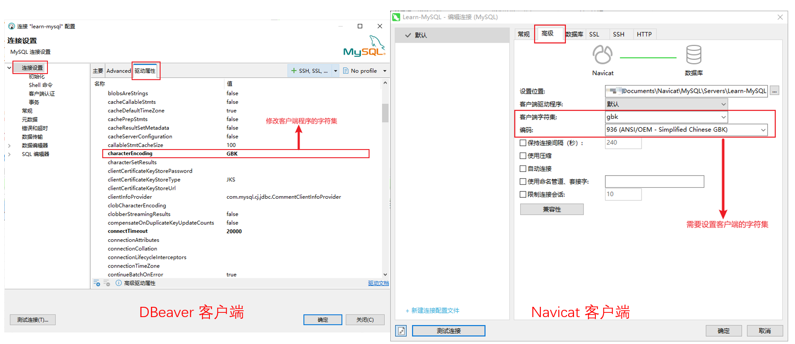
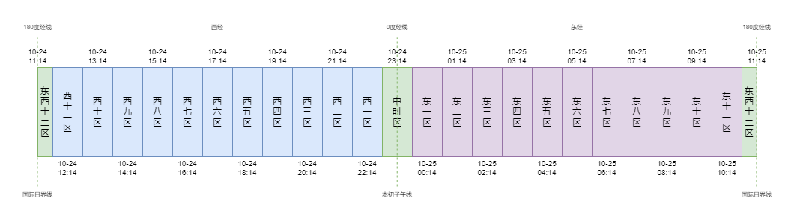

# SQL 系列 (一) 基础数据类型

[TOC]

---

在 SQL 语言中, 支持的基础数据类型有三种: **数值类型**, **字符串类型** 和 **日期类型**。除此之外, 不同的数据库软件还支持其它类型, 比方说: MySQL 支持 **JSON 数据类型** 和 **空间数据类型**; Hive 支持 **集合数据类型**。

本文基于 MySQL 8.0 的版本 整理一下 三大基础类型, 并盘点一下计算机的基础知识。下面让我们开始吧 ~

## 一、字符串类型

字符串类型 (String Type) 是我们最常用的数据类型, 其本质是一个 "字符数组"。在介绍 字符串 之前, 让我们看看 字符 的相关知识。

### 1.1 字符集 背景知识

我们知道, 计算机中最小的存储单位是 **字节** (byte)。一个字节内部包含八个 **比特** (bit), 每一个比特有 0 和 1 两种状态, 那么一个字节最多可以表示 $2^8 = 256$ 种不同的值。对于布尔类型的变量, 即使我们只需要一个比特就能表示所有可能的值, 也需要占用一个字节的空间。

那么, 在这种背景下, 我们如何存储单个字符呢? 最简单的方式: 收集所有可能的字符, 然后给每一个字符赋予一个整数, 这个整数的二进制表示即为该字符在 内存/硬盘 中的存在方式。我们将这样的过程称为 **字符编码** (character encoding), 所有可能的字符集合称为 **字符集** (character set), 每一个字符对应的整数称为 **码位** (code point)。

[ASCII](https://en.wikipedia.org/wiki/ASCII) 是最经典的字符编码集, 其一共编码了 128 个字符, 包括 英文字母、数字、控制字符 等等, 我们只需要七个比特的空间就能表示所有值。[Latin-1](https://en.wikipedia.org/wiki/ISO/IEC_8859-1) 在 ASCII 的基础上添加了 法语、德语、丹麦语 等欧洲语言的字母, 一共编码了 256 个字符, 正好占满一个字节的空间。对于 中日韩 (CJK) 语系来说, 我们至少需要两个字节来表示一个字符, 常见的字符集有 [GBK](https://en.wikipedia.org/wiki/GBK_(character_encoding))、[Big5](https://en.wikipedia.org/wiki/Big5) 等等。

---

然而, 如果想表示全球所有语言的字符, 两个字节 (65536) 显然是不够用的。为了解决这个问题, [Unicode](https://en.wikipedia.org/wiki/Unicode) 字符集就此诞生。Unicode 字符集中定义了一个新的概念: **平面** ([plane](https://en.wikipedia.org/wiki/Plane_(Unicode))), 我们可以简单将其理解为 "字符子集"。一个平面内包含 65536 个码点, 也就是两个字节能够编码的最大字符数量。Unicode 中一共预设了 17 个平面, 包括 1 个 基本语言平面 (BMP, Basic Multilingual Plane) 和 16 个 扩展平面 (supplementary plane)。BMP 平面非常重要, 除去 预留码位, 一共编码了六万多个字符, 包括基础的二万多个汉字。我们日常生活和工作时使用的绝大部分字符都在 BMP 中。相较而言, 扩展平面中的字符并不常见, 最常用的大概就是聊天时使用的 "表情" (emoji) 字符了。目前, 16 个扩展平面仅仅使用了一小部分, 截至 16.0 版本, unicode 总共编码了 15,4998 个字符, 占总码点数的 10% 左右。

在 Unicode 字符集中, 17 个平面一共有 $17 \times 65536$ (约 110 万) 个码点, 因此 unicode 码点最大值为 $17 \times 65536 - 1 = 1114111$, 最多需要 21 位比特进行存储, 那么 3 个字节的空间就可以表示所有字符了。在 计算机体系 中, 硬盘中的字符可以以 三个字节 的形式存在, 但是内存中的字符不能以 三个字节 的形式存在, 其受 [内存对齐](https://zhuanlan.zhihu.com/p/30007037) 等因素的限制。为了解决这一问题, Unicode 字符集提供了多种编码方式: UCS-2、UCS-4、[UTF-8](https://en.wikipedia.org/wiki/UTF-8)、[UTF-16](https://en.wikipedia.org/wiki/UTF-16) 和 [UTF-32](https://en.wikipedia.org/wiki/UTF-32)。下面, 让我们来看看这些编码方式。

UCS-2 使用 2 个字节进行编码, 仅仅编码 BMP 平面内的字符, 码点值的 `uint16` 二进制表示即为编码结果, 它也是最早的 Unicode 编码方式。UCS-4 和 UTF-32 两者是等价的, 它们使用 4 个字节进行编码, 码点值的 `uint32` 二进制表示即为编码结果。UTF-32 编码方式很简单, 但是有一个明显的缺陷, 那就是过于浪费硬盘空间了, 主要体现在以下三个方面: (1) Unicode 最多 21 位, 那么注定有 11 位是没用的; (2) 日常工作和生活中, 我们使用的绝大部分字符都在 BMP 中, 这些字符只需要 16 位即可; (3) 在代码文件中, 绝大部分字符都在 ASCII 中, 这些字符只需要 8 位即可。那么, 有没有什么好的解决办法呢? 答案是 **变长编码** (variable-width encoding), UTF-8 和 UTF-16 都是采取的这种编码方式。下面让我们来看看这两种编码方式。

UTF-8 中使用单字节作为最小处理单位, 一个字符可能由 1, 2, 3 或者 4 个字节组成。具体的编码规则如下:

(1) 如果字符的码点小于 `127`, 那么使用 1 个字符进行存储, 此时首位比特为 `0`, 剩下 7 个比特是字符码点的二进制形式。在 Unicode 中, 前 128 个字符和 ASCII 字符集是一致的, 那么这 128 个字符的 ASCII 和 UTF-8 编码结果是相同的。因此, 我们会说 UTF-8 编码方式兼容 ASCII 编码。

(2) 如果字符的码点在 `128` 到 `2047` 之间, 那么使用 2 个字节进行存储, 此时第一个字节的前三位比特是 `110`, 第二个字节的前两位比特是 `10`, 剩下的 11 位比特是码点的二进制形式, 最多恰可以编码 $2^{11} = 2048$ 个字符。

(3) 如果字符的码点在 `2048` 到 `65535` 之间, 那么使用 3 个字节进行存储, 此时第一个字节的前四位比特是 `1110`, 后续两个字节的前两位比特是 `10`, 剩下的 16 位比特是码点的二进制形式, 最多恰可以编码 $2^{16} = 65536$ 个字符。从这里可以看出, BMP 字符的 UTF-8 编码至多为 3 个字节, 常用汉字的 UTF-8 编码都是三个字节。

(4) 如果字符的码点大于等于 `65536`, 那么就使用 4 个字节进行存储, 首个字节的前五位比特是 `11110`, 后续的四个字节前两位比特都是 `10`, 剩余 21 位比特是码点的二进制形式。扩展平面字符的 UTF-8 编码都是 4 个字节。

目前, UTF-8 已经成为 WEB 开发的主流编码方式了。原因很简单, 在 HTML/CSS/JavaScript 代码中, 大部分字符都在 ASCII 字符集中, 这些字符的 UTF-8 编码仅仅占用一个字节, 传输效率比 UTF-16 和 UTF-32 编码方式高很多。

UTF-16 中使用 "双字节" (16 位比特) 作为最小处理单位, 一个字符可能由 2 或者 4 个字节组成。具体的编码方式如下:

(1) 如果字符在 BMP 平面内, 即码点值小于 `65536`, 那么就采取 "双字节" 的编码模式, 即码点值对应的 16 位 无符号整数 编码就是该字符的编码。需要注意的是, 在 BMP 平面内, 以 `11011` 开头的 2048 个码点 (`55296` 到 `57343` / `0xD800` 到 `0xDFFF`) 被称为 代理数 (surrogates), 它们不表示任何字符, 专门用于扩展平面的编码。

(2) 如果字符不在 BMP 平面内, 即码点值大于 `65535`, 那么就采取 "四字节" 的编码模式, 使用 "代理数" 进行标识: 首先将 码点值 减去 `655536`, 确保 20 位比特可以完成编码任务。然后将 `110110` 和 "高十位" 进行拼接, `110111` 和 "低十位" 进行拼接, 得到的 32 位比特即为编码结果。

UTF-16 采取上述编码方式是为了兼容 UCS-2 编码集。相较于 UTF-8, UTF-16 的优势在于: 编码常见的中文汉字仅仅需要两个字节, 而非三个字节; 缺陷是: 不兼容 ASCII 编码。Unicode 官方设置 17 个平面也是为了 UTF-16 设计的。至此, 你应该对 unicode 有一个大致的了解。

---

上面已经介绍过了, 在 硬盘存储 和 网络传输 中, 我们一般都使用兼容 ASCII 的 UTF-8 编码方式。那么, 在内存中, unicode 字符是如何存在的呢? 常见的方式有两种:

第一种是使用 定长编码 的 UCS-2 或者 UCS-4 编码方式, 这样字符串就是一个 `uint16` 或者 `uint32` 数组。举例来说, Python 内存中字符串的编码 [策略](https://www.cnblogs.com/traditional/p/13455962.html) 是: 如果字符串中所有字符的码点都小于 `256`, 那么就使用 Latin-1 编码; 如果字符串中所有字符的码点都小于 `65536`, 且至少有一个字符的码点大于 `255`, 那么就使用 UCS-2 编码; 如果字符串中只要有一个字符的码点大于 `65535`, 那么就使用 UCS-4 编码。

第二种是使用 变长编码 的 UTF-8 或者 UTF-16 编码方式。如果使用 UTF-8 编码方式, 此时的字符串是一个 `uint8` 数组。在进行子串查找时, 我们遍历的不是单个字符, 而是单个字节, 并且需要判断哪些字节构成一个字符。GO 语言中的字符串就是以这种形式存在的。相较于 定长编码, 变长编码 优点有两个: (1) 节约内存; (2) 可以直接对外输出, 不需要进行数据转换。缺点也很明显: 运算 (比方说 子串查找) 速度很慢。

特别提醒一下, 无论采取上述哪种方式, 字符串都不会是 `uint24` 数组形式存在! 在 大部分编程语言中, 有 **字符串** 和 **字节流** 两个概念, 两者间关系最简单的描述方式为: **字符串** 是带有 字符集 标识的的 **字节流**。**字符串** 是程序内部使用的, 而 **字节流** 主要用于程序之间交互的。我们将 字符串 转 字节流 的过程称为 **编码**, 字节流 转 字符串 的过程称为 **解码**。当然, 你也可以将 数字 以 字符串/整形/浮点数 的形式编码成 字节流。

我们在编程的过程中, 字符集 的概念随处可见: 源码文件、输入输出文件、程序内存、Shell/CMD 等等都有自己的字符集。只要某一个环节不匹配, 就会出现 乱码 的情况。幸运地是, 现在大家统一使用 Unicode 字符集。由于 Unicode 字符集尽可能地包含了所有语言的字符, 其它的字符集都可以看作是 Unicode 的子集。目前, 使用非 Unicode 字符集最大的意义是: 节约硬盘空间。

除 Unicode 字符集外, 简体中文 还有 GB (国标) 系列的字符集, 一共有三个: [GB 2312](https://en.wikipedia.org/wiki/GB_2312)、[GBK](https://en.wikipedia.org/wiki/GBK_(character_encoding)) 和 [GB 18030](https://en.wikipedia.org/wiki/GB_18030), 三者是逐步完善的关系 (字符数是逐步递增的)。这三者都采取类似 UTF-8 方式的变长编码, 并且兼容 ASCII 字符集。GB 2312 和 GBK 最大字节数为 2, 最新的 GB 18030 最大字节数为 4。对于中文编码来说, GBK 是比较好的选择, 相较于 UTF-8, 一个字符能够节约一个字节的空间。

### 1.2 MySQL 字符集设置

在 MySQL 中, 一共支持 41 种不同的字符集, 我们可以通过 `show character set;` 指令进行查看。和 Unicode 字符集相关的一共有 6 个: `ucs2`, `utf16`, `utf16le`, `utf32`, `utf8mb3` 和 `utf8mb4`。这里重点强调一下 `utf8mb3` 和 `utf8mb4` 两个字符集: 它们都采用 UTF-8 的编码方式, 区别是 `utf8mb3` 仅仅支持 BMP 平面内的字符, 单字符最长为 3 个字节, 而 `utf8mb4` 支持所有 Unicode 字符, 单字符最长为 4 个字节。目前, MySQL 默认的字符集是 `utf8mb4`, 而 `utf8` 代指的是 `utf8mb3`。

MySQL 中字符集的概念主要体现在两个地方: 一个是 字段 的字符集, 另一个是 连接 的字符集。

我们在 DDL 语句中定义 字段 时, 是可以指定字符集的, 方式如下: `col_name char(255) character set utf8mb4`。如果没有指定, 会依次寻找 "数据表", "数据库" 和 "服务器程序" 的默认字符集, 找到哪一个就用哪一个。如果都没指定, 则使用 `utf8mb4`。

除此之外, 数据库连接也是有字符集的, 我们可以通过 `show variables like 'character%';` 查看相关设置, 重点的变量有两个: `character_set_client` 和 `character_set_results`。前者是 SQL 代码的字符集, 后者是返回数据的字符集。

更具体地说, "服务器程序" 在接收到 "客户端程序" 传递的 "SQL 代码" 字节流之后, 以 `character_set_client` 字符集进行 **解码**; 在运算完成之后, "服务器程序" 将 "数据表" 以 `character_set_results` 字符集 **编码** 成字节流传递给 "客户端程序"。

因此, "客户端程序" 必须用 `character_set_client` **编码** "SQL 代码", 并以 `character_set_results` **解码** 返回的 "数据表", 这样才不会出现 "乱码" 的情况。在大部分 "客户端程序" 中, 都要求两个编码是一致的。下图展示了 DBeaver 和 Navicat 客户端修改字符集的方式:



需要注意的是, 字段字符集 和 连接字符集 之间作用域是不同的。连接字符集 是 客户端 与 服务器 之间沟通的协议, 字段字符集 则是 服务器内部 存储 和 计算 的方式。举例来说, 如果 连接字符集是 `utf8mb4` 且 字段字符集是 `gbk`, (1) 当我们插入数据时, 使用的 DML 语句是 `utf8mb4`, MySQL 会自动将 字段 相关的 字符串 转换成 `gbk` 进行存储; (2) 当我们查询数据时, 使用的 DQL 语句依旧是 `utf8mb4`, MySQL 会自行将 字段 相关的 字符串 转换成 `gbk` 进行计算, 并将查询结果转换成 `utf8mb4` 返回。换言之, 字段字符集 是 MySQL 内部使用的字符集, 而 连接字符集 是 MySQL 和 客户端 之间交换数据的字符集。

从上面可以看出, 字段字符集 必须是 连接字符集 的 **子集**, 不然在执行 DML 语句时, 插入的数据可能是 乱码。一般情况下, 建议将 连接字符集 设定为 `utf8mb4`, 这样 字段字符集 就可以是任意的了, 因为所有的字符集都是 unicode 的子集。

假设你不知道 MySQL 连接的字符集怎么办呢? MySQL 规定 `character_set_client` 字符集必须兼容 ASCII 字符集, 也就是说 `ucs2`, `utf-16`, `utf-32` 等等字符集均不可以。这样, 我们可以先用 ASCII 字符集进行交互, 获取基本的信息, 避免无法交互的情况发生。

在 MySQL 中, 字符串常量 是有自己的字符集的, 默认和 连接字符集 保持一致。需要注意的是, 字符串常量 的字符集只有在不涉及到 字段 的运算中才起作用, 如果涉及到 字段运算, 那么 常量字符集 会无条件转换成 字段字符集。

我们可以使用 `convert` 函数显示的改变 常量字符集, 方式如下: `select '安' < '北', convert('安' using 'gbk') < convert('北' using 'gbk');`。

---

最后额外补充一点, 上面介绍的 MySQL 连接字符集 有两个: `character_set_client` 和 `character_set_results`。除此之外, 还有一个: `character_set_connection` 字符集, 其是控制 SQL 语句中字符串部分的解码方式。

举例来说, 当 客户端 向 服务器 传递 SQL 语句 `select '你好';` 字节流时, 我们可以将 `你好` 子串不使用 `character_set_client` 字符集编码, 而使用 `character_set_connection` 字符集编码。也就是说, 一个 SQL 代码使用两种不同的 编码方式。MySQL 在解码时, 会优先使用 `character_set_connection` 字符集解码, 如果失败, 再使用 `character_set_client` 字符集解码。

除此之外, MySQL 还允许在 SQL 语句中直接标识解码方式 (introducer), 比方说 `_gbk'你好'` 表示将 `你好` 字符串对应的字节流用 GBK 格式编码。

但是, 在大多数客户端中, 是不支持用户直接拼接 SQL 代码的字节流, 这是非常底层的操作。因此该变量不建议修改, 和 `character_set_client` 保持一致即可。

### 1.3 字符串类型

MySQL 支持以下的字符串类型:

+ 字符串: `char`, `varchar`, `text`
+ 字节串: `binary`, `varbinary`, `blob`

`char` 类型是 "定长字符串", `char(n)` 表示字符串中 **字符** 的个数是 `n`, `n` 的值必须在 `0` 到 `255` 之间。对于长度不足 `n` 的字符串, MySQL 会在字符串的末尾添加 "空字符"。在对字符串进行操作时, 会先去掉 "空字符" 的部分。

`varchar` 类型是 "变长字符串", `varchar(n)` 表示字符串中字符最多为 `n` 个。在 MySQL 中, 一条记录最多占用 65535 个字节。如果我们使用 `'utf8mb4'` 字符集, 当数据表中只有一个字段时, 那么 `n` 的最大值是 $\lfloor 65535 \div 4 \rfloor = 16383$; 当数据表中还有其它字段时, 我们需要先减去其它字段占用的字节数, 然后再除以 `4` 并取整, 就是 `n` 的最大值。`varchar` 类型会在字符串中添加 **字符数** 前缀: 当 `n` 的值小于 `256` 时, 会给每一个字符串添加额外一个字节的前缀; 当 `n` 的值大于 `256` 时, 会给每一个字符串添加额外两个字节的前缀。

举例来说, 对于字符串 `"abc"` 来说, `char(10)` 使用 10 个字节进行存储: `"abc"` 后面添加 7 个空字符后缀; `varchar(10)` 会使用 4 个字节进行存储: 字符数前缀 `3` + `"abc"`。从这里可以看出, 所有 "变长" 的对象, 都需要额外的空间来标识长度。

`text` 类型也是 "变长字符串"。和 `varchar` 不同的是, `text` 类型不会占用记录原本的空间, 而是使用额外的页空间。也就是说, `text` 字段不算在 `65535` 个字节的空间范围之内。和 `text` 相关的有四种类型: `tinytext`, `text`, `mediumtext` 和 `longtext`。四种类型最大的字节数分为是 $2^{8}$, $2^{16}$, $2^{24}$ 和 $2^{32}$ (也就是 256 bytes, 64 KB, 16 MB 和 4GB)。

字节串是由字节构成的数组, 也被称为 二进制字串 (binary string)。我们可以将 图片、音频、文件 等数据存储成 字节串。之所以将 字节串 划分到 字符串 类型中, 是因为其支持 字符串 相关的运算, 但是这些运算显然是不适用于 图片、音频相关的数据。当然, 我们一般也不会将图片音频数据存储到 MySQL 中, 而是放在文件服务器中, 因此这些类型很少会使用到。

在字节串中, `binary`, `varchar`, `blob` 分别和 `char`, `varchar`, `text` 类型相互对应, 用于表示 "定长字节串", "变长字节串" 和 "额外空间字节串"。字节串中类型的限制和字符串是相似的, 这里就不过多介绍了。

### 1.4 字符串函数

在 MySQL 中, 和字符串相关的函数有以下一些:

+ 字符集编码: `ascii`, `ord`, `char`, `hex`, `unhex`, `charset`
+ 字符串比较: `strcmp`, `weight_string`, `collation`
+ 字符串长度: `bit_length`, `octet_length`, `length`, `character_length`, `char_length`
+ 子串查找: `locate`, `instr`, `position`
+ 子串截取: `left`, `mid`, `right`, `substring`, `substr`, `substring_index`
+ 子串替换: `insert`, `replace`
+ 正则表达式: `regexp_instr`, `regexp_like`, `regexp_replace`, `regexp_substr`
+ 字符串拼接: `concat`, `concat_ws`, `group_concat`
+ 大小写转换: `lcase`, `lower`, `ucase`, `upper`
+ 前后子串处理: `trim`, `ltrim`, `rtrim`, `lpad`, `rpad`
+ 其它函数: `format`, `quote`, `reverse`, `space`, `repeat`, `soundex`, `load_file`
+ 多元字符串: `elt`, `field`
+ 全文检索: `match`
+ 整数进制转换: `conv`, `bin`, `hex`, `oct`
+ base64 编码: `from_base64`, `to_base64`

---

第一类是字符集编码, 这些函数和 字节串 的关系较大, 并不常用, 这里简单介绍一下:

`ascii` 返回字符串第一个 "字节" 对应的 "无符号整形数字"。如果字符串采用 ASCII 编码, 那么返回的就是第一个字符的码点。

`ord` 是返回字符串第一个 "字符" 对应 "字节串" 对应的 "无符号整形数字"。需要注意的是, 这里返回的不是 "字符" 的码点, 而是直接将 "字符" 当作无符号整数返回。Python 中也有同名函数, 返回的是 "字符" 的码点。

`char` 将多个整形数字组合成一个 字节串。但是当你指定字符集时, 会被认定为字符串。对于 "单字符" 而言, `ord` 和 `char` 是一对 "互逆运算", 比方说: `select char(ord('安') using 'utf8mb4');`。

`hex` 是将 字符串/字节串 转换成 "十六进制字串" (hexadecimal string), 即将 字符串/字节串 中每一个字节用两位 十六进制 数字表示。十六进制数字由 0-9 和 A-F 构成, 两位十六进制最大是 `FF`, 恰好对应一个字节 (八位二进制) 的最大值 `255`。也就是说, 输出的字符串中两个字符对应输入字符串中的一个字节, 且输出的字符串仅由 0-9 和 A-F 构成。

`unhex` 是 `hex` 的逆操作, 将 "十六进制字串" 解码成正常的 字节串。我们可以用: `select convert(unhex(hex(convert('安' using 'gbk'))) using 'gbk');` 分析两个函数的效果。

`charset` 返回 字符串 的字符集。如果是 字节串, 则返回 `binary`。

第二类是 字符串比较, 这个会在下一节中详细介绍。

第三类是 字符串长度: `bit_length` 返回字符串中比特个数; `octet_length` 和 `length` 是一致的, 返回字符串中的 字节数; `character_length` 和 `char_length` 是一致的, 返回字符串中的 字符数。

---

接下来是 字符串 中最常见的三个操作: **查找**、**截取** 和 **替换**。在介绍这三个操作之前, 需要了解一下 **子串** 和 **位置序号** 的相关内容。

字符串 的 **子串** 是指由字符串中 **连续字符** 组成的序列。举例来说, 字符串 `abc` 一共有六个子串: `a`、`ab`、`abc`、`b`、`bc` 和 `c`。观察例子, 我们可以发现, 字符数为 $n$ 的字符串一共有 $n + (n-1) + \cdots + 1 = \frac{n (n+1)}{2}$ 个 子串。**子串** 的概念和 **子序列** 非常相似, 区别在于: **子串** 中所有的 字符 必须 **连续**。

一个数组的 索引 有两种构建方式: 一种是基于 "首元素的偏移量" ([0-based numbering](https://en.wikipedia.org/wiki/Zero-based_numbering)), 另一种则是基于 "位置序号" (1-based indexing)。大多数编程语言中都采用 0-based 的方案检索数组, 但是 SQL 语言采取 1-based 的方案。同时, 额外提醒一点, SQL 语言中的 "索引" 指的不是数组元素序号, 而是能够快速检索 记录 的数据结构。

**查找** 指的是寻找 字符串 中 子串 的位置, 核心函数是 `locate`。`locate(substr, str, pos)` 函数是从 `str` 的第 `pos` 个字符开始 (包含第 `pos` 个字符), 寻找 `substr` 子串。如果找到了, 则返回 `substr` 在 `str` 中起始的位置序号; 如果没有找到, 则返回 `0`。

举例来说, `locate('--', '2025--09--01')` 是在 `2025--09--01` 字符串中寻找 `--` 子串, 第 5 个和第 6 个字符正好匹配, 因此返回的是 `5`。在 `2025--09--01` 中显然有两个 `--` 子串, 如果想获取第二个子串, 就需要 `pos` 参数了: `locate('--', '2025--09--01', locate('--', '2025--09--01') + 1)`。

`instr` 和 `position` 函数的功能跟 `locate` 是一致的, 区别在于传参方式不同, 这里就不过多介绍了。

**截取** 指的是根据获取 字符串 的 子串, 核心函数是 `substring`。`substring(str, pos, len)` 指的是从 `str` 的第 `pos` 个字符开始 (包含第 `pos` 个字符), 截取长度为 `len` 的子串。举例来说, 我们想获取日期字符串 `2025-09-01` 中的年份, 可以用 `substring('2025-09-01', 1, 4)` 获取。

`substring` 函数还有一个特点: `pos` 支持 **负位置序号**。这是本小节介绍的函数中唯一支持 **负位置序号** 的, 方式和 Python 中的差不多: 最后一个字符的序号是 `-1`, 倒数第二个字符的序号是 `-2`, 以此类推, 第一个字符的序号是 `-char_length(str)`。程序会自动将 **负位置序号** 转换成正常的位置序号, 同时不会改变 **任何** 的运算规则。比方说, 如果想从日期字符串 `2025-09-01` 中截取月份信息, 可以用 `substring('2025-09-01', -5, 2)` 获取。

`substring` 函数有两个别名函数: `mid` 和 `substr`。除此之外, `left(str, len)` 等价于 `substring(str, 1, len)`, 表示从第 `1` 个字符 (最左边) 开始截取长度为 `len` 的子串; `right(str, len)` 等价于 `substring(str, -len, len)`, 表示从右侧往前数 `len` 个字符, 截取至最右边。Excel 中也有 `left`, `mid` 和 `right` 三个函数, 功能和这里的一样。

`substring` 函数是基于 位置序号 提取子串, 除此之外, 还有 `substring_index` 函数, 其是基于 子串 提取 子串。 `substring_index(str, delim, count)` 是从 `str` 中第 `count` 个 `delim` 开始, 截取在其 **之前** 所有的字符。举例来说, 想要获取日期字符串 `2025--09--01` 中的年份, 可以使用 `substring_index('2025--09--01', '--', 1)`。

在 `substring_index` 函数中, `count` 参数可以为负数, 此时的含义是: 从 `str` 右侧开始的第 `-count` 个 `delim` 开始, 截取在其 **之后** 所有的字符。举例来说, 如果想要获取日期字符串 `2025--09--01` 中的天数, 可以使用 `substring_index('2025--09--01', '--', -1)`。

特别强调一下, `substring` 中的 `pos` 参数和 `substring_index` 中的 `count` 分别表示 **字符** 和 **子串** (`delim`) 的位置序号, 参数都可以为 负数, 但是有一个很大的差别: `substring` 中 `pos` 负值不会改变函数的功能, `substring_index` 中 `count` 负值会改变函数的功能。

**替换** 指的是将字符串中的子串替换成其它字符串。核心函数有两个: `insert` 和 `replace`。`insert(str, pos, len, newstr)` 表示将 `str` 从第 `pos` 开始长度为 `len` 的子串替换成 `newstr`。如果想在第 `pos` 之前插入 `newstr`, 那么可以将 `len` 参数设置为 `0`, 非常便捷。`replace(str, from_str, to_str)` 是将 `str` 中所有的 `from_str` 子串替换成 `to_str`。

`locate`, `substring`, `insert` 和 `replace` 四个函数非常重要。在 Excel 中, 上述四个函数分别对应: `find`, `mid`, `replace` 和 `substitute`。注意不同工具之间函数名称的差异。总结一下本小节的相关操作:

```SQL
select 
    locate('--', '2025--09--01'), -- 查找第一个子串
    locate('--', '2025--09--01', locate('--', '2025--09--01') + 1), -- 查找第二个子串
    substring('2025--09--01', 1, 4), -- 获取年份
    right('2025--09--01', 6), -- 获取月日
    substring('2025--09--01', char_length('2025--09--01') - 6 + 1, 6), -- substring 实现 right
    substring('2025--09--01', -6, 6), -- substring 实现 right
    substring_index('2025--09--01', '--', 1),  -- 获取年份
    substring_index('2025--09--01', '--', -2),  -- 获取月日
    replace('2025--09--01', '--', '-'), -- 将所有的 '--' 字串替换成 '-'
    insert('2025--09--01', 5, 2, '-'), -- 从第 5 个字符开始, 往后的 2 个字符替换成 '-'
    insert('2025--09--01', locate('--', '2025--09--01'), char_length('--'), '-') -- insert 实现 replace
```

和子串运算相关的还有模式匹配, 包含正则表达式。相关内容会在本章后续小节中介绍。

---

字符串拼接 指的是将 多个字符串拼接成一个字符串: `concat(str1, str2, str3, ...)` 就是将 `str1`, `str2`, `str3` 等多个字符串拼接在一起, 等价于其它编程语言中的 `str1 + str2 + str3 + ...`。`concat_ws(sep, str1, str2, str3, ...)` 则是在拼接的时候, 每两个字符串之间增加 `sep` 字符串。这个函数和 Python 中的 `sep.join([str1, str2, str3, ...])` 功能类似。

大小写转换 则是将字符串中的 **英文字母** 全部转换成 大写/小写, 其它则不变。`upper` 和 `ucase` 是转大写; `lower` 和 `lcase` 是转小写。

前后子串处理 则是在字符串的 前面/后面 添加/删除 指定的字符。`trim(str)` 是删除字符串前后的空白字符, 除此之外, 还支持以下的一些用法:

```SQL
select 
    trim(' gh gh '),  -- 删除字符串前后所有的空白字符: `gh gh`
    trim(leading from ' gh gh '),  -- 等价于 ltrim 函数, 删除字符串前面的空格: `gh gh `
    trim(trailing from ' gh gh '),  -- 等价于 rtrim 函数, 删除字符串后面的空格: ` gh gh`
    trim('ab' from 'abab_cd_ab_ef_abab'),  -- 删除字符串前后的 `ab` 子串: `_cd_ab_ef_`
    trim(leading 'ab' from 'abab_cd_ab_ef_abab'),  -- 删除字符串前面的 `ab` 子串: `_cd_ab_ef_abab`
    trim(trailing 'ab' from 'abab_cd_ab_ef_abab')  -- 删除字符串后面的 `ab` 子串: `_cd_ab_ef_abab`
```

`lpad(str, len, padstr)` 则是在 `str` 的左侧填充 `padstr`, 直至字符串的长度达到 `len`; `rpad(str, len, padstr)` 则是在 `str` 的右侧填充 `padstr`, 直至字符串的长度达到 `len`。

其它函数 则是未归类函数: `format(x, d)` 则是保留数字 `x` 小数点后 `d` 位, 并添加 "千位分隔符"。`reverse(str)` 则是将字符串倒序输出。`space(n)` 则是返回 `n` 个空格组成的字符串。`repeat(str, n)` 则是返回 `n` 个 `str` 拼接而成的字符串。`soundex(str)` 则是返回 `str` 英文发音的编码, 使用 [Soundex](https://en.wikipedia.org/wiki/Soundex) 算法。由于涉及到 语音 相关的内容, 这里就不介绍了。

`field(str, str1, str2, str3,...)` 返回 `str` 在列表 `[str1, str2, str3, ...]` 中的位置序号。如果 `str` 不在列表中, 则返回 `0`。这个函数常用于排序。比方说, 在姓名排序时, 我们想将 `Jack` 置顶, 可以这样写: `order by field(name, 'Jack') desc, name`。

`elt(n, str1, str2, str3)` 返回列表 `[str1, str2, str3, ...]` 中位置序号为 `n` 的字符串。这个函数可以和 `interval` 组合完成 "数值分段" 的工作: `elt(interval(age, 3, 10, 18, 60) + 1, '幼儿', '儿童', '青少年', '青壮年', '老年')`。除此之外, `field` 和 `elt` 两个函数是互逆操作。

---

最后, 详细介绍一下 `quote` 函数。`quote(str)` 则是在 `str` 字符串前后添加 单引号, 并转义字符串中已有的 单引号, 我们可以通过 `select 'Don\'t!', quote('Don\'t!');` 查看效果。这个函数本身很简单, 但是其可以缓解 [SQL 注入](https://en.wikipedia.org/wiki/SQL_injection) 的问题。

举例来说, 当接口请求 id 为 `5` 的人员信息时, 我们的 SQL 可以写成 `select * from t_person where id = 5;`。在这里, id 是 **接口入参**。如果有 hacker 想窃取数据库中的数据, 那么他可能会将 id 请求参数从 `5` 改成 `5 or 1 = 1`, 此时的 SQL 语句就变成了 `select * from t_person where id = 5 or 1 = 1;`, 服务器会将全部数据返回给客户端, 数据库中的数据就被窃取了。一种简单的预防措施是: 使用 `quote` 给参数加上引号, 此时 SQL 语句变成: `select * from t_person where id = '5 or 1 = 1';`, 这样就不会返回全部数据了, 而是只返回 id 为 `5` 的记录, 具体可以参考 下一章 介绍的 字符串 转 整数 方式。

在很多数据开发平台中, 给 **接口入参** 添加单引号已经是标准操作了, 基本上都不允许使用 **接口入参** 来拼接 SQL 语句, 很容易受到攻击。至此, 你应该对 字符串函数 有一个大致的了解。下面, 让我们看看 字符串比较 和 模式匹配 相关的内容。

### 1.5 字符比较规则

上一节介绍的字符串函数基本上都是 "相等比较", 即判断两个字符是否相等。除此之外, 有时候我们需要对 字符串 进行 **排序**, 将相同字符的内容放到一起, 便于 "检索" 或者 "分页" 操作。举例来说, 在 英文词典 中, 会将所有的 英文单词 按照 字母表序 进行排列。这样, 在我们查找 英文单词 时, 根据 字母表序 就能够快速找到单词。

那么, 对于 字符串排序 操作, 核心问题是: 如何比较两个字符的大小。最简单的方案是: 直接按照字符码点的大小进行比较。在 ASCII 编码集中, 大写字母 `A-Z` 的码点值是 `65` 到 `90`, 小写字母 `a-z` 的码点值是 `97` 到 `122`, 正好可以满足 字母表序 的要求。但是, 如果我们不希望区分大小写, 即大写字母 `A` 和小写字母 `a` 判断为相同, 那么我们应该怎么办呢? 一种简单的方式是将所有的字符串转换成小写进行排序。MySQL 中提供了另一种方式: **比较规则** (collate), 自动帮助我们完成映射。

我们可以通过 `show collation;` 指令查看 MySQL 支持的所有 比较规则, 每一个字符集都有自己默认的 比较规则。`utf8mb4` 默认为 `utf8mb4_0900_ai_ci`。在 比较规则 的名称中, 有四个简写我们需要关注:

+ `ci` (case insensitive): 不分区大小写; 也就是说 `a` 和 `A` 会被判定为同一字符
+ `cs` (case sensitive): 区分大小写; 也就是说 `a` 和 `A` 是两个字符
+ `ai` (accent insensitive): 不区分音调, 以及全角和半角; 也就是说中英文括号会被判定为相同字符
+ `as` (accent sensitive): 区分音调, 以及全角和半角; 也就是说中英文括号会被判定为不同字符

也就是说, MySQL 默认使用的 "比较规则" 不区分大小写、音调、全角和半角字符、中英文括号 等等内容。如果你的业务有特殊需求, 需要严格区分, 建议使用 `utf8mb4_0900_as_cs`。对于 中文字符 而言, 我们一般需要根据 拼音 进行排序, 此时将 "比较规则" 设置为 `utf8mb4_zh_0900_as_cs` 即可。

在 MySQL 中, 一个 字符串 不仅有 字符集 属性, 还有 比较规则 属性。我们可以使用 `collate` 从句直接指定 字段 或者 字符串常量 的字符集, 方式如下:

```SQL
select 
    '安' < '北',  -- `安` 的码点值是大于 `北` 的
    '安' collate utf8mb4_zh_0900_as_cs < '北' collate utf8mb4_zh_0900_as_cs  -- `安` 的拼音是小于 `北` 的
```

和 字符集 的设置一样, 字段 比较规则 的设定也有四个层级: 字段属性、数据表 选项、数据库 选项、服务器 参数。使用 字段属性 设置方式如下: `col_name char(255) character set utf8mb4 collate utf8mb4_zh_0900_as_cs`。

两个字符串大小比较方式: 从左到右两个字符串中的字符逐位比较; 若不同, 则返回结果; 若相同, 则继续比较下一个字符; 若某个字符串耗尽, 则耗尽的字符串小。换言之, 如果一个字符串是另一个字符串的前缀, 那么 "前缀字串" 小于 "长字串"。

我们可以使用 `<`, `<=`, `=`, `>`, `>=`, `between ... and ...` 等运算符比较字符串的大小, 也可以用 `strcmp(str1, str2)` 函数比较字符串大小: 若 `str1` 小于 `str2`, 则返回 `-1`; 若 `str1` 等于 `str2`, 则返回 `0`; 若 `str1` 大于 `str2`, 则返回 `1`。

**比较规则** 不仅仅影响字符串排序, 还会影响字符串相等判定。在 MySQL 中, `locate`, `field` 等函数会受到 比较规则 的影响, 但是 `replace`, `trim` 等函数则不会受到影响, 这一点一定要注意。总结一下: SQL 语句中非字符串部分是不区分大小写字母, 字符串部分区分大小写字母, 但是在默认的 **比较规则** 下, 大写和小写字母会被判定成相同字符。

`weight_string` 返回的是 字符串 经过 collate 映射之后的 字节串, 属于 MySQL 内部的 debug 函数。`collate` 返回 字符串 的比较规则。至此, 你应该对 比较规则 有一个大致的了解。

### 1.6 模式匹配

在 1.4 节中, 我们介绍了字符串中 子串 的 查找、截取 和 替换。那么, 子串可以升级为某一种模式吗? 答案是可以的, MySQL 提供了 **简单模式匹配** (simple pattern matching) 和 **正则表达式** (regular expression) 两种方式。

**简单模式匹配** 没有特定的函数, 只有 `like` 运算符, 写法是 `str like pat`。其中, `pat` 支持两种匹配模式: `%` 表示匹配任意个数的字符 (包括匹配零个字符的情况); `_` 表示匹配确定的一个字符。如果你需要匹配 `%` 和 `_` 字符, 将它们转换成 `\%` 和 `\_` 即可。需要注意的是, 上一节介绍的 "比较规则" 会影响简单模式匹配。

一般情况下, 在小型的业务系统中, "模糊查询" 喜欢用 `like` 实现: `str_col like '%关键词%'`。这种方式虽然快捷, 但是效率出奇地低, 因为无法通过 B+ 索引进行优化, 且没有优化方案。建议做法是: 将 "模糊查询" 的需求替换成 "全文检索"。注意, 这里说的是 **需求替换**, 两者并不等价。

**正则表达式** 则是更加专业的子串模式匹配。关于正则表达式的语法, 这里就不介绍了。需要注意的是, 不同语言支持的表达式语法是有差别的, 使用时一定要小心。下面是三个核心函数。

`regexp_instr`, `regexp_substr`, `regexp_replace` 分别用于 模式查找、模式提取 和 模式替换。这三个函数和 `locate` (子串查找), `substring` (子串截取) 和 `replace` (子串替换) 相互对应。下面, 让我们来看看这三个函数:

`regexp_instr(str, pat, pos, occurrence, return_option, match_type)` 是从 `str` 字符串中第 `pos` 个字符开始, 寻找第 `occurrence` 个 `pat` 模式的子串。如果 `return_option` 值为 `0`, 则返回 匹配子串 第一个字符的 "位置序号"。如果 `return_option` 值为 `1`, 则返回 匹配子串 最后一个字符的 "位置序号" 加一。

`regexp_substr(str, pat, pos, occurrence, match_type)` 是从 `str` 字符串中第 `pos` 个字符开始, 寻找第 `occurrence` 个 `pat` 模式的子串。需要注意的是, 这个函数不支持提取 **捕获组** 中的内容。

`regexp_replace(str, pat, repl, pos, occurrence, match_type)` 是从 `str` 字符串中第 `pos` 个字符开始, 将第 `occurrence` 个 `pat` 模式的子串替换成 `repl` 字符串。如果 `occurrence` 的值为 `0`, 那么字符串中所有匹配到的模式子串都替换。在这里, `repl` 字符串是支持 **捕获组** 的, 下面是示例代码:

```SQL
select 
    regexp_replace('DATE: 2025-08-27', '(?<year>\\d{4})-(?<month>\\d{2})-(?<day>\\d{2})', '${year}${month}${day}'),
    regexp_replace('DATE: 2025-08-27', '(\\d{4})-(\\d{2})-(\\d{2})', '$1$2$3');
```

观察上面的三个函数, 你会发现在 `regexp_instr` 和 `regexp_substr` 两个函数中, `occurrence` 参数的限制非常大。这也很容易理解: SQL 语言对于 集合性质的字段 支持非常差! 没有办法返回 集合性质 的数据。

除了上面的核心函数之外, 还有 `regexp` 和 `rlike` 运算符, 两者是等价的, 使用方式: `str_col rlike pat`。其等价于 `regexp_like(str, pat)`, 匹配到一个 模式 就算成功。可以看作是 `like` 的升级版, 也是不支持 B+ 索引的。

### 1.7 全文检索

除了上述内容外, MySQL 还提供了 **全文检索** 的功能, 但是远远没有 ElasticSearch 好用。这里简单介绍一下相关内容。

**全文检索** ([full-text search](https://en.wikipedia.org/wiki/Full-text_search)) 指的是使用 "关键词" 从 "语料库" 中检索出相关 "文档" 的技术。在这里, "语料库" 指的是 "文档集合"。那么, 我们应该如何完成这一任务呢? 最简单的方式是: 将 "关键词" 作为 "子串" 进行子串查找, 找到即为命中。我们可以使用 `locate` 函数或者 `like` 运算符实现相关操作。

这种方式有一个很大的问题, 那就是完全没有考虑语义。举例来说, 如果关键词是 `研究生`, 那么 `研究生命科学` 这样的文本也会被检索出来。一种比较好的方式是对 "语料库" 中的 "文档" 进行 "分词" 操作, 将 "文档" 转换成 "词语列表"。然后判断 "关键词" 是否在 "词语列表" 中, 如果在则命中。`研究生命科学` 分词后应该是 `['研究', '生命', '科学']`, 此时关键词 `研究生` 不在 "词语列表" 中, 就不会检索出来。将 "文档" 转换成 "词语列表" 是 NLP 中一个很重要的思想, 这种方式也被称为 [Bag of Words](https://en.wikipedia.org/wiki/Bag-of-words_model) (BoW)。

上面的两种方式只能判断 "关键词" 和 "文档" 之间是否有相关性。那么, 我们如何给相关性打分呢? 最简单的方式就是基于 **词语频率** (term frequency, TF): 即 "关键词" 在 "词语列表" 中出现的次数 除以 "词语列表" 的总词数。也就是说, 如果 "关键词" 在 "文档" 中的占比越高, 那么相关性分数就越高。

但是, 这样做还会有一个问题: 那就是没有考虑 "语料库" 的特性。假设这个 "语料库" 中的 "文档" 都是关于 `生命科学` 的, 几乎每一篇 "文档" 都会大量提到 `生命科学` 这个词语。那么当 "关键词" 是 `生命科学` 时, 相关性分数 (词频分数) 都很高, 这显然不是我们想要的。那么, 我们可以用词语的 **文档频率** (document frequency, DF) 进行修正。词语的 **文档频率** 计算方式: 词语在多少篇 "文档" 中出现 除以 总文档数。一般情况下, 我们定义分数都是越大越好, 但是这里的 DF 是越小越好, 那么我们就定义 IDF (inverse document frequency) 分数, 其等于 DF 的倒数, 也就是 `1` 除以 DF。

将 TF (词语频率) 分数 和 IDF (逆文档频率) 相乘, 就是大名鼎鼎的 [TF-IDF](https://en.wikipedia.org/wiki/Tf-idf) 算法。在这里, TF 是站在 "文档" 角度定义的, 表示 词语 在 一篇 "文档" 中的频率; DF 是站在 语料库 角度定义的, 表示 词语 在 "语料库" 中出现的频率。当然, 你可能会有疑问: 为什么要让 TF 和 IDF 两个分数相乘呢? 这个是经验公式, 检索效果好就行, 没有必然的原因。同时, TF 和 IDF 两部分的计算公式有很多变种, [BM25](https://en.wikipedia.org/wiki/Okapi_BM25) 算法也是其变种。但是核心思想始终没有变: 关键词 在 文档 中出现的频率越高, 同时 关键词 在 语料库 中出现的次数越少, 那么相关性分数就应该越高。

如果用户输入的是一个 "句子", 那么会先转换成 "词语列表", 然后每一个词语作为 "关键词" 在 "语料库" 中进行 "检索", 将所有词语的相关性分数加在一起, 作为 "句子" 和 "文档" 之间的相关性分数。这就是完整版的检索过程。

那么, 如果我们想进行 **全文检索**, 就需要两个预先操作: (1) 利用分词算法, 将 "语料库" 中所有 "文档" 转换成 "词语频数字典"; (2) 维护一个全局的 "词语频数字典", 统计每一个词语在多少篇文档中出现过。因此, 在 MySQL 中进行 **全文检索**, 必须要创建 "全文索引" (full-text index)。下面是示例代码:

```SQL
drop table if exists articles;
create table if not exists articles (
    id int unsigned auto_increment primary key,
    title varchar(200),
    body text,
    fulltext (title, body)
) engine = innodb;

insert into articles (title, body) values
    ('MySQL Tutorial','DBMS stands for DataBase ...'),
    ('How To Use MySQL Well','After you went through a ...'),
    ('Optimizing MySQL','In this tutorial, we show ...'),
    ('1001 MySQL Tricks','1. Never run mysqld as root. 2. ...'),
    ('MySQL vs. YourSQL','In the following database comparison ...'),
    ('MySQL Security','When configured properly, MySQL ...');

select 
    *, 
    match (title, body) against ('database' in natural language mode) as fulltext_score
from 
    articles;
```

在这里, `match` 函数后面必须接 `against` 从句, 否则会报错。`match` 中包含待检索的字段组合, 且这个字段组合必须已经建立了 `fulltext` 索引; `against` 中包含需要检索的 "关键词"。最终 `match` 返回的是检索出来的分数, 未命中则是 `0`, 因此可以用于 `where` 从句中进行筛选。对于 `match` 函数, MySQL 提供了三种模式: (1) `natural language mode` 就是上述介绍的计算流程; (2) `boolean mode` 是判断 词语 在或者不在 文档 的词语列表中, 比方说 `+MySQL -YourSQL` 表示 文档 的词语列表中需要出现 `MySQL` 关键词, 但是不能出现 `YourSQL` 关键词; (3) `with query expansion` 会对词语进行扩展, 比方说当你搜索 `database` 时, 自动帮助你扩展 `MySQL`, `Oracle`, `DB2`, `RDBMS` 等关键词。

如果期望 全文检索 的效果好, 那么就需要在两个方面下功夫: 一个是文档 "词语列表" 的构建, 包括 分词算法、停用词过滤、高频词过滤、词语长度过滤 等等内容; 另一个是 TF-IDF/BM25 算法中参数的调整。目前 MySQL 仅仅支持 空格分词 和 ngram 分词, 效果很差, 同时 检索效率不高, 参数设置也比较麻烦。一般情况下, 我们都会选择使用 ElasticSearch 完成 "全文检索" 的相关操作。这里介绍更多是为了将 字符串 的概念串起来。

上述概念整体的演变过程是: "子串" 查找 → "词语列表" 查找 → 计算 "词频分数" → 添加 "逆文档分数"。只有最后一步涉及到 "语料库", 其它都是 "关键词" 和 单 "文档" 之间的关系。至此, 你应该对字符串的相关知识有一个大致的了解。

## 二、数值类型

数值 是计算机最基础的功能, 相关的内容在之前的 [博客](https://zhuanlan.zhihu.com/p/1893653279222776235) 中已经详细介绍过了, 本章节在此基础上介绍一下 SQL 语言中的 数值类型 (Numeric Type)。

### 2.1 类型概述

MySQL 支持如下的数值类型:

+ 整数: `tinyint`, `smallint`, `mediumint`, `int`, `bigint`
+ 浮点数: `float`, `double`
+ 定点数: `decimal`

对于整数类型来说, `tinyint`, `smallint`, `mediumint`, `int` 和 `bigint` 分别使用 1, 2, 3, 4 和 8 个字节进行存储。这里比较特殊的是 `mediumint`, 在很多数据库 (比方说 Hive) 中没有 3 字节整数。这些数据类型默认是 有符号整数, 如果需要 无符号整数, 则在 字段属性 中添加 `unsigned` 标识即可。浮点数的本质是 科学计数法, `float` 和 `double` 分别使用 4 和 8 个字节进行存储。

最后详细介绍一下 定点数 的相关内容, 其类型只有一个 `decimal`。我们知道, 在绝大部分计算机中, 硬件层面只实现了 整数 和 浮点数, 定点数 只能在 软件层面 实现, MySQL 也不例外。如果你想了解 定点数 的实现方式, 可以参考 [博客](http://mysql.taobao.org/monthly/2021/03/02/)。

和浮点数不同的是, 定点数定义时需要两个数字: **precision** 和 **scale**。precision 指的是数字的总位数 (不包含小数点), scale 指的是小数点后的位数。举例来说, 数字 `123.45` 的 precision 值为 `5`, scale 值为 `2`。

定点数完整的写法是 `decimal(M, D)`, 其中 `M` 就是 precision, `D` 就是 scale, 那么 `123.45` 可以用 `decimal(5, 2)` 进行存储。如果不指定 `M` 和 `D` 的值, 默认为 `decimal(10, 0)`。当然, `M` 和 `D` 也有最大值限制, 分别是 `65` 和 `30`。`decimal(5, 2)` 存储值的范围是 `-999.99` 到 `999.99`; 更一般地, `decimal(M, D)` 存储值地范围是 $10^{-D}(1-10^M)$ 到 $10^{-D}(10^M-1)$。超过范围的 DML 语句执行会报 `Out of range value` 错误。

定点数 最经典的案例就是 金额存储。一般情况下, 金额 都是精确到 **分** 的, 也就是小数点后两位, 那么设置 scale 值为 2 即可。在进行计算时 (年利率, 打折优惠 等等) 时, 可以用 浮点数 进行计算, 但是最终一定要做好精度处理, 不能因为误差少一分钱。但是, 使用 定点数 有一个问题: precision 值设置的合理性。因此, 更好的方式是: 使用 `bigint` 进行存储, 单位为 **分**, 最大可表示 万万亿 级别的金额, 完全够用。

---

和 数值类型 相关的字段属性有三个: `unsigned`, `zerofill` 和 `auto_increment`。下面让我们来看看这三个属性。

第一个是 `unsigned`, 用于标识 **无符号** (非负)。对于 整数 来说, 其会按照 无符号整数 的方式进行存储; 而对于 浮点数 和 定点数 来说, 其不会改变存储方式, 但是会给字段添加 **非负约束** (插入更新的值必须大于等于 `0`)。也就是说, 字段定义 `n float unsigned` 等价于 `n float check(n >= 0)`。

第二个是 `zerofill`, 用于标识 **零填充**。其有两个作用: (1) 给字段隐性添加 `unsigned` 属性; (2) 配合数字 "位数" 控制输出 (补零)。除了定点数 `decimal` 之外, 整数 和 浮点数 都可以指定位数:

整数的 "位数" 需要和 `zerofill` 配合使用才有效果, `n int(4) zerofill` 在输出时等价于 C 语言中的 `printf("%04d", n);`, 如果不指定 "位数" 却使用了 `zerofill`, 默认 "位数" 为 `10`。

浮点数的 "位数" 和 定点数 相同, 但是不会影响浮点数的存储方式, 只是会给其添加 **范围约束**。`n float(5, 2)` 等价于 `n float check(n between -999.99 and 999.99)`, 这个范围和 定点数 的取值范围是一致的。如果有 `zerofill` 属性, 那么约束会进一步增强, `n float(5, 2) zerofill` 等价于 `n float check(n between 0 and 999.99)`。此时, 该字段的输出等价于 C 语言中的 `printf("%05.2f", n)`。

不知道你有没有发现问题。我们知道, `%05.2f` 的含义是 数字占用 5 个字符, 小数点后保留 2 位, 不足的位数左端补零。这里的占用字符数是包含 小数点 和 负号 的。然而 MySQL 中的 浮点数 和 定点数 precision 是不包含小数点的, 因此正确的写法是 `%06.2f`, 这应该属于一个 bug。目前, MySQL 在逐渐弃用该属性, 我们也不用过份关心。

第三个是 `auto_increment`, 用于标识 **自增长**。它必须要配合索引使用才可以, 且一张表只能有一个自增字段。当我们新增记录时, 如果将该字段赋值为 `0` 或者 `null`, 它会自动赋值为字段最大值加 `1`。一般情况下, 我们都是配合 主键索引 使用的, 用来记录 "插入序", 使用方式为 `id int primary key auto_increment`, 相关内容会和索引一起介绍。

在 MySQL 中, 数据表有 `auto_increment` 属性, 其表示自增的起始值, 必须为正整数, 否则会报错。除此之外, MySQL 还提供了 `auto_increment_offset` 和 `auto_increment_increment` 两个全局变量, 它们的含义是: 自增起始值 和 自增步长, 和 分库分表 的操作有关系。

至此, 你应该对 MySQL 中的数值类型有一个大致的认知了。

### 2.2 数值计算

MySQL 支持如下的数值运算符:

+ 正负号一元运算: `+`, `-`
+ 加减乘法运算: `+`, `-`, `*`
+ 除法运算: `/`, `div`, `%` (`mod`)

MySQL 支持如下的数值运算函数:

+ 正负号运算: `abs`, `sign`
+ 精度运算: `ceiling` (`ceil`), `floor`, `round`, `truncate`
+ 指数运算: `power` (`pow`), `exp`, `sqrt`
+ 对数运算: `log`, `ln`, `log2`, `log10`
+ 弧度角度转换: `degrees`, `radians`
+ 三角函数: `cos`, `sin`, `tan`, `cot`
+ 反三角函数: `acos`, `asin`, `atan`, `atan2`
+ 随机数生成: `rand`
+ 常量: `pi`
+ 进制转换: `conv`

这些函数都是单纯的运算, 具体可以参考之前的 [博客](https://zhuanlan.zhihu.com/p/1928479883970974208) 或者 [官方文档](https://dev.mysql.com/doc/refman/8.0/en/numeric-functions.html)。这里简单总结一下 除法运算:

在这里, `/` 表示小数除法, `div` 表示整数除法, `%` 和 `mod` 表示取模运算。MySQL 中的 整数除法 和 C 语言保持一致, 采取向零取整: 运算结果小于 0 则向上取整, 运算结果大于 0 则向下取整。取模运算 则是跟着 整数除法 走的。当然, 一般我们也不会用到 负数的整除。

最近看到一个科普视频, 除法的应用大致可以分为两类: **平均分** 和 **包含除**, 正好可以和 **分组问题** 对应上, 这里顺便总结一下:

**平均分** 指的是将 `m` 个元素平均分成 `n` 组, 那么每一组有 `m div n` 个元素, 最终剩余 `m mod n` 个元素。也就是已知 `num_total` 和 `num_groups` 求 `group_size`。当余数不为零时, 常见的策略有两个: (1) 报错 (抛出异常); (2) 前 `m mod n` 组多分一个元素。

**包含除** 指的是将 `m` 个元素每 `n` 个分到一组, 那么一共有 `m div n` 组, 最终剩余 `m mod n` 个元素。也就是已知 `num_total` 和 `group_size` 求 `num_groups`。当余数不为零时, 常见的策略有两个: (1) 报错 (抛出异常); (2) 多余的元素单独成一组。

在 [CUDA 编程](https://zhuanlan.zhihu.com/p/686772546) 中, 单组内的计算资源是有限的, 因此采取 **包含除** 的方式比较多。在 [大数据开发](https://zhuanlan.zhihu.com/p/919744848) 中, 我们一般不知道集合中的元素个数, 也不强求 均分, 因此采取 哈希分组 的方式较多: `hash_func(element) mod num_groups`。至此, 我们就对 分组问题 有一个更深刻的理解。

### 2.3 类型转换

在 SQL 语言中, 除了 字段 有类型之外, 常量 也是有类型的。在 MySQL 中, 无小数点的常量为 整数, 例如 `123`, `-234`; 有小数点的常量为 定点数, 例如 `123.45`, `-234.56`; 使用科学计数法的常量为 浮点数, 例如 `1.2e3`, `-2.3e4`。

由于 MySQL 将小数解析成 定点数, 那么就不存在 `0.1 + 0.2` 不等于 `0.3` 的问题了。我们可以用 `select 0.1 + 0.2 = 0.3, 1e-1 + 2e-1 = 3e-1;` 来查看效果: 前者是 定点数 运算, 返回值是 `1` (`true`); 后者是 浮点数 运算, 返回值是 `0` (`false`)。

在运算过程中, 隐性类型转换的方式为: 整数 → 定点数 → 浮点数。也就是说: (1) "整数" 和 "定点数" 运算会转换成 "定点数" 之间的运算; (2) "整数" 和 "浮点数" 运算会转换成 "浮点数" 之间的运算; (3) "定点数" 和 "浮点数" 运算会转换成 "浮点数" 之间的运算。

除此之外, 某些运算是不支持 整数类型 或者 定点数类型 的, 此时也会发生隐性类型转换: (1) 两个整数的 "小数除法" 返回的是 定点数; (2) 对于 "指数运算", "对数运算", "三角函数" 等高级运算来说, 无论输入是什么类型, 返回的都是 浮点数。总结一下, MySQL 的高精度运算仅仅支持到除法, 更高级的高精度运算是不支持的。

除了 隐式的类型 转换, 我们还可以用 `cast` 或者 `convert` 函数进行显示的类型转换:

+ `cast(a as unsigned)`: 将 `a` 字段转换成 `bigint unsigned` 类型
+ `cast(a as signed)`: 将 `a` 字段转换成 `bigint` 类型
+ `cast(a as float)`: 将 `a` 字段转换成 `float` 类型
+ `cast(a as double)`: 将 `a` 字段转换成 `double` 类型
+ `cast(a as decimal(M, D))`: 将 `a` 字段转换成 定点数 类型

需要注意的是, 在显示类型转换中, 整数类型只能转换成 `bigint`, 不能转换成 `int`, `smallint`, `tinyint` 等类型。

除了上面的 数值类型 之间的转换外, 数值类型 和 字符串类型 也可以转换, 转换方式为: 从左往右, 截取至第一个非法字符, 将左侧的内容转换成数字, 空串则转换成 `0`。举例来说: `"12.34"` 会转换成 `12.34`; `"1e-2"` 会转换成 `1e-2`; `"23.45abc"` 会转换成 `23.45`; `"defg"` 会转换成 `0`。需要注意的是, 这里仅仅支持 十进制数字 的转换, 十六进制数字 的转换是不支持的。

---

除了上面的内容外, 再额外补充一些内容:

MySQL 有严格的边界检查。在进行 `127 + 1` 运算时, 如果 `127` 的类型是 `tinyint`, 那么计算结果是 `128` 而非 `-128`。但是当运算超过 `bigint` 的限制时, 会报错误: `select 9223372036854775807 + 1;` 报 `BIGINT value is out of range` 错误。

在其它编程语言中, `0b`, `0o` 和 `0x` 分别用于标识 二进制、八进制 和 十六进制 的整数。也就是说, `0b11` 等价于 `3`; `0o77` 等价于 `63`; `0xff` 等价于 `255`。MySQL 仅仅支持 二进制 和 十六进制 整数表示, 不支持八进制。

MySQL 的数据类型会有 "别称", 不同 "别称" 之间是完全等价的。定点数 `decimal` 有三个别称: `numeric`, `dec` 和 `fixed`; `int` 有一个别称: `integer`; `double` 有一个别称: `real`。

除了 `float` 和 `double` 之外, 浮点数还有一种定义方式: `float(p)`。如果 `p` 值在 `0` 到 `23` 之间, 等价于 `float` 类型; 如果 `p` 值在 `24` 到 `53` 之间, 等价于 `double` 类型; 如果 `p` 值大于 `53`, 则会报错。需要注意, `float(p)` 和 `float(M, D)` 之间的区别, 前者不会添加范围约束, 后者会添加范围约束。

至此, 你应该对 数值类型 有一个深入的了解了。

## 三、日期时间类型

### 3.1 背景知识

这里简单补充一下 日期时间 划分的背景知识。

首先, **日期** 仅仅包含 **年月日**, 和 日历 是相互对应的。年月日 的划分是根据天体观测确定的: **一年** 是地球绕太阳旋转一圈的时间; **一月** 是月相变化的周期 (月亮绕地球一圈的时间); **一天** 是地球自转一圈的时间。然而, **一年** 和 **一月** 的天数并不是整数: 地球绕太阳旋转一圈的平均时间是 365.2425 天; 月球绕太阳旋转一圈的平均时间是 29.53 天。但是, 我们制定日历时, 不能让 **一年** 拥有小数天, 于是有了 [闰年](https://zh.wikipedia.org/wiki/闰年) (leap year) 的设定: 每四年多一天 (2 月 29 日)。实际上, 闰年还有其它规定: 如果年份是 100 的倍数, 但不是 400 的倍数, 则不属于闰年。也就是说, 1900 年、2100 年、2200 年 不属于闰年; 而 2000 年属于闰年。通过 闰年 的设置, 可以尽可能地让 **年份** 和 **天数** 对齐 (误差控制在一定地范围内)。

日历 可以 分为 阳历 和 阴历。阳历 是根据地球公转制定的日历, 即让 年份 和 天数 对齐; 阴历 是根据月相变化制定的日历, 即让 月份 和 天数 对齐。我国现在使用的日历有两个: 公历 和 农历。公历 是国际通用日历, 其仅仅要求 年份 和 天数 对齐, 不强求 月份 和 天数 对齐, 因此属于 阳历; 农历 是我国传统日历, 其要求 年份 以及 月份 都和 天数 对齐, 因此也被称为 阴阳历。也正是因为此, 农历八月十五 (中秋节) 一定是 月圆之夜。为了让 月份 和 天数 对齐, 农历有 **闰月** 的概念。需要注意的是, 闰年 指的是天数多一天, 而 闰月 则是多出来一个月。

相对应的, **时间** 仅仅包含 **时分秒**。早期的 小时 是根据一天内太阳活动的周期划分, 现在则是均分: 一天包含 24 小时, 一小时有 60 分钟, 一分钟有 60 秒。这些数字的设定和 圆 (日晷) 的划分, [六十进制](https://zh.wikipedia.org/wiki/六十进制) 等等内容相关, 有兴趣的可以自行去探索。目前, 我们生活中 **秒** 是按照 原子钟 来计时的, 其和地球自转周期有一定的误差 (主要原因是 地球自转 的不均匀性), 平均一至两年会产生一秒的误差。为了解决这一问题, 科学家们提出了 [闰秒](https://en.wikipedia.org/wiki/Leap_second) (leap second) 的概念, 在每年的 6 月 30 日或者 12 月 31 日多一秒或者少一秒。闰秒的设置极具争议性, 其会大幅度增加电脑计算 日期时间 的成本。按照误差估算, 大约五千年才会产生 1 小时的误差, 因此很多人建议取消 闰秒 的设定, 在未来合适的时期添加 闰分 或者 闰时 即可。

最后, 毫秒 (millisecond, ms) 和 微妙 (microsecond, μs) 的划分。这两个单位是近现代提出的, 自然是按照 十进制 来划分的: 1 秒等于 1000 毫秒, 1 毫秒 等于 1000 微秒。由于这些概念不需要和 天体运动 进行关联, 也就没有 "闰" 相关的概念了。

---

除了上面的概念之外, 还有 时区 的概念。目前, 时区采取 [UTC](https://en.wikipedia.org/wiki/Coordinated_Universal_Time) 标准进行理论上的划分, 一共有 24 个时区: 中时区 (零时区)、东一区 到 东十一区、西一区 到 西十一区、东西十二区。每一个时区的时间统一用 中间经度 的时间, 我们将该经度称为 **中央子午线**。中时区 的 中央子午线 是 0 度经线 (**本初子午线**); 东西十二时区 的 中央子午线 是 180 度经线 (**国际日界线**)。相邻时区 的 中央子午线 相差 15 经度, 也就是 1 小时。

这里需要特别强调一下 东西十二时区。该 时区 内部的 **时间** (时分秒) 是相同的, 但是 **日期** (年月日) 是不相同的。西经地区 的日期比 东经地区 要少一天。如果我们 由西向东 进行环球旅行, 那么每跨过一个时区的 分界线 就要调快一小时, 同时跨过 国际日界线 是要减一天。假设现在 中时区 的 日期时间 是 "10-24 23:14", 那么不同 时区 的 日期时间 如下图所示:



上面是理论的时区划分。在现实中, 每一个地区的时间自行规定。大多数地区都会选择某一个时区, 比方说我国虽然横跨 五个时区 (东五区 到 东九区), 但是统一使用 东八区 时间。除此之外, 还有一些地区选择和中时区相差非整数小时, 比方说印度和 中时区 相差 5 小时 30 分钟。不仅如此, 还有极个别的地区会选择和中时区相差超过 12 小时。

除了时区外, 还有 夏令时 的概念。我们知道, 夏天太阳升起来的时间比冬天早。那么, 如果在夏天的时候, 人们将作息统一提前一小时, 晚上就可以少开 一小时 的灯或者蜡烛, 从而节约电能, 这就是 夏令时 设置的初衷。一般情况下, 实施夏令时的地区会在每年夏天来临时将时钟调快一小时, 对应的时区向东移一位; 每年秋天时再将时钟调慢一小时, 恢复正常时区。此时, 和夏令时相对应, 我们将该地区的正常时区称为 冬令时。这样, 进入 夏令时 的那一天只有 23 小时, 结束 夏令时 的那一天有 25 小时。我国在 1986 - 1991 年期间实施过 夏令时, 后来放弃了。随着科技的发展, 电灯耗能的占比越来越小, 其它家用电器耗能越来越大, 夏令时的意义也在逐步减少, 因此越来越多的人呼吁弃用夏令时。

看了上面这么多内容, MySQL 是如何处理 时区 的呢? 我们可以通过 `time_zone` 变量查看当前时区, 默认值为 `system`。其有两种设置方式: 一种是基于 中时区偏移量; 另一种是基于 地区名称。下面是示例 SQL:

```SQL
-- 基于 中时区偏移量
set time_zone = '+08:00';  -- 东八区: 中时区时间加八小时
select now();

-- 基于 地区名称
set time_zone = 'Asia/Shanghai';  -- 亚洲上海
select now();
```

中时区偏移量允许范围是: `-13:59` 到 `+14:00`, 其含义是当前时间为 中时区的时间加上偏移量。东八区 就是 中时区 的时间添加八小时, 因此是 `+08:00`。中时区 的时间 可以用 `+00:00` 或者 `-00:00` 表示均可。这种方式自由度较高, 但是遇到 夏令时 的问题时需要运维人员自行调整时间。

地区名称的允许值在 `time_zone_name` 数据表中。相较于上面的方式, 采取地区名称的优势是: 运维人员不需要关注 夏令时 的问题了, MySQL 会自动处理; 缺点是需要维护 地区时区 数据表, 这些 数据表 由官方维护, 但是运维人员需要及时地升级版本才行。下面展示了 MySQL 中查询 地区时区 数据的 SQL:

```SQL
use mysql;
set time_zone = '+00:00';

select 
    t1.time_zone_id as `唯一标识`,
    t1.name as `地区名称`,
    t2.use_leap_seconds as `是否使用闰秒`,
    date_add(from_unixtime(0), interval t3.transition_time second) as `生效日期`,
    t4.offset / 3600 as `中时区偏移量 (时)`, 
    t4.is_dst as `是否处于夏令时阶段`,
    t4.abbreviation as `时区简称`
from 
    time_zone_name t1 
    left join time_zone t2 on t1.time_zone_id = t2.time_zone_id 
    left join time_zone_transition t3 on t1.time_zone_id = t3.time_zone_id
    left join time_zone_transition_type t4 on t3.transition_type_id = t4.transition_type_id and t3.time_zone_id = t4.time_zone_id 
order by  
    `唯一标识`, `生效日期`;
```

这里简单解释一下表结构: `time_zone` 和 `time_zone_name` 是时区基本信息表, 两者是一对一的关系, 通过 `time_zone_id` 进行关联。这里建议将 `time_zone_id` 理解为 **地区唯一标识**。每一个地区可以有多种时间计算方式, 以及多次变更记录。举例来说, 实施夏令时的地区至少有两种时间计算方式, 一种是 夏令时间, 另一种是 正常时间 (冬令时间)。同时, 一年会有两次变更记录, 一次是在初夏时进入 夏令时, 另一次是在深秋时恢复 正常时间。一个地区不同的时间计算方式在 `time_zone_transition_type` 这张表里, 变更记录在 `time_zone_transition` 数据表中。

至此, 你应该对时区有一个大致的了解。MySQL 官方提供了 [mysql_tzinfo_to_sql](https://dev.mysql.com/doc/refman/8.4/en/mysql-tzinfo-to-sql.html) 工具将系统中的时区导入到数据库中。你也可以选择从官网直接 [下载](https://dev.mysql.com/downloads/timezones.html) 时区数据表。时区表 的维护是 软件运维 重要的一环, 尤其是 国际化 的软件。

### 3.2 类型概述

MySQL 中支持如下的日期时间类型:

+ 日期: `date`, `year`
+ 时间: `time`
+ 日期和时间: `datetime`, `timestamp`

日期 (`date`) 只包含三部分: 年 (year)、月 (month) 和 日 (day), 取值范围从 `1000-01-01` 到 `9999-12-31`, 包含所有四位数的年份。单个 日期数值 至少需要 $\lceil \log_2{8999} \rceil + \lceil \log_2{12} \rceil + \lceil \log_2{31} \rceil = 14 + 4 + 5 = 23$ 个比特, 也就是 3 个字节。

时间 (`time`) 只包含三部分: 时 (hour)、分 (minus) 和 秒 (second), 取值范围从 `00:00:00` 到 `23:59:59`。单个 时间数值 最少需要 $\lceil \log_2{24} \rceil + \lceil \log_2{60} \rceil + \lceil \log_2{60} \rceil = 5 + 6 + 6 = 17$ 个比特, 也就是 3 个字节。

除此之外, `time` 类型支持 毫秒 和 微秒 的精度。时间类型 完整的写法是 `time(fsp)`, 其中 `fsp` 表示 微秒 的位数, 取值范围在 `0` 到 `6` 之间。`time(0)` 和 `time` 一样, 表示不使用 微秒; `time(1)` 表示使用一位微秒, 此时 `23:59:59.1` 表示 `23:59:59` 加上 十万微秒 (一千毫秒); `time(6)` 表示使用六位微秒, 此时 `23:59:59.123456` 表示 `23:59:59` 加上 `123456` 微秒。这里需要强调的是, 毫秒和微秒 属于额外支持, 不属于标准的时间格式, 标准的只有 时分秒。

日期时间 (`datetime`) 类型同时包含 日期 和 时间, 取值范围在 `1000-01-01 00:00:00` 到 `9999-12-31 23:59:59` 之间。 单值需要 $23 + 17 = 40$ 比特, 正好对应 5 个字节。和 `time` 类型一样, 额外支持 微秒 精度。

日期时间 类型除了 `datetime` 之外, 还有大名鼎鼎的 `timestamp` 类型。其使用 `int32` 类型, 从 `1970-01-01 00:00:00` 开始, 以秒为单位计时。也就是说, `1` 表示 `1970-01-01 00:00:01`, `2` 表示 `1970-01-01 00:00:02`, 依此类推, $2^{31} - 1$ 表示 `2038-01-19 03:14:07`, 这也是 `timestamp` 类型的最大值。那么, 2038 年之后怎么处理呢? 最简单的办法是将 `timestamp` 类型从 `int32` 换成 `int64`。

`timestamp` 和 `datetime` 以及 `time` 类型一样, 都支持 微秒 精度。在 MySQL 中, `datetime` 和 `time` 两种类型是不记录 时区 信息的, 传入什么就存储什么, 如果业务上有需求, 那么需要额外的字段存储时区信息。但是 `timestamp` 不一样, 其在存储时会根据 `time_zone` 变量将时间转换成 中时区, 在查询时也会根据 `time_zone` 变量对时间进行调整再返回。因此, 如果存储和查询时 `time_zone` 变量值不一致, 那么返回的结果就会出现偏差, 这一点一定要注意。

额外说明一点, 在 HIVE 中, 是没有 `datetime` 类型的, 只有 `timestamp` 类型。其使用 `int64` 来存储 日期时间, 含义是距 `1970-01-01 00:00:00` 的偏移量 (以秒为单位), 可以是 正数, 也可以是 负数。负数 表示 1970 年之前的 日期时间。timestamp 单词的本意是 时间戳, 即记录 日期时间 的标识。上述方式只是其中一种, 由于广泛使用, 在大多数语境下认为两者是相等的。由于最早在 unix 系统采用, 因此也被称为 unix timestamp。

那么, 我们如何表示 日期时间常量 呢? 答案是借用 字符串类型。如果字符串的格式是 `年-月-日 时:分:秒`, 且和 日期时间 类型的字段进行运算时, 会自动将其解析成 日期时间 常量。或者在字符串前面添加 `date`, `time`, `timestamp` 标识这是日期时间常量, 例如: `date'2025-11-19'`, `time'13:56:59'`, `timestamp'2025-11-19 13:56:59'`。下面, 让我们看看 日期时间 类型的相关函数。

### 3.3 函数概述

第一类是 获取当前日期时间 的函数。核心函数有三个: `current_date`, `current_time` 和 `current_timestamp`, 分别返回当前的 `date`, `time` 和 `datetime` 值。这里需要额外说明的是 `current_timestamp`, 其返回的是 `datetime` 类型而非 `timestamp` 类型。在 MySQL 中, 日期时间 主要是 `datetime` 类型, `timestamp` 主要用于存储, 并不会用于计算。

上面三个函数有很多别名函数: `current_date` 的别名函数有: `curdate`; `current_time` 的别名函数有: `curtime`; `current_timestamp` 的别名函数有: `current_timestamp`, `localtime` 和 `localtimestamp`。

上述三个函数是依据 SQL 执行的时刻返回数据。如果你想获取函数实际执行时刻的 `datetime`, 则需要使用 `sysdate` 函数。我们可以通过执行如下的 SQL 语句来看 `current_timestamp` 和 `sysdate` 之间的区别: `select current_timestamp(6), sysdate(6), sleep(5), current_timestamp(6), sysdate(6);`。

上述四个函数返回的时间都会受到 `time_zone` 变量的影响。如果不想受到 `time_zone` 变量的影响, 则需要使用 `utc_date`, `utc_time` 和 `utc_timestamp` 函数, 它们分别返回当前 中时区 的 `date`、`time` 和 `datetime`。

这里介绍的包含 时间 的函数都可以有一个整数入参, 表示 微秒精度 的位数, 默认值为 `0`。举例来说, `sysdate()` 等价于 `sysdate(0)`, 表示不需要 微秒; `sysdate(3)` 表示精确到 1 毫秒, `sysdate(6)` 表示精确到 1 微秒。

---

第二类是 日期时间计算函数。谈到日期时间的计算, 就离不开 **时间间隔** (temporal interval) 这一概念。Python 中有 `datetime.timedelta` 类型, 而 MySQL 有 `interval` 表达式。表达式由 `interval` 关键词 + 数值 + 单位 构成。比方说, `interval 5 seconds` 表示 5 秒。MySQL 支持基础的九个单位: 年份 (`year`), 季度 (`quarter`), 月份 (`month`), 周 (`week`), 天 (`day`), 小时 (`hour`), 分钟 (`minute`), 秒 (`second`) 和 微秒 (`microsecond`)。

除了上面 基础的九个单位, 还有十个组合单位, 从 日 到 微秒 连续的组合: 日时 (`day_hour`), 日时分 (`day_minute`), 日时分秒 (`day_second`), 日时分秒微 (`day_microsecond`), 时分 (`hour_minute`), 时分秒 (`hour_second`), 时分秒微 (`hour_microsecond`), 分秒 (`minute_second`), 分秒微 (`minute_microsecond`), 秒微 (`second_microsecond`)。此时, 时间数值需要用字符串表示, 比方说, `interval '1 2:3:4.567' day_microsecond` 表示 1 天 2 小时 3 分钟 4 秒 567 毫秒。

上面的十个组合单位缺少了 年月。为此, MySQL 提供了一个单独的 组合单位: 年月 (`year_month`)。比方说, `interval '1-2' year_month` 表示 1 年 2 个月。将两者区分开的原因: "年月" 是不精确的时间区间, 一年和一月的天数是不固定的; 而 "日分时秒微" 是精确的时间区间。

在有了 时间间隔 之后, 就可以进行 日期时间 的加减法了。MySQL 支持 `date`, `time`, `datetime` 类型和 `interval` 表达式进行运算, 比方说 `current_timestamp() + interval 1 day` 表示当前时间往后延一天。当 `date` 类型扩展 时间 部分时, 会使用 `'00:00:00.000000'` 进行填充; 当 `time` 类型扩展 日期 部分时, 会使用 `current_date` 进行填充。

需要注意的是, 日期时间 仅仅支持和 时间间隔 进行 加减 运算。如果是两个 日期时间 进行 加减 运算, MySQL 会将它们转换成 整数 加减法。当然, 日期时间 是不支持乘除运算的。与日期时间加减法相关的函数有两个: `date_add` (`adddate`) 和 `date_sub` (`subdate`), 这两个函数的第二个参数必须是 `interval` 表达式。当 `interval` 表达式错误时, 会返回 `null`。

除了上面的函数, 还有 `addtime`, `subtime`, `timestampadd`, `timestampdiff`, `datediff`, `timediff` 六个相关函数。

`addtime` 和 `subtime` 两个函数可以自动识别 "日分时秒微" 的单位。`addtime('2025-10-28 09:32:34', '01:23:45')` 等价于 `'2025-10-28 09:32:34' + interval '01:23:45' hour_second`。不支持 "年月", 如果传入, 则会计算错误。

`timestampadd(unit, val, dt)` 等价于 `dt + interval val unit`, 相当于将 运算符表达式 转换成 函数 的形式。

`timestampdiff(unit, dt1, dt2)` 返回 `dt2` 和 `dt1` 之间相差 `unit` 的数值。举例来说, `timestampdiff(month, '2002-05-01', '2001-01-01')` 返回 `2002-05-01` 到 `2001-01-01` 之间的月份数差, 即 `-16`。

`datediff(dt1, dt2)` 返回 `dt1` 和 `dt2` 之间相差的天数, 等价于 `timestampdiff(day, dt2, dt1)`。

`timediff(t1, t2)` 返回 `t1` 和 `t2` 之间的时间差, 以 时分秒微 的形式呈现。

---

第三类是 日期时间 的分析函数, 我们可以使用 `year`, `quarter`, `month`, `weekday`, `day`, `hour`, `minute`, `second`, `microsecond` 函数提取 `datetime` 中的 年, 季度, 月份, 星期, 天数, 小时, 分钟, 秒, 微秒 信息。下面是示例 SQL 语句:

```SQL
select 
    now(6) as `日期时间`,
    year(now(6)) as `年份`, 
    quarter(now(6)) as `季度`, 
    month(now(6)) as `月份`, monthname(now(6)) as `月份名称`,
    weekday(now(6)) + 1 as `星期`, dayname(now(6)) as `星期名称`,  -- dayofweek
    day(now(6)) as `天数`,  -- dayofmonth
    hour(now(6)) as `小时`,
    minute(now(6)) as `分钟`,
    second(now(6)) as `秒数`,
    microsecond(now(6)) as `微秒`;
```

和第二类一样, `date` 类型使用 `'00:00:00.000000'` 扩充 时间 部分, `time` 类型使用 `current_date` 扩充 日期 部分。这里重点需要说明一下 星期 函数, `weekday` 和 `dayofweek` 两个函数返回的都是整数, 但是含义不同。`weekday` 返回整数的含义是: 0 = 周一, 1 = 周二, ..., 6 = 周日; `dayofweek` 返回整数的含义是: 1 = 周日, 2 = 周一, ... 7 = 周六。国外倾向于使用后者, 这一点需要注意。

除了上面的函数外, 还有 `dayofyear` 函数, 返回 日期 是一年中的第几天, 比方说 `dayofyear('2025-12-31')` 返回值是 `365`。实际上, `dayofyear`, `dayofmonth`, `dayofweek` 三个函数可以看成是一组, 分别返回 日期 在 一年/一月/一周 中的第几天。`dayofweek` 在上面已经介绍过了, `dayofmonth` 明显等价于 `day`。

---

第四类是 年周 分析函数, 主要包括三个: `week`, `weekofyear` 和 `yearweek`。相关内容会在 2.4 节中介绍。

第五类是 时间格式 函数, 主要包括 `date_format`, `str_to_date`, `time_format` 和 `get_format` 四个。时间格式的写法会在 2.5 节详细介绍。下面, 让我们看看这四个函数。

`date_format` 和 `str_to_date` 是一对函数, 前者将 `datetime` 格式化输出, 后者将格式化的内容转成 `datetime`。MySQL 默认的时间格式为 `%Y-%m-%d %H:%i:%s.%f`。在这种格式下, 就不需要用 `str_to_date` 函数转换了。

`time_format` 也是将 `datetime` 格式化输出, 和 `date_format` 不同的是, 格式中只能包含 时分秒微 的内容, 如果包含 年月周日 的内容, 就会返回 `null`。

MySQL 中预设了部分地区的格式, 我们可以通过 `get_format` 函数和地区名称 获取该地的 日期时间格式。具体的参考 [文档](https://dev.mysql.com/doc/refman/8.0/en/date-and-time-functions.html#function_get-format), 这里就不过多介绍了。

---

最后一类是 其它 (misc) 函数。主要有以下一些函数:

`date`, `time` 和 `timestamp` 三个函数可以看成是一组函数。`date` 函数用于提取 "日期时间" 中的 "日期" 部分, `time` 函数用于提取 "日期时间" 中的 "时间" 部分, `timestamp` 函数则是将 `date` 值和 `time` 值合成 `datetime` 值。

`from_unixtime` 和 `unix_timestamp` 是一对函数。`unix_timestamp(dt)` 计算 `'1970-01-01 00:00:00'` 到 `dt` 之间的秒数, 返回 `bigint` 类型。如果 `dt` 时间在 1970 年之前, 则返回 `0`; 如果 `dt` 参数不传, 默认为 `now()`。`from_unixtime` 则是 `unix_timestamp` 的逆运算, 将秒数转换成日期时间。需要注意的是, 这两个函数会受 `time_zone` 变量的影响。

我们知道, `datetime` 是不记录时区信息的, 那么我们就需要一个时区转换函数: `convert_tz(dt, from_tz, to_tz)` 是将 `dt` 从 `from_tz` 时区转换成 `to_tz` 时区。这个函数在国际化软件中非常重要!

`extract(unit from dt)` 函数支持提取 日期时间 中的任意部分, 其中入参 `unit` 和 `interval` 表达式中的单位是一致的, 入参 `dt` 最好是字符串而非 `datetime`, 不然计算结果可能会出现异常, 返回值是去掉分割符之后的 `int` 类型。

`from_days` 和 `to_days` 是一对函数。`to_days(dt)` 是计算 `0000-01-01` 到 `dt` 日期之间的天数, `from_days` 则是 `to_days` 的逆运算, 将 天数 转换成 日期。官方文档说, 1582 年之前的日期计算是不准确的, 因此不建议入参 `dt` 在 1582 年之前。同时, 我们知道, 日历是没有公元 0 年的, 只有 **公元前 1 年** 和 **公元 1 年**。因此 `to_days` 函数仅仅是估算, 在这种情况下, `from_days` 也只能配合 `to_days` 使用了。除了 `to_days` 外, 还有 `to_seconds` 函数, 返回 `0000-01-01 00:00:00` 到 `dt` 之间的秒数。当然这也是估算, 但是没有 `from_seconds` 函数, 因此转换不可逆。

`period_add` 和 `period_diff` 是一对函数。它们仅仅作用于 `%Y%m` 格式的 "年月" 数据, 中间没有连字符 (`-`)。 `period_add(dt, months)` 表示在 `dt` 上加 `months` 月。需要注意的是, 这里 `dt` 可以为 字符串 或者 整数, 返回的是 `bigint`。`period_diff` 则是计算两个日期之间相差的月份, 限制和 `period_add` 一致。

`sec_to_time` 和 `time_to_sec` 是一对函数。`time_to_sec` 将 `time` 转换成秒数, `sec_to_time` 将秒数转换成 `time`, 两者之间是可逆的。

`maketime` 函数的作用是构建 `time` 类型。我们一般使用 字符串 构建 `time` 类型, 比方说 `'03:04:05'`。如果 时分秒 是分开的, 那么就需要用 `concat_ws` 函数拼接了。除此之外, 我们还可以用 `maketime(hour, minute, second)` 来构建, 比方说 `maketime(3, 4, 5)` 等价于 `03:04:05`。

`makedate` 函数是用 年 + 年天数 构建 `date` 类型的, 不是用 年月日 构建 `date` 类型。这一点和 `maketime` 有较大差别。

`last_day` 函数 返回 当月的最后一天的日期。至此, 你应该对 MySQL 的 日期时间 函数有一个大致的了解。

---

### 3.4 年周分析

当我们需要以 周 为单位进行数据分析时, 有三个关联函数: `week`, `weekofyear` 和 `yearweek`。首先, 让我们看看 `week` 函数。`week(date, mode)` 返回的是 `date` 属于当年的第几周。在计算 周数 时, 会存在一个问题: 一年大约有 52.18 周, 年 和 周 之间不是整数关系。那么, 应该如何处理 **跨年周** 呢? 也就是说, 跨年周 属于 **去年** 还是 **新年** 呢?

关于 "跨年周" 的归属问题, MySQL 提供了两种解决方案: (1) "跨年周" 直接属于 "去年", 而不是 "新年"; (2) "跨年周" 属于天数多的年。对于第二种方案, 如果 "新年" 的天数大于等于 4 则属于 "新年", 如果 "去年" 的天数大于等于 4 则属于 "去年"。

除此之外, 还有两个问题: 一个是一周的起始是 "星期一" 还是 "星期天" 呢? 另一个问题是: **跨年周** 终究是 跨年 了, 那么不同年份返回的数字是否要有区分呢? 这三个问题合在一起, 每一个问题都有两个方案, 最终构成 $2^3 = 8$ 种 mode。每一个 mode 值含义如下:

|Mode|一周的起始|跨年周归属|跨年周是否区分年|
|:--:|:--:|:--:|:--:|
|0|周日|去年|是|
|2|周日|去年|否|
|5|周一|去年|是|
|7|周一|去年|否|
|1|周一|天数多的年|是|
|3|周一|天数多的年|否|
|4|周日|天数多的年|是|
|6|周日|天数多的年|否|

举例来说, mode 0 和 2 都是以 新年的第一个周日 作为第一周的起始。2025 年的第一个周日是 `2025-01-05`, 那么 `2024-12-29` 到 `2025-01-04` 是 2024 年最后一周 (跨年周), `2025-01-05` 到 `2025-01-11` 是 2025 年第一周。

对于 mode 2 来说, 跨年周是不需要分年的, 那么 `2024-12-29` 到 `2025-01-04` 统一返回 `52`。对于 mode 0 来说, 跨年周是需要分年的, 那么 `2024-12-29` 到 `2024-12-31` 返回值是 `52`; `2025-01-01` 到 `2025-01-04` 返回值是 `0`。

这里特别强调一下, week 0 只会出现在 "跨年周" 属于 "去年", 表示 "跨年周" 中 "新年" 的部分, 不是独立的一周! 举例来说, `2023-01-01` 是周日, 此时就不存在 跨年周, 那么 mode 0 的返回值是 `1` 而非 `0`。这里一定要注意, 不要弄错认为是 bug!

再举一个例子, mode 1 和 3 都是以 星期一 为一周的开始, 并将 跨年周 归为 天数多的年。2024 至 2025 年的跨年周是 `2024-12-30` 到 `2025-01-05`, 此时有 2 天在去年, 5 天在今年。那么, 跨年周 明显属于 新年。

对于 mode 3 来说, 跨年周不需要分年, 那么 `2024-12-30` 到 `2025-01-05` 返回值都是 `1`; 对于 mode 1 来说, 跨年周需要分年, 那么 `2024-12-30` 到 `2024-12-31` 返回值是 `53`, `2025-01-01` 到 `2025-01-05` 返回值是 `1`。

这里 mode 的概念有一点点绕, 主要体现在 "跨年周区分年" 上。你可能会有疑问, 跨年周都区分年了, 还需要判断 "跨年周" 的归属吗? 答案是需要的。如果 "跨年周" 属于 "去年", 那么 "今年" 的部分返回值是 `0`; 如果 "跨年周" 属于 "今年", 那么 "今年" 的部分返回值是 `1`。两者之间还是有细微的差别。

在国际惯例中, mode 0, 1, 2 和 3 用的比较多。在我国, mode 7 用的比较多, 即一周的起始为 **周一**, "跨年周" 属于 **去年** 且 不区分年。猫眼上的电影周票房就是这么统计的。

`week` 函数在不传入 `mode` 情况下默认值为 `0`; `weekofday(date)` 等价于 `week(date, 3)`。`yearweek(date, mode)` 以 **年周** 的形式返回数据, 举例来说, `202448` 表示 2024 年第 48 周。`yearweek` 的 `mode` 参数和 `week` 是一致的, 区别在于: 跨年周一律不区分年。也就是说, 对于 `yearweek` 来说, mode 0 和 2 返回结果是一致, 不仅如此, mode 1 和 3、mode 5 和 7、mode 4 和 6 返回的结果也是一致的。

### 3.5 日期时间格式

日期时间 的标准化输出是一个很常见的需求。但是, 在不同的编程语言中, 日期时间 格式相似但不相同, 这给我们学习带来了很多麻烦。一般情况下, 我们采取 **年-月-日 时:分:秒** 表示 日期时间, 它在不同编程语言中的格式如下:

+ [MySQL](https://dev.mysql.com/doc/refman/8.0/en/date-and-time-functions.html#function_date-format): `%Y-%m-%d %H:%i:%s`
+ [Python](https://docs.python.org/3.14/library/datetime.html#strftime-and-strptime-format-codes): `%Y-%m-%d %H:%M:%S`
+ [SparkSQL](https://spark.apache.org/docs/latest/sql-ref-datetime-pattern.html): `yyyy-MM-dd HH:mm:ss`
+ [Oracle Database](https://docs.oracle.com/en/database/oracle/oracle-database/26/sqlrf/Format-Models.html#GUID-DFB23985-2943-4C6A-96DF-DF0F664CED96): `YYYY-MM-DD HH24:MI:SS`

下面是上述四个格式的示例代码:

```SQL
-- MySQL
select date_format(now(), '%Y-%m-%d %H:%i:%s');
-- Python
datetime.datetime.now().strftime(r"%Y-%m-%d %H:%M:%S")
-- sparksql
select date_format(now(), 'yyyy-MM-dd HH:mm:ss');
-- oracle
select to_char(sysdate, 'YYYY-MM-DD HH24:MI:SS');
```

我们可以将 日期时间格式 分成两大体系: 一种是以 "百分号加单字母" 的形式, 另一种是 "多字母" 的形式。MySQL 中采取前一种方式。这里简单总结一下:

对于日期来说, 年月日 常用的格式是 `%Y-%m-%d`。下面, 让我们详细看一下相关内容:

**年** 的格式有两个: `%Y` 和 `%y`, 分别对应 "四位数值" 和 "两位数值"。比方说, "2025 年" 分别返回 `2025` 和 `25`。我们一般使用 `%Y`, 四位数值 的年份没有歧义, 也更加常用。

**月** 的格式有四个: `%b`, `%M`, `%c` 和 `%m`, 分别对应 "英文简写", "英文全拼", "不补零数值" 和 "补零数值"。举例来说, "九月" 分别返回 `Sep`, `September`, `9` 和 `09`。我们一般使用 `%m` 格式。

**日** 的格式有三种: `%D`, `%e` 和 `%d`, 分别对应 "英文简写", "不补零数值" 和 "补零数值"。举例来说, "九号" 分别返回 `9th`, `9` 和 `09`。我们一般使用 `%d` 格式。

---

在数据分析时, 我们不一定关注月份, 而关注星期, 即以 **周** 为单位进行输出。此时的 日期 不再是 年月日, 而是 **年周**, 常用格式有四种: `%Y-%U`, `%Y-%u`, `%X-%V` 和 `%x-%v`。

`%U` 等价于 `week(date, 0)`, `%u` 等价于 `week(date, 1)`。由于 mode 0 和 1 的跨年周都区分年, 因此我们直接用 `%Y` 表示 "年份" 即可, 非常方便。

`%V` 等价于 `week(date, 2)`, `%v` 等价于 `week(date, 3)`。由于 mode 2 和 3 的跨年周都不区分年, 那么我们需要对 "年份" 进行调整, 分别用 `%X` 和 `%x` 表示。其实, `%X%V` 等价于 `yearweek(date, 2)`; `%x%v` 等价于 `yearweek(date, 3)`。

**星期** 的格式有三个: `%a`, `%W` 和 `%w`, 分别对应 "英文简写", "英文全拼" 和 "星期数值"。星期数值 的含义是: 0 = 周日, 1 = 周一, ..., 6 = 周六。举例来说, "周日" 分别返回 `Sun`, `Sunday` 和 `0`。这里要吐槽一下, `%w`, `weekday` 和 `dayofweek` 三者功能是一致的, 但是字典表完全不同。

如果想在 **年周** 后面添加天的信息, 可以使用 `%w`。但是 `%w` 是 0-based, 并且是以 "星期天" 作为一周的起始。能够接受的话是没问题的。

---

最后就是 时间 格式, 常用的格式是 `%H:%i:%s`, 下面是详细介绍:

**时** 有 6 个类型: `%H` 和 `%h` (`%I`) 返回 补零数值, 前者是 24 小时制, 后者是 12 小时制。`%k` 和 `%l` 返回 不补零数值, 前前者是 24 小时制, 后者是 12 小时制。对于 12 小时制, 我们可以用 `%p` 表示 `AM` 和 `PM`。

**分** 只有一个: `%i`, 返回补零数值; **秒** 有两个: `%s` 和 `%S`, 功能是一样的, 均返回 补零数值; **微秒** 只有一个: `%f`, 返回补零数值。比较好奇的是, 为什么 分秒微 没有 不补零 的格式。

时间格式比较固定, 为此 MySQL 提供了两个便捷的格式: (1) 24 小时制的 `%T`, 其等价于 `%H:%i:%s`; (2) 12 小时制的 `%r`, 其等价于 `%h:%i:%s %p`。一般情况下, 我们用前者较多。至此, 你应该对 日期时间格式有一个大致的了解。

## 四、空值、布尔 与 其它类型

### 4.1 空值

**空值** 是 编程语言 中很重要的一个概念, 这里简单总结一下。

在 C 语言中, 没有 "空值" 这一概念, `NULL` 的含义是 "空指针"。我们知道, "指针" 是一个整数, 表示变量在内存中的 "地址", 而 "空指针" 的含义是 "无效地址", 值固定为 `0`。换言之, `int`, `double`, `char` 这些类型的变量值都不可以为 `NULL`, 只有 `void *`, `int *`, `double *`, `char *` 这些值可以为 `NULL`。需要注意的是, 虽然我们说 C 语言中 **数组** 的本质是 **指针**, 但是如果你写 `int a[10] = NULL;` 依旧是会报错的! 当你定义数组 (`int a[10]`) 时, 即使没有初始化, 内存空间也已经分配好了, 你可以通过 `printf("%u \n", a);` 进行验证。

在 Java 中, 数据类型 分为 基础类型 (primitive type) 和 引用类型 (reference type)。其中, 基础类型 一共有八种: `byte`, `short`, `int`, `long`, `float`, `double`, `char` 和 `boolean`。其它的类型, 包括 类 (class), 接口 (interface), 数组 (array), 枚举 (enum) 等等都属于 引用类型。基础类型 不可以为 `null`, 只有 引用类型 可以为 `null`。同时, 当我们调用 `null` 对象的方法或者属性时, 会报 `NullPointerException` 异常。总结一下, Java 有 空值 的概念, 但是仅仅作用于 "引用类型", 同时没有 "指针" 和 "空指针" 的 的概念, 但是又有 `NullPointerException` 异常。这也是 Java 经常被吐槽的点。

在 Python 中, 空值使用 `None` 表示。`None` 是 `types.NoneType` 类的对象, 并采用 "单例模式"。由于 Python 是 "动态语言", 因此所有的变量都可以是 `None`, 没有任何限制。从某种意义上来说, 在 "万物皆对象" 的理念中, Python 做得比 Java 更加彻底些。

MySQL 在存储记录时, 会专门划分一块区域出来, 标识记录中的每一个字段是否为 空值: 如果是 空值, 那么相关数据就不存储。也正是因为此, SQL 语言中任意类型的数据都可以为 空值, 和 Python 一样没有任何限制。

那么, 空值如何产生呢? 一般有三种情况: (1) `insert` 语句插入时就是空值; (2) 计算错误返回空值; (3) 空值参与运算返回空值。

计算错误返回空值 是很常见的情况, 最经典的莫过于 "浮点数除零" 问题了。在 IEE 754 标准中, 正浮点数 除以 零返回 `inf`; 负浮点数 除以 零返回 `-inf`; 零 除以 零 则返回 `nan`。在 MySQL 中, 如果 除数(分母) 为 零, 那么直接返回 `null`。而在 Python 中, 则会抛出 `ZeroDivisionError` 错误。为什么 MySQL 不像 Python 这样抛出异常呢? 因为 SQL 语言是 "批量数据处理", 大批量数据中有 "个别" 异常数据是很正常的情况, 此时如果 "报错" 并不是一个明智的选择。在一些国产数据库中, 是会报错的, 此时就会产生一个神奇的现象: 分页查询时 前一页 还能正常返回, 后一页就因为 异常数据 而产生错误。

除了 "浮点数除零" 之外, 还有很多, 比方说 无效日期数字 (e.g.`'2026-00-00' + interval 1 day`) 等等。同时, MySQL 中绝大部分的函数, 如果 "关键入参" 中是 `null` 值, 那么返回的参数也是 `null` 值。因此, 在进行 SQL 查询时, 如果遇到 `null` 值, 需要仔细检查数据是否存在异常, 这一点非常重要!

---

那么空值运算在集合运算中如何处理的呢?

(1) 在 条件筛选 (`on`, `where` 和 `having` 从句) 中, `null` 值和 `false` 值一样会被过滤掉, 仅仅保留 `true` 值结果, 相关内容会在下一节中介绍。

(2) 在 `order by` 从句中, MySQL 直接认定 `null` 最小。也就是说 升序排列 时 `null` 的记录会排在前面; 降序排列 时 `null` 的记录会排在最后。与之相反的是, Oracle 数据库直接认定 `null` 最大, 也就是说 升序排列 时 `null` 的记录排在最后; 降序排列 时 `null` 的记录排在最前。

在实际应用时, 我们一般希望 `null` 的位置自定义, 不受 `asc` 和 `desc` 关键词的影响。在 Oracle 数据库中, 我们可以通过 `nulls first` 和 `nulls last` 关键词来控制; 在 MySQL 数据库中, 我们只能用 多字段 排序的方式, 即 `order by number is null, number asc`。

(3) 在 `group by` 从句中, 如果 分组字段 中存在 `null`, 那么 `null` 会单独为一组。如果是 多字段组合分组 (`rollup`), 那么 `null` 会有歧义, 因此要尽量避免这类事情的发生。

(4) 聚合函数 会忽略所有的 `null`, 包括 `sum`, `max`, `group_concat` 等等。也就是说, `select 1 + null` 的返回值是 `null`; 但是 `select sum(n) from (select 1 n union all select null) t` 的返回值是 `1`。如果所有记录的值都是 `null`, 聚合函数返回的结果只会是 `null`, 不会是其它值。

(5) 窗口函数 是 分组, 排序 和 聚合 的综合运用, `null` 的处理方式和上面是一致的。

和 `null` 值相关的函数有两个: `isnull` 和 `coalesce`。`isnull(value)` 是判断 `value` 是否为 `null` 值。`coalesce` 函数则接受多个入参, 返回第一个非 `null` 值; 如果所有的入参都是 `null` 值则返回 `null` 值。

### 4.2 布尔

在很多高级编程语言中, 布尔类型 也是基础数据类型之一。但是在 MySQL 中没有 布尔类型, 而是用 `bigint` 代替的: `1` 表示 `True`, `0` 表示 `False`。同时, MySQL 语法中是有 `TRUE` 和 `FALSE` 关键词的, 分别会被解析成 `1` 和 `0`。

和 布尔类型 相关的运算主要有两类: 一类是产生布尔值的 **比较运算符**, 另一类是组合布尔值的 **逻辑运算符**。当然, 也有函数会返回布尔值, 比方说 `isnull`, `strcmp` 等等, 这里就不做介绍了。

比较运算符 主要有以下一些: `=`, `<=>`, `<>`, `!=`, `<=`, `<`, `>`, `>=`, `between ... and ...` 和 `in`。这里需要说明的是: (1) `<>` 和 `!=` 是一个意思, 表示 "不相等"; (2) `between ... and ...` 是闭区间包含。

---

在上面的运算符中, 除了 `<=>` 之外, 运算结果有三种: `0` (`false`), `1` (`true`) 和 `null`。如果 运算符 的两侧有一个值是 `null`, 那么运算结果也是 `null`。那么, 为什么我们一般感受不到 `null` 值得存在呢? 因为 SQL 语句帮我们过滤了。

在 `where` 和 `having` 从句 中, 不仅仅会筛选掉 `false` 结果, 还会筛选掉 `null` 结果, 只会保留 `true` 结果。也就是说, 如果 `price` 字段中有空值, 那么 `where price < 10.0` 和 `where price >= 10.0` 的并集不是全部数据, 还有 `price` 为空的情况, 和 浮点数精度 没有关系, 这一点非常重要。在进行数据统计时, 如果发现 数据量 有差异, 可以从 `where` 从句中 字段 是否包含 `null` 开始排查。

在 `join` 语句的 `on` 子从句中, 如果 判定结果 为 `null`, 那么也会被筛选掉。举例来说, 在 `on a.child_id = b.id` 中, 如果 `a.child_id` 的值为 `null`, 那么就不需要在 `b` 表中寻找 `id` 为 `null` 记录了, 直接返回即可。如果 `a.child_id` 有 100 条 `null` 记录, `b.id` 有 300 条 `null` 记录, 那么 `a inner join b` 返回 0 条记录, `a left join b` 返回 100 条记录, `a right join b` 返回 300 条记录, `a full join b` 返回 400 条记录。无论如何, 都不会返回三万 (100 * 300) 条记录。

在数仓开发中, 我们一般喜欢将所有的数据类型都转换成 字符串, 从而避免 数据格式不兼容 的问题。比方说, 有些数据库的时间格式会包含时区信息, 有些则不会, 这样导入时会产生错误。此时, 为了避免 `where` 筛选时将 `null` 记录永久排除, 会将 空值 直接转换成 空串, 相当于将 `null` 作为最小值。这样做的目的是确保筛选后的结果和总数能够对应上, 客户经常会纠结这类问题, 并以此作为 数据统计 是否正确的依据之一。

但是, 此时就会产生一个天坑: 在 `join` 计算时, 如果两张表的关联字段都存在大量的空串时, 就会爆炸! 假设 个人基本信息表 有 1000 万的数据量, 其中 身份证号 有 3 万个空串, 这是很正常的现象。如果 业务表 的 身份证号 缺失较多, 有 1 万个空串, 在用 spark 进行 `join` 时一个分区会产生 三亿 (三万乘以一万) 的数据量, 无论 如何设计分区表, 如何优化, 最终都会爆内存, 只能预先将 个人基本信息表 中的 空串身份证号 筛选掉。但是, 如果使用 `null` 而非空串表示 "无身份证号", 就不会存在这个问题。空串 和 空值 表示方式各有优缺点, 做 数据开发 一定要对数据有基本的认知。

---

现在你应该对 布尔 和 空串 之间有一个更加深入的了解。我们知道 `a = null` 返回的结果一定是 `null`, 最终会被 `where` 从句全部筛选掉, 那么我们如何判断空值呢? 答案是使用 `a is null` 或者 `isnull(a)` 或者 `a <=> null`。

这里解释一下 `<=>` 运算符, 官方对它的描述是 **null-safe equal**, 判断 运算符 两侧是否相等, 只会返回 `true` 和 `false`, 不会返回 `null`, 符合我们的最初的认知: 如果运算符两侧都是 `null` 值, 则返回 `true`; 如果运算符只有一侧是 `null` 值, 则返回 `false`; 其它情况和 `=` 运算符相同。

需要注意的是, 只有 相等判定 有 null-safe 运算符, 其它都没有。`<>` 和 `!=` 运算符是一样的, 表示不相等, 没有任何区别。

---

MySQL 中支持四种 逻辑布尔运算符, 并且和 按位比特运算符 是相互对应的:

+ 逻辑与 (`and`, `&&`) vs 按位与 (`&`)
+ 逻辑或 (`or` , `||`) vs 按位或 (`|`)
+ 逻辑非 (`not`, `!` ) vs 按位非 (`~`)
+ 逻辑异或 (`xor`)     vs 按位异或 (`^`)

需要说明的有两个: (1) 在某些数据库中, `||` 会用于 字符串拼接, `'a' || 'b'` 等价于 `concat('a', 'b')`。(2) 逻辑异或 是 两值相同 为 `True`, 两值不同 为 `False`。举例来说:

+ `true xor true` 返回的是 `false`
+ `true xor true xor true` 返回的是 `true`
+ `true xor true xor true xor true` 返回 `false`

那么, `null` 值参与 逻辑运算 会发生什么呢? 在 逻辑运算 符中, 如果两侧有一个值为 `null`, 那么结果就是 `null`。但是有两个例外: `false and null` 返回的是 `false`; `true or null` 返回的是 `true`。

其实也很容易理解。`null` 的含义是 "未知"。对于 `and` 运算来说, 两个都是 `true` 则返回 `true`, 只要有一个是 `false` 结果就是 `false`。`true and null` 意味着有一个值未知, 结果自然是未知; `false and null` 可以明确结果一定是 `false`, 不用管另一个值是什么。同理, 对于 `or` 运算来说, 只要有一个是 `true` 则返回 `true`。那么, `false or null` 意味着有一个值未知, 结果自然是未知; `true or null` 可以明确结果一定是 `true`。

那么, 在 `where` 从句中, 当所有 筛选条件 使用 `and` 相连时, 只要有一个 筛选条件 是 `null`, 最终的结果是 `null` 或者 `false`, 该条记录一定会被筛掉; 当所有 筛选条件 使用 `or` 相连时, 只要有一个 筛选条件 是 `true`, 最终结果是 `true`, 该条记录一定会被保留。

我们可以将 按位运算 和 逻辑运算 之间的关系类比成 批量运算 和 单次运算。两者作用的对象也不同: 前者是 整数, 后者是 布尔。在 C 语言中, 两者喜欢混用; 但是在高级语言中, 会严格区分彼此。MySQL 并没有对两者进行严格区别, 但是 HIVE 进行了严格区别: HIVE 中是有明确的 布尔 类型, 同时禁止其用于 加减运算、求和运算 以及 按位运算, 这一点一定要注意。

### 4.3 bit 类型

MySQL 的数值类型除了上面介绍的 整数、浮点数 和 定点数 之外, 还有 `bit(m)` 比特串 类型。其中, `m` 的取值范围在 `[1, 64]` 之间。那么, 我们如何在 SQL 语言中表示 比特串 呢: (1) 使用 整数; (2) 使用 零一字符串, 并在字符串前面加上 `b` 标识, 比方说 `b'11111111'`。

和 比特串 相关的运算主要是 "按位比特运算", 这个在上一节中提及过, 包括 按位与 (`&`), 按位或 (`|`), 按位非 (`~`) 和 按位异或 (`^`) 四种。除此之外, 还有 左移 (`>>`), 无符号右移 (`<<`) 和 比特串求和 (`bit_count`) 这些运算和函数。

但是, 这些运算在其它语言中都是以 整数类型 为媒介实施的, MySQL 也不例外。`bit(m)` 类型虽然可以参与上述运算, 但是返回的依旧是整数类型, 同时 `cast` 函数也不支持将 整数 转换成 比特串。如果使用 字符串 函数进行操作, 那么会以 字节 为单位进行运算。举例来说, `select mid(b'1000001', 1, 1), mid(b'1000001', 2, 1)` 分别返回 `A` 和 空字节串。因此, 我们很少使用该类型。

除了 `bit(m)` 类型之外, MySQL 还提供了 `enum` 和 `set` 两个字符串特殊类型。下面让我们来看一看它们。

### 4.4 enum 与 set 类型

在实际应用中, 某些字段的取值是有限的。比方说, 对于 "性别" 字段, 常见的取值只有三个: "男"、"女" 和 "未知"。那么, 我们应该怎么存储它们呢? 常见的方式有两种: 一种是使用 字符串类型 (`char(2)`) 进行存储, 假设我们采用 `utf8mb4` 字符集, 那么需要 6 个字节的存储空间。另一种是采取类似 "字符集" 编码的方式, 将每一种取值 **映射** 成一个整数, 比方说 `0`, `1` 和 `2`。此时我们只需要用 `tinyint` 进行存储即可, 仅仅占用 1 个字节的空间。

很明显, 第二种做法的优点是: 可以大幅度节约存储空间, 增加检索效率, 同时限制取值范围, 防止异常值的出现。缺点也很明显: 需要维护 映射关系, 同时当 映射关系 较多时, 数据的可读性 较差, 项目的文档要求更高。

在应用开发中, 我们一般会将这种编码的映射关系存储在 数据表 中, 这样的 数据表 被称为 "字典表"。当我们从 主表 取数据时, 会和 "字典表" 进行 `left join` 关联, 大致的 SQL 语句如下:

```SQL
select 
    t_person.name,  -- 用户姓名
    t_gender_dict.value as gender,  -- 用户性别
    t_person.birth_day  -- 用户出生日期
from 
    t_person 
    left join t_gender_dict on t_person.gender_code = t_gender_dict.code;
```

MySQL 为了简化上述流程, 提供了 `enum` 类型, 可以自动帮助我们将 字符串 映射成整数。上述例子中, 性别字段的类型可以定义为 `enum('男', '女', '未知')`。此时, MySQL 会将 "男" 编码成数字 `1`, "女" 编码成数字 `2`, "未知" 编码成数字 `3`。在筛选数据时, 我们既可以用编码后的整数, 也可以使用字符串。`enum` 代替了原本 "字典表" 的工作, 非常方便。`enum` 使用 `smallint` (`uint16`) 存储字段值, 那么最多可以编码 `65535` 个不同的值。下面是示例代码:

```SQL
drop temporary table if exists t_person;
create temporary table t_person (
    id int primary key auto_increment comment '唯一标识',
    gender enum('男', '女', '未知') default '未知' comment '性别' -- 一个人只能有一个性别
) comment '人员表';
insert into t_person (gender) values('男'), ('女'), ('未知'), ('未知');
select * from t_person where gender = '未知';
select * from t_person where gender = 3;
```

从上面可以看出, `enum` 同时具备 字符串 和 整数 的特点, 既可以用于 字符串运算 (编码前的内容), 也可以用于 整数运算 (编码后的内容)。但是, 我们一般很少使用 `enum` 类型, 依旧使用 字典表 的形式, 原因是不方便扩展。原则上, 我们是不能随意修改字段定义的, 但是给 `enum` 添加新的编码值需要修改字段定义。

---

如果一个字段中需要存储多个编码值, 可以使用 `set` 类型。`set` 类型使用 `uint64` 存储字段值, 每一个比特位表示一个编码值是否存在, 最多可以存储 64 个编码值。多个编码值之间采取英文逗号拼接的方式。下面是示例代码:

```SQL
drop temporary table if exists t_person;
create temporary table t_person (
    id int primary key auto_increment comment '唯一标识',
    department set('产品部', '研发部', '销售部', '人事部') comment '部门'  -- 假设一个人可以在多个部门
) comment '人员表';
insert into t_person (department) values('产品部,人事部,研发部'), ('产品部,销售部'), ('研发部,产品部');
select * from t_person where find_in_set('销售部', department);
select * from t_person where department = 5;  -- 产品部,销售部: 0101 ==> 5
update t_person set department = department |  8 where id = 2;  -- 添加元素: 人事部 (第 4 个 bit 设为 1)
update t_person set department = department & ~8 where id = 2;  -- 删除元素: 人事部 (第 4 个 bit 设为 0)
select sum((department & 8) >> 3) from t_person;  -- 统计 人事部 的人员数量 (只需要第 4 个 bit)
```

需要注意的是, SQL 语言中对于 "集合" 性质的字段支持非常差。比方说这里的 `set` 类型, MySQL 仅仅提供了用于检索的 `find_in_set` 函数, 如果你想要往 `set` 中添加或者去除某一个编码值, 或者对编码值进行分组操作, 就非常麻烦了。上面展示了使用 整形按位运算 的计算方式。也正是因为此, `set` 和 `bit(m)` 一样很少有人使用。

一般情况下, 不建议一个字段存储多个数值。如果一个人可以在多个部门任职, 那么建议额外创建一张 "人员-部门" 关系表, 这样更加符合数据库表的设计范式。

### 4.5 未提及引用

至此, 你应该对 MySQL 的基本数据类型有一个认知了。下面是 未提及引用。

+ [Chapter 13 Data Types](https://dev.mysql.com/doc/refman/8.0/en/data-types.html)
+ [LanguageManual Types](https://cwiki.apache.org/confluence/display/Hive/LanguageManual+Types)
+ [Apache Hive : LanguageManual Types](https://hive.apache.org/docs/latest/language/languagemanual-types/)
