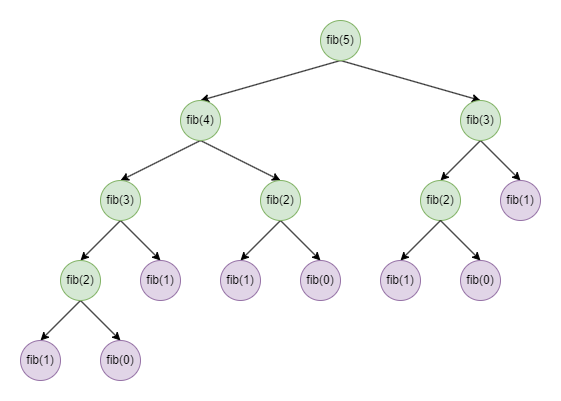
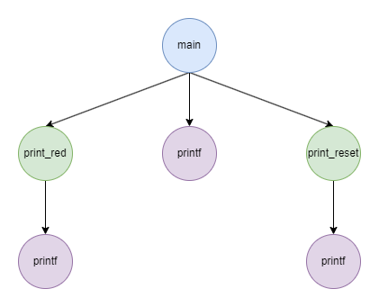
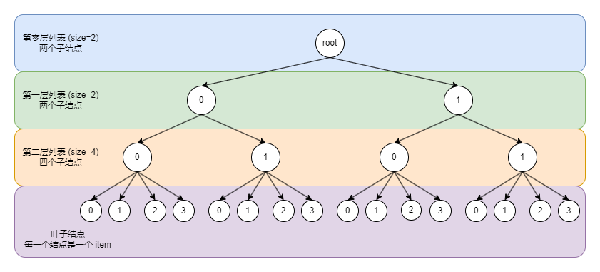

# Python 开发 (一) 实现简单的 JSON 库

[TOC]

---

在上一篇 [博客](https://zhuanlan.zhihu.com/p/2021616017365845301) 中, 笔者详细介绍了 MySQL 中的基础数据类型, 同时补充了大量的背景知识。实际上, 这篇博客更像是计算机基础知识总结。本文以此为基础, 介绍一下如何使用 Python 实现一个简单的 JSON 编码器 和 解析器, 巩固一下这些基础的知识点, 并总结一下对于编程的感悟, 展望未来的人生。下面让我们开始吧 ~

## 一、背景知识

### 1.1 JSON 简介

[JSON](https://en.wikipedia.org/wiki/JSON) 的全称是 JavaScript Object Notation, 最初起源于 JavaScript 语言, 现在已经成为 前后端分离 WEB 框架主流的数据格式了。我们可以将 JSON 理解为数据 **序列化** 常用的文件格式之一。

那么, 什么是 **序列化** ([serialization](https://en.wikipedia.org/wiki/Serialization)) 呢? "序列化" 指的是将 内存中的数据 转换成 可以存储到硬盘中的数据。举例来说, 布尔真值 (`true`) 在内存中一般用 `int8` 类型的 `1` 表示, 那么在硬盘中应该如何表示呢? 常用的方式有两种:

+ 和内存中的表示方式一样, `int8` 类型的 `1`
+ 使用字符串 `true` 表示

两种方式的优缺点是: (1) 使用 `int8` 进行存储, 只需要消耗一个字节的空间, 而使用 字符串 进行存储, 则需要消耗四个字节的空间; (2) 使用 字符串 存储具有 "可读性" (human-readable), 使用 `int8` 存储则不具备。

JSON 文件格式则是将所有的数据都 "序列化" 成 unicode 字符串, 然后再使用 UTF 系列的编码方式编码成 字节流。因此, 我们说 JSON 文件具有 "可读性"。同时, 在解析 JSON 文件时, 我们不需要考虑除 unicode 之外的字符集了, 这大大降低了 JSON 库开发难度。

有的读者可能会对 字符串 和 字节流 的概念会比较困惑。在编程语言中, 我们可以将 字符串 看成有 字符集 标识的 字节流, 也就是说程序知道哪些 字节 在一起构成一个 字符。当然, 字节流 不仅仅局限于 字符串, 图片、音频、视频 等等, 都属于 字节流 的范畴。字节流 的数据一般不参与 运算, 主要用于 存储。两者的用途差别很大, 只是因为 字符串 绕不开 字符编码 的概念, 很多编程模型喜欢将两者放在一起介绍。

一般情况下, 我们认为内存中的数据直接可用, 而硬盘中的数据则不行。因此将 "字符串" 转换成 "字节流" 的过程称为 **编码** (encode), "字节流" 转换成 "字符串" 的过程称为 **解码** (decode)。同理, 我们将内存中的数据 序列化 成 JSON 文档的过程称为 **编码**, JSON 文档反序列化的过程称为 **解码**。

后文为了方便, 统一将 内存数据 "编码" 之后的 JSON 字符串称为 **JSON 文档**, JSON 文档 "编码" 之后的字节流称为 **JSON 文件**。也就是说, 完整的 JSON 序列化操作一共有两步, 本文主要聚焦于第一步。

---

在一个 **JSON 文档** 中, 仅仅包含单个 "元素", 我们称之为 **JSON 元素**。这个 "元素" 一共支持六种数据类型: 数字 (Number), 字符串 (String), 布尔 (Boolean), 空值 (Null), 列表 (Array) 和 映射集合 (Object)。下面, 让我们来看看这六种数据类型。

首先, JSON 中的 数字可以是 普通形式 (`123400`) 或者 科学计数法 (`1.234e5`)。标准版 JSON 是不支持 `nan`, `inf` 和 `-inf` 三种特殊数字的。但是在 扩展版 JSON 中支持, 分别使用 `NaN`, `Infinity` 和 `-Infinity` 字符串表示。

需要注意的是, 理论上说, 字符串可以表示任意大小的数字, 但还是不能超过编程语言的限制。举例来说, 在 JavaScript 中, 数字 只有一种存在方式: 64 位浮点数 (`float64`)。此时, 就会产生一个很经典的问题: 如果你的 ID 是由 [雪花算法](https://en.wikipedia.org/wiki/Snowflake_ID) 生成的, 那么其值大概率会超过 最大安全整数 ($2^{53} - 1$)。此时, 后端传值给前端时必须以 **字符串** 的形式, 不能以 **数字** 的形式, 否则就会产生精度问题。

其次, 字符串 是最常用的类型了。由于 JSON 文档 本身就是字符串, 那么 JSON 文档 中的字符串类型属于是 字符串 中套 字符串, 此时是一个 "两层嵌套" 的关系。**嵌套** 是计算机科学中一个永恒的话题, 后文会专门有一个章节介绍这个思想。JSON 中规定 字符串 必须用 **双引号** 封闭, 此时就涉及到 **转义字符** 的问题: (1) 如果字符串中包含 双引号, 那么需要用 `\"` 两个字符表示; (2) 如果字符串中包含 反斜杠, 那么需要用 `\\` 两个字符表示。这两个字符是 **必须转义** 的, 除此之外还有 控制字符 需要转义, 这个会在后文中详细介绍。

第三, 布尔值 在 JSON 中是独立存在的, 一共有两种: `true` 和 `false`。一般情况下, 在 C 语言中, 会将 整数类型 当作 布尔类型 用; 而在更高级语言中, 布尔类型则是独立出来的。

第四是 空值, 我们用 `null` 表示。这里一定要区分 空值 和 空指针 的概念。"空指针" 这个概念仅仅出现在 C 语言中, 此时的内存地址值为 `0`, 表示 指针不指向任何有效地址。"空值" 则是出现在高级语言中, 比方说 Python 的 `None`, SQL 的 `NULL` 等等, 表示 值不存在。JSON 中的 `null` 含义就是 "值不存在"。

下一个是 列表类型。在一个列表中, 每一个元素都是 **JSON 元素**, 可以是任意的类型, 没有限制。列表由 **中括号** 封闭, 不同的元素之间用 **逗号** 分隔, 和 Python 中的 `list` 对象差不多。如果列表中的元素是列表, 那么构成了 **嵌套** 结构。如果数据有 "同质" 和 "数量相同" 的限制, 那么就构成了 [多维数组](https://zhuanlan.zhihu.com/p/1928479883970974208)。

最后一个是 映射集合。Python 中的 `dict` 类型, Java 中的 `Map` 接口 等等都属于 映射集合 的概念。在 JSON 中, 映射集合被称为 `object`, 原因如下:

映射集合 其实就是 键值对集合。**键值对** 也是编程的基本思想: (1) 编程语言中的 变量名 和 变量值 之间可以看成是 **键值对**; (2) 程序运行的参数、系统环境变量 等等 也是以 **键值对** 的形式存在; (3) 在 OOP 中, 一个对象的 属性 和 属性值 之间也是 **键值对**, 此时 单个对象 就是 一个 映射集合; (4) 数据库中 一条记录 的 字段 和 字段值 也可以看成是 **键值对**, 那么 一条记录 就是一个 映射集合, 一张 数据表 就是一个 由多个映射集合构成的 列表。这就是 ORM 的基本思想。

JSON 标准采用上述的第 (3) 种用法, 即 一个对象 是 一个映射集合, 将 JavaScript 中的 对象 (`object`) 都转换为 映射集合 进行序列化操作。在 JSON 标准中, 映射集合 由 **花括号** (大括号) 封闭, 不同的 **键值对** 用 **逗号** 分隔。同时规定 键值对 中的 "键" (key) 必须是 **字符串**, "值" (value) 可以是任意类型的 **JSON 元素**。当 映射集合 中键值对的 value 是 列表/映射集合 时, 天然地就形成了 **嵌套** 结构。

需要注意的是, 在编程语言中, 变量名称 可以包含 数字, 但是不能以 数字 开头。那么, 在 WEB 开发中, 也不建议让 "键" 字符串以 数字 开头, 否则会出现前端解析错误的情况。

至此, 你应该对 JSON 有一个大致的了解。除了 JSON 之外, XML 也是很常见的前后端数据交换方式, 两者的异同在于: (1) XML 天生就是 树型嵌套结构, 而 JSON 则是依靠 列表 和 映射集合 构成的树型嵌套结构; (2) XML 中没有预设数据类型, 一切皆字符串, 而 JSON 预设了六种数据类型。相较而言, JSON 更适合进行数据传输。

### 1.2 JSON 与 Python

不同语言之间的 数据类型 和 数据结构 相似但不完全相同。既然是 Python 语言的 JSON 库, 那么就需要将 JSON 的数据类型和 Python 数据类型对齐。根据 Python 官方的 `json` 库, 两者之间的映射关系如下:

| JSON 数据类型 | 附加限制 | Python 数据类型 |
| :--: | :--: | :--: |
| 数字类型 | 无小数点 且 非科学计数法 | `int` |
| 数字类型 | 有小数点 或 科学计数法 | `float` |
| 数字类型 (扩展) | 常量 `NaN` | 常量 `float('nan')` |
| 数字类型 (扩展) | 常量 `Infinity` | 常量 `float('inf')` |
| 数字类型 (扩展) | 常量 `-Infinity` | 常量 `float('-inf')` |
| 字符串类型 | | `str` |
| 布尔类型 | 常量 `true` | 常量 `True` |
| 布尔类型 | 常量 `false` | 常量 `False` |
| 空值类型 | 常量 `null` | 常量 `None` |
| 列表类型 | | `list` |
| 映射集合 | | `dict` |

本文的实现也是按照上述映射关系来的。在很多其它语言 (比方说 Java) 中, 会将 映射集合 解析成 对象, 这就需要我们事先定义好 "类" 才可以。不同语言的情况不同, 在设计上述映射表时一定要结合语言本身的特性来处理。

## 二、嵌套关系

在计算机科学中, 嵌套 的概念随处可见。那么, 什么是 **嵌套** ([Nesting](https://en.wikipedia.org/wiki/Nesting_(computing))) 呢? 其和 "套娃" 很像, 即 一个物体 中包含 和其相似的物体。下面是一些经典的例子:

### 2.1 函数调用

递归 (recursion) 指的是在 函数 内部 调用 函数自身, 最经典的例子就是求 [斐波那契数](https://en.wikipedia.org/wiki/Fibonacci_sequence), 下面是示例代码:

$$
F(n)=\left \{
\begin{aligned}
    & 0 && n = 0 \\
    & 1 && n = 1 \\
    & F(n-1) + F(n-2) && n > 1, n \in N
\end{aligned}
\right.
$$

```python
def fib(n: int) -> int:
    assert n >= 0 and n.is_integer()

    if n == 0:
        print("fib(0) = 0")
        return 0
    if n == 1:
        print("fib(1) = 1")
        return 1

    res = fib(n - 1) + fib(n - 2)
    print(f"fib({n}) = fib({n - 1}) + fib({n - 2}) = {res}")
    return res
```

下面是求取 `fib(5) = 5` 的调用树:



很显然, 递归 就是一种 嵌入结构, 即 函数 内部包含 该函数 的调用, 我们可以用如上的 树形结构 表示。此时, 除了 `fib(0)` 和 `fib(1)` 是 叶子结点 外, 其余的都是 非叶子结点。实际的函数返回的顺序和 DFS ([depth-first search](https://en.wikipedia.org/wiki/Depth-first_search)) 的顺序一致, 采用 LIFO (Last In First Out, [stack](https://en.wikipedia.org/wiki/Stack_(abstract_data_type))) 数据结构实现的。上述实现的问题也很明显: 重复计算过多。

更一般地, 非递归的 函数调用 也属于 嵌套结构, 下面是 示例代码 和 示例图:

```C
#include <stdio.h>

void print_red()   { printf("\x1b[31m"); }
void print_reset() { printf("\x1b[0m");  }

int main() {
    print_red();
    printf("Hello World!");
    print_reset();
    return 0;
}
```



很显然, 在上图中, `main` 根结点 是程序的入口函数, `printf` 叶结点 是调用的 C 语言库函数, `print_red` 和 `print_reset` 非叶子结点 是我们自定义的函数。从这里可以看出, 函数内部调用其它函数也是 "嵌套关系", 同时 "树形结构" 可以很好的帮助我们理解 "嵌套关系"。

当你阅读的内容涉及到 编译原理 时, 比方说 SQL 语言的执行计划 等, 都会看到各种 **树** 的概念, 原因就是 函数调用 天生就是一个 嵌套结构, 而 嵌套结构 天生就可以转换成 树形结构。树形结构的特点是: 一个节点只能有一个父节点, 可以有多个子节点。对应在 函数调用 中就是: 函数调用 必须在某一个 函数 内部产生, 不可能由多个 函数 产生; 一个函数内部进行多次其它函数的调用。

树形结构 更高级地就是 DAG (有向无环图), PyTorch 中的计算图 以及 Spark RDD 中的执行计划都属于这个范畴。和树形结构不同的是: 此时一个节点可以有多个父节点。无论是 DAG 还是 Tree, 都不允许有 **环形结构** 的诞生。相关内容后续博客有机会再介绍。

---

上面的内容进一步延申, 就涉及到 编程风格 的问题了。下面是一个具体的例子:

假设我们在清洗数据时, 发现一个异常的记录: `&nbsp;1,2;3,,4,5`, 标准的数据应该是: `1,2,3,4,5`。此时, 我们制定了如下四个步骤的清洗过程: (1) 进行 HTML 字符转义; (2) 去除前后空格; (3) 将 `;` 替换成 `,`; (4) 将多个 `,` 转换成单个 `,`。此时有两种实现方案:

方案一: 嵌套调用 (函数式编程):

```python
import re
import html

codes = "&nbsp;1,2;3,,4,5"

trim = str.strip
replace = str.replace
codes = re.sub(",,+", ",", replace(trim(html.unescape(codes)), ";", ","))
```

方案二: 链式调用 (面向对象编程):

```python
import re
import html
from collections import UserString

codes = "&nbsp;1,2;3,,4,5"

class CustomStr(UserString):
    def re_sub(self, pattern, repl, count = 0, flags = 0):
        return self.__class__(re.sub(pattern, repl, self.data, count, flags))
    
    def html_unescape(self):
        return self.__class__(html.unescape(self.data))

codes = CustomStr(codes).html_unescape().strip().replace(";", ",").re_sub(",,+", ",").data
```

很明显, 第二种 "链式调用" 代码可读性非常高, 直接就能看出数据处理的流程; 而第一种 "嵌套调用" 代码可读性就低很多, 需要仔细地分析。同时, `str.replace` 和 `re.sub` 都属于 子串替换函数, 但是参数的位置并不相同, 这也带来了很大的阅读障碍。从这里可以看出, 即使是简单的流式处理, 如果 "随心所欲" 地写代码, 也可以造成很大的阅读困难。

两种调用方式各有优缺点, 需要结合实际情况进行选择。当然, 你也可以采取多行的方式, 但是这不在讨论范围之内。比较可怕的是: 在 SQL 语言中, 流式数据处理只能按照 方案一 (嵌套调用) 来写。

### 2.2 多维数组

多维数组 就是 任意层嵌套数组, 这个思想在之前的 [博客](https://zhuanlan.zhihu.com/p/1928479883970974208) 中已经详细介绍过了。当我们按照 C order 遍历 多维数组 中的每一个 item 时, 可以构成以下的 树形结构:



在上图中, 一个叶结点表示一个 item, 非叶子结点则是 "虚构" 出来的, 不表示任何一个实体。在上一节中, 每一个结点都代表一次函数调用, 非叶子结点不是 "虚构" 的。从这里可以看出, 不同 "嵌套结构" 之间的树形结构有一定的差距。

在线性代数中, 矩阵 可以看作是 一组行向量, 也可以看作是 一组列向量, 这本身就是两种视角下的 "嵌套关系"。同理, 由于 多维数组 中所有的 item 都是 "同质的", 我们可以使用 `transpose` 函数改变 "嵌套" 的层级顺序, 使用 `reshape` 合并和拆分 "嵌套层级"。

在空间几何中, 点构成线, 线构成面, 面构成体。反过来说, 立体空间 中包含无数个 平面空间, 平面空间 中包含无数个 直线空间, 直线空间 中包含无数个 点空间。这也是一种 "嵌套关系", 和之前的区别在于这里涉及到 "连续" 的概念, 即 直线由连续的点构成, 平面由连续的直线构成等等。如果涉及到 曲线、曲面 等非垂直几何体, 嵌套方式 将变得非常灵活, 研究难度也大大增加。

### 2.3 代码 与 字符串

我们在写代码的过程中, 避免不了需要使用 字符串 类型。但是对于 解析器 来说, 代码本身就是 字符串, 其内部包含 字符串 就构成了 "嵌套关系"。一般情况下, 我们用 双引号 封闭 字符串 数据, 同时 解析器 按行解析代码, 那么我们在 字符串 中如何表示 双引号 和 换行符 呢? 答案是用 "转义字符": 分别使用 `\\`, `\n`, `\"` 表示 单反斜杠, 换行符 和 双引号。

但是事情有这么简单吗? 如果我们使用 正则表达式 呢? 此时构成了双重转义, 也就是三层嵌套。举例来说, 如果我们想用 正则表达式 匹配任意数量的双引号, 写法如下:

```python
re.findall("\\\"+", 'a"""""b')  # 匹配任意数量双引号
re.findall('\\"+',  'a"""""b')  # 与上面等价
re.findall(r'\"+',  'a"""""b')  # 与上面等价
re.findall("\\n+", '\n' * 5)    # 匹配任意数量换行符
re.findall("\\.+", 'a...b')     # 匹配任意数量句号

re.findall(json.loads('"\\\\\\"+"'), 'a"""""b')
```

我们在代码中的写法是 `\\\"+`, Python 解析器会转换成 `\"+` 传递给 正则表达式库, 正则表达式库 会将其转换成成 `"+`。也就是说, 字符串 `"+` 经过 **正则嵌套** 和 **代码嵌套** 后变成了 `\\\"+`。

上述转换是使用 双引号 封闭字符串, 如果使用 单引号 封闭字符串, 我们就不需要转义双引号了, 此时的写法是 `\\"+`, 更加简便。也就是说, 我们在代码中使用正则的方式为: 先只考虑正则的转义字符, 然后在每一个 反斜杠 和 双引号 之前在加上一个 反斜杠 即可。不过加反斜杠的操作会降低 可读性, 于是 Python 中有 raw string: 此时 `'\\"+'` 就可以写成 `r'\"+'`, 非常方便。Python 解析器在解析 raw string 时, 不会进行字符转义, 这样就少一层 转义嵌套 了。不过这样也有缺陷: 我们无法用 raw string 表示某些字符, 比方说 换行符。除此之外, raw string 有一点小 [bug](https://stackoverflow.com/questions/647769/why-cant-pythons-raw-string-literals-end-with-a-single-backslash): 不能以单个反斜杠结尾。至少到 3.14 版本都有这个问题, 希望未来的版本可以修复吧。

如果我们在代码中手写 JSON, 同时 JSON 文档是 正则表达式, 那么会再加上一层嵌套, 我们在代码中的写法是 `"\\\\\\"+"`: Python 解析器 会转换成 `"\\\"+"`, JSON 解析器会转换成 `\"+`, 正则表达式库会转换成 `"+`。

至此, 你应该对 嵌套结构 有一个深入的了解。编程中 嵌套思维 无处不在, 它和 树形结构 之间有非常密切的关系。下面, 让我们来看看 JSON 中 字符串类型 如何 编码 与 解码。

## 三、JSON 字符串类型

通过前文的内容, 我们可以知道, 将 字符串 转换成 JSON 文档 (编码) 有两个步骤: (1) 对 特殊字符 进行转义操作 (字符替换); (2) 在 字符串 前后添加 **双引号**。将 JSON 文档 转换成 字符串 (解码) 也有两个步骤: (1) 对 特殊字符 进行反转义操作 (子串替换); (2) 去掉 字符串 前后的 **双引号**。下面, 让我们来看看如何实现:

### 3.1 字符串基础编码 (encode_string)

unicode 字符集的前 128 个字符和 ASCII 中的字符完全一致。我们先将字符集的范围限定在 ASCII 字符集中。

在 [ASCII 字符集](https://en.wikipedia.org/wiki/ASCII) 中, 第 0 个至第 31 个字符, 以及第 127 个字符属于 **控制字符** (control code); 第 32 个至第 126 个字符属于 **可打印字符** (printable character)。如果我们想用正则表达式匹配 可打印字符, 方式如下: `r"[\ -~]"`。其中, 第 32 个字符是 空格 `r"\ "`, 第 126 个字符是 `r"~"`, 因此正则表达式的含义是匹配码值在 $[32, 126]$ 之间的任意字符。

由于 JSON 文档 本身就是 字符串, 那么 JSON 文档 中的 字符串 属于 **字符串中套字符串**, 此时就需要 **转义** 特殊的标识字符。根据 JSON 标准的定义, 只需要转义将 双引号 (`"`) 和 反斜杠 (`\`) 转义成 (`\"`) 和 (`\\`) 即可。但是, JSON 规范中还额外要求转义第 0 - 31 个控制字符, 并分成两类:

(1) 退格符、制表符、换行符、分页符 和 回车符 分别转义成 `\b`、`\t`、`\n`、`\f` 和 `\r`。其中, 退格符是删除前一个字符; 制表符 和 换行符 非常常用, 这里就不介绍了; 分页符是新增一页, 现在一般只在 `.docx` 文件中有用; 回车符 则是将输入光标移动回当前行第一个字符, 后续的内容会覆盖当前行的内容。

(2) 除了上述 5 个特殊字符外, 其它字符都转义成 `\u` + 四位十六进制形式。举例来说, 第 31 个字符转义成 `\u001f`。

转义控制字符可以避免意外情况的发生, 同时增加 JSON 的可扩展性。举例来说, 在分布式计算中, 大型的 JSON 文件很难拆分, 也就意味着很难对数据进行分组操作。我们一般会使用 [JSONL](https://jsonlines.org/) 文件, 即文件中每一行是一个 JSON 文档。此时, 在进行 数据分组 时, 我们按行分组即可。JSONL 文件成立的前提是我们将 **换行符** 进行了 "转义" 操作。

需要注意的是, 第 127 个控制字符不在转义范围内, 估计是由于 历史原因 造成的, 这里不再深究。根据上述内容, 我们可以构建如下的 转义 字典表:

```python
def build_escape_dict() -> dict[str, str]:
    # key 都是单字符, value 都是双字符
    escape_dict = {
        '\\': '\\\\',  # 反斜杠 (92) -> 反斜杠 + 反斜杠
        '"' : '\\"',   # 双引号 (34) -> 反斜杠 + 双引号
        '\b': '\\b',   # 退格符 (08) -> 反斜杠 + b
        '\t': '\\t',   # 制表符 (09) -> 反斜杠 + t
        '\n': '\\n',   # 换行符 (10) -> 反斜杠 + n
        '\f': '\\f',   # 分页符 (12) -> 反斜杠 + f
        '\r': '\\r',   # 回车符 (13) -> 反斜杠 + r
    }

    for i in range(0x20):  # i 在 [0, 31] 区间内
        # setdefault: 如果 key 值不在 dict 中, 则添加 KV 对, 反之则不添加
        escape_dict.setdefault(chr(i), '\\u{0:04x}'.format(i))
    
    return escape_dict

ESCAPE_DICT = build_escape_dict()
```

在有了上述 转换关系 (`ESCAPE_DICT`) 之后, 我们就可以进行 字符串编码 的开发了。最简单的方式莫过于遍历每一个字符, 下面是示例代码:

```python
def encode_string(str_: str) -> str:
    buffer = []

    buffer.append('"')
    for char_ in str_:
        if char_ in ESCAPE_DICT:
            buffer.append(ESCAPE_DICT[char_])
        else:
            buffer.append(char_)
    buffer.append('"')

    return ''.join(buffer)
```

上述遍历方式常用于 C 语言开发。在 Python 语言中, 上述代码的效率特别低, 一般使用 正则表达式 实现, 下面是示例代码:

```python
import re 

def encode_string(str_: str) -> str:

    def repl_func(match: re.Match) -> str:
        return ESCAPE_DICT[match.group(0)]

    return '"' + re.sub(r'[\x00-\x1f\\"\b\f\n\r\t]', repl_func, str_) + '"'
```

在这里, `r'[\x00-\x1f\\"\b\f\n\r\t]'` 表示匹配所有的转义字符, 匹配到的每一个字符都会调用 `repl_func` 进行替换。

除了上述方案外, 我们还可以用 `str.translate` 方法实现, 不过 `ESCAPE_DICT` 需要重新构建。具体的代码如下:

```python
def build_translate_dict() -> dict[str, str]:
    translate_dict = {
        ord('\\'): r'\\',   # 反斜杠 (92) -> 反斜杠 + 反斜杠
        ord('"' ): r'\"',   # 双引号 (34) -> 反斜杠 + 双引号
        ord('\b'): r'\b',   # 退格符 (08) -> 反斜杠 + b
        ord('\t'): r'\t',   # 制表符 (09) -> 反斜杠 + t
        ord('\n'): r'\n',   # 换行符 (10) -> 反斜杠 + n
        ord('\f'): r'\f',   # 分页符 (12) -> 反斜杠 + f
        ord('\r'): r'\r',   # 回车符 (13) -> 反斜杠 + r
    }

    for i in range(0x20):
        translate_dict.setdefault(i, '\\u{0:04x}'.format(i))
    
    return translate_dict

TRANSLATE_DICT = build_translate_dict()

def encode_string(str_: str) -> str:
    return '"' + str_.translate(TRANSLATE_DICT) + '"'
```

后两种实现方式的执行效率各有千秋, 这里就不做对比了, 真正想效率高还是需要用 C 语言实现。至此, 你应该对 JSON 字符串类型 的编码有一个大致的了解。

### 3.2 字符串进阶编码 (encode_string_ascii)

如果我们需要保证 JSON 文档只能由 ASCII 字符组成, 那么就需要对非 ASCII 字符进行转义。Python 中的 `json.dumps` 函数由 `ensure_ascii` 入参: 当其为 `True` (默认) 时, 就会对非 ASCII 字符进行转义; 当其为 `False` 时, 则不会对非 ASCII 字符转义。上一节介绍的是 `ensure_ascii=False` 的情况, 本节我们来看看 `ensure_ascii=True` 的情况。

当 `ensure_ascii=True` 时, 我们会对所有的非 ASCII 字符进行转义, 包括第 127 位控制字符。最终编码后的字符串只有第 32 至 126 位的可打印字符。此时要分两种情况:

(1) 当字符的码位在 $[127, 65535]$, 我们采取 `\u` + 四位十六进制形式 进行编码。举例来说, 汉字 `合` 的码位是 `21512`, 对应的十六进制是 `5408`, 那么编码后的结果是 `\u5408`。我们可以用 `print(json.dumps('合'))` 验证结果的正确性。

(2) 四位十六进制的数字最大为 $16^4 - 1 = 65535$。那么当字符的码位大于 65535 时应该怎么办呢? JSON 借鉴了 UTF-16 编码的思想:

unicode 最多有 17 个平面, 每一个平面有 65536 个字符, 那么码位最大值为 $17 * 65536 - 1 = 1114111$。基础平面 (BMP) 内的字符用一个 `uint16` 表示即可; 去除掉该平面之后, 还剩 16 个平面, 需要 $\log_2(16 * 65536) = 20$ 个比特来表示一个字符, 也就对应两个 `uint16` 数字。两个 `uint16` 数字一共有 32 个比特, 我们将其中 12 个比特用于标识非 BMP 字符, 20 个比特用于存储码位即可。方案如下:

在 BMP 平面内, 以 `11011` 开头的 2048 个码点 (`55296` 到 `57343` / `0xD800` 到 `0xDFFF`) 被称为 代理数 (surrogates), 它们不表示任何字符, 专门用于扩展平面的编码。扩展平面的字符需要两个 `uint16` 字符, 第一个字符以 `110110` 开头, 第二个字符以 `110111` 开头, 剩下的按照从左到右 (从高位到低位) 填充比特值即可。

举例来说, Hugging Face Emoji (🤗) 的码位是 `129303`, 减去 `65536` 之后是 `63767`, 此时高十位是 `0000111110`, 低十位是 `0100010111`。我们将 `110110` 和高十位组合, 构成第一个数字: $110110,0000111110_{(2)} = 56382 = d83e_{(16)}$; `110111` 和低十位组合, 构成第二个数字: $110111,0100010111_{(2)} = 56599_{(10)} = dd17_{(16)}$。那么, 最终的转义结果是 `\ud83e\udd17`。我们可以用 `print(json.dumps('🤗'))` 验证结果的正确性。

需要注意的是, 这里是借鉴了 UTF-16 的思想, 和 UTF-16 编码没有关联。根据上述内容, 我们可以编写如下的代码:

```python
def encode_string_ascii(str_: str):

    def repl_func(match: re.Match) -> str:
        s = match.group(0)
        try:
            return ESCAPE_DICT[s]
        except KeyError:
            pass 

        n = ord(s)
        if n < 0x10000:  # n < 65536
            return rf'\u{n:04x}'  # 04x 表示 4 位十六进制输出

        n -= 0x10000  # n -= 65536: 此时 n 最多 20 位
        # 保留 n 的高 10 位, 然后将高 6 位赋值为 `110111`
        s1 = 0xd800 | ((n >> 10) & 0x3ff)
        # 保留 n 的低 10 位, 然后将高 6 位赋值为 `110110`
        s2 = 0xdc00 | (n & 0x3ff)
        return rf'\u{s1:04x}\u{s2:04x}'

    return '"' + re.sub(r'([\\"]|[^\ -~])', repl_func, str_) + '"'
```

这里直接使用 正则表达式 实现的。其中, `r'[\\"]'` 表示匹配 反斜杠 `\` 和 双引号; `r'[^\ -~]'` 表示匹配 所有的 非 ASCII 打印字符。那么, `re.sub(r'([\\"]|[^\ -~])', repl_func, str_)` 的含义是: 对于 `str_` 字符串中所有 **非 ASCII 打印字符** 以及 **反斜杠** 和 **双引号**, 使用 `repl_func` 函数进行替换。

`repl_func` 函数的逻辑也很清晰: 如果字符在 `ESCAPE_DICT` 中, 直接替换; 如果字符的码值在 127 到 65535 之间, 使用 `\u` + 四位十六进制数 进行转义; 如果字符的码值大于 65535, 则转义成两个 `\u` + 四位十六进制数 的形式。这里解释一下当码值大于 65535 时代码的含义:

---

在编程语言中, 我们能够操作的最小数据单元是 字节。如果想要改变单个字节中某些 比特位 的值, 就只能用位运算了。根据 位运算法则, 对于 **单个比特位** `b` 来说:

+ 将 `b` 赋值为 0: `b = b & 0`
+ 将 `b` 赋值为 1: `b = b | 1`
+ 不改变 `b` 的值: `b = b & 1`, `b = b | 0`

根据上述结论, 如果我们想将 字节 (整数) 中某些比特位赋值为 `0`, 那么就用 `&` 运算: 需要改变的比特位设为 `0`, 不需要改变的比特位设为 `1`。同理, 如果我们想将 整数 中某些比特位赋值为 `1`, 那么就用 `|` 运算: 需要改变的比特位设为 `1`, 不需要改变的比特位设为 `0`。

现在再来看上述代码。`n -= 0x10000` 等价于 `n -= 65536`, 此时 `n` 最多 20 个比特位。后续的 `s1` 和 `s2` 都可以认定为 `uint16` 整数。`s1 = 0xd800 | ((n >> 10) & 0x3ff)` 的代码解析如下:

(a) `s1 = n >> 10` 表示保留 `n` 的高 10 位, 舍弃低 10 位;

(b) `s1 = s1 & 0x3ff` 中 `0x3ff` 的二进制形式是 `000000,1111111111`, 那么这里的含义是将 `s1` 的高 6 位设置为 `000000`;

(c) `s1 = s1 | 0xd800` 中 `0xd800` 的二进制形式是 `110110,0000000000`, 那么这里的含义是将 `s1` 中的第 12、13、15、16 位设置为 `1`。和上一步在一起, 就是将 `s1` 的高六位设置为 `110110`。

同理, `s2 = 0xdc00 | (n & 0x3ff)` 的代码解析如下:

(a) `s2 = n & 0x3ff` 中 `0x3ff` 的二进制形式是 `000000,1111111111`, 那么这里的含义是将 `s2` 的高 6 位设置为 `000000`, 同时达到保留 `n` 的低 10 位, 舍弃高 10 位的效果。

(b) `s2 = n | 0xdc00` 中 `0xdc00` 的二进制形式是 `110111,0000000000`, 那么这里的含义是将 `s2` 中的第 11、12、13、15、16 位设置为 `1`。和上一步在一起, 达到了将 `s2` 的高六位设置为 `110111`。

位运算主要用于 嵌入式开发 中, 一个 `int32` 可以记录 32 个二元变量的值, 这样大幅度减少应用内存消耗。但是这要求我们对 二进制 和 十六进制 之间的互转非常熟悉, 否则很难理解代码。

---

当然, 上述代码也可以改成 循环 的形式, 或者构建巨大的 `TRANSLATE_DICT`, 然后使用 `str.translate` 方法进行替换。至此, 你应该对 JSON 文档中的 字符串编码 有一个大致的了解。那么, 我们如何进行解码呢?

### 3.3 字符串解码 (decode_string)

在有了上述知识后, 字符串的解码 相对而言比较简单, 大致的思路如下: 对于 JSON 文档来说, 扫描每一个字符, 如果遇到 双引号, 那么后续的内容就是 字符串, 直到遇到下一个 双引号 为止。在扫描双引号中的内容时, 如果遇到 反斜杠 开头的字符, 就进行 "反转义", 其它字符不需要进行任何处理。大致的思路就是这样, 下面让我们来看看代码。

反转义大致可以分为两类: 一类是用 反斜杠 + 字符 构成的, 总共有 7 个, 我们可以构建如下的 `BACKSLASH` 字典:

```python
BACKSLASH = {
    '"': '"', 
    '\\': '\\', 
    '/': '/',   # 有些 json 库会将 正斜杠 进行转义, 因此这里也加上
    'b': '\b', 
    'f': '\f', 
    'n': '\n', 
    'r': '\r', 
    't': '\t',
}
```

另一类是 `\u` + 四位十六进制数字, 我们可以用如下的代码进行解析:

```python
def _decode_uXXXX(json_str: str, cur_pos: int) -> int:
    esc = re.compile(r'[0-9A-Fa-f]{4}').match(json_str, cur_pos)
    if esc is not None:
        try:
            return int(esc.group(), 16)
        except ValueError:
            pass
    msg = "Invalid \\uXXXX escape"
    raise JSONDecodeError(msg, json_str, cur_pos)
```

这里的入参 `json_str` 是 JSON 串, `cur_pos` 表示从第 `cur_pos` 个字符开始解析。`[0-9A-Fa-f]{4}` 表示匹配四个 数字或者 `A` 到 `F` 之间的数字, 不区分大小写。虽然 3.2 节中的代码统一使用的 小写, 但是这里为了保障通用性, 就没有进行区分大小写。

下面是 字符串解码 的核心代码:

```python
def decode_string(json_str: str, cur_pos: int, strict: bool = True) -> tuple[str, int]:
    chunks = []
    begin = cur_pos - 1  # 字符串的起始位置, 用于异常输出的

    while True:
        # 非贪婪模式匹配字符, 直到遇到 双引号, 反斜杠 和 控制字符
        chunk = re.compile(r'(.*?)(["\\\x00-\x1f])', re.DOTALL).match(json_str, cur_pos)
        if chunk is None:
            msg = "Unterminated string starting at"
            raise JSONDecodeError(msg, json_str, begin)

        cur_pos = chunk.end()
        content, terminator = chunk.groups()
        chunks.append(content)  # 如果 '.*?' 没有匹配到内容, 返回 空串, 不会返回 None

        if terminator == '"':  # 字符串结束
            break

        if terminator != '\\':  # 控制字符
            if strict:  # 严格按照 JSON 标准
                msg = f"Invalid control character {repr(terminator)} at"
                raise JSONDecodeError(msg, json_str, cur_pos)
            else:
                chunks.append(terminator)
                continue

        # 转义字符的情况
        try:
            esc = json_str[cur_pos]
        except IndexError:
            msg = "Unterminated string starting at"
            raise JSONDecodeError(msg, json_str, begin) from None

        if esc != 'u':
            try:
                chunks.append(BACKSLASH[esc])
            except KeyError:
                msg = f"Invalid \\escape: {repr(esc)}"
                raise JSONDecodeError(msg, json_str, cur_pos) from None
            cur_pos += 1
            continue

        uni = _decode_uXXXX(json_str, cur_pos + 1)
        cur_pos += 5
        if 0xd800 <= uni <= 0xdbff and json_str[cur_pos:cur_pos + 2] == '\\u':  # 双转义字符
            uni2 = _decode_uXXXX(json_str, cur_pos + 1)
            if 0xdc00 <= uni2 <= 0xdfff:
                uni = 0x10000 + (((uni - 0xd800) << 10) | (uni2 - 0xdc00))
                cur_pos += 6
        chunks.append(chr(uni))

    return ''.join(chunks), cur_pos
```

在全局扫描 `json_str` 时, 如果遇到 双引号, 就会调用上述 `decode_string` 函数, 该大致的逻辑如下:

首先, 在正则表达式 `r'(.*?)(["\\\x00-\x1f])'` 中, `["\\\x00-\x1f]` 表示匹配 双引号, 反斜杠 和 第 0 (`\x00`) 至 31 (`\x1f`) 个控制字符。这里你或许会好奇为什么有三个反斜杠相连。原因如下: (1) 在正则表达式中, "单反斜杠" 必须用 "双反斜杠" 表示; (2) 在 Python 中, `\x` + 两位十六进制码点值、`\u` + 四位十六进制码点值 或者 `\U` + 八位十六进制码点值 表示字符。这里的 `\x00` 表示第 0 个控制字符, 和前面的 "双反斜杠" 在一起构成了 三反斜杠 的情况。如果不用 raw string, 那么就是 六反斜杠 的事情了!

`.*` 表示匹配任意数量的字符, `.*?` 表示非贪婪模式匹配任意数量的字符, 或者说尽可能少地匹配任意数量的字符; 两者和在一起 `.*?["\\\x00-\x1f]` 的含义是: 匹配任意数量的字符, 直到遇到 双引号, 反斜杠 和 控制字符 为止。

入参 `json_str` 是完整的 JSON 串, 入参 `cur_pos` 是 JSON 串中 正在解析的 字符串 第一个字符的位置。我们用 `re.match` 方法, 从第 `cur_pos` 个字符使用上述 正则表达式 扫描 `json_str`, 并对 匹配结果 进行分组: `.*?` 匹配到的 字符串 存储在 `content` 变量中, `["\\\x00-\x1f]` 匹配到的 单字符 存储在 `terminator` 变量中。

`content` 中的字符不需要处理, `terminator` 字符需要分三种情况处理: (1) 如果 `terminator` 是 双引号, 那么表示 字符串 解析终止, `json_str` 中后续的内容不再属于当前字符串。(2) 如果 `terminator` 是 反斜杠, 那么就需要对后续的字符进行转义。(3) 如果 `terminator` 是 控制字符, JSON 标准中是不允许的, 那么就抛出异常。但是从实际角度来说, 这些字符不转义也是没有问题的, 因此我们设置了 `strict` 入参: `True` 则严格按照 JSON 标准来; `False` 则不抛出异常。

当 `terminator` 是反斜杠时, 如果下一个字符是 `u`, 那么则使用 `_decode_uXXXX` 函数解析; 如果下一个字符不是 `u`, 那么则使用 `BACKSLASH` 字典解析。

这里说明一下 双转义字符 的情况: 如果 `uni` 的值在 `0xd800` (`110110,0000000000`) 到 `0xdbff` (`110110,1111111111`) 之间, 说明 `uni` 是 双转义字符 的第一个字符。此时, `uni - 0xd800` 表示保留 `uni` 的低 10 位。同理, 如果 `uni2` 的值在 `0xdc00` (`110111,0000000000`) 到 `0xdfff` (`110111,1111111111`) 之间, 说明 `uni2` 是 双转义字符 的第二个字符。此时, `uni2 - 0xd800` 表示保留 `uni2` 的低 10 位。

那么, `0x10000 + (((uni - 0xd800) << 10) | (uni2 - 0xdc00))` 的含义是: 将 `uni` 的低 10 位 和 `uni2` 的低 10 位拼接起来, 构成 20 比特位 的整数, 最后再加上 `0x10000` (`65536`) 就可以获取到转义之前的码值。最终, 通过 `chr` 函数获取码值对应的 字符。

至此, 你应该能理解 字符串解码 的全过程了。最后补充一下 正则表达式 的相关知识: 我们在 `decode_string` 函数中的正则表达式里使用了 `re.DOTALL` 标识, 其含义是让 `.` 匹配任意字符。默认情况下, `.` 匹配除 **换行符** 以外的任意字符, 使用 `re.DOTALL` 标识后, `.` 匹配内容会包含 **换行符**。

除了 `re.DOTALL` 标识外, `re.MULTILINE` 和 `re.VERBOSE` 也非常出名, 这里简单介绍一下。我们知道, `^` 和 `$` 是匹配字符串的 开头 和 结尾; 使用 `re.MULTILINE` 之后, `^` 和 `$` 匹配的是字符串中 每一行 的 开头 和 结尾。`re.VERBOSE` 则是允许在正则表达式中写注释, 使用 `#` 标识注释的开始, 此时如果需要匹配 空格 和 `#`, 就需要加上 反斜杠 转义。从这里可以看出, JSON 字符串类型的转义字符非常少, 而 正则表达式 的转义字符则相对较多。

## 四、JSON 解析器

在有了上述知识后, 我们来看看如何实现 JSON 解析器。

### 4.1 json.loads 参数含义 (convert_kv_pairs)

JSON 解析器对应 Python 中的 `json.loads` 函数, 一共有 6 个主要参数, 大致可以分为三类:

+ 解析字符串参数: `strict`
+ 解析数字参数: `parse_float`, `parse_int` 和 `parse_constant`
+ 解析映射集合参数: `object_hook`, `object_pairs_hook`

解析字符串的 `strict` 参数在 3.3 节中已经介绍过了, 其作用是 是否允许 控制字符 以 非转义字符 的方式出现, 这里不过多说明了。

解析数字参数是控制数字解析的结果。`parse_float` 和 `parse_int` 的默认效果是 `float` 和 `int` 函数。`parse_constant` 则用于三个扩展常量 `NaN`, `Infinity` 和 `-Infinity` 的解析。如果我们想将所有的数字都解析成 `Decimal` 类, 写法如下:

```python
from decimal import Decimal

constant = {
    "-Infinity": Decimal(float("-inf")), 
    "Infinity": Decimal(float("inf")), 
    "NaN": Decimal(float("nan"))
}

demo_str = '[1, 2.3, NaN]'

json.loads(
    demo_str, parse_int=Decimal, parse_float=Decimal, 
    parse_constant=constant.__getitem__
)
```

`json.loads` 在解析 映射集合 时, 会先转换成 "二元组列表" (`list[tuple[str, Any]]`)。`object_hook` 和 `object_pairs_hook` 两个函数则是控制 "二元组列表" 进一步转换的 回调函数, 大致逻辑如下:

```python
def convert_kv_pairs(
        pairs: list[tuple[str, Any]], 
        object_hook: Callable[[dict[str, Any], ], Any] = None, 
        object_pairs_hook: Callable[[list[tuple[str, Any]], ], Any] = None, 
    ) -> dict:
    
    if object_pairs_hook is not None:  # highest priority
        return object_pairs_hook(pairs)
    if object_hook is not None:
        return object_hook(dict(pairs))
    return dict(pairs)
```

从上面可以看出: (1) 在有 `object_pairs_hook` 函数时, `object_hook` 函数是失效的; (2) `object_pairs_hook` 函数作用于 "二元组列表", 而 `object_hook` 函数作用于 `dict` 对象。

默认情况下, 映射集合中的 key 值是不能重复的。Python 中的 `json` 库默认是不检查 映射集合 中是否有重复的 key。根据 `dict` 的特性, 如果 JSON Object 有多个相同的 key, 那么只会保留最后出现的 value, 其余的都会舍弃。我们可以使用 `object_pairs_hook` 中检查重复 key:

```python
def object_pairs_hook(pairs):
    dict_ = dict(pairs)
    if len(dict_) != len(pairs):
        raise ValueError("repeated keys detected")
    return dict_

demo_str = '{"1": 10, "1": 11}'
print(json.loads(demo_str))
print(json.loads(demo_str, object_pairs_hook=object_pairs_hook))
```

如果你需要将 JSON Object 转换成 Python 对象, 建议使用 `pydantic` 第三方库, 而不是直接使用 `object_hook` 回调函数。`pydantic.BaseModel.model_validate_json` 方法会附带 类型检查, 使用起来更加方便。

### 4.2 解析 JSON 元素 (sacn_once)

下面, 我们来看看如何解析 JSON 元素。通过 1.2 节的内容我们可以知道, 对于 **JSON 元素** 来说, 其可能是 四种类型 (数字、 字符串、 列表 和 映射集合) 或者 六种常量 (`true`, `false`, `null`, `NaN`, `Infinity` 和 `-Infinity`)。他们的判定方式如下:

如果第一个 非空白字符 是 `"` (双引号)、`[` (左中括号) 或者 `{` (左大括号), 那么接下来一定是 字符串、列表 和 映射集合。六个常量的判断更加简单, 直接进行 子串截取 就可以了。数字类型则需要 正则表达式 辅助 进行判断。

下面的 `scan_once` 表示从 JSON 文档 `json_str` 的第 `cur_pos` 位置开始解析 JSON 元素。根据上述思想, 如果 `json_str` 第 `cur_pos` 个字符是 双引号, 左中括号 和 左大括号, 那么我们分别调用 `decode_string`, `parse_json_object` 和 `parse_json_array` 进行解析。`decode_string` 在 3.3 节已经介绍过了, 后两个函数在下一节中介绍。

如果都不是, 则尝试用 正则表达式 解析 数字类型, 这里解释一下 正则表达式 的含义。数字类型 最多有三个部分: 整数部分、小数部分 和 指数部分。

整数部分包含 正负号, 正则表达式为 `(-?(?:0|[1-9][0-9]*))`。其中, `(?:0|[1-9][0-9]*)` 表示 非捕获组 匹配单个零 或者 `[1-9][0-9]*`。很明显, 从这里可以看出, 整数不允许出现 "前缀零", 正数不允许有 `+`, 要求较为苛刻。

小数部分的正则表达式为 `(\.[0-9]+)?`, 即 小数点 后面加至少一位数字。从这里可以看出, `12.` 和 `.34` 都是不允许的, 必须要完整格式: `12.0` 和 `0.34`。小数的 "后缀零" 数量任意。

指数部分的正则表达式为 `([eE][-+]?[0-9]+)?`, 即分隔符 `e` / `E` 后面加上任意整数。指数部分 不允许出现 小数, 这是 科学计数法 的规定。

三个部分对应三个捕获组, 如果使用 `re.Pattern.match` 匹配到结果, 分别存入 `integer`, `frac` 和 `exp` 三个变量中: 当 `frac` 和 `exp` 都是 `None` 时, 就使用 `parse_int` 来解析数字, 反之则用 `parse_float` 来解析数字。如果没有匹配到结果, 那么只剩一种可能性: 当前 **JSON 元素** 是 六个常量。

六个常量的解析非常简单, 直接 子串截取 就可以了。需要注意的是, `parse_constant` 只能用于解析三个特殊浮点数, 不能用于 "自定义常量"。个人认为, 这个参数名称取得不好, 容易产生歧义。如果六个常量都不是, 那么就抛出 `JSONDecodeError` 错误。完整的代码如下:

```python
def scan_once(
        json_str: str, cur_pos: int, strict: bool, 
        parse_int, parse_float, parse_constant, object_hook, object_pairs_hook,
    ) -> tuple[JSON_TYPE, int]:
    try:
        nextchar = json_str[cur_pos]
    except IndexError:
        raise JSONDecodeError("Expecting value", json_str, cur_pos) from None
    
    if nextchar == '"':
        return decode_string(json_str, cur_pos + 1, strict)
    if nextchar == '{':
        return parse_json_object(json_str, cur_pos + 1, strict, parse_int, parse_float, parse_constant, object_hook, object_pairs_hook)
    if nextchar == '[':
        return parse_json_array(json_str, cur_pos + 1, strict, parse_int, parse_float, parse_constant, object_hook, object_pairs_hook)

    match = re.compile(r'(-?(?:0|[1-9][0-9]*))(\.[0-9]+)?([eE][-+]?[0-9]+)?').match(json_str, cur_pos)
    if match is not None:
        integer, frac, exp = match.groups()
        if frac is None and exp is None:
            result = parse_int(integer)
        else:
            result = parse_float(match.group())
        return result, match.end()

    if nextchar == "n" and json_str[cur_pos:cur_pos+4] == "null":
        return None, cur_pos + 4
    if nextchar == "t" and json_str[cur_pos:cur_pos+4] == "true":
        return True, cur_pos + 4
    if nextchar == "f" and json_str[cur_pos:cur_pos+5] == "false":
        return False, cur_pos + 5 
    if nextchar == "N" and json_str[cur_pos:cur_pos+3] == "NaN":
        return parse_constant("NaN"), cur_pos + 3
    if nextchar == "I" and json_str[cur_pos:cur_pos+8] == "Infinity":
        return parse_constant("Infinity"), cur_pos + 8
    if nextchar == "-" and json_str[cur_pos:cur_pos+9] == "-Infinity":
        return parse_constant("-Infinity"), cur_pos + 9
    
    raise JSONDecodeError("Expecting value", json_str, cur_pos)

```

### 4.3 解析列表 (parse_json_array)

下面, 让我们来看看 如何解析 JSON 列表。JSON 列表的样式大致如下: `[value1, value2]`, 里面的每一个元素都是一个 **JSON 元素**。那么, 解析方式很简单: 不断扫描字符串, 并使用 `scan_once` 解析 **JSON 元素**, 如果 "下一个字符" 是 "逗号", 则继续扫描; 如果 "下一个字符" 是 "右中括号", 则返回结果。

由于 JSON 允许 **JSON 元素** 和 分隔符 (双引号, 中括号, 大括号, 逗号, 冒号 等等) 可以包含 任意数量 的 空白字符, 那么我们需要预先定义一个清除空白字符的函数:

```python
def erase_whitespace(json_str: str, cur_pos: int = 0) -> int:
    return re.compile(r'[ \t\n\r]*').match(json_str, cur_pos).end()
```

下面的 `parse_json_array` 就是解析列表的核心函数。根据上一节的 `scan_once` 函数, 我们知道列表的 "左中括号" 已经被消费掉了。此时, `cur_pos` 指向的是 "左中括号" 的下一个字符。那么, `cur_pos` 后的第一个 "非空白字符" 应该是第一个 **JSON 元素** 的第一个字符 或者 "右中括号"。详细的代码如下:

```python
def parse_json_array(
        json_str: str, cur_pos: int, strict: bool, 
        parse_int, parse_float, parse_constant, object_hook, object_pairs_hook
    ) -> tuple[list, int]:

    values = []

    # 判断是否空列表
    cur_pos = erase_whitespace(json_str, cur_pos)  # 清除左中括号之后的空白字符
    nextchar = json_str[cur_pos:cur_pos+1]
    if nextchar == ']':
        return values, cur_pos + 1

    while True:
        # 获取元素值
        value, cur_pos = scan_once(json_str, cur_pos, strict, parse_int, parse_float, parse_constant, object_hook, object_pairs_hook)
        values.append(value)

        # 消费逗号
        cur_pos = erase_whitespace(json_str, cur_pos)  # 清除逗号前的空白字符
        nextchar = json_str[cur_pos:cur_pos+1]
        cur_pos += 1
        if nextchar == ']':  # 特殊情况
            return values, cur_pos

        if nextchar != ',':
            raise JSONDecodeError("Expecting ',' delimiter", json_str, cur_pos - 1)
        cur_pos = erase_whitespace(json_str, cur_pos)  # 清除逗号后的空白字符
```

从上面代码可以看出, 我们在 `parse_json_array` 中调用了 `scan_once` 函数, 而 `scan_once` 中也调用了 `parse_json_array` 函数, 这就构成了 递归调用 的场景。最终构成的 调用树 可以参考 2.1 节。

### 4.4 解析映射集合 (parse_json_object)

下面, 让我们来看看 如何解析 JSON 映射集合。JSON Object 的样式大致如下: `{"key1": value1, "key2": value2}`, 每一个键值对的 key 是字符串, value 是 **JSON 元素**。解析方式和上面差不多, 大致的代码如下:

```python
def parse_json_object(
        json_str: str, cur_pos: int, strict: bool, 
        parse_int, parse_float, parse_constant, object_hook, object_pairs_hook,
    ) -> tuple[dict, int]:

    pairs = []

    def _get_nextchar(excepted, msg):
        nonlocal json_str, cur_pos
        _nextchar = json_str[cur_pos:cur_pos+1]  # 不需要用 try except 封装
        if _nextchar not in excepted:
            raise JSONDecodeError(msg, json_str, cur_pos - 1)
        cur_pos += 1
        return _nextchar

    cur_pos = erase_whitespace(json_str, cur_pos)  # 清除双引号前的空白字符
    nextchar = _get_nextchar('"}', "Expecting property name enclosed in double quotes")
    if nextchar == '}':  # 空 object
        return convert_kv_pairs(pairs, object_hook, object_pairs_hook), cur_pos

    while True:
        key, cur_pos = decode_string(json_str, cur_pos, strict)  # 获取 key (key 限定只能是字符串)

        cur_pos = erase_whitespace(json_str, cur_pos)  # 消费冒号前的空白字符
        _get_nextchar(':', "Expecting ':' delimiter")  # 消费冒号
        cur_pos = erase_whitespace(json_str, cur_pos)  # 消费冒号后的空白字符

        value, cur_pos = scan_once(json_str, cur_pos, strict, parse_int, parse_float, parse_constant, object_hook, object_pairs_hook)  # 获取 value
        pairs.append((key, value))

        cur_pos = erase_whitespace(json_str, cur_pos)  # 消费逗号前的空白字符
        nextchar = _get_nextchar(',}', "Expecting ',' delimiter")  # 消费逗号
        if nextchar == '}':
            return convert_kv_pairs(pairs, object_hook, object_pairs_hook), cur_pos 
        cur_pos = erase_whitespace(json_str, cur_pos)  # 消费逗号后的空白字符

        _get_nextchar('"', "Expecting property name enclosed in double quotes")  # 消费双引号
```

在上述代码中, `_get_nextchar` 是用于消费 分隔符 (双引号、冒号、分号) 的, 同时 key 和 value 是调用 `decode_string` 和 `scan_once` 函数获取的。映射集合的解析结果会调用 `convert_kv_pairs` 函数进行加工。和上一节一样, `parse_json_object` 和 `scan_once` 两个函数之间也是 "互相调用", 存在 递归关系。至此, 你应该对 JSON 解析器有一个大致的了解。

### 4.5 入口函数 (json_loads)

最后, 让我们来看看 入口函数 `json_loads`, 其等价于 `json.loads` 函数, 代码如下:

```python
def json_loads(
        json_str: str, 
        object_hook: Callable[[dict[str, Any], ], Any] = None,  # 转换 json object 
        parse_float: Callable[[str, ], Any] = None,     # 解析浮点数
        parse_int  : Callable[[str, ], Any] = None,     # 解析整数
        parse_constant: Callable[[str, ], Any] = None,  # 解析 inf, -inf 和 nan 三个特殊浮点数
        strict: bool = True,                            # 字符串中的控制字符是否进行转义字符
        object_pairs_hook: Callable[[list[tuple[str, Any]], ], Any] = None,  # 转换 json object 
    ) -> JSON_TYPE:

    parse_float = parse_float or float
    parse_int   = parse_int   or int

    if parse_constant is None:
        parse_constant = {
            '-Infinity': float("-inf"),
            'Infinity' : float("inf"),
            'NaN': float("nan"),
        }.__getitem__

    cur_pos = erase_whitespace(json_str, 0)
    obj, cur_pos = scan_once(json_str, cur_pos, strict, parse_int, parse_float, parse_constant, object_hook, object_pairs_hook)
    cur_pos = erase_whitespace(json_str, cur_pos)

    if cur_pos != len(json_str):
        raise JSONDecodeError("Extra data", json_str, cur_pos)
    
    return obj 
```

从上面可以看出, 一个 JSON 文档 中仅仅包含一个 **JSON 元素**, 因此我们调用一次 `scan_once` 即可。如果是 JSONL 文件, 直接使用 `json_loads` 是会报错的, 应该按行读取, 每一行使用 `json_loads` 函数才是正确的。

本章节的代码是使用 "函数式编程" 实现的, 其有一个致命的问题: `json_loads` 中所有的入参在 `scan_once`, `parse_json_object` 和 `parse_json_array` 中都传递了, 这有一个很严重的问题:

虽然在 函数式编程 中每一个函数之间是 "平级" 的, 不构成 "层级关系", 但是 他们 的入参传递则是按照 "调用树" 构成了相同的层级关系。举例来说, `strict` 参数是 `decode_string` 的参数, 但是每一个使用了 `decode_string` 的函数, 以及处在 "调用树" 上层的函数, 他们的入参都要有 `strict` 入参。`decode_string` 函数有 `strict` 入参并不奇怪, 但是 `parse_json_object` 和 `parse_json_array` 有 `strict` 入参就有一些 "意义不明", 严重降低了代码的 "可读性"。同时, 如果某一个函数突然新增一个参数, 那么 "调用树" 的所有上层函数都要添加该 参数, 工作量也是异常地大。对此不理解的可以参考 2.1 节的内容。

那么, 我们如何将 入参 "平铺" 开来, 解决上述问题呢? 答案是 **面向对象编程** (OOP)。下面的 JSON 编码器就采取 OOP 的编程方式来实现。

## 五、JSON 编码器

### 5.1 json.dumps 入参含义

JSON 编码器对应 `json.dumps` 函数, 其一共有八个参数, 大致可以分成五类:

+ 字符串编码: `ensure_ascii`
+ 数字编码: `allow_nan`
+ 映射集合编码: `skipkeys`, `sort_keys`
+ 映射集合和列表编码: `check_circular`, `indent`, `separators`
+ 类型编码: `default`

`ensure_ascii` 表示字符串是否只用 ASCII 字符集内的字符编码, 相关内容在第三章已经介绍过了。`allow_nan` 表示是否允许对浮点数中的 `nan`, `inf` 和 `-inf` 进行编码。你可以用 `json.dumps(float("nan"), allow_nan=False)` 测试参数效果。

`skipkeys` 和 `sort_keys` 则是针对 映射集合 的。`sort_keys` 的含义是 是否对 `dict` 中的 键值对 (item) 按照 key 进行升序排序, 默认为 `False`。`skipkeys` 的功能描述如下:

在 Python 中, `dict` 的 key 值可以是任意 `Hashable` 的对象: `str`, `bool`, `int`, `float`, `None` 都是可以的。而 JSON Object 的 key 值只能是 字符串。此时, `json` 库的处理方式如下: 如果 `dict` 的 key 是 `bool`, `int`, `float` 或者 `None`, 那么就将其转换成字符串, 否则就 "跳过该键值对" (`skipkeys=True`) 或者 "抛出异常" (`skipkeys=False`, 默认)。具体转换方式可以参考本章后续小节的代码。

Python 中的对象都是引用, 那么 `list` 和 `dict` 对象可以包含其本身。此时 序列化该对象 会产生 "循环引用" 的情况, 我们可以用下面的代码测试:

```python
a = [1, 2, 3, 4, 5]
a.append(a)
print(a)
```

`check_circular` 参数的含义是是否检查 "循环引用" 的情况: `True` 为要检查, 发生时抛出 `ValueError`; `False` 为不检查, 发生时抛出 `RecursionError`, 甚至有可能发生操作系统崩溃, 但是运行效率大打折扣。

`indent` 是在 `list` 和 `dict` 对象的每一个 元素/键值对 之前加上对应层级的 空白字符, 从而提高 JSON 文档的可读性。`separators` 则可以调整 逗号 和 冒号 前后的 空白字符 个数。具体可以参考后续的代码。

`default` 则是一个函数, 如果 序列化的数据类型 不在 1.2 节的表格范畴内, 则会调用 `default` 函数进行转换, 再进行序列化。需要注意的是, `dict` 中的 key 不会用 `default` 函数进行转换, 其由 `skipkeys` 参数控制。

上一节说过了, 我们采取 OOP 的方式实现 JSON 编码器。下面的 `__init__` 函数和 入口函数的代码:

```python
class JSONEncoder:
    def __init__(
            self, *,
            skipkeys: bool = False,  
            ensure_ascii: bool = True, 
            check_circular: bool = True,
            allow_nan: bool = True, 
            indent: int | str | None = None, 
            separators: Tuple[str, str] = None,
            default = None, 
            sort_keys: bool = False
        ):

        self.skipkeys = skipkeys
        if ensure_ascii:
            self.encode_str = encode_string_ascii
        else:
            self.encode_str = encode_string
        if check_circular:
            self.markers = set()
        else:
            self.markers = None 
        self.allow_nan = allow_nan
        if indent is not None and isinstance(indent, int):
            self.indent = " " * indent 
        else:
            self.indent = indent
        if separators is not None:
            self.item_separator, self.key_separator = separators
        else:
            self.item_separator = ', '
            self.key_separator = ': '
        if default is not None:
            self.default = default 
        self.sort_keys = sort_keys

    def encode(self, obj: JSON_TYPE) -> str:  # 入口函数
        return "".join(self.iter_encode_obj(obj))
```

函数式编程的调用方式为 `json_dumps(obj, **params)`, 而 OOP 编程的调用方式为 `JSONEncoder(**params).encode(obj)`。

### 5.2 编码 Python 对象 (iter_encode_obj)

编码器 和 解码器 一样, 需要通过 递归调用 来实现。但是在这里, 我们不使用常规的递归调用, 而是使用迭代器实现递归调用。下面是 编码 Python 对象的核心函数 `iter_encode_obj` 函数。我们详细分析一下代码:

首先, 如果 编码的 Python 对象是 `int`, `float`, `bool` 或者 `None`, 则抛出 `self.encode_sobj` 返回的结果。之所以将 `self.encode_sobj` 函数单独提取出来, 因为在编码 `dict` 的 key 时可能需要使用, 这个在后续小节中讨论。`self.encode_sobj` 的逻辑非常简单, 需要注意的是 `self.encode_float` 函数: IEEE 754 中规定两个 `nan` 之间是不相等的, 但是两个 `inf` 之间是相等的, 对此不了解的读者可以参考之前的 [博客](https://zhuanlan.zhihu.com/p/1893653279222776235)。

其次, 如果 编码的 Python 对象是 `str`, 则调用 `self.encode_str` 函数, 其受入参 `ensure_ascii` 控制, 具体可以参考上一节的 `__init__` 函数。

接着, 如果 编码的 Python 对象是 `list` 或者 `dict`, 那么调用 `self.iter_encode_list` 和 `self.iter_encode_dict` 函数。由于这两个函数也是 迭代器 (`Generator`) 函数, 因此需要使用 `yield from` 关键词, 其可以将 "调用的迭代器" 并入 "当前的迭代器"。如果使用 `yield` 关键词, 那么抛出的就是 迭代器 本身, 此时就会形成 "嵌套迭代器", 并不是我们想要的结果。`self.iter_encode_list` 和 `self.iter_encode_dict` 函数我们在下一小节中介绍。

最后, 如果 编码的 Python 对象不是上述类型, 则调用 `self.default` 函数进行处理。默认情况下, `self.default` 函数会抛出 `TypeError` 错误, 但是可以在 `__init__` 函数中改变其功能。然后再对 `self.default` 函数返回的结果调用 `self.iter_encode_obj` 函数进行编码。因此, `default` 函数返回的结果只要是 1.2 节中的数据类型即可。

`self.mark_obj` 和 `self.unmark_obj` 是用来检测 "循环引用" 的, 相关内容在下一节中介绍。下面是全部代码:

```python
    def iter_encode_obj(self, obj: JSON_TYPE, current_indent_level: int = 0) -> Iterable[str]:
        if isinstance(obj, (int, float, bool)) or obj is None:
            yield self.encode_sobj(obj)
        elif isinstance(obj, str):
            yield self.encode_str(obj)
        elif isinstance(obj, (list, tuple)):
            yield from self.iter_encode_list(obj, current_indent_level)
        elif isinstance(obj, dict):
            yield from self.iter_encode_dict(obj, current_indent_level)
        else:
            self.mark_obj(obj)
            tobj = self.default(obj)
            # TODO: 个人认为, 这里的 tobj 应该加上 JSON_TYPE 类型限制, 不然还是有 无限递归 的可能
            yield from self.iter_encode_obj(tobj, current_indent_level)
            self.unmark_obj(obj)

    def encode_sobj(self, obj: int | float | bool | None) -> str:
        # 编码非集合的对象
        if obj is None:
            return "null"
        if obj is True:
            return 'true'
        if obj is False:
            return 'false'
        if isinstance(obj, int):
            return repr(obj)
        if isinstance(obj, float):
            return self.encode_float(obj)
        raise NotImplementedError

    def encode_float(self, obj: float) -> str:
        if obj != obj:
            text = 'NaN'
        elif obj == float("inf"):
            text = 'Infinity'
        elif obj == float("-inf"):
            text = '-Infinity'
        else:
            return repr(obj)

        if self.allow_nan:
            return text

        raise ValueError("Out of range float values are not JSON compliant: " + repr(obj))
    
    def default(self, obj: object) -> object:
        raise TypeError(f'Object of type {obj.__class__.__name__} is not JSON serializable')
```

### 5.3 编码 Python 列表 (iter_encode_list)

理解了上述代码, 编码 Python 列表的思路也很简单: 对于 列表 中的每一个元素, 调用 `self.iter_encode_obj` 进行编码, 同时抛出必要的 分隔符 (中括号 和 逗号)。在这里, 逗号 由 `self.item_separator` 代替, 这样允许用户在 逗号 前后添加任意数量的 空白字符。个人认为, 该参数作用不大。这里重点说明两个内容:

第一个是 循环引用 的检查。首先, 如果入参 `check_circular` 为 `True`, 那么在 `__init__` 函数中会申明一个 `self.markers` 对象, 其是一个 `set` 对象。在 `self.mark_obj` 方法中, 我们会将 `obj` 的 `id` 值放入 `self.markers` 中, 并检查是否有重复的 `id` 值; 在 `self.unmark_obj` 方法中, 我们会将 `obj` 的 `id` 值从 `self.markers` 中移除。

在 `iter_encode_list` 方法中, 我们将 列表 的 `id` 值先放入 `self.markers` 中, 然后再去迭代每一个元素调用 `iter_encode_obj` 方法。如果 列表 的元素值是其本身, 那么 `iter_encode_obj` 方法会继续调用 `iter_encode_list` 方法, 此时在 `self.mark_obj` 中就会检测到重复的 `id` 值, 从而抛出 `ValueError` 异常。

循环引用 的检查需要额外维护一个 `set` 对象, 当序列化的内容较多时, 还是很吃资源的, 因此设置了 `check_circular` 参数。但是在 解码器 中则没有 循环引用 的问题, 因为 JSON 文档中没有 "引用" 这一概念。

第二个是 `indent` 嵌套层级的生成。在 `__init__` 函数中, 如果 `indent` 是数字, 则会转换成字符串: `' ' * indent`。其生成的逻辑也很简单: 在 抛出 每一个 元素 序列化的结果之前, 先 抛出 `'\n' + self.indent * current_indent_level` 字符串; 最后在 抛出 `]` 之前, 先抛出 `'\n' + self.indent * (current_indent_level - 1)` 即可。其中, `current_indent_level` 在递归中维护, 只有在 `self.iter_encode_list` 和 `self.iter_encode_dict` 两个函数中需要增加 `1`。需要注意的是, 也可以将 `current_indent_level` 作为 `JSONEncoder` 的属性, 但是记得在调用完成 `self.iter_encode_list` 和 `self.iter_encode_dict` 之前需要进行 `current_indent_level -= 1` 的操作。

至此, 你应该对 `iter_encode_list` 有一个大致的了解, 下面是完整的代码:

```python
    def iter_encode_list(self, obj: list, current_indent_level: int) -> Iterable[str]:
        # 处理空数组
        if len(obj) == 0:
            yield '[]'
            return

        self.mark_obj(obj)

        # 抛出第一个元素
        yield '['
        if self.indent is not None:
            current_indent_level += 1
            yield '\n' + self.indent * current_indent_level
        yield from self.iter_encode_obj(obj[0], current_indent_level)

        for value in obj[1:]:
            yield self.item_separator
            if self.indent is not None:
                yield '\n' + self.indent * current_indent_level
            yield from self.iter_encode_obj(value, current_indent_level)
        
        if self.indent is not None:
            yield '\n' + self.indent * (current_indent_level - 1)
        yield ']'

        self.unmark_obj(obj)

    def mark_obj(self, obj):
        if self.markers is None:
            return 
        obj_id = id(obj)
        if obj_id in self.markers:
            raise ValueError("Circular reference detected")
        self.markers.add(obj_id)
    
    def unmark_obj(self, obj):
        if self.markers is not None:
            self.markers.remove(id(obj))
```

### 5.4 编码 Python 映射集合 (iter_encode_dict)

最后是 Python `dict` 对象的编码方式, 原理和上一节的差不多, 这里重点说明两点:

第一点, 在 `iter_encode_list` 方法中, 我们的迭代思路是: 先抛出第一个元素, 然后迭代抛出 逗号 + 元素。不按照 元素 + 逗号 的方式抛出 是因为 最后一个元素后面不能加 逗号。在 `iter_encode_dict` 方法中, 我们的迭代思路是: 设置一个 `is_first` 参数, 每一次循环时判断 `is_first` 的值, 如果是 `False` 则抛出 逗号 + 键值对, 反之则只抛出 键值对。两者的思路是相似的, 但是各有优缺点: 第一种方案会写重复的代码; 第二种方案会增加执行时间。一般建议使用第一种, "完美" 的方案很多时候是没有的, 只能 "折中"。

第二点, 关于 键值对 类型的问题。很明显, 在这里 key 必须是 基础类型, 不能是任意类型, 也不会调用 `default` 方法进行转换。同时, 如果 key 是 数字、布尔 或者 空值, 那么会先用 `self.encode_sobj` 转换成字符串, 再用 `self.encode_str` 进行编码。而在 解码器 中, 对 key 进行 `decode_string` 处理后, 并不会进一步处理, 此时 `json.loads` 和 `json.dumps` 就不具备 可逆性 了, 这一点需要注意。

下面是完整的代码:

```python
    def iter_encode_dict(self, obj: dict, current_indent_level: int) -> Iterable[str]:
        if len(obj) == 0:
            yield "{}"
            return 
        
        self.mark_obj(obj)

        yield '{'
        is_first = True
        current_indent_level += 1

        if self.sort_keys:
            items = sorted(obj.items())  # dict 的 key 值唯一, 因此排序 key 函数不用设置成 operator.itemgetter(1)
        else:
            items = obj.items()  # 插入序

        for key, value in items:
            if not isinstance(key, str):            
                # JSON 中要求 key 必须是字符串, Python 中 dict 的 key 值只要是 Hashable 即可。因此这里进行了扩展: 
                #       (1) 如果 key 值是 int, float, bool 或者 None 对象, 则将他们转换成字符串
                #       (2) 如果不在上述类型中, 当 skipkeys 入参为 True, 则跳过该 KV 元素, 否则则报错
                if isinstance(key, (int, float, bool)) or key is None:
                    key = self.encode_sobj(key)
                elif self.skipkeys:
                    continue
                else:
                    raise TypeError(f'keys must be str, int, float, bool or None, not {key.__class__.__name__}')

            if is_first:
                is_first = False
            else:
                yield self.item_separator

            if self.indent is not None:
                yield '\n' + self.indent * current_indent_level

            yield self.encode_str(key)
            yield self.key_separator
            yield from self.iter_encode_obj(value, current_indent_level)
        
        current_indent_level -= 1
        if self.indent is not None:
            yield '\n' + self.indent * current_indent_level
        yield '}'

        self.unmark_obj(obj)
```

至此, 你应该对 JSON 编码器、解码器 以及 JSON 本身有一个更加深入的了解。

从上面我们可以看出, 面向对象编程 实际上是在解决一个问题: 将 函数式编程 的 "嵌套式" 调用传参改成 "平铺式", 从而更利于代码的阅读和开发。解决多层嵌套结构 的策略之一就是将其 **平铺** 成一维的, 多维数组 和 OOP 都是采用这种策略。

那么 OOP 这么好为什么会被人诟病的。因为其为了 代码复用性 引入了另一个嵌套结构: **继承**。在 Java 中, 一个类只能有一个父类, 那么就构成了 树形结构; 同时一个类可以实现多个接口, 那么就构成了 DAG 结构图。最无语的是: **多态** 特性, 即 对象 的类型不一定是其本身, 也可以是其父类。假设 `Dog` 类的父类是 `Animal`, 那么就可以写 `Animal a1 = new Dog();`。当你调用 `a1` 对象的方法时, 编译器会给你跳转 `Animal` 类的方法, 而非 `Dog` 类的方法。这大大提高了代码的阅读成本!

## 六、三十而立

### 6.1 回顾

怎么说呢? 站在这个时间点, 我觉得是时候回顾一下人生了。我从小到大并没有什么特别有 成就感 的经历, 或者说我在意的事情很少有成功过的:

(1) 小时候玩游戏, 无论是魔塔、口袋妖怪 还是 黄金矿工, 都没有成功过: 魔塔玩到十几层就玩不下去了; 口袋妖怪没有走出常磐森林; 黄金矿工 没有超出 10 关。长大后才知道, 魔塔是要 精打细算 血量的; 常磐森林 的出口是在树下面, 是我自己没有往下走; 黄金矿工第 10 关之后每关需要 2705 元, 钻石关卡玩好就能一直玩下去。上大一时, 我开始玩英雄联盟, 那更是阴影了: 一到团战就不知道自己在做什么, 基本都是靠别人带赢的。虽然我没有那么在意游戏的输赢, 但是看到别人能做好而自己做不好时, 还是很失落的。大二时开始玩 皇室战争, 玩得还行。从那以后, 我基本都是玩一些策略游戏, 比方说 不思议迷宫、月圆之夜、猫神牧场 等等。

(2) 我似乎对声音的敏感程度很低, 甚至说毫无天赋, 无论是 音乐 还是 英语 都不太行。唱歌时我始终只有一个音调, 起初我以为是我 "五音不全", 后来和别人沟通 发现就是 **太平** 了, 毫无起伏。我自己唱时感觉还行, 录下来我自己都不想听。英语的 听力 和 口语 更是噩梦。在大一的英语课上, 老师让我们准备演讲, 我花了很多时间 写稿子 和 背稿子, 查单词的读音, 最终老师给的评价是: 需要认真纠正口音, 很多内容都听不懂。问题是我觉得我的口音还行, 然后录下来自己听, 确实是一团糟。可是别人认真准备就能说出还行的英语, 而我就是不行。听力的情况也差不多, 别人 托福 "精听" 几次就有很大的进步了, 我 "精听" 几十次都不太行。

(3) 上兴趣班的事情可就更惨了。小学时学国画和书法, 印象已经不深了, 隐约记得体感很差。初中时我上了象棋班, 我是班里最大的, 却是下棋水平最差的。老师主要让我们 背棋谱 和 破残局, 可是我依然下不过别人。超出棋谱范围一点点, 我就不知道应该怎么处理了。

(4) 在我印象中, 小学时我数学成绩很一般, 中等偏下吧。倍数约数什么的听到就很头疼, 等式方程那里却意外地很容易理解。刚上初中时, 我第一次数学考试考了五十几分, 没有及格, 全班倒数后五名。当时老师直接找家长了, 妈妈批评我 "有事哭唧唧, 无事赛神仙"。后来我靠着努力考了九十多分, 我妈说老师私底下表扬我 "还是懂得感恩的"。不知道是不是从此时开始, 我对学习产生了 "刷题" 的依赖。高中时, 我化学生物成绩还是不错的 (虽然高考成绩不太理想), 也是靠背和 "刷题" 上去的, 当时觉得没什么挺好的。然而在大二的某一天, 我发现我已经完全忘记了高中时学的化学生物知识, 完全回想不起来, 瞬间有一种 "三年白学" 的感觉。

(5) 我小时候特别的 "敏感"。小学时别人 "碰" 我一下我就想着找机会 "碰" 回去。初中时因为我声音比较尖像女孩子, 一些同学给我起类似 "娘娘腔" 的外号, 我非常不高兴就和别人打起来了。我妈也是很强势的人, 生怕我吃亏了, 就去学校找老师。很耐人寻味的是两个老师的态度。我班主任当着我们俩的面说, 不能随便对人用侮辱性的词语, 社会上很多冲突就是这么产生的。我语文老师对我说, 没事的我去批评他, 不用放在心上; 而对我同学说, 他就是这样一个 "玻璃心" 的人, 你之后就不要和他玩了。在我听别人说了这件事之后, 我开始反思我是否过于 "玻璃心" 了。高中的一堂自习课上, 我放了一声屁, 声音特别大, 全班哄堂大笑, 别人给我起了 "老 P" 的外号, 出于初中的经历, 我就接受了。本来以为这样我可以和同学相处地更好, 结果并没有。我一个高中同学对我的评价是: 像红楼梦中的林黛玉, 太敏感了。后来发现我还是很 "敏感", 大学时和别人玩 "狼人杀", 菜玩不明白就算了, 别人把我投出去我居然还生 "闷气", 现在看起来就很搞笑。大四时学长还对我说: "你太没有幽默感了, 和 xxx 学习一下怎么聊天吧"。当时感觉天都塌下来了, 我就这么不会聊天吗? 现在想想看, 大概是我某些无意的 "敏感" 举动被他们发现了吧。

(6) 这时有人会问, 你就没有什么优点吗? 别人对我的评价最多是: 认真、勤奋、努力 等等。别人对我这么评价多了, 我自己就把他们当作 "人设" 了, 现在想想就很搞笑, 完全是没有优点硬说的。怎么说呢? 个人认为, 决定一个人成败的因素有五个: "心态"、"选择", "天赋", "机遇" 和 "努力"。在这五个因素中, 所有人都能做的是 "努力", 前四个因素反而更重要: "心态" 和 性格、环境 息息相关, 也决定了你是否能够 "努力"。我们都知道 临危不乱、果敢坚决、从容镇定 都是好心态, 可是想改变心态又谈何容易呢? "选择", "天赋", "机遇" 这些就更不用说了。现在如果有人对我说: "机会是给有准备的人", 我会说: "如果我没有准备好, 那么对我来说这就不是机遇"。世界就是一个巨大的草台班子, 哪有那么多人准备好了。你可以说, "努力的人不一定成功, 但是不努力的人一定不会成功", 但是 "机会是给有准备的人" 实在无法苟同。

### 6.2 现状

上面这些让我在大学毕业之后就停止往前走。一切变化还要从 2022 年底和 2023 年初开始, 我为了改变现状而做了一些改变, 目前来看这些改变还是比较成功的, 虽然很多时候是被 "事情" 推着走, 但是目前来看还算不错。对我改变最大的事情是: 开始写博客。最近刷到一个 B 站说创作的 [视频](https://www.bilibili.com/video/BV17pXPBBEPm/), 感触很深。创作 是一个和自己对话的过程, 是一种重新找回自己 的方式。也正是在写博客的过程中, 让我正视自己的问题, 想通了很多道理, 这里简单分享一下。

(1) 在学习的过程中, 我会得到 N 个结论。这些结论并不一定正确, 但是有自己的逻辑链。在学习完成之后, 我可能会意识到某些结论是错误的, 但是无法重新梳理学习过程中的逻辑链, 或者忘记了逻辑链的某一个环节, 从而对知识本身产生疑问。在写博客之后, 我会强制梳理自己的逻辑链, 并记录下来。如果发现有错误的地方, 重新阅读一遍博客, 修改一下内容就可以重新理一遍逻辑链了。

(2) 人的记忆是有限的, 很多内容长时间不看就会忘记, 这是谁都无法避免的事实。如果我没有写 [分词算法](https://zhuanlan.zhihu.com/p/664717335) 和 [旋转式位置编码](https://zhuanlan.zhihu.com/p/662790439) 这两个内容, 估计早就忘得一干二净了。同时, 写博客也给学习提供了 "暂停" 的选项。

(3) 我的基础真的很差, 之前很多 "努力" 由于方向不对都是 "白努力"。本来想学习 大模型量化 的知识, 结果产出了 [数字系统](https://zhuanlan.zhihu.com/p/1893653279222776235) 的博客; 本来想学习 FlashAttention 的知识, 结果产出了 [GPU](https://zhuanlan.zhihu.com/p/686772546) 介绍的博客。虽然有些 "本末倒置", 但是真的让我 "正视" 自己的不足。举例来说, 我之前一直想不通为什么 $0.999\cdots = 1$, 后来发现是我不理解什么是 "小数", 其英文是 decimal fraction, 直译为 "十进制分数"。理解这些基础的内容, 配合极限的概念, $0.999\cdots = 1$ 就很容易理解了。

(4) 我之前是一个极其喜欢 "重头开始"、"重新出发" 的人, 但是现在我发现人是不可能完全 "重新出发", 必须要基于之前的人生经历 "再出发"。我们学习任何一个东西都必须要有一定的基础, 或者说基于一定的知识储备去学。以前我不明白 "站在巨人肩膀上" 的含义, 现在知道了, 学习必须 "站在巨人肩膀上", 科研也必须 "站在巨人肩膀上"。举例来说, 在学 编译原理 时有想过从零开始写一个编译器, 可是什么是 "从零开始" 呢? 最初的编译器可能是从 "打孔编程" 开始的, 然后用已有的编译器去写新的编译器, 实现 "自举"。现代编译器大致的开发流程: 只开发前端, 后端采用 gcc/llvm, 否则你需要适配每一种硬件设备。前端的开发流程: 先选取一种语言 (C/C++/Java/Python) 编写一个初代编译器, 然后不断完善程序直到可以实现 "自举" 为止, 最终通过 "自举" 的方式迭代更新。目前 Java, Rust 等语言已经实现了 "自举", 而像 Python 语言完全放弃了 "自举", 和 C 语言高度绑定。也正是因为此, Python 是非常优秀的 C 语言前端语言。回到最初的问题上, 这和你初心的 "从零开始" 一样吗? 额外说一句, 虽然我们常说 "保持初心", 但是如果 "初心" 非常幼稚且不切实际, 那么尽快放弃吧。

(5) 一般情况下, 完美主义者有两种: 一种是力求事情做到完美, 不断去追寻完美; 另一种是要求事物必须完美, 遇到不完美的东西就敬而远之。很明显, 这个世界上完美的东西几乎不存在, 前者可能可以干出一番大事业, 后者一定是碌碌无为的。我之前一直是属于后者, 在写博客时意识到这一问题, 慢慢放下对 完美 的追求, 放弃此执念。世界本身就是大型的草台班子, 如果因为不完美而放弃创作, 那么又能干出什么事情呢? 举例来说, 在大学时, 当我想学 Python Web 时, 在网上搜索语言的优缺点。当时正值 Python 2 和 Python 3 版本交替的时期, 又看到很多人说 Python 有 GIL 锁, 无法实现真正的并发, 感觉他不是很完美, 就一直搁置没有去学习。然而, 我的同学没有管这些, 一个暑假学习并开发了一套学生管理系统, 后来在全校推广使用。我问他是如何处理 GIL 锁的问题, 他说那是什么, 完全没有用到。现在想想看, 你可以去 对比 不同的 产品 和 技术路线, 但一定是各有优缺点, 你不能因为都不完美而放弃做这件事, 那么最终一定是一事无成。

从另一种角度来说, 人本身就不是 "完美" 的, 有着各种缺陷: 精力是有限的, 健忘, 只能看见二维平面空间和感受三维立体空间, 身体器官之间的不合理性 等等。既然自身本就不 "完美", 何必要求事事 "完美" 呢。我们可以去追求完美, 力求完美, 但不能要求完美, 这一点非常重要!

(6) 不知道是否从初中学习平面几何开始, 我对于 "逻辑" 有一定的 "执念", 认为凭借几条 公理 就可以推出全世界。这是极其不现实的想法, 以我目前的认知, 会将逻辑分为以下五类: 定义逻辑、概率逻辑、观察逻辑、人为逻辑 和 时间逻辑。

定义逻辑就不用说了, 在上面 $0.999\cdots = 1$ 的例子中就是不知道 "小数" 定义造成的。额外说明一点, 这其实很正常, 在小学时如果让老师教什么是 "小数", 学生自然是听不懂的。个人认为, 将这个问题抛给小学生也是极其不负责任的表现。定义逻辑可以进行大量的推理, 这是非常严谨的逻辑。但是除此之外, 还有不那么严谨的逻辑, 他们也非常重要。

概率逻辑是我们最常用的逻辑了。在我们生活中, 如果连续遇到三个不讲文明的 A 城市人, 那么就会说 A 城市人都不讲文明。虽然感官上这种做法很不好, 但确实是社会运行的基本逻辑之一。举例来说, 如果 B 类爱好者 20% 都患有某种疾病, 那么你会不会远离 B 类爱好者? 你是 B 类爱好者, 没有疾病, 然后大声呼吁: 不要歧视 B 类爱好者, 不是所有的人都患有疾病。路人最多能做到从 "谩骂你" 到 "忽略你", 你还能指望 "接受你" 吗? 当然这是夸张手法, 现实中一般几率更低、危害更低, 同时 "成见大山" 更高。更有甚者, 会因为几条新闻而产生巨大的成见。但是你不能说谁做错了什么, 因为每一个都是在 "保护" 自己。

在科研中这种逻辑也非常常见。比方说数据科学中的 "啤酒与尿不湿" 就是一个经典例子, 两者看起来毫无关联, 但是就是会被很多客户一起购买。当然我们可以深层次的分析当地的文化习俗, 探寻背后真正的原因。但是对于推荐算法来说, 知道两者间有重叠客户就已经足够了。在医学领域, 这种逻辑就更常见了。你以为分析药理都是靠观察细胞吗? 错, 那只是前期的一小部分, 更多地是做 临床实验, 多名患者服用后没有异常症状才会允许上市。人身体是一个极其复杂的系统, 我们不可能分析完 药物质 在不同情况下对于各种细胞的影响, 这是 天文数字 级别的工作量。因此只能依赖于 概率逻辑 的实验, 即便如此一款新药研发也需要数十年之久。在很多工程领域, 我们也无法分析完各种因素的影响, 有时候 "经验公式" 就是比 "理论公式" 好用很多, 而 "经验公式" 也是人类基于大量实验试出来的 "概率逻辑"。因此, "概率逻辑" 真的非常重要!

观察逻辑 也是很常见的逻辑, 上面所说的 "经验公式" 也可以归为此类。这里举两个更加直接的例子: 在之前的 [博客](https://zhuanlan.zhihu.com/p/1893653279222776235) 中, 我介绍过了负数乘法 "负负得正" 的原因, 利用的是 "乘法交换律" 这一规则。可是为什么乘法满足 "交换律" 呢? 加法是明显满足交换律的, 这在正整数的 定义 中就能够体现出来。除此之外, 绝大部分运算都不满足交换律, 减法、除法、乘方、矩阵乘法 等等。可以为什么偏偏数字乘法就满足呢? 如果你在网络上搜索, 一般会出现两种结果: 一种是 皮亚诺公理 + 数学归纳法; 另一种是 借用面积公式来说明。前者是 定义逻辑, 虽然严谨性很高, 但是已经在说另一个故事了; 后者是 观察逻辑, 但是引入了 面积定义, 也是另一个故事。这里给出我认为最直观的理解:

$$
a \times b = \sum_{i=1}^{a} \sum_{i=1}^{b} 1 = \sum_{i=1}^{b} \sum_{i=1}^{a} 1 = b \times a
$$

我们可以将 整数乘法 看成是 若干个 $1$ 相加。根据 加法交换律 可以知道, 加法的先后顺序不重要, 那么 $\sum_{i=1}^{a} \sum_{i=1}^{b} 1$ 和 $\sum_{i=1}^{b} \sum_{i=1}^{a} 1$ 肯定是相等的, 从而推导出 乘法交换律。那么为什么 整数乘方 不满足 交换律呢? 因为你无法乘法拆成若干个 $1$ 相乘, $a^b = \prod_{i=1}^{b} a$, 无法继续拆分。

其实仔细想想, 皮亚诺公理 和 面积公式 也是使用了相同的思路, 就看你能够接受哪一个版本的故事了。在现实中, 更多情况是: 初学时 老师说记住, 需要其它知识来帮助理解, 以后老师会说明的。这确实没错, 但是结局是: 我们记住了结论, 却忘记了找老师要理解思路。很多时候, 严谨的证明更多是告诉我们这套系统没有错误, 可以放心大胆地使用。它们往往会脱离现有的 "故事" 而引入一套新的 "故事", 而新的故事往往并不是我们想要听到的。

你还记得 "面积" 的逻辑体系吗? 下面我们来回顾一下。

直线图形的逻辑链: (1) 我们定义: 边长为 1 的正方形面积是 1; (2) 通过 "数砖块" 的方式定义长方形的面积公式; (3) 通过 "分割法" 定义梯形的面积公式; (4) 通过 "一个梯形由两个三角形构成" 定义三角形的面积公式。

圆形的逻辑链是什么呢? (1) 定义圆形: 平面内到定点距离相同的点构成的曲线; (2) 观察发现, 所有的圆形都是 "相似图形", 同时 **周长** 和 **直径** 的比值为定值, 我们将这个定值称为 $\pi$, 那么圆的周长公式为 $C = 2 \pi r$; (3) 根据 周长公式 + 分割法 + 极限思想证明: 圆的面积公式为 $S = \pi r^2$。

整套逻辑都是 "观察逻辑", 符合我们基本的认知, 或者说在我们已知的 "框架" 内探索。如果你需要 "严谨证明", 建议找几何学权威书籍来看 (比方说 几何原本), 网络上很多证明都会陷入 "循环证明" 的逻辑中, 非常可怕。

(7) 除了对 "逻辑" 有 "执念", 我对 "原理" 有更加中二的执念, 认为 完成 "原理" 学习之后就可以理解全世界了。高中时学习 "化学反应原理" 之前, 我以为能够接触到事物的本质, 后来发现和我想象中的并不一样, 就很失望。当然, 现在这些内容已经全部还给老师了, 只记得 "人教版选修四"。后来在学 "计算机组成原理" 之前我就没抱有很大期望, 学习后发现果然又引入一大堆不相关的概念。现在明白了, 所谓的 "原理", 就是另一个视角之下的故事, 或者是对一些现象的概括总结。

实际上, 知识是分层次的, 这一点非常重要。为什么我们会说现在是信息大爆炸的时代, 因为各个层级的知识太多了, 每一个层级都有自己的背景知识, 很多层级之间还不互通。举例来说, 牛顿力学 和 量子力学 属于不同层级 (宏观 和 微观), 且两者间无法统一。这个问题在 计算机体系 中就更常见了, 无论是 CPU、操作系统、应用程序 等等都分 前后端, 前端是给上层用户使用的, 后端才是真实运行的逻辑。前端用户的逻辑 和 后端开发人员的逻辑 完全不同! 一般情况下, 如果知识内容跨越两个层级, 我们就可以称为是 "原理"。

(8) 在 RLHF 中, 我们强调模型需要和人类社会 "对齐"。可是换个角度来说, 人类 也需要和 社会 "对齐"。无论你是什么性格, 永远都不能忘记: 人类是群居动物! 即使你喜欢独处, 那么独处时干什么呢? 玩游戏、看书、看电影 等等, 无论哪一项, 你都需要和社会 "对齐"。如果你不与社会 "对齐", 那么你会看不懂书籍和电影, 不知道他在说什么。举例来说, 我们一般认为 "楚王问鼎" 是 "篡夺政权" 的意思, 你读了这个典故后认为楚王不一定想 "篡夺政权", 仅仅是 "外交示威以保全自身"。你和别人分享了, 别人会称赞你 想法新奇, 非常有主见。然后呢? 就没有然后了, 他们依然会用 "楚王问鼎" 来代指 "篡夺政权"。即使有一天发现了更可靠的史书说明 "楚王问鼎" 不是为了 "篡夺政权", 人们大概率还是不会改变用法。所以呢, 你自己读书产生 "楚王问鼎" 的见解, 很可能并不适用于其它语境, 那么你就看不懂别人写的内容。看电影也是同理的。

此时, 你可能会产生疑问, 不是说 "一千个人眼里有一千个哈姆雷特" 吗? 没错, 是这样的, 但这仅仅是 "程度" 上的不同。举例来说, 一个 "伤感" 的故事, 不同人听 "伤感程序" 会不同。有人会认为, 这有什么值得 "伤感" 的吗, 有一些 "矫情" 了吗; 有人会觉得 "无感"; 有人会认为, 这确实很 "伤感"; 还有一些人认为, 这 "伤感" 到不能再 "伤感" 了, 简直是 "刻骨铭心" 的感情呀。也就是说, 大家统一的方向是 "伤感", 只是程度不同。如果你不觉得 "伤感", 反而觉得是 "欢快" 的故事, 那么就是你完全没有与社会 "对齐", 别人会认为你 "非疯即傻"。

自然语言 是有固定缺陷的, 它很难准确地表达出程度。我们常用的 "程度副词" 有: 绝对, 绝大多数, 大多数, 一般, 少数, 极少数 等等。但是究竟是什么样的 "程度", 很多时候需要我们用一生去理解, 没有对错之分。

有一个非常经典的悖论: "世界上没有绝对的事情" 和 "这句话本身就是绝对陈述"。这个悖论产生的原因是: 说话者将自身排除在规则之外。很多人会得出结论: 不要轻易说 "绝对" 的事情。但是现在我对这句话有不一样的理解: 世界上确实没有绝对的事情, 但是有绝对的陈述, 这来源于自然语言的固有缺陷。你可能会对 极度自卑 的人说: "你需要有自信, 有自信就一定能成功"。但是我们知道过于 自信 就是 自负, 它是很多人失败的原因。但是你能和 极度自卑 的人说 自负 吗? 你告诉他: "你需要再自信一点, 但也不能太自信, 太自信会变成自负, 也是不行的哦", 那他估计永远也不会迈出那一步。除此之外, 谈判时表明立场、传达思想 等等场合都需要用到 "绝对陈述", 你来一句 "绝大多数" 那就没有人睬你了。

你可能还会有一个疑问, 不是说我们要 "独立思考", 有自己的想法, 去追求自由吗? 这些更需要你与社会 "对齐" 了。举例来说, 你不想让人做某一件事, 最根本的办法就是不要让他知道这件事情的存在。在上高中时, 很多人和我说, 要有自己的 职业规划 和 人生规划, 现在看起来纯属搞笑。你们有开设课程向高中生们系统地介绍职业吗? 有让他们尝试不同的职业吗? 有告诉他们不同职业所要面临的困难吗? 别说高中了, 大学都做不到, 整天就想着科研。什么是兴趣, 兴趣是在你知道一个行业有多黑暗之后依然愿意从事该行业。很多人在第一份职业之前都没有职业规划的, 高中生最多说出: 我想当老师/医生; 我想从事数学/物理/化学等科研活动; 我想唱歌跳舞当明星; 我想出国留学; 我想开发游戏 这些内容。因为这是他们能够接触到的事物。"独立思考" 和 "追求自由" 都是有一定基础认知的, 你都不知道谈什么思考和自由呢?

(9) 书看不懂, 往往有两方面的原因: 一是有些书确实不说人话, 这里点名批评 数据库系统 的内容, 居然完全背离其 实现原理 开创了一个套新的 "故事", 实现太坑了; 另一方面是很多知识都是环环相扣的, 很难说清楚一个知识点再说另一个知识点, 这是我在写博客时发现的。我之前看不懂书, 个人认为主要有以下一些原因:

首先, 我们很多时候为了方便沟通交流, 会发明很多新的名词。同时在同一知识体系中的不同模块, 一个词语的含义也会不相同。这一点在 计算机领域 中尤其严重, 比方说, 堆 (heap) 在 进程中是 `malloc` 函数分配的内存空间, 而在 数据结构 中指 完全二叉树。同时, 一个概念可能有多种描述方式, 比方说 **组** 的英文单词可以是 group, tile, bucket, batch, block, cluster, partition, segment 等等, 简直了! 我之前倾向于将不同知识体系下的同一名字关联起来, 结果应该关联起来的没有关联起来, 不应该关联起来的反而关联起来了, 这也太致命了!

其次, 我的语文真的很烂。初高中学语文, 老师基本都在教 古诗文, 然后让背古诗文中 "字" 的翻译。为什么这样呢? 因为语文考试会考这些内容, 虽然仅仅是一道 10 分不到的题, 但这也是老师们唯一能教的了。其它内容, 比方说 小说阅读、散文阅读、写作等等内容, 都是需要大量积累的。老师们也就随便教教, 剩下全看天赋了。也正是因为此, 小时候我读的内容特别少, 阅读能力强才奇怪呢。现在想一想, 我英语学不好, 很可能是因为我语文不好!

由于我不喜欢读书, 让我对 听课 和 刷题 产生了严重的依赖, 而大学课程的质量肯定是不如初高中的, 同时很多老师讲知识点之前并没有 prerequisite。配合上我众多的缺点, 最终就是什么都做不好。现在, 在我写博客之后, 这些事情都缓和很多了。

### 6.3 未来

如果你认真阅读完上面的内容, 应该会发现我太过于 "较真了", 同时悟性极差, 是那种需要大白话才能教会的那种人。我上面写的很多内容都是在和自己和解。很多时候我在想为什么, 实际上并没有那么多为什么。以前我会认为, 观察 和 概率 这种都不能被称为 "逻辑", 现在感觉它们就是最直观的 "逻辑"。有些电影的底层代码是 穿越后就可以改变过去, 可是我非要纠结为什么穿越能改变过去。这不是纯傻吗? 电影的核心是穿越能否改变过去吗? 肯定不是, 它的核心是人物之间的故事、是导演所要传递的思想, 这些才是重点好吗! 前面也说过了, 历史的真相并不一定重要, 重要的是人们怎么使用它, 传递什么样的想法。小时候大人只告诉我不要 "一根筋", 但是没有告诉我为什么不要 "一根筋"。如果我的孩子也非常 "一根筋", 那么我会和它 "较真" 到底, 然后告诉他: 你 "较真" 的事情毫无意义!

每一个人在成长的过程中, 都会被一两句话刻上牢固的印记, 成为你一生的 执念。很可能当他长大了, 忘记了原话是什么, 但是执念依旧在继续。如果你能化解这些执念, 那么终将找到属于自己的路。对于我来说, 最大的问题是: 执念太多, 化解时间太长了。目前, 这些执念化解的差不多了, 未来应该走向何方, 我也不清楚。我清楚的是, 我比以前更喜欢探索这个世界了, 有更多想要学习的内容。在接下来的十年, 甚至二十年里, 我还会继续坚持写博客吗? 如果我继续写的话, 十年之后, 应该也会有一篇类似的文章! 希望大家都能早日化解自己的执念!
