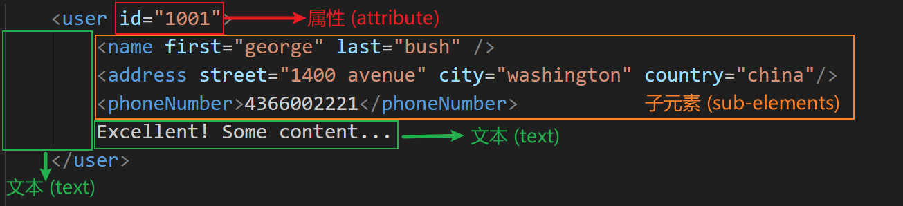
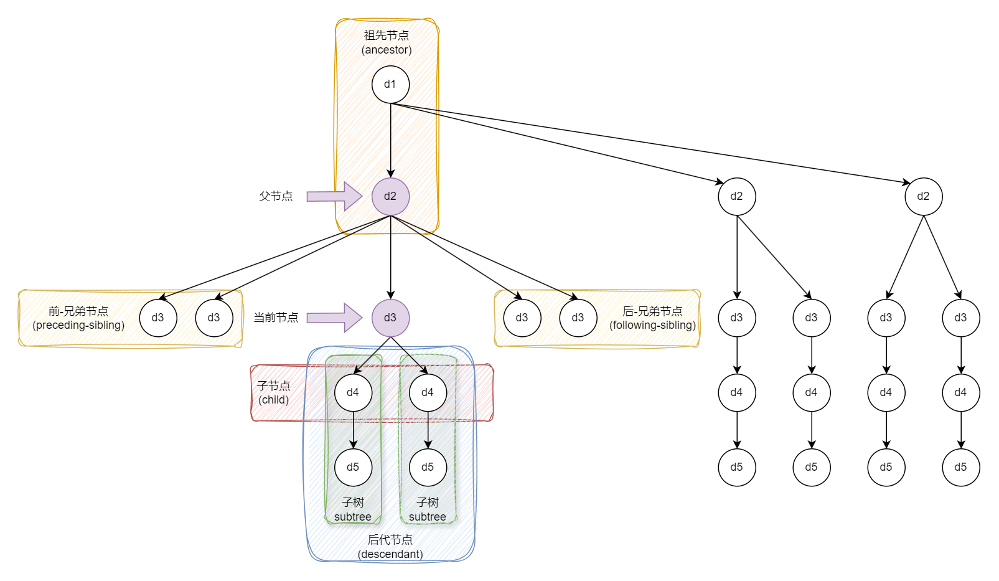
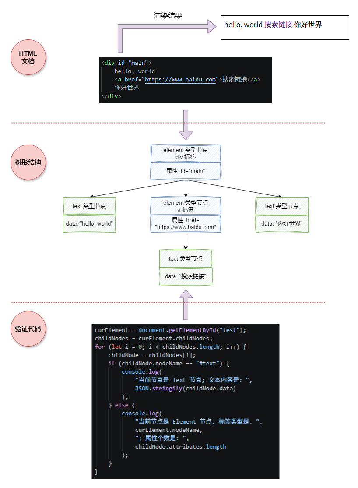
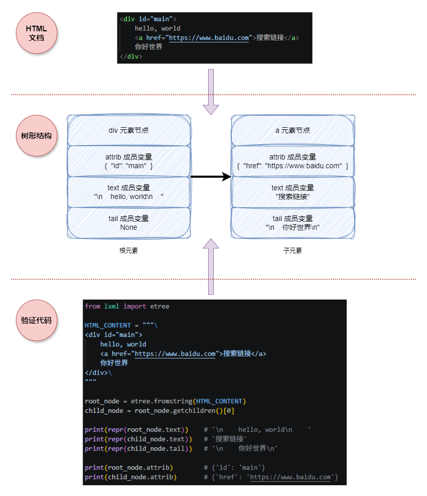

# SQL 系列 (二) XML 和 JSON 数据类型

[TOC]

---

在之前的 [博客](https://zhuanlan.zhihu.com/p/2021616017365845301) 中, 我详细地介绍了三种基础的数据类型: 数值、字符串 和 日期时间。几乎所有支持 SQL 的 软件/框架 都可以使用这些类型。除此之外, 不同的数据库还支持一些特定的数据类型。比方说, MySQL 还支持 JSON 数据类型, 并提供了 XML 文档的操作函数。

本文基于上一篇关于 JSON 库实现的 [博客](https://zhuanlan.zhihu.com/p/2024258311281713893), 来探究一下 XML 和 JSON 相关的内容, 主要包括: **XML 简介**、**XPath 简介**、**JSONPath 简介**、**JSON Schema 简介** 以及 **MySQL 对于 XML 和 JSON 文档的支持** 等五个部分的内容。通过了解学习这些内容, 可以进一步感受 "嵌套" 和 "树形结构" 的强大魅力。下面让我们开始吧 ~

## 一、XML 背景知识

### 1.1 XML 简介

在计算机领域, XML (Extensible Markup Language) 是非常经典的文本格式, 常用于 配置文件 和 UI 开发。我们使用的 `.html`, `.xlsx`, `.pptx`, `.docx`, `.drawio` 等文件都可以看作是 `.xml` 文件的扩展。和 JSON 文件不同的是, XML 文件天生就采用 "嵌套结构" 来构建文档内容, 同时取消了 "数据类型" 的概念, 所有数据都是以 "字符串" 的形式存在的。下面是 XML 的示例文档:

```XML
<users>
    <user id="1001">
        <name first="george" last="bush" />
        <address street="1400 avenue" city="hefei" country="china"/>
        <phoneNumber>4366002</phoneNumber>
    </user>
    <user id="10002">
        <name first="aron" last="wars" />
        <address street="10  street" city="newwork" country="au"/>
        <phoneNumber>3208965</phoneNumber>
    </user>
    <user id="10003">
        <name first="tz" last="zl" />
        <address street="14 tl street" city="newwork" country="jp"/>
        <phoneNumber>2214964</phoneNumber>
    </user>
</users>
```

在上面的示例文档中, `users` 是 根元素, 其内部包含多个 `user` 子元素。每一个 `user` 元素有包含 `name`, `address` 和 `phoneNumber` 三个子元素。`name` 元素包含有 `first` (名字) 和 `last` (姓氏) 两个属性值; `address` 元素包含有 `street`, `city` 和 `country` 三个属性值; `phoneNumber` 则只有电话号码作为文本内容。

下面介绍一下 XML 中的名词: 在 XML 中, 一个 **元素** (element) 由 **标签** (tag) 和 **内容** (context) 两部分组成。**标签** 由 **名称** 和 **属性** (attribute) 组成; **内容** 由 **文本** (text) 和 **子元素** 组成。下图展示了第一个 `user` 元素的 **属性**, **子元素** 和 **文本** 部分:



从上图我们可以看出, 对于第一个 `user` 元素来说: (1) `id="1001"` 是它的一个属性 (attribute); (2) `name`, `address` 和 `phoneNumber` 是它的子元素 (sub-element); (3) `Excellent! Some Content...` 是它的文本 (text)。

我们知道, "子元素" 就对应着 "嵌套" 结构, 而 "嵌套" 结构又对应着 "树状结构"。同时, 在一个 XML 文档中只能有一个根元素, 那么就意味着一个 XML 文档对应一个 "树状结构"。比方说, 在上面的例子中, `users` 是 **根节点**, 三个 `user` 是根节点的子节点, `name`, `address` 和 `phoneNumber` 是 `user` 节点的子节点。在计算机体系中, "树" 结构一般会采用 "家族" 结构的名称, 那么一个节点有: **父节点** (parent), **祖先节点** (ancestor), **子节点** (child), **后代节点** (descendant) 和 **兄弟节点** (sibling)。下面是示意图:



观察上图, 我们可以发现, 涉及到的 "家族" 结构还是比较简单的, 不会去考虑 叔叔/堂兄弟/侄子 (舅舅/表兄弟/外甥) 等等关系。在五种关系中, 除了 **父节点** 的数量是一个外, 其它节点的数量都是不固定的。同时, 在 XML 中也不存在 "虚拟节点", 所有都是 "实体节点", 因此还是很容易理解的!

很明显, 解析 XML 最直观的方式是采用 树状结构。但是我们不能简单将 **元素** 和 **节点** 给对应上。在上面的例子中, 一个 **元素** 要不然只有 "文本", 要不然只有 "子元素"。那么如果 **元素** 内部 "文本" 和 "子元素" 交替出现呢? 如何保留原始的位置信息呢? JavaScript 和 Python 采取了不一样的处理方式。下面让我们来看一看。

### 1.2 XML 解析 (JavaScript 篇)

在 JavaScript 中, 一个 HTML 文档会被解析成一个树形结构, 根节点是 `document`。在这个树形结构中, 节点的类型有两种, 一种是 **元素节点** (Element Node), 另一种是 **文本节点** (Text Node)。元素内部的 文本节点 是按照 子元素 划分的, 下面是示意图:



从上面可以看出, `Hello, World` 和 `你好世界` 两段文本被 `a` 元素分隔开了, 最终解析成两个 **文本节点**。**文本节点** 的 `nodeName` 值是 `#text`, **元素节点** 的 `nodeName` 值是 "标签名"。我们可以通过 `childNodes` 获取一个节点的所有子节点。

在官方文档中, 不仅将 "文本" 和 "元素" 作为 "节点", 还将 "属性" 也作为 "节点"。需要注意的是, 虽然官方是这么定义的, 但是 "属性节点" 不属于 "子节点" 的范畴。我们可以通过 `childNodes` 获取一个元素的 "子文本节点" 和 "子元素节点", 通过 `attributes` 获取 "属性节点"。我们可以通过 `nodeType` 值判断 节点类型: `1` 是 **元素节点**; `2` 是 **属性节点**; `3` 是 **文本节点**。这里想要吐槽一句: 那么为什么要将 属性 也称为 节点 呢? 完全没有必要吧。

我们知道, XML 中是没有数据类型的, 一切皆字符串。同时字符串是不需要用 双引号 封闭的, 这样就会产生一个问题: 元素内部的所有 空白 字符也会被当作文本的一部分, 这在图一中已经展示过了。图三中 树状图的字符串 是删除 前后缀空白字符 后的效果。那么, JavaScript 是如何处理的呢? 如果不允许程序员添加空白字符, 那么就没有办法使用 "缩进", 整个 HTML 就是单行文本, 这明显不现实。官方给出的解决方案是: 删除 文本节点 中前后缀空白字符, 并将字符串内部的 **多个空白字符** 替换称 **单个空格**, 大概是: `re.sub(r'[\s]+', ' ', text.strip())` 这种感觉。需要注意的是, 换行符 和 制表符 都在 空白字符 的范畴里面。如果需要 "多个空格", 那么就用 `$nbsp;` 转义字符; 如果需要换行, 那么就用 `p`, `div` 或者 `br` 标签。

JavaScript 的 DOM 中有很多内容, 这里总结一下和本文相关一些内容。对于 `curElement` 来说: (1) `innerHTML` 包含所有子节点的 HTML 代码, (2) `textContent` 是去掉标签之后的文本, (3)`innerText` 是最终在浏览器中展示的文本; (4) `firstChild` 和 `lastChild` 分别是 第一个/最后一个 子节点 (文本节点/元素节点); (5) `firstElementChild` 和 `lastElementChild` 分别是 第一个/最后一个 元素节点; (6) `childNodes` 是 子节点 (文本节点/元素节点) 列表; (7) `children` 是 元素节点 列表; (8) `attributes` 是 属性节点 列表; (8) `childElementCount` 是 元素节点 的个数。

初学 WEB 框架的时候, 很容易被里面的规则给迷惑住, 感觉不明所以, 极其混乱。其实, 你顺着 设计思想 和 文档特点 来就很容易理解。但是又有多少教程会讲清楚这些事情呢? 简直是天坑!

### 1.3 XML 解析 (Python 篇)

Python 官方提供了 `xml` 库用于解析 XML 文档, 但是我们一般不会使用, 而使用第三方库 `lxml`。`lxml` 库不会将 "文本" 当作节点, 而是当作 "节点类" 的 "成员变量"。此时, **节点** 完全等价于 **元素**。和 文本 相关的 成员变量 有两个: `text`  和 `tail`。`text` 是 **当前节点** 内部的第一个 **子节点** 之前的文本内容; `tail` 是 **当前节点** 到 **相邻后兄弟节点** 之间的文本内容。我们可以通过下图来理解这两个 成员变量 的含义:



从上图可以看出, `div` 元素有三部分: `hello, world` 文本; `a` 超链接元素; `你好世界` 文本。那么, `hello, world` 文本归属于 `div` 元素的 `text` 成员变量; `你好世界` 文本归属于 `a` 元素的 `tail` 成员变量。假设一个元素有 $n$ 个子元素, 那么最多有 $n+1$ 个文本片段。那么, 我们可以将第一个文本片段归属于 当前元素 的 `text` 值; 剩下的文本片段归属于 相邻 前面子元素的 `tail` 值。

能够这么做的原因很简单, 文本片段 是以 子元素 为单位进行分隔的。按照上一节的解析方式, 两个 文本节点 是绝对不会 相邻 的, 中间至少需要间隔一个 元素节点。那么, 我们完全可以将 文本节点 归属于相邻的 元素节点, 这就是 `lxml` 的设计思路, 非常巧妙。那么哪种解析方式更好呢? 个人认为两种方式区别不大, 好不好用取决于框架提供的 API 接口, 而非设计思路。

为什么初学者会觉得 不明所以 呢? 因为没有理解 XML 文档的特点。在 XML 文档中, 数据类型只有 字符串, 且 文本内容 是不用 双引号 封闭的, 解析库解析后的文本内容会包含大量 空白字符, 大家会误认为是解析错误了。不过这样的设计有一个好处: 不用嵌套转义了。但是, XML 官方不采用 反斜杠 的转义方式, 而创造了另一种 转义方式: `&` + 标识符 + `;` 的方式, 比方说 "空格字符" 用 `&nbsp;` 表示, `<` 用 `&lt;` 表示, `>` 用 `&gt;` 表示 等等。不过, 元素的属性值 还是需要用 双引号 封闭, 同时 属性名称 要严格按照 变量名称 要求来 (必须是使用 字母 + 数字的组合, 不能包含标点, 不能以数字开头)。

另一个点是 浏览器 可以渲染 不完整, 不符合规范的 HTML 文档。这虽然给 普通用户 很好的体验, 但是极大地增加了 程序员 的学习成本。至此, 你应该对 XML 文档有一个基本地认知了。

### 1.4 XPath 简介

那么, 我们能否借助 树形结构 定位 XML 中的元素呢? 答案就是 XPath 工具, 借鉴 **文件路径** 的设计思想。

文件系统 的前端也是基于 树状结构 设计的。在 Windows 系统中, 一个磁盘对应一个 "文件树"; 在 Linux 系统中, 只能有一个 "文件树", 我们可以通过 `tree` 指令查看 "文件树" 结构。在 "文件树" 中一共有两种节点: **目录节点** 和 **文件节点**。**文件节点** 是具体的文件, 一定为 "叶子节点", 不能再包含子节点了。**目录节点** 是具体的文件夹, 内部可以包含任意数量的 文件夹 和 文件。举例来说, `/box/working/readme.md` 的含义是 根目录 下的 `box` 目录的 `working` 目录的 `readme.md` 文件。在 Windows 系统中, 我们用 反斜杠 `\` 作为不同层级的分隔符; 而在 Linux 系统中, 我们用 正斜杠 `/` 作为不同层级的分隔符。

在 XML 文档中, 我们可以利用 元素 的 标签名称 构建相似的路径, 被称为 XPath。举例来说, `/users/user/name` 表示 `users` 根元素 下的 `user` 子元素 下的 `name` 子元素。但是, XML 文档 和 文件系统 有一个很大的区别: 在 文件系统 中, 一个 文件夹 内部是不能出现同名的 文件夹 或者 文件; 但是在 XML 文档中, 标签名称 仅仅标识 类别, 一个元素内部是可以有多个相同名称的标签。那么应该怎么办呢? 答案是返回列表, 包含所有满足 层级关系 的元素。也就是说, **文件路径** 可以精准定位单个节点, 而 XPath 定位的是多个满足条件的节点。

除此之外, 还有一点不同。在 **文件目录** 中, 根节点一定是 `/`, 其独立存在, 我们可以认为他是 虚节点。而在 **XPath** 中, 根节点则是 第一级 标签名称。举例来说, XPath `/users/user/name` 的根目录是 `users`。

由于 XPath 检索返回的是一个列表的节点, 那么就可以有很多玩法, 比方说 过滤、集合运算 等等内容。下面, 让我们具体来看看 XPath 的语法:

(1) 既然每一层级下面可以有多个符合条件的节点, 那么我们可以用 "索引" 的方式来指定单个节点。举例来说, `/users/user[1]/name` 表示 `users` 根节点下的第一个 `user` 节点下的 `name` 节点。需要注意的是, 这里的 "索引" 是 1-based 的, 也就是说 `/users/user[0]/name` 返回的是 空集合。那么, 能否倒序检索呢? 答案是可以的, 使用 `last()` 函数即可。举例来说, `/users/user[last() - 1]` 表示 `users` 根节点下的倒数第二个 `user` 节点。在这里, 函数 `last()` 返回 子节点集合 的大小。

在 Python 中, 如果 `a` 是 `list` 对象, 那么 `a[0]` 和 `a[-1]` 分别表示列表的 第一个 和 最后一个 元素。我们可以说, 正向检索采用 0-based 索引; 反向检索采用 1-based 索引。

而在 XPath 中, 如果我们想获取最后一个元素, 那么写法是 `a[last()]`, 可以理解为 `a[last() - 0]`。而第一个元素是 `a[1]`。我们就会发现, 在 XPath 中, 正向检索采用 1-based 索引, 反向检索采用 0-based 索引。实际上, Python 中的 `a[-1]` 可以理解为 `a[len() - 1]`。这里感受一下他们的不同!

---

(2) XPath 不支持 切片检索, 但是支持 布尔检索。"布尔检索" 则是遍历集合中所有的元素, 保留表达式值为 true 的元素。也就是说, 中括号 中的内容不一定是 **整数**, 还可以是 **表达式**。**表达式** 中可以使用 属性 和 子元素 作为变量, 如果使用 属性, 则需要在前面加上 `@` 标识符。下面是具体的例子:

+ `/users/user[@id="1001"]`: 所有满足 `id` 属性值为 `"1001"` 的 `user` 节点
+ `/users/user[phoneNumber="3208965"]`: 所有满足 `phoneNumber` 子元素文本内容为 `"3208965"` 的 `user` 节点
+ `/users/user[@class]`: 所有拥有 `class` 属性的 `user` 节点
+ `/users/user[address]`: 所有拥有 `address` 子元素的节点
+ `/bookshop/book[@price > 2 * @discount]`: 满足 `price` 属性大于两倍 `discount` 属性的所有 `book` 节点

这里说明两点: 首先, 在第二个例子中, 子元素的文本类似于 JavaScript 中的 `textContent`, 是去除掉所有 标签 后的文本内容。如果是 `phoneNumber` 的定义为 `<phoneNumber>320<a>   111   </a>8965</phoneNumber>`, 那么其文本是 `320   111   8965`。这一点非常重要!

其次, XML 文档中所有数据都是 字符串类型, 为什么最后一个例子可以进行 数值计算 呢? 因为 XPath 解析器会进行 隐式的类型转换。隐式类型转换会在必要时触发, 如果转换错误, 则该元素会被筛选掉。

除此之外, 我们还可以使用 `and` 和 `or` 关键词来连接多个 布尔表达式, 用 `not` 进行 取反操作。

XPath 虽然不支持 切片检索 的语法, 但是我们可以用 `position()` 函数间接实现。`position()` 和上一节介绍的 `last()` 函数作用对象不同: 前者作用于单个元素, 返回元素对应的索引值; 后者作用于整个集合之上, 返回集合的元素个数。举例来说, 如果集合中有 10 个元素, 在遍历集合元素时, `last()` 不会随着 迭代 而 改变值, 始终是 `10`; 而 `position()` 会随着 迭代 而 改变值, 返回 `1`, `2`, `3`, ..., `10`。

我们可以利用 `position()` 函数对索引值进行筛选。举例来说, `/users/user[position() < 3]` 返回索引值小于 `3` 的所有 `user` 节点。如果想实现切片效果 `a[2:10:2]`, 则可以这样实现: `a[position() >= 2 and position() < 10 and position() mod 2 = 0]`。相较于 切片检索, `position()` 函数则更加灵活。

---

(3) XPath 支持部分 "文件路径" 的功能, 包括 通配符 (`*`) 和 上级路径 (`../`)。

举例来说, `/users/user/*` 表示 `users` 根节点下面 `user` 节点下面的所有子节点。但是和 "文件路径" 不同的是, 这里的通配符只能 **全部通配**, 不能 **部分通配**, `/users/user/phone*` 的写法是错误的。属性名称也是可以通配的, `/users/user/*[@*]` 表示获取 `users` 根节点下面 `user` 节点中有 属性 的子节点。

XPath 支持使用 `./` 和 `../` 表示当前和上一级路径。有了相对路径之后, 我们我们就可以将 XPath 拆成多个部分进行拼装。虽然这样的使用场景很少就是了。

---

(4) XPath 支持使用 "家族结构" 检索节点, 一共有九个: `ancestor` (祖先节点), `parent` (父节点), `following-sibling` (兄节点), `self` (当前节点), `preceding-sibling` (弟节点), `child` (子节点), `descendant` (后代节点), `ancestor-or-self` (祖先节点和当前节点), `descendant-or-self` (后代节点和当前节点)。这些也被称为 XPath 轴 (axes), 使用方式为: `轴::节点类型`。下面是具体的例子:

+ `/users/user/name/ancestor::*`: 获取 `name` 节点所有的祖先节点
+ `/users/descendant::*`: 获取 `users` 节点所有的后代节点
+ `/users/descendant::name`: 获取 `users` 节点所有类型为 `name` 的后代节点
+ `/users/user/child::name`: 等价于 `/users/user/name`
+ `/users/user/name/parent::*`: 等价于 `/users/user/name/..`

除了上面的轴之外, 还有四个特殊的轴: `preceding`, `following` 和 `attribute`。其中, `preceding` 和 `following` 分别表示当前节点 "前面" 和 "后面" 的所有节点, 这是 "位置" 意义上的, 和 "家族" 没有关系。也就是说:

+ `/users/user[3]/preceding::*` 等价于 `/users/user[3]/preceding-sibling::*/descendant-or-self::*`
+ `/users/user[1]/following::*` 等价于 `/users/user[1]/following-sibling::*/descendant-or-self::*`

`attribute` 表示获取节点的属性, 举例来说: `/users/user/attribute::id` 表示获取 `user` 节点的 `id` 属性值, 此时返回的不再是 "节点集合", 而是 "字符串集合"。也就意味着, 其后续不能再接路径了, `/users/user/attribute::id/*` 返回的一定是空集合。

---

(5) 有时候, 我们想全局寻找 XML 中某一个类型的节点, 那么可以使用 `//tag` 的方式。举例来说, `//address` 是获取整个 XML 文档中的 `address` 节点; `//user/address` 是获取整个 XML 文档中的 `user` 节点下的 `address` 节点。一般会将 `//` 称为 "递归检索"。

(6) XPath 中支持少量函数, 在前面已经介绍过了 `last()` 和 `position()` 函数, 除此之外还有一些 字符串函数, 方面我们进行检索, 构建 布尔表达式。有兴趣可以自行参考 [XPath 百科](https://en.wikipedia.org/wiki/XPath)。

这里重点介绍一个函数: `text()`, 其是用来获取 节点 的文本。举例来说: `//phoneNumber/text()` 表示获取所有 `phoneNumber` 节点的文本。如果一个 元素 中 文本 和 子元素 交叉存在, 那么 `text()` 函数会将每一段文本单独返回。举例来说, 如果 XML 是 `<pn>111<inner>222</inner>333</pn>`, XPath 是 `//pn/text()`, 那么返回的检索结果是 `['111', '333']`。

XPath 的语法大致如此。它和 正则表达式 一样, 常用于 编程语言 中, 避免写 "循环代码"。目前, 大部分编程语言都支持 XPath 检索。但是, 不同编程语言会根据自身的特点构建 输出 的数据结构。在 Python 中, 我们一般使用 `lxml` 第三方库的 `etree` 模块解析 XML 文本, XPath 的检索结果是 `list[Element]` 对象。JavaScript 则原生提供了 DOM (Document Object Model) 接口来操作 HTML 页面的树结构: 入口是 `document` 对象, 根节点是 `document.documentElement` 对象 (标签名称是 `html`)。`document.evaluate` 是 XPath 的接口函数, 返回 `XPathResult` 对象。`document` 还提供了四个直接的检索函数:

+ `document.getElementsByTagName(str)` 等价于 `//str`
+ `document.getElementById(str)` 等价于 `//*[@id=str]`
+ `document.getElementsByName(str)` 等价于 `//*[@name=str]`
+ `document.getElementsByClassName(str)` 等价于 `//*[@class=str]`

除了 XPath 之外, XML 还有其它的检索工具, 包括 XQuery, CSS Selector 等等。JavaScript 中 CSS Selector 的入口函数是: `document.querySelector`。相关内容实在是太多了, 有兴趣自行研究吧。如果你想测试 XPath 的语法, 可以使用如下的 Python 代码:

```python
from lxml import etree 

etree.fromstring("<pn>111<inner>222</inner>333</pn>").xpath('//pn/text()')
```

### 1.5 XML 补充

除了 元素 之外, XML 还可以包含其它的两种信息: [Processing Instruction](https://en.wikipedia.org/wiki/Processing_Instruction) "处理指令" 和 Comment "注释"。

"处理指令" 是指导 程序 解析 XML 文本的内容, 语法为: `<?指令名称 指令内容 ?>`。最常用的就是 `xml` 指令, 举例来说: `<?xml version="1.0" encoding="GBK" ?>` 规定了 XML 版本是 `1.0` 和 XML 字节流解析方式为 `gbk`。和 JSON 文件不同的是, XML 文件允许任意的 "字符编码集", 那么就需要有地方标识这个 "字符编码集"。所有兼容 ASCII 的字符集都可以这样标识。如果字符集不兼容 ASCII, 例如 UTF-16, 那么只能依靠 BOM (byte-order mark) 了。

和 JSON 不同的是, XML 文件是支持注释的, 格式如下: `<!-- 这是注释 -->`, 这很容易理解。

---

最后, 补充一下 namespace "命名空间" 的概念。命名空间 可以理解为 标签名称 的扩展: `g:user` 表示 `g` 命名空间下的 `user` 标签, 两者之间用 `:` 冒号分割。注意: `::` 双冒号 是 轴 和 标签 之间的分隔符, 不要弄混淆了。

在标准的 XML 格式中, 我们需要在 "根节点" 的 "属性" 中定义 命名空间 对应的 值。属性名称是: `xmlns` (xml namespace) + `:` (冒号) + 命名空间; 属性值为 字符串, 一般是网址。下面是 Python 中的示例代码:

```python
from lxml import etree

xml_str = """\
<users xmlns:g="1234" xmlns:h="2234">
    <g:user>george bush</g:user>
    <h:user>aron wars</h:user>
</users>"""

etree.fromstring(xml_str).xpath("//r:user", namespaces={"r": "1234"})[0].text
```

在上面的例子中, XML 文档的 `users` 根元素有 `xmlns:g` 和 `xmlns:h` 两个属性值, 分别表示 `g` 和 `h` 命名空间对应的真实值, 这个真实值一般是 网址, 比方说: `xmlns:g="www.baidu.com"`, 它是 全互联网 的唯一标识。而在 XPath 中, 我们通过 `namespaces` 入参指定 命名空间 对应的真实值。需要注意的是, XML 和 XPath 中 命名空间 的名称可以不同, 但是真实名称必须相同!

## 二、MySQL 中 XML 支持

在 MySQL 中, 没有专门的 XML 类型, 而是借助 字符串类型 提供了 XML 文档的支撑, 一共只有两个函数: `extractvalue` 和 `updatexml`。我们知道, SQL 语言是不支持操作 集合对象 的, 更不用说 XML 这种树状结构了。MySQL 给出的答案是使用 XPath, 下面让我们来看看这两个函数。

### 2.1 extractvalue 函数

`extractvalue(xml_str, xpath_expr)` 就是 XPath 检索函数。但是, MySQL 无法返回复杂的 数据类型 (集合/树形结构)。那么, MySQL 团队采取的方案是: 返回节点对应的文本, 并用 **空格** 字符拼接。我们可以用如下的 Python 代码描述该函数的功能:

```python
from lxml import etree 

def demo_extractvalue(xml_str: str, xpath_expr: str) -> str:

    root = etree.fromstring(xml_str)
    results = []
    
    for node in root.xpath(xpath_expr):
        if isinstance(node, etree.Element):
            results.append(node.text)
            results.extend([child_node.tail for child_node in node.getchildren()])

        elif isinstance(node, str):
            results.append(node)

        else:
            raise NotImplementedError

    return " ".join(results)
```

下面是 SQL 中的测试代码:

```SQL
set @xml_str = "<pn>111<inner>222</inner>333</pn>";
select extractvalue(@xml_str, '//pn');
```

`extractvalue` 除了提取 节点文本 以外, 还可以提取 属性值, 用法是 `attribute::` + 属性名称。比方说 `//user/attribute::id`。我们可以这样理解, `extractvalue` 只能提取 节点文本 和 属性值, XPath 必须以 `/text()` 或者 `/attribute::` + 属性名称 结尾, 然后用 空格字符 拼接所有的文本。如果 XPath 不是以这这两个结尾, 那么会默认添加 `/text()`。

在 `extractvalue` 函数中, 如果 `xml_str` 不是有效的 XML 文档, 那么会返回 `null` 值; 如果 `xpath_expr` 有语法错误, 则抛出异常; 如果没有检索到内容, 则返回空串。

### 2.2 updatexml 函数

`updatexml(xml_str, xpath_expr, new_xml)` 则是先用 `xpath_expr` 定位 `xml_str` 中的节点, 然后将该节点替换成 `new_xml`。

如果 `xpath_expr` 定位到多个节点, 或者是非元素节点, 那么直接返回 `xml_str`, 不会进行任何替换操作; 如果 `xml_str` 不是 有效 的 XML 文档, 那么返回 `null` 值; 如果 `xpath_expr` 有语法错误, 那么抛出异常; `new_xml` 不要求是有效的 XML 文档, 任意字符串都可以。

我们可以用如下的 Python 代码 近似描述 该函数的功能:

```python
def demo_updatexml(xml_str: str, xpath_expr: str, new_xml: str) -> str:

    root_node = etree.fromstring(xml_str)
    results = root_node.xpath(xpath_expr)
    if len(results) != 1:  # 如果元素个数不唯一, 则返回原字符串
        return xml_str
    cur_node = results[0]
    if cur_node is root_node:  # 如果当前 node 就是根节点, 那么全局替换
        return new_xml

    try:
        # 方案一: 将 cur_node 替换成 new_node, 同时保留 cur_node 的 tail 部分
        new_node = etree.fromstring(new_xml)
        new_node.tail = cur_node.tail or ""
        root_node.replace(cur_node, new_node)
    except etree.XMLSyntaxError:
        # 方案二: 将 cur_node 删除, 然后将 new_xml 作为文本添加到之前节点的 text/tail 中
        # 这种方案存在一个问题: lxml 会自动转义 '<' 和 '>' 字符
        pre_node = cur_node.getprevious()
        par_node = cur_node.getparent()
        if pre_node is None:
            par_node.text = (par_node.text or "") + new_xml + (cur_node.tail or "")
        else:
            pre_node.tail = (pre_node.tail or "") + new_xml + (cur_node.tail or "")
        par_node.remove(cur_node)

    return etree.tostring(root_node, encoding="utf-8").decode("utf-8")
```

`extractvalue` 和 `updatexml` 仅仅适用于简单 XML 结构, 比方说 Hadoop/Spark 的配置文件。复杂的 XML 结构是无法胜任的。如果条件允许, 建议使用 JSON 类型。下面让我们看看 MySQL 对于 JSON 类型的支持。

## 三、JSON 背景知识

JSON 的基础知识在 [博客](https://zhuanlan.zhihu.com/p/2024258311281713893) 中已经详细介绍了, 这里不再赘述。本章节主要介绍一下 JSONPath 和 JSON Schema 的相关知识。下面是示例 JSON 文档:

```json
{
    "store": {
        "book": [
            {
                "id": "1001",
                "title": "Sayings of the Century",
                "author": "Nigel Rees",
                "category": "reference",
                "price": 8.95
            },
            {
                "id": "1002",
                "title": "Sword of Honour",
                "author": null,
                "category": "fiction",
                "price": 12.99
            },
            {
                "id": "1003",
                "title": "Moby Dick",
                "author": "Herman Melville",
                "category": "fiction",
                "price": 8.99,
                "isbn": "0-553-21311-3"
            },
            {
                "id": "1004",
                "title": "The Lord of the Rings",
                "author": "J. R. R. Tolkien",
                "category": "fiction",
                "price": 22.99,
                "isbn": "0-395-19395-8"
            }
        ],
        "bicycle": {
            "color": "red",
            "price": 19.95
        }
    }
}
```

后续的例子主要使用该示例文档, 这里简单介绍一下: 一个杂货店 (store) 中卖两类商品: 书籍 (book) 和 自行车 (bicycle)。书籍的种类有四种, 因此用数组进行封装; 自行车只有一种, 因此没有用数组封装。

### 3.1 JSONPath

我们知道, JSON 文档也是有 嵌套层级 的, 通过 列表/映射集合 构建, 也可以形成 树形结构。那么, JSON 中有没有像 XPath 一样描述 嵌套层级 的语言呢? 有, 那就是 JSONPath。需要注意的是, JSONPath 库并不像 XPath 库那样成熟, 标准也不统一, 大部分 JSONPath 库仅仅实现了一部分语法, 使用的时候需要先测试, 确保语法是支持的。

我们知道 JSON 字符串中 **有且只有** 一个 "JSON 元素", 我们称之为 "根元素"。只有当 "根元素" 是 列表/映射集合 时, JSONPath 才有意义。也就是说, JSONPath 实际上表示的是 集合 的嵌套路径。我们用 `$` 表示 "根元素", 用 `[offset]` 来检索 列表 中的元素, 用 `.key` 来检索 映射集合 的 value。举例来说, `$.store.book[0].category` 表示获取 "根元素" 的 `store` 属性的 `book` 属性的第 `0` 个元素的 `category` 属性值。需要注意的是, 这里 列表检索 使用 0-based 索引, 不是 1-based 索引。

上述用法是 JSONPath 最常见、最基础的用法。和 XPath 不同, JSONPath 返回的结果是 "唯一的", 不存在任何 "歧义性"。很多 JSONPath 库也仅仅支持上述功能, 因此一定要掌握。

---

除了上面的基础功能, 为了让 JSONPath 和 XPath 功能一样强大, 那么就需要一些 判断/筛选 的功能, 此时返回的元素个数不能是 "单个", 必须是 "一组"。因此, 下面的扩展功能 JSONPath 返回的都是 列表 而非 单值。主要包括: 列表多值检索、列表切片检索、通配符检索、递归检索、布尔筛选检索、父元素检索 以及 函数计算 七个部分。

(1) 列表支持多值检索, 多个 索引值 用 逗号 分隔。举例来说, `$.store.book[0,2].category` 返回的是第一和第三种书籍的分类。

(2) 列表支持完成的 Python `list` 切片检索。举例来说, `$.store.book[0:5:2].category` 表示获取杂货店第 `0`, `2` 和 `4` 种书籍的分类; `$.store.book[-3:-1].category` 表示获取杂货店 倒数第三种 和 倒数第二种 书籍的分类。

(3) JSONPath 支持通配符检索。如果要获取一个元素的全部属性值, 写法是 `.*`。举例来说, `$.store.book[0].*` 表示获取 "根元素" 的 `store` 属性的 `book` 属性的第 `0` 个元素的全部属性值。需要注意的是, 这里的 `*` 仅仅支持 **全部通配**, 不支持 **部分通配**。举例来说, `$.store.book[0].cate*` 用法是不支持的。也就是说, 无法 JSON Object 中 key 值进行模糊匹配。

(4) JSONPath 支持 递归 检索某一个元素下面 所有 key 值, 语法为 `..key`。举例来说, `$..price` 表示查询 根元素 下面所有商品的价格; `$.store.book..price` 表示查询所有书籍的价格。从树状图的角度来说, 我们可以将 `.key` 理解为 子元素 检索, `..key` 理解为 子树 检索。

(5) 布尔筛选检索 的含义是: 对一组 JSON Object 进行筛选, 其功能和 SQL 中的 `where` 从句很像。举例来说, `$.store.book[?((@.price > 10) && (@.price < 20))].title` 返回的是 书店中价格在 `(10, 20)` 元之间书的名称。这里的核心语法是: `[?cond]`, 表示找出满足 `cond` 条件的 JSON Object。从这里可以看出, 由于是对一组 JSON Object 的筛选, 所以该筛选条件只能作用于 JSON Array 元素上, 因此使用 中括号 进行封闭。

在 `cond` 的语法中: (1) 支持使用 `&&`, `||`, `!` 表示 逻辑与或非; (2) `@` 表示当前的 JSON Object; (3) 可以使用 `>`, `>=`, `==`, `!=`, `<`, `<=`, `in` 和 `nin` (not in) 等运算符; (4) 部分 JSONPath 库支持 正则表达式 (`=~`) 和 集合运算符 (`subsetof`, `anyof` 和 `noneof`) 等内容。下面是一些示例 JSONPath:

+ 空值判断: `$.store.book[?(@.author == null)].title`
+ `in` 用法示例: `$.store.book[?(@.category in ['fiction', 'reference'])].title`
+ `=~` 用法示例: `$.store.book[?(@.category =~ /f.*/i)].title`

需要注意的是, 集合运算符 (`subsetof`, `anyof` 和 `noneof`) 要求运算符的左边必须是 JSON Array, 否则无法运算。

(6) 父元素检索: 如果要获取一个 元素 的父元素, 可以用 `^` 获取。举例来说, `$..price.^` 表示获取有价格的商品内容。绝大部分 JSONPath 都不支持此语法。

(7) JSONPath 还支持 函数集合运算, 比方说 `length`, `min`, `max` 等函数。举例来说:

+ 获取书籍类商品品种数量: `$..book.length()`
+ 求所有商品价格的平均值: `$..price.avg()`

至此, 你应该对 JSONPath 有一个大致的了解。个人认为, 除了 基础的精准定位, 其它的功能过于花哨, 在代码中实现更好。MySQL 中支持的 JSONPath 语法还略有一些不同, 这个会在下一章中详细介绍。

### 3.2 JSON Schema: 类型约束 (Assertion)

JSON 作为 WEB 前后端数据传输主要的文档格式, 如何定义数据规范呢? JSON Schema 就是一种定义数据规范的方式, 其利用 JSON 文档定义 JSON 规范。举例来说, 如果我们期望 JSON 文档的根元素是 整数, 可以使用如下的 JSON Schema 文档:

```json
{"type": "integer"}
```

`type` 是 JSON 文档的类型约束, 一共支持 7 种类型: `integer`, `number`, `string`, `boolean`, `null`, `array` 和 `object`。相较于 JSON 元素类型, 多出了 `integer` 类型。

如果我们期望 根元素 的类型可以是多种, 那么就用 列表 来封装。举例来说: `{"type": ["integer", "null"]}` 的含义是: 根元素类型可以是 整数/空值。这是最简单的 JSON Schema 样式。

JSON Schema 的版本称为 Draft, 我们可以从 [这里](https://json-schema.org/specification-links) 查看所有的版本, 包括 `Draft 0` - `Draft 7`, 以及 `Draft 2019-09` 和 `Draft 2020-12`。在 `Draft 7` 之后官方采用 日期年月 的命名方式, 最新的是 `Draft 2020-12`。本节主要以 `Draft 7` 为基础进行介绍, 主要原因是之后的版本修改了关键词名称。按照类型, 约束大致可以分为以下几类:

+ 通用: `type`, `enum`, `const`
+ 数字类型: `minimum`, `maximum`, `exclusiveMinimum`, `exclusiveMaximum`, `multipleOf`
+ 字符串类型: `minLength`, `maxLength`, `pattern`
+ 映射集合 (基础): `properties`, `required`, `additionalProperties`
+ 映射集合 (进阶): `patternProperties`, `minProperties`, `maxProperties`, `propertyNames`, `dependencies`
+ 列表: `items`, `minItems`, `maxItems`, `uniqueItems`, `additionalItems`, `contains`

---

(1) 通用类是所有的数据类型都能使用, 主要有两个: `const` 和 `enum`, 它们的功能是列举出 JSON 元素所有的值。如果只有一个允许值, 那么使用 `const` 约束; 如果有多个允许值, 那么使用 `enum` 约束。

举例来说, `{"const": "red"}` 的含义是 JSON元素只能是 `"red"` 字符串, 其它都不允许。此时就不需要 `type` 约束了, 如果添加 `type` 约束很容易出问题。比方说: `{"const": "red", "type": "integer"}` 的含义是 JSON元素 必须是 整数 且 数值 必须是 `"red"`。两个 约束条件 之间是 矛盾的, 任何 JSON元素 都会 校验失败。

`{"enum": [true, false, null]}` 的含义是 JSON元素 只能是 `true`, `false` 或者 `null`, 等价于 `{"type": ["boolean", "null"]}`。从这里可以看出, 布尔类型 和 空值类型 值都是有限的一至两个, 没有什么特别需要校验的。

需要注意的是, `const` 约束值也可以是 列表, 但是含义和 `enum` 完全不同。`{"const": [true, false, null]}` 的含义是 JSON元素 必须是 `[true, false, null]`, 列表中元素的顺序都不能改变!

---

(2) 数字类型 有两种: `integer` 整数 和 `number` 数字。和其相关的校验规则有五个: `minimum`, `maximum`, `exclusiveMinimum`, `exclusiveMaximum` 和 `multipleOf`。它们的含义是: 最小值(包含), 最大值(包含), 最小值(不包含), 最大值(不包含) 和 倍数关系。下面是示例代码:

```json
{"type": "integer", "minimum": 10, "exclusiveMaximum": 1000, "multipleOf": 10}
```

在上面的代码中, JSON 元素是必须是 整数, 取值范围在 `[10, 1000)`, 且必须是 `10` 的倍数。

特别提示一下, 在 Draft 4 以及之前的版本中, `exclusiveMaximum` 是 布尔值, 表示是否包含 最大值, 需要和 `maximum` 配合使用。下面是示例代码:

```json
{"type": "integer", "minimum": 10, "maximum": 1000, "exclusiveMaximum": false, "multipleOf": 10}
```

---

(3) 字符串类型有三个独有的校验规则: `minLength`, `maxLength` 和 `pattern`。分别表示: 字符串的最小长度, 最大长度 和 必须符合的正则表达式样式。下面是示例代码:

```json
{"type": "string", "minLength": 10, "maxLength": 10, "pattern": "^\\d+$"}
```

在上面的代码中, 由于 `minLength` 和 `maxLength` 都是 `10`, 那么 JSON 元素必须是 `10` 个字符。`pattern` 表示的是只能匹配 数字, 那么最终的效果是: 字符串只能是 10 个数字, 否则就校验失败。

---

(4) 对于 映射集合 来说, `properties` 可以指定不同属性值的校验规则。`properties` 是一个 映射集合: 其 key 和待校验映射集合的 key; value 则是一个 JSON Schema 对象, 我们称其为 **subschema**。下面是示例代码:

```json
{
    "type": "object", 
    "properties": {
        "firstName" : {"type": "string"},
        "lastName" : {"type": "string"},
        "middleName": {"type": "string"}
    }
}
```

上述代码定义了 姓名 对象的校验规则, 要求 `firstName`, `lastName` 和 `middleName` 都是字符串类型。subschema 是非常重要的概念, 其决定了 JSON Schema 的嵌套层级可以是任意的。除此之外, 我们还能 组合/引用 subschema, 这个下一节再介绍。

`patternProperties` 则是可以定义满足特定正则表达式 key 的 value 约束。如果我们希望 姓名 对象的所有以 `Name` 结尾的属性值都是字符串类型, 那么可以写成: `"patternProperties": {".*Name$" : {"type": "string"}}`。

`properties` 和 `patternProperties` 只会校验 映射集合 中已有的属性值。如果我们限定 `firstName` 和 `lastName` 必须在 姓名 对象中, 那么则需要 `required` 约束, 写法如下: `"required": ["firstName", "lastName"]`。

除此之外, 我们还可以定义不在 `properties` 和 `patternProperties` 中其它属性的校验规则, 使用 `additionalProperties` 约束, 其也是一个 subschema。举例来说, `"additionalProperties": {"type": "integer"}` 表示不在 `properties` 和 `patternProperties` 中的属性值必须是 整数。

有时候, 我们不希望有 `properties` 和 `patternProperties` 之外的其它属性, 那么做法很简单: 让 `additionalProperties` 校验任何内容都失败即可。但是应该如何设计语法呢? 答案是用 布尔值: `true` 表示任意内容都校验成功, `false` 表示任意内容都校验失败。也就是说, 一个 schema 不一定是 映射集合, 也可以是 布尔值。这种设计风格主要是为了照顾 subschema。

`properties`, `required` 和 `additionalProperties` 三个约束规则构成了 映射集合 校验规则的基础。如果我们希望 姓名 对象必须有 `firstName` 和 `lastName` 属性, `middleName` 属性可有可无, 其它属性都是不合法的, 那么写法如下:

```json
{
    "type": "object",
    "properties": {
        "firstName": {"type": "string"},
        "lastName": {"type": "string"},
        "middleName": {"type": "string"}
    },
    "required": ["firstName", "lastName"],
    "additionalProperties": false
}
```

上面的功能几乎可以满足 前后端交互 绝大多数的情况, 一定要掌握。除此之外, 还有以下一些 约束: `minProperties`, `maxProperties`, `propertyNames` 和 `dependencies`, 这里简单介绍一下:

`minProperties`, `maxProperties` 是用来定义 映射集合中 最少 和 最多的 键值对 个数。如果期望 键值对 的数量是固定的, 就两个一起用! `propertyNames` 则是定义 键值对 中 key 的约束, 它和 `additionalProperties` 一样也是一个 subschema。

`dependencies` 则是定义 映射集合 中 key 的依赖, 即当 映射集合 中有 key 时, 必须满足的依赖。下面是具体的例子:

```json
{
    "type": "object",
    "dependencies": {
        "foo": { "maxProperties": 2 },
        "bar": { "minProperties": 2 }
    }
}
```

上面代码的含义是: 如果 映射集合 中有 `foo` 属性, 那么该 映射集合 最多有 2 个属性; 如果 映射集合 中有 `bar` 属性, 那么该 映射集合 最少有 2 个属性。也就是说, `{"foo": 1, "bar": 2}` 能校验通过, 但是 `{"foo": 1, "bar": 2, "baz": 3}` 校验失败。

如果我们期望, 映射集合中有 `foo` 属性时, 必须要有 `bar` 和 `baz` 属性, 我们可以用 `required` 约束, 写法如下:

```json
{
    "type": "object",
    "dependencies": {
        "foo": { "required": ["bar", "baz"] }
    }
}
```

JSON Schema 为上述语法提供了简便的写法, 方式如下:

```json
{
    "type": "object",
    "dependencies": {
        "foo": [ "bar", "baz" ]
    }
}
```

个人不太喜欢这种 简便写法, 增加记忆负担。至此, 你应该对 映射集合 校验规则有一个大致了解了。

---

(5) 对于 JSON列表 中, 有两种应用场景: 一种是所有元素都是 "同质" 的, 也就是约束条件一致, 类似于 C 语言中的 数组; 另一种是 "异构" 元素, 即不同的元素约束条件不一致, 类似于 Python 中的 `list`。

第一种应用场景下, 核心验证约束是 `items`, 其值是一个 subschema, 定义了列表中所有元素的约束条件。如果需要限制 JSON列表 的元素数量, 则通过 `minItems` 和 `maxItems` 约束即可, 含义是 JSON列表 中 最少/最多 的元素个数。如果我们期望 JSON列表 中没有重复的元素值, 那么可以使用 `uniqueItems` 约束: 当值为 `true` 时 JSON列表 中不能有重复值, 默认为 `false`。

第二种应用场景下, 核心验证约束是 `items` 和 `additionalItems`。此时, `items` 是一个列表的 subschema, 定义每一个位置元素的约束条件。`additionalItems` 也是一个 subschema, 其定义在 `items` 之外的元素约束规则。和 `additionalProperties` 一样, 如果 `additionalItems` 的值为 `false`, 则不允许有 `items` 之外的元素。需要注意的是, 只有当 `items` 约束是列表时, `additionItems` 约束才能使用, 否则会被判定为 无效 JSON Schema。

在 `Draft 2019-09` 以及之后的版本中, `items` 和 `additionalItems` 约束变成了 `prefixItems` 和 `items` 约束。也就是说, `prefixItems` 是一个列表的 subschema, 用于定义每一个位置元素的约束, `items` 固定为一个 subschema, 用于定义 `prefixItems` 以外元素的约束。同时, `additionalItems` 约束处于 弃用 状态。

除此之外, 还可以对 JSON Array 进行 `contains` 校验。`contains` 属性值也是一个 subschema, 含义是 JSON Array 中至少有一个元素满足该校验规则。如果我们期望 JSON Array 中所有元素都满足某一校验规则, 直接使用前面介绍的 `items` 校验即可。从集合运算的角度来说, `contains` 和 `items` 也可以视为一组, 前者表示 "any of", 后者表示 "all of"。

在 `Draft 2019-09` 以及之后的版本中, 还有 `minContains` 和 `maxContains` 约束, 其可以定义满足 `contains` 校验的元素个数。

### 3.3 JSON Schema: 子规则约束 (Applicator)

通过上一节的内容, 你应该对 JSON Schema 有一个大致的了解。一般情况下, 上一节的内容足够我们用于业务程序开发了。但是, JSON Schema 不满足于此, 还提供了 "引用" 和 "组合" subschema 的方式, 同时提供了 条件判断。下面让我们来看一看。

+ 引用子规则: `$ref`, `definitions`, `$id`
+ 组合子规则: `allOf`, `anyOf`, `oneOf`, `not`
+ 条件判断: `if`, `else`, `then`

---

(1) 我们可以在 JSON Schema 根元素中的 `definitions` 属性值里定义多个 subschema。`definitions` 是一个 映射集合: key 是 subschema 的名称, value 是 subschema 本身。定义完成之后, 我们就可以使用 `$ref` 来引用, 下面是示例代码:

```json
{
    "definitions": {"strType": {"type": "string", "minLength": 1}},
    "type": "object",
    "properties": {
        "firstName": {"$ref": "#/definitions/strType"},
        "lastName": {"$ref": "#/definitions/strType"},
        "middleName": {"$ref": "#/definitions/strType"}
    },
    "required": ["firstName", "lastName"],
    "additionalProperties": false
}
```

在上面的例子中, `firstName`, `lastName` 和 `middleName` 中都没有定义约束规则, 而是引用 `definitions` 中的 `strType` 约束规则。三者的 `$ref` 值是 `#/definitions/strType`, 其中 `#` 表示当前的 JSON Schema, `#/definitions` 表示当前 JSON Schema 下的 `definitions` 属性值。

实际上, `definitions` 中可以使用 映射集合 定任意层级的 约束条件, 如果我们将其看成是一个树形数据结构, 那么非叶子节点是路径, 叶子节点是 **subschema**。这样我们就可以对 约束条件 进行模块化操作了。不仅如此, `$refs` 还可以引用不在 `definitions` 中的 subschema, 上面的示例代码也可以写成:

```json
{
    "type": "object",
    "properties": {
        "firstName": {"type": "string", "minLength": 1},
        "lastName": {"$ref": "#/properties/firstName"},
        "middleName": {"$ref": "#/properties/firstName"}
    },
    "required": ["firstName", "lastName"],
    "additionalProperties": false
}
```

一般情况下, 不建议这样书写。当嵌套层级较多时, 会变成类型 `#/properties/name1/properties/name2/items/0` 这样的形式, 严重降低代码的可读性。从这里可以看出, `$ref` 引用还是很灵活的。那么, 我们能不能引用其它的 JSON Schema 中的 subschema 呢? 答案是可以的, 使用网址即可。举例来说, 如果 `$ref` 的值是 `https://json-schema.org/draft-07/schema#/definitions/nonNegativeInteger` 的话, 那么 `#` 之前的 URL 应该是一个 JSON Schema 文档, `#` 之后的是 subschema 在该文档中的路径。需要注意的是, `#` 之前有没有 正斜杠 (`/`) 取决于网站设置, 一般是没有的; 而 `#` 之后是必须有 正斜杠 (`/`) 的。

除此之外, `$ref` 还可以是 "相对 URL", 比方说 `../schema#/definitions/nonNegativeInteger`, JSON Schema 会借助 `$id` 约束拼接成完整的 URL。下面是示例代码:

```json
{
    "$id": "https://json-schema.org/draft-07/aaa/bbb",
    "$ref": "../schema#/definitions/nonNegativeInteger"
}
```

我们知道, 在 互联网领域, URL 是一个网站最好的唯一标识。`$id` 属性 就是给当前 JSON Schema 的唯一标识, 一般都是 JSON Schema 所在的网址 URL。JSON Schema 解析器不会去校验 `$id` 网址是否真的存在, 但是会用于 `$ref` 相对路径拼接。

JSON Schema 在拼接相对路径时, 会取 `$id` 的上级资源路径, 在上面的例子中就是 `https://json-schema.org/draft-07/aaa`。然后将其和 `$ref` 拼在一起, 拼完就是 `https://json-schema.org/draft-07/aaa/../schema#/definitions/nonNegativeInteger`, 去掉相对路径标识符之后就是 `https://json-schema.org/draft-07/schema#/definitions/nonNegativeInteger`。

至此, 就是 JSON Schema 中 引用 的基本功能了。除此之外, JSON Schema 还对 引用 提供了一些扩展。

---

(2) 在 `Draft 2019-09` 以及之后的版本中, 将 `definitions` 属性 替换成了 `$defs` 属性, 并且提出了 `$anchor` 的概念: 所有在 `$defs` 中定义的 一级 subschema 都可以加上 `$anchor` 属性, 然后就可以在 `$ref` 中使用该属性值了。下面是具体的例子:

```json
{
    "properties": {
        "firstName": {
            "$ref": "#nonEmptyString-link"
        },
        "lastName": {
            "$ref": "#/$defs/nonEmptyString"
        }
    },
    "$defs": {
        "nonEmptyString": {
            "$anchor": "nonEmptyString-link",
            "type": "string",
            "minLength": 1
        }
    }
}
```

在上面的例子中, `lastName` 中的 `$ref` 采用原始的方式, `firstName` 中的 `$ref` 则采用 anchor 的简便写法。需要注意的是, 如果 `nonEmptyString` 外侧再添加一个嵌套层级, 原始方式没问题, anchor 方式则无法识别, 使用时要小心。

`$ref` 还有一种特殊的用法, 指向其本身, 从而实现 递归校验 的效果, 我们一般称为 **recursive schema**。该功能可以用于 树形结构 的开发, 下面是 二叉树 的示例代码:

```json
{
    "type": ["object", "null"],
    "properties": {
        "name": {"type": "string"},
        "leftNode": {"$ref": "#"},
        "rightNode": {"$ref": "#"}
    },
    "required": ["name", "leftNode", "rightNode"],
    "additionalProperties": false
}
```

对于一个 节点 来说, 其有 左节点 `leftNode` 和 右节点 `rightNode`。很显然, 当这两个节点值都为 `null` 时, 当前节点就是 "叶节点"。节点内部可以有很多属性值, 例如 `name` 等等。下面是二叉树的示例代码:

```json
{
    "name": "root",
    "leftNode": {"name": "leaf_node_1", "leftNode": null, "rightNode": null},
    "rightNode": {
        "name": "level_1_1", 
        "leftNode":  {"name": "leaf_node_2", "leftNode": null, "rightNode": null},
        "rightNode": {"name": "leaf_node_3", "leftNode": null, "rightNode": null}
    }
}
```

除了上面的例子, 我们还可以构建任意的树形结构, 示例校验规则如下:

```json
{
    "type": ["object", "null"],
    "properties": {
        "name": {"type": "string"},
        "children": {
            "type": "array",
            "items": {"$ref": "#"}
        }
    },
    "required": ["name", "children"],
    "additionalProperties": false
}
```

除此之外, 链表结构也是没有问题的。需要注意的是, 我们无法使用 JSON 的嵌套关系构建 双向链表、DAG 等更加复杂的数据结构。如果需要用 JSON 文档传递相关数据结构, 则需要自行设计字段表示链路关系。下面是示例 JSON 文档:

```json
[
    {"id": 1, "name": "level1", "parents": [], "children": [3, 4, 5, 6]},
    {"id": 2, "name": "level1", "parents": [], "children": [3, 4, 5, 6]},

    {"id": 3, "name": "level2", "parents": [1, 2], "children": []},
    {"id": 4, "name": "level2", "parents": [1, 2], "children": []},
    {"id": 5, "name": "level2", "parents": [1, 2], "children": []},
    {"id": 6, "name": "level2", "parents": [1, 2], "children": []}
]
```

上面 JSON 文档是一个简单的 DAG 数据结构, `parents` 和 `children` 都是 ID 值列表。第一层有两个节点, 第二层有四个节点, 两层节点之间是 全连接 关系。如果我们使用 JSON 文本本身的 嵌套结构 来记录 DAG 数据结构, 那么会有 "循环引用" 的问题!

---

(3) 如果我们希望 JSON 元素同时满足多个 subschema 约束, 我们可以使用 `allOf` 属性来组合。`allOf` 属性值是一个 subschema 列表, 表示当前 JSON 元素需要同时满足列表中所有的 subschema。下面是示例代码:

```json
{
    "allOf": [
        {"type": "string"},
        {"minLength": 1}
    ],
    "maxLength": 10
}
```

在上面例子中, JSON 元素需要同时满足三个条件: 类型是 字符串, 最小长度是 `1`, 最大长度是 `10`。我们可以认为, `allOf` 中所有的约束条件是用 `AND` 逻辑运算 连接。如果在 `allOf` 之外定义约束条件, 那么和 `allOf` 之间也是 `AND` 的关系。

除了 `allOf` 之外, 还有 `anyOf` 和 `oneOf`, 它们都是一个 subschema 列表。`anyOf` 的含义是: JSON元素 只要满足列表中其中一个 subschema 就通过校验, 我们可以认为是用 `OR` 逻辑运算 进行连接。`oneOf` 的含义是: JSON元素 只能满足列表中的一个 subschema, 类似于 "有且仅有" 的概念。

额外说明一点, 官方将 `oneOf` 类比成 `XOR` 逻辑运算, 个人认为这种类比并不恰当。如果有一个列表的校验规则用 `XOR` 相连: 偶数个 `true` 则返回 `true`; 奇数个 `true` 则返回 `false`。和 **有且仅有** 的含义完全不同! 一般情况下, `XOR` 逻辑运算只在 "二元运算" 中是有意义的, 在 "多元运算" 中意义不大。

JSON Schema 中有趣的一点: 将 `AND` 和 `OR` 二元运算升级成 `allOf` 和 `anyOf` 多元运算。有了 `AND` 和 `OR` 逻辑, 自然还有 `NOT` 逻辑。`not` 属性值是一个单独的 subschema, 表示不满足 subschema 则通过校验。

---

除了上面的内容之外, 还有条件判断 `if`, `then`, `else`, 它们的值都是 subschema, 含义是: 如果 `if` 校验通过, 则使用 `then` 继续校验, 否则使用 `else` 进行校验。下面是示例代码:

```json
{
    "definitions": {"strType": {
        "$comment": "非空字符串",
        "type": "string", 
        "minLength": 1
    }},

    "type": "object",
    "if": {
        "properties": {"class_name": {"const": "Element"}}
    },

    "then": {
        "$comment": "元素节点: 一定有 属性值 和 子节点列表",
        "required": ["attributes", "childNodes"],
        "properties": {
            "attributes": {
                "type": "object", 
                "propertyNames": {"$ref": "#/definitions/strType", "pattern": "^[a-zA-Z][a-zA-Z0-9]*$"}, 
                "additionalProperties": {"$ref": "#/definitions/strType"}
            },
            "childNodes": {
                "type": ["array", "null"],
                "items": {"$ref": "#"}
            }
        }
    },

    "else": {
        "$comment": "此时是 Text 节点", 
        "required": ["data"],
        "not": {"required": "childNodes"},
        "properties": {
            "class_name": {"const": "Text"},
            "data": {"$ref": "#/definitions/strType"}
        }
    }
}
```

上面的 JSON Schema 是 XML 节点序列化的校验规则。节点一共有两种类型: `Element` 和 `Text`, 我们通过 `class_name` 来标识。如果 `class_name` 属性是 `Element`, 那么必须要有 `attributes` 和 `childNodes` 属性值; 否则必须要有 `data` 属性值。

`attributes` 是一个 映射集合, 要求 键值对 都是非空字符串, 且 key 必须满足 变量命名规范。`childNodes` 可以是 空值 或者 数组。如果是 数组, 元素的校验规则和 根元素 校验规则相同, 那么就需要 递归校验。`data` 也是非空字符串即可。

从上面可以看出, 没有 `elif` 属性。这也很正常, 因为 JSON 中 映射集合 出现多个相同的 key 值。如果有 `elif` 的需求, 那么就需要在 `else` 中 "嵌套" 一层 `if` + `then` + `else` 流程判断。由此可见, 在 编程 中, 嵌套结构 随处可见。

### 3.4 JSON Schema: 其它内容 (Annotation)

在 JSON Schema 中, 我们可以定义一些内容, 用于标识 额外信息, 和 元素的约束条件无关, 官方称为 **Annotation**。本节主要介绍一下相关内容。

(1) 从上面可以看出, JSON Schema 本身就是一个 JSON 文档, 其根元素可以是 映射集合/布尔。映射集合 的 key 是 约束名称, value 是 约束值。映射集合 通过 `properties` 约束, 列表 通过 `items` 约束 实现 嵌套校验。

那么, 既然 JSON Schema 本身就是 JSON 文档, 我们能否使用 JSON Schema 来定义 JSON Schema 的语法规范, 从而实现 "自举" 呢? 答案是可以的, 这种 JSON Schema 被称为 meta-schema, 常见的有:

+ `Draft 4`: `https://json-schema.org/draft-04/schema`
+ `Draft 7`: `https://json-schema.org/draft-07/schema`
+ `Draft 2020-12`: `https://json-schema.org/draft/2020-12/schema`

那么, 我们如何指定 JSON Schema 的版本呢? 答案是在 根元素 中定义 `$schema` 属性, 其值就是 上述 meta-schema 网址。这种做法的好处是, 可以将 meta-schema 网址移动到内网环境下。

(2) 除了 `$schema` 之外, 我们还可以在 根元素 中定义 `$id` 属性, 其值是当前 JSON Schema 在 互联网 的唯一标识, 也就是 网址 URL。实际解析时, 并不会校验 `$id` 属性值网址的正确性, 只有当 `$ref` 是相对路径时才会使用。这个上一节已经介绍过了。

(3) JSON Schema 作为一种 程序员 可以编写的文档, 那么就必须能够提供写注释的地方。但是, JSON 文档不支持写 注释, 于是 JSON Schema 提供了 `$comment` 属性, 专门用于注释内容的编写。

除了 `$comment` 之外, 还有 `title` 和 `description` 属性, 用于标识 JSON Schema 的标题和描述。它们的功能和注释差不多, 主要用于文档的编写, 是给程序员看的。

(4) 字符串有三个 标识属性, 分别是 `format`, `contentEncoding` 和 `contentMediaType`。

`format` 是 限定字符串的格式, 可以理解为 JSON Schema 校验器内置的 正则表达式。常见的有 `date-time`, `email`, `ipv4` 和 `regex` 等等。部分 JSON Schema 校验器使用对 `format` 的支持不同, 有一些会去校验, 有一些则不会校验。

`contentEncoding` 是 生成字符串的编码方式, 可以是 `base64`, `base32`, `binary` 等等内容。和 `format` 一样, 部分 JSON Schema 会进行 `contentEncoding` 校验, 大部分都不会进行校验。校验方式很简单, 但是很吃资源。比方说, 如果 `contentEncoding` 属性值是 `base64`, 那么就尝试用 base64 解码字符串, 错误则校验失败。

`contentMediaType` 是 字符串 所表示的媒体类型, 常见的有: `text/plain`, `text/html`, `text/css`, `text/javascript`, `image/jpeg`, `video/mp4`, `application/json`, `multipart/form-data` 等等内容。

(5) 通用类型的标识属性有四个: `default`, `readOnly`, `writeOnly` 和 `examples`。含义分别是: 默认值, 是否只读, 是否只写, 示例 JSON属性。我们可以给任意的 JSON 元素 校验规则 增加这些内容, 提高 JSON Schema 的可读性。

---

在 `Draft 2019-09` 以及之后的版本, JSON Schema 也朝着 "大而全" 的方向发展, 提出了 模块化 和 模板化 的概念。

首先, 将 JSON Schema 的约束给模块化, 比方说 `Draft 2020-12` 将所有的约束分成八个模块: `Core`, `Applicator`, `Validation`, `Meta Data`, `Format Annotation`, `Content`, `Unevaluated` 和 `Format Assertion`。同时, 还允许通过 `$vocabulary` 指定需要加载的模块内容, 更多相关内容可以参考 [文档](https://www.learnjsonschema.com/2020-12/core/vocabulary/)。比较坑的是, 官方居然给 "模块" 起名为 vocabulary。

其次, 官方在 `Draft 2020-12` 还搞出了 模板 的概念, 通过 `$dynamicAnchor` 和 `$dynamicRef` 实现运行时确定校验规则。

简单来说, 现在有两个 JSON Schema 文档, 一个是 **模板 JSON Schema 文档**, 另一个是 **实际 JSON Schema 文档**。**实际 JSON Schema 文档** 通过 `$ref` 引用 **模板 JSON Schema 文档**, 从而实现关联关系。

`$dynamicRef` 必须引用被 `$dynamicAnchor` 标记的 subschema。我们可以在 **模板 JSON Schema 文档** 中定义 `$dynamicRef`, 然后再 **实际 JSON Schema 文档** 中定义 `$dynamicAnchor`。这样就能够实现 subschema 的 模板化, 官方称为 dynamic referencing, 即在运行时决定 subschema 的内容。

不仅如此, 官方还在 `Draft 2019-09` 中搞出了 `$recursiveAnchor` 和 `$recursiveRef`, 然后又在 `Draft 2020-12` 中直接弃用。怎么说呢? 想法是好的, 但是真没有必要那么复杂! 前两节的基础类型校验基本上够用了! 真正复杂的校验建议在 编程语言 中实现, 可维护性更强。由于涉及到多个 JSON Schema 文档, 测试起来也非常麻烦, 这里就不研究相关功能了。

至此, 你应该对 JSON Schema 有一个较为深入的了解。下面, 让我们看看 MySQL 如何使用 JSONPath 和 JSON Schema 来构建 JSON 文档的工具函数。

## 四、MySQL 中的 JSON 支持

MySQL 中 JSON 类型的接口函数大致可以分成以下几类:

1. 创建 JSON 对象: `cast`, `json_array`, `json_object`
2. JSON 字符串类型转换: `json_quote`, `json_unquote`
3. JSON 嵌套层级: `json_depth`, `json_pretty`
4. JSON 工具函数: `json_type`, `json_valid`, `json_storage_free`, `json_storage_size`
5. JSONPATH 提取元素: `json_extract`, `->`, `->>`, `json_value`
6. JSONPATH 辅助函数: `json_contains_path`, `json_search`
7. JSON 元素修改: `json_array_append`, `json_array_insert`, `json_replace`, `json_insert`, `json_set`, `json_remove`
8. JSON 集合包含判定: `json_contains`, `json_overlaps`, `member of`
9. JSON 集合其它运算: `json_length`, `json_keys`
10. JSON 文档合并: `json_merge_patch`, `json_merge_preserve`
11. JSON Schema: `json_schema_valid`, `json_schema_validation_report`

### 4.1 JSON 类型基础操作

上面说过, MySQL 没有提供 XML 数据类型, 但是提供了 JSON 数据类型。虽然我们说 JSON 文档的本质就是 字符串, 但是在被封装成一个单独的数据类型之后, 其具备了和 字符串类型 不一样的 接口函数, 我们就不能将其当作 字符串 来处理。这和 `timestamp` 与 `bigint` 之间的关系是类似的: 虽然 `timestamp` 的本质是 `bigint`, 但是在被封装后就是独立的数据类型, 具备了 日期时间类型 的接口函数, 而这些 接口函数 `bigint` 是不具备的, 因此我们需要分开来看。而对于 XML 文档, 由于其是以 字符串 的形式存在于 MySQL 中的, 那么我们就可以使用 字符串 的接口函数。这就是 "封装" 和 "不封装" 的区别。

我们怎么创建 JSON 数据类型呢? 最简单的是使用 `cast` 函数, 语法为: `cast(value as json)`, 大致的规则如下: (1) 如果 `value` 是字符串, 那么会认定其为 JSON 字符串, 将其解析为 JSON 文档; (2) 如果 `value` 是其它类型, 那么将其作为 JSON 文档的根元素, 我们可以使用下面的代码查看效果:

```SQL
select 
    cast('["a", "b", "c", "d"]' as json) as col1,  -- 情况一: JSON 字符串
    cast(current_date() as json) as col2           -- 情况二: 其它类型
```

如果我们想让 字符串 本身作为 JSON 文档的根元素, 那么需要用 `json_quote` 转换一下, 方式为: `cast(json_quote("a") as json)`。使用 `cast` 函数创建 JSON列表 和 JSON映射集合 对象非常麻烦, 需要用 `concat` 函数手动拼接 JSON 字符串。MySQL 提供了更加方便地函数: `json_array` 和 `json_object`。

`json_array` 是将所有的 "入参" 组合成一个 JSON列表, 最终返回 JSON 类型。`json_object` 则会对 "入参" 进行分组, 相邻的两个为一组构成 "键值对", 所有的 "键值对" 组合成 JSON映射列表, 最终返回 JSON 类型。下面是示例代码:

```SQL
select json_array() as empty_array, json_object() as empty_object;  -- 返回空列表和空映射集合
select json_object("data", json_array(666, 888.8, "string", true, false, null));  -- 组合使用
```

`json_array` 对于 "入参" 数量没有任何限制, 而 `json_object` 要求 "入参" 数量必须是 2 的倍数, 否则会报错。除此之外, `json_object` 还有三点需要说明: (1) key 可以是除 `null` 以外的任何类型, MySQL 会自动将非 字符串类型 的 key 转换成 字符串; (2) 如果入参 key 存在重复的情况, 只会保留最后出现的 "键值对"; (3) 该函数会自动对 key 进行 升序排列。

有了这两个函数之后, 我们可以构建任意 嵌套层级 的 JSON 文档了。和 嵌套层级 相关的函数有两个: `json_depth` 和 `json_pretty`。`json_depth(json_doc)` 返回 `json_doc` 最深的层级数, 最小值为 `1`, 此时只有 根元素。 `json_pretty(json_doc)` 效果类似于 Python 的 `json.dumps(obj, indent=2, ensuring_ascii=False)`, 返回的是 字符串, 会给每级嵌套的元素前面添加 两个空格。

需要注意的是, MySQL 中的 JSON 元素类型并不局限于 JSON 标准中的类型, 即 数值、字符串、布尔、空值、Array、Object。还可以是 MySQL 中支持的数据类型, 比方说 `datetime`, `decimal` 等等。在序列化输出时, 会将数据自动转换成标准类型。我们可以通过 `json_type(json_doc)` 获取 JSON 文档根元素的数据类型, 下面是示例代码:

```SQL
select 
    json_type(json_array()),                  -- ARRAY
    json_type(json_object()),                 -- OBJECT
    json_type(cast(current_date() as json)),  -- DATE
    json_type(json_quote("2026-03-10")),      -- STRING
    json_type(cast(12.34 as json)),           -- DECIMAL
    json_type("12.34")                        -- DOUBLE
```

---

JSON 字符串的操作主要有两个: `json_quote` 和 `json_unquote`。需要注意的是, 这两个函数的入参和出参都是 **字符串** 类型, 不是 `json` 类型。`json_quote` 等价于 [博客](https://zhuanlan.zhihu.com/p/2024258311281713893) 3.1 节中的 `encode_string` 函数, 对 字符串 进行 转义 (字符替换) 操作, 并在开头和结尾添加 双引号; `json_unquote` 等价于 [博客](https://zhuanlan.zhihu.com/p/2024258311281713893) 中 3.3 节的 `decode_string` 函数, 对 字符串 进行 反转义 操作, 并去掉开头和结尾的 双引号。

如果我们想将 字符串 作为 JSON 文档的根元素, 而不是作为 JSON 字符串, 那么就需要使用 `json_quote` 函数即可。如果我们想将 JSON 根元素转换成 MySQL 中的 字符串, 那么就需要使用 `json_unquote` 函数。

---

JSON 的工具函数有 `json_type`, `json_valid`, `json_storage_size` 和 `json_storage_free` 四个。`json_type(json_doc)` 用于获取 JSON 文档根元素的数据类型, 这个函数上面已经介绍过了。下面让我们看看剩下三个:

`json_valid(json_str)` 用于判断 JSON 字符串是否有错误: 返回 `0` 表示有错误, 返回 `1` 表示没有错误。对于大部分 JSON 函数来说, 如果入参的 JSON 文档是字符串类型, 且不是一个有效的 JSON 字符串都会报错。该函数可以帮助我们处理异常情况。

`json_storage_size` 和 `json_storage_free` 两个函数是用来查看 JSON 文档占用的存储空间。前者返回的是 JSON 文档实际的占用空间, 后者返回的是 JSON 文档修改之后未释放的空间。这两个函数主要用于 SQL 硬盘空间的优化, 不是本文的重点内容。

至此, 你应该对前四类函数有一个大致的了解。那么, 我们怎么 检索/修改 JSON 文档中的元素呢? 答案是用 JSONPath。下面让我们看看 JSONPath 相关的函数。

### 4.2 MySQL 中的 JSONPath 支持

第五类是利用 JSONPATH 从 `json` 类型中提取数据, 核心函数是 `json_extract(json_doc, json_path)`, 作用是提取 `json_doc` 中 `json_path` 路径下的元素。其入参 `json_doc` 和 出参 必须是 JSON 类型, `json_path` 则是字符串类型。

在上一节中, JSONPath 语法大致可以分为八种: **单元素定位**、列表多值检索、列表切片检索、通配符检索、递归检索、布尔筛选检索、父元素检索 和 函数计算。MySQL 仅仅支持其中的 四种: **单元素定位**、列表切片检索、通配符检索、递归检索, 剩下的四种都是不支持的。这四种方式的语法也有一定变化, 更加贴近 XPath 语法, 下面让我们来看看:

(1) **单元素定位** 的方式没有改变, 举例来说: `$.store.book[0].category` 表示获取书店第一种书籍的分类。此时返回 JSON 文档的类型和 "元素" 的类型保持一致, 不会发生变化。

(2) 列表检索支持 "负索引", 但是和上一节的写法不同, 采用 XPath `last` 关键词写法。举例来说, 获取最后一个元素: `$.store.book[last].category`; 获取倒数第三个元素: `$.store.book[last-2].category`。需要注意的是, 这里 正向检索 和 反向检索 都采用 0-based 索引!

(3) 支持部分 列表切片检索 的功能, 但是切片写法采用 `to` 关键词, 而非 Python 中的用法。举例来说, 获取第一个至第三个元素的方式为: `$.store.book[0 to 2].category`; 获取 倒数第三个 至 倒数第一个元素 的方式为: `$.store.book[last-2 to last].category`。需要注意的是, 这里的是 **左闭右闭区间**, 此时返回 JSON 文档的类型是 **JSON列表**。

(4) 列表切片检索不支持 "步长" (e.g. `[::2]`), 更没有 "负步长" (e.g. `[::-1]`), 也不支持 "多索引检索" (e.g. `[1,2]`)。

(5) 支持 通配符 `*`, 包括 Array 索引通配 (e.g. `$.store.book[*].category`) 和 Object 键值通配 (e.g. `$.store.book[0].*`)。返回的 JSON 文档的类型是 JSON 列表。

(6) 支持递归搜索, 但是关键词不是 `..`, 变成了 `**`。举例来说, 获取商场中所有物品的价格: `$**.price`。返回的 JSON 文档的类型是 JSON 别表。

(7) 不支持 过滤表达式 (e.g. `$.store.book[?(@.price > 10)].title`), 不支持函数计算 (e.g. `$**.price.avg()`)。

对于 `json_extract(json_doc, json_path)` 可以简写为 `json_doc -> json_path`。如果 JSONPATH 语法存在错误, 则会报错; 如果 JSON 文档中 JSONPATH 不存在, 则返回 `null`。除此之外, `json_extract` 支持多个 `json_path` 入参, 该函数会将所有的检索结果合并在一起, 返回的 JSON 文档类型是 JSON 列表, 下面是 示例代码:

```SQL
select json_extract(cast(@json_str as json), '$.store.book[0 to 1].category', '$.store.book[1].category')
```

`json_extract` 函数 和 `->` 运算符 返回的结果都是 `json` 类型。如果我们希望获取 字符串 类型, 则需要用 `->>` 运算符。`json_doc ->> json_path` 等价于 `json_unquote(json_extract(json_doc, json_path))`: 如果检索结果 (JSON 文档) 是 字符串类型, 那么就进行 去双引号 加 反转义; 否则就返回该 JSON 文档对应的 字符串 文本。下面是示例代码:

```SQL
select 
    col -> '$.store.book[0].price' as c1,  -- json 类型
    col ->> '$.store.book[0].price' as c2,  -- 字符串类型
    cast(col ->> '$.store.book[0].price' as double) as c3  -- 浮点数类型
from (select cast(@json_str as json) as col) t;
```

那么, 有没有将 `cast` 和 `->>` 合并起来的函数呢? 有, 那就是 `json_value`, 但是语法有一些复杂, 下面是示例代码:

```sql
select json_value(
    cast(@json_str as json), '$.store.book[0].price'
    returning decimal(10, 2)  -- 设置返回的数据类型, 可以是任意 MySQL 支持的类型
    -- empty 和 error 有三种处理方式: (1) 返回 null; (2) 报错; (3) 返回默认值
    default 0.0 on empty      -- empty 范畴: (1) 根据 jsonpath 找不到元素
    null on error             -- error 范畴: (1) json/jsonpath 有语法错误; (2) 类型转换有问题
);
```

在这里, 返回结果类型 以及 异常的处理 都是通过 **关键词/从句** 的方式指定的, 不是函数入参的方式指定的。这样的好处是 可读性 更强, 缺点是需要对新手极其不友好。`json_value` 函数可以说是 集万千功能于一体, 非常方便实用！

---

第六类是 JSONPATH 辅助函数, 主要是 `json_contains_path` 和 `json_extract`, 前者用于判断 JSON PATH 在 JSON 文档中是否存在; 后者根据 JSON 元素生成 JSONPath。下面让我们来看看这两个函数:

`json_contains_path(json_doc, one_or_all, json_path)` 是判断 `json_path` 是否在 `json_doc` 中, 在则返回 `1`, 不在返回 `0`, `json_path` 或者 `json_doc` 有语法错误则报错。同时, 这个函数可以接受多个 `json_path` 作为入参: 当 `one_or_all` 入参是 `"one"` 时, 只要有一个 `json_path` 在 `json_doc` 就返回 `1`; 当 `one_or_all` 入参是 `"all"` 时, 必须所有的 `json_path` 都在 `json_doc` 中才会返回 `1`。

`json_search(json_doc, one_or_all, search_str)` 是在 `json_doc` 中寻找 `search_str`, 返回 `json_path`。需要注意的是, 这里限定 `search_str` 必须是 字符串, 也就是说只能寻找字符串, 其它的 基础类型 和 集合类型 都会返回 `null`。当 `one_or_all` 参数是 `"one"` 时, 找到第一个 `search_str` 之后就返回, 返回的是 字符串类型 的 JSON 文档; 当 `one_or_all` 参数是 `"all"` 时, JSON 文档搜索完成才返回, 返回的是 数据类型 的 JSON 文档。下面是示例代码:

```sql
select json_search(json_array("1", 1, "1"), "all", '1')  -- ["$[0]", "$[2]"]
```

这里的 `search_str` 支持 简单模式匹配, 即 `%` 和 `_`。前者表示匹配任意数量的字符, 后者表示匹配一个字符。如果要匹配 `%`, `_` 和 `\` 字符, 则需要转义成 `\%`, `\_` 和 `\\`。

至此, 你应该对 MySQL 中的 JSONPath 支持有一个大致的了解。下面, 让我们看看如何用 JSONPath 操作 JSON 文档中的元素。

### 4.3 JSON 文档操作函数

第七类是 JSON 文档元素修改函数。在这一类函数中, `json_path` 的语法仅仅限于 **单元素定位**, 用于修改固定位置的元素, 其它的 JSONPath 语法都会报错。下面让我们来看看这些函数。

`json_array_append(json_doc, json_path, value)`: 在 `json_doc` 中 `json_path` 对应的 列表元素 结尾插入 `value`。如果 定位的元素 不是 列表, 而是 基础类型 或者 映射集合, 那么就会将该元素和 `value` 一起创建一个列表。下面是示例代码:

```sql
select
    json_array_append(json_array(1, 2, 3), "$", 4),    -- [1, 2, 3, 4]
    json_array_append(json_array(1, 2, 3), "$[0]", 4)  -- [[1, 4], 2, 3]
```

`json_array_insert(json_doc, json_path, value)`: 在 `json_doc` 中 `json_path` 对应的 元素 之前插入 `value`。这里要求 `json_path` 必须以 列表检索 结尾, 否则会报错。也就是说, 这里使用 `json_path` 来标识插入位置, 而不是以函数入参标识插入位置。下面是该函数使用示例:

```sql
select  -- 在 根元素列表 的第一个元素之前插入 `4`
    json_array_insert(json_array(1, 2, 3), "$[0]", 4)  -- [4, 1, 2, 3]
```

需要注意的是, 在不知道列表元素的情况下, `$[last]` 表示的是在 "最后一个元素" **之前** 添加元素, 如果要在 "最后一个元素" **之后** 添加元素, 只能用 `json_array_append` 函数, 不能使用 `json_array_insert` 函数。这一点非常重要!

`json_replace(json_doc, json_path, value)`: 将 `json_doc` 中 `json_path` 对应的 元素 替换成 `value`, 如果 元素 不存在则忽略。我们可以使用这个函数 修改 JSON列表 的元素值 和 JSON映射集合 键值对的 Value, 还可以修改根元素, 下面是示例代码:

```sql
select 
    json_replace(json_array("a", "b", "c", "d"), "$[0]", "e"),  -- 修改 Array 元素: ["e", "b", "c", "d"]
    json_replace(json_object("a", "b", "c", "d"), "$.a", "e"),  -- 修改 Object 的属性值: {"a": "e", "c": "d"}
    json_replace(json_object("a", "b", "c", "d"), "$.z", "e")   -- 不存在则不修改: {"a": "b", "c": "d"}
```

`json_insert(json_doc, json_path, value)`: 在 `json_doc` 的 `json_path` 处添加 `value` 元素, 如果 元素 存在则忽略。我们可以使用这个函数 给 JSON映射集合 添加 键值对。下面是示例代码:

```sql
select 
    json_insert(json_array("a", "b", "c", "d"), "$[5]", "f"),  -- 新增 Array 元素: ["a", "b", "c", "d", "f"]
    json_insert(json_object("a", "b", "c", "d"), "$.e", "f")   -- 新增 Object 键值对: {"a": "b", "c": "d", "e": "f"}
```

需要注意的是, 在操作 列表元素 时, `json_insert` 和 `json_array_insert` 效果完全不同。`json_insert` 只能够在列表结尾添加元素, 在上面的例子中, `$[3]` 路径的元素是真实存在的, 此时并不会添加任何元素; `json_array_insert` 则一定会添加元素。`json_insert` 函数主要用于操作 映射集合 而非 列表。

`json_set` 则是 `json_replace` 和 `json_insert` 两个函数的合体, 有则替换, 无则新增。`json_remove(json_doc, json_path)` 则是 删除 `json_doc` 中 `json_path` 处的元素, 可以删除 列表 的元素, 也可以删除 映射集合 的键值对。下面是示例代码:

```sql
select 
    json_remove(json_array("a", "b", "c", "d"), "$[2]"),  -- 删除 Array 元素: ["a", "b", "d"]
    json_remove(json_object("a", "b", "c", "d"), "$.a")   -- 删除 Object 键值对: {"c": "d"}
```

最后需要说明两点。首先, 在修改完成后 JSON 文档的硬盘空间并不会立即释放, 此时调用 `json_storage_free` 可以查询到未释放的空间。其次, 第七类所有函数都接收多个 `json_path` 和 `value` 组合入参, 该函数会从左往右依次进行修改操作, 返回最终修改后的结果。这样可以避免 函数嵌套调用 情况的发生。需要注意的是, 后一个 `json_path` 要基于前一个修改后的 JSON 文档来书写, 不能基于 最初 的 JSON 文档来写, 这一点非常重要!

---

第八类是 集合包含 判定, 即判定一个集合内的元素是否在另一个集合中。`json_contains(tar_json_doc, can_json_doc)`: 判断 `can_json_doc` 是否在 `tar_json_doc` 里面, 规则如下:

(1) 若 `can_json_doc` 是基础数据类型, 那么: (a) 如果 `tar_json_doc` 是 基础类型, 当两者的 数值类型 和 数值大小 都相等时返回 `1`, 否则返回 `0`; (b) 如果 `tar_json_doc` 是 列表类型, 当 `can_json_doc` 和 列表 中任意一个元素相等 时返回 `1`, 否则返回 `0`; (c) 如果 `tar_json_doc` 是 映射集合 类型, 一定返回 `0`。

(2) 若 `can_json_doc` 是 列表类型, 那么: (a) 如果 `tar_json_doc` 是 列表类型, 当 `can_json_doc` 中所有元素 都在 `tar_json_doc` 中时返回 `1`, 否则返回 `0`; (b) 如果 `tar_json_doc` 是 基础类型 或者 映射集合类型, 一定返回 `0`。

(3) 若 `can_json_doc` 和 映射集合类型, 那么: (a) 如果 `tar_json_doc` 是映射集合类型, 当 `can_json_doc` 中所有的 键值对 在 `tar_json_doc` 中都出现时返回 `1`, 否则返回 `0`; (b) 如果 `tar_json_doc` 是 基础类型 或者 列表类型, 一定返回 `0`。

`json_overlaps(tar_json_doc, can_json_doc)` 的功能和 `json_contains` 是一样的, 区别在于: 当 两个列表类型 进行比较时, `can_json_doc` 中只要有一个元素出现在 `tar_json_doc` 中就返回 `1`, 否则返回 `0`; 当 两个映射集合类型 进行比较时, `can_json_doc` 中只要有一个键值对出现在 `tar_json_doc` 中就返回 `1`, 否则返回 `0`。其它都是一样的, 下面是 示例代码:

```sql
select 
    -- 基础类型 之间的比较 (相等判断) [两个函数一致]
    json_contains(cast('"a"' as json), cast('"a"' as json)) as jc_col1, 
    json_overlaps(cast('"a"' as json), cast('"a"' as json)) as jo_col1, 
    -- 列表类型 & 基础类型 (包含判断) [两个函数一致]
    json_contains(cast('["a", "b"]' as json), cast('"a"' as json)) as jc_col2, 
    json_overlaps(cast('["a", "b"]' as json), cast('"a"' as json)) as jo_col2,
    -- 映射集合类型 & 基础类型 (不合规, 直接返回 0) [两个函数一致]
    json_contains(cast('{"a": "a"}' as json), cast('"a"' as json)) as jc_col3, 
    json_overlaps(cast('{"a": "a"}' as json), cast('"a"' as json)) as jo_col3,
    -- 列表类型 & 列表类型 (json_contains: 全包含判断/子集判断; json_overlaps: 部分包含判断)
    -- 此时 json_contains 类似于 subset_of / all_of; json_overlaps 类似于 any_of
    json_contains(cast('["a", "b", "c"]' as json), cast('["a", "b"]' as json)) as jc_col4, 
    json_overlaps(cast('["a", "b", "c"]' as json), cast('["a", "d"]' as json)) as jo_col4,
    -- 映射集合类型 & 映射集合类型 (json_contains: 全包含判断/子集判断; json_overlaps: 部分包含判断)
    -- 此时 json_contains 类似于 subset_of / all_of; json_overlaps 类似于 any_of
    json_contains(cast('{"a": "b", "c": "d"}' as json), cast('{"a": "b"}' as json)) as jc_col5, 
    json_overlaps(cast('{"a": "b", "c": "d"}' as json), cast('{"a": "b", "e": "f"}' as json)) as jo_col5
```

除此之外, `json_contains` 函数还接受 JSONPath 入参, `json_contains(tar_json_doc, can_json_doc, json_path)` 等价于 `json_contains(tar_json_doc -> json_path, can_json_doc)`。需要注意的是, 这里的 `json_path` 只能用于定位具体的元素, 列表范围查询、通配符 (`*`) 和 递归搜索 (`**`) 等功能都是禁止的。个人不太喜欢这两个函数的功能设计, 单个函数包含了太多分类情况, 用起来非常麻烦, DEBUG 更是 "地狱" 的感觉。

`value member of(json_array)` 是用来判断 `value` 是否在 `json_array` 中的运算符。`json_array` 如果是非 列表类型, 也就是 基础类型/映射集合, 则会自动封装成 单个元素的列表, 然后再进行判断。

---

第九类是 JSON 集合其它运算函数, 主要有两个: `json_length` 和 `json_keys`。下面让我们看看这两个函数:

`json_length(json_doc)` 用于获取根元素的元素个数: (1) 如果根元素是基础数据类型, 那么返回 `1`; (2) 如果根元素是 列表类型, 返回列表中的元素个数; (3) 如果根元素是 映射集合类型, 则返回映射集合中的 键值对 个数。

`json_keys(json_doc)` 用于获取根元素的所有 key: (1) 如果根元素是 Object 类型, 那么返回其所有的 key, 数据类型为 JSON Array; (2) 如果根元素不是 Object 类型, 那么返回 `null`。

这两个函数都可以指定 `json_path`, 将指定元素作为 根元素。本节介绍的所有函数, JSONPath 都是用于定位具体元素的, 其它功能都不能使用。这一点非常重要!

### 4.4 JSON 文档合并

第十类是两个 JSON 文档的合并函数: `json_merge_patch(json_doc1, json_doc2)` 和 `json_merge_preserve(json_doc1, json_doc2)`。两者的区别在于合并的规则不同。

`json_merge_patch` 的规则如下:

(1) 如果 `json_doc1` 或者 `json_doc2` 的根元素有一个不是 映射集合, 那么无条件返回 `json_doc2`;

(2) 如果 `json_doc1` 和 `json_doc2` 都是 映射集合, 那么将两者的 键值对 合并在一起, 规则如下: (a) 若存在相同的 key, 则保留 `json_doc2` 的 键值对; (b) 删除 `json_doc2` 中 value 为 `null` 的键值对。我们可以用下面的代码来测试:

```SQL
select 
    -- 如果 `json_doc1` 或者 `json_doc2` 的根元素有一个不是 映射集合, 那么无条件返回 `json_doc2`
    json_merge_patch(json_array("a", "b", "c"), json_quote("d")),  -- "d"
    -- 两个 JSON Object 合并, 根据规则 (a), 结果是 {"a": "f", "c": null, "d": null}
    -- 然后根据规则 (b), 删除 ("d", null) 键值对, 注意 ("c", null) 键值对还是保留的
    json_merge_patch(json_object("a", "b", "c", null, "d", "e"), json_object("a", "f", "d", null))  -- {"a": "f", "c": null}
```

上述规则是遵循 [RFC 7396](https://datatracker.ietf.org/doc/html/rfc7396) 规范, 不太清楚这么设计的原因。除此之外, 还有`json_merge_preserve` 函数, 更符合我们的直觉:

(1) 如果两个 JSON 文档的根元素都是 JSON列表, 那么就将两个列表合并并返回, 无去重相关操作;

(2) 如果两个 JSON 文档的根元素都是 JSON映射集合, 那么就将两个映射集合合并在一起。如果存在相同的 key, 对两个 value 继续执行 `json_merge_preserve` 操作;

(3) 如果 `json_doc1` 的根元素一个是 JSON列表, `json_doc2` 的根元素是非 JSON列表, 那么会将 `json_doc2` 作为元素添加到 `json_doc1` 的列表中去, 反之亦然;

(4) 其它情况下, 都是将 两个 JSON 文档作为 元素 封装入一个 JSON 列表中, 即返回 `[json_doc1, json_doc2]`。

`json_merge_preserve` 函数的问题和 `json_contains` 一样, 那就是情况太多了。如果出现 BUG, 很难去排查。同时, `json_merge_patch` 和 `json_merge_preserve` 两个函数都支持 多 JSON 文档合并, 合并方式很简单: 从左往右依次合并。至此, 你应该对 JSON 文档合并有一个大致的了解。

### 4.5 JSON Schema 函数

最后一类是 JSON Schema 相关的函数, 一共有两个: `json_schema_valid(schema, json_doc)` 和 `json_schema_validation_report(schema, json_doc)`。前者返回 `json_doc` 校验是否成功, 后者返回 `json_doc` 校验失败的详细信息。`json_schema_valid` 函数没有什么好介绍的, 主要是理解掌握 JSON Schema 的语法, 唯一需要强调的是 MySQL 使用的是 [Draft 4](https://json-schema.org/draft-04/schema) 版本。

这里重点介绍一下 `json_schema_validation_report` 函数, 其返回的是一个 JSON 文档。如果校验成功, 返回的内容是固定的: `{"valid": true}`。如果校验失败, 返回的 JSON 文档 `valid` 属性值为 `false`。同时, 还会返回以下四个属性:

+ `schema-location`: 校验失败的 subschema 路径, 路径写法和 `$ref` 是一样的, 比方说 `"#/properties/longitude`
+ `document-location`: 校验失败的 JSON元素 路径, 路径写法和 `$ref` 是一样的, 比方说 `#/longitude`
+ `schema-failed-keyword`: subschema 中校验失败的 约束 名称
+ `reason`: 将上面三个属性拼接成一句话, 供人类阅读使用

至此, 你应该对 MySQL 中 JSON 类型有一个大致的认知了。除非你天天使用, 否则是不可能记住每一个细节的。你需要做的事情是: 知道能干哪些事情, 在使用的时候查阅文档。

## 五、总结 和 未提及引用

### 5.1 总结

本文简单介绍了一下 XML 和 JSON 文档的内容。别看我 洋洋洒洒 的写了一大堆, 实际上这只是 "冰山一角" 的内容。XML 和 JSON 是目前互联网的基石文件格式, 必然被各路大神玩出了各种花样。因此, 掌握它们设计的核心思想才是最重要的。

在学习这两种格式的过程中, 我们感受到了 多层嵌套 和 树状结构 之间的关系: 所有的 多层嵌套 都可以转换成 树状结构! 之前我不理解, 为什么介绍算法原理动不动就画 树状结构, 现在知道原因了: 因为 嵌套结构 在计算机中无处不在。你或许会较真, 嵌套循环 和 转义嵌套 应该不属于 树状结构。其实你真画图, 会发现它们是 链式结构, 也属于 树状结构: 一个节点只有一个子节点。

在 树状结构 中, 我们可以用 **路径** 的形式来描述 节点 的位置。文件路径、WEB 路径、XPath 都采用了类似的 语法, 即不同层级用 正斜杠 (`/`) 分隔。而 JSONPath 采用了另一种形式的语法。其实, 除了 JSONPath 之外, 还有 JSON Pointer 语法, 和 WEB 路径语法相似。JSON Schema 中的 `$ref` 就是采用的 JSON Pointer 语法, 这里简单介绍一下。

我们知道, JSON 中的 映射集合 是 "键值对" 集合, 其 key 是字符串。实际上, 列表 也可以看作是 "键值对" 集合, 其 key 是列表索引, 整数类型。JSON 中的 嵌套结构 是依靠 JSON列表 和 映射集合 来构建的, 现在都看作是 "键值对" 集合, 那么我们可以使用 key 来构建元素路径。举例来说: `/definitions/level_2/3/level_4` 的含义是 根元素下 的 `definitions` 属性的 `level_2` 属性的第 `3` 个元素的 `level_4` 属性对应的元素。这样的路径被称为 JSON Pointer。XPath 使用 标签名称 构建 路径, JSON Pointer 使用 key 构建路径。它们的语法是相似的, 只是构建的方式不同。

在 树状结构 中, 需要注意 虚节点 和 实节点。举例来说, 文件结构 的 根节点 就是 虚节点; 多维数组 的 非叶子节点 也是 虚节点。不同场景下, 虚节点 的含义不同, 这一点非常重要。本文到这里就告一段落了, 辛苦你阅读到这里, 我们下期再见。

### 5.2 未提及引用

XPath 链接:

+ [在线Xpath匹配调试测试工具](https://config.net.cn/tools/Xpath-Test.html)
+ [XPath Syntax](https://www.w3schools.com/xml/xpath_syntax.asp)

JSONPath 链接:

+ [在线JSONPath解析器](https://www.lddgo.net/string/jsonpath#toolNoteIframe)
+ [JSONPath解析器](https://33tool.com/json_path/)
+ [JSONPath Online Evaluator](https://jsonpath.com/)
+ [JsonPath完全介绍及详细使用教程](https://blog.csdn.net/fanfangyu/article/details/133988514)
+ [JSON 与 JSONPath](https://json.p2hp.com/json-jsonpath/index.html)

JSON Schema 链接:

+ [JSON Schema 在线体验 (1)](https://www.lddgo.net/string/json-schema)
+ [JSON Schema 在线体验 (2)](https://www.jsonschemavalidator.net/)
+ [JSON Schema 介绍博客](https://zhuanlan.zhihu.com/p/355175938)
+ [JSON Schema Draft 7 官方汇总](https://www.learnjsonschema.com/draft7/core/)
