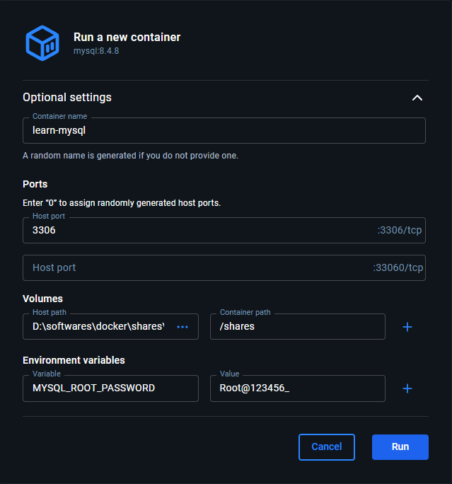
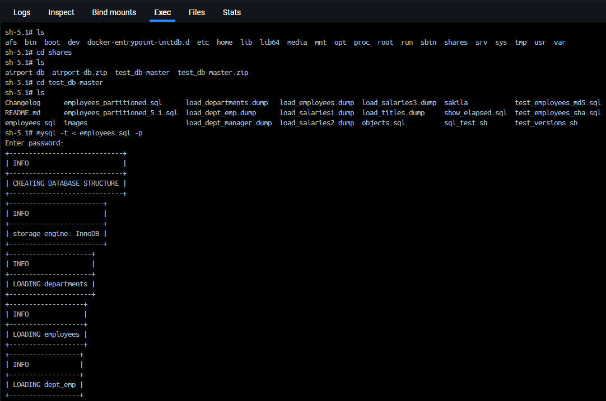
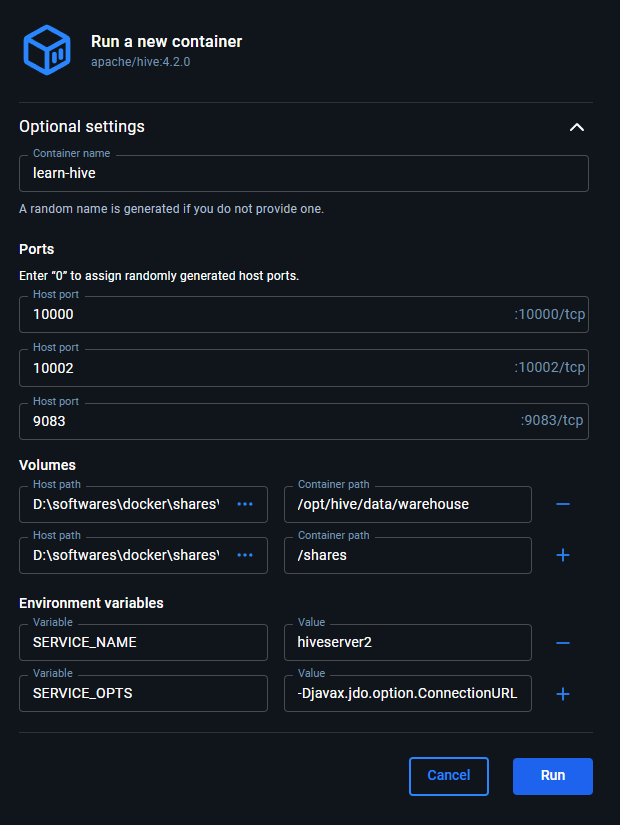

# 数据库部署

[TOC]

## 一、MySQL 数据库部署

前提要求: 安装好 WSL 和 Docker Desktop, 配置好路径等内容。

首先, 在 Docker Hub 中找到官方的 [mysql](https://hub.docker.com/_/mysql) 页面, 然后在 Tags 页面找到最新的 LTS 版本后, 拉取 (pull) 该镜像 (目前拉取的是 `8.4.8` 版本)。拉取完成后, 运行镜像, 并进行如下的配置:



需要注意的是: (1) 端口 `3306` 一定要配置, 不然外部无法访问。(2) `root` 用户密码是在环境变量中配置的, 使用 Docker Desktop 初始化容器时, 我们无法和命令行进行交互, 只能事先配置好密码。(3) 一定要有一个文件夹挂载出来, 否则我们无法向容器内部传递文件。

在安装完成 MySQL 数据库之后, 我们需要导入 [employees](https://github.com/datacharmer/test_db) 样例数据库。从 GitHub 上下载压缩包, 解压后放入上一步挂载出来的文件夹中, 进入 容器 的 SHELL 页面, 按照如下的截图操作即可:



最后, 配置连接的客户端即可, 由于是测试数据库, 直接用 `root` 用户即可。

## 二、部署 HIVE

首先, 在 Docker Hub 中找到官方的 [hive](https://hub.docker.com/r/apache/hive) 页面, 然后在 Tags 页面中找到最新的版本。需要注意的是: (1) 不要使用 `nightly` 版本, 其是 正在开发 的版本; (2) 不要选取 `standalone-metastore` 的版本, 我们不是做二次开发, 而是测试 SQL 语句。目前最新的是 `4.2.0`, 找到后拉取该镜像即可。

然后, 我们需要启动容器。此时一定要注意: (1) 官方镜像非常坑, 没有 pgsql 和 mysql 的驱动包, 因此不要使用外部数据库, 只能使用 derby 数据库, 同时需要修改 derby 默认的存储路径, 放在挂载文件夹中即可; (2) 官方镜像还是非常坑, 没有将 `/opt/hive/data/warehouse` 目录作为 volumes 挂载出来, 因此我们需要自行将该目录挂载出来。

那么, 在启动容器的过程中, 我们需要挂载两个目录: `/opt/hive/data/warehouse` 和 `/shares`。同时, 需要配置两个环境变量: (1) `SERVICE_NAME` 配置成 `hiveserver2`; (2) `service_opts` 配置成 `-Djavax.jdo.option.ConnectionURL=jdbc:derby:;databaseName=/shares/metastore_db;create=true`。下面是配置示意图:



这里 derby 路径配置属于 "嵌套式配置": 第一层是 环境变量 `SERVICE_OPTS`; 第二层是 配置变量 `javax.jdo.option.ConnectionURL`。同时, 为了和其它变量区分, 还在配置变量之前添加了 `D` 标识。至于 derby 路径写法奇怪的问题, 不用纠结, 按照格式修改就行。

额外说明一点, 如果使用 hive 3.1.3 版本的镜像, 官方没有将 tez 文件打包进去, 此时需要在 `SERVICE_OPTS` 中配置: `-Dhive.execution.engine=mr` 即可。

同时, 如果你想在 Hive 管理页面看到更多的日志信息, 那么 `SERVICE_OPTS` 还需要加以下的信息:

```shell
-Djavax.jdo.option.ConnectionURL=jdbc:derby:;databaseName=/shares/metastore_db;create=true -Dhive.server2.historic.operation.log.enabled=true -Dhive.server2.webui.max.historic.queries=10 -Dhive.server2.webui.explain.output=true
```

启动镜像完成后, 我们可以使用 DBeaver 连接数据库: (1) 连接类型选择 `hive4`; (2) 端口是 `10000`; (3) 不用输入用户名和密码。同时, 我们还可以通过 `https://127.0.0.1:10002` 访问 Hive 管理页面。

接下来, 我们需要导入 `employees` 数据库。

首先, 借助 客户端工具 从 MySQL 中导出所有的数据表成 CSV 文件。需要注意的是: (1) CSV 文件中不需要表头, 字符串不用 双引号 封闭 即可, 否则需要需要指定 `ROW FORMAT SERDE`; (2) 注意客户端导出的日期数据格式, 务必按照 "年-月-日" 10 位的格式来。

然后, 我们需要创建外部表, 下面是 示例 SQL, 根据实际情况修改 `ROW FORMAT SERDE` 和 `LOCATION` 中的内容:

```sql
CREATE EXTERNAL TABLE employees.employees_ (
    emp_no      string comment '唯一标识',
    birth_date  string comment '出生日期',
    first_name  string comment '姓名: 名字',
    last_name   string comment '姓名: 姓氏',
    gender      string comment '性别',    
    hire_date   string comment '入职日期'
)
COMMENT '员工表'
ROW FORMAT DELIMITED
FIELDS TERMINATED BY ','
STORED AS TEXTFILE
LOCATION '/shares/employees/employees/';

CREATE EXTERNAL TABLE employees.departments_ (
    dept_no   string comment '唯一标识',
    dept_name string comment '部门名称'
) 
COMMENT '部门表'
ROW FORMAT SERDE 'org.apache.hadoop.hive.serde2.OpenCSVSerde'
WITH SERDEPROPERTIES (
    'separatorChar' = ',',             -- 分隔符，默认逗号
    'quoteChar' = '"',                 -- 引号字符，默认双引号
    'escapeChar' = '\\',               -- 转义字符，默认反斜杠
    'skip.header.line.count' = '1'     -- 跳过表头
)
STORED AS TEXTFILE
LOCATION '/shares/employees/departments/';

CREATE EXTERNAL TABLE employees.dept_emp_ (
    emp_no    string comment '员工唯一标识',
    dept_no   string comment '部门唯一标识',
    from_date string comment '员工加入部门时间',
    to_date   string comment '员工离开部门时间'
)
COMMENT '员工-部门 关联表'
ROW FORMAT DELIMITED
FIELDS TERMINATED BY ','
STORED AS TEXTFILE
LOCATION '/shares/employees/dept_emp/';

CREATE EXTERNAL TABLE employees.dept_manager_ (
    emp_no    string comment '经理员工唯一标识',
    dept_no   string comment '部门唯一标识',
    from_date string comment '担任部门经理时间',
    to_date   string comment '卸任部门经理时间'
)
COMMENT '部门经理-部门 关联表'
ROW FORMAT DELIMITED
FIELDS TERMINATED BY ','
STORED AS TEXTFILE
LOCATION '/shares/employees/dept_manager/';

CREATE EXTERNAL TABLE employees.salaries_ (
    emp_no    string comment '员工唯一标识',
    salary    string comment '工资',
    from_date string comment '有效期: 开始',
    to_date   string comment '有效期: 结束'
)
COMMENT '员工工资表'
ROW FORMAT DELIMITED
FIELDS TERMINATED BY ','
STORED AS TEXTFILE
LOCATION '/shares/employees/salaries/';

CREATE EXTERNAL TABLE employees.titles_ (
    emp_no    string comment '员工唯一标识',
    title     string comment '员工职位名称',
    from_date string comment '有效期: 开始',
    to_date   string comment '有效期: 结束'
)
COMMENT '员工职位表'
ROW FORMAT DELIMITED
FIELDS TERMINATED BY ','
STORED AS TEXTFILE
LOCATION '/shares/employees/titles/';
```

最后, 我们可以根据 外部表 创建 内部表。内部表 可以 指定 分区分桶规则, 以及 ORC 文件格式, 下面是示例代码:

```sql
create table employees.employees (
    emp_no      string comment '唯一标识',
    birth_date  string comment '出生日期',
    first_name  string comment '姓名: 名字',
    last_name   string comment '姓名: 姓氏',
    gender      string comment '性别',    
    hire_date   string comment '入职日期'
)
clustered by (emp_no) into 4 buckets
stored as orc
tblproperties (
    'orc.compress' = 'snappy'
);

insert overwrite table employees.employees 
select * from employees.employees_;
```

在上述代码中, 我们根据 `emp_no` 字段创建了 4 个分桶, 并将 外部表 的数据导入到 内部表 中。后续会根据实际情况来创建 内部表。

## 三、employees_plus 数据表

为了避免不必要地关联代码, 我们需要创建一个 `employees_plus` 数据表, SQL 语句如下:

```sql
drop table if exists employees.employees_plus;

create table if not exists employees.employees_plus as 

select 
    e.emp_no, e.birth_date, e.first_name, e.last_name, e.gender, e.hire_date, 
    datediff(e.hire_date, e.birth_date) / 365.25 as age,
    d.dept_name, s.salary, t.title 
from 
    employees.employees e 
    inner join employees.dept_emp de on e.emp_no = de.emp_no and de.to_date = '9999-01-01'
    inner join employees.departments d on de.dept_no = d.dept_no 
    inner join employees.salaries s on e.emp_no = s.emp_no and s.to_date = '9999-01-01'
    inner join employees.titles t on e.emp_no = t.emp_no and t.to_date = '9999-01-01'
;
```
