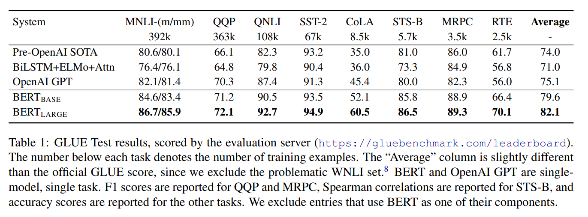
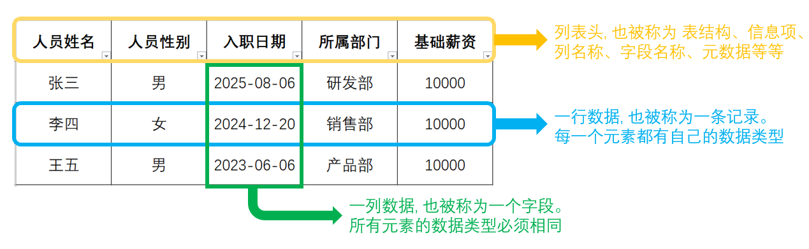
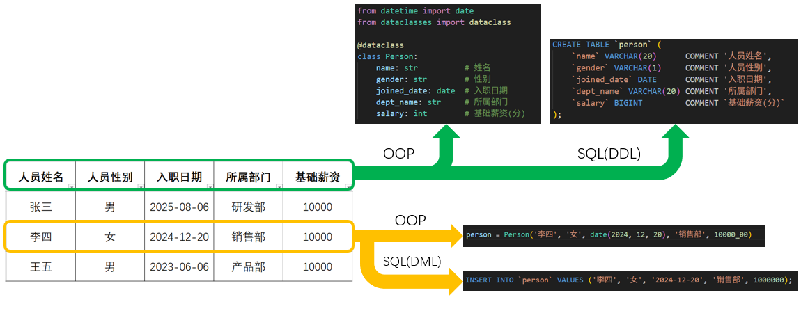
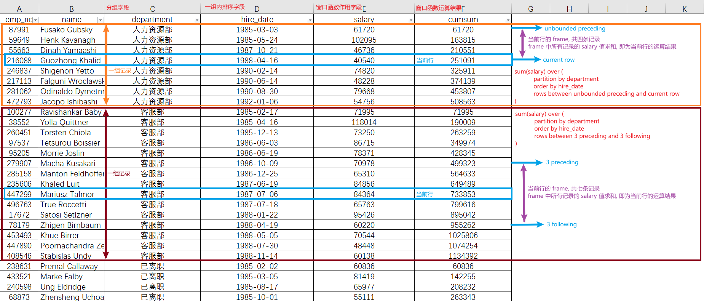
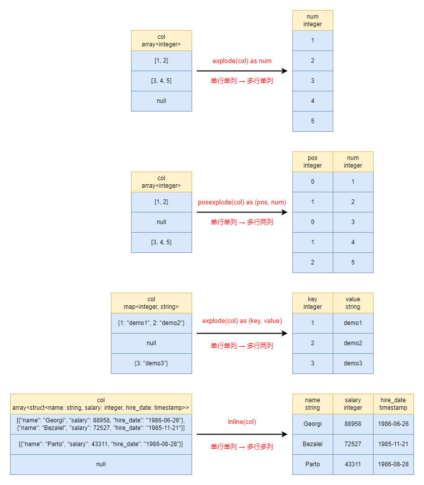

# SQL 系列 (三) "集合" 视角下的 SQL 语言

[TOC]

## 一、SQL 是 集合运算

### 1.1 引言

随着大数据领域的不断发展, Hive、Spark、Flink 等框架都在不断地加强对 SQL 语言的支持, SQL 语言也逐渐成为了行业内的通用的编程范式。大部分数据库的教程中都是从 "数据表格" 的视角来介绍 SQL 语句, 本文换一个视角, 从 "集合" 的视角来介绍 SQL 语句, 为后续理解 数据库 底层知识 方式打下坚实的基础。

SQL 语言包含的内容非常多, 大致可以分为 DDL、DML、DQL、DCL、PL/SQL 五类。本文聚焦于 SQL 语言最核心的部分: DQL (Data Query Language, 数据查询语言), 其它的部分计划在后续的系列博客中介绍。

在本系列之前的两篇博客中, 笔者详细地介绍了 SQL 语言支持的数据类型, 主要包括 "背景知识" 和 "MySQL 函数支持" 两部分的内容。对于不同的数据库软件以及版本来说, 它们提供的 函数支持 各不相同, 我们无法完全掌握, 除非你像高中 "刷题" 一样天天背这些函数的用法。但是, 它们提供的功能是 "相似的", 我们需要记住的是 这些类型的操作思路, 在实际开发过程中再去 问大模型/查文档。因此, 相较于 函数用法 这种细节知识, "背景知识" 和 "设计思路" 这些 相对宏观 的知识反而是更加重要的!

本文以 MySQL 为主, DuckDB, SparkSQL 和 Oracle 语法为辅, 并以 [employees](https://github.com/datacharmer/test_db) 数据库为例, 来介绍 SQL 语句支持的 DQL 查询语句。下面, 让我们开始吧 ~

### 1.2 数据表格 与 集合运算

在工作和生活中, 很多数据都是以 "数据表格" 的形式存在的, 比方说 排班表、值日表、课程表、工资表、论文中的表格 等等。这些 "数据表格" 都是以 **二维** 的形式存在的, 它们可以帮助我们直观的 记录、对比 和 理解数据。常用的文档格式, 包括 Word、PowerPoint、HTML、MarkDown、Latex、PDF 等等, 都提供了 **展示** "数据表格" 的方式。下面两张图分别是 [BERT](https://arxiv.org/abs/1810.04805) 论文中的表格 和 Excel 软件提供的表格模板。




一般情况下, 我们会使用 Excel 软件创建和 **分析** "表格数据"。其提供了丰富的计算函数、分组汇总与数据透视表、统计图像等功能, 同时还支持 VBA 编程, 具有很强的扩展性。

Excel 软件非常好用, 但是无法处理大批量的数据。[官方](https://support.microsoft.com/en-us/office/excel-specifications-and-limits-1672b34d-7043-467e-8e27-269d656771c3) 说 一个 sheet 页最多能够支持 约一百万行 和 16384 列的数据, 但是实际上当数据量达到十万行时, 运算效率就会非常低。此时就需要一些更加专业的软件, 比方说 Pandas、R 语言、关系型数据库 等等。这些专业软件采取编写代码的方式来 **操作** "数据表格"。其中, SQL 和 Python 是目前最受欢迎的两种语言。本文主要是介绍 关系型数据库 中的 SQL 语言。

对于初学者来说, 可能会觉得 编写代码 操作 "数据表格" 的方式很难理解, 那是因为脑海中没有 "数据表格" 的大致样式。如果我们将 使用 Excel 软件 类比成 "下棋"; 那么 编写代码 就是 "下盲棋"。下面, 让我们看看 SQL 语言中 "数据表格" 的样式。



上图是 SQL 语言中 "数据表格" 的示意图。在这里, 只有 "列表头", 没有 "行表头"。我们需要清楚的定义每一列的含义、数据类型等内容, 这些内容也被称为表结构信息。一行数据中不同元素的数据类型是自定义的, 一列数据中所有元素的数据类型是相同的。换言之, 一行数据是 **异构** 的 (heterogeneous), 一列数据是 **同质** 的 (homogeneous)。这一点非常重要, 只有同质的数据之间才能够进行计算, 异构数据是无法直接计算的, 需要隐式类型转换支持。也正是因为此, SQL 中的聚合函数都是作用于一列数据中, 相关内容会在本文后续章节中介绍。

我们将 "一行数据" 称为 "一条记录" (record), "一列数据" 称为 "一个字段" (field)。此时, 我们可以将 "数据表格" 看成是一个 **记录集合**: 整张 "数据表格" 是一个集合; 单条记录 (单行数据) 是集合中的元素; 一条记录中的字段对应记录的属性值。那么, "数据表格" 就可以和 OOP (Object Oriented Programming) 中的概念对应上了: "表结构" 对应 "类" (class), "记录" 对应 "对象" (object), "数据表" 对应 "对象集合"。下图详细地展示了两者之间的对应关系:



上述理解方式非常重要, 我们可以将 "数据表格" 的很多运算理解成 **集合运算**, 本文后续在介绍相关内容时也会以此为基础进行介绍。除此之外, 在很多 web 框架中, 为了解决不同数据库之间的 SQL 差异, 会提供了一套 ORM (Object Relational Mapping) 接口。这些接口的核心思想就如上图所示: 一条记录对应一个对象 (object)。

在 线性代数 中, 矩阵 也是一个 数据表格, 所有的元素都是实数, 也就是 **同质** 化数据。我们可以将 矩阵 看作 **行向量** 的集合, 也可以将 矩阵 看作 **列向量** 的集合。而在 SQL 语言中, 数据表格 固定看成 **行元组** 的集合。这是不同领域中 数据表格 含义的区别。至此, 你应该对 SQL 中的 "数据表格" 有一个大致的了解。

### 1.3 DML 语句简介

我们常说, 数据库的 主要操作 是 增删改查, 或者说 CRUD (create, read, update, delete)。其中, "增删改" (create, delete, update) 都属于 DML (Data Manipulation Language) 数据操作语言; 而 "查" (read) 则属于 DQL (Data Query Language) 数据查询语言。本文主要介绍 DQL 语句, 但是为了更加全面地了解 SQL 集合运算, 这里先简单介绍一下 DML 语句。**增删改** 分别对应的关键词是 **insert into**、**delete from** 和 **update**, 下面是示例 SQL 代码:

```SQL
-- 1. 新增两条记录
insert into employees.departments 
    (dept_no, dept_name)
values
    ('d010', '研发一部'),  -- 第一条记录 (行)
    ('d011', '研发三部');  -- 第二条记录 (行)

-- 2. 修改记录
update
    employees.departments
set 
    dept_name = '研发二部'
where 
    dept_no = 'd011';

-- 3. 删除记录
delete from employees.departments where dept_no in ('d010', 'd011');
```

`insert into` 是向集合中 插入 记录, `values` 后面紧跟插入的数据: 单个 行元组 由 "小括号" 封闭, 不同的 行元组 之间用 "逗号" 拼接。行元组 内部 元素 顺序和 字段 顺序保持一致, 默认按 DDL 顺序来, 也可以在 表名称 之后自定义。如果插入时没有指定记录的字段值, 会自动填充为 `null` 或者 默认值。如果是 自增字段, 插入时填充 `null` 即可。`insert into` 语句中元素值的限制和 DDL 语句是息息相关的, 这里不做过多介绍。

`update` 是 修改 所有满足条件的记录 的部分字段值。记录筛选在 `where` 从句中指定, 需要修改的内容在 `set` 从句中指定。上述 SQL 的含义是: 修改所有 `dept_no` 字段值为 `d011` 的记录, 将 `dept_name` 改为 `研发二部`。需要注意的是, `where` 从句中的 `=` 和 `set` 从句中的 `=` 含义不同: 前者是 判断相等, 后者是 赋值。

`delete from` 是 删除 所有满足条件的 记录。上述 SQL 的含义是将 `dept_no` 字段值为 `d010` 和 `d011` 的记录都删除。需要注意的是, `delete from` 语句只能用于 删除 记录, 如果你需要删除 数据表 中的某一个 字段, 那么就要用到 DDL 语句中的 `alter table ... drop column ...` 语句。

我们可以使用如下的 Python 代码来理解上述 SQL 代码的含义:

```python
from dataclasses import dataclass

# 0. DDL 语句
@dataclass
class Department:
    dept_no: str
    dept_name: str 

departments = []

# 1. 新增两条记录
departments.extend([
    Department(dept_no='d010', dept_name='研发一部'),  # 第一条记录 (行)
    Department(dept_no='d011', dept_name='研发三部'),  # 第二条记录 (行)
])

# 2. 修改记录
for department in departments:
    if department.dept_no == 'd011':      # where 从句
        department.dept_name = '研发二部'  # set 从句

# 3. 删除记录
departments = [
    department for department in departments 
    if not (department.dept_no in ['d010', 'd011'])  # where 从句
]
```

从上面可以看出, update 和 delete 操作都是 **批量** 的记录操作。即使你只想 修改/删除 某一条 记录, 但是 SQL 语句的含义依旧是 **批处理**, 我们需要使用 `where` 从句筛选出指定的记录。因此, 我们会说, SQL 语句的本质是 **集合运算**。

在上面的 Python 代码中, 我们用 `list` 数据结构来存储记录。但是, 实际上 SQL 语言对应的 集合 是 **Bag**。那么, Bag 集合的特点是什么呢? 下面是 List, Bag 和 Set 三种集合的区别:

+ List: 集合内元素有 位置顺序, 同时 允许重复
+ Bag: 集合内元素无 位置顺序, 同时 允许重复
+ Set: 集合内元素无 位置顺序, 且 不允许重复

Bag 集合最大的特点是无 **位置顺序**, 在编程语言中无对应的数据结构, 属于 "理论" 层面上的概念。在 NLP 中, 著名的 BoW (Bag of Words) 就是此含义: 将 **句子** 看成是 **词语** 的集合, 同时忽略 **词语** 的位置顺序。在 SQL 语言中, **数据表** 是一个由 **记录** 组成的 Bag 集合, 这就意味着其有两个特点:

(1) 我们无法通过 **位置索引** 来获取指定的 **记录**, 必须通过 `where` 从句的筛选。也正是因为此, `update` 和 `delete from` 语句都有 `where` 从句。

(2) DQL 语句的查询结果顺序并不固定, 由 软件 内部的实现方式决定, 我们必须要通过 `order by` 从句来指定元素的顺序, 这个会在下一章节中介绍。

至此, 你应该对 "增删改" 有一个初步的了解。实际上, 他们还有更加丰富的语法, 这些计划在 后续博客 中介绍。下面, 让我们来看看本文的主角: DQL 查询语句!

## 二、单表查询

单表查询语句大致可以分为两类: **普通查询** 和 **分组查询**, 涉及到两种特殊函数: **聚合函数** 和 **窗口函数**。下面, 让我们来看看这些内容。

### 2.1 基础查询

和其它编程语言不同的是, SQL 语言由多个 **从句** 构成。普通查询 最多可以有五个从句:

+ `select`: 返回记录的字段信息
+ `from`: 查询的数据表
+ `where`: 记录的筛选条件
+ `order by`: 返回记录的排序方式 (支持多字段不同序排序)
+ `limit`: 限制返回的记录数

下面是示例 SQL 代码:

```SQL
select 
    emp_no as eid,
    concat_ws(" ", first_name, last_name) as name,
    case gender when 'M' then '男' when 'F' then '女' else '未知' end as gender,
    datediff(current_date(), birth_date) div 365.25 as age,
    hire_date
from 
    employees.employees
where 
    hire_date between '1990-01-01' and '1990-12-31'
order by 
    age desc, eid asc
limit 
    10 offset 50;
```

上述 SQL 的含义是: 遍历 `employees` 数据表中的所有记录: 保留 `hire_date` 在 `1990-01-01` 到 `1990-12-31` 之间的记录, 并返回 唯一标识 (`eid`)、姓名 (`name`)、性别 (`gender`)、年龄 (`age`) 和 入职日期 (`hire_date`) 等信息。然后所有的记录按照 `age` 倒序排列, `age` 相同的记录按照 `emp_no` 正序排列, 最后返回第 51 至第 60 条记录。上述 SQL 等价于如下的 Python 代码:

```python
results = []

for employee in employees:  # from 从句
    if '1990-01-01' <= employee.hire_date <= '1990-12-31':  # where 从句
        results.append({  # select 从句
            "eid": employee.emp_no,
            "name": employee.first_name + " " + employee.last_name, 
            "gender": "男" if employee.gender == "M" else "女",
            "age": (datetime.today() - datetime.strptime(employee.birth_date, '%Y-%m-%d')).days // 365.25,
            "hire_date": employee.hire_date, 
        })

# sort by 从句
# Python 内部采用的是 稳定排序, 多字段排序可以拆分成多次排序, 从后往前进行
results = sorted(results, key=itemgetter("eid"), reverse=False)
results = sorted(results, key=itemgetter("age"), reverse=True)

# limit 从句
results = results[50:60]
```

更加业务上的说法是: 查询 1990 年入职员工的基本信息 (姓名、性别、年龄 等等), 按照年龄排序后分页查询第 5 页的内容 (每一页 10 条记录)。需要说明的有以下一些内容:

(1) DQL 语句中从句的执行顺序 和 我们写的并不一致。一般情况下, 我们认为从句的执行顺序是: `from`, `where`, `select`, `order by` 和 `limit`。和书写顺序相比, 执行顺序是将 `select` 从句调整到 `where` 和 `order by` 从句之间。

在理解了 DQL 语句的执行顺序之后, 我们可以知道: `where` 从句是 "筛选" 数据表中的记录, 因此只能使用数据表中的字段名称, 不能使用 `select` 从句中的字段名称; `order by` 从句是给 `select` 从句返回的数据表进行记录排序, 因此排序字段必须出现在 `select` 从句中, 否则会报错。

在 现代化的数据库软件 中, `order by` 从句中的字段不一定要在 `select` 从句中, 也可以是数据表中的字段, 数据库软件 会隐式地帮我们把不在 `select` 从句中的字段添加到结果集中, 这一点非常人性化。

(2) 在 DQL 语句中, `select` 从句是必须有的。你甚至可以不写 `from` 从句, 即不指定数据表。比方说, `select current_date` 的含义是返回当前日期, 此时 "有且仅有" 一条记录。

在 19c 以及之前的 Oracle 版本, `from` 从句是必须存在的, 如果没有数据表, 则需要使用 `from dual` 代替。也就是说, Oracle 的 `select current_date from dual` 和 MySQL 中的 `select current_date` 功能是一样的, 返回的记录 "有且仅有" 一条。`dual` 是一个只有一条记录的数据表, 正好和其它数据库中没有 `from` 从句的情况相对应。

在 `select` 和 `from` 从句中, 我们可以使用 `as` 关键词分别给 字段 和 数据表 重命名, 同时 `as` 关键词也可以省略。需要注意的是: Oracle 数据库非常不喜欢 `as` 关键词: 你如果在 `from` 从句中使用 `as` 关键词给数据表进行重命名操作, 会直接报错, 必须要省略。也就是说: `select * from dual as d` 的写法是错误的, 正确写法是: `select * from dual d`。

`select` 从句支持对所有字段进行去重操作, 在最前面加上 `distinct` 关键词即可, 写法是 `select distinct name, age, gender ...`。需要注意的是: 这里是对所有的字段进行去重操作, 而非单一字段, 否则会有不同字段记录数不一致的问题。除此之外, 如果需要数据表中所有的字段, 可以简写为 `select *`。

(3) `where` 从句内部是逻辑表达式: 用 字段 + 比较运算符 构成 逻辑表达式; 再用 逻辑运算符 组合多个 逻辑表达式。对于每一条记录我们都会用 `where` 从句中的逻辑表达式去评判: 返回 `true` 则保留, 否则就丢弃。

需要强调的是, `where` 从句采用的不单单是 `true` 和 `false` 的布尔逻辑, 而是带上 `null` 的 **三值逻辑**。在筛选过程中, 仅仅保留值为 `true` 的记录, 值为 `false` 或者 `null` 的记录都会过滤掉。那么, 比较运算符在什么情况下会产生 `null` 值呢? 比较的两侧如果存在 `null` 值, 那么就返回 `null` 值。举例来说, 对于 比较运算 `age > 10` 来说, 如果记录的 `age` 值为 `null`, 那么运算结果就是 `null`, 最终会被 `where` 从句给筛选掉。

此时就存在一个问题, 如何进行空值判断呢? 如果使用 `age = null`, 那么所有记录的运算结果都是 `null`, 最终返回的数据表一条数据都没有。正确的写法是: `age is null`。也就是对于 `is null` 和 `is not null` 比较运算符来说, 它们只会返回 `true` 和 `false`, 不会返回 `null`。那么 **三值逻辑运算** 规则是什么样子的呢? 很简单, `null` 的含义是 **未知**, 可能为 `true`, 也可能为 `false`。那么:

`and` 是两者为 `true` 则为 `true`, 否则为 `False`。那么, 当我们只知道一个值为 `true` 时, 结果是 不确定; 但是当我们知道一个值为 `false` 时, 结果一定是 `false`。因此, `true and null` 的结果为 `null`; `false and null` 的结果为 `false`。

同理, `or` 是两者中有一个为 `true` 则为 `true`, 两个都是 `false` 则为 `false`。因此, 当我们知道一个值为 `true` 时, 结果一定是 `true`; 当我们知道一个值为 `false` 时, 结果是 不确定。那么, `true or null` 的结果为 `true`; `false or null` 的结果为 `null`。

同理, `xor` 是两者值不同为 `true`, 两者值相同为 `false`。因此, 我们无法通过一个值来获得结果, 必须要两个值都知道才行。那么, `true xor null` 和 `false xor null` 的结果都是 `null`。

理解了上述规则之后, 就很容易理解两个空值的逻辑运算了。除此之外, `null` 单独运算的结果都是 `null`: `null and null`, `null or null`, `null xor null` 以及 `not null` 的结果都是 `null`。

(4) SQL 中的 `order by` 语句是支持 多字段排序 的, 即前面字段值相同的情况下根据后面字段来排序。也就是说: 前面字段 是 "粗颗粒度的", 后面字段 是 "细颗粒度的"。如果反过来, 即前面字段是 "细颗粒度的", 后面字段是 "粗颗粒度的", 那么后面字段是没有意义的, 因为前面字段 "值相同" 的情况不会触发。

扩展一下, 在 Python 示例代码中, 我采用从后往前多次 "稳定排序" 的方式实现 **多字段排序**。原理很简单, 对于 `order by a, b` 来说: 先根据 `b` 字段排序之后, `a` 字段相同的 记录 "相对位置" 已经确定。举例来说, 假设现在有四条记录: `(1, 15)`, `(1, 16)`, `(2, 11)`, `(2, 20)`。当我们按照 `b` 字段排序之后, 结果为: `(2, 11)`, `(1, 15)`, `(1, 16)`, `(2, 20)`。对于 `a=1` 的情况, 记录 `(1, 15)` 一定排在 `(1, 16)` 之前; 对于 `a=2` 的情况, 记录 `(2, 11)` 一定排在 `(2, 20)` 之前。接下来, 我们再根据 `a` 字段进行 "稳定排序"。"稳定排序" 的含义是: 如果两个元素值相等, 那么排序前后的相对位置保持不变。也就是说, 根据 `a` 字段排序时, `(2, 11)` 只会移动到 `(2, 20)` 之前, 不会移动到 `(2, 20)` 之后。这样, 我们就可以通过多次稳定排序实现多字段排序。

不同编程语言提供的 排序方式 不同: Java 是通过实现 `compareTo` 方法; Python 则是通过 `key` 函数, 并提供了 `functools.cmp_to_key` 函数像 Java 那样排序; SQL 语言则是 多字段排序 的方式。理解不同的编程范式, 以及它们之间的转换关系, 是非常重要的内容。

在 SQL 语言中, `where` 从句和 `order by` 从句对于 `null` 值处理方式是不同的: `where` 从句采用 **三值逻辑** 的方式, 而 `order by` 从句则是将 `null` 值视为 **极端值** (最大/最小)。

在 MySQL 中, `null` 值直接视为 最小值。也就是说, 升序排在最前面, 降序排在最后面。如果你希望 升序排列, 且空值排在最后, 那么需要使用多字段排序, 方式为 `order by a is null, a asc`。

在 Oracle 中, `null` 值默认视为 最大值。也就是说, 升序排在最后面, 降序排在最前面。并且, 提供了 `nulls first` 和 `nulls last` 关键词进行控制。比方说, 你希望 降序排列 时空值在最后, 方式如下: `order by a desc nulls last`。在这方面, Oracle 数据库比 MySQL 数据库更加人性化一些。

(5) `limit 10 offset 50` 的含义是从第 50 条记录开始 (包含), 往后数 10 条数据返回。这里的 `offset` 指的是首元素的偏移量, 因此是 0-based 位置序号。需要注意的是, SQL 语言中只有 字符串函数 都采用 1-based 位置序号, 其它的并不一定。

在上一节中, 我们说过 SQL 编程范式的记录是 "无序" (插入顺序) 的。换言之, 两次相同的 SQL 查询, 返回的记录顺序可能会不一致。在单机版数据库中, 根据实现方式, 一般会按照存储顺序来, 但不绝对。但是在分布式数据库中, 这个问题就比较严重了: `limit` 中的 `offset` 失效, 变成随机返回 10 条记录。解决方案是: `limit` 从句配合 `order by` 从句使用, 将返回记录的顺序固定下来。

在 WEB 端开发, "分页查询" 是基本操作了, 由 `page_size` 和 `page_no` 两个参数控制。其中, `page_size` 是单页的记录数, `page_no` 是页序号, 采用 1-based 位置序号。那么其和 `limit` 语句的对应关系是: `limit ${page_size} offset ${(page_no - 1) * page_size}`。这几乎是 "分页查询" 的标配, 一定要理解。

至此, 你应该对 DQL 基础查询有一个大致的了解。除了 SQL 之外, 还有很多框架提供了 集合运算, 比方说 [Spark RDD](https://zhuanlan.zhihu.com/p/17821898772): `from`, `where`, `select`, `order by` 和 `limit` 从句分别对应 `textFile`, `filter`, `map`, `sortBy` 和 `take` 算子。一定要注意不同编程范式之间的差别, 这一点很重要!

### 2.2 聚合函数

[聚合运算](https://dev.mysql.com/doc/refman/8.4/en/aggregate-functions.html) 是集合运算的重要组成部分, 它会将多条记录合并成一条记录。如果聚合运算只涉及到一个字段, 那么就是单列运算。MySQL 中支持的 聚合运算 可以分成四类:

第一类是统计量相关的函数, 主要九个函数: `count` (计数), `max` (最大值), `min` (最小值), `sum` (求和), `avg` (平均数), `var_pop` (总体方差), `stddev_pop` (总体标准差), `var_sample` (样本方差), `stddev_sample` (样本标准差)。

上述函数还有 "别名": `var_pop` 有一个别名函数 `variance`, 两者都是求总体方差; `stddev_pop` 有两个别名函数 `std` 和 `stddev`, 三者都是求总体标准差。

这九个聚合函数都是作用于某一列, 因此可以视为 单列运算。同时, 所有的 聚合函数 都会忽略 `null` 值, 因此运算结果不会是 `null` 值, 除非所有的记录值都是 `null`。举例来说, 在 NumPy 中, 当你使用 `np.sum` 进行求和时, 如果数组中有一个元素是 `np.nan`, 那么运算结果就是 `np.nan`; 在 SQL 语言中, 当你使用 `sum` 聚合函数对列求和, 如果某一个记录值为 `null`, SQL 语句会忽略它, 最终结果是正常的数值。也就是说, SQL 中的 `sum` 函数类似于 NumPy 中的 `np.nansum` 函数。

这里需要重点说明一下 `count` 函数。`count` 函数最基础的用法是 `count(field)`, 作用是计算数据表 `field` 字段 非空记录 的数量。如果我们想统计数据表中的记录数, 最简单的方式是 `count(1)` 或者 `sum(1)`。但是不知道为什么, 会有 `count(*)` 这种写法, 同时流传着错误说法: `count(*)` 会加载数据表全部数据而 `count(1)` 不会。真实情况是: `count(*)` 是 `count(1)` 的 "别名", 两者完全等价, 没有任何区别。

个人非常不喜欢 `count(*)` 这种写法, 因为这种表述会有歧义: `*` 的含义是数据表中的全部字段, `count(*)` 在计数时会排除所有字段值都为 `null` 的记录。实际上, `count` 函数只接受一个入参字段, 而 `count(*)` 仅仅是 `count(1)` 的 "别名", 根本不会做非空判断。也不知道是哪位 奇人 发明了这种用法, 很容易误导人!

`count` 函数可以作用于任意类型的字段; `max` 和 `min` 函数可以作用于 可比较类型的字段, 包括 日期 和 数值类型; 剩下的 6 个函数仅仅作用于 数值类型的字段。`count`, `sum` 和 `avg` 三个函数都可以使用 `distinct` 关键词, 会先对数据进行去重操作, 然后再计算。这里再强调一次, `count(*)` 是 `count(1)` 的 "别名", 更没有 `count(distinct *)` 这种写法。`max` 和 `min` 函数添加 `distinct` 关键词, 但是没有意义。和方差计算相关的四个函数则不允许使用 `distinct` 关键词。

---

第二类是字符串拼接函数, 只有一个函数: `group_concat`。最简单的用法是: `group_concat(field1)`, 其含义是将数据表中所有记录的 `field1` 字段值拼接成一个字符串, 两个值之间用逗号分隔。除此之外, 我们还可以指定 分隔符、排序规则 以及 是否去重。下面是示例代码:

```sql
select 
    group_concat(distinct dept_name order by dept_no desc separator ';')
from 
    employees.departments d;
```

`group_concat` 函数完全采用 关键词/从句 的方式指定参数。上述代码的含义是: `departments` 数据表中的记录根据 `dept_no` 倒序排序; 然后再根据 `dept_name` 进行去重操作, 保留排序靠前的值; 最后用分号将所有的 `dept_name` 值拼接再一起。

`group_concat` 函数可以说是 字符串拼接 "最完整" 的函数, 很多数据库软件中都没有这个函数。Hive 中可以使用 `concat_ws` + `sort_array` + `collect_list` / `collect_set` 组合的方式来代替。这套方案中唯一的问题是: 无法根据记录中其它的字段进行排序。

`group_concat` 能够称为 "最完整" 函数的原因是: 有了 `order by` 子从句之后可以根据其它的字段进行排序。`min` 和 `max` 函数也有类似的需求: 获取数据表中 `a` 字段 最大值 (最小值) 对应的 `b` 字段。我们无法直接通过 `min` 和 `max` 函数来实现, 可以通过 `order by` + `limit 1` 从句间接实现。

字符串可以进行的 聚合运算 只有三种: 最大值 (`max`), 最小值 (`min`) 和 字符串拼接 (`group_concat`), 它们返回的都是 字符串。同时, 日期可以进行的聚合函数只有两种: 最大值 (`max`) 和 最小值 (`min`), 它们返回的都是 日期。只有数值类型的聚合函数较多, 主要和 "统计" 相关。

---

第三类是 JSON 生成函数, 主要包括两个: `json_arrayagg` 和 `json_objectagg`。`json_arrayagg(field)` 是将数据表中 `field` 字段 的所有元素组合成 json 数组。`json_objectagg(field1, field2)` 是将 数据表 转化成 json 映射集合, `field1` 字段作为 key, `field2` 字段作为 value。下面是示例代码:

```sql
select 
    json_arrayagg(dept_name),  -- ["Customer Service", "Development", ... ]
    json_objectagg(dept_no, dept_name)  -- {"d001": "Marketing", "d002": "Finance" ... }
from
    employees.departments d;
```

`json_arrayagg` 函数和 `group_concat` 函数很像, 都是将一个字段中所有的元素组合起来, 前者返回的是 json 数组, 后者返回的是 字符串。但是, `json_arrayagg` 函数没有 `order by` 子从句, JSON Array 中元素顺序并不固定。同时, 两者对于 `null` 值的处理方式也不同: `group_concat` 会忽略所有的 `null` 值, 但是 `json_arrayagg` 会保留所有的 `null` 值, 转换成 json 中的 `null` 值。

`json_objectagg(field1, field2)` 函数返回的 json 映射集合 有如下特点: (1) MySQL 会自动根据 key (`field1`) 对所有的 KV 对进行排序; (2) 如果一个 key (`field1`) 有多个 value (`field2`), 那么 MySQL 会保留最后一个 value 值; (3) 如果 key (`field1`) 字段不是 字符串 类型, MySQL 会尝试将其转换成字符串, 转换失败则会报错; (4) 如果 key (`field1`) 字段中的元素有 `null` 值, MySQL 会直接报错。

---

第四类是批量的按位运算, 包括三个: `bit_and` (按位与), `bit_or` (按位或), `bit_xor` (按位异或)。`bit_and(field)` 是将所有记录的 `field` 字段值进行 按位与 运算。`bit_or` 和 `bit_xor` 同理, 不再重复描述。

至此, 你应该对 聚合函数 有一个大致的了解。所有的 聚合函数 仅仅返回单值, 因此不能和数据表中的字段组合使用。举例来说, `select age, avg(age) from employees` 语句中, `age` 字段对应 多条记录, 而 `avg(age)` 字段对应 一条记录, 此时就会产生矛盾, SQL 标准不允许这样的写法。同时, 由于返回的数据表仅仅包含一条记录, 那么 `order by` 和 `limit` 从句是没有意义的, 此时最多需要三个从句: `select`, `from` 和 `where` 从句。

在实际应用中, 聚合函数 很少单独使用, 更多是和 分组查询 一起使用。下面, 让我们来看看 分组查询 的相关内容。

### 2.3 分组查询

分组查询 指的是将 字段值 相同的 记录 归为一组, 然后我们可以对一组记录使用聚合函数进行运算, 因此也被称为 分组聚合。和 普通查询 相比, 分组查询 多个两个从句:

+ `group by` 从句: 数据表分组的依据
+ `having` 从句: 分组聚合之后的条件筛选

下面是示例 SQL 代码:

```SQL
select 
    dept_name,
    count(1) as num_employees,
    avg(salary) as avg_salary
from 
    employees.employees_plus
where 
    gender = 'M'
group by 
    dept_name 
having 
    num_employees > 9000
order by 
    avg_salary desc
limit 
    10 offset 0;
```

上面 SQL 的含义是: 对 `employees_plus` 员工表中的记录进行筛选, 仅保留 `gender` 为 `M` (男性) 的员工; 然后根据 `dept_name` 字段进行分组, 每一组内进行计数 和 薪资平均数 计算, 保留 员工数 大于 9000 人的部门, 最后根据 薪资平均数 进行排序, 返回前 10 条记录。更加业务化的说法是: 统计男性员工大于 9000 人部门的 男性平均薪资, 并返回 Top 10 记录。上述 SQL 可以用如下的 Python 代码实现:

```python
from collections import defaultdict

pre_results = defaultdict(lambda: defaultdict(int))

for employee in employees:  # from 从句
    if employee.gender == 'M':  # where 从句
        # group by 从句 + select 预处理
        pre_result = pre_results[employee.dept_name]
        pre_result["num_employees"] += 1
        pre_result["total_salary"] += employee.salary

results = []

for dept_name, pre_result in pre_results.items():
    if pre_result["num_employees"] > 9000:  # having 从句
        results.append({  # select 后处理
            "dept_name": dept_name,
            "num_employees": pre_result["num_employees"],
            "avg_salary": pre_result["total_salary"] / pre_result["num_employees"]
        })

results = sorted(results, key=itemgetter("avg_salary"), reverse=True)  # sort by 从句
results = results[0:10]  # limit 从句
```

我们可以认为 SQL 的执行顺序如下: `from` 从句、`where` 从句、`group by` 从句、`select` 从句、`having` 从句、`order by` 从句、`limit` 从句。它们分别对应 [Spark RDD](https://zhuanlan.zhihu.com/p/17821898772) 的 `textFile`, `filter`, `combineByKey`, `filter`, `sortBy` 和 `take` 算子。在这里, `combineByKey` 算子对应 `group by` 和 `select` 两个从句。也就是说, `where` 和 `group by` 从句的字段必须是 `from` 数据表中的字段; `having` 和 `order by` 从句中的字段必须是 `select` 从句中的字段。`where` 从句和 `having` 从句同为筛选, 区别在于作用的对象不同, 这一点非常重要!

我们将 `group by` 语句中的字段称为 "聚合列" (aggregated columns), 数据表中不在 `group by` 语句的字段称为 "非聚合列" (nonaggregated columns)。需要注意的是: 在 SQL 语言中, "非聚合列" 是不能直接出现在 `select` 从句中的, 它们必须配合 聚合函数 出现, 否则会报错。观察上面 SQL, 我们可以发现: 虽然我们是从 员工表 `employees_plus` 中取的数据, 但是计算的主体发生了变化, 不再是 "员工" 了, 而是 "部门"。也就是说, 分组聚合查询会改变数据表返回的主体。

在旧版的数据库中, 比方说 Oracle 19c 以及之前的版本中, `having` 从句不能使用 `select` 从句的字段, 只能使用 "聚合列" 或者 聚合函数。也就是说, 上述例子中的 `having num_employees > 9000` 必须写成 `having count(1) > 9000`。在新版的数据库中, 比方说 MySQL 8.0+ 和 Oracle 23ai 以及之后的版本中, `having` 可以使用 `select` 从句的字段。

在上述示例的 Python 代码中, "分组聚合" 是使用 **映射集合** (`dict`) 方式实现的。除此之外, 还可以通过 **排序分组** 的方式实现, 核心思想是让 相同的记录 放在集合相邻的位置。[MapReduce](https://zhuanlan.zhihu.com/p/919744848) 中的 reduce 阶段就是采取这种方式的, 对此不了解的可以看看 Python 中的 [itertools.groupby](https://docs.python.org/3/library/itertools.html#itertools.groupby) 迭代器。

对于 分组查询 来说, 如果我们不进行聚合运算, 只返回 "聚合列" 的内容, 此时的效果等价于 去重操作。也就是说 `select dept_name from employees_plus group by dept_name` 和 `select distinct dept_name from employees_plus` 返回的内容是相同的。在不同的数据库软件中, `distinct` 和 `group by` 去重的效率是有差别的, 需要根据实际情况来调整。

---

在 Oracle 数据库中, 我们可以使用 `rollup` 和 `cube` 函数进行 "组合字段" 分组。下面, 让我们看看 "组合字段" 分组的功能:

上一节介绍的 聚合查询 可以理解为 分组聚合查询 的特殊情况, 即 全表记录 为 一个组, 我们可以用 `group by` + 常量的方式表示。那么, 这里我们就采取 `group by null` 的写法。需要注意的是, `group by null` 这种写法只能在 Oracle 中使用, 在 MySQL 中使用会报错。下面, 让我们来看看 `rollup` 和 `cube` 的用法:

第一种是 `group by rollup(a, b, c)`, 其等价于四个 SQL 执行的结果合并在一起: `group by a, b, c`, `group by a, b`, `group by a`, `group by null`。对于那些缺失的字段, 会用 `null` 值代替。这个功能和 Excel 中的 数据透视表 (pivot table) 功能是相似的, `group by a, b` 和 `group by a` 类似于 "小计" (subtotal) 行, `group by null` 类似于 "总计" / "总和" (total) 行。对此不了解的可以参考 [文档](https://support.microsoft.com/zh-cn/office/数据透视表中的小计和总和字段-173f5b30-b546-4293-87d2-aee638f74e7d)。

第二种是 `group by cube(a, b, c)`, 其等价于八个 SQL 执行的结果合并在一起: `group by a, b, c`, `group by a, b`, `group by a, c`, `group by b, c`, `group by a`, `group by b`, `group by c` 和 `group by null`。

从上面可以看出, `rollup` 是从右往左依次减少一个字段, 而 `cube` 是对所有字段进行 "组合" 操作。假设 `rollup` 函数中有 $n$ 个字段, 那么最终是进行 $n + 1$ 次分组查询; 假设 `cube` 函数中有 $n$ 个字段, 那么最终是进行 $2^n$ 次分组查询。

在此基础上, 我们还可以往后添加字段。举例来说, `group by rollup(a, b, c), d, e` 等价于四个 SQL 执行的结果合并在一起: `group by a, b, c, d, e`, `group by a, b, d, e`, `group by a, d, e` 和 `group by d, e`。`cube` 函数同理。

在 MySQL 中, 仅仅支持第一种 [rollup](https://dev.mysql.com/doc/refman/8.4/en/group-by-modifiers.html) 方式, 写法是 `group by a, b, c with rollup`, 同时不支持在后面添加字段。一般情况下, `rollup` 是足够用了, 如果有 `cube` 的使用需求, 可以采取多次查询的方式间接实现。

额外提醒一点, 在 SQL 语言中, 如果分组字段中包含 `null` 值, 那么会将 `null` 值单独作为一组。在 `rollup` 中, 缺失的字段会用 `null` 代替, 那么此时如果分组字段中包含 `null` 值, 返回的结果就会出现多 `null` 值的情况, 这一点一定要注意。

那么, 有没有办法解决这一问题呢? 那就是使用 `grouping` 函数。`grouping(field)` 可以出现在 `select` 从句、`having` 从句以及 `order by` 从句中, 它必须配合 `group by` 以及 `with rollup` 一起使用, 且 `field` 字段必须在 `group by` 从句中。其标识当前记录的聚合结果是否包含该字段, 包含返回 `0`, 不包含返回 `1`。也就是说, 如果 `grouping(field)` 的值是 `1`, 那么 `field` 的值必为 `null`; 反之则不成立, 因为有可能值本身就是 `null`。

下面是示例 SQL 代码, 统计 不同部门 下面 不同职位 的平均工资:

```sql
select 
    case when grouping(dept_name) = 0 then dept_name else '合计' end dept_name, 
    case when grouping(title) = 0 then title else '小计' end as title, 
    avg(salary) as avg_salary
from 
    employees.employees_plus 
group by 
    dept_name, title with rollup
order by 
    grouping(dept_name), dept_name,       -- 合计行最后
    grouping(title), avg_salary desc;     -- 小计行在每个部门内最后
```

上述代码需要说明的是 `order by` 从句部分。在没有 `order by` 从句时, 分组聚合查询 返回的结果会根据 "聚合列" 进行排序。现在, 我们期望 部门 依旧按照名称排序, 同时一个部门内部 职位 不是按照 职位名称 排序, 而是按照 平均工资 降序排列。那么, 我们采用 多字段排序 的方式即可: `order by dept_name, avg_salary desc`。但是, 我们需要保证 "合计" 以及 "小计" 行在正确的位置, 那么就需要分别在 `dept_name` 和 `avg_salary desc` 排序之前加入 `grouping(dept_name)` 和 `grouping(title)`。

至此, 你应该对 分组聚合查询 有一个大致的了解。分组聚合 在统计学中非常重要, 定类尺度、直方图 等等内容都和 分组聚合 有密切关系。但是, 分组运算 不仅仅止步于此, 还有 窗口分析函数。下面, 让我们来看看相关内容。

### 2.4 窗口函数

在 SQL 语言中, 除了使用 `group by` 进行分组运算外, 还可以使用 [窗口函数](https://en.wikipedia.org/wiki/Window_function_(SQL)) 进行分组运算。窗口函数 在 分组聚合运算 的基础上, 为每一条记录定义一个 frame, 然后根据 frame 中的记录进行运算。之前章节介绍的 聚合函数 中, 除了 `group_concat` 之外, 都可以作为 [窗口函数](https://dev.mysql.com/doc/refman/8.4/en/window-functions-usage.html)。下面, 让我们看一个具体的例子:

```SQL
select
    *, 
    sum(salary) over(
        partition by dept_name  -- 分区方式
        order by hire_date asc, emp_no desc  -- 单分区内排序方式
        rows between unbounded preceding and current row  -- frame 区间
    ) as cumsum,  -- 累加
    avg(salary) over(
        partition by dept_name  -- 分区方式
        order by hire_date asc, emp_no desc  -- 单分区内排序方式
        rows between 10 preceding and 10 following  -- frame 区间
    ) as running_average  -- 移动平均
from
    employees.employees_plus;
```

所有的 窗口函数 后面都会接一个 `over` 从句, 其内部包含三个子从句:

+ `partition by` 从句后面接分组字段, 字段值相同的即为一组
+ `order by` 从句后面接排序字段, 一组内的记录排序方式
+ `rows` 属于 frame 从句, 表示 frame 的范围

我们可以这么理解, 窗口函数 实际上有两次 分组操作: 第一次分组被称为 partition, 和 `group by` 从句的功能是相似的, 将 相同字段值 的内容分到一组中; 第二次分组是为 partition 中每一个记录划分一个 frame, 然后对 frame 中的记录进行聚合操作, 得到运算结果。

在上述 SQL 代码中, `cumsum` 列的计算方式是: 首先, 所有的记录按照 `department` 字段分区, 每一个分区内按照 `hire_date` 排序; 其次, 对于分区内的每一条记录, 根据 frame 从句划分出一个 frame 窗口, 然后将窗口内所有记录的 `salary` 字段值求和, 运算结果作为输出。

这里重点说明一下 `rows` frame 从句的含义: 首先, `between ... and ...` 是两端都包含的闭区间; 其次, 区间划分是以 **当前行** 为基准, `current row` 即为 **当前行**, `10 preceding` 是从 **当前行** 往前数 10 行, `10 following` 是 **当前行** 往后数 10 行, 数的过程均不包含 **当前行**; 最后, `unbounded` 表示不设限, 那么 `unbounded preceding` 即为组内第一行, `unbounded following` 即为组内最后一行。假设一个分区内有 $n$ 条记录, **当前行** 是第 $i$ 条记录 ($1 \le i \le n$), 那么:

+ `rows between unbounded preceding and current row`: frame 区间为 $[1, i]$
+ `rows between current row and unbounded following`: frame 区间为 $[i, n]$
+ `rows between 3 preceding and 3 following`: frame 区间为 $[i-3, i+3]$
+ `rows between 3 following and 5 following`: frame 区间为 $[i+3, i+5]$
+ `rows between 6 preceding and 4 preceding`: frame 区间为 $[i-6, i-4]$

那么, 上述 SQL 的 `cumsum` 和 `running_average` 可以用如下的示例图来理解:



很显然, 在上述 SQL 中, `cumsum` 列是按照 入职日期 排序后对 薪资 进行 "累加" 的操作。`running_average` 列则是按照 入职日期 排序后 对前后 10 名员工的 薪资 求平均数。当然, 这里的统计是没有意义的, 但是如果是 时序数据, 那么效果等同于求 "滑动平均数"。从这里可以看出 窗口函数 有很大的作用。

---

从上面可以看出, 窗口函数 的核心是 frame 的划分, 其可以算作是 **滑窗算法** (Sliding-Window Algorithm) 的应用。frame 除了 `rows` 划分方式之外, 还有 `range` 和 `groups` 划分方式。`rows` 划分方式是基于 **位置序号** 进行的, 而 `range` 和 `groups` 划分方式是基于 `order by` 从句来的。下面让我们来看看相关内容。

`range` 从句表示的含义是: `order by` 字段中的取值范围。因此, 当你使用 `range` frame 从句时, `order by` 从句中的排序字段只能有一个, 且必须是 数值类型 或者是 日期类型, 不能是字符串类型。下面是具体的例子:

+ `order by age range between 2.5 preceding and current row`: frame 区间为 `[age - 2.5, age]`
+ `order by age range between current row and unbounded following`: frame 区间为 `[age, +∞)`
+ `order by hire_date range between interval 10 day preceding and interval 10 day following`: frame 区间为 `[hire_date - 10 days, hire_date + 10 days]`

在上面的例子中, `[age - 2.5, age]` 中的 `age` 是 当前记录 的 `age` 字段值。也就是说, `order by age range between current row and current row` 的 frame 并不是只有当前行, 还有分区内所有等于当前行 `age` 的记录。

很明显, `row` frame 和 `range` frame 排序的意义是不相同的。对于 `row` frame 来说, 排序是有 "业务" 意义的, 其决定了一个分区内记录的 **位置序号**; 对于 `range` frame 来说, 排序没有 "业务" 意义, 更多是 "实现方式" 的意义。排序后的数据可以快速定位数据范围, 方便查找, 这也是 排序算法 重要的原因之一。

`groups` frame 从句的含义是: 使用 `order by` 中的字段进行分组操作。如果加上前面的 `partition by` 操作, 那么带有 `groups` frame 的窗口函数做的事情是: 先分区再分组, 最后以 "分组" 为单位给每一个记录划分 frame。

举例来说, `order by hire_date groups between current row and current row` 会将 当前行 所在的 "分组" 作为 frame, 也就是和 当前行 相等的 `hire_date` 字段值作为 frame。那么, 一个 "分组" 内所有记录的计算结果是相同的。"分区" 和 "分组" 操作是相同的, 只是 "时机" 不同。也就是说, `sum(salary) over(order by hire_date groups between current row and current row)` 和 `sum(salary) over(partition by hire_date)` 计算结果是一致的。

`order by hire_date groups between 1 preceding and 1 following` 是将 当前行 所在的组, 前一组 以及 后一组 中所有的记录划分到一个 frame 中。不同组间的顺序按照 `order by` 来决定。此时, 整个 窗口函数 是一个 分组再分组 的过程。对于 `groups` frame 从句而言, `order by` 从句是有 "业务" 意义的, 其决定了一个分区内 "分组" 的顺序。

除此之外, 窗口函数还支持 排除记录的选项, 一共有四个:

+ `exclude no others`: 不排除任何内容, 属于默认选项
+ `exclude current row`: 排除当前行记录
+ `exclude group`: 和 当前行 `order by` 字段值 相同的记录都排除掉
+ `exclude ties`: 和 当前行 `order by` 字段值 相同的记录都排除掉, 但 当前行 不排除

在窗口函数中, 我们都是使用 `between ... and ...` 构建 "闭区间", 有了 `exclude` 从句之后, 我们就可以构建 "开区间" 了。比方说, `order by age range between current row and unbounded following exclude group` 对应的 frame 区间为 `(age, +∞)`。需要注意的是, `exclude group` 和 `groups` 从句只有语义的相似性, 比没有绑定的关系, `row` 和 `range` 从句也可以使用 `exclude group`。

---

在实际使用时, `frame` 从句是可以简化的: 如果 `between ... and ...` 闭区间的 "右端点" 是 `current row`, 那么我们可以简化成只写闭区间的 "左端点", 也就是说 `rows between 1 preceding and current row` 等价于 `rows 1 preceding`。

除此之外, 窗口函数 中的 `over` 从句也可以简化:

(1) 当 `partition by` 从句省略时, 会将数据表中所有的记录视为一组进行运算。比方说 `salary / sum(salary) over()` 就是求本人工资占全体员工的百分比。这里一定要注意 `sum(salary)` 和 `sum(salary) over()` 之间的区别, 虽然计算结果是一致的, 但是前者需要配合 `group by` 从句进行聚合运算, 后者是 窗口函数。

(2) 当 `order by` 从句省略时, 会将一组内所有的元素视为一个 frame 进行运算。比方说 `salary / sum(salary) over(partition by department)` 是求本人工资占所属部门总工资的百分比。

(3) 当 frame 从句省略时, 当 `order by` 从句只有一个日期或数字类型的字段时, 默认的 frame 是: `range between unbounded preceding and current row`; 否则, 默认的 frame 是: `rows between unbounded preceding and current row`。这里强烈不建议省略 frame 从句, 默认是 `rows` 从句还好, 默认是 `range` 从句就有点坑了。

总结一下, frame 子从句和 `order by` 子从句有非常严重的依赖关系: `rows` frame 子从句 根据排序后的结果计算行序号; `range` frame 子从句 根据排序字段来划分值域; `groups` frame 子从句 则是根据排序字段再次分组。一定要理解它们的不同。

---

除了上面的 聚合函数 之外, 还有一些其它的 窗口函数。下面, 让我们来看看这些函数:

(一) 最简单的是 `nth_value(field, n)`, 其返回 frame 中第 $n$ 个记录的 field 字段。除此之外, 还有: `first_value(field)` 返回 frame 中第一个记录的 field 字段; `last_value(field)` 返回 frame 中最后一个记录的 field 字段。需要注意的是, `first_value` 和 `last_value` 之间是可以相互转换的, 只需要将 `order by` 子从句中的 升序 和 降序 改变一下即可。

除了 `nth_value`, `first_value` 和 `last_value` 三个窗口函数外, 后续介绍的窗口函数会忽略 frame 子从句, 也就是没有作用。我们可以理解为将 整个分区 看作是一个 frame。下面我们来看看这些函数:

(二) 和上面三个函数相关的两个函数是: `lag` 和 `lead`。`lag(field, n)` 返回一个分组内当前行 **前面** 第 $n$ 条记录的 field 字段; `lead(field, n)` 返回一个分组内当前行 **后面** 第 $n$ 条记录的 field 字段。需要注意的是: **lag** 和 **lead** 单词的含义分别是 **滞后** 和 **领先**, 这里不是以 当前行 为基准命名的, 而是以 目标行 为基准命名的。

(三) `row_number`, `rank` 和 `dense_rank` 三个是一组函数, 用于给一组内的记录打序号。`row_number() over(partition by department order by age)` 是将整张表中的记录按照 `department` 字段分组, 然后按照 `age` 字段升序排列, 然后给一组内每一条记录一个 **行号**。此时会存在一个问题, 如果两条记录的 `age` 字段相同, 那么运算结果就会有 "不确定性"。`rank` 和 `dense_rank` 函数返回的是每一条记录的 **排名**, 如果两条记录的 `age` 字段相同, 那么这两个函数会返回相同的数字。当出现 `age` 相同的记录时, `rank` 返回的排名序号是不连续的, `dense_rank` 返回的排名序号是连续的。举例来说, 假设前两个员工的 `age` 相同 (并列第一), 那么 `rank` 返回前三名员工的 排名 是: `1`, `1`, `3`; `dense_rank` 返回前三名员工的 排名 是: `1`, `1`, `2`。

(四) `cume_dist` 和 `percent_rank` 两个是一组函数, 用于计算当前记录在分组中的位置。`cume_dist() over(partition by department order by age)` 的含义是: 整张表中所有记录按照 `department` 分组, 每一组内 先按照 `age` 字段升序排列, 然后计算 **小于等于** 当前行 `age` 的记录 占 所有记录 的比例。`percent_rank` 的功能相似, 区别在于: 最后计算的是 **小于** 当前行 `age` 的记录 占 所有记录 的比例。我们可以使用 `count` + `groups` frame 函数实现 `cume_dist` 和 `percent_rank` 函数。

```SQL
select 
    *,
    cume_dist() over(w2) as cd,
    count(1) over(w2 groups between unbounded preceding and current row) / cast(count(1) over(w1) as float) as cdc,
    percent_rank() over(w2) as pr,
    count(1) over(w2 groups between unbounded preceding and 1 preceding) / cast(count(1) over(w1) - 1 as float) as prc
from 
    employees_plus
window  -- 命名窗口
    w1 as (partition by dept_name),
    w2 as (partition by dept_name order by hire_date desc);
```

MySQL 是不支持 `groups` frame 语句的, 上述 SQL 语句需要在 DuckDB 或者 SQLite 中测试。除此之外, 上述 SQL 还使用了 [命名窗口](https://dev.mysql.com/doc/refman/8.4/en/window-functions-named-windows.html), 其可以帮助我们大幅度减少重复的代码。提示一点: `window` 从句必须在 `having` 和 `order by` 从句之间。

(五) 最后还有一个窗口函数: `ntile(n)`, 其将 分区 内的记录分成 `n` 组, 返回 "组序号"。这里的 分组 方式是 "定数量分组", 之前的 分组 方式是 "字段值相同"。虽然都是 分组, 但是概念上差别较大。

至此, 你应该对 窗口函数 有一个大致的了解。窗口函数 一般也只会用于 简单查询, 不会 和 分组查询 配合使用, 因为此时涉及到两次分组, 代码的可读性非常低。解决方案是用 嵌套子查询, 相关内容会在后续章节介绍。下面是 窗口函数 + 分组查询 配合使用的示例代码, 用来查询 不同部门 不同职级 的平均薪资, 并进行 累加运算。

```sql
select 
    dept_name, title, avg(salary), 
    sum(avg(salary)) over(
        partition by dept_name 
        order by avg(salary) 
        rows between unbounded preceding and current row
    ) as cumsum 
from 
    employees_plus 
group by 
    dept_name, title;
```

---

最后补充一点: 窗口函数 只能用于 `select` 从句中, 不能用于 `where` 等其它从句中。在 DuckDB 中, 还有 `qualify` 从句, 其作用和 `having` 相似, 是对 窗口函数 的结果进行筛选。下面是 示例 SQL 代码:

```SQL
select 
    ep.dept_name, 
    max(salary) as max_salary, 
    max_salary / sum(max_salary) over(w1) * 100 as percentage
from employees_plus ep 
where gender = 'F'
group by ep.dept_name 
having max_salary > 120000
window w1 as (partition by null) 
qualify percentage > 11
order by percentage desc
limit 10 offset 0;
```

在上面的代码中, 我们先根据 `dept_name` 分组, 然后在分组的结果上使用窗口函数。我们可以认为 SQL 语句的执行顺序为: `from`, `where`, `group by`, `select`, `having`, 窗口函数, `qualify`, `order by`, `limit`。目前, 除了 DuckDB 之外, 大多数 数据库软件 还不支持 `qualify` 从句。希望未来越来越多的 数据库软件 支持相关功能!

## 三、普通子查询

上一章节介绍的是 基础查询语句。很多时候, 我们需要将多个基础查询语句组合起来才能满足我们的需求, 那么如何实现呢? 答案是通过 **子查询** (subquery)。[子查询](https://dev.mysql.com/doc/refman/8.4/en/subqueries.html) 就是 基础的查询语句, 常用于 `select`, `from` 和 `where` 从句中。下面让我们来看看相关内容。

### 3.1 派生表 (derived table)

最简单的子查询就是 `from` 从句中的子查询。SQL 语句返回的是一张数据表, 我们以此为基础再进行查询, 那么就构成了 子查询。语法很简单, 将 子查询 部分用 圆括号 封闭即可。下面是示例代码:

```SQL
select 
    n_count, count(1) as custdist
from (
    select emp_no, count(1) as n_count
    from dept_emp 
    group by emp_no    
) t
group by n_count;
```

上述 SQL 代码是: 先聚合计算 数量, 再对 数量 进行聚合计算。`dept_emp` 数据表中记录了员工所在部门的起止时间, 一共有四个字段: `emp_no` (员工标识), `dept_no` (部门标识), `from_date` (开始时间) 和 `to_date` (结束时间)。那么, 上面 SQL 的含义是: 统计员工转换部门次数的频数分布。很显然, 这里需要两次聚合: (1) 统计每一个员工转换部门的次数; (2) 对次数进行聚合, 得到 频数分布。我们将第一次聚合的 SQL 作为第二次聚合 SQL `from` 从句的子查询, 用 圆括号 封闭, 并且重命名为 `t`, 最终得到上述 SQL 语句。

`from` 从句中的 子查询 一般被称为 [派生表](https://dev.mysql.com/doc/refman/8.4/en/derived-tables.html) (derived table)。很明显, 这里构成了 "嵌套结构", 即 派生表 嵌套在 主查询语句中, 或者说 第一步查询语句 嵌套在 第二步查询语句中。也就是说, 这里是一个 "链式" 的数据处理流程, 却用 "嵌套" 结构来表示。很明显, 这是 SQL 语言的一大缺陷, 极大地降低了代码可读性。为了解决这一问题, 谷歌提出了 [pipe query](https://docs.cloud.google.com/bigquery/docs/reference/standard-sql/pipe-syntax) 语法, 上面的 SQL 可以改写成如下形式:

```SQL
from dept_emp
|> aggregate count(1) as n_count group by emp_no
|> aggregate count(1) as custdist group by n_count
|> order by custdist desc, n_count desc;
```

再看一个例子, 窗口函数 `row_number` 是求 TopN 和 数据去重 的核心函数。绝大多数数据库软件都没有 `qualify` 从句, 那么怎么实现筛选呢? 答案是使用 子查询, 下面是示例代码:

```SQL
select *
from (
    select *, row_number() over(partition by ep.dept_name order by ep.salary desc, ep.emp_no) as rn
    from employees_plus ep 
) t
where rn <= 5;
```

上面代码是查询每一个部门工资最高五个人的基本信息。内层子查询使用窗口函数 `row_number` 根据 `dept_name` 分组, 然后根据 `salary` 排序产生 行序号, 外层查询则是筛选 行序号 小于等于 `5` 的记录。上述代码非常经典, 属于数据处理的标配代码。额外提醒一点, 如果 数据库软件 不支持 `having` 语法, 那么也可以通过上述 子查询 的样式实现。上述代码改写成 pipe query 后的形式如下:

```SQL
from employees_plus ep
|> extend row_number() over(partition by ep.dept_name order by ep.salary desc, ep.emp_no) as rn 
|> where rn <= 5
|> drop rn;
```

在上面的代码中, `extend` 管道类似于 `select *, rn` 这样的语法, 表示在原表上扩展新列; `drop` 管道类似于 `select * except(rn)`, 表示删除原表中的 `rn` 列。需要注意的是, 标准的 SQL 语句是不支持 `select * except` 这样的语法, 这在 大数据领域 简直是 "灾难"。一般情况下, 数仓整合的表都有一百多列, 甚至更多, 没有这样的语法非常头痛。幸运的是, 在 BigQuery 和 Spark 4.x 的版本中, 已经支持相关语法了, 希望其它数据库软件在未来也可以支持。

目前, 除了谷歌自己家的 BigQuery, 还有 [Databricks](https://docs.databricks.com/aws/en/sql/language-manual/sql-ref-syntax-qry-pipeline) 和 [SparkSQL 4.x](https://spark.apache.org/docs/4.1.1/sql-pipe-syntax.html) 支持 pipe query 语法。其它的数据库 (包括 DuckDB) 暂不支持相关语法, 不知道未来其它数据库软件会不会更进。不过问题不大, SQL 标准中有 `with` 公用表语法, 可以缓解多层嵌套的问题, 下面让我们来看一看相关内容。

### 3.2 公用表 (common table expression)

我们在查询过程中, 有些 子查询 可能会在 SQL 语句中反复使用出现, 此时我们希望可以申明一个类似 "变量" 的数据表, 在需要时 "引用" 即可。这种数据表被称为 "公用表", 在 `with` 从句中申明, 语法称为 [common table expression](https://dev.mysql.com/doc/refman/8.4/en/with.html), 简称 CTE。下面是示例 SQL 语句:

```SQL
with
    emp_count as (
        select emp_no, count(1) as n_count
        from dept_emp 
        group by emp_no 
    )
select n_count, count(1) as custdist
from emp_count
group by n_count;
```

上面的 SQL 语句含义是: 先聚合计算每一个员工 转部门 的次数, 生成 `emp_count` 数据表; 然后再对 `emp_count` 数据表中的次数进行聚合运算, 获得 转部门次数 的频数分布。

不仅如此, 我们可以在 `with` 语句中 申明 多个 公用表, 同时后面的共用表可以 "引用" 前面的公用表。有了这种机制之后, 我们就可以使用 `with` 语句进行 "链式" 数据处理, 而不用像上一节那样使用 "嵌套派生表"。下面是示例代码:

```SQL
with 
    step1 as (select * from departments),
    step2 as (select * from step1),
    step3 as (select * from step2)  -- 切记, 这里不能有 逗号, 否则会报错!

select * from step3;
```

除了上述语法外, CTE 还有一种特殊的用法, 那就是和 `union` 语句一起构成递归 CTE, 其可以高效地实现 "链式" 数据处理。如果我们希望生成一张辅助的序列表, 这张表中只有一个字段 `n`, 数据为 `1, 1, 2, 2, 3, 3, 4, 4, 5, 5, ...`。那么, SQL 可以用以下的语句实现:

```SQL
with 
    recursive seq (n) as (
        select 1 union all select 1  -- 初始记录表
        union all 
        select n + 1 from seq where n < 5  -- 递归查询
    )
select * from seq;
```

需要注意的是, 在编程语境下, 递归 (recursion) 通常指的是 "引用" 其本身。这里的 "递归" 不是生成 树状 调用树, 而是生成 链式 调用结构: 初始数据表中只有 `1` 和 `1` 两个记录, 经过一次迭代后变成 `2` 和 `2` 两个记录, 再经过一次迭代后变成 `3` 和 `3` 两条记录。一直迭代下去, 直到数据表为空, 然后将每一次迭代得到的数据表记录 "合并" 起来, 就是最终的数据表。我们可以用如下的 Python 代码理解上述过程:

```python
cur_table = [{"n": 1}, {"n": 1}]
result_table = cur_table.copy()

while True:
    cur_table = [{"n": record["n"] + 1} for record in cur_table if record["n"] < 5]
    result_table.extend(cur_table)
    if len(cur_table) == 0:
        break 

for record in result_table:
    print(record)
```

当然, 上述 SQL 也可以用 非递归 CTE 实现, 只是写法很啰嗦, 代码如下:

```SQL
with 
    step1 (n) as (select 1 union all select 1),
    step2 (n) as (select n + 1 from step1),
    step3 (n) as (select n + 1 from step2),
    step4 (n) as (select n + 1 from step3),
    step5 (n) as (select n + 1 from step4)
from step1 union all from step2 union all from step3 union all from step4 union all from step5;
```

我们可以将 递归 CTE 作为一种的 SQL 语言的 "固定搭配": `recursive` 关键词, `union all` 语法 等等内容都必须有, 同时 `union` 不能够换成 `interset` 和 `except`, 不能有 `group by` 从句, `select` 从句不能有 聚合函数 和 窗口函数, 否则会报错! 下面, 我们来看看如何用 递归 CTE 实现求取 斐波拉契数列:

```SQL
with 
    recursive fib (n, prev_prev_r, prev_r, result) as (
        select 2, 0, 1, 1
        union all
        select n + 1, prev_r, result, prev_r + result from fib
)
select * from fib limit 45;
```

Python 中的递归函数也可以求 斐波拉契数列, 代码如下:

```Python
def fib(n: int) -> int:
    if n == 0:
        return 0
    if n == 1 or n == 2:
        return 1
    return fib(n - 1) + fib(n - 2)
```

需要注意的是, 两者的计算逻辑完全不同: SQL 语句的 "递归 CTE" 是 "链式" 结构, 每一次迭代结果依赖于前一次迭代结果, 计算非常快, 最多计算到 `fib(46)` 是因为后续的计算结果超出了 `int32` 最大整数的限制; Python 中的 "递归函数" 会构成一个 树状调用树, 类似于 "2048 小游戏" 那样, 最多计算到 `fib(40)` 是受 递归深度、内存大小、计算时间 等等因素的限制。一定一定要理解两者的区别, 这非常重要!

### 3.3 多表交并差集 (union, intersect, except)

数学上的集合在编程语言中一般被称为 set 集合, 其具有两个特点: 无位置序号 和 无重复元素。两个集合之间的常见运算有四个: 并集 (union)、交集 (intersection)、差集 (difference) 和 对称差 (symmetric difference)。

SQL 语言对应的集合一般被称为 bag 或者是 multiset, 其 无位置序号 但是 可以有重复元素。SQL 语言借用 set 集合的概念, 允许 对两张数据表求 交并差 集, 下面让我们来看看这些内容。

如果我们将两个 SQL 语句之间用 `union`, `intersect` 和 `except` 相连, 表示求两个结果集的 并集, 交集 和 差集。对于两条记录而言, 如果所有的 字段值都 相同, 那么这两条记录就 "相同"。`from a union from b` 是将 `a` 和 `b` 两张表的记录合并起来; `from a intersect from b` 是寻找 `a` 和 `b` 两张表都有的记录; `from a except from b` 是求 `a` 表中有但是 `b` 表中没有的记录。`union` 和 `intersect` 运算都满足 "交换律", 但是 `except` 运算不满足 "交换律"; `union` 运算没有 "相同记录" 判定, `intersect` 和 `except` 运算有 "相同记录" 判定。

需要注意的是, 默认情况下, `union`, `intersect` 和 `except` 按照 set 集合约束来, 因此先对数据表进行去重操作, 再进行集合运算。我们可以显示表示去重过程, 方式为: `union distinct`, `intersect distinct` 和 `except distinct`。

如果我们不需要预先对数据表进行去重操作, 那么就需要使用 `all` 关键词: `union all`, `intersect all` 和 `except all`。需要注意相同元素的处理方式: 假设 `a` 集合中有三个 `1` 和一个 `2`, 共计四个元素; `b` 集合中有两个 `1` 和一个 `3`, 共计两个元素。那么, `a intersect all b` 结果是单个 `1` 元素; `a except all b` 的结果是单个 `1` 和单个 `2`, 共计两个元素。交集 和 并集 是会考虑集合中的元素数量, 这一点非常重要!

下面是示例代码:

```SQL
with 
    t_narrow as (
        select emp_no, '转部门次数' as fname, count(1) as fvalue, current_timestamp as ctime
        from dept_emp
        group by emp_no
        having max(to_date) = '9999-01-01'
        
        union all
        
        select emp_no, '升职级次数' as fname, count(1) as fvalue, current_timestamp as ctime
        from titles
        group by emp_no
        having max(to_date) = '9999-01-01'
    )
select 
    emp_no, 
    max(case when fname = '转部门次数' then fvalue else null end) as 'change_dept_counts',
    max(case when fname = '升职级次数' then fvalue else null end) as 'change_title_counts'
from 
    (
        select emp_no, fname, max_by(fvalue, ctime) as fvalue
        from t_narrow
        group by emp_no, fname 
    ) t 
group by emp_no;
```

在上述代码中, `t_narrow` 公用表 由两个 SQL 语句组合, 并用 `union all` 合并成一张数据表。第一个数据表是统计所有在职员工 转部门 (`departments`) 次数, 第二个数据表是统计所有 在职员工 升职级 (`title`) 次数。两张表 合并 (`union all`) 在一起就是员工特征表。

需要注意的是, 使用 `union` 合并的两个 SQL 语句如果没有用 圆括号 封闭, 那么不能有 `order by` 和 `limit` 从句。可以在最后一个 SQL 语句之后增加 `order by` 和 `limit` 从句, 表示对 合并 后的结果进行 排序 和 切片。如果单个 SQL 语句是求 TopN 记录, 一定要有 `order by` 和 `limit` 从句, 那么一定要使用 圆括号 封闭, 否则会报错。

上述代码是 数仓开发 中实施 用户画像 的经典代码: `t_narrow` 公用表一般被称为 "长表" 或者 "窄表", 整个 SQL 返回的数据表一般被称为 "宽表"。对于 "长表" 来说, 一个用户一个特征一条记录; 对于 "宽表" 来说, 一个用户一条记录。"长表" 非常适合 "特征实施", 我们只需要不断 "追加" 数据即可; "宽表" 非常适合 "模型开发", 我们基于特征数据去预测用户行为。"长表" 转 "宽表" 是经典的 "行转列" 问题, 类似于 hive 中的 `map` 转 `struct` 类型, 这里一定要理解。

一般情况下, 我们只使用 `union all`, 不使用 `intersect` 和 `except`。很明显, `intersect` 可以使用 `exists` + 相关子查询 近似代替, `except` 可以使用 `not exists` + 相关子查询 近似代替。且 `exists` / `not exists` + 相关子查询 可以实现 **部分字段** 的相等判定, 使用起来更加方便。相关内容会在本文后续章节介绍。

### 3.4 单列子查询 (column subquery)

上面两小节打岔, 介绍的内容一般不会被称为 "子查询"。在了解完成 `from` 从句中的 派生表子查询, 下面让我们看看 `select` 和 `where` 从句中的子查询。和 `from` 从句不同的是, `select` 和 `where` 从句都是和 具体记录 的 具体字段 打交道的, 因此要求 子查询 返回单列数据, 甚至要求 子查询 返回单值 (单列单行) 数据。下面是示例代码:

```SQL
select *, (select avg(salary) from employees_plus) - salary as diff
from employees_plus
where salary = (select min(salary) from employees_plus)
order by emp_no;
```

上述代码用于查询 公司最低薪资 员工的基本信息, 并计算他的工资和平均工资的差值。在这里, `where` 从句中的 子查询 是求员工的最低工资, 这样可以找出 `salary` 字段值等于最低工资的所有记录。这是 SQL 语句中求取 **字段极值对应记录** 的标准代码, 如果 字段极值 对应 多条记录, 但是我们只想保留一条, 那么可以继续使用 `order by` + `limit 1` 实现。

除了 `where` 从句之外, `select` 从句中也有 子查询, 其含义是求员工的 平均工资, `diff` 字段的含义是求 员工工资 和 平均工资 之间的差值。很明显, 无论是 `select` 还是 `where` 从句中的 子查询, 它们返回的都是 单行单列 的数据, 我们并不将其视为数据表, 而是 **标量**。`where` 从句的子查询也可以是多列数据表, 但是要求有多个比较字段。下面是 示例代码:

```SQL
select *
from employees_plus
where (dept_name, salary) in (
    select dept_name, min(salary)
    from employees_plus
    group by dept_name
)
order by dept_name, emp_no;
```

在上述代码中, `where` 中的子查询返回的是 每一个部门 的最低工资。由于 子查询 有两个字段 `dept_name` 和 `min_salary`, 所以比较运算符的 左侧 也是两个字段: `dept_name` 和 `salary`。整个 SQL 语句的含义是: 查询每一个部门薪资最低员工的基本信息。我们可以将这种写法视为 单列子查询 的扩展。

很显然, `select` 从句的子查询只能是 单行单列 的 标量子查询, `where` 从句的子查询只有使用 `in` 和 `not in` 集合比较运算 时才能是 多行单列 子查询, 否则也只能使用 单行单列 子查询。那么, 除了 `in` 和 `not in` 之外, 还有其它的 集合比较运算 吗? 答案是有的: `any` 和 `all`。下面, 让我们来看看相关内容。

### 3.5 集合比较运算 (any 和 all)

如果子查询返回的结果是一列数据, 那么我们使用 **集合比较运算符**。SQL 语言中的 集合比较运算符 由 `any` / `all` + 标量比较运算符构成。其中, 支持的 标量运算符 有 `>`, `>=`, `=`, `<`, `<=`, `!=` 六种。

`col all > subquery` 的含义是: 如果 `col` 字段值比 `subquery` 集合中所有的元素值大, 则返回 `True`, 否则返回 `False`。其相当于: `col` 字段值和 `subquery` 中每一个元素进行 `>` 运算, 结果用 `and` 逻辑运算聚合。

集合比较运算 依旧采用 三值逻辑运算 的方式, `all` 三值逻辑运算规则为: 当 `col` 和 `subquery` 中的元素比较时, 只要有一个比较结果是 `false`, 那么返回 `false`; 如果比较结果由 `true` 和 `null` 构成, 那么返回 `null`; 如果比较结果全部是 `true`, 那么返回 `true`。

`col any > subquery` 的含义是: 如果 `col` 字段值比 `subquery` 集合中任意一个元素值大, 则返回 `True`, 否则返回 `False`。换一种描述方式: `col` 字段值和 `subquery` 中每一个元素进行 `>` 运算, 结果用 `or` 逻辑运算聚合。

`any` 三值逻辑运算规则为: 当 `col` 和 `subquery` 中的元素进行比较时, 只要有一个比较结果是 `true`, 那么返回 `true`; 如果比较结果是由 `false` 和 `null` 构成的, 那么返回 `null`; 如果比较结果全部是 `false`, 那么返回 `false`。

需要注意的是, 如果 `subquery` 是空集, 那么 `all` 集合比较运算的结果是 `true`, `any` 集合比较运算的结果是 `false`。原因是: `all` 的含义是集合中 **所有** 的元素都满足条件, `any` 的含义是集合中 **存在** 一个元素满足条件。对于 "空集" 来说, 自然是 **所有** 元素都满足条件, 但是不 **存在** 一个元素满足条件。因此, 前者返回 `true` 而后者返回 `false`。个人觉得, 这里更多是在玩文字游戏, 只是制定规则的一种说辞, 能够自圆其说即可。

从另一个角度来说, 二元运算 一般是有 "单位元" 的, 任意元素 与 "单位元" 运算结果是其本身: 加法 的 单位元 是 `0`, 乘法 的 单位元 是 `1`, 逻辑与 `and` 的 "单位元" 是 `true`, 逻辑或 `or` 的 "单位元" 是 `false`。而 "单位元" 是这些 二元运算 对应的 聚合运算 "初始值"。也就是说, 当集合为空集时, `sum` 运算结果为 `0`, `prod` 运算结果为 `1`, `all` 运算结果为 `true`, `any` 运算结果为 `false`。个人认为, 这种说法更加有道理, 即 空集 的运算结果等于 "单位元"。

当 标量比较运算符 是 `=` 或者 `!=` 时, 情况会比较特殊: `all =` 和 `any !=` 是有明显问题的。`col all = subquery` 要求 字段值 等于 所有集合中的元素, 除非 `subquery` 中 只有一个元素 或者 所有元素值相等, 否则一定是 `false`。但是在这种情况下, `subquery` 作为集合的意义就不大了。同理, `col any != subquery` 要求 字段值 不等于 集合中任意一个元素, 除非 `subquery` 中所有元素值都相等, 否则一定是 `true`。因此, `all =` 和 `any !=` 我们一般不会使用。

最常使用的是 `all !=` 和 `any =`, 前者表示 字段值 和 集合中所有元素都不相等, 后者表示 字段值 和 集合中任意一个元素相等。为了简化语义, 我们分别用 `not in` 和 `in` 来表示。需要注意的是, `in` 比 `any =` 用法更加广泛: `any =` 只能用于 子查询 的情况, `in` 还可以用于 多值相等判断。也就是说: `select 1 in (1, 2, 3)` 写法是允许的, 但是 `select 1 any = (1, 2, 3)` 是不允许的。

`any` 还有一个别称是 `some`, 两者之间是 等价的, 仅仅是为了提高代码可读性。至此, 你应该对 子查询 有一个初步的了解, 子查询还有进阶内容: 相关子查询。在介绍这一内容之前, 让我们先来看看 关联查询 的内容。

## 四、关联查询

### 4.1 笛卡尔积 cross join

在 SQL 语言中, 如果数据分布在两张数据表中, 我们需要使用 [笛卡尔积](https://en.wikipedia.org/wiki/Cartesian_product) (cartesian product) 的方式合并成一张表, 合并方式是: 将数据表 A 中的记录和数据表 B 中的记录 **两两配对**。假设数据表 A 有 $m$ 条记录 $a$ 个字段, 数据表 B 中分别有 $m$ 条记录 $b$ 个字段, 那么返回的结果集有 $m \times n$ 条记录 $a + b$ 个字段。整个过程和 Python 中的 `itertools.product` 是类似的。SQL 中的标准写法是: `select * from table_a cross join table_b`。

很多数据库软件为了 "人性化设计" 或者是 "兼容其它的软件", 提供了其它的写法。比方说 MySQL 支持以下四种写法。本文为了规范, 会统一使用 `cross join` 的写法。

```SQL
select * from table_a cross join table_b;
select * from table_a inner join table_b;
select * from table_a join table_b;
select * from table_a, table_b;
```

需要注意的是, 在整个 SQL 语句中, `table_a cross join table_b` 是一个数据表, 后续的 `where`, `group by`, `select`, `having`, `order by` 从句中的字段都是建立在这张数据表之上的。如果两张数据表中的字段名称相同, 我们需要在前面加上表名, 即 `table_a.field_name`, 否则 SQL 执行会报错。

### 4.2 内连接 inner join

上一节介绍的 `cross join` 是两张数据表中的记录 "无差别" 的配对。在实际使用时, 我们更多需要将 "满足特定条件" 的记录配对在一起。这样的配对方式称为 **内连接** (inner join)。SQL 中的标准写法是: `select * from table_a inner join table_b on condition`。除此之外, 还有其它的写法, MySQL 中支持以下三种:

```SQL
select * from table_a cross join table_b on condition;
select * from table_a inner join table_b on condition;
select * from table_a join table_b on condition;
```

上述运算过程有两种理解方式: (1) `table_a` 和 `table_b` 进行 笛卡尔积 运算, 产生一张 "新数据表", 然后对 "新数据表" 中的 记录 进行筛选, 保留满足 `on` 从句条件的记录; (2) 遍历 `table_a` 中的每一条记录, 寻找 `table_b` 中所有满足 `on` 从句条件的记录, 然后进行关联, 如果没有找到满足条件的记录, 则舍弃。下面是示例 SQL 语句:

```SQL
select
    employees.*, 
    titles.title
from 
    employees.employees  
    inner join employees.titles on employees.emp_no = titles.emp_no
where 
    titles.to_date = '9999-01-01';
```

这里简单解释一下 `employees` 数据库 中 数据的组织方式: `employees` 数据表是员工表, 记录的是员工的基本信息, 包括 唯一编号、姓名、性别、出生日期、雇佣日期 等等, 一般是不会随着时间变化而改变。和这些信息不同的是, 员工的职位会随着其在公司的时间发生变化。比方说, 当员工工作三年后, 职位可能从 "初级工程师" 变成 "中级工程师"。`titles` 数据表就是用于记录员工在不同时期的职位, 其有四个字段: 员工唯一编号 (`emp_no`)、职位名称 (`title`)、有效起始日期 (`from_date`) 和 有效终止日期 (`to_date`)。当 `to_date` 是 `9999-01-01` 时, 表示当前记录长期有效, 即员工当前的职位。如果员工没有 `to_date` 等于 `9999-01-01` 的记录, 那么就表示它已经离职。

有了上述信息之后, 我们可以理解这个 SQL 的含义: 查询在职员工的基本信息, 以及目前的职位名称。`employees` 员工表和 `titles` 职位表通过 `emp_no` 字段关联, 两者之间是 **一对多** 的关系, 即一个员工有多个职位变动记录。在 `where` 从句中, 我们筛选掉 `titles.to_date` 不等于 `9999-01-01` 的记录, 剩下的只有 在职员工 了。下面是 Python 示例代码:

```python
# where 从句 (谓词下推)
titles = [title for title in titles if title.to_date == '9999-01-01']
results = []

# 遍历每一个 employees 元素, 在 titles 集合中寻找满足 `on` 条件的记录, 然后关联起来!
for employee in employees:  # from 从句
    for title in titles:    # inner join 从句
        if employee.emp_no == title.emp_no:  # on 从句
            # select 从句
            result = employee.__dict__.copy()
            result["title"] = title.title
            results.append(result)
```

从上面可以看出 内连接 有以下一些特点:

(1) 内连接 和 笛卡尔积 一样具有 "交换律", 只要 `condition` 条件相同, `table_a inner join table_b` 的结果和 `table_b inner join table_a` 是一样的。

(2) 对于 内连接 来说, `on` 从句和 `where` 从句的功能重复了。如果同时使用两个从句, 可以用 `and` 逻辑运算进行合并。按照语义来说, 如果条件字段涉及到两张数据表 (比方说 `employees.emp_no = titles.emp_no`), 该条件会写在 `on` 从句中; 如果条件字段仅仅涉及到一张数据表 (比方说 `titles.to_date = '9999-01-01'`), 该条件会写在 `where` 从句中。

(3) 当 `where` 和 `on` 从句中的条件只涉及到一个字段时, 明显可以在读取数据的阶段就筛选掉。比方说, `titles.to_date = '9999-01-01'` 的筛选可以在读取数据表时就进行, 上述的 Python 代码已经展示了这一过程。我们将这种优化方式称为 **谓词下推**。

`on` 从句中的条件一般是 相等比较, 此时可以用 哈希算法 优化上述代码。在其它的表格运算框架中 (例如 Pandas), `join` 运算仅仅支持 相等比较, 不支持其它比较方式。由此可见, 相等比较的内关联 是非常重要的, 数据库中的 主键外键、设计范式 等内容都是基于此展开的概念。一般情况下, 如果两张数据表之间的记录是 "一对一" 或者 "一对多" 的关系, 我们直接关联即可; 如果是 "多对多" 的关系, 我们需要额外设置一张数据表, 然后通过三表 join 来实现。相关内容不是本文的重点, 这里就不介绍了。

### 4.3 外连接 outer join

内连接 (`t_a inner join t_b on condition`) 有一个小问题, 对于 `t_a` 中的一条记录, 如果没有在 `t_b` 中找到满足 `condition` 条件的记录, 那么会丢弃掉。如果我们想保留没有关联关系的记录, 那么应该怎么办呢? 答案就是使用 外连接 outer join。外连接 (outer join) 有三种模式: 左外连接 (`left join`), 右外连接 (`right join`) 和 全外连接 (`full join`)。我们先来看看最常用的 **左外连接**。

**左外连接** 的语法是 `t_a left join t_b on condition`, 含义是: 遍历 `t_a` 中的每一个记录, 在 `t_b` 中查找满足 `condition` 条件的记录。如果找到了满足条件的记录, 那么就 "关联" 起来, 构成新的记录; 如果一个记录都没有找到, 那么保留该记录, 同时 `t_b` 的字段用 `null` 值填充。下面是示例 SQL 语句:

```SQL
with 
    t1 as (
                  select 1 as rid, 'a' as name
        union all select 2 as rid, 'b' as name
    ),
    t2 as (
                  select 1 as id, 1 as rid, 'a1' as alias
        union all select 2 as id, 1 as rid, 'a2' as alias
        union all select 3 as id, 3 as rid, 'c1' as alias
    )
select 
    t1.rid as rid, t1.name as name, t2.alias as alias
from 
    t1 left join t2 on t1.rid = t2.rid;
```

在上面 SQL 中, `t2` 数据表中没有 `rid=2` 的记录, 因此返回的结果会有 `2, 'b', null` 这个记录。上面的 `left join` 等价于如下的 SQL 代码:

```SQL
select t1.rid as rid, t1.name as name, t2.alias as alias
from t1 inner join t2 on t1.rid = t2.rid
union all 
select t1.rid as rid, t1.name as name, null as alias
from t1
where t1.rid in (select rid from t1 except select rid from t2);  -- 千万不要使用 except all
```

从上面可以看出, 左外连接 和 内连接 差别很大: "左外连接" 运算不满足 "交换律", 同时 `on` 从句和 `where` 从句并不等价。下面, 让我们详细看看 `on` 和 `where` 从句中的内容。

假设 `on` 和 `where` 从句中所有筛选条件用 `and` 相连。我们可以将筛选条件分成两类: "单表筛选条件" 和 "双表筛选条件"。单表筛选条件中字段仅仅涉及到单张表, 双表筛选条件中字段涉及到两张表。单表筛选条件有以下的规律:

(1) 如果 左表筛选条件 在 `on` 从句中, 那么不满足条件的记录不会被删除, 而是会全部留下来, 同时右表的字段值全部为 `null`。此时, 我们不能进行 "谓词下推"。

(2) 如果 左表筛选条件 在 `where` 从句中, 那么不满足条件的记录都会被删除, 不参与 `left join` 运算。此时我们可以进行 "谓词下推"。

(3) 如果 右表筛选条件 在 `where` 从句中, 此时会出现一个问题: 如果左表的记录在右表中找不到关联记录, 那么右表的字段值都是 `null` 值, 此时 筛选条件一定 返回 `null`, 都会被过滤掉。那么, `left join` 就会退化为 `inner join`, 这一点非常重要!

但是, 如果 右表筛选条件 只返回 `true` 和 `false`, 此时会将不满足条件的记录都删除。但是由于 结果集 中新增了全 `null` 记录, 我们不能进行 "谓词下推"。下面是示例 SQL:

```sql
select t1.rid from t1 left join t2 on t1.rid = t2.rid where t2.rid is null;
```

在上述 SQL 中, `t2.rid is null` 只会返回 `true` 和 `false`, 含义是: 返回 `t1` 中存在的 `t2` 中不存在的记录。该功能和 `not exists` / `anti join` / `except` 相似, 相关内容会在 5.3 节中介绍。

如果将 `where` 从句改成 `t2.rid is not null`, 含义是: 返回 `t1` 和 `t2` 中都存在的记录。该功能和 `exists` / `semi join` / `intersect` 相似, 相关内容会在 5.3 节中介绍。

(4) 如果 右表筛选条件 在 `on` 从句中, 那么不满足条件的记录都不参与 `left join` 运算。显然此时可以进行 "谓词下推"。

总结一下, 大多数情况下, 我们的需求是: 不满足条件的记录不要参与 `left join` 运算。那么, 左表筛选条件 应该放在 `where` 从句中; 右表筛选条件 应该放在 `on` 从句中。这一点非常重要!

我们不要随便使用 `left join`, 能使用 `inner join` 的尽量使用 `inner join`。当多个数据表用 `left join` 关联时, 尽量不要让数据量 "膨胀", 否则很难解释 SQL 代码的含义。

---

在 外连接 模式中, 左外连接 (`left join`) 是最常用的, 除此之外还有 右外连接 (`right join`) 和 全外连接 (`full join`)。下面让我们来看看相关内容。

右外连接 是 反向的 左外连接, 也就是说 `t_a right join t_b on condition` 等价于 `t_b left join t_a on condition`。因此, 我们完全没有必要使用 右外连接。如果 SQL 语句中混用了 `left join` 和 `right join`, 那么整个逻辑会非常混乱。为了避免这一问题, 建议统一使用 `left join`, 不要使用 `right join`!

全外连接 的含义是: 不仅仅保留 左表 中未关联的记录, 还需要保留 右表 中未关联的记录。`t1 full join t2 on t1.rid = t2.rid` 等价于如下的代码:

```SQL
select t1.rid as rid, t1.name as name, t2.alias as alias
from t1 inner join t2 on t1.rid = t2.rid
union all 
select t1.rid as rid, t1.name as name, null as alias
from t1
where t1.rid in (select rid from t1 except select rid from t2)
union all
select null as rid, null as name, t2.alias as alias
from t2
where t2.rid in (select rid from t2 except select rid from t1)
```

和 左外连接 不同的是, 全外连接 运算符合 "交换律"。如果我们需要筛选掉 左表/右表 中的记录, 让它们不参与 全外连接 运算, 那么一定要用 派生表 进行筛选，否则会和预期差别较大: 当筛选条件在 `on` 从句中, 那么没有记录会删除; 当左表筛选条件在 `where` 从句中, 会退化成 `left join`; 当右表筛选条件在 `where` 从句中, 会退化成 `right join`; 当左表筛选条件和右表筛选条件同时在 `where` 从句时, 会退化成 `inner join`。

至此, 你应该对 外连接 有一个大致的了解。一般情况下, 我们只会使用 `left join` 连接, 并且是慎用的! 在 MySQL 8.4 之前的版本, 比方说 8.0, 5.7 等 LTS 版本, 都不支持 `right join` 和 `full join`。由此可见, `left join` 是最重要的, 一定要掌握!

## 五、相关子查询

### 5.1 相关子查询简介 (correlated subquery)

第三章介绍的 子查询 都是 独立的子查询, 即 子查询 是可以独立运行的。除此之外, 还有 **相关子查询** (Correlated Subquery), 即 子查询 的内部出现了 外层数据表 的字段内容。下面, 让我们看一个具体的例子:

在 [employees](https://github.com/datacharmer/test_db) 数据库中, `departments` 数据表明显是一张 **字典表**, 我们需要借助其将 `dept_emp` 数据表中的 `dept_no` (部门编号) 字段映射成 `dept_name` (部门名称)。正常情况下, 我们会使用 `left join` 进行关联, 具体的代码如下:

```SQL
select 
    e.*, 
    de.dept_no, 
    d.dept_name 
from 
    employees e 
    inner join dept_emp de on e.emp_no = de.emp_no
    left join departments d on de.dept_no = d.dept_no
where 
    de.to_date = '9999-01-01'
```

但是, 上述代码可以进行改写, 在 `select` 从句中使用 **相关子查询**, 具体的代码如下:

```SQL
select 
    e.*, 
    de.dept_no,
    (select d.dept_name from departments d where d.dept_no = de.dept_no) as dept_name 
from 
    employees e
    inner join dept_emp de on e.emp_no = de.emp_no
where 
    de.to_date = '9999-01-01';
```

在上面的代码中, `select` 从句 相关子查询 的含义是: 遍历 `e inner join dept_emp` 数据表中的每一条记录, 在 `departments d` 数据表中寻找 "部门编号" 相同的记录, 返回 `d.dept_name` 字段值。此时, 如果找到多条记录, 那么会报 `Subquery returns more than 1 row` 错误; 如果没有找到记录, 那么则返回 `null` 空值。

从这里可以看出, 相关子查询 和 join 关联查询 的功能是相似的: 遍历一张数据表, 从另一张数据表中寻找满足条件的所有记录, 进行运算。区别结果的处理方式不同: 相关子查询一般是对 找到的所有记录 进行某一种计算, 而 join 关联查询 则是将 找到的记录 和 原记录 合并 起来, 从而构成一个新的 数据表。因此, 相关子查询 都可以改写成 join 关联查询。

`select` 从句中的字段值只能是 标量, 如果 相关子查询 返回 一列数据, 那么就会报错。此时, 我们可以使用 聚合函数 将 一列数据 reduce 成 标量, 这样就没有问题了。这也是 相关子查询 和 join 关联查询 的一个区别。下面, 让我们看另外一个例子:

```SQL
select ep.* 
from employees_plus ep
where ep.salary > (
    select avg_salary
    from (
        select dept_name, avg(salary) as avg_salary 
        from employees_plus
        group by dept_name 
    ) t 
    where t.dept_name = ep.dept_name
);

-- join 关联查询改写
select ep.* 
from employees_plus ep
    inner join (
        select dept_name, avg(salary) as avg_salary
        from employees_plus 
        group by dept_name 
    ) t on ep.dept_name = t.dept_name and ep.salary > t.avg_salary;
```

上述 SQL 代码的含义是: 首先根据 `dept_name` 聚合查询, 计算每一个部门的平均工资, 记作数据表 `t`。然后遍历 `employees_plus` 中的每一条记录, 在数据表 `t` 中找到 `dept_name` 值相同的记录, 获取该部门的平均工资。如果员工工资大于该部门的平均工资, 那么保留该记录, 反之则抛弃。

当然, 这个 SQL 代码可以用 `inner join` 关联查询改写, 逻辑非常简单。至此, 你应该对 相关子查询 有一个大致的了解, 我们可以将其视为 关联查询 的另一种写法! 但是, 思考问题的方式发生了很大变化!

### 5.2 横向派生表

上一节展示了 `select` 和 `where` 从句的 相关子查询, 那么 `from` 从句中可以使用 相关子查询 吗? 答案是可以的, 但是需要添加 `lateral` 关键词。此时, 相关子查询 有另外一个名称: 横向派生表。下面是示例 SQL 语句:

```SQL
select 
    d.dept_no, d.dept_name,
    e.salary, e.emp_no, e.first_name, e.last_name 
from 
    departments d 
    cross join lateral (
        select * 
        from employees_plus e 
        where e.dept_name = d.dept_name
        order by salary desc, emp_no desc 
        limit 2 offset 0
    ) e
order by 
    d.dept_no, e.salary desc;

select 
    d.dept_no, d.dept_name,
    e.salary, e.emp_no, e.first_name, e.last_name 
from 
    departments d 
    inner join (
        select *
        from employees_plus
        qualify row_number() over(partition by dept_name order by salary desc, emp_no desc) < 2
    ) e on d.dept_name = e.dept_name
order by 
    d.dept_no, e.salary desc;
```

在 `from` 从句中, 如果我们需要使用 相关子查询, 那么要在 相关子查询 之前添加 `lateral` 关键词。上述 SQL 代码的含义是: 对于 `departments` 中的一个部门, 在 `employees_plus` 中找到所有 `dept_name` 相同的记录, 然后将找到的记录根据 `salary` 降序排列, 返回 Top 2 的结果, 最后和部门记录 "关联" 起来。所有部门 "关联" 结果就构成了 新的数据表。

那么, 关联查询 和 横向派生表 有什么区别呢? 关联查询 仅仅能够指定 关联条件, 而 横向派生表 还可以进行额外的操作, 比方说用 `order by` + `limit` 从句实现求取 TopN 问题。横向派生表 也可以用 关联查询实现, 上面展示了用 `row_number` 的实现方式。很明显: 关联查询 需要在 关联前/关联后 求 TopN, 而 横向派生表 可以在 关联时 求 TopN。

需要注意的是, 在上面代码中, `departments` 和 横向派生表 `e` 之间使用 `cross join` 连接, 含义是: 对于一个部门记录, 和查找到的 Top2 员工记录 两两配对, 不再进行额外的筛选。

横向派生表只能用于 `cross join`, `inner join`, `left join` 和 `right join` 四种, 不能用于 `full join` 以及其它类型的 关联查询。下面让我们来看一看:

(1) 最常用的是 `cross join`。在上面代码中, `departments` 和 横向派生表 `e` 之间使用 `cross join` 连接, 含义是: 对于一个部门记录, 查找薪资 Top2 员工记录 并两两配对; 如果没有找到员工记录, 则舍弃掉。

(2) `t1 inner join lateral (...) on true` 等价于 `t1 cross join lateral (...)`。在这里, 横向派生表 中的 `where` 从句 和 内连接 的 `on` 从句效果是等价的。我们一般不使用内连接的 `on` 从句, 直接写 `on true` 即可。

(3) `t1 left join t2 on t1.rid = t2.rid` 等价于 `t1 left join lateral (select * from t2 where t1.rid = t2.rid) t2 on true`。在上述代码中, 如果将 `cross join` 换成 `left join`, 含义是: 对于一个部门记录, 查找薪资 Top2 员工记录 并两两配对; 如果没有找到员工记录, 保留一条记录, 员工字段都是 空值。很显然, 对于 `left join lateral` 来说, 横向派生表 中的 `where` 从句 和 内连接 的 `on` 从句效果也是等价的。

(4) `t1 right join t2 on t1.rid = t2.rid` 等价于 `lateral (select * from t1 where t1.rid = t2.rid) t1 right join t2 on true`。和前面不同的是, `right join` 要求左表必须是 横向关联表。从这里可以看出, `right join` 就是 `left join` 的反向操作, 因此不要使用 `right join`, 统一使用 `left join` 即可。

至此, 你应该对 横向派生表 有一个大致的了解了。

### 5.3 exists 相关子查询

在 3.3 节中, 我已经详细介绍了 SQL 语句支持的 集合运算。除了这些外, SQL 语句还支持一种 集合运算: `exists` 非空判断。`exists` 后面只能接 子查询: 如果子查询返回的数据表没有记录, 那么就是空集合, 返回 `False`; 如果子查询返回的数据表中有记录, 那么就是非空集合, 返回 `True`。和其它比较运算不同的是, `exists` 属于 "一元运算", 如果是 `exists` + 普通子查询, 那么这个判定条件是无用的, 返回结果固定为 `True` 或者 `False`。很显然, `exists` 只有配合 相关子查询 使用才有意义! 本节来看一下相关内容。

```SQL
select d.dept_no, d.dept_name
from departments d 
where exists (
    select * 
    from employees_plus e 
    where d.dept_name = e.dept_name
)
order by d.dept_no;

select d.dept_no, d.dept_name
from departments d inner join employees_plus e on d.dept_name = e.dept_name
group by d.dept_no, d.dept_name
order by d.dept_no;
```

上面 SQL 代码的含义是: 遍历 `departments` 中的每一个部门, 查询 `employees_plus` 中是否有 `dept_name` 相同的员工记录, 如果有则保留该 部门记录, 反之则不行。当然, 这个功能也可以用 `inner join` + 去重实现, 非常简单。

除了 `exists` 之外, 还有 `not exists`, 它是 空集判断: 如果 子查询 结果是 空集, 那么 返回 `True`, 否则返回 `False`。下面是查询 "没有员工" 的部门信息:

```SQL
select d.dept_no, d.dept_name
from departments d 
where not exists (
    select * 
    from employees_plus e 
    where d.dept_name = e.dept_name
)
order by d.dept_no;

select d.dept_no, d.dept_name
from departments_ d left join employees_plus e on d.dept_name = e.dept_name
where e.dept_name is null
group by d.dept_no, d.dept_name
order by d.dept_no;
```

很显然, `exists` 相关子查询 都可以用 `inner join` 实现; `not exists` 相关子查询 都可以用 `left join` 实现。但是, 使用 `inner join` 和 `left join` 实现非常耗费资源。Hive 和 Spark 中对子查询的支持非常差, 它们建议都使用 `join` 关联查询实现。为了提高查询效率, 它们提出了 `semi join` 和 `anti join`。下面是 `anti join` 的示例代码:

```SQL
select * from departments d anti join employees_plus e on d.dept_name = e.dept_name;
```

上述 SQL 代码的含义是: 遍历 `departments` 中的每一个部门, 在 `employees_plus` 中查找 `dept_name` 相同的员工, 如果查询到, 则该部门舍弃; 如果没有查询到, 保留该部门。

`semi join` 和 `exists` 功能是相同的, 返回 左表 中能够在 右表 中检索到满足条件的记录; `anti join` 和 `not exists` 功能是相同的, 返回 左表 中不能在 右表 中检索到满足条件的记录。这两个 join 仅仅用于筛选, 不会增加 记录 和 字段; 同时不能用于 横向派生表。

网上很多教程在介绍 `exists` 和 `not exists` 之前没有介绍 相关子查询, 导致这一部分内容很难懂。因此, 一定要理解 **相关子查询** 的含义: 遍历每一条记录, 在子查询中寻找满足条件的记录。其中, 最核心的部分是 子查询 中的 `where` 从句!

### 5.4 集合除法

什么是 集合除法 呢? 一般情况下, 我们将两个集合的 "笛卡尔积" 称为 "集合乘法", 那么 "集合除法" 指的是 "笛卡尔积" 的逆运算。在 SQL 语言中, 不能直接实现 "集合除法" 运算, 但是可以使用 双重嵌套 `not exists` 实现该功能, 本节我们来看看相关内容。

上面关于 "集合除法" 的介绍过于抽象了, 下面让我们来看一个具体的例子: 学生选课系统, 内部包含三张表: "学生表" (`t_student`), "必修课程表" (`t_course`) 和 "选课注册表" (`t_enroll`)。很显然, "学生表" 和 "必修课程表" 之间是 多对多 的关系, "选课记录表" 就是用来记录这些 **多对多关系** 的 "中间表"。

如果 `t_student` 中所有学生都完成了 `t_course` 中课程的学习, 那么 `t_enroll` 中的记录就相当于 `t_student` 和 `t_course` 两张数据表 笛卡尔积 的结果。这个思想非常重要, **多对多关系** 的 "中间表" 有可能等价于 笛卡尔积的 "结果表"。

如果我们认为 "集合乘法" 是根据 `t_student` 和 `t_course` 求取 `t_enroll` 数据表, 那么 "集合除法" 是根据 `t_enroll` 和 `t_course` 求取 `t_student` 数据表。在这里, "集合除法" 可以理解为: 查询注册了 **全部** 课程的学生信息。那些没有注册 **全部** 课程的学生 可以当作 "集合除法" 的 "余数"。

那么, 我们怎么实现 "集合除法" 呢? 如何查询注册了 **全部** 课程的学生信息呢? 答案是使用 双重嵌套 `not exists` 语句。下面是示例代码:

```SQL
with 
    t_student (sid, sname) as (
                  select 's01', 'Matt'
        union all select 's02', 'Jack'
    ),
    t_course (cid, cname) as (
                  select 'c01', 'Introduction to Database'
        union all select 'c02', 'Python Programming'
    ),
    t_enroll (eid, sid, cid, enroll_time) as (
                  select 'e01', 's01', 'c01', '2026-01-01'
        union all select 'e02', 's01', 'c02', '2026-02-01'
        union all select 'e03', 's02', 'c01', '2026-03-01'
    )

select * 
from t_student 
where not exists (
    select *
    from t_course 
    where not exists (
        select *
        from t_enroll
        where t_student.sid = t_enroll.sid and t_course.cid = t_enroll.cid
    )
);
```

我们可以顺着 SQL 的语义理解: 查询 "不存在课程没有注册记录的" 学生。内层 `not exists` 子查询含义是寻找 "没有注册记录的课程", 外层 `not exists` 子查询含义是: 寻找 不存在 "没有注册记录课程" 的学生。双重否定表示肯定, 整个 SQL 的含义是: 对于一个学生来说, 所有的课程都被注册了。我们也可以按照步骤分块理解:

(1) 内层 `not exists` 相关子查询的含义: 查询一个学生有没有注册过一个课程, 如果注册过, 返回 `false`, 如果没有注册过, 返回 `true`。

(2) 外层 `not exists` 相关子查询的含义: 对于一个学生来说, 遍历每一个课程, 如果注册了该课程, 那么内层 `not exists` 相关子查询返回 `false`, 该课程就会过滤掉; 如果没有注册该课程, 那么内层 `not exists` 相关子查询返回 `true`, 该课程不会过滤掉。

(3) 整个 SQL 语句的含义: 遍历每一个学生, 如果存在没有注册的课程, 那么外层 `not exists` 相关子查询会返回 `false`, 该名学生就会被过滤掉; 反之则是注册了全部课程的学生。

如果你理解上面的内容, 那么很容易理解下面的问题: 求集合除法余数的方式, 即查询没有注册全部课程的学生信息。很显然, 只需要对上述第三步取反即可。答案是用 `exists` + `not exists` 嵌套相关子查询 的方式, 代码如下:

```SQL
select *
from t_student
where exists (
    select *
    from t_course
    where not exists (
        select *
        from t_enroll
        where t_student.sid = t_enroll.sid and t_course.cid = t_enroll.cid
    )
);
```

当然, 不是所有的 数据库软件 都支持上述语法。在 Hive 和 Spark 中, 相关子查询 只能 "引用" 上一层 SQL 语句的数据表, 不能 "引用" 上两层 SQL 语句的数据表。那么应该怎么办呢? 答案是可以使用 anti join 实现, 代码如下:

```SQL
select 
    *
from 
    t_student
    anti join (
        select 
            distinct t_student.sid
        from 
            t_student cross join t_course 
            anti join t_enroll on t_student.sid = t_enroll.sid and t_course.cid = t_enroll.cid
    ) t_missing on t_student.sid = t_missing.sid
```

---

双重 `not exists` 不仅仅用于 集合除法, 还可以用于 **多层级的一对多关系**。下面是具体的例子: 公司销售系统, 内部包含四张表, 用户表 (`t_user`), 订单表 (`t_order`), 订单详情表 (`t_order_detail`) 和 商品表 (`t_product`)。一个订单可以包含多个商品, 订单表 和 商品表 之间有 订单详情表 作为 "中间表"。那么, `t_user` 和 `t_order` 之间是 "一对多关系", `t_order` 和 `t_order_detail` 之间是 "一对多关系", `t_order_detail` 和 `t_product` 之间是 "多对一关系"。

需要注意的是: "用户" 和 "商品" 之间是 **多对多关系**, 但是 "用户" 和 "订单详情" 之间是 **一对多关系**。一个 "订单详情" 不仅仅包含 "商品" 信息, 还包含了 交付状态, 交易时间 等信息。假设我们要查询: 筛选出用户, 所有订单中至少有一个商品已交付。下面是示例代码:

```SQL
with 
    t_user (uid, uname) as (
                  select 'u01', 'Matt'
        union all select 'u02', 'Jack'
    ),
    t_order (oid, uid, status, ctime) as (
                  select 'o01', 'u01', '已完成', '2026-01-01'
        union all select 'o02', 'u01', '已完成', '2026-02-01'
        union all select 'o03', 'u02', '已完成', '2026-03-01'
    ),
    t_order_detail (odid, oid, pid, status) as (
                  select 'od01', 'o01', 'p01', '已交付'
        union all select 'od01', 'o01', 'p02', '已下单'
        union all select 'od02', 'o02', 'p03', '已交付'
        union all select 'od02', 'o03', 'p04', '已下单'
    )
select * 
from t_user 
where not exists (
    select * 
    from t_order
    where t_user.uid = t_order.uid
    and not exists (
        select *
        from t_order_detail
        where t_order.oid = t_order_detail.oid and t_order_detail.status = '已交付'
    )
);
```

上述 SQL 语句的含义是: 查询 "不存在一个订单没有已交付商品" 的用户。双重否定表示肯定: 查询 "所有订单都有已交付商品" 的用户。更加准确的描述是: 查询 "所有订单至少有一个已交付商品" 的用户。在双层嵌套 `not exists` 的语法中, 外层子查询要求 "全部", 内层子查询要求 "至少有一个", 这一点一定要理解。

需要注意的是, 上述 SQL 代码可以在 Spark 中执行, 因为其不涉及到 "引用" 上两层 SQL 语句的数据表。而 **集合除法** 需要 "引用" 上两层 SQL 语句中的数据表, 这是两者之间最大的区别。当然, 我们也可以使用 `left join` 实现查询需求。代码如下:

```SQL
select 
    t_user.uid, any_value(t_user.uname) as uname
from 
    t_user
    inner join t_order on t_user.uid = t_order.uid
    left  join t_order_detail od on t_order.oid = od.oid and od.status = '已交付'
group by 
    t_user.uid
having 
    count(distinct t_order.oid) = count(distinct od.oid);
```

在上述代码中, 我们对三张表进行关联, 同时将 `od.status = '已交付'` 作为 `left join` 的条件。如果一个订单中存在没有交付的商品, 那么会被筛选掉; 但是如果一个订单中所有商品都没有交付, 会存在 `od.oid` 等于 `null` 的记录。我们根据 `t_user.uid` 进行聚合之后, 只需要比较 `t_order.oid` 非空去重数量 和 `od.id` 非空去重数量 进行筛选即可。

至此, 你应该对 集合除法 和 双层嵌套 `not exists` 子查询有一个深入的了解。我们需要将它们作为 解决问题 的一种范式, 遇到 **全部满足** 的问题都可以尝试使用这一范式。

## 六、集合操作

### 6.1 表格生成函数

在 Hive 中, 除了 基础类型 之外, 还有 集合类型, 包括 `array`, `map` 和 `struct` 三个。`array` 是 "同质数组", `map` 是 "同质映射集合", `struct` 是 "对象"。需要注意的是, `map` 类型的数据 key 和 value 都有 同质的要求; `struct` 可以看作是特殊的 映射集合, 它的 key 值在 DDL 阶段就已经确定了, 和 OOP 中 对象的成员属性 以及 C 语言中的 `struct` 差不多。下面是 三种类型 在 DDL 中的定义方式:

+ 整数数组: `array<integer>`
+ 整数映射字符串集合: `map<integer, string>`
+ 员工结构体定义: `struct<name: string, salary: integer, hire_date: timestamp>`

我们可以用 `array`, `map` 和 `named_struct` 函数分别来构建 数组、映射集合 和 结构体。使用方式和 MySQL 中的 `json_array` 以及 `json_object` 差不多。下面是这三个函数的示例用法:

+ `array(1, 2, 3, 4)`
+ `map(1, 'demo1', 2, 'demo2')`
+ `named_struct('name', 'Georgi', 'salary', 88958, 'hire_date', cast('1986-06-26' as timestamp))`

需要注意的是, `struct` 函数也可以用来构建 结构体 的, 我们只需要传入 value 值, key 值是预设好的: `col{i}`, 其中 `i` 是元素的 "位置序号"。也就是说, `struct(1, "abc")` 等价于 `named_struct("col1", 1, "col2", "abc")`。

集合类型 不是 SQL 的标准数据类型, 同时也不符合 SQL 的设计思想, Hive 对 集合类型 的支持也特别差。对于这样的数据, 我们往往需要将它们从 单条记录 变成 多条记录, 类似于 [PySpark RDD](https://zhuanlan.zhihu.com/p/17821898772) 中的 `flatMap` 算子, [Python itertools](https://docs.python.org/3/library/itertools.html) 中的 `chain.from_iterable` 迭代器, Pandas `Series` 中的 `explode` 算子 等等。核心函数 一共有三个: 分别是 `explode`, `posexplode` 和 `inline`。我们可以用下图先预览一下效果:



`explode` 函数是最重要的函数, 其入参可以是 `array` 或者 `map` 数据类型。当入参是 `array` 类型, 就是将 数组 中的每一个 元素 单独作为一条记录; 当入参是 `map` 类型, 就是将 映射集合 中每一个 键值对 单独作为一条记录。区别在于, 前者仅生成 一个字段, 而后者会生成两个字段。如果我们需要 `array` 元素的位置序号, 那么就用 `posexplode`, 其会多生成一个字段 来表示 "位置序号"。一般情况下, `explode` 函数足够我们使用了, 有些教程甚至将 表格生成函数 和 `explode` 函数划等号。

从上面可以看出, 单个 `map` 记录会扩展成多个 KV 记录。那么, 单个 `struct` 会扩展成什么呢? Hive 选择了另一种扩展方式: 单记录多字段, 即将 key 作为 字段名称, value 作为 字段值。`inline` 函数就是用来扩展 `struct` 元素的, 但是其入参不是 `struct` 元素, 而是 `struct` **数组**, 这样就可以扩展成多行了。这个思想我们已经遇到多次了, 比方说 json path 中的条件筛选。在实际应用中, `struct` 类型很少会用到, 仅做了解即可。

除了上述三个 核心函数 之外, 还有四个 比较重要的函数: `replicate_rows`, `stack`, `parse_url_tuple` 和 `json_tuple`。下面是这四个函数的示例代码:

```SQL
select replicate_rows(10L, 'hello', 'world') as (num, col1, col2);
select stack(2, 'a', 'b', 'c', 'd', 'e');

select parse_url_tuple('http://example.org/path?id=1', 'HOST', 'QUERY') as (host, query);
select json_tuple('{"a": 1,"b": 1}', 'a', 'b') as (a, b);
```

`replicate_rows(n, field1, field2, ...)` 是将 单条记录 复制 `n` 遍, 后面入参是 "字段列表", 复制时只会复制 记录中 "字段列表" 中的字段。`stack(n, field1, field2, ...)` 则是将 单条记录 拆分成 `n` 条记录, 后面入参是 "字段列表", 拆分过程中会将 "字段列表" 中的 字段 平均分给每一行, 不足的使用 `null` 代替。需要注意的是, 如果 `stack` 函数的 "字段列表" 数据类型各不相同, 会很容易报错!

之前介绍的函数都会将 一条记录 变成 多条记录。接下来介绍的两个函数: `parse_url_tuple` 和 `json_tuple`, 一条记录 只会对应 一条记录, 但是会生成多个字段。它们更像是多个 标量函数 的简化写法。`parse_url_tuple` 和 `json_tuple` 分别对应 `parse_url` 和 `get_json_object`。也就是说, `select parse_url_tuple(url, 'HOST', 'QUERY')` 等价于 `select parse_url(url, 'HOST'), parse_url(url, 'QUERY')`。显然, 官方之后不想这么做了, 不然这样的函数还可以设计出很多。需要注意的是, 在 Hive 4 的版本中, `get_json_object` 已经升级使用 JSON Path 了, 但是 `json_tuple` 函数还没有升级, 仅仅支持 JSON Object 对象。

至此, 你应该对 Hive 表格生成函数 有一个大概的认知了。在 Hive 中, 这类函数 仅仅用于 `select` 从句中, 不能用于 `where` 等从句中。并且, 当 `select` 从句中有 表格生成 函数时, 不能有其它的 字段 出现, 否则会报错!

---

在 SparkSQL 中, 这类函数也被称为 [Generator Functions](https://spark.apache.org/docs/latest/sql-ref-functions-builtin.html#generator-functions)。相较于 Hive, SparkSQL 仅仅提供了 `explode`, `posexplode`, `inline` 三个核心函数, 以及 `stack` 函数。估计是因为其它函数的作用不大。

除此之外, SparkSQL 额外提供了 `explode_outer`, `posexplode_outer` 和 `inline_outer` 三个函数。和 `stack` 不同的是, `explode`, `posexplode` 以及 `inline` 函数会删除 空值 记录, 这个在上面的示意图中已经展示了。除此之外, 如果输入的数组是空数组, 那么 `explode` 函数也会删除该记录。这样, 某些记录就会丢失。`explode_outer`, `posexplode_outer` 和 `inline_outer` 函数则不会删除 空值 记录, 在结果集中依旧以 空值 的形式存在。下面是具体的例子:

```SQL
select explode(array());  -- 没有记录
select explode_outer(array());  -- 一条 null 记录
```

和 Hive 不同的是, SparkSQL 中允许 表格生成函数 和 其它字段/标量函数 混用, 下面是具体的例子:

```SQL
with t_data (id, lst) as (
    select 1, '1,2,3'
    union all select 2, '1,3,4'
)
select id, explode(split(lst, ',')) as element from t_data;
```

在上述代码中, `explode` 函数会返回多条记录, 不同记录的 `id` 值会使用原本值填充。我们可以用 横向派生表 来表示这一过程, 代码如下:

```SQL
select t1.id, t2.element
from t_data t1 cross join lateral (
    select explode(split(t1.lst, ',')) as element
) t2;
```

两种写法各有优势。第一种在 `select` 从句中使用 `explode` 函数, 写法非常直观, 但是 `element` 字段不能直接用于 `group by` 从句中, 需要在外面加一层嵌套。第二种方式在 `from` 从句中使用 `explode` 函数, 更加符合 SQL 编程范式, `element` 字段可以直接用于 `group by` 从句中, 但是写法非常变扭。根据实际情况来即可。

在 SparkSQL 中, 表格生成函数 触发的时机和 `select` 从句是一致的, 也就是 分组 之后 `having` 之前, 因此我们不能对 `explode` 之后的字段进行 分组 操作, 但是可以在 `having` 从句中筛选。`having` 的本质就是 `where` 从句, 这是一件很神奇的事情。

---

在 Hive 中, 表格生成函数只能单独使用, 同时不支持 横向派生表 语法, 那么应该怎么办呢? Hive 自创了 [lateral view](https://spark.apache.org/docs/latest/sql-ref-syntax-qry-select-lateral-view.html) 语法, 下面让我们开看看具体的例子:

```SQL
select t1.id, t2.element 
from 
    t_data t1 
    lateral view explode(split(t1.lst, ',')) t2 as element;

select t1.id, t2.pos, t2.element 
from 
    t_data t1 
    lateral view posexplode(split(t1.lst, ',')) t2 as pos, element;
```

在这里, `lateral view` 后面必须接 表格生成函数 + 表名称 + `as` + 字段名称。这里固定写法, 不要问为什么。我们可以将其作为 横向派生表 的另一种写法, 或者是 Hive 中的 "方言", 后续可以根据 `element` 字段进行 `group by` 分组。

和 横向派生表 相比, `lateral view` 不需要写 `select` 从句, 还是很方面的。但是, 表名称 + `as` + 字段名称 的方式不太能接受。如果将语法改成 `lateral view explode(arr) as t2 (ele)` 则更加合理。在这里, 我们可以将 `t2 (ele)` 看成是一张表的定义, 包含了 字段名称, 和 CTE 语法类似。可惜改不了。

如果想在 Hive 中实现 SparkSQL 的 `explode_outer` 效果, 那么在 `lateral view` 后面添加 `outer` 关键词即可。至此, 你应该对表格生成函数有一个大致的了解。

### 6.2 json_table 函数

和 Hive 以及 SparkSQL 中不同的是, MySQL 使用 JSON 类型来存储 数组 / 映射集合 样式的数据。那么, 在进行查询时, 如何将这些数据 "展开" 呢? 答案是使用 [json_table](https://dev.mysql.com/doc/refman/8.4/en/json-table-functions.html) 函数。这是一个特别的函数, 它只能在 `from` 从句中使用, 不能在 `select` 或者 `where` 从句中使用。下面是使用示例:

```SQL
select
    t.x_value, t.y_value
from 
    json_table(
        json_array(
            json_object('x', 2, 'y', 8),
            json_object('x', 3, 'y', 7),
            json_object('x', 4, 'y', 6)
        ),
        '$[*]' columns (
            x_value varchar(100) path '$.x',
            y_value int path '$.y'
        )
    ) t;
```

`json_table` 函数一共有 两个入参: `json_doc` 和 `json_path`, 以及 一个 `columns` 从句。大致的逻辑如下:

首先, `json_table` 函数会使用 `json_path` 从 `json_doc` 中提取元素, 最终返回几个元素就构成几条记录。需要注意的是, 假设 `json_doc` 是一个 json 数组, 你期望像上一节那样 `explode` 成多条记录, 那么你的 `json_path` 应该是 `$[*]`, 而非 `$`。这里需要的是返回多个元素, 而非多个元素构成的数组!

其次, `json_table` 会将找到的每一个 "元素" 根据 `columns` 从句转换成 "记录", 语法和 DDL 中差不多: `col_name col_type PATH col_path`。和 DDL 语句不同的是, 这里没有 `comment` 列选项, 转而变成了 `path` 列选项, 含义是从 "元素" 中再次提取 "元素", 作为 "记录" 的字段值。除此之外, 我们还可以添加 `on empty` 和 `on error` 列选项, 表示 未提取到值 和 提取错误 时的默认值。

在上面的代码中, 入参 `json_path` 是 `$[*]`, 提取到的元素都是 json 映射集合。在 `columns` 从句中, 我们将提取到的 json 映射集合 `x` 对应的 value 作为 `x_value` 字段, `y` 对应的 value 作为 `y_value` 字段。最终的效果和上一节介绍的 `inline` 函数差不多。

需要注意的是, 如果期望 `json_table` 返回多条记录, 那么 `json_path` 一般需要含有: (1) 通配符 `$[*]` 或者 `$.*`; (2) 递归检索 `$**.key` 或者 `$**[pos]`。需要注意的是: 截至 8.4 的版本, `$**[0]` 和 `$**[last]` 有 bug, 但是 `$**[1]` 以及 `$**[last-1]` 等其他的都没有问题, 使用时一定要多加小心。如果我们想向上一节那样 `explode` 数组, 方式如下:

```SQL
select t.ele from json_table(json_array(1, 2, 3), '$[*]' columns (ele int path '$')) t; 
```

由于 json 和 json path 语法的限制, 我们没有办法将 映射集合 中单个 "键值对" 作为 "元素", 因此无法获得映射集合的 key 值, `$.*` 仅仅返回的是 映射集合 所有的 value 值。那么, 上一节的 `explode` 映射集合功能无法使用 `json_table` 实现。

在实际开发中, 需求很难一次性定下来, 此时可能会涉及到 添加字段 的问题。一般有两种解决方式: 一种是准备足够的预留字段; 另一个是使用 json 类型来存储新增字段。如果采用后者, 那么查询的示例代码语句如下:

```SQL
with t_person (id, extra) as (
    select 1, json_object('username', 'Matt', 'gender', 'M')
    union all select 2, json_object('username', 'Jack', 'gender', 'M')
    union all select 3, json_object('username', 'Joye', 'gender', 'F')
    union all select 4, null
)
select * from
    t_person
    cross join json_table(
        t_person.extra, '$'
        columns(
            username varchar(10) path '$.username',
            gender varchar(10) path '$.gender'
        )
    ) t_extra;
```

需要注意的是, 在上面的代码中, `json_table` 函数引用了 `t_person` 中的表字段, 理论上说应该添加 `lateral` 关键词, 但是这里没有使用。和上一节中的 `lateral view` 一样, 当作特例即可, 不用过份纠结。这里的 `cross join` 表示 `t_person` 和 `json_table` 中生成的记录全匹配, 也可以使用 `inner join json_table(...) t_extra on true` 代替。如果期望保留 `id=4` 的记录, 那么就使用 `left join json_table(...) t_extra on true`。

---

在 MySQL 中, `columns` 从句中 字段定义 支持四种语法:

+ `col_name FOR ORDINALITY`
+ `col_name col_type PATH col_path [on_empty] [on_error]`
+ `name type EXISTS PATH col_path`
+ `NESTED PATH json_path COLUMNS (column_list)`

上面介绍的是第二种语法。需要注意的是, 截至 8.4 的版本, `default null on empty` 和 `default null on error` 选项是有 bug 的, 使用前一定要进行多次测试! 下面, 让我们来看看其它三种:

第一种是为每一个记录生成 **行号** (序列号), `for ordinality` 的含义是 按照顺序生成。这是一种固定用法, 生成的都是 `unsigned int` 类型, 我们只需要指定 字段名称 即可。

第三种是判断元素中 `col_path` 是否存在, 存在则返回 `1`, 不存在返回 `0`。

第四种 `nested` 字段, 其功能和 `json_table` 是一样的, 相当于 `json_table` 中再套一层 `json_table` 函数。这样描述有一些抽象, 下面让我们看具体的例子:

假设我们的订单信息是使用 JSON 类型存储的, 一个 "订单" 内部包含多个 "商品购买记录", 数据样式如下:

```json
[
    {
        "order_id": 1,
        "products": [{"pid": 10, "error_code": 404}, {"pid": 11}],
        "create_time": "2026-05-01"
    },
    {
        "order_id": 2,
        "products": [{"pid": 15}, {"pid": 16, "error_code": 404}],
        "create_time": "2026-05-02"
    }
]
```

很显然, 在这里, "订单" 和 "商品购买记录" 之间是 一对多 的关系。如果我们想实现 "订单" 和 "商品购买记录" 之间的关联查询, SQL 代码如下:

```sql
select * 
from json_table(
    @json_str, '$[*]'
    columns (
        order_id int path '$.order_id',
        create_time date path '$.create_time',
        nested path '$.products[*]' columns (
            pid int path '$.pid',
            is_normal int exists path '$.error_code',
        )
    )
) t;
```

在上面的代码中, `json_table` 会根据 `$[*]` 提取出 `@json_str` 中所有的 **订单** 对象。然后 `nested` 从句会根据 `$.products[*]` 提取出一个 **订单** 对象中的 **商品购买记录** 对象。最终返回的结果如下:

```text
order_id|create_time|pid|is_normal|
--------+-----------+---+---------+
       1| 2026-05-01| 10|        1|
       1| 2026-05-01| 11|        0|
       2| 2026-05-02| 15|        0|
       2| 2026-05-02| 16|        1|
```

至此, 你应该对 `nested` 字段有一个大致的了解。实际上, `nested` 字段中还可以套 `nested` 字段, 从而实现任意层级的 **一对多** 关系解析。需要注意的是, 一般情况下, 一个层级内部只使用一个 `nested` 字段。如果使用多个 `nested` 字段, `json_table` 会使用 直接拼接 + `null` 值填充的方式, 而非笛卡尔积的方式。这一点和 SparkSQL 完全不一样: `select` 从句中如果有多个 `explode` 函数, 返回结果采用笛卡尔积的方式。你可以用下面的代码测试结果:

```SQL
-- SparkSQL
select explode(array(1, 2, 3)) as a, explode(array(4, 5, 6)) as b;  -- 返回 9 条记录

-- MySQL
select * from json_table(
    json_array(1, 2, 3), '$[*]' columns (
        nested path '$' columns (a int path '$'),
        nested path '$' columns (b int path '$')
    )
 ) t;  -- 返回 6 条记录
```

## 七、总结 与 未提及引用

### 7.1 总结

关系型数据库 最初由 [Derivability, Redundancy and consistency of Relations Stored in Large Data Banks](https://technology.amis.nl/wp-content/uploads/images/RJ599.pdf) 和 [A Relational Model of Data for Large Shared Data Banks](https://www.seas.upenn.edu/~zives/03f/cis550/codd.pdf) 两篇论文提出。在这两篇论文中, 集合运算有以下 7 种:

+ `select`: 条件筛选, 类似于 SQL 中的 `where` 从句
+ `projection`: 字段映射, 类似于 SQL 中的 `select` 从句
+ `union`: 两个集合取 并集, 类似于 SQL 中的 `union` 和 `union all` 操作
+ `intersection`: 两个集合取 交集, 类似于 SQL 中的 `intersect` 操作
+ `difference`: 两个集合取 差集, 类似于 SQL 中的 `except` 操作
+ `product`: 两个集合进行 笛卡尔乘积, 两两全配对, 类似于 SQL 中的 `cross join` 关联
+ `join`: 两个集合相同字段值进行关联, 类似于 SQL 中的 `natural join` 和 `inner join` 关联

在后来的论文中, 又增加了以下 6 种:

+ `rename`: 表 和 字段 的重命名, 类似于 SQL 中的 `as` 用法
+ `assignment`: 设置临时表, 类似于 SQL 中的 `with` CTE 语句
+ `duplicate elimination`: 去重, 类似于 SQL 中的 `distinct` 用法 或者 `group by` 用法
+ `aggregation`: 聚合运算, 类似于 SQL 中的 `group by` + 聚合函数
+ `sorting`: 排序运算, 类似于 SQL 中的 `sort by` 从句
+ `division`: 集合除法, 双重嵌套 `not exists`

相较于 "引用型数据库", "关系型数据库" 优势在于: (1) "引用地址" 和 "主键" 都是用整数表示的, 两者占用的磁盘空间一致, 但是 "主键" 更加方便进行 "数据迁移"; (2) "引用型数据库" 容易形成 "嵌套结构", 且不容易表示 "多对多关系", 而 "关系型数据库" 将所有结构都平铺开, 所有 "嵌套关系" 由 "关联查询" 完成。当然, 最终 "关系型数据库" 胜出不仅仅是这些原因, 还有 商业博弈 等因素在里面。

最终, 上面的关系模型转换成了现代化 SQL 语言。笔者认为, SQL 语言最大的败笔是: 让 `select` 从句位于句首。其导致了以下问题: (1) 链式数据处理需要用 "嵌套结构" 来实现; (2) SQL 语句的执行顺序和书写顺序不一致, 增加代码的阅读成本, 大家第一关心的肯定是 数据来源, 而非返回的字段信息; (3) 在编译器中编写代码时, 没有 `from` 从句, 无法给到精准的 "代码补全提示"。

pipe query 可以很好地解决上述问题, 笔者非常喜欢这种语法: (1) "嵌套结构" 不再被用于表示 "链式数据处理", 更加专注于表示 "相关子查询"; (2) 执行顺序和书写顺序一致; (3) 分组聚合查询 统一使用 `aggregate` 从句, 而非 SQL 中的 `group by` + `select` 从句; (4) 撤销了 `having`, `qualify` 等筛选从句, 统一划分为 `where` 从句。但是, pipe query 哪一年能全面普及, 还是一个巨大的问题。

相较于 SQL 语言, 笔者更加讨厌现行的数据库教程。它们过份强调 "数据表" 的概念而非 "集合运算" 的概念。在介绍 `exists` 语法之前不讲清楚 相关子查询, 在介绍 横向派生表 时不说明具体的计算过程。在不了解它们运算原理的基础上去介绍那些 1NF、2NF、3NF、BCNF 有什么意义呢? 之前听说 MySQL 文档写得好, 非常详细。怎么说呢? 相较于其它数据库文档来说, MySQL 文档中确实很详细, 例子也很多, 但是感觉还是写给 "懂的人" 看的。

很多时候, 我也在反思自身的问题。其实, 不写这篇博客, 不理解清楚 SQL 中的概念, 我就不会写 SQL 代码了吗? 答案是 "否"。其实, 日常的 SQL 开发就那么几种 "模板", 掌握它们直接套就可以了。但是这就和中学时 "刷题" 一样, 你没有办法和别人交流, 只能应付工作。当然, 现实中也没有人愿意和你交流这些内容。但是我不喜欢这种感觉, 更希望去了解它们的 设计思路, 理解问题的本质。一杯奶茶, 一个下午, 想通一个问题不是很惬意吗?

SQL 教程从计划开始, 兜兜转转花了两年的时间。起初, 我以为三篇博客能理清所有的概念, 结果三篇博客才刚刚起了个头, 真的太可怕了。最近在搜索资料时发现了 CMU 15445 课程, 笔者后续打算学习该课程, 并完成 project, 相关内容的博客也在规划中了。尽请期待~

### 7.2 未提及引用

+ [MySQL: Chapter 15 SQL Statements](https://dev.mysql.com/doc/refman/8.4/en/sql-statements.html)
+ [Apache Hive : LanguageManual](https://hive.apache.org/docs/latest/language/languagemanual/)
+ [Oracle FreeSQL](https://freesql.com/)
+ [SparkSQL Reference](https://spark.apache.org/docs/latest/sql-ref.html)
+ [CMU 15-445/645: Database Systems](https://15445.courses.cs.cmu.edu/)
+ [SQLite 窗口函数](https://sqlite.ac.cn/windowfunctions.html)
+ [SQL Pipeline Syntax](https://docs.databricks.com/aws/en/sql/language-manual/sql-ref-syntax-qry-pipeline)
+ [DuckDB: FROM and JOIN Clauses](https://duckdb.org/docs/current/sql/query_syntax/from)
