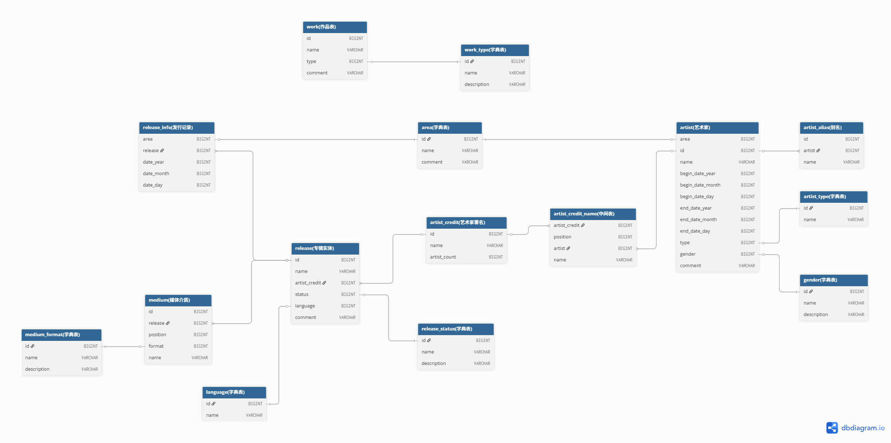

# Homework #1 - SQL

[TOC]

## 一、MusicBrainz 数据集

### 1.1 引言

[MusicBrainz](https://musicbrainz.org/doc/MusicBrainz_Database) 是 音乐领域 开放数据集, 包含了 大量 歌手/乐团 等发布 专辑/单曲 的时间。一部分数据是官方通过 爬虫 爬取的, 一部分是用户自行上传的, 因此相较于业务系统产生的数据, 这类数据最大的特点是: 包含大量的 空值。我们在进行数据分析时, 一般只会选取 有数据 的部分进行分析, 此时 `inner join` 作用就非常大了。也就是说, `inner join` 更适合 OLAP 的场景, 而 `left join` 更适合 OLTP 的场景。当然, 这不绝对。

[CMU15445](https://15445.courses.cs.cmu.edu/) 课程的第一次作业基本都是基于该数据集开展的, 下载地址是 [musicbrainz-cmudb2023.db](https://15445.courses.cs.cmu.edu/spring2026/files/musicbrainz-cmudb2026.db.gz)。下载解压之后的文件名是: `musicbrainz-cmudb2023.db`。这个文件是 SQLite 数据库文件, 可以直接用 SQLite 软件打开。SQLite 数据库虽然支持大部分 SQL 语句, 但是性能远远不如其它数据库, 比方说 DuckDB。课程主推 DuckDB, 经过笔者尝试, 该数据库的性能的确非常好, SQL 优化也非常完善。本文后续的 SQL 都是基于 DuckDB 完成的。

DuckDB 的安装使用方式非常简单, 其可以使用原生的 SQLite 数据库文件。我们在 DBeaver 中安装完成 DuckDB 驱动之后, 就可以直连 `musicbrainz-cmudb2023.db` 文件了, 无需其它操作, 非常方便。这样, 我们预先的准备工作就完成了! 下面, 让我们来看看数据库表的结构。

### 1.2 数据表结构

在 MusicBrainz 数据集中, 有两个非常重要的概念: **专辑实体** (`release`) 和 **艺术家** (`artist`)。下面, 让我们分别来看看这两个概念。

一张 **专辑** (release group) 中有多个 **专辑实体** (`release`)。专辑实体 可以简单理解为商品, 我们在音像店买的光盘或者磁带都属于 专辑实体。一个 专辑实体 包含多次 **发行记录** (`release_info`), 就像书籍会多次印版一样, 分不同 地区 和 时间 生产商品。

音乐发行是依赖介质的, 常见的介质有: 光盘、磁带 等等, 我们可以在 `medium_format` 中查看 MusicBrainz 支持的全部介质。一个 专辑实体 中会包含 多个 **媒体介质** (`medium`)。举例来说, 假设 一个 专辑实体 (商品) 中有 两张光盘、一个磁带 和 一个周边海报, 那么算作三个 媒体介质 (周边不算在其中)。简单来说, 专辑实体 就是 商品, 媒体介质 是 商品 中承载音乐的部分, 发行记录 就是 商品 的生产批次。

一个 专辑实体 会有一个 **艺术家署名** (`artist_credit`), 这个 艺术家署名 中会包含一个或者多个 艺术家。

`release` (专辑实体) 是核心数据表, 和以下数据表之间有关联:

+ 和 `release_info` (发行记录) 之间是 一对多 的关系: `release.id = release_info.release`
+ 和 `medium` (媒体介质) 之间是 一对多 的关系: `release.id = medium.release`
+ 和 `artist_credit` (艺术家署名) 之间是 多对一 的关系: `release.artist_credit = artist_credit.id`

从上面可以看出, `release` 和 `release_info` 之间是 一对多 的关系, 所以将关联信息放在了 `release_info` 数据表中; 同理, `release` 和 `medium` 之间也是 一对多 的关系, 所以将关联信息放在了 `medium` 数据表中。但是, `release` 和 `artist_credit` 之间是 多对一 的关系, 所以将关联信息放在了 `artist_credit` 中。

---

**艺术家** (`artist`) 并不一定是 个人, 还可以是 乐团、合唱团 等其它形式。我们可以在 `artist_type` 中查看所有的类型。"艺术家" 和 "专辑的艺术家署名" 之间是 **多对多** 的关系, 中间表是 `artist_credit_name`。下面是从 `release` 关联到 `artist` 表的方式:

+ `release r` 和 `artist_credit ac` 之间是 多对一 的关系: `r.artist_credit = ac.id`
+ `artist_credit ac` 和 `artist_credit_name acn` 之间是 一对多 的关系: `ac.id = acn.artist_credit`
+ `artist_credit_name acn` 和 `artist a` 之间是 多对一 的关系: `acn.artist = a.id`

很明显, `artist` 和 `artist_credit` 之间是 多对多, `artist_credit_name` 是 中间表, 记录了两者之间的 关联关系。`artist_credit` 和 `release` 之间是 一对多 的关系, 关联信息保存在 `release` 数据表中。那么, `artist` 和 `release` 之间是 多对多 + 一对多 关系的叠加。

上述关系可以用下图表示:



需要注意的是, `work`, `work_type` 和 `artist_alias` 三张表可以不用管, 本作业不会用到。理解上面的关联关系即可。

`dbdiagram.io` 是画 数据库表关系 很好用的工具, 和其它工具相比, 其优势在于: 连接两张表时, 图上即可显示两张表字段的关联状态。但是, 这个工具要收费, 且不记录位置信息。下面是画图的代码:

```dbdiagram
Table "area(字典表)" {
  "id" BIGINT
  "name" VARCHAR
  "comment" VARCHAR
}

Table "artist(艺术家)" {
  "area" BIGINT
    "id" BIGINT
  "name" VARCHAR
  "begin_date_year" BIGINT
  "begin_date_month" BIGINT
  "begin_date_day" BIGINT
  "end_date_year" BIGINT
  "end_date_month" BIGINT
  "end_date_day" BIGINT
  "type" BIGINT
  "gender" BIGINT
  "comment" VARCHAR
}

Table "artist_alias(别名)" {
  "id" BIGINT
  "artist" BIGINT
  "name" VARCHAR
}

Table "artist_credit(艺术家署名)" {
  "id" BIGINT
  "name" VARCHAR
  "artist_count" BIGINT
}

Table "artist_credit_name(中间表)" {
  "artist_credit" BIGINT
  "position" BIGINT
  "artist" BIGINT
  "name" VARCHAR
}

Table "artist_type(字典表)" {
  "id" BIGINT
  "name" VARCHAR
}

Table "gender(字典表)" {
  "id" BIGINT
  "name" VARCHAR
  "description" VARCHAR
}

Table "language(字典表)" {
  "id" BIGINT
  "name" VARCHAR
}

Table "medium(媒体介质)" {
  "id" BIGINT
  "release" BIGINT
  "position" BIGINT
  "format" BIGINT
  "name" VARCHAR
}

Table "medium_format(字典表)" {
  "id" BIGINT
  "name" VARCHAR
  "description" VARCHAR
}

Table "release(专辑实体)" {
  "id" BIGINT
  "name" VARCHAR
  "artist_credit" BIGINT
  "status" BIGINT
  "language" BIGINT
  "comment" VARCHAR
}

Table "release_info(发行记录)" {
  "area" BIGINT
  "release" BIGINT
  "date_year" BIGINT
  "date_month" BIGINT
  "date_day" BIGINT
}

Table "release_status(字典表)" {
  "id" BIGINT
  "name" VARCHAR
  "description" VARCHAR
}

Table "work(作品表)" {
  "id" BIGINT
  "name" VARCHAR
  "type" BIGINT
  "comment" VARCHAR
}

Table "work_type(字典表)" {
  "id" BIGINT
  "name" VARCHAR
  "description" VARCHAR
}

Ref: "release(专辑实体)"."id" < "release_info(发行记录)"."release"
Ref: "release(专辑实体)"."id" < "medium(媒体介质)"."release"
Ref: "medium(媒体介质)"."format" - "medium_format(字典表)"."id"
Ref: "release(专辑实体)"."artist_credit" - "artist_credit(艺术家署名)"."id"
Ref: "artist_credit(艺术家署名)"."id" < "artist_credit_name(中间表)"."artist_credit"
Ref: "artist_credit_name(中间表)"."artist" - "artist(艺术家)"."id"
Ref: "artist(艺术家)"."type" - "artist_type(字典表)"."id"
Ref: "artist(艺术家)"."gender" - "gender(字典表)"."id"
Ref: "release(专辑实体)"."language" - "language(字典表)"."id"
Ref: "release(专辑实体)"."status" - "release_status(字典表)"."id"
Ref: "release_info(发行记录)"."area" - "area(字典表)"."id"
Ref: "artist(艺术家)"."area" - "area(字典表)"."id"
Ref: "artist_alias(别名)"."artist" > "artist(艺术家)"."id"
Ref: "work(作品表)"."type" - "work_type(字典表)"."id"
```

## 二、spring2025

作业地址: [spring2025-hw1](https://15445.courses.cs.cmu.edu/spring2025/homework1/)

### 2.1 第一题

List all the artist types ordered alphabetically.

列举出所有的艺术家类型, 并按照字母序排列。

返回字段信息: name

```SQL
select distinct(name) from artist_type order by name;
```

本题用于测试 准备工作 是否做好。

### 2.2 第二题 (子查询 和 关联查询)

Q2. Find all artists in the `United States` born on July 4th who ever released music in language other than `English`. List them in alphabetical order.

查找所有 7 月 4 日出生于美国, 同时 (ever) 发布了非英语的专辑作品 的歌手。按照字母序排列。

Hints: Only consider the artists with artist type `Person`. `United States` is an area name. If a release is in `[Multiple languages]`, consider it as not `English`.

提示: 只需要考虑 歌手类型是 `Person` 的情况。`United States` 是地名。如果发布的语言是 多语言 `[Multiple languages]`, 认为其不属于 `English`。

返回字段信息: artist_name

我的答案:

```SQL
select 
    name as artist_name -- 输出有八个
from 
    artist
where 
    begin_date_month = 7 and begin_date_day = 4  -- 7 月 4 日出生
    and area = (select id from area where name = 'United States')  -- 出生地是美国
    and type = (select id from artist_type where name = 'Person')  -- 只考虑歌手类型为 Person 的情况
    and exists (  -- 发布了非英语的专辑作品
        select * 
        from 
            release
            inner join artist_credit on release.artist_credit = artist_credit.id
            inner join artist_credit_name on artist_credit.id = artist_credit_name.artist_credit
        where 
            release.language != (select id from language where name = 'English')
            and artist.id = artist_credit_name.artist  -- 相关子查询
    )
order by 
    name asc;
```

标准答案:

```SQL
select distinct a.name as artist_name
from artist a
    join artist_type atype on a.type = atype.id
    join area on a.area = area.id
    join artist_credit_name acn on a.id = acn.artist
    join artist_credit ac on acn.artist_credit = ac.id
    join release r on ac.id = r.artist_credit
    join language l on r.language = l.id
where atype.name = 'Person'
    and area.name = 'United States'
    and a.begin_date_month = 7
    and a.begin_date_day = 4
    and l.name != 'English'
order by artist_name asc;
```

"标准答案" 采用 关联查询, "我的答案" 采用 子查询。"标准答案" 是一种 SQL 编程思想: 不管三七二十一, 能关联的都关联, 条件筛选完成后用 `distinct` 关联词去重就行了。个人建议: 可以先用 子查询 实现, 再改写成 关联查询。

### 2.3 第三题

Q3. Find the ten latest collaborative releases. Only consider the releases with valid release date. Order the results by release date from newest to oldest, and then by release name alphabetically.

查询最新的十张合作专辑实体 (同时只考虑发行日期是有效日期的)。结果集依次按照 发行日期 倒序 和 名称 正序 排列。

Details: A release is collaborative if two or more artists are involved in it. A date is valid if it has non-null values for the year, month, and day. Format the release date in the result as `YYYY-MM-DD`, without adding leading zeros if the month or day is less than `10`.

细节: 一张专辑实体是 "合作" 的含义是至少有两个 艺术家 参与其中。一个日期是 "有效" 的含义是: 年月日都是非空值。将发行日期标准化成 `YYYY-MM-DD`, 同时如果 月/日 小于 10 不需要补前导零。

Hints: The `artist_count` field in `artist_credit` table denotes the number of artists involved in a release.

提示: `artist_credit` 数据表中的 `artist_count` 字段表示 专辑实体 有多少艺术家参与。

返回字段信息: release_date, release_name, artist_count

我的答案:

```SQL
select 
    concat_ws('-', release_info.date_year, release_info.date_month, release_info.date_day) as release_date,
    release.name as release_name,
    artist_credit.artist_count as artist_count
from 
    release
    inner join release_info on release.id = release_info.release
    inner join artist_credit on release.artist_credit = artist_credit.id
where 
    artist_credit.artist_count > 1  -- 合作专辑
    and release_info.date_year is not null and release_info.date_month is not null and release_info.date_day is not null -- 发行日期有效
order by 
    release_info.date_year desc, release_info.date_month desc, release_info.date_day desc,  -- 发行日期排序
    release_name asc 
limit 
    10 offset 0;
```

标准答案:

```SQL
select distinct
    rinfo.date_year || '-' || rinfo.date_month || '-' || rinfo.date_day as release_date,
    r.name as release_name,
    ac.artist_count as artist_count
from release r
    join artist_credit ac on r.artist_credit = ac.id
    join release_info rinfo on r.id = rinfo.release
where ac.artist_count > 1
    and rinfo.date_year is not null
    and rinfo.date_month is not null
    and rinfo.date_day is not null
order by
    rinfo.date_year desc,
    rinfo.date_month desc,
    rinfo.date_day desc,
    r.name asc
limit 10;
```

### 2.4 第四题

Q4. List the releases with the longest names in each CD-based medium format. Sort the result alphabetically by medium format name, and then release name. If there is a tie, include them all in the result.

列举出所有 CD-based 媒体介质中 "名称最长的专辑实体"。如果存在并列的情况 (有多个专辑实体的名称一样长), 那么需要列举出所有的结果。结果按照 媒体介质名称 和 专辑实体名称 升序排列。

Details: A medium is considered CD-based if its format name contains the word `CD`.

细节: 如果媒体介质的名称中包含 `CD`, 那么我们认为其是 CD-based 的。

返回字段信息: format_name, release_name

我的答案:

```SQL
with max_table as (  -- 一个 媒体介质 中所有 专辑实体 名称的最大字符数
    select 
        medium.format as format_id, 
        max(char_length(release.name)) as max_length 
    from 
        release 
        inner join medium on release.id = medium.release
    group by 
        medium.format
)

select distinct 
    medium_format.name as format_name,
    release.name as release_name
from 
    release 
    inner join medium on release.id = medium.release
    inner join medium_format on medium.format = medium_format.id
where 
    medium_format.name like '%CD%'  -- CD-based
    and char_length(release.name) = (
        select max_length
        from max_table 
        where medium_format.id = max_table.format_id  -- 相关子查询
    ) 
order by 
    format_name asc, release_name asc;

-- SQLite: 需要将 char_length 函数改成 length 函数
```

标准答案:

```SQL
select distinct mf.name as format_name,
    r.name as release_name
from medium_format mf
    join (
        select mf.id as format_id,
            max(length(r.name)) as max_len
        from medium_format mf
            join medium m on mf.id = m.format
            join release r on m.release = r.id
        where mf.name like '%CD%'
        group by mf.id
    ) mfmx on mf.id = mfmx.format_id
    join medium m on mf.id = m.format
    join release r on m.release = r.id
where length(r.name) = mfmx.max_len
order by mf.name asc,
    r.name asc;
```

注意: SQLite 中没有 `char_length` 函数, 只有 `length` 函数。DuckDB 运行的效率是 SQLite 的几倍!!!

### 2.5 第五题 (横向连接)

Q5. Find the 11 artists who released most christmas songs. For each artist, list their oldest five releases in November with valid release date. Organize the results by the number of each artist's christmas songs, highest to lowest. If two artists released the same number of christmas songs, order them alphabetically. After that, organize the release name alphabetically, and finally by the release date, oldest to newest.

首先, 查找 11 个发布最多 圣诞歌曲 的艺术家。然后, 对于每一个艺术家, 列举出他们在 11 月发布的最早的专辑实体。返回的结果集排序方式: (1) 根据 圣诞歌曲 的数量倒序排列; (2) 艺术家的名称正序排列; (3) 专辑实体正序排序; (4) 发行日期正序排列。

Details: Only consider `Person` artists. A release is a christmas song if its name contains the word `christmas`, case-insensitively. When finding the 11 artists, if there's a tie, artists who comes first in alphabetical order takes the priority. A date is valid if it has non-null values for the year, month, and day. When counting the number of christmas songs, simply count the number of distinct release IDs. However, when finding the five oldest releases in November, releases with same name and date are considered the same. If some of the 11 artists wrote releases less than five in November, just include all of them. Format release date in the result as `YYYY-MM-DD`, without adding a leading zero if the month or day is less than `10`.

细节: (1) 只考虑类型为 `Person` 的艺术家; (2) 圣诞歌曲 的判定方式: 专辑实体名称中包含 `christmas` (不区分大小写); (3) 如果有多名艺术家发布了相同数量的 圣诞歌曲, 按照艺术家名称排序然后取靠前的; (4) 日期判定有效的方式: 年月日都不是 `null` 空值; (5) 在统计艺术家的 圣诞歌曲 数时, 只需要简单的 根据 专辑实体 id 去重计数即可; (6) 但是在统计 11 月份发布的最早专辑实体时, 相同名称和发行日期的专辑实体视为同一个专辑实体; (7) 如果艺术家们在 11 月发行的专辑实体数量小于 5, 那么将它们全部列出即可; (6) 发行日期按照 `YYYY-MM-DD` 组织, 同时不用加前缀零。

Hints: You might find Lateral Joins in DuckDB useful: find out the 11 artists first, and then use lateral join to find their oldest five releases.

提示： 你可以考虑在 DuckDB 中使用 **横向连接** (Lateral Join): 先找出前 11 位艺术家，然后用横向连接为每位艺术家找出他们最早的五张 11 月发行。

返回的字段信息: `artist_name`, `release_name`, `release_date`

我的答案:

```SQL
with 
    -- Find the 11 artists who released most christmas songs.
    t1 as (
        select 
            artist.id as artist_id, 
            artist.name as artist_name, 
            -- when counting the number of christmas songs, simply count the number of distinct release IDs.
            count(distinct release.id) as num_christmas
        from 
            release 
            inner join artist_credit on release.artist_credit = artist_credit.id 
            inner join artist_credit_name acn on acn.artist_credit = artist_credit.id
            inner join artist on acn.artist = artist.id 
        where 
            -- a release is a christmas song if its name contains the word `christmas`, case-insensitively
            lower(release.name) like '%christmas%'
            -- only consider `Person` artists
            and artist.type = (select id from artist_type where artist_type.name = 'Person')
        group by 
            artist.id, artist.name
        order by 
            -- when finding the 11 artists, if there's a tie, artists who comes first in alphabetical order takes the priority.
            num_christmas desc, artist_name asc 
        limit 
            11 offset 0
    ), 
    
    -- list their oldest five releases in November with valid release date.
    t2 as (
        select 
            * 
        from (
            select 
                release.name as release_name, 
                acn.artist as artist_id, 
                release_info.date_year as release_year, 
                release_info.date_month as release_month, 
                release_info.date_day as release_day,
                row_number() over(partition by artist_id order by release_year asc, release_month asc, release_day asc, release_name asc) as rn 
            from 
                release 
                inner join release_info on release_info.release = release.id 
                inner join artist_credit on release.artist_credit = artist_credit.id 
                inner join artist_credit_name acn on acn.artist_credit = artist_credit.id
            where 
                release_info.date_month = 11
                -- a date is valid if it has non-null values for the year, month, and day.
                and release_info.date_year is not null and release_info.date_day is not null -- 有效日期
            group by
                -- when finding the five oldest releases in November, releases with same name and date are considered the same.
                release.name,
                acn.artist,
                release_info.date_year,
                release_info.date_month,
                release_info.date_day
        ) t 
        where 
            rn < 6
    )

select 
    t1.artist_name, 
    t2.release_name,
    concat_ws('-', t2.release_year,  t2.release_month, t2.release_day) as release_date,
from 
    t1
    inner join t2 on t1.artist_id = t2.artist_id
    -- cross join lateral (select * from t2 where t1.artist_id = t2.artist_id) t2
order by
    t1.num_christmas desc, 
    t1.artist_name asc, 
    t2.release_name asc, 
    t2.release_year asc, 
    t2.release_month asc, 
    t2.release_day asc;
```

标准答案:

```SQL
select artist_name,
    release_name,
    release_year || '-' || release_month || '-' || release_day as release_date
from (
    select a.id as artist_id,
        a.name as artist_name,
        count(distinct r.id) as release_count
    from artist a
        join artist_type atype on a.type = atype.id
        join artist_credit_name acn on a.id = acn.artist
        join artist_credit ac on acn.artist_credit = ac.id
        join release r on ac.id = r.artist_credit
    where
        atype.name = 'Person'
        and lower(r.name) like '%christmas%'
    group by a.id,
        a.name
    order by release_count desc,
        a.name asc
    limit 11
) t1, lateral (
    select distinct r.name as release_name,
        rinfo.date_year as release_year,
        rinfo.date_month as release_month,
        rinfo.date_day as release_day
    from artist_credit_name acn
        join artist_credit ac on acn.artist_credit = ac.id
        join release r on ac.id = r.artist_credit
        join release_info rinfo on r.id = rinfo.release
    where acn.artist = t1.artist_id
        and rinfo.date_year is not null
        and rinfo.date_month = 11
        and rinfo.date_day is not null
    order by rinfo.date_year asc,
        rinfo.date_month asc,
        rinfo.date_day asc
    limit 5
) t2
order by t1.release_count desc,
    t1.artist_name asc,
    t2.release_name asc,
    t2.release_year asc,
    t2.release_month asc,
    t2.release_day asc;
```

这题是想考察 `lateral join`。我使用了非 `lateral join` 实现了, 注意两者的区别, `lateral join` + `order by` + `limit` 可以轻松实现 Top N 问题。

### 2.6 第六题 (横向连接 与 窗口函数)

Q6. Find the artists in the `United States` whose last release and second last release were both in 1999. Order the result by artist name, last release name, and second last release name alphabetically.

查找 `United States` 的艺术家, 它们 最后两次 发行专辑实体记录都在 1999 年。按照 艺术家名字、最后一张专辑名称、倒数第二张专辑名称 升序 (字母序) 排列。

Details: If there are releases with identical names and dates by the same artist, treat them as a single release and avoid duplicate entries. Only consider releases with a valid date. A date is valid if it has non-null values for the year, month, and day. If two releases occurred on the same date, we consider the release with the name that comes first in alphabetical order as the first release.

细节: 根据 艺术家、专辑实体名称 和 发行日期 去重。仅保留 有效 (非空) 日期的记录。相同日期的专辑实体按照 名称 排序。

输出字段: `artist_name`, `last_release_name`, `second_last_release_name`

我的答案:

```SQL
with 
    t_main as (  -- 总表, 能关联的尽可能关联
        select distinct
            artist.id as artist_id,
            release.name as release_name,
            release_info.date_year as release_year,
            release_info.date_month as release_month,
            release_info.date_day as release_day
        from 
            release 
            inner join artist_credit on release.artist_credit = artist_credit.id 
            inner join artist_credit_name acn on acn.artist_credit = artist_credit.id
            inner join artist on acn.artist = artist.id 
            inner join release_info on release_info.release = release.id 
        where 
            release_info.date_year is not null 
            and release_info.date_month is not null 
            and release_info.date_day is not null 
            and artist.area = (select id from area where name = 'United States')
    )

select 
    artist.name as artist_name, 
    max(case when rn = 1 then t.release_name end) as last_release_name,  -- 行转列
    max(case when rn = 2 then t.release_name end) as second_last_release_name  -- 行转列
from 
    artist
    cross join lateral (
        select 
            t_main.release_name, 
            t_main.release_year,
            row_number() over(
                order by t_main.release_year desc, t_main.release_month desc, t_main.release_day desc, t_main.release_name desc
            ) as rn
        from 
            t_main 
        where 
            t_main.artist_id = artist.id
        limit  -- row_number 中已经排序了, 这里就不需要再进行排序了
            2 offset 0 
    ) t 
group by 
    artist.id, artist.name 
having 
    count(1) = 2  -- 这里是一个坑
    and min(t.release_year) = 1999 
    and max(t.release_year) = 1999
order by 
    artist_name, last_release_name, second_last_release_name
;
```

标准答案:

```SQL
with cte_two_last_releases as (
select artist_id,
    release_name,
    release_year,
    row_number() over (
        partition by artist_id 
        order by release_year desc, 
            release_month desc,
            release_day desc, 
            release_name desc
    ) as row_number
from (
    select distinct a.id as artist_id,
        r.name as release_name,
        rinfo.date_year as release_year,
        rinfo.date_month as release_month,
        rinfo.date_day as release_day
    from artist a
        join area on a.area = area.id
        join artist_credit_name acn on a.id = acn.artist
        join artist_credit ac on acn.artist_credit = ac.id
        join release r on ac.id = r.artist_credit
        join release_info rinfo on r.id = rinfo.release
    where area.name = 'United States'
        and rinfo.date_year is not null
        and rinfo.date_month is not null
        and rinfo.date_day is not null
)
), cte_last_release as (
    select * from cte_two_last_releases where row_number = 1
), cte_second_last_release as (
    select * from cte_two_last_releases where row_number = 2
)
select a.name as artist_name,
    lr1.release_name as last_release_name,
    lr2.release_name as second_last_release_name
from artist a
    join cte_last_release lr1 on a.id = lr1.artist_id
    join cte_second_last_release lr2 on a.id = lr2.artist_id
where lr1.release_year = 1999
    and lr2.release_year = 1999
order by artist_name asc,
    last_release_name asc,
    second_last_release_name asc;
```

"标准答案" 采用 窗口函数 + `inner join` 的方式 进行 "列转行", 个人不太喜欢这种方式, 如果是 10 条记录转 10 个字段呢? 经过探索, 横向连接 + 窗口函数 + 聚合 max 函数的形式更好。`lateral join` 中可以使用 窗口函数 还是很不错的!

### 2.7 第七题: 自关联 与 子查询

Q7. Find the ten youngest collaborators of the `Pittsburgh Symphony Orchestra`. Exclude the `Pittsburgh Symphony Orchestra` itself from the final result. Organize the result by the collaborator's begin date, youngest to oldest, and then alphabetical order on their names. Only consider the artists with valid `begin_date`.

`Pittsburgh Symphony Orchestra` 是 [匹兹堡交响乐团](https://en.wikipedia.org/wiki/Pittsburgh_Symphony_Orchestra), 其成立于 1895 年美国的 宾夕法尼亚州 匹兹堡市。我们现在需要找出 匹兹堡交响乐团 最年轻的 10 个 "合作者"。当然, 返回的结果需要排除 匹兹堡交响乐团 本身, 同时依次按照 成立日期 降序、名称 升序排列。排除 `begin_date` 是无效的 "合作者"。(`youngest` 的含义是 最年轻, 对应的成立日期最大。)

Details: An artist is considered a collaborator if they appear in the same artist credit. An artist is younger than another if they has later `begin_date`. A date is valid if it has non-null values for the year, month, and day. Format the begin date as `YYYY-MM-DD`, without adding a leading zero if the month or day is less than `10`. Please always use the `name` field in the `artist` table when searching for a specific artist name.

细节: (1) 一个 "艺术家" 被认为是 "合作者" 的条件: 它们出现在同一个 "艺术家署名" 中; (2) 一个 "艺术家" 被认定为 "年轻" 的条件: 它们的 `begin_date` 更加靠前; (3) 日期判定 和 输出格式 和之前的一样; (4) 请使用 `artist` 表中的 `name` 字段取搜索 "艺术家" 的姓名。

输出字段: `collaborator_name`, `begin_date`

我的答案:

```SQL
select distinct
    a.name as collaborator_name,
    concat_ws('-', a.begin_date_year, a.begin_date_month, a.begin_date_day) as begin_date,
from 
    artist_credit ac 
    inner join artist_credit_name acn on ac.id = acn.artist_credit
    inner join artist a on acn.artist = a.id
where 
    ac.id in (
        select 
            distinct artist_credit 
        from 
            artist_credit_name
        where 
            artist = (select id from artist where name = 'Pittsburgh Symphony Orchestra')
    )
    and a.begin_date_year is not null 
    and a.begin_date_month is not null
    and a.begin_date_day is not null
    and a.id != (select id from artist where name = 'Pittsburgh Symphony Orchestra')
order by 
    a.begin_date_year desc, a.begin_date_month desc, a.begin_date_day desc,
    collaborator_name
limit 
    10 offset 0
;
```

标准答案:

```SQL
select distinct a2.name as collaborator_name,
    a2.begin_date_year || '-' || a2.begin_date_month || '-' || a2.begin_date_day as begin_date
from artist a
    join artist_credit_name acn on a.id = acn.artist
    join artist_credit ac on acn.artist_credit = ac.id
    join artist_credit_name acn2 on ac.id = acn2.artist_credit
    join artist a2 on acn2.artist = a2.id
where
    a.name = 'Pittsburgh Symphony Orchestra'
    and acn2.artist <> a.id
    and a2.begin_date_year is not null
    and a2.begin_date_month is not null
    and a2.begin_date_day is not null
order by a2.begin_date_year desc,
    a2.begin_date_month desc,
    a2.begin_date_day desc,
    a2.name asc
limit 10;
```

这个题目应该是想考察 "自关联", 但是完全可以用 子查询 去实现。"自关联" 的方式太 "变态" 了, `artist` 和 `artist_credit_name` 数据表都关联了两遍, 很难表述清楚它们的意思。但是如果有 子查询 SQL, 那么也很容易理解: `a join acn` 对应 `in` 子查询中的内容, `ac join acn2 join a2` 对应 `from` 从句中内容。

### 2.8 第八题

Q8. For each area, find the language with most releases from the artists in that area. Only include the areas where the most popular language has minimum of 5000 releases (inclusive). Arrange the results in descending order based on the release count (per language per area), and in alphabetical order by area name.

对于每一个地区, 查询艺术家发行专辑最多的语言。结果集的要求: (1) 如果该地区最热门语言发行的专辑数小于 5000, 那么就筛选掉; (2) 结果集依次按照 发行数倒序、地区名称正序 排列。

Details: When counting the number of releases, count the number of distinct release ids. If two areas have different ids with same names, treat them as the same area. When selecting the most popular language for each area, if there is a tie, choose the one which its language name comes first alphabetically. Note that we are interested in the area of artists, not the area of releases.

细节: (1) 在统计专辑发行数量时, 直接 `count(distinct release.id)` 即可; (2) 如果两个地区的 ID 不同但是名称相同, 认为它们是同一个地区, 也就是说 `group by area.name` 即可; (3) 如果两个语言发行的专辑数量相同, 那么按照名称字母序保留一个即可; (4) 我们关注的是 艺术家 的地区, 不是 专辑发行 的地区, 也就是说, 使用 `artist` 表中的 `area` 字段, 而不是 `release_info` 表中的 `area` 字段。

输出的字段信息: `area_name`, `language_name`, `release_count`

我的答案:

```SQL
select 
    area_name,
    language_name,
    release_count
from (
    select 
        area.name as area_name, 
        language.name as language_name, 
        count(distinct r.id) as release_count,
        row_number() over(
            partition by area_name
            order by release_count desc, language_name
        ) as rn
    from 
        release r
        inner join artist_credit ac on ac.id = r.artist_credit
        inner join artist_credit_name acn on acn.artist_credit = ac.id
        inner join artist a on a.id = acn.artist
        inner join area on area.id = a.area
        inner join language on language.id = r.language
    group by 
        area.name, language.name
    having 
        release_count > 5000
) t 
where 
    rn = 1
order by 
    release_count desc, area_name;
```

标准答案:

```SQL
select area_name,
    language_name,
    release_count
from (
    select area_name,
        language_name,
        release_count,
        row_number() over (
            partition by area_name
            order by release_count desc,
                language_name asc) as row_number
    from (
        select distinct area.name as area_name,
            l.name as language_name,
            count(distinct r.id) as release_count
        from area
            join artist a on area.id = a.area
            join artist_credit_name acn on a.id = acn.artist
            join artist_credit ac on acn.artist_credit = ac.id
            join release r on ac.id = r.artist_credit
            join language l on r.language = l.id
        group by area_name,
            language_name
    )
)
where row_number = 1
    and release_count >= 5000
order by release_count desc,
    area_name asc;
```

### 2.9 第九题

Q9. For each decade from 1950s to 2010s (inclusive), count the number of non-US artists who has a US release in the same decade with their retirement. Order the result by decade, from oldest to newest.

在 1950 到 2019 年的区间内, 每十年称为一个 "年代"。统计每一个年代艺术家的数量, 对艺术家的限定有: (1) 非美国地区的; (2) 已经退休的; (3) 退休所在的年代里发行过一张美国专辑。按照 年代 升序排列。

Details: Print the decade in a string format like `1950s`. Use `end_date_year` to decide the retirement year.

细节: "年代" 的表述方式为 `1950s`, 使用 `end_date_year` 表示退休年份。

输出字段信息: `decade`, `release_count`

我的答案:

```SQL
select 
    printf('%ds', a.end_date_year // 10 * 10) as decade, 
    count(1) as release_count
from 
    artist a
where 
    end_date_year between 1950 and 1969 
    and area != (select id from area where name = 'United States')  -- non-US artists
    and exists (
        select 1
        from 
            release r
            inner join release_info ri on r.id = ri.release
            inner join artist_credit ac on ac.id = r.artist_credit
            inner join artist_credit_name acn on acn.artist_credit = ac.id
        where 
            acn.artist = a.id  -- 相关子查询
            and ri.area = (select id from area where name = 'United States')
            and ri.date_year between 1950 and 1969
            -- 速度慢的根源
            and a.end_date_year // 10 = ri.date_year // 10
    )
group by 
    decade
order by 
    decade asc;
```

标准答案:

```SQL
with release_cte as (
    select distinct
        area.id as release_area_id,
        r.artist_credit as release_artist_credit,
        cast(rinfo.date_year // 10 * 10 as varchar) || 's' as release_decade
    from release r
        join release_info rinfo on r.id = rinfo.release
        join area on rinfo.area = area.id
    where
        rinfo.date_year >= 1950
        and rinfo.date_year <= 1969
        and area.name = 'United States'
)
select release_decade,
    count(distinct a.id) as artist_count
from release_cte r
    join artist_credit ac on r.release_artist_credit = ac.id
    join artist_credit_name acn on ac.id = acn.artist_credit
    join artist a on acn.artist = a.id
    join area on a.area = area.id
where a.area != release_area_id
    -- 速度慢的根源
    and cast(a.end_date_year // 10 * 10 as varchar) || 's' = release_decade
group by release_decade
order by release_decade asc;
```

本题设定的时间范围是 1950 至 2019 年之间。经过测试, 在 16 GB 的计算机上无法运行, 内存不够用。问题出现在: 退休年代 和 专辑发行年代 需要相同, 只要去掉这个条件, 就可以很快计算出来。也就是说, 如果将 "我的答案" 中 `and a.end_date_year // 10 = ri.date_year // 10` 去掉, 或者将 "标准答案" 中 `and cast(a.end_date_year // 10 * 10 as varchar) || 's' = release_decade` 去掉, 都可以很快计算出结果。为了避免内存占用过大的问题, 我将时间段调整为 1950 至 1969 之间。

调整完成之后, 我发现另一个问题: "我的答案" 比 "标准答案" 慢很多, 这需要分析执行计划, 这里就不过多深究了。

### 2.10 第十题: 数组聚合

Q10. Find all releases before 1950 (inclusive) created by artists from multiple areas. Exclude if at least one of its artists are from the United States. For each release, print the release name, year, the number of distinct areas where its artists are from, and the list of area names in alphabetical order, separated by commas. Order the result by the area count, highest to lowest, and then by the release year, oldest to newest, and then by the release name alphabetically.

找到 1950 年以及之前发布的, 由多个地区艺术家创作的, 不包含美国艺术家的 专辑实体。输出内容包括: 专辑实体的名称, 发布年份, 不同艺术家地区的数量, 艺术家地区名称列表 (字母序, 逗号拼接的字符串)。根据 地区数量 倒序、发布日期 正序、专辑名称 正序 排列。

输出的字段信息: `release_name`, `release_year`, `artist_area_count`, `artist_area_names`

我的答案:

```SQL
with 
    t_release_artist_areas as (
        select distinct 
            r.id as release_id,
            r.name as release_name,
            ri.date_year as release_year, 
            area.name as area_name
        from
            release r
            inner join release_info ri on ri.release = r.id
            inner join artist_credit ac on r.artist_credit = ac.id
            inner join artist_credit_name acn on ac.id = acn.artist_credit
            inner join artist a on acn.artist = a.id
            inner join area on a.area = area.id
        where 
            ri.date_year <= 1950
)

select 
    release_name,
    release_year,
    count(1) as artist_area_count,
    string_agg(area_name, ',' order by area_name) as artist_area_names
from 
    t_release_artist_areas
group by 
    release_id, release_name, release_year
having 
    artist_area_count > 1
    -- Exclude if at least one of its artists are from the United States.
    and not array_contains(array_agg(area_name), 'United States')  -- duckdb 等支持 array 类型的数据库
order by 
    artist_area_count desc, release_year asc, release_name asc;
```

标准答案:

```SQL
with multi_area_releases as (
    select *
    from (
        select release_id,
            count(distinct artist_area_name) as artist_area_count,
            group_concat(artist_area_name, ',' order by artist_area_name) as artist_area_names
        from (
            select distinct r.id as release_id,
                area.name as artist_area_name
            from release r
                join release_info rinfo on r.id = rinfo.release
                join artist_credit ac on r.artist_credit = ac.id
                join artist_credit_name acn on ac.id = acn.artist_credit
                join artist a on acn.artist = a.id
                join area on a.area = area.id
            where rinfo.date_year <= 1950
        )
        group by release_id
    )
    where artist_area_count > 1
)
select
    r.name as release_name,
    rinfo.date_year as release_year,
    artist_area_count,
    artist_area_names
from multi_area_releases mar
    join release r on mar.release_id = r.id
    join release_info rinfo on r.id = rinfo.release
where artist_area_names not like '%United States%'
order by artist_area_count desc,
    release_year,
    release_name;
```

这道题目还是很简单的, 注意 `'United States'` 筛选时机即可。DuckDB 是支持 `array` 类型的, 个人认为, 使用 `array_agg` + `array_contains` 进行筛选 比 `string_agg` + `like` 更好。
